# [Jmeter接口测试之案例实战](https://www.cnblogs.com/balllyh/p/9474372.html)

Jmeter是apacheg公司基于Java开发的一款开源的压力测试工具，安装Jmeter之前先安装Jdk,具体JDK安装和环境变量配置自行百度。这里不概述。

# 1.添加线程组

**测试计划->添加->Threads->线程组**

线程组相当于有多个用户,同时去执行相同的一批次任务。每个线程之间都是隔离的，互不影响的。一个线程的执行过程中，操作的变量，不会影响其他线程的变量值

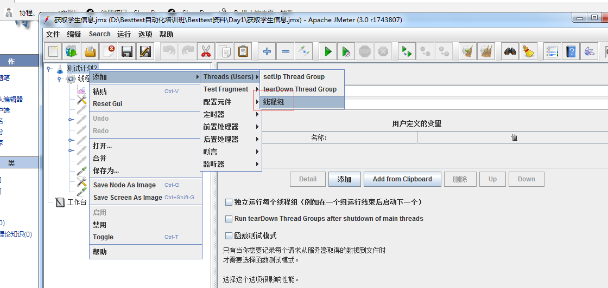

# 2.添加HTTP请求

**线程组->添加->Sampler->HTTP请求**

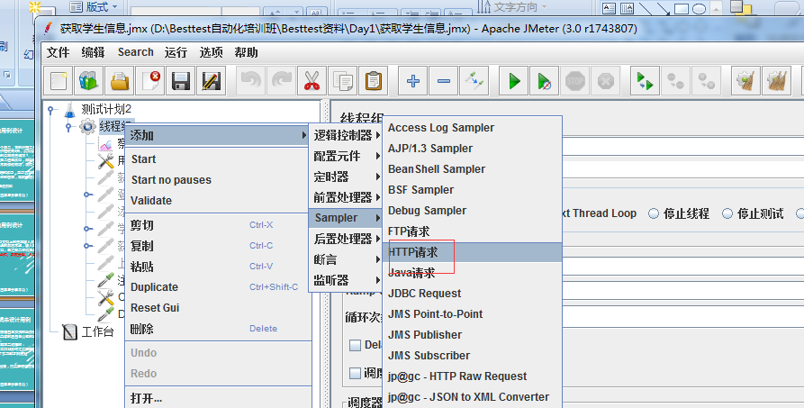

# 3.获取所有学生接口

接口文档描述如下：

**简要描述：**

- 获取学生信息接口

**请求URL：**

- `http://api.nnzhp.cn/api/user/stu_info`

**请求方式：**

- GET

**请求参数：**

**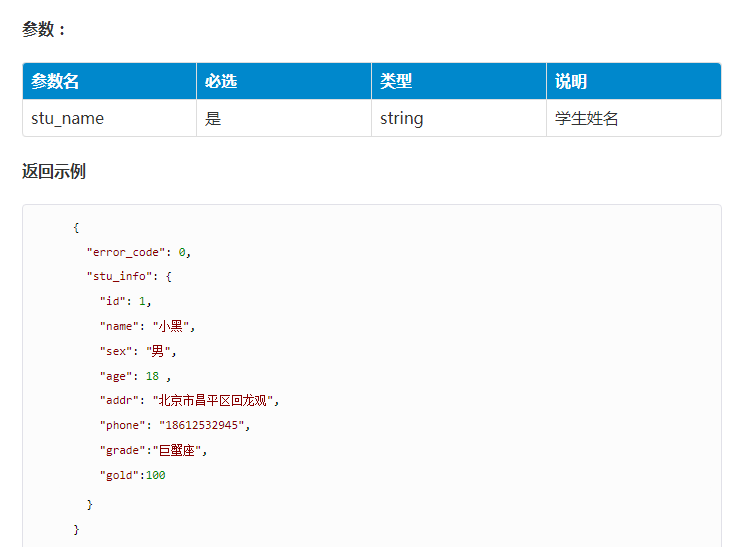**

 

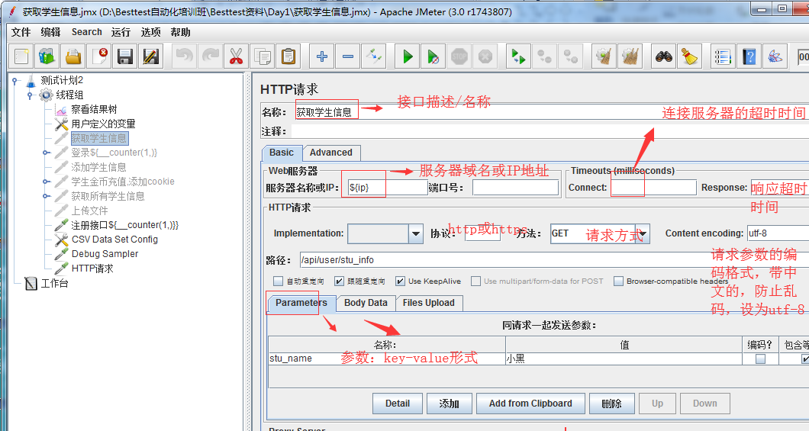

**添加察看结构树查看程序响应数据，线程组->添加->监听器->察看结果树，如下图：**

**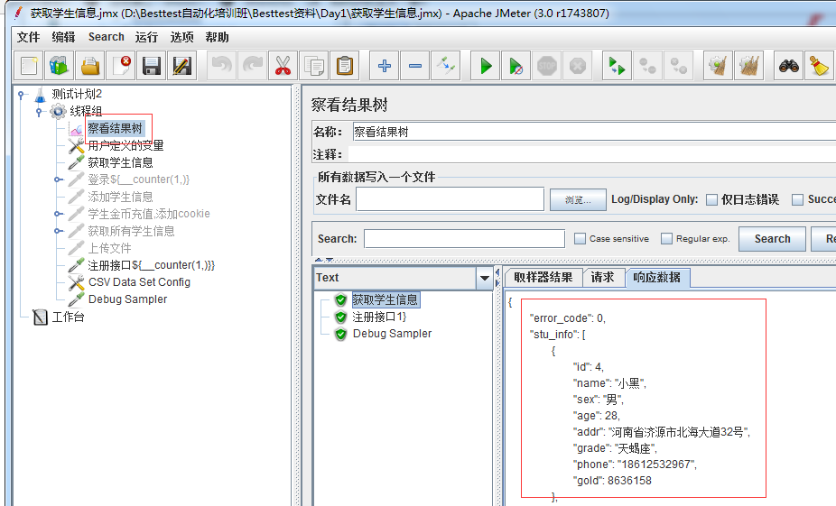**

 

## 3.1 Jmeter察看结果树中乱码：

**（1）在jmeter的bin目录下找到jmeter.properties这个文件添加：sampleresult.default.encoding=utf-8**

**（2）重启jmeter**

**Jmeter body data里面有乱码怎么解决**

**（1）在jmeter的bin目录下找到jmeter.properties这个文件添加：jsyntaxtextarea.font.family=Hack**

**（2）重启jmeter**

## 3.2 Jmeter参数化

　　所有的接口测试的访问域名和端口都一样时，一旦服务器地址变更，修改每个接口的IP或域名很费事的。我们可以将其参数化，方便操作

（1）用户定义的变量

　　定义变量，填写正确的值，通过名称调用，调用格式为**${IP}，**IP也可以通过HTTP请求默认值设置

　　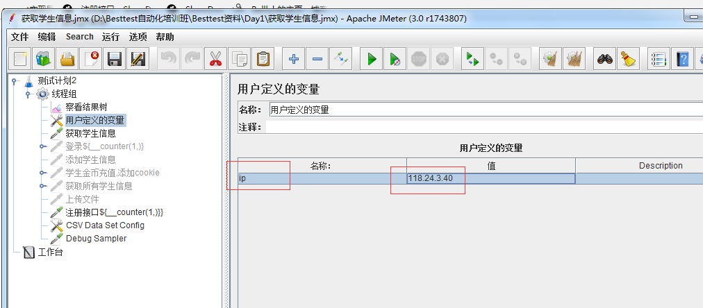

（2）选项-函数助手对话框中的函数

- __Random（随机数）：random设置取值范围，填写值后，点击生成，调用时直接复制函数字符串即可，随机取值。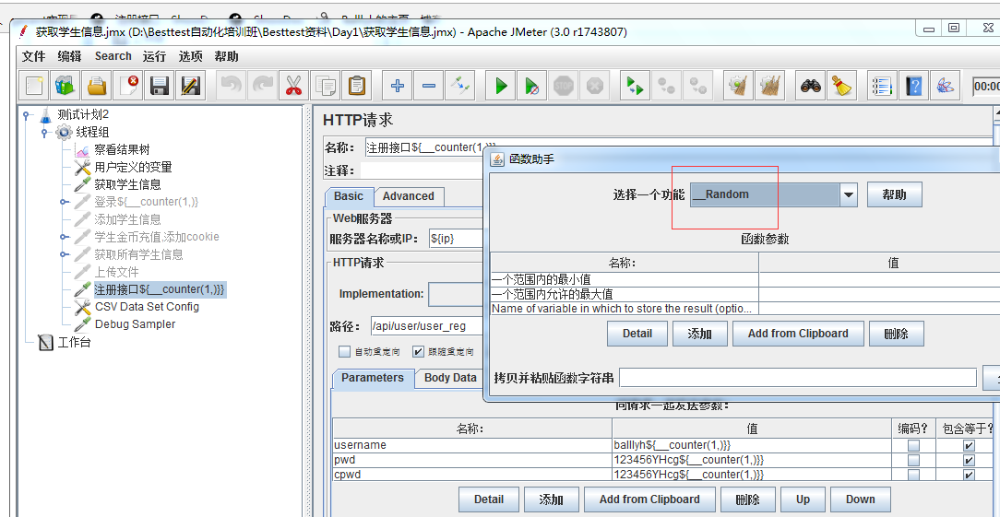
- __counter（自增）：counter设置起始值无效，设置结束值无效，默认就是从1开始，只能通过线程数控制执行次数，填写值后，点击生成，调用时直接复制函数字符串即可！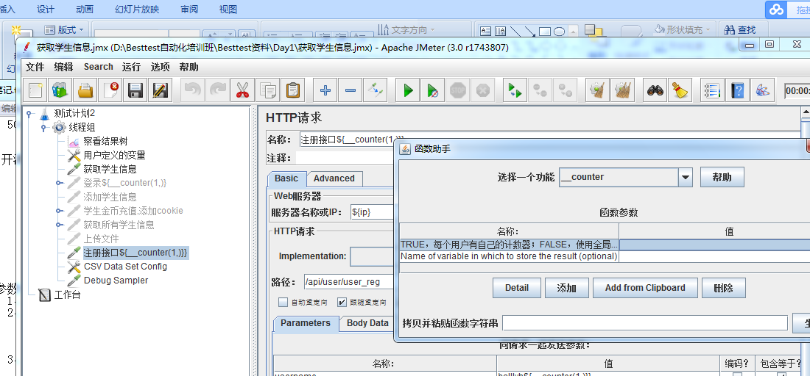
- __time（时间）：时间戳${_time(,)}，时间戳表示从计算机发明那一天到现在过了多少秒，去掉后三位，再用转化器转化到现在的时分秒。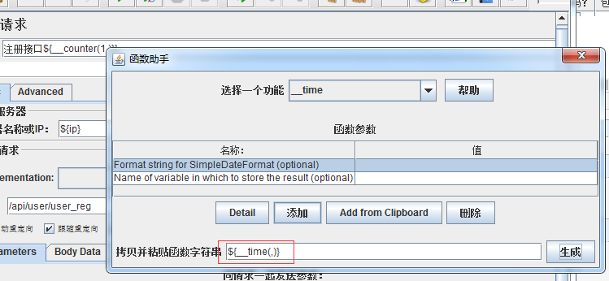
- 使用当时时间${__time(YYYYMMdd-HH:mm:ss,)}

 　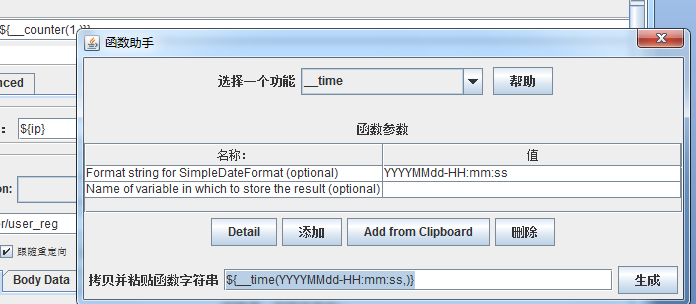

（3）从文件中读取参数：

　　首先，点击线程组->添加->配置原件->CSV Data Set Config

　　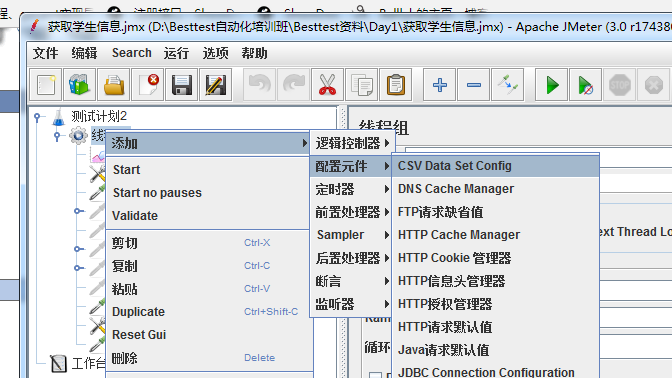

　　第二步，准备文件，设置参数化变量名称，文件路径等。读取文件中的数据时，使用数据对应的变量名，**格式为${studi},${gold}**

　　　　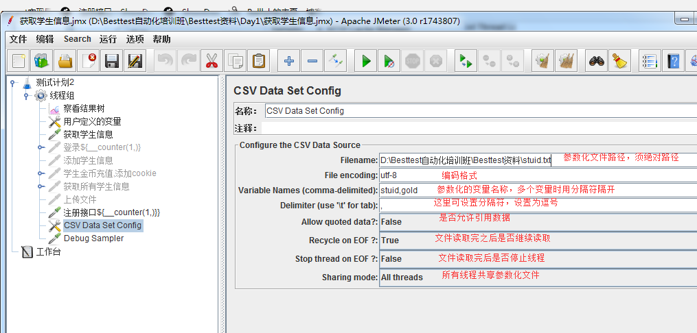 　　　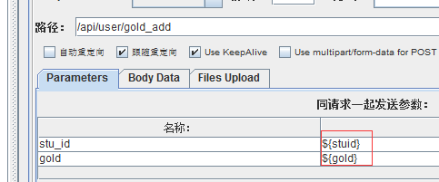　　　　

## 3.3 关联

　　Jmeter中，用jp@gc-JSON PATH Extrator插件，可以获取上个接口的响应数据，用在第二个接口中。

　　举例：如何从JSON响应结果中获取登录接口的Sign值，Json中的数据整体是一个字典，字典dict嵌套list，list又嵌套字典dict.

　　按下标法取值，login_info是字典的第二个元素即dict.login_info.sign/dict["login_info"]["sign"]

　　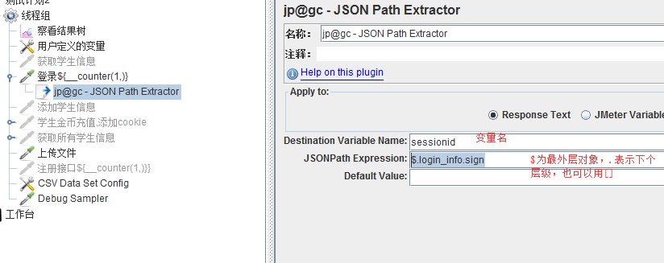

　　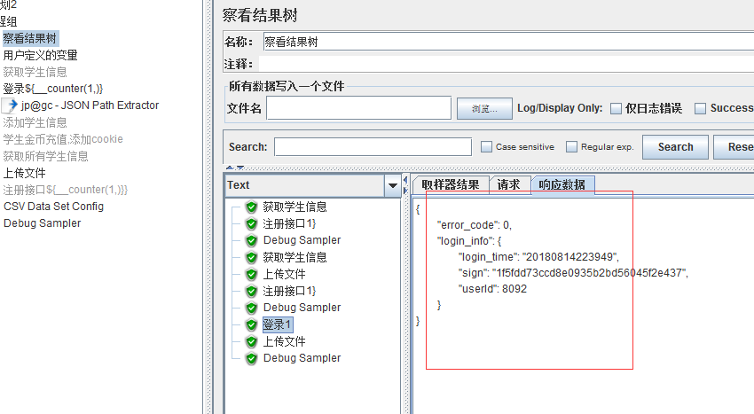

 

## 3.4上传文件

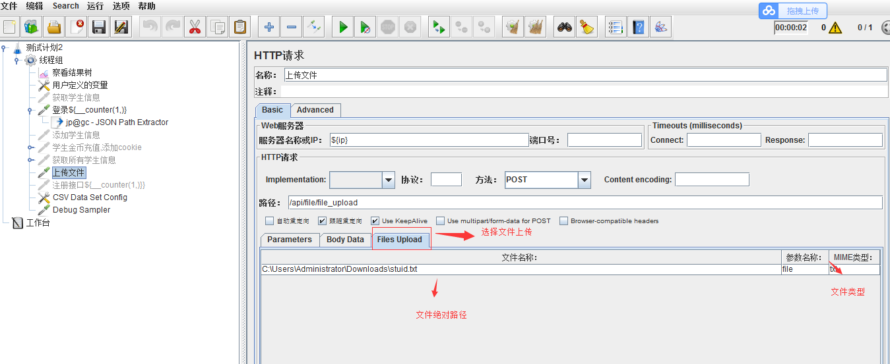

 