# Day22 实战篇 ——Jmeter性能测试实战——JMeter执行原理、Jmeter性能测试实战、下载使用PerfMon插件、 Grafana可视化展示

[TOC]


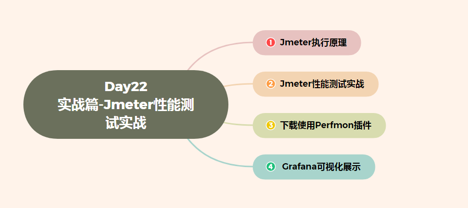


## 一、Jmeter执行原理

JMerer通过线程组来驱动多个(也可以理解为LR的虚拟用户)运行测试脚本对目标服务器发起大量的网络请 求，在每个客户端上可以运行多个线程组，也就是说一个测试计划可以包含N个线程组。

 

线程数 一个线程可以理解为对应模拟一个用户，所以线程数越多，那么也就认为可以模拟的用户数越多。

 Ramp-Up时间(秒) 该属性指的是所有线程从启动到开始运行的时间间隔，单位是秒，也就是说所有线程在多长时间内开始执行，如线 程数设置50，设置的时间为5秒，那么计算的公式为:

 

```
每秒执行线程数=线程数/Ramp-Up
```

 

具体如： 如设置的线程数为50，Ramp-up的时间为10，那么也就是说开启执行后，每秒会启动5个线程，如果Ramp-Up设置为 0，那么开始执行后，50个线程会⽴刻启动。


 **基本概念：**

**1.线程组N**：代表一定数量的并发用户，所谓并发就是指同一时刻访问发送请求的用户。线程组就是模拟并发用户访问。

**2.Ramp-Up Period(in seconds)：**建立所有线程的周期，就是告诉jmeter要在多久没启动所有线程，保证在最后一个线程启动时，第一个线程还在运行中，已达到压测的目的。

默认值为0，意味着jmeter执行测试立即就要启动完所有线程发送请求，很容易导致服务器过载，这是不合理的，我们想要的应该是逐渐增加用户访问量达到峰值。

若设置为Ts，意味着每隔T/NS建立一个线程，在T秒内建立完所有线程。

**3.循环次数A：**指在一个线程在持续时间内发送请求的次数,压测时，循环次数设置为永远。

**4.调度器->持续时间:**模拟用户并发行为持续的时间，也就是脚本持续运行的时间，一般是10分-20分钟。

**5.调度器->启动延迟:**意味着在多久后模拟用户并发开始，也就是脚本启动延迟的时间，点击启动后，还是默认等到延迟时间到达后才启动。

**6.启动时间，结束时间：**可以设置脚本启动和结束时间，相当于定时，设置好，运行结束后自动报名结果。


## 二、Jmeter性能测试实战 

我们以百度实战为例

1、在线程里面创建一个新的【线程组】，在【线程组】添加里面找到【取样器】，创建一新的【HTTP请求】

 

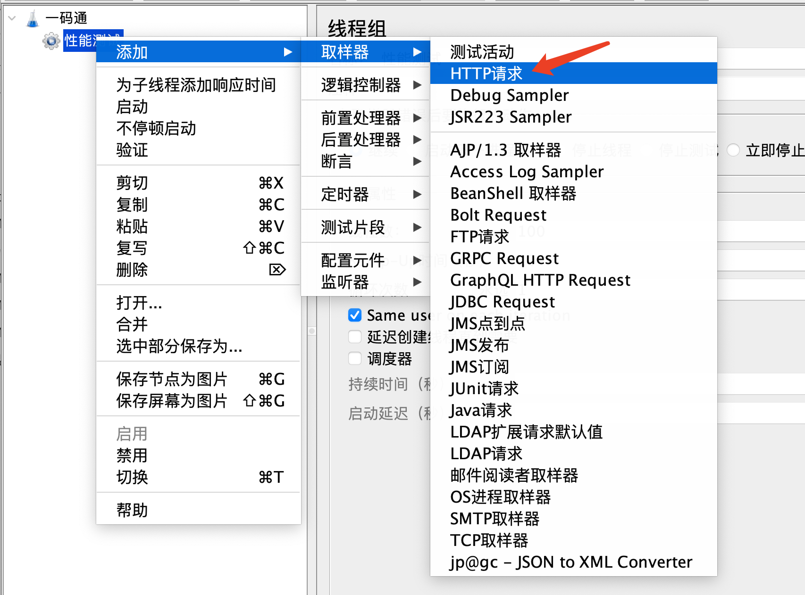

 

 

2、在【HTTP请求】中，我们找到路径把百度的请求地址放到里面

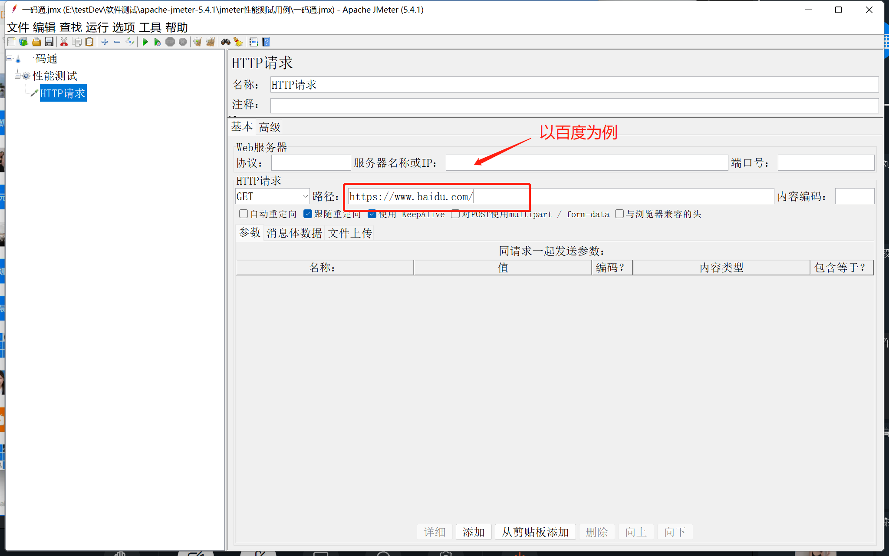

 

 

3、创建查看结果，查看结果是在监听器中，它的组件具体如下：

​     	1、查看结果树：查看发送网络请求后返回的信息

​     	2、响应时间图：发送N次请求过程中响应时间的趋势图

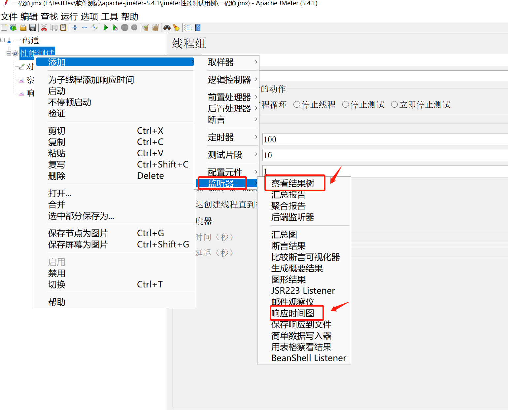

 

 

 

 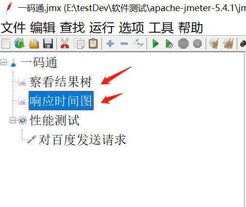

 

 

4、添加【聚合报告】【汇总报告】，使我们能更加直观的看到【样本数】【平均值】【中位数】【最大最小值】等等测试数据

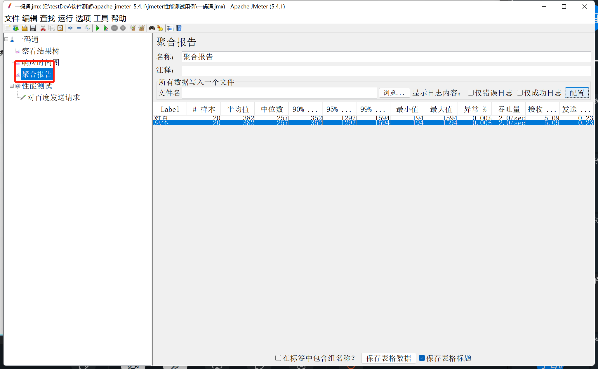

 

 

Label:取样器名称

Samples:取样器运行次数

Average:单个请求的平均响应时间

Median:50%请求的响应时间

90%Line:90%请求响应时间

95%Line:95%请求响应时间

99%Line:99%请求的响应时间

Min:请求的最短响应时间

Max:请求的最长响应时间

Std.Dev:响应时间的标准偏差

Error%:事务错误率

Throughput:吞吐率，也就是TPS KB/sec:每秒数据包流量

Avg.Bytes:平均数据流量

Received KB/sec:每秒从服务器端接收到的数据量

SentKB/sec:每秒从客户端发送的请求的数量


5、添加调度器

调度器： 持续时间：指的是所有的任务执行完成后，任务再接着执行N秒，目的是验证被测服务的稳定性

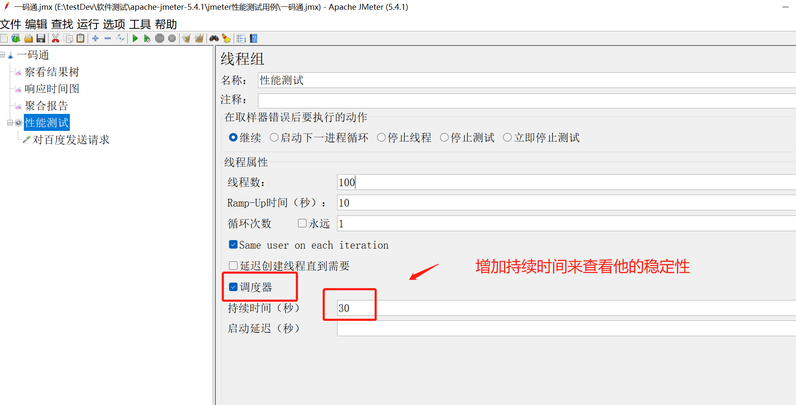

 

 

启动延迟：等待把所有被执行的任务集合中一起来瞬间来执行

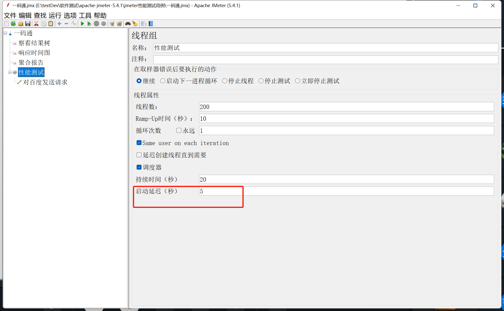

 

 

性能测试注意事项： 客户端本身的资源也是有限的，到具体一定的值，就不能再扩大每秒并发用户数了 。这个时候使用分布式的技术来实现。

 

六、循环次数

 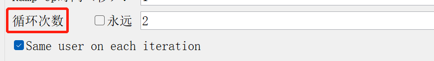

 

 汇总报告跟聚合报告的区别：

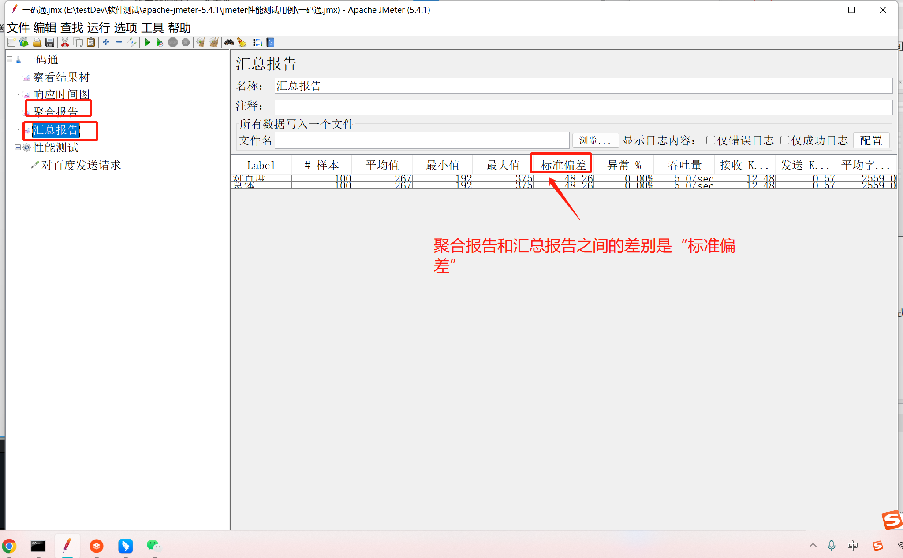

 

 

## 三、下载使用PerfMon插件

（这部分如果公司有对应的后台检测，可以直接对接开发那边进行后台监测）

1、我们在性能测试的过程中，需要收集被测目标服务器的终端的系统资源

​			A、在目标服务器部署serveragent(功能就是收集数据)

​			B、在JMeter连接serveragent，把收集的数据展示出来

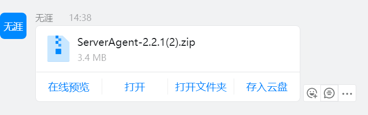

 

 

 启动插件

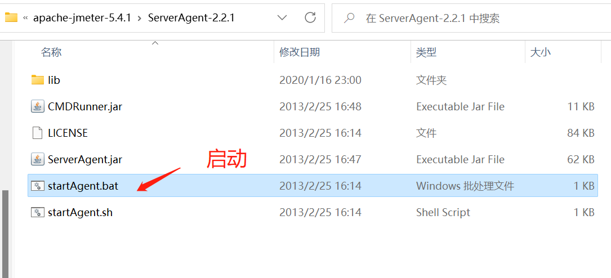

 

 启动成功

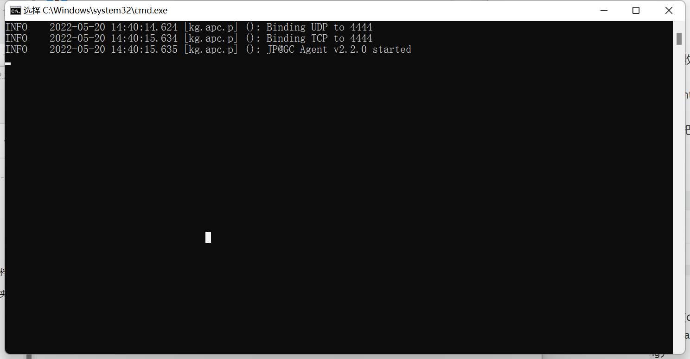

 

 下载PerfMon

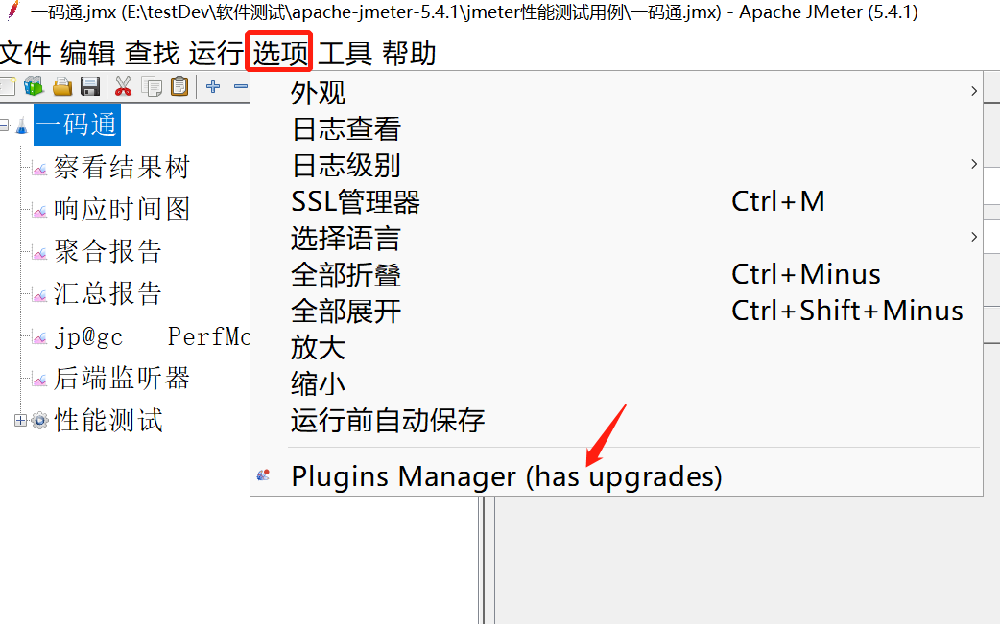

 

 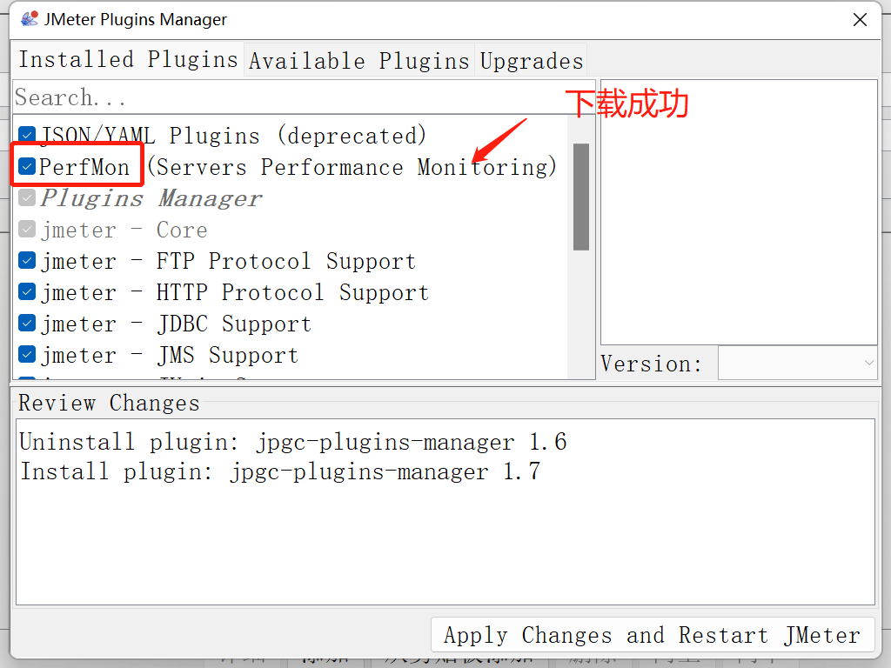

 

 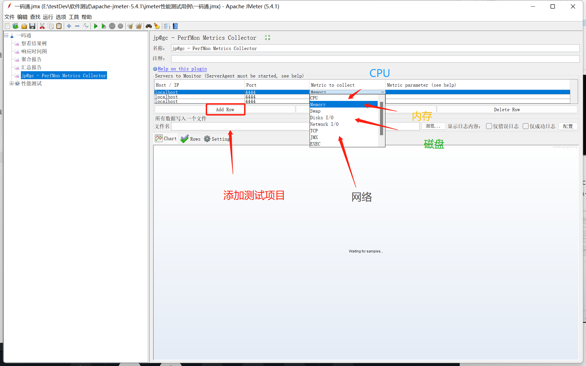

 

 

 

后端监听器：

 

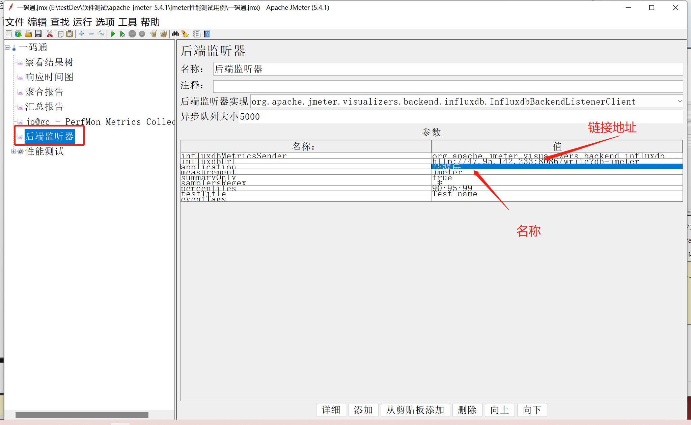

 

 

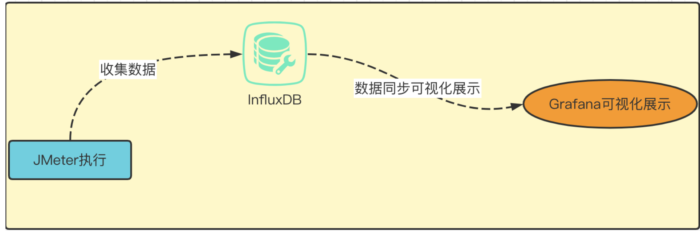

 

 

## 四、 Grafana可视化展示

1、我们打开【Grafana】

2、在里面我们可以详细的看到我们测试的数据

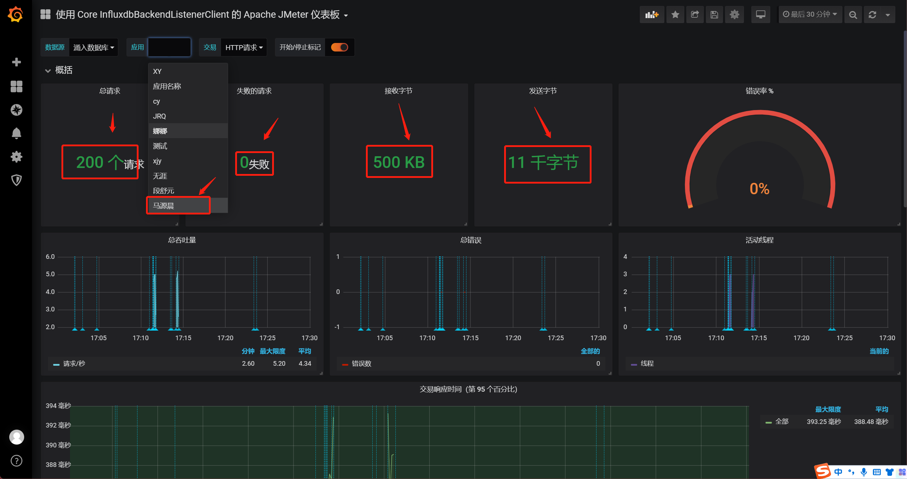

 

 


