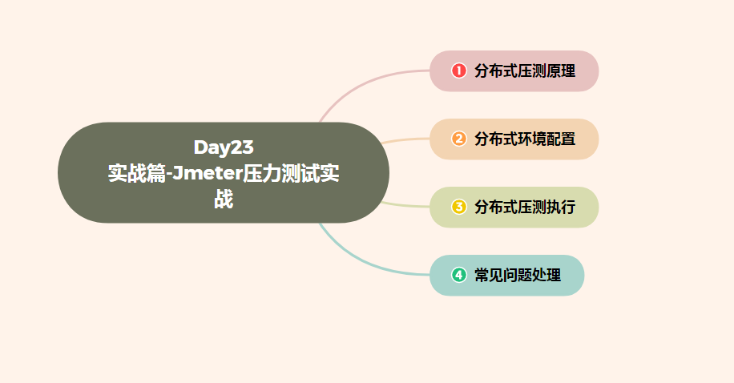
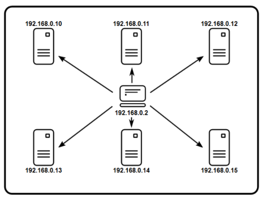
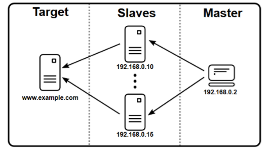
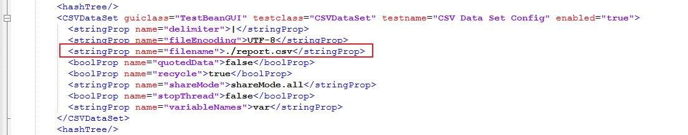
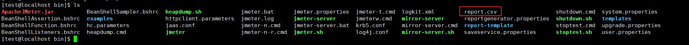
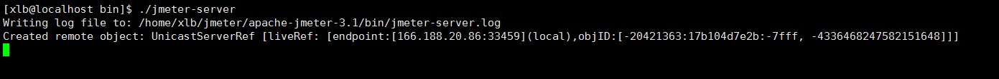
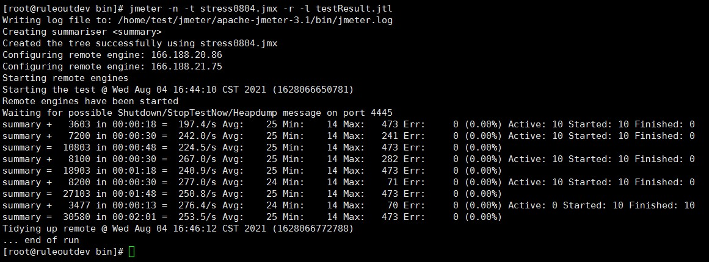

# Day23 实战篇 ——Jmeter压力测试实战

[TOC]




项目中使用Jmeter进行大并发压测时，单机受限内存、CPU、网络IO，会出现服务器压力还没有上

去，但压测服务器由于模拟的压力太大死机的情况。JMeter的集群模式可以让我们将多台机器联合起来

一起产生负载，从而弥补单台机器负载生成能力不足的问题。

# 一、分布式压测原理

[](https://img2020.cnblogs.com/blog/1081351/202108/1081351-20210804150418173-1300642496.png)

[](https://img2020.cnblogs.com/blog/1081351/202108/1081351-20210804150427622-1900269772.png)

1、控制机为Master，负载机为Slave

2、Master启动后，会拷贝jmx脚本文件到所有的Slave上

3、Slave会回传压测数据给Master，最后由Master汇总出结果文件

 注意事项

1、脚本文件上传到master即可，不用所有的slave都传一份

2、所有机器最好在同一个网段

3、由于master需要发送信息给slave并接收slave回传回来的测试数据，自身会有一定的消耗，建议单独

配置一台机器作为master

4、所有机器的jmeter版本和插件版本要一致

5、如果jmeter版本在4.0以上，需在jmeter.properties中设置 **server.rmi.ssl.disable=true** 


# 二、分布式环境配置

### Slaves机器配置

　　编辑所有slave机器jmeter/bin目录下的jmeter.properties文件，slaves机器上remote_hosts不动，根

据需要修改服务端口。默认端口为1099，可以修改为任意未被占用的端口。我这里默认端口没有被占用，

就不做修改。


```
# Remote Hosts - comma delimited
remote_hosts=127.0.0.1
#remote_hosts=localhost:1099,localhost:2010

# RMI port to be used by the server (must start rmiregistry with same port)
#server_port=1099
```

### Master机器配置

　　编辑master机器jmeter/bin目录下的jmeter.properties文件，将所有slave机器的地址配置到文件中，

server_port不用修改。


```
# Remote Hosts - comma delimited
remote_hosts=166.188.20.86,166.188.21.75(slave机器的ip和端口)
#remote_hosts=localhost:1099,localhost:2010

# RMI port to be used by the server (must start rmiregistry with same port)
#server_port=1099
```

　　master机器也可以作为负载机，在remote_hosts中加上127.0.0.1即可，但考虑到自身消耗，这里

不使用。如果修改了负载机的端口号，则需带上修改后的端口号，我这里使用的默认值，不用再单独

标注。修改了端口号使用如下配置：


```
# Remote Hosts - comma delimited
remote_hosts=166.188.20.86:2099,166.188.21.75:2099
#remote_hosts=localhost:1099,localhost:2010

# RMI port to be used by the server (must start rmiregistry with same port)
server_port=2099
```

###  参数化文件配置

　　参数化文件的路径要保持一致，我这里配置在jmeter/bin目录下。注意：**所有的slave机器都要上传一**

**份参数化文件**。

[](https://img2020.cnblogs.com/blog/1081351/202108/1081351-20210804162717415-1819936581.jpg)

[](https://img2020.cnblogs.com/blog/1081351/202108/1081351-20210804162928226-141499139.jpg)


# 三、分布式压测执行

### Slave机器执行

　　在所有的slave机器上执行 **./jmeter-server** 命令，出现以下界面为执行成功。

[](https://img2020.cnblogs.com/blog/1081351/202108/1081351-20210804163652575-2032846874.jpg)

### Master机器执行

　　确认好所有slave机器都正确启动后，在master机器上执行命令

```
 jmeter -n -t stress0804.jmx -r -l testResult.jtl
```

　　命令解析：

- n 非GUI模式运行
- t 要运行的jmx文件
- r 将远程所有的agent启动
- l 生成结果文件

　　执行结果：

[](https://img2020.cnblogs.com/blog/1081351/202108/1081351-20210804165127711-2004538152.jpg)

　　脚本中设置了5个线程，有2台负载机，所有Active为5*2=10个，运行时间2分钟。


# 四、常见问题处理

### 问题一


```
[test@localhost bin]$ ./jmeter-server 
Writing log file to: /home/test/jmeter/apache-jmeter-3.1/bin/jmeter-server.log
Created remote object: UnicastServerRef [liveRef: [endpoint:[127.0.0.1:37863](local),objID:[-3217392f:17b104e6552:-7fff, 742049333908920389]]]
Server failed to start: java.rmi.RemoteException: Cannot start. localhost.localdomain is a loopback address.
An error occurred: Cannot start. localhost.localdomain is a loopback address.
```

解决方法：执行命令中指定本地IP **./jmeter-server -Djava.rmi.server.hostname=xxx.xxx.xxx.xxx** 

### 问题二


```
[root@iZwz95j86y235aroi85ht0Z bin]# ./jmeter-server
Created remote object: UnicastServerRef2 [liveRef: [endpoint:[:39308](local),objID:[24e78a63:16243c70661:-7fff, 7492480871343944173]]]
Server failed to start: java.rmi.RemoteException: Cannot start. Unable to get local host IP address.; nested exception is:
java.net.UnknownHostException: iZwz95j86y235aroi85ht0Z: iZwz95j86y235aroi85ht0Z: Name or service not known
An error occurred: Cannot start. Unable to get local host IP address.; nested exception is:
java.net.UnknownHostException: iZwz95j86y235aroi85ht0Z: iZwz95j86y235aroi85ht0Z: Name or service not known
```

解决方法：使用hostname命令获取机器名称，追加一个映射iZwz95j86y235aroi85ht0Z


```
[root@iZwz95j86y235aroi85ht0Z bin]# vi /etc/hosts
127.0.0.1   localhost localhost.localdomain localhost4 localhost4.localdomain4
::1         localhost localhost.localdomain localhost6 localhost6.localdomain6
120.79.160.143 iZwz95j86y235aroi85ht0Z
```

windows中修改c:\windows\system32\drivers\etc\hosts文件，增加一条域名与IP的映射

### 问题三


```
[root@iZwz95j86y235aroi85ht0Z bin]# ./jmeter-server
Server failed to start: java.rmi.server.ExportException: Listen failed on port: 0; nested exception is:
java.io.FileNotFoundException: rmi_keystore.jks (No such file or directory)
An error occurred: Listen failed on port: 0; nested exception is:
java.io.FileNotFoundException: rmi_keystore.jks (No such file or directory)
```

解决方法：编辑jmeter.properties文件，将server.rmi.ssl.disable的值改为true

### 问题四

　　slave机器无法启动或者没有返回执行数据

解决方法：

　　1、检查master机器和slave机器能否ping通

　　2、检查防火墙

　　3、检查master机器和slave机器的服务器时间是否一致


