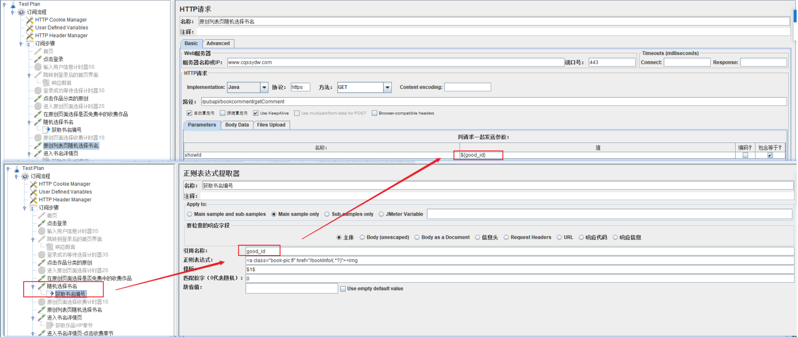

# Day24 实战篇 ——Jmeter通过JDBC测试实战

[TOC]

## 1、**业务级脚本开发**

登录脚本->思路：在线程组下新建两个HTTP请求，一个是完成访问登录页，一个是完成登录的数据提交。

　 

步骤如下：

1) 访问登录页

2) 提交登录数据的HTTP

PS:对于业务级的脚本建议更加真实地模拟用户的请求操作。

## 2、**接口级脚本开发**

**1） 单接口测试方法**

1. 启动Jmeter
2. 新建线程组
3. 在线程组下新建一个HTTP请求
4. 在HTTP请求中填入接口信息，包括地址、参数、请求方法（GET）等
5. 新建一个查看结果数监听器
6. 运行脚本验证结果，优化脚本（比如可以对参数进行参数化）

**2） 接口依赖的测试方法**

接口依赖->思路：建立2个接口，把接口1中接口响应的字段传递到接口2的入参中。

比如：列表页获取书名ID，获取的书名ID作为进入书名详情页的入参。

具体步骤：

1. 新建一个HTTP请求，命名为点击书名
2. 新建一个HTTP请求，命名为原创列表页随机选择一个书名
3. 提取点击书名接口中的响应数据good_id字段的值，在点击书名下面建立正则表达式来完成。其中正则表达式，通过取出书名ID的值，后续用这个值在需要的时候填入${good_id}即可使用。
4. 在原创列表页随机选择一个书名接口的showid入参出替换为变量${good_id}即可。
5. 我们可以来看查看结果数，看出请求成。 

## 3、**JDBC脚本开发**

所谓的单SQL语句是指：一次只运行一条SQL语句。大致实现步骤如下：

1. 复制mysql-connector-java.jar包到JMeter安装目录下的lib子目录中。
2. 在线程组下新建一个配置元件中的JDBC Connection Configuration,并填入必要的信息。
3. 新增一个取样器-JDBC请求，用于JDBC连接。
4. 建议一个监控器-查看结果数。

 

 

SQL查询语句中的条件是固定值，如何设置为变量，步骤：

1. 测试计划中新增一个用户定义的变量，取名为user_name，值为pro_test
2. 在JDBC请求中，修改Query Type为Prepared Select Statement
3. 修改查询条件中的条件为？，用于占位符
4. Parameter value添加用户自定义的变量，变量为测试计划中变量的值
5. Parameter types中的参数类型，取决于测试计划->用户定义的变量类型。

 多SQL语句测试与单SQL语句的区别：

1. 在Database Connection Configuration中的Database URL字段末尾加上 ?allowMultiQueries=true。
2. 在JDBC Request的Query Type选择Update Statement,并在Query里写入两条插入的SQL语句。

## 4、**JMS Point-to-Poibt脚本开发**

1、JMS

JMS:Java Message Service，即Java消息服务应用程序接口，是一个Java平台中关于面向消息中间件(MOM)的API，用于在两个应用程序之间，或分布式系统中发送消息，进行一步通信。通俗的讲，JMS是一个标准或者是一个协议，用于企业级应用的消息传递。

 

发送者和接受者。接受者从队列中获取消息，且在成功接收消息之后需向队列应答成功。发送者和接收者之间在时间上没有依赖性，也就是说当发送者发送了消息之后，不管接收者有没有正在运行，都不会影响消息被发送到队列。

消息队列。每个消息都被发送到一个特定的队列。队列保留着消息，直到他们被消费或超时。

每个消息只有一个消费者，一旦被消费，消息就不在消息队列中了。

2、ActiveMQ

 

ActiveMQ是开源消息队列服务，是面向消息中间件（MOM）的最终实现，是真正的服务提供者。消息生产者将消息发送至消息服务，消息消费者则从消息服务接收这些消息。这些消息的传送操作是使用一组实现了ActiveMQ应用编程接口的对象来执行的。

ActiveMQ工作模式中的部分解释如下：

1. ActiveMQ客户端使用Connection Factory 对象创建一个连接，向消息服务发送消息以及从消息服务接收消息均是通过此连接来进行。
2. Connection是客户端与消息服务的活动连接。大多数客户端均使用一个链接来进行所有的消息传送
3. Session 是一个用于生成和使用消息的单线程上下文。它用于创建发送消息的生产者和接收消息的消费者 ，并为所发送的消息定义发送顺序。
4. 客户端使用Message Producer向指定的物理目标发送消息。
5. 客户端使用Message Consumer对象从指定的物理目标接收消息。消费者可以支持同步或异步消息接收。异步使用可通过想消费者注册MessageListener来实现。

3、JMS Point-to-Point脚本开发

  

场景：对中间件进行性能测试，可以使用工具Jmeter中的JMS。

JMS Point-to-Point脚本开发：

1、找到ActiveMQ官网，下载对应操作系统的ZIP包，解压后进入bin目录，找到activemq.bat，运行即可。

2、ActiveMQ启动完成后，在浏览器地址栏中访问http://127.0.0.1:8161/admin/，默认用户名、密码都是admin。

3、ActiveMQ解压后的文件夹，找到activemq-all-5.15.12.jar，复制到Jmeter目录下的lib子目录中。

4、建立线程组->Sampler->JMS Point-to-Pint,然后填写必要的JMS资源信息。

5、添加一个查看结果数，然后运行JMeter，查看结果请求成功后，返回到对应的ActiveMQ控制台，就可以看到我们发送的消息已经进入了队列。

JMS Point-to-Pint 参数填写内容如下：

| **名称**                | **值**                                                 | **描述**                                                     |
| ----------------------- | ------------------------------------------------------ | ------------------------------------------------------------ |
| QueueConnectionFactory  | ConnectionFactory                                      | 这是连接 ActiveMQ 的默认 JNDI 入口。                         |
| JNDI Name Request Queue | Q.REQ                                                  | 在 JNDI 属性中定义的 JNDI 名称                               |
| JNDI Name Reply Queue   | Q.RPL                                                  | 在 JNDI 属性中定义的 JNDI 名称                               |
| Communication Style     | Request Response                                       | 代表在 JMeter 外部运行的服务并响应请求。 此服务必须监听请求队列并将消息发送到由消息引用的队列.getJMSReplyTo() |
| Content                 | test                                                   | 内容                                                         |
| JMS Properties          |                                                        | ActiveMQ 不需要设置                                          |
| InitialContextFactory   | org.apache.activemq.jndi.ActiveMQInitialContextFactory | ActiveMQ 的标准 InitialContextFactory                        |
| queue.Q.REQ             | example.A                                              | 定义了一个名为 Q.REQ 的 JNDI 队列请求指向了 example.A        |
| queue.Q.RPL             | example.B                                              | 定义了一个名为 Q.RPL 的 JNDI 队列请求指向了 example.B        |
| Provider URL            | tcp://localhost:61616                                  | ActiveMQ 地址和端口                                          |

## 5、**Jmeter轻量级接口自动化测试框架**（了解就行）

大致思路如下：JMeter完成接口脚本，Ant完成脚本执行并收集结果生成报告，最后利用Jenkins完成整体脚本的自动集成运行。

环境安装:

1.jdk1.7 配置环境变量(参考前面的分页)

2.jmeter解压到本地,ant解压到本地

3.Ant解压到本地,并配置环境变量

　　ANT_HOME:D:\jmeter\apache-ant-1.9.6

　　Path:%ANT_HOME%\bin;%ANT_HOME%\lib

　　CALSSPATH:%ANT_HOME%lib;

4.cmd中验证Ant安装成功

5.将JMeter所在目录下extras子目录里的ant-JMeter-1.1.1.jar复制到Ant所在目录lib子目录下

6、报告模板xls文件，放到jmeter目录中的extras文件夹里

7、创建如下脚本目录结构

　jmeter_test(主目录文件)

　　　　result_log(测试报告及日志)

　　　　　　html（测试报告生成目录）

　　　　　　jtl(存放jtl文件的目录)

　　　　script(存放jmeter的jmx文件)

　　　　build.xml(核心配置文件)

8、在jmeter中完成项目的接口脚本，调试成功，保存到上面的script目录。

9.build.xml来设置运行时的具体配置

10.cmd目录下运行切换到D:\jmeter_test，输入命令：ant，执行后等待时间，出现BUILD SUCCESSFUL

11、查看报告

12.集成到Jenkins大概步骤：

　　12.1系统管理-系统设置中，配置jdk和ant　　　　　

JDK别名：随便自己填，不过最好还是按照实际的写吧

JAVA_HOME：这个是本机JDK的安装路径（路径错误，会有红点提示你），自动安装：不推荐使用

后面Ant与Maven的配置是一样的，JDK去oracle官网下载，Ant与Maven去apache官网下载

Ps：每个文本框后面都有个问号，点击问号就会出现帮助信息

 　12.2系统管理-系统设置中，配置邮件通知

　　上图，配置发件人地址System Admin e-mail address：Jenkins邮件发送地址，如果你这个没有配置，发邮件的时候，会报错 

　　配置邮件通知 　

这个就非常的简单了，根据的的邮箱提供者的参数配置就行了。

Ps：小技巧：用户默认邮件后缀配置了后，以后你填写邮件地址只需要@之前的就行了

　　12.3项目构建

　　　　12.3.1新建自由风格构建任务。在已运行的Jenkins主页中，点击左侧的新建Job进入如下界面

　　　　　　这时，需要为新的构建任务指定一个名称。（这里输入的任务名称为：接口test）这里有几种的任务类型可供选择，鉴于初步介绍，先选择构建一个自由风格的软件项目。对于其他的类型,经常使用的是拷贝已存在任务;这主要为了能在现有的任务基础上新建任务。点击OK按钮

　　　　12.3.2构建触发器　　　　

Build after other projects are built：在其他项目构建完成后才执行构建：指定的项目完成构建后，触发此项目的构建。

Poll SCM ：这是CI 系统中常见的选项。当您选择此选项，您可以指定一个定时作业表达式来定义Jenkins每隔多久检查一下您源代码仓库的变化。如果发现变化，就执行一次构建。例如，表达式中填写0,15,30,45 * * * *将使Jenkins每隔15分钟就检查一次您源码仓库的变化。

Build periodically ：此选项仅仅通知Jenkins按指定的频率对项目进行构建，而不管SCM是否有变化。如果想在这个Job中运行一些测试用例的话，它就很有帮助。

　　　　　　12.3.3增加构建步骤，ant执行命令　　　　

　　　　Ant Version选择你Ant配置的那个名字，注意不要选择default

　　　　如果你的构建脚本build.xml不在workspace根目录、或者说你的构建脚本不叫build.xml。那么需要在高级里设置Build File选项的路径，指明你的脚本。注意：是相对路径

　　　　　12.3.4邮件通知设置

选择Add post-build action，然后选择E-mail Notification，在Recipients中输入收件人邮件地址，如果用多个收件人用“,”英文逗号隔开

　　　　　12.3.5构建完成后，保存页面信息

　　12.4运行

　　　　回到jenkins主界面，点击项目运行

　13.邮件收到的信息

　　　　无异常，构建成功的信息

附录： 

**1、linux 下ant+jmeter的使用**

 **A.安装：离线和在线安装两种，我是选的离线安装。**

从http://ant.apache.org下载tar.gz版的ant，复制到usr路径下

进行解压：tar -xzvf apache-ant-1.9.6.tar.gz 

vi /etc/profile 编辑ANT_HOME路径：

export ANT_HOME=/usr/apache-ant-1.9.2

export PATH=$PATH:$ANT_HOME/bin

source /etc/profile使配置生效，执行 ant -version，测试ant是否生效。

 **B.jmeter 将jmeter文件夹拷贝到linux机器**，我放到/opt/soft/jmeter路径，chmod 777 /opt/soft/jmeter/bin/jmeter.sh.  测试jmeter是否linux可用。

 **C.su jenkins用户，执行ant，**测试能否正确执行和生成对应文件。注意权限

