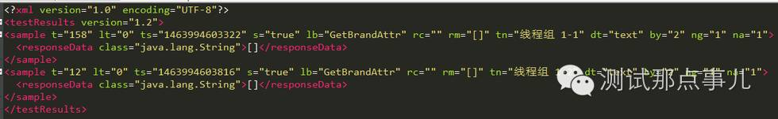

# Day25 实战篇 ——Jmeter实现Java测试实战

# [使用Jmeter测试java请求](https://www.cnblogs.com/Jmeter-Automation/p/12730585.html)

> 1、性能测试过程中，有时候开发想对JAVA代码进行性能测试，Jmeter是支持对Java请求进行性能测试，但是需要自己开发、打包好要测试的代码，就能在Java请求中对该java方法进行性能测试
> 2、本文举的例子是Java实现通过传入两个参数，将值写入到文件中

> - 开发思路
>   1、使用Eclipse创建Maven 项目，配置Pom文件，引入Jmeter开发Java请求所需的依赖包；
>   2、创建输入参数类，和测试类，然后继承JavaSamplerClient，实现四个主方法；
>   3、对编写好的项目进行编译、打包
>   4、把打包好的函数放到jmeter扩展目录，调用Java请求，对封装的Java方法进行测试；

| JDK环境 | Jmeter依赖包版本 | Maven仓库版本 |
| ------- | ---------------- | ------------- |
| 1.8     | 4.0              | 3.5.3         |

Java_Sample完整项目下载方法见文章末尾介绍

一、新建Maven项目
\1. File》New》Project，选择Maven》Maven Project，一直点击Next

\2. 配置Pom文件，Pom文件配置的Jmeter4.0版本，只要保存了Pom文件，系统就会自动下载和关联相应的jar包，Pom配置文件如下：

\3. 保存Pom文件之后，系统会自动下载关联的依赖文件，会用到的为ApacheJMeter_core-4.0.jar和ApacheJMeter_java-4.0.jar如下图：
保存前：

保存后：

\4. 此时，由于对pom文件进行了修改，项目顶层会出现一把×，并且编译可能就会报错，需要执行Maven》Update Project更新外部依赖的Jar包

更新前：

更新后，编译、打包正常：

二、编写输入参数类、测试类
\1. 输入参数类，该类就是被测试的java方法，主要是实现将参数写入到文件，代码如下：

\2. 测试类，首先在com.xiet.Java_Sample包下创建一个类，类名为Jmeter_Test，需要继承JavaSamplerClient类，然后实现父类的四个方法，和一个main方法

> main主方法主要是用来本地调试，用来测试封装的Java方法是否功能正常，如果能实现正常功能，就可以进行编译、打包在Jmeter中进行调用

> setupTest方法为初始化方法，实际运行时每个线程仅执行一次，在测试方法运行前执行，默认置空即可

> runTest方法为测试方法，该方法用来传入输入的参数，然后调用参数类，进行测试

> teardownTest方法为结束方法，实际运行时每个线程仅执行一次，在测试方法结束后执行，默认置空即可

\3. getDefaultParameters方法为设置传入的参数，可以设置多个，已设置的参数会显示到Jmeter的参数列表中，如下所示：

三、编译、打包
\1. 编写代码完成，就可以进行编译、打包操作了，右键点击项目》Run As》Maven build

\2. 在Goals中输入package，然后点击Apply》Run执行编译，打包操作

\3. 编译打包完成，在target目录会生成一个jar包，如下图所示

四、验证开发的函数是否正常
\1. 首先把Java_Sample_0.1.jar函数放到jmeter的\lib\ext目录

\2. 然后启动Jmeter，线程组》添加》Sample》Java请求

\3. 在类名称中选择封装的Java类，为com.xiet.Java_Sample.Jmeter_Test，该类名称为包名+类名

\4. 本次设置2线程，2循环，点击执行按钮，执行结果如下：

完整源码如下

***

 **前言**

 

Apache Jmeter是开源、易用的性能测试工具，之前工作中用过几次对http请求进行性能测试，对jmeter的基本操作有一些了解。最近接到开发的对java请求进行性能测试的需求，所以需要写java请求的脚本。

Java请求的性能测试与http请求的性能测试类似，都是给远程应用提供的服务发送请求并施压，得到响应结果及性能数据。不同的是，http调用的是应用提供的http协议的服务，而java请求调用的是应用提供的接口服务，且需要通过编写代码来实现java请求的调用。

本次压测的java请求是以RMI方式调用的，Java RMI 指的是远程方法调用 (Remote Method Invocation)。使用这种机制能够让一台java虚拟机上的对象调用另一台java虚拟机上的对象的方法来获取远程数据，可以实现不同java虚拟机上对象之间的通信。引用网上对RMI的一句通俗的介绍：远程调用就像将一个class放在A机器上，然后在B机器中产生一个代理对象来调用这个class的方法。下面详细介绍一下用jmeter对java请求进行性能测试的过程。

 

 

#  

# **1 Java测试代码编写**

## **1）创建测试项目**

新建一个java工程，这里我使用的IDE是eclipse。

## **2）引入jmeter的jar包**

将{Jmeter_home}\lib\ext目录下的ApacheJMeter_core.jar和ApacheJMeter_java.jar两个jar包复制到测试项目的lib目录下，这两个包是编写java请求性能测试代码必须的。本例中还用到了{Jmeter_home}\lib下的avalon-framework-4.1.4.jar、commons-logging-1.2.jar、jorphan.jar和logkit-2.0.jar，将这4个jar也复制到lib目录，并将引用的jar包都添加到项目的Build Path中。本例中开发提供了docmodel-client-0.3.jar，其中包含了建立远程连接及调用待测方法的过程，所以需要将其及依赖的包都引入到工程中。

## **3）编写测试代码**

新建测试类，该类必须继承AbstractJavaSamplerClient类或实现JavaSamplerClient接口，需要重写以下方法：

1、public Arguments getDefaultParameters();设置入参，已设置的参数会显示在jmeter GUI的参数列表中

2、public void setupTest(JavaSamplerContext context);初始化方法，用于初始化性能测试的每个线程，每个线程前都会执行一次。

3、public SampleResult runTest(JavaSamplerContext arg0);性能测试的线程运行体，测试执行主体，从arg0中获取参数，并调用被测方法，完成与服务器的交互。该方法是java Sampler实现的重点，执行次数取决于线程数和循环次数。

4、public void teardownTest(JavaSamplerContext arg0);测试结束时调用，每个线程执行一次。setupTest和teardownTest方法不需要时可以不写。

 以上4个方法中只有runTest是必须实现的，其他3个可根据需求去覆盖。这4个方法执行的先后顺序与其前面的序号相对应，分别为：getDefaultParameters()、setupTest(JavaSamplerContext context)、runTest(JavaSamplerContext arg0)、teardownTest(JavaSamplerContext arg0)。

如果需要对多个方法进行性能测试，则需要建多个测试类，多个测试类可以放在同一个包下面，也可以放在单独的包中。本次待测方法的功能是传入一个docid（文章号），然后获取该文章对应的brand（品牌）属性、subject（话题）属性或其他多个属性。以其中一个获取文章的brand属性的测试类JmeterGetBrandAttr为例，因为不需要准备数据和恢复后期环境，所以省略了setupTest和teardownTest两个方法。

画红框部分是测试代码主体，sampleStart和sampleEnd方法调用时会分别生成一个时间戳，两个时间戳之差就是一次java请求的响应时间，单位是ms。

需要注意的是，http请求在任何情况下都会有给客户端一个反馈，但是java请求不一定。在设置的压力较大时，服务器可能会吃不消直接异常退出，客户端获取不到任何返回值，保存返回结果的对象（如本例中的resultData）的值就为null。所以需要做空指针的判断，保证代码的正常运行。

其中TestGetArticleAttr.getBrandAttr(docid)是调用待测方法，传入docid，返回文章的brand属性。本例中需要压测3个方法，对远程方法的连接及对返回结果的简单处理都写在单独的TestGetArticleAtrr类。

开发提供的包中提供了连接远程对象的类ArticleModelClient，其中封装了在RMI服务中查找相关对象的方法、对异常的处理等等，简化了客户端调用方法的过程。有一点需要注意的是，建立远程对象连接的过程会花费一定时间，不能每次调用远程方法都去建立连接，所以把建立连接的操作放到static代码块中，在类初始化的时候建立一次连接，之后直接调用方法即可，从而保证性能测试数据的准确性。

代码编写完成后，可以写一个main方法对整个过程进行测试。

## **4）打成jar包**

代码编写好并测试完成后，将项目打成jar包，打包完成后将其放到jmeter的扩展包目录下，即{Jmeter_home}\lib\ext，并将项目的依赖包都放到{Jmeter_home}\lib目录下。简单的打包方法如下：

1、在eclipse选中测试代码所在的包，右键选择Export，选择java文件夹下的JAR file，单击next；

2、在JAR file后面的文本框中选择jar包的导出位置和名字。因为我们的jar包用于jmeter性能测试，不需要指定Main方法的入口，所以直接单击finish，完成jar包的导出。

3、修改MANIFEST.MF。MANIFEST.MF文件描述了jar包的相关信息，包括jar包的版本、创建人和类搜索路径等。如果是可执行jar包，会包含Main-Class属性，表明Main方法入口。Class-Path指定依赖的jar包，当前路径是jar包所在目录，若要引用当前目录下一个子目录中的jar包，使用以下格式：子目录/jar包名称，多个jar包之间用空格分隔，在任何平台上路径分割符都是'/'。

本例中导出的jar包依赖了别的jar包，需要在MANIFEST.MF文件中指明依赖的jar包的名字。在导出的jar包上右键，选择用WinRAR打开，进入META_INF目录，打开MANIFEST.MF文件，添加依赖的jar包的名字，名字之前用空格分隔，本例中需添加如下内容：

Class-Path: lib/ApacheJMeter_core.jar lib/ApacheJMeter_java.jar lib/avalon-framework-4.1.4.jar lib/commons-logging-1.2.jar lib/jorphan.jar lib/logkit-2.0.jar lib/log4j-1.2.17.jar lib/json-lib-2.4-jdk15.jar lib/docmodel-client-0.3.jar

# **2 Jmeter GUI编写测试计划**

双击{Jmeter_home}\bin目录下的jmeter.bat，打开jmeter界面，在测试计划中添加线程组，在线程组右键选择添加，分别添加Sampler--Java请求、监听器—查看结果数、监听器—聚合报告及配置元件--CSV Data Set Config。

{Jmeter_home}\lib\ext目录下继承AbstractJavaSamplerClient类或实现JavaSamplerClient接口的测试类的类名都会出现在类名称后面的下拉框中，最后的JaveTest和SleepTest为jmeter默认实现的2个java请求Sampler。前面3个分别对应我们之前创建的三个测试类，选择com.ntes.getArticleAttr.JmeterGetBrandAttr类。

本次压测的方法需要传递一个docid参数，且要求每次传的值不同，所以需要将docid参数化，我们使用CSV Data Set Config设置从文件中动态获取参数值，设置参数名称为docid，对应的值为${docid}。

常用的设置项的解释如下：

Filename：jmx文件同名目录下的数据文件，常用的是csv和txt格式

File Encoding：一般为空，默认为ANSI

Variable Names：定义数据文件中各列对应的参数项

Delimiter：文件中各字段间使用的分隔符

Recycle on EOF： True时读到文件结尾时从头循环读取，False时读到文件结尾时停止读取文件

Stop thread on EOF：True时读到文件结尾时进程停止，False时读到文件结尾时进程继续。当Recycle on EOF为False且Stop Thread on EOF为true时，读完数据文件时，进程停止。在某些要求文件中的参数值只使用一次的情况下会用到。

# **3 Response Data的保存**

Jmeter的测试结果是以CSV（Comma-Separated Values）格式保存在jtl文件中的，每条结果中的各字段间以逗号分隔，看起来比较方便。Jtl文件中默认保存的各列数据分别为：

timeStamp,elapsed,label,responseCode,responseMessage,threadName,dataType,success,failureMessage,bytes,Latency。

Jmeter默认是不保存Response Data的。在之前对http请求做性能测试的时候，有时候需要将Response Data保存下来做分析，尝试过在监听器的configure中勾选Save Response Data这一项，但是发现在服务器上执行压测时指定的jtl文件中并没有保存这一项数据，网上可参考的关于这方面的资料也比较少，之后还尝试去修改jmeter.properties中相关的配置项，也没有得到预期的结果，倒腾了一阵没效果就暂时把这个问题搁置了。

这次做java请求的压测，又遇到这个问题。因为java请求与http请求不同，返回结果放在结果的哪一项中是自己设置的。因为之前没法将Response Data保存下来，所以之前就先调用SampleResult.setResponseMessage()方法将返回值放到Response Message中，虽然是顺利保存了响应结果，但总感觉怪怪的。因为在http请求中，Response Message用来表示本次请求的响应是否正常的，请求正常的情况下是”OK”，异常情况下是异常信息提示。在压测结果反馈给开发之后，就想花时间再研究一下Response Data的保存。

如果要保存Response Data，需要选择某个监听器，点击界面上的Configure按钮，要同时勾选上面画红框的两项，并且需要指定结果数据要写入的文件名。不管指定的保存结果的文件格式是不是xml，结果数据都是以xml的格式存储的。要注意的是，在服务器上执行jmeter的时候，也需要另外指定上面的保存结果信息的文件名及路径，因为Response Data是不会保存到-l参数后面指定的jtl文件中的。对其他信息的保存也可以参考这个方法。指定的保存结果数据的文件的内容格式如下图所示，是一个xml文件。

本例中要保存Response Data是为了对结果做一个分析，统计文章的某些属性能计算出来的概率，并且大部分的返回结果都是”[]”，数据量很小。一般不需要做统计分析的时候不用保存Response Data，并且如果要保存的Response Data数据量很大的话，可能会影响性能数据的准确性质。

# **4 测试计划jmx文件简介**

Windows下使用jmeter的GUI操作，会生成jmx格式的测试计划。因为之前不太了解jmx文件，所以花时间研究了一下，截取jmx文件的前一部分内容，如下图所示。

从第一行可以看出，这就是一个xml文件，我们使用jmeter GUI进行操作，其实就是在配置这个xml文件。

一个请求的整体是由标签<hashTree>标记的，我们本次压测的是java请求，JavaSampler标签就是标记这是一个java请求，即java取样器。如果压测的是http请求，<hashtree>下相应的标签为HTTPSamplerProxy。Argument.name和Argument.value分别指定了参数的名称和取值，classname指定了java请求的类名称。

在服务器上进行压测时，需要设置不同的线程数，其他的配置都不需要改动，如果每次都拷贝到windows的jmeter GUI中修改再拷贝到服务器上的话会很麻烦。Jmx文件中，ThreadGroup标签下是线程组的相关设置，其中ThreadGroup.num_threads和LoopController.loops分别对应jmeter GUI中线程组页面中的线程数和循环次数，通过vi命令直接在服务器上修改这两个参数即可修改线程组设置。

# **5 在服务器上跑jmeter压测脚本**

先在jmeter GUI模式下创建测试计划，保存为jmx文件。把jmeter整个文件夹拷贝到服务器上，并进入bin目录下运行：

./jmeter.sh -n -t ***.jmx -l ***.jtl

-n指定jmeter在非GUI模式下运行，-t指定包含测试计划的jmx文件名，-l指定jtl日志文件名。执行完成后会在指定目录下生成jtl的结果文件。

需要注意的是，刚拷贝到linux上的jmeter.sh，用户是没有执行权限的，使用ls –l查看文件详情，如下：

需要为该文件添加可执行权限，在jmeter.sh所在目录下执行命令：chmod +x jmeter.sh，在没有指定用户情况下，默认是为所有用户添加执行权限，再用ls –l查看文件权限，如下：

还有一点需要注意的是jdk版本，如果测试代码所用的jdk版本比服务器上jdk版本高的话会报错。

 

 

# **6 性能测试结果分析**

因为接触性能测试的时间很短，对系统性能的理解和分析还处于初级的阶段，所以此处主要讲一下初学者需要注意的一些点，不涉及具体性能瓶颈的分析。

在进行性能测试之前，需要跟开发问清楚性能测试的目的，是为了找到系统能支撑的最大负载还是为了检查在一定负载下系统的运行情况。如果是后者的话，还需要问一下服务器端设置的最大并发线程数，这样测试时才能设置出合适的负载量。我之前做过的几次http请求的压测，都是为了找系统能支持的最大负载。本次压测，我先在本地测试，给了50个线程并循环100次，结果在测试运行一段时间后就会出现需要等待很长时间的情况，一开始以为是本地网络状况不佳，将脚本放在服务器上跑依然会出现这个情况，后来跟开发沟通知道服务端设置了最大并发量的限制，并且只需要测试一下特定线程下系统的性能情况即可。有了这次经验之后，在之后的性能测试前就知道要尽量问清楚测试需求了。

还有一点需要注意的是缓存对于性能的影响，有无缓存对性能的影响通常是很大的，需要跟开发确认好重点关注的是有缓存还时没有缓存的情况。本次压测，有一个测试类是查询文章subject（话题）属性的，话题属性是实时计算出来的，如果传入的docid是第一次调用该方法，返回话题属性耗时会比较长，之后再对同一个docid查询话题属性时是直接从缓存中取数据返回，耗时大大减少。对获取话题属性的方法进行性能测试，在40个线程、重复100次的压力下，没有缓存和有缓存时的TPS分别为70/s和2200/s，可见两种情况下的差距之大。

一般性能测试的时候还需要关注其他的一些信息，如cpu和内存的使用量，本例中因为线程数较小，对服务器cpu和内存使用量影响不大，所以没有做详细的记录。

压测完成后，需要整理一份较详细的结果反馈给开发。本次压测的结果如下，在没有缓存的情况下，TPS较低，并没有达到开发的预期，需要进行性能调优。

