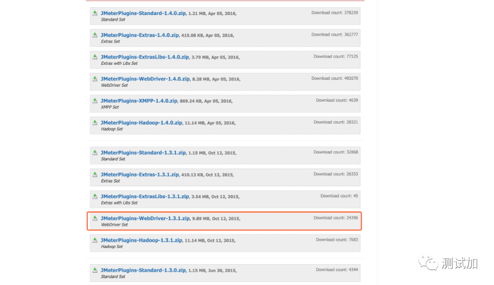
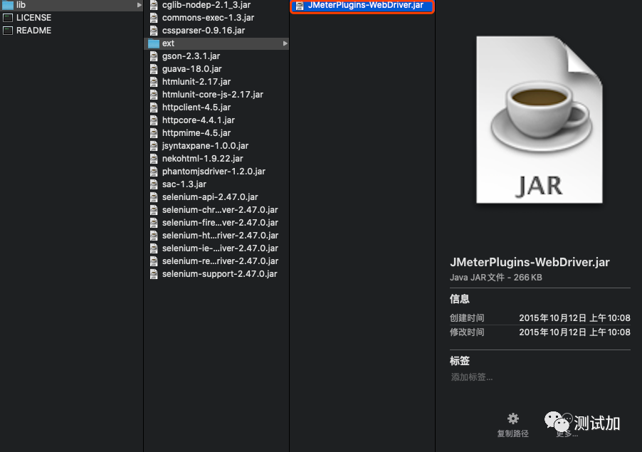
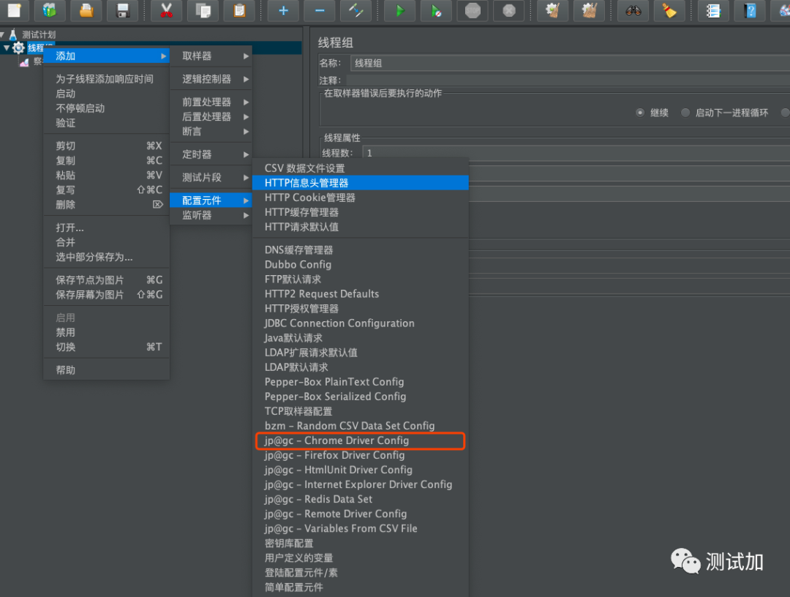
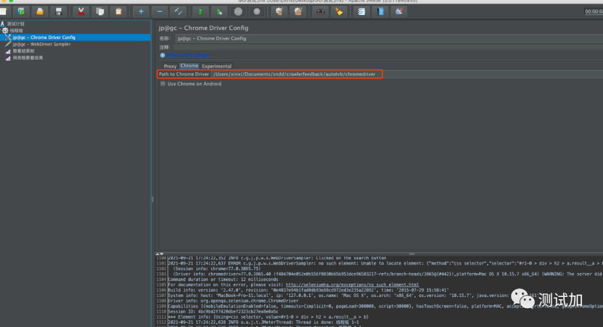
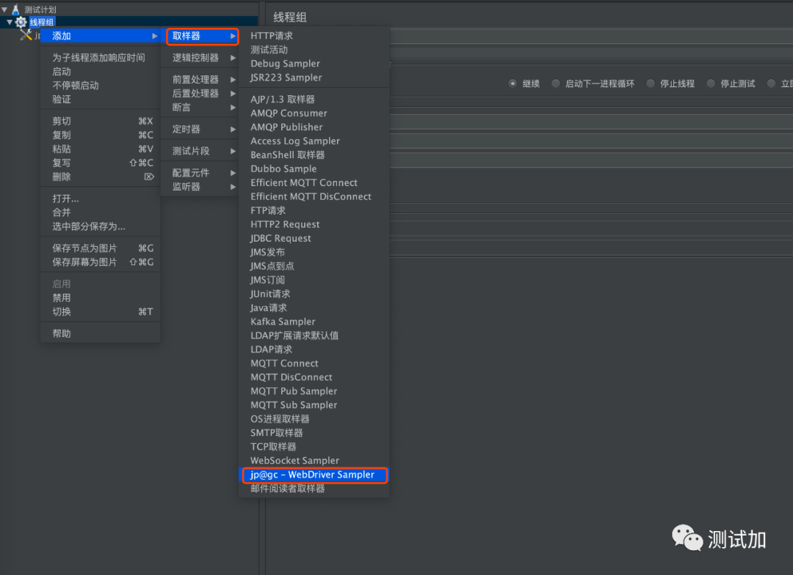
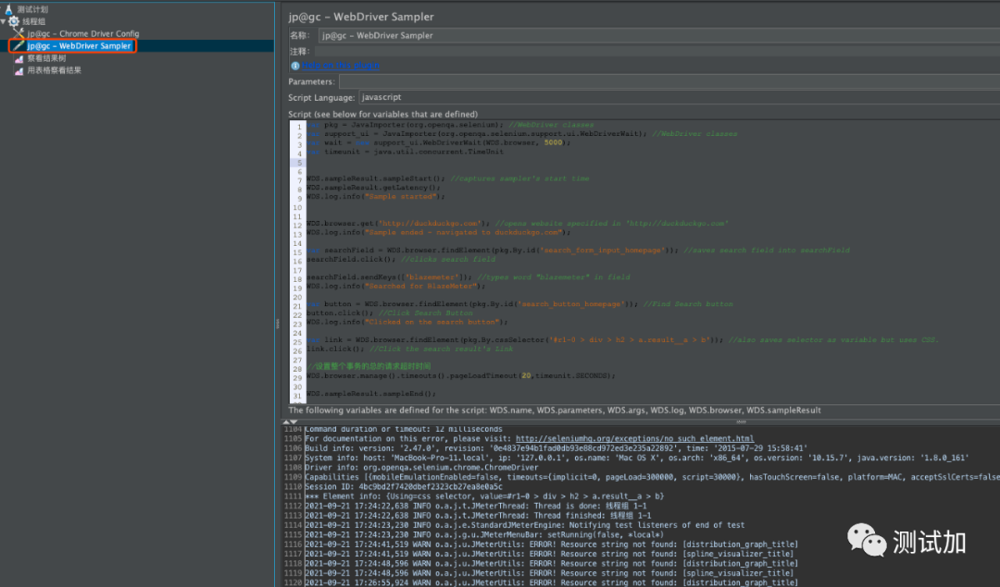
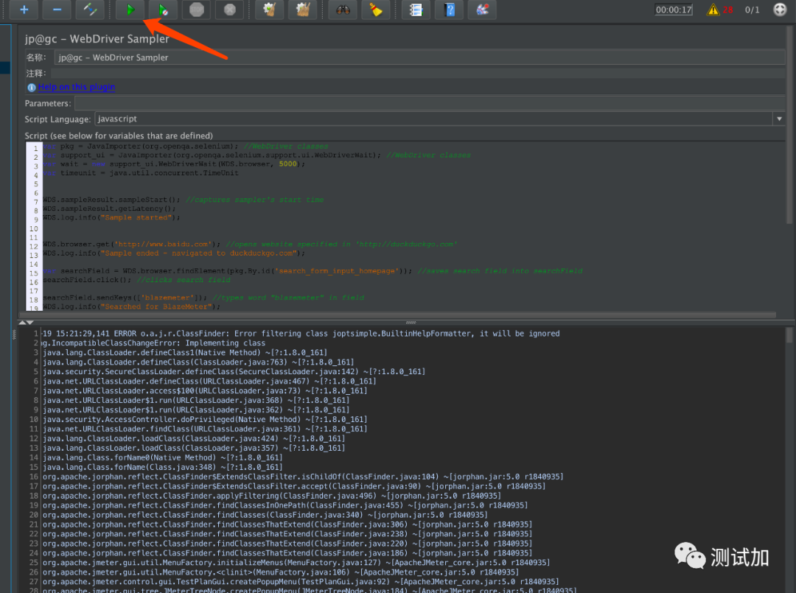

# Day26 实战篇 ——Jmeter实现web自动化测试实战

[TOC]


## 一、前言

jmeter是做服务端性能测试的工具，但jmeter还可以进行Web端自动化测试。参考了网上一些文章,本文就尝试体验下如何使用。

## 二、下载WebDriver依赖

核心还是需要WebDriver依赖才能启动网页。

1. 下载地址(https://jmeter-plugins.org/downloads/old/)JMeterPlugins-WebDriver-1.1.2 。



2.将JMeterPlugins-WebDriver-1.1.2\lib\ext中的*.jar拷贝到D:\apache-jmeter-2.13\lib\ext下。



3.将JMeterPlugins-WebDriver-1.1.2\lib中的*.jar拷贝到D:\apache-jmeter-2.13\lib下。

## 三、添加插件配置元件

重新jmeter后,在配置元件中可以看到Chromdriver Driver Config,说明插件配置成功。



配置本地Chrome Driver地址,Chrome Driver需要提前下载好。



## 四、添加WebDriver Sampler

在取样器中选择WebDriver Sampler采样器。



WebDriver Sampler采样器支持多种语言(java、beanshell、js),我们使用js语言编写自动化测试代码。

测试流程: 打开网页 -> 点击搜索 -> 输入文字  -> 点击完成



代码片段

```javascript
var pkg = JavaImporter(org.openqa.selenium); //WebDriver classes
var support_ui = JavaImporter(org.openqa.selenium.support.ui.WebDriverWait); //WebDriver classes
var wait = new support_ui.WebDriverWait(WDS.browser, );
var timeunit = java.util.concurrent.TimeUnit


WDS.sampleResult.sampleStart(); //captures sampler's start time
WDS.sampleResult.getLatency();
WDS.log.info("Sample started");


WDS.browser.get('http://duckduckgo.com'); //opens website specified in 'http://duckduckgo.com'
WDS.log.info("Sample ended - navigated to duckduckgo.com");

var searchField = WDS.browser.findElement(pkg.By.id('search_form_input_homepage')); //saves search field into searchField
searchField.click(); //clicks search field

searchField.sendKeys(['blazemeter']); //types word "blazemeter" in field
WDS.log.info("Searched for BlazeMeter");

var button = WDS.browser.findElement(pkg.By.id('search_button_homepage')); //Find Search button
button.click(); //Click Search Button
WDS.log.info("Clicked on the search button");

var link = WDS.browser.findElement(pkg.By.cssSelector('#r1-0 > div > h2 > a.result__a > b')); //also saves selector as variable but uses CSS.
link.click(); //Click the search result's Link

//设置整个事务的总的请求超时时间
WDS.browser.manage().timeouts().pageLoadTimeout(,timeunit.SECONDS);

WDS.sampleResult.sampleEnd();
```

复制

调试脚本的时候,打开debug日志比较方便调试。




示例代码2：

```javascript
function sleep(delay) {
  var start = (new Date()).getTime();
  while ((new Date()).getTime() - start < delay) {
    continue;
  }
}
WDS.sampleResult.sampleStart()
WDS.browser.get("https://www.baidu.com/");
var searchBox = WDS.browser.findElement(org.openqa.selenium.By.id("kw"));
searchBox.sendKeys('csdn 茉莉咯');
searchBox.sendKeys(org.openqa.selenium.Keys.ENTER);
sleep(3000);
// 4. Verify successful form submission
var results = WDS.browser.findElements(org.openqa.selenium.By.cssSelector("div > h3 > a[target='_blank']"))
if(results.empty) {
    WDS.sampleResult.successful = false
    WDS.sampleResult.responseMessage = 'There were no results returned'
}
WDS.sampleResult.sampleEnd()
```


## 五、总结

基于jmeter的扩展插件WebDriver并且结合js编写测试用例,可以实现WEB端自动化测试。jmeter是可以提供继承Samlper采样器开发扩展的采样器的,WebDriver插件开发原理也是基于这个特性来开发的。 不过使用jmeter做WEB端自动化测试是能做但是不适合。所以如果有开发能力的话,还是写自动化脚本实现吧。


-16872519912161.jpg)

