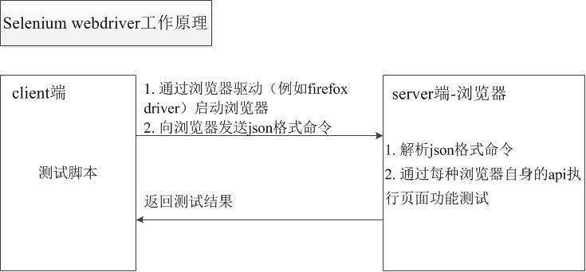
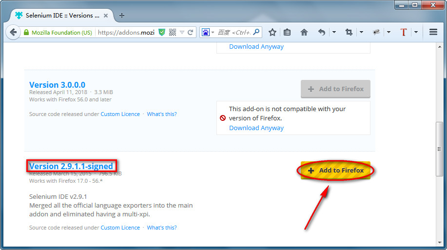
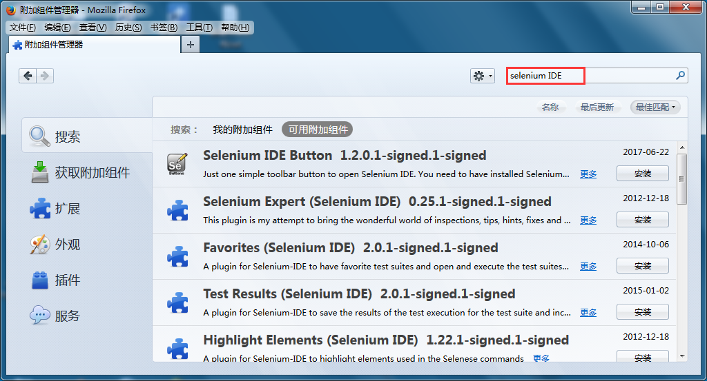
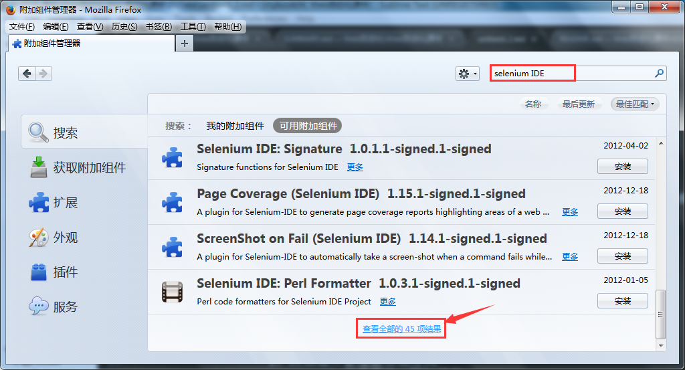
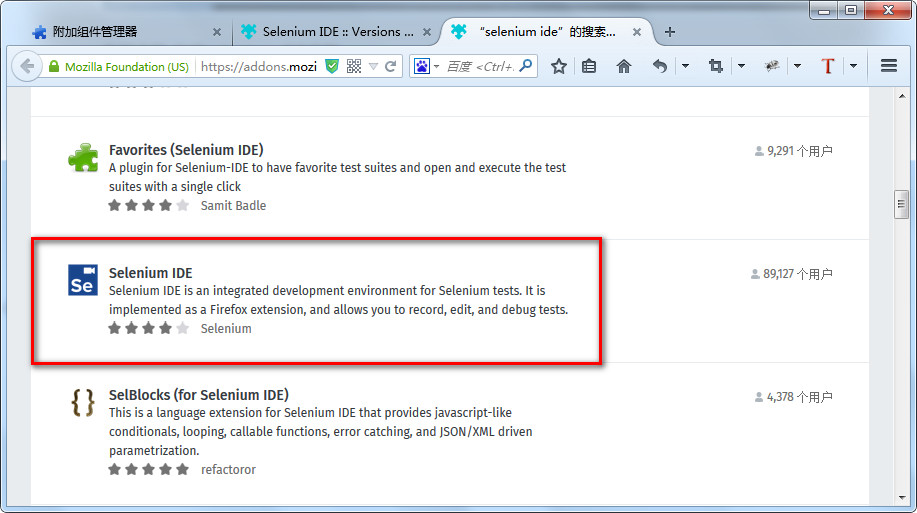
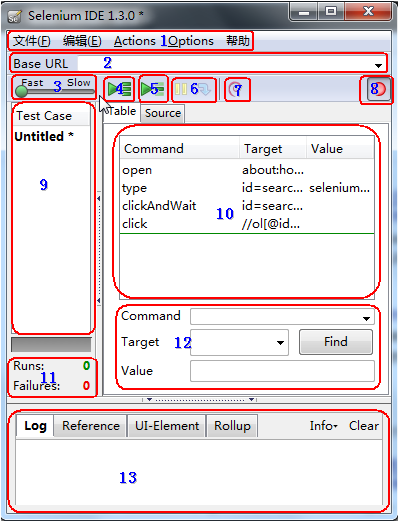
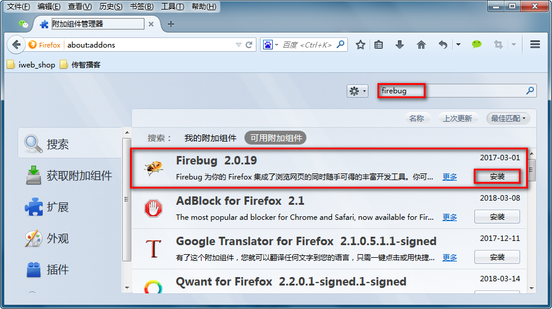
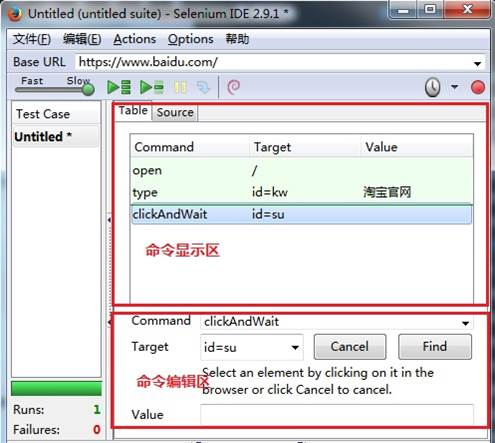
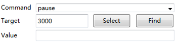

# Day27 Web自动化详解——什么是Web自动化测试？、为什么要学习Web自动化测试？、Selenium IDE安装与运行

[TOC]


# 什么是Web自动化测试？

## 目标

```
1. 了解什么是自动化
2. 理解什么是自动化测试
3. 为什么要使用自动化测试
```

------

## 1. 什么是自动化？

```
概念：由机器设备代替人为自动完成指定目标的过程              
```

### 1.1 优点：

```
1. 减少人工劳动力
2. 工作效率提高
3. 产品规格统一标准
4. 规模化(批量生产)
```

## 2. 什么是自动化测试

```
概念：让程序代替人为去验证程序功能的过程        
```

### 2.1 为什么要进行自动化测试？

```
1. 解决-回归测试
2. 解决-压力测试
3. 解决-兼容性测试
4. 提高测试效率,保证产品质量

回归测试：项目在发新版本之后对项目之前的功能进行验证；
压力测试：可以理解多用户同时去操作软件，统计软件服务器处理多用户请求的能力
兼容性测试：不同浏览器（IE、Firefox、Chrome）等等
```

#### 2.2 自动化测试相关知识

##### 自动化测试在什么阶段开始？

```
功能测试完毕(手工测试)

手工测试：就是由人去一个一个输入用例，然后观察结果；
```

##### 自动化测试所属分类

```
1. 黑盒测试(功能测试)
2. 灰盒测试(接口测试)
3. 白盒测试(单元测试)

提示：Web自动化测试属于黑盒测试(功能测试) 
```

#### 优点

```
1. 较少的时间内运行更多的测试用例；
2. 自动化脚本可重复运行；
3. 减少人为的错误；
4. 测试数据存储
```

#### 缺点

```
1. 不能取代手工测试；
2. 手工测试比自动化测试发现的缺陷更多；
3. 测试人员技能要求；

误区：    
    1). 自动化测试完全替代手工测试
    2). 自动化测试一定比手工测试厉害
    3). 自动化可以发掘更多的BUG
```

## 3. 自动化测试分类

```
1. Web-(UI)自动化测试(本阶段学习)
2. 接口-自动化测试
3. 移动(app)-自动化测试
4. 单元测试-自动化测试
```


# 为什么要学习Web自动化测试

------

## 目标

```
1. 为什么要学习Web自动化测试
2. 了解什么是Web自动化测试
3. 了解Web自动化测试常用工具        
```

------

## 1. 为什么要学习Web自动化测试

```
智联招聘
    自动化测试岗位-智慧星光
    自动化测试岗位-中铁信息
    
```


### 1.1 Web自动化测试的课程目标

```
课程目标:
    掌握selenium web UI界面自动化测试流程、方法，完成web UI界面元素自动化测试。
    掌握使用selenium进行web UI测试的方法并结合unittest框架实现用例的管理及报告的输出。
```

## 2. 什么是Web自动化测试？

```
概念：让程序代替人为自动验证Web项目功能的过程
```

## 3. 什么Web项目适合做自动化测试？

```
1.需求变动不频繁
2.项目周期长
3.项目需要回归测试
```

## 4. 如何进行Web自动化测试？(主流测试-工具)

```
1. QTP（收费）
        QTP是商业的功能测试工具，收费，支持web，桌面自动化测试。
2. Selenium（开源）【本阶段学习】
        Selenium是开源的web自动测试工具，免费，主要做功能测试。
3. Jmeter（开源、Web、接口、性能）
        Jmeter是由Apache公司使用Java平台开发的一款测试工具，支持（Web、接口测试、性能测试）
        提示：Web测试在通信层(无UI界面)
4. Loadrunner（收费、Web、性能）
        Loadrunner是商业性能测试工具，收费，功能强大，适合做复杂场景的性能测试
```

### 4.1 主流工具-汇结：

```
    Web自动化测试：selenium
    App端自动化测试：Appium、UIautomation
    PC客户端（win32）自动化测试：QTP
    接口自动化测试：Jmeter、Postman
    性能测试：Jmeter、LoadRunner
```

## 5. 什么是Selenium？

```
概念： Selenium是一个用于Web应用程序测试的工具；中文的意思（硒）
selenium是ThoughtWorks公司的一款强大的开源web界面自动化功能测试工具套件，
用来实现整个测试过程的管理，包括读入测试套件、执行测试和记录测试结果。 
selenium测试直接运行在浏览器中，模拟手动界面操作。
```

### 5.1 Selenium特点

```
1. 开源软件：源代码开放可以根据需要来增加工具的某些功能
2. 跨平台：linux 、windows 、mac
3. 核心功能：就是可以在多个浏览器上进行自动化测试
4. 多语言：Java、Python、C#、JavaScript、Rub5y等
5. 成熟稳定：目前已经被google , 百度， 腾讯等公司广泛使用
6. 功能强大：能够实现类似商业工具的大部分功能，因为开源性，可实现定制化功能
```

### 5.1 Selenium家族(发展史) 【了解】


### 5.2 Selenium RC和Selenium webdriver的工作原理对比

```
1. Selenium RC工作原理图
```


```
2. Selenium webdriver工作原理图
```



```
selenium webdriver执行效率更高的原因：
    可以直接操作浏览器，省去了中间环节，操作更直接。
    利用浏览器自身特定的api完成命令执行，执行方式更有针对性，执行效率更高。

selenium RC与selenium webdriver的区别：
    selenium RC不支持无头浏览器（运行在内存中，不依赖于拥有实际页面的浏览器）。
    selenium RC面向过程，selenium webdriver面向对象。
    selenium RC不支持移动端自动化测试。


重点：    
    1. SeleniumIDE
    2. Selenium2.0(WebDriver)
```

# Selenium IDE安装与运行

------

## 目标

```
1. 使用Selenium IDE录制脚本
2. 使用Selenium IDE录制的脚本转换成Python语言
```

------

## 1. Selenium IDE 是什么？

```
Selenium IDE：是一个Firefox插件，用于记录和播放用户与浏览器的交互。 （录制Web操作脚本）
seleniumIDE作用：
    实现页面操作的动作录制并输出为相应的脚本。
```

### 1.1 为什么要学习Selenium IDE？

```
1. 使用Selenium IDE录制脚本，体验自动化脚本魅力
2. 使用Selenium IDE录制的脚本转换为代码语言
    (在后期我们自己设计脚本时，如果不知道用什么方式定位元素，可使用此方法参考)
```

### 1.2 安装方式



```
1. 官网安装
        Version: 2.9.1.1
        通过官网安装插件：https://addons.mozilla.org/en-GB/firefox/addon/selenium-ide/versions/ 
2. 附加组件管理器
        1). 火狐浏览器 
        2). 附加组件管理器-->搜索selenium IDE
            提示：
                1. IDE前面有个空格
                2. 附加组件管理器启动方式-    
                        1) 工具菜单->附加组件
                        2) Ctrl+Shift+A
3. 离线安装
        安装：下载好selenium_ide-2.9.1-fx.xpi直接拖入浏览器安装
```

##### 在线安装 搜索selenium IDE示意图



##### 在线安装 点击查看全部XX项结果



##### 在线安装 选择selenium IDE安装



##### 滚动条下拉选择 查看所有版本


```
    火狐浏览器 V35.0 选择 selenium IDE 2.9.1.1        
```

### 1.3 Selenium IDE运行

```
1. Ctrl+Alt+S
2. 工具栏——>Selenium IDE
```



```
1. 文件：创建、打开和保存测试案例和测试案例集。编辑：复制、粘贴、删除、撤销和选择测试案例中的所有命
        令。Options : 用于设置seleniunm IDE。
2. 用来填写被测网站的地址。
3. 速度控制：控制案例的运行速度。
4. 运行所有：运行一个测试案例集中的所有案例。
5. 运行：运行当前选定的测试案例。
6. 暂停/恢复：暂停和恢复测试案例执行。
7. 单步：可以运行一个案例中的一行命令。
8. 录制：点击之后，开始记录你对浏览器的操作。
9. 案例集列表。
10. 测试脚本；table标签：用表格形式展现命令及参数。source标签：用原始方式展现，默认是HTML语言格式，
    也可以用其他语言展示。
11. 查看脚本运行通过/失败的个数。
12. 当选中前命令对应参数。
13. 日志/参考/UI元素/Rollup            
```

------

### 练习1

```
需求：使用Selenium IDE插件录制->打开百度搜索引擎，搜索框输入[淘宝官网]，点击[百度一下]按钮
```

### 练习1 脚本


#### 重点分析：

```
1. 录制：录制时红色录制按钮一定要打开->按下状态
2. 回放：由于网络延迟原因-建议选择最低
3. 浏览器：回放时浏览器要保持打开状态（否则点击回放，脚本无响应）            
```

#### 重点说明：

```
1. id=kw：为百度搜索文本框id属性和值
2. id=su: 为百度一下按钮id属性和值            
```

### 思考？

```
如何快速查找一个元素标签的属性和值？
```

## 2. 定位调试插件

```
1. FireBug【重要】
        FireBug插件是火狐浏览器一款插件，能够调试所有网站语言，同时也可以快速定位HTML页面中的元素；
        作用：定位元素(获取元素定位和查看元素属性)；        
```

### 2.1 Firebug 插件安装



```
在线安装： 
        1). 火狐浏览器 V35.0
        2). 附加组件管理器-->搜索FireBug
```

### 练习2

```
将刚才录制的操作百度页面的用例导出为脚本
```

### 将练习2脚本 转换成Python语言


```
将录制的动作导出为脚本：
    1. 选择“文件”菜单。
    2. 选择“Export Test Case As…”    
    3. 导出为“Python2/unittest/WebDriver”。    
切记：导出为脚本时，脚本的名称必须符合python中标识符的命名规则：由字母、数字下划线组成，且只能以字母或下划线开头
```

### 提示：

```
录制脚本时候是录制鼠标和键盘的所有在浏览器操作，那么脚本会出现多余的步骤，有时候我们需要手动填写脚本
或修改脚本,所有我们有必要对Selenium IDE脚本编辑与操作有所了解;
```

------

## 3. Selenium IDE脚本编辑与操作 【了解】

```
目的：手动修改或编写脚本（采用录制方式很容易记录出多余的操作）
```

### 3.1 编辑一行命令

```
在Table标签下选中某一行命令，命令由command、Target、value三部分组成。可以对这三部分内容那进行编辑。
    1. command：命令名
    2. target：命令的操作对象（页面元素）
    3. value：对页面元素输入的数据
```



### 3.2 插入命令

```
在某一条命令上右击，选择“insert new command”命令，就可以插入一个空白，然后对空白行进程编辑
```

### 3.3 插入注释

```
鼠标右击选择“insert new comment”命令插入注解空白行，本行内容不被执行，可以帮助我们更好的理解脚本，
插入的内容以紫色字体显示。
```

### 3.4 移动命令

```
有时我们需要移动某行命令的顺序，我们只需要左击鼠标拖动到相应的位置即可。
```

### 3.5 删除命令

```
选择单个或多个命令，然后点击鼠标右键选择“Delete”
```

### 3.6 命令执行

```
选定要执行的命令点击单个执行按钮即可，注意：有一些命令必须依赖于前面命令的运行结果才能成功执行，否则会导致执行失败。
```

### 提示：

```
我们对脚本的编辑和操作已有所了解，那么我们练习1和练习2录制出来的脚本中那些命令又都是有什么作用?   
```

------

## 4. Selenium IDE常用命令【了解】

```
在这里我们只对几个常用的命令做个介绍
```

### 4.1 open(url)命令

```
作用：打开指定的URL，URL可以为相对或是绝对URL；

Target：要打开的URL；value值为空
    1). 当Target为空，将打开Base URL中填写的页面；
    2). 当Target不为空且值为相对路径，将打开Base URL + Target页面。如，假设Base URL为http://www.soso.com，而Target为/about.html，则执行open命令时，将打开http://www.soso.com/about.html
    3). 当Target以http://开头时，将忽略Base URL，直接打开Target的网址；            
```

### 4.2 pause(waitTime)

```
作用：暂停脚本运行
waitTime：等待时间，单位为ms；//Target=1000
```



### 4.3 goBack()

```
作用：模拟单击浏览器的后退按钮； 
提示：由于没有参数，所以Target和Value可不填；
```

### 4.4 refresh()

```
作用：刷新当前页；
提示：由于没有参数，所以Target和Value可不填；
```

### 4.5 click(locator)

```
作用：单击一个链接、按钮、复选框或单选按钮；
提示：如果该单击事件导致新的页面加载，命令将会加上后缀“AndWait”，即“clickAnd Wait”，或“waitForPageToLoad”命令；
```

### 4.6 type(locator,value)

```
作用：向指定输入域中输入指定值；也可为下拉框、复选框和单选框按钮赋值.
Target：元素的定位表达式；
Value：要输入的值；
```

### 4.7 close()

```
作用：模拟用户单击窗口上的关闭按钮；
提示：由于没有参数，所以Target和Value可不填；
```

### 4.8 练习

```
录制百度搜索脚本
    1.打开浏览器
    2.打开插件
    3.在selenium IDE命令编辑区执行如下操作:
        访问百度
        搜索python
        暂停3秒
        在地址栏打开新网址：http://www.hao123.com
        暂停3秒
        回退到百度页面
        暂停3秒
    4.点击播放按钮
    5.导出为python脚本
```

------

## 5. 总结

```
1. 为什么学习Selenium IDE插件工具
2. Selenium安装、启动方式
3. FireBug作用
4. Selenium IDE常用命令
```