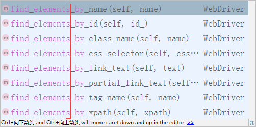

# Day28 Web自动化详解（3）——WebDriver(Selenium)元素定位

# WebDriver-元素定位

------

## 目标

```
1. 了解元素各种定位方法
2. 掌握id、name、class_name、tag_name、link_text、partial_link_text定位的使用
```

------

## 1. 为什么要学习元素定位方式？

```
1. 让程序操作指定元素，就必须先找到此元素；
2. 程序不像人类用眼睛直接定位到元素；
3. WebDriver提供了八种定位元素方式
```

## 2. WebDriver 元素定位方式

```
1. id
2. name
3. class_name
4. tag_name
5. link_text
6. partial_link_text
7. Xpath
8. Css
```

### 定位方式分类-汇总：

```
1). id、name、class_name：为元素属性定位
2). tag_name：为元素标签名称
3). link_text、partial_link_text：为超链接定位(a标签)
4). Xpath：为元素路径定位
5). Css：为CSS选择器定位
```

### 案例-1 [注册页面](../02img/素材-注册页面.rar)

```
1. 为了更好的学习这八种方式和网络的关系，我们在案例-1注册页面上来练习自动化脚本设计，提高学习效率和
   脚本执行速率
2. 语言使用Python
3. 开发工具使用Pycharm
4. selenium使用2.48.0
```

### 2.1 id定位

```
说明：HTML规定id属性在整个HTML文档中必须是唯一的，id定位就是通过元素的id属性来定位元素；
前提：元素有id属性

实现案例-1需求：
    1). 打开注册A.html页面，使用id定位，自动填写(账号A：admin、密码A:123456)
     2). 填写完毕后，3秒钟关闭浏览器窗口            
```

#### id定位方法

```
find_element_by_id()
```

#### id定位实现 步骤分析

```
1. 导入selenium包 --> from selenium import webdriver
2. 导入time包 --> from time import sleep
3. 实例化火狐浏览器 --> driver=webdriver.Firefox()
4. 打开注册A.html --> driver.get(url)
5. 调用id定位方法 --> driver.find_element_by_id("")
6. 使用send_keys()方法发送数据 --> .send_keys("admin")
7. 暂停3秒 --> sleep(3)
8. 关闭浏览器 --> quit()

说明：为了接下来更好的而学习体验，我们先暂时使用下，send_keys()和quit()方法，在2.4节元素操作讲解；
```

#### id定位 案例-1代码：

```
from selenium import webdriver
from time import sleep
driver=webdriver.Firefox()
url='E:\\测试\\课件\\Web自动化\\Web自动化课件\\02img\\注册A.html'
driver.get(url)
user=driver.find_element_by_id("userA")
user.send_keys("admin")
pwd=driver.find_element_by_id("passwordA")
pwd.send_keys("123456")
sleep(3)
driver.quit()
```

#### id定位-总结

```
1. 导包
2. url中\\转义
3. id定位方法
3. 发送内容方法
4. 暂停方法
5. 关闭浏览器
```

------

### 2.2 name定位

```
说明：HTML规定name属性来指定元素名称，因此它的作用更像人名，name的属性值在当前文档中可以不是唯一的
      ，name定位就是根据元素name属性来定位
前提：元素有name属性

实现案例-1需求：
    1). 打开注册A.html页面，使用name定位，自动填写(账号A：admin、密码A:123456)
    2). 填写完毕后，3秒钟关闭浏览器窗口            
```

#### name定位方法

```
find_element_by_name()
```

#### name定位实现 步骤分析

```
1. 参考id定位
```

### 2.3 class_name定位

```
说明：HTML规定了class来指定元素的类名，用法和name、id类似；
前提：元素有class属性

实现案例-1需求：
    通过class_name定位电话号码A，并发送18611111111            
```

#### class_name定位方法

```
find_element_by_class_name()
```

#### class_name定位实现 步骤分析

```
1. 参考id定位
```

### 2.4 tag_name定位

```
说明：HTML本质就是由不同的tag(标签)组成，而每个tag都是指同一类，所以tag定位效率低，
      一般不建议使用；tag_name定位就是通过标签名来定位；
实现案例-1需求：
    1). 打开注册A.html页面，使用tag_name定位，自动填写(账号A：admin)
    2). 填写完毕后，3秒钟关闭浏览器窗口
```

#### tag_name定位方法

```
1. find_element_by_tag_name()
        返回：符合条件的第一个标签
2. 如何获取第二个元素？稍后(2.7节)讲解
```

#### tag_name定位实现 步骤分析

```
1. 参考id定位
```

### 2.5 link_text定位

```
说明：link_text定位与前面4个定位有所不同，它专门用来定位超链接文本（<a>标签</a>）。

实现案例-1需求：
    1). 打开注册A.html页面，使用link_text定位(访问 新浪 网站)超链接
    2). 3秒钟关闭浏览器窗口    
```

#### link_text定位方法

```
1. 方法：find_element_by_link_text()    
2. 说明：需要传入a标签全部文本(访问 新浪 网站)    
```

#### link_text 步骤分析

```
1. 参考id定位
2. 点击 --> click()
```

### 2.6 partial_link_text定位

```
说明：partial_link_text定位是对link_text定位的补充，partial_like_text为模糊匹配；link_text全部匹配

实现案例-1需求：
    1). 打开注册A.html页面，使用partial_link_text定位(访问 新浪 网站)超链接
    2). 3秒钟关闭浏览器窗口    
```

#### partial_link_text定位方法

```
1. 方法：find_element_by_partial_link_text()    
2. 说明：需要传入a标签局部文本-能表达唯一性(访问 新浪 网站)
```

#### partial_link_text 步骤分析

```
1. 参考link_text定位
```

### 提示

```
在我们学习使用以上方法的时候，发现有个共同的相似方法：
```



#### 2.7 find_element[s]_by_XXX()

```
作用：
    1). 查找定位所有符合条件的元素
    2). 返回的定位元素格式为数组(列表)格式；
说明：
    1). 列表数据格式的读取需要指定下标(下标从0开始)
```

#### 操作(2.4 tag_name)

```
说明：使用tag_name获取第二个元素(密码框)

代码：
    ...
    driver.find_elements_by_tag_name("input")[1].send_keys("123456")
    ...
```

------

## 3. 2.1-2.6定位 总结

```
1. id、name、class_name
2. tag_name
3. link_text、partial_link_text
4. find_elements_by_XXX()
```

------

## 思考？

```
1. 在实际项目中标签没有id、name、class属性改如何定位？
2. id、name、class属性值为动态获取，随着刷新或加载而变化，改如何定位？
```