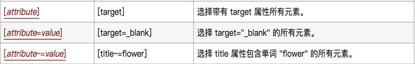

# Day30 Web自动化详解（4）——WebDriver(Selenium)——XPath、CSS定位

[TOC]


# XPath、CSS定位

------

## 目标

```
1. 熟悉Xpath定位策略
2. 熟悉CSS定位策略
```

------

# 为什么要学习XPath、CSS定位？

```
1. 在实际项目中标签没有id、name、class属性
2. id、name、class属性值为动态获取，随着刷新或加载而变化    
```

------

## 1. 什么是Xpath？

```
1. XPath即为XML Path 的简称，它是一种用来确定XML/HTML文档中某部分位置的语言。
2. HTML可以看做是XML的一种实现，所以Selenium用户可以使用这种强大的语言在Web应用中定位元素。

Xpath用途：
基于HTML文档结构使用XPath进行元素定位

提示：Xpath为强大的语言，那是因为它有非常灵活定位策略；
```

### 思考

```
Xpath有那些策略呢？
```

## 2. HTML文档结构

```
1. HTML DOM
    HTML DOM（HTML document object model）：HTML文档对象模型，定义了访问和操作HTML文件的标准。
    DOM 定义了访问 HTML 和 XML 文档的标准：
    “W3C 文档对象模型 （DOM） 是中立于平台和语言的接口，它允许程序和脚本动态地访问和更新文档的内容、结构和样式。”
2. HTML DOM特点
    HTML DOM 是：
    HTML 的标准对象模型 
    HTML 的标准编程接口 
HTML DOM 定义了所有 HTML 元素的对象和属性，以及访问它们的方法。换言之，HTML DOM 是关于如何获取、修改、添加或删除 HTML 元素的标准。

在 HTML DOM 中，所有事物都是节点。DOM 是被视为节点树的 HTML。
根据 W3C 的 HTML DOM 标准，HTML 文档中的所有内容都是节点：
    1). 整个文档是一个文档节点 
    2). 每个 HTML元素是元素节点 
    3). HTML元素内的文本是文本节点 
    4). 每个 HTML 属性是属性节点 
    5). 注释是注释节点 
DOM的说明：
    1. 将HTML中所有内容均看待成节点
    2. 将所有节点按照层次结构组织成一棵树
    从DOM树的根节点开始描绘出一条通往指定节点的路径，该路径信息称作为指定节点的Xpath路径。
```

### HTML DOM范例

```
<html>
 <head>
     <title>DOM 介绍</title>
 </head> 
<body> 
    <h1>DOM 结构</h1> 
    <p>Hello world!</p> 
    <a href=“#”>link text</a>
</body> 
</html> 

范例文档对应的DOM结构：
```


## 3. Xpath定位策略(方式)

```
1. 路径-定位
    1). 绝对路径
    2). 相对路径 
2. 利用元素属性-定位
3. 层级与属性结合-定位
4. 属性与逻辑结合-定位
```

### Xpath定位 方法

```
driver.find_element_by_xpath()
```

### 3.1 路径(绝对路径、相对路径)

```
绝对路径：从最外层元素到指定元素之间所有经过元素层级路径 ；如:/html/body/div/p[2]
          提示：
              1). 绝对路径以/开始
              2). 使用Firebug可以快速生成，元素XPath绝对路径

相对路径：从第一个符合条件元素开始(一般配合属性来区分)；如：//input[@id='kw']
          提示：
              1). 相对路径以//开始
              2). 使用Friebug扩展插件FirePaht可快速生成，元素相对路径
```

### 使用Xpath实现 案例-1

```
需求：
    1). 使用绝对路径和相对路径分别实现，账号A：admin;密码A：123456；自动化脚本设计
```

### 3.2 利用元素属性

```
说明：快速定位元素，利用元素唯一属性；
示例：//*[@id='userA']    
```

### 3.3 层级与属性结合

```
说明：要找的元素没有属性，但是它的父级有；
示例：//*[@id='p1']/input
```

### 3.4 属性与逻辑结合

```
说明：解决元素之间个相同属性重名问题
示例：//*[@id='telA' and @class='telA']
```

### 3.5 Xpath-延伸

```
//*[text()="xxx"]                            文本内容是xxx的元素

//*[starts-with(@attribute,'xxx')]                属性以xxx开头的元素

//*[contains(@attribute,'Sxxx')]                属性中含有xxx的元素
```

### 练习

```
用尽可能多的方法编写xpath路径定位css_example.html文件元素：
    1. div1标签
    2. div1中p1的a标签        
    3. 最后一个a标签
```

### 3.6 Xpath-总结

```
1. 如何通过Friebug快速生成绝对路径
2. 如果通过Friebug快速生成相对路径
3. Xpath策略有那些
```

------

## 3. CSS定位

### 3.1 什么是CSS？

```
CSS 中选择器是一种模式，用于选择需要添加样式的元素。计算机能够通过CSS选择器定位到相应元素，我们在编写自动化测试脚本时是在不断地找到CSS选择器对应的元素。
CSS中通过各种选择器选择不同的页面元素，完成了颜色、字体、宽高等的设定，既然可以通过CSS选择器完成元素选择及样式设定，则也可利用CSS选择器的规则完成自动化测试脚本中的元素定位。
1. CSS（Cascading Style Sheets）是一种语言，它用来描述HTML和XML的元素显示样式；
   (css语言书写两个格式：
                           1. 写在HTML语言中<style type="text/css">...    
                           2. 写在单独文件中 后缀.css
       )
2. 而在CSS语言中有CSS选择器(不同的策略选择元素)，在Selenium中也可以使用这种选择器；
提示：
    1. 在selenium中极力推荐CSS定位，因为它比XPath定位速度要快
    2. css选择器语法非常强大，在这里我们只学习在测试中常用的几个
```

#### CSS定位 方法

```
driver.find_element_by_css_selector()
```

### 3.2 CSS定位常用策略 (方式)

```
1. id选择器
2. class选择器
3. 元素选择器
4. 属性选择器
5. 层级选择器
```

### 使用CSS实现 案例-2

```
需求：
    1). 使用CSSid定位实现，账号A：admin;密码A：123456；自动化脚本设计
```

#### 通过伪类名、id、标签名定位


#### class选择器

```
说明：根据元素class属性来选择
格式：.class 如：.telA <选择class属性值为telA的所有元素>
```

#### 元素选择器

```
说明：根据元素的标签名选择
格式：element 如：input <选择所有input元素>
```

#### 属性选择器

```
说明：根据元素的属性名和值来选择
格式：[attribute=value] 如：[type="password"] <选择所有type属性值为password的值>
```

#### 层级选择器

```
说明：根据元素的父子关系来选择
格式：element>element 如：p>input <返回所有p元素下所有的input元素>
提示：> 可以用空格代替 如：p input 或者 p [type='password']
```

#### 通过元素之前嵌套关系


#### 通过属性

 

#### 通过父子关系


#### 元素状态


#### 3.3 练习

```
1. 在百度首页通过css的标签定位方式定位input标签，并且证明首个input标签是name属性值为ie的标签。
2. 使用css定位方式依次访问sample_test.html中的元素
    1. div1使用id定位方式
    2. div1中p1的a标签采用层级定位方式（多层级定位）
    3. 最后一个a标签应该采用何种定位方式？（无特定属性）
```

### 3.4 CSS总结

| 选择器            | 例子              | 描述                                    |
| ----------------- | ----------------- | --------------------------------------- |
| #id               | #userA            | id选择器，选择id="userA"的所有元素      |
| .class            | .telA             | class选择器，选择class="telA"的所有元素 |
| element           | input             | 选择所有input元素                       |
| [attribute=value] | [type="password"] | 选择type="password"的所有元素           |
| element>element   | p>input           | 选择所有父元素为p元素的input元素        |

------

## 4. XPath与CSS类似功能对比

| 定位方式 | XPath                                                        | CSS                                                         |
| -------- | ------------------------------------------------------------ | ----------------------------------------------------------- |
| 元素名   | //input                                                      | input                                                       |
| id       | //input[@id='userA']                                         | #userA                                                      |
| class    | //*[@class='telA']                                           | .telA                                                       |
| 属性     | 1. //※[text()="xxx"] 2. //※[starts-with(@attribute,'xxx')] 3. //※[contains(@attribute,'xxx')] | 1. input[type^='p'] 2. input[type$='d'] 3. input[type*='w'] |

```
说明：由于显示排版原因以上所有(※)号代替(*)
```

## 5. 八种元素定位总结：

```
1. id
2. name
3. class_name
4. tag_name
5. link_text
6. partial_link_text
7. Xpath
8. Css

说明：
    1). 元素定位我们就学到这里了
    2). WebDriver除了提供以上定位API方法(driver.find_element_by_xxx())
        外，还提供了另外一套写法；
    3). 调用find_element()方法，通过By来声明定位的方法，并且传入对应的方法和参数（了解-熟悉即可）
```

------

## 6. 定位(另一种写法)-延伸【了解】

```
说明：第二种方法使用By类的封装的方法,所以需要导入By类包
```

### 6.1 导入By类

```
导包：from selenium.webdriver.common.by import By
```

### 6.2 By类的方法

```
方法：find_element(By.ID,"userA") 
      备注：需要两个参数，第一个参数为定位的类型由By提供，第二个参数为定位的具体方式
示例：
    1. driver.find_element(By.CSS_SELECTOR,'#kw').send_keys("python")
    2. driver.find_element(By.XPATH,'//*[@id="kw"]').send_keys('python')
    3. driver.find_element(By.ID,"kw").send_keys("python")
    4. driver.find_element(By.NAME,"用户名标签name属性值").send_keys("123456")
    5. driver.find_element(By.CLASS_NAME,"用户名标签class属性值").send_keys("18611111111")
    6. driver.find_element(By.TAG_NAME,'input').send_keys("python")
    7. driver.find_element(By.LINK_TEXT,'hao123').click()
    8. driver.find_element(By.PARTIAL_LINK_TEXT,'hao').click()
```

### 6.3 find_element_by_xxx()和find_element() 区别

```
说明：通过查看find_element_by_id底层实现方法，发现底层也是调用的By类方法进行的封装；

    def find_element_by_id(self, id_):
    """Finds an element by id.

    :Args:
     - id\_ - The id of the element to be found.

    :Usage:
        driver.find_element_by_id('foo')
    """
    return self.find_element(by=By.ID, value=id_)

总结：虽然方法一样，但WebDriver推荐 find_element_by_xxx()这种方法
```


## 7.尝试练习：

```
1. 在百度首页定位一组input标签并且找出”type”属性不是”hidden”的标签。
2. 操作斗鱼页面
    验证经过点击“下一页”确实由第一页切换到了第二页(用xpath规则完成)
3. 将八种元素定位方式封装为一个功能函数，定义为一个模块
    以课程演示的范例作为应用访问该模块，完成元素定位及操作
    也可以将八个小的范例也定义为函数分别完成调用
4. 获取58“个人房源”元素列表并显示房屋链接文本。
5. 附加：
    跟踪find_element_by_xxx()方法：
        1). 该方法使用了哪一个下级方法
        2). class、tag_name、id定位方式在find_element_by_xxx()的下级方法中是使用了哪种定位方式？


总结：虽然方法一样，但WebDriver推荐 find_element_by_xxx()这种方法
```


-16872525371235.jpg)