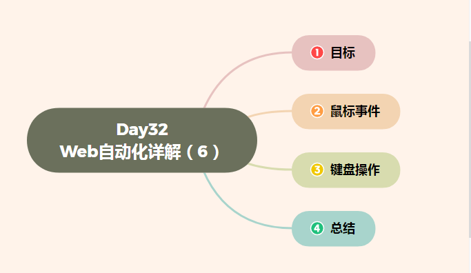

# Day32 Web自动化详解（6）——WebDriver(Selenium)——WebDriver鼠标、键盘操作


[TOC]




# 目标

```
1. 了解WebDriver操作鼠标方法
2. 了解WebDriver操作键盘方法
```

------

# 1. 鼠标事件

```
说明：WebDriver库对模拟鼠标操作封装的一些方法，此知识点作为了解
```

#### 1.1 WebDriver为什么要操作鼠标？

```
说明：现在Web产品中提供了丰富的鼠标交互方式，如：双击、悬停、拖拽等功能，做为Web产品测试框架，需要
      应对这些Web产品应用场景，所以在WebDriver类库中封装了相应的鼠标交互方法。

疑问: WebDriver提供了那些操作鼠标事件的方法？
```

#### 1.2 WebDriver操作鼠标方法

```
说明：在WebDriver中将操作鼠标的方法封装在ActionChains类中

1. context_click()            右击 --> 此方法模拟鼠标右键点击效果
2. double_click()            双击 --> 此方法模拟双标双击效果
3. drag_and_drop()            拖动 --> 此方法模拟双标拖动效果
4. move_to_element()        悬停 --> 此方法模拟鼠标悬停效果
5. perform()                执行 --> 此方法用来执行以上所有鼠标方法

为了更好的学习其他方法，我们先学习perform()执行方法,因为所有的方法都需要执行才能生效
```

#### 1.3 鼠标执行-perform()

```
说明：在ActionChains类中所有提供的鼠标事件方法，在调用的时候所有的行为都存储在ActionChains类中，
      而perform()方法就是执行所有ActionChains中的行为

提示：必须调用perform()方法才能执行鼠标事件
```

#### 1.4 鼠标右键-context_click()

```
说明：在ActionChains类中的鼠标右键方法是个已知的bug，因为它能点击右键出现菜单，但无法选择右键菜单选
      项，因此方法了解即可

需求：
    案例-1注册页面A,在用户名文本框上点击鼠标右键
```

##### 代码实现关键点分析

```
1. 导包：from selenium.webdriver.common.action_chains import ActionChains
2. 实例化ActionChains对象：Action=ActionChains(driver)
3. 调用右键方法：element=Action.context_click(username)
4. 执行：element.perform()
```

#### 1.5 鼠标双击-double_click()

```
说明：模拟双击鼠标左键操作

需求：
    案例-1注册页面A，给用户名设置为admin,暂停3秒钟后双击鼠标左键，选中admin；
```

##### 代码实现关键点分析

```
1. 导包...
2. 实例化...
3. 调用双击方法：element=Action.double_click(username)
4. 执行...
```

#### 1.6 鼠标拖动-drag_and_drop()

```
说明：模拟鼠标拖动动作，选定拖动源元素释放到目标元素
```

##### 拖动关键点分析

```
1. 源元素   socure=driver.find_element_by_id(xxx)
2. 目标元素 target=driver.find_element_by_id(xxx)
3. 调用方法 Action.drag_and_drop(source,target).perform()
```

#### 1.7 鼠标悬停-move_to_element()

```
说明: 模拟鼠标悬停在选中的元素

需求：
    案例-1注册页面A，将模拟鼠标悬停 用户注册A 按钮，显示加入会员A提示
```

##### 代码实现关键点分析

```
1. 导包...
2. 实例化...
3. 调用悬停方法：Action.move_to_element(element).perform()
```

#### 1.8 鼠标操作 总结

```
1. 以上鼠标操作方法作为了解知识；
2. 建议掌握悬停方法
```

------

# 2. 键盘操作

```
说明：
    1). 模拟键盘上一些按键或者组合键的输入 如：Ctrl+C 、Ctrl+V；
    2). WebDriver中对键盘的操作都封装在Keys类中
```

#### 2.1 Keys类

```
导包：from selenium.webdriver.common.keys import Keys
```

#### 2.2 常用的键盘操作

```
1. send_keys(Keys.BACK_SPACE)删除键（BackSpace） 
2. send_keys(Keys.SPACE)空格键(Space) 
3. send_keys(Keys.TAB)制表键(Tab) 
4. send_keys(Keys.ESCAPE)回退键（Esc） 
5. send_keys(Keys.ENTER)回车键（Enter） 
6. send_keys(Keys.CONTROL,'a') 全选（Ctrl+A） 
7. send_keys(Keys.CONTROL,'c')复制（Ctrl+C）

提示：以上方法就不一个一个讲解了，因为调用方法都一样；
```

#### 2.3 案例-1 注册页面A

```
需求：
    1). 输入用户名：admin1，暂停2秒 删除1
    2). 全选用户名：admin      暂停2秒
    3). 复制用户名：admin      暂停2秒
    4). 粘贴到密码框          暂停2秒
    5). 关闭浏览器
```

#### 2.4 案例-1 方法示例

```
# 定位用户名
element=driver.find_element_by_id("userA")
# 输入用户名
element.send_keys("admin1")
# 删除1
element.send_keys(Keys.BACK_SPACE)
# 全选
element.send_keys(Keys.CONTROL,'a')
# 复制
element.send_keys(Keys.CONTROL,'c')
# 粘贴
driver.find_element_by_id('passwordA').send_keys(Keys.CONTROL,'v')
```

# 3. 鼠标、键盘-总结

```
1. ActionChains作用和位置
2. 鼠标悬停方法
3. Keys类 位置
4. 键盘操作调用方法
```


.jpg)