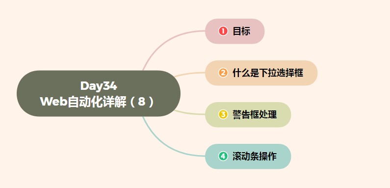

# Day34 Web自动化详解（8）——WebDriver(Selenium)——**下拉选择框、警告框、滚动条操作**


[TOC]




# 目标

```
1. 掌握下拉选择框的操作方法
2. 掌握处理警告框的方法
3. 掌握调用JavaScript方法
```

------

# 1. 什么是下拉选择框

```
说明：下拉框就是HTML中<select>元素；
```

### 1.1 为什么学习下拉选择框？

#### 需求：

```
案例-1 注册页面A，城市选项-暂停2秒后选择上海A，暂停2秒后选择重庆，暂停2秒后选择广州
```

#### 案例-1 实现方式

```
1. 定位option选项
2. 定位方式不限
```

#### 问题

```
1. 经过刚才代码演示，只能定位根据option选项的值来判断；
2. 如果有多个选项原有的定位方式处理起来比较繁琐；
```

### 1.2 Select类

```
说明：Select类是WebDriver为解决select标签定位诞生的，此类定位的是select标签

select类有哪些方法？
```

#### select方法：

```
1. select_by_index()                --> 根据option索引来定位，从0开始
2. select_by_value()                --> 根据option属性 value值来定位
3. select_by_visible_text()            --> 根据option显示文本来定位
```

### 1.3 Select类实现 步骤分析：

```
1. 导包 Select类 --> from selenium.webdriver.support.select import Select
2. 实例化Select类 select=Select(WebElemet)
                    (WebElement):driver.find_element_by_id("selectA"))
3. 调用方法：select.select_by_index(index)
                (index：为列表索引，从0开始)
```

### 1.4 Select实现代码 总结

```
#导包
from selenium.webdriver.support.select import Select
...
# 1. 根据索引实现
select.select_by_index(1)
select.select_by_index(3)
select.select_by_index(2)
# 2. 根据文本值实现
select.select_by_visible_text("A上海")
select.select_by_visible_text("A重庆")
select.select_by_visible_text("A广州")
# 3. 根据value属性实现
select.select_by_value("sh")
select.select_by_value("cq")
select.select_by_value("gz")
...
```

------

### 需求

```
对案例-1 注册页面A，首先点击alerta按钮，其次输入用户名：admin
```

#### 问题

```
1. 按钮被点击后弹出对话框，而接下来输入用户名的语句没有生效
```

------

# 2. 警告框处理

```
说明：WebDriver中对处理警告框的操作，有专用的处理方法；

提示：
    HTML中常用的对话框有三种，处理的方法都一样
        1). alert
        2). confirm
        3). prompt
```

### 2.1 警告框处理方法

```
1. text                 --> 返回alert/confirm/prompt中的文字信息
2. accept()                --> 接受对话框选项
3. dismiss()            --> 取消对话框选项
```

### 2.2 调用方法

```
1. 获取警告框 
        alert=driver.switch_to.alert
2. 调用
        alert.text
        alert.accept()
        alert.dismiss()
```

### 2.3 处理警告框-总结

```
...
# 定位alerta按钮
driver.find_element_by_id("alerta").click()
# 获取警告框
alert=driver.switch_to.alert
# 打印警告框文本
print(alert.text)
# 接受警告框
alert.accept()
# 取消警告框
#alert.dismiss()
...
```

------

# 3. 滚动条操作

```
说明：WebDriver类库中并没有直接提供对滚动条进行操作方法，但是它提供了可调用JavaScript脚本的方法，所
      以我们可以通过JavaScript脚本来达到操作滚动条的目的；

备注：
    1). 滚动条：一种可控制程序显示范围的组件
    2). JavaScript：一种流行脚本语言，可以操作HTML标签；
            JavaScript学习资料：http://www.w3school.com.cn/js/js_intro.asp
```

### 3.1 为什么要学习滚动条操作？

```
1. 在HTML页面中，由于前端技术框架的原因，页面元素为动态显示，元素根据滚动条的下拉而被加载
2. 页面注册同意条款，需要滚动条到最底层，才能点击同意
```

#### 需求

```
案例-1 注册页面A，打开页面2秒后，滚动条拉倒最底层
```

#### 需求实现分析：

```
1. 设置JavaScritp脚本控制滚动条  js="window.scrollTo(0,1000)"
                                    (0:左边距；1000：上边距；单位像素)
2. WebDriver调用js脚本方法  driver.execute_script(js)
```

### 3.2 控制滚动条实现代码

```
...
# 最底层
js1="window.scrollTo(0,1000)"
# 最顶层
js2="window.scrollTo(0,0)"
# 执行最底层
driver.execute_script(js1)
# 执行最顶层
driver.execute_script(js2)
...
```

### 3.3 滚动条总结

```
1. WebDriver控制滚动方法
2. JavaScript控制滚动条语句

备注：js控制滚动条语句有很多种，如：js=document.documentElement.scrollTop=1000;但是推荐使用JS调用
      window句柄去控制；
```


-16947464687312.jpg)