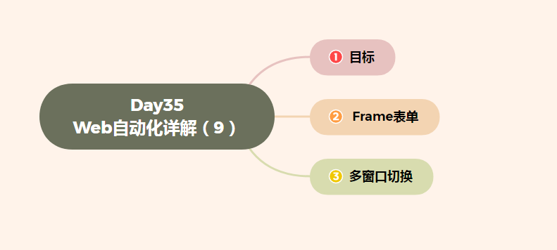

# Day35 Web自动化详解（9）——WebDriver(Selenium)——frame表单切换、多窗口切换


[TOC]




# 目标

```
1. 掌握WebDriver切换frame表单方法
2. 掌握WebDriver多窗口切换的技巧
```

------

# 1. frame表单

```
frame：HTML页面中的一种框架，主要作用是在当前页面中指定区域显示另一页面元素；
       (HTML语言中，frame/iframe标签为表单框架)
```

### 1.1 为什么要学习frame表单切换

```
需求：案例-2 注册实例.html
    1. 此页面有三个注册界面，先填写最上边注册信息，其次填写注册A页面注册信息，最后填写注册B页面信息
    2. 定位方式不限
```

#### 问题

```
1. 当前页面内无法定位注册页面A和注册页面B
```

### 1.2 frame表单切换

```
说明：在WebDriver类库中封装了HTML页面中使用frame表单框架技术定位的方法

方法：
    1). driver.switch_to.frame("myframe1")        -->    切换表单方法
            (myframe1：为frame表单的name或id)
    2). driver.switch_to.default_content()        --> 恢复默认页面方法
            (在frame表单中操作其他页面，必须先回到默认页面，才能进一步操作)
```

#### 操作原理

```
操作原理：
    1) html中的iframe标签提供了内联结构，使用内联结构可以在一个浏览器窗口显示多个页面。
    2) iframe标签是外层页面的标签，若想操作iframe框架内嵌的页面，需要先定位到iframe标签上。
    3) 通过switch_to.frame()切换到内层页面，再进行内层页面的操作。
    4) 内层页面的操作办法和普通页面的操作办法相同：元素定位、元素操作。
```

### 1.3 frame表单切换

```
说明：在WebDriver类库中封装了HTML页面中使用frame表单框架技术定位的方法
操作步骤：
    1) 定位到iframe标签。
    2) 完成切换。
        a)若iframe具有id属性，直接使用id属性值切换进内层页面
            driver.switch_to.frame(value)/driver.switch_to_frame(value)
        b) 定位到iframe元素，再切换进入
            el = driver.find_element_by_xxx(value)
            driver.switch_to.frame(el)    /driver.switch_to_frame(el)
注意：
    switch_to.frame()只能切换到当前页面内嵌的子级页面，若是多级页面的嵌套，需要依次在各页面中通过switch_to.frame()方法切换进入。

方法：
    1). driver.switch_to.frame("myframe1")        -->    切换表单方法
            (myframe1：为frame表单的name或id)
    2). driver.switch_to.default_content()        --> 恢复默认页面方法
            (在frame表单中操作其他页面，必须先回到默认页面，才能进一步操作)
```

### 1.4 frame表单切换--向外层切换

```
若目前操作焦点在内层页面，需要切换回外层页面：
1. 跳回最外层的页面
    driver.switch_to.default_content() -- 切换到最外层(对于多层页面，可通过该方法直接切换到最外层)
2. 跳回上层的页面
    driver.switch_to.parent_frame()   -- 进行向上的单层切换
```


### 1.5 案例-2解决方案

```
1. 完成当前页面注册信息；
2. 调用表单切换方法(switch_to.frame("myframe1"))切换到注册用户A表单中
3. 调用恢复默认页面方法(switch_to.default_content())
4. 调用表单切换方法(switch_to.frame("myframe2"))切换到注册用户B表单中
```

### 1.6 表单切换-总结

```
1. HTML中常用的表单框架
2. 切换表单方法
3. 为什么要恢复默认页面？
4. 恢复默认页面方法
```

------

# 2. 多窗口切换

```
说明：在HTML页面中，经常有a标签也就是超链接，这些链接在被执行时，有的会在新的窗口打开链接；
```

### 2.1 为什么要切换窗口？

#### 案例-2 注册实例.html

```
需求：
    1). 点击注册A页面链接，在打开的页面，填写A页面注册信息；
```

#### 问题

```
1). 无法定位注册A页面
```

### 2.2 多窗口切换

```
说明：在WebDriver中封装了获取当前窗口句柄方法和获取所有窗口句柄的方法以及切换指定句柄窗口的方法；
      （句柄：英文handle，窗口的唯一识别码）

方法：
    1). driver.current_window_handle         --> 获取当前窗口句柄
    2). driver.window_handles                 --> 获取所有窗口句柄
    3). driver.switch_to.window(handle)        --> 切换指定句柄窗口
```

### 2.3 案例-2 解决方案分析

```
1. 获取注册实例.html当前窗口句柄
2. 点击注册实例.html页面中注册A页面
3. 获取所有窗口句柄
4. 遍历判断窗口句柄并切换到注册A页面
5. 操作注册A页面元素，注册信息
```

### 2.4 多窗口切换-总结

```
1. 什么是句柄？
2. 获取当前窗口句柄方法
3. 获取所有窗口句柄方法
4. 切换指定句柄窗口方法
```


-16947592124783.jpg)

 [Python-100-Days-master.zip](C:\Users\GREE\Desktop\Python-100-Days-master.zip) 

 [HBuilderX - 快捷方式.lnk](C:\Users\GREE\Desktop\HBuilderX - 快捷方式.lnk) 

 [httpscloudstudio.net.md](C:\Users\GREE\Desktop\httpscloudstudio.net.md) 