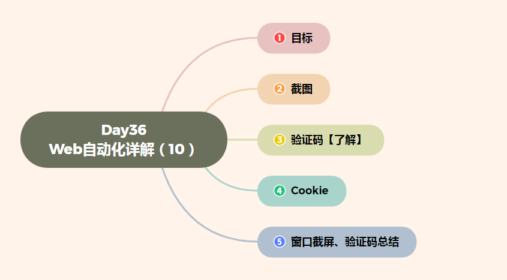

# Day36 Web自动化详解（10）——WebDriver(Selenium)窗口截图、验证码处理


[TOC]




# 目标

```
1. 掌握WebDriver屏幕截图方法
2. 了解验证码处理的方式
```

------

# 1. 截图

```
说明：把当前操作页面，截图保存到指定位置
```

### 1.1 为什么要窗口截图？

```
说明：自动化脚本是由程序去执行的，因此有时候打印的错误信息并不是十分明确。如果在执行出错的时候对当前
      窗口截图保存，那么通过图片就可以非常直观地看到出错的原因。
```

### 1.2 窗口截图

```
说明：在WebDriver类库中，提供了截图方法，我们只需要调用即可；

方法：
    1). get_screenshot_as_file(imgpath)            --> 截取当前窗口
        (imgpath：图片保存路径)
```

### 1.3 案例-2 注册实例.html

```
需求：
    1. 填写注册A页面注册信息，填写完毕，截图保存；
```

### 1.4 案例2-解决方案步骤

```
1. 打开注册实例.html
2. 切换注册A页面frame表单         --> driver.switch_to.frame(myframe1)
3. 输入注册信息
4. 调用截屏方法                    --> driver.get_screenshot_as_file("../Image/Image01.jpg")
```

------

# 2. 验证码【了解】

```
说明：一种随机生成的信息（图片、数字、字母、汉字、算术题）等为了防止恶意的请求行为，增加应用的安全性。
```

### 2.1 为什么要学习验证码？

```
说明：在Web应用中，大部分系统在用户登陆的时候都要求输入验证码，而我们在设计自动化脚本时候，就需要面
      临这验证码的问题。
```

### 2.2 验证码的处理方式

```
说明：WebDriver类库中没有对验证码处理的方法，但是在这里可以叙说下针对验证码的几种常用处理方式；

方式：
    1). 去掉验证码
            (测试环境下-采用)
    2). 设置万能验证码
            (生产环境-采用)
    3). 验证码识别技术
            (通过Python-tesseract来识别图片类型验证码；识别率很难达到100%)
    4). 记录cookie
            (通过记录cookie进行登录-推荐)
```

#### 提示：

```
1. 去掉验证码、设置万能验证码：太简单都是开发来完成，我们在这里不做讲解
2. 验证码识别技术：成功率不高，验证码种类繁多，不太适合；
3. 记录cookie：比较实用，我们对它进行下讲解；
```

# 3. cookie

### 3.1 cookie是什么？


```
cookie：
    1. Cookie是一小段的文本信息；格式：python中的字典（键值对组成）
    2. Cookie产生：客户端请求服务器，如果服务器需要记录该用户状态，就向客户端浏览器颁发一个Cookie格式
    3. Cookie使用：当浏览器再请求该网站时，浏览器把请求的网址连同该Cookie一同提交给服务器，服务器检
       查该Cookie，以此来辨认用户状态。
```

### 3.2 为什么记录cookie？

```
说明：
    1. 用户第一次登陆时，勾选下次直接登陆或者记住密码，就是采用记录cookie实现的
    2. cookie内记录用户名和密码(加密)信息，只要请求时服务器收到cookie，就识别成功，默认为已登陆。
```

### 3.3 记录cookie

```
说明：
    1. WebDriver中对cookie操作提供相应的方法

方法：
    1. get_cookie(name)                    --> 获取指定cookie
       (name:为健名)
    2. get_cookies()                    --> 获取本网站所有本地cookies
    3. add_cookie(str)                    -->    添加cookie
       (str：为python中的字典格式)
```

#### 案例-3 访问百度

```
需求：
    1. 登陆百度，获取cookie
    2. 使用获取的cookie，在WebDriver中，添加Cookie，达到登陆目的
```

#### 案例3-实现步骤分析

```
1. 登陆baidu，登陆的时候抓取 (BAIDUID,BDUSS)
2. 使用add_cookie()方法，添加 (BAIDUID,BDUSS)键和值
3. 调用刷新方法 driver.refresh()
```

#### 3.4 代码示例

```
from selenium import webdriver
import time
driver=webdriver.Firefox()
driver.get("https://www.baidu.com")
driver.add_cookie({'name':'BAIDUID','value':'根据实际填写'})
driver.add_cookie({'name':'BDUSS','value':'根据实际填写'})
time.sleep(3)
driver.refresh()
time.sleep(3)
```

------

# 4. 窗口截屏、验证码总结

```
1. 截屏方法
2. 验证码常用的处理方式
3. Cookie的作用
```


-16947593716254.jpg)

