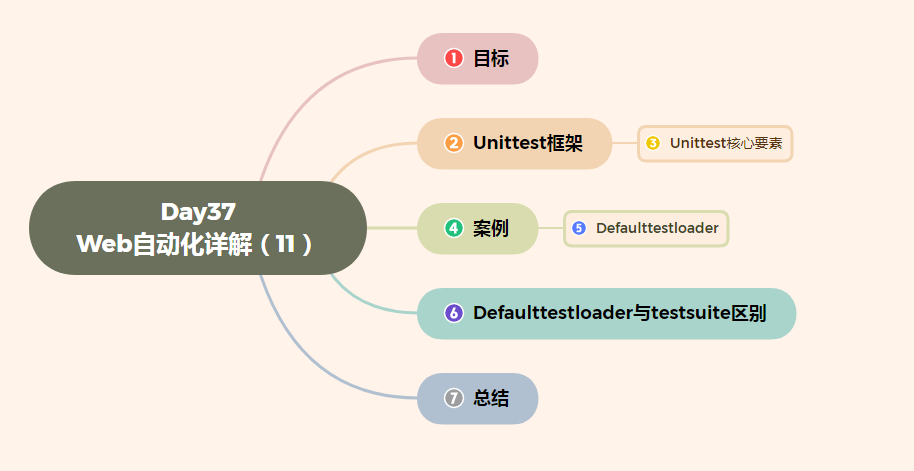

# Day37 Web自动化详解（11）——高级篇——UnitTest框架

[TOC]




# 目标

```
1. 掌握UnitTest框架的基础使用方法
```

------

# 1. UnitTest框架

### 1.1 什么是框架？

```
说明：
    1. 框架英文单词FrameWork；
    2. 为解决一类事情的功能集合；
```

### 1.2 什么是UnitTest框架？

```
概念：UnitTest框架是专门用来进行执行代码测试的框架；
```

### 1.3 为什么使用UnitTest框架？

```
1. 能够组织多个用例去执行
2. 提供丰富的断言方法
3. 提供丰富的日志与测试结果

提示：
    1). 断言知识点-在4.2章节会进行学习和讲解；
```

------

### 提示

```
在学习UnitTest框架之前，我们先了解下UnitTest框架内几个核心要素
```

# 2. UnitTest核心要素

```
1. TestCase
2. TestSuite
3. TextTestRunner
4. Fixture
```

### 2.1 TestCase

```
说明：(翻译：测试用例)一个TestCase就是一条测试用例；
使用：
    1. 导包：import unittest             --> 导入unitest框架
    2. 继承：unittest.TestCase             --> 新建测试类继承unittest.TestCase

提示：
    1). 测试用例：在自动化测试中，一条用例就是一个完整的测试流程；                
    2). 测试方法名称命名必须以test开头；
       (原因：unittest.TestCase类批量运行的方法是搜索执行test开头的方法)
```

### 2.2 TestSuite

```
说明：(翻译：测试套件)多条测试用例集合在一起，就是一个TestSuite；
使用：
    1. 实例化：     suite=unittest.TestSuite()                    
                 (suite：为TestSuite实例化的名称)
    2. 添加用例：suite.addTest(ClassName("MethodName"))    
                 (ClassName：为类名；MethodName：为方法名)

    3. 添加扩展：suite.addTest(unittest.makeSuite(ClassName))
                 (搜索指定ClassName内test开头的方法并添加到测试套件中)

提示：
    1). 一条测试用例(.py)内，多个方法也可以使用测试套件
    2). TestSuite需要配合TextTestRunner才能被执行
```

### 2.3 TextTestRunner

```
说明：(翻译：测试执行)是用来执行测试用例套件
使用：
    1. 实例化： runner=unittest.TextTestRunner()
                (runner：TextTestRunner实例化名称)
    2. 执行：    runner.run(suite)
                (suite：为测试套件名称)
```

### 2.4 Fixture

```
说明：是一个概述，对一个测试用例环境的搭建和销毁就是一个Fixture；
使用：
    1. 初始化(搭建)：def setUp(self)        --> 首先执行
       (setUp:此方法继承于unittest.TestCase)        
    2. 结束(销毁):    def tearDown(self)        --> 最后执行
       (tearDown:此方法继承于unittest.TestCase)
提示：
    1. 必须继承unittest.TestCase类，setUp、tearDown才是一个Fixture；
    2. setUp：一般做初始化工作，比如：实例化浏览器、浏览器最大化、隐式等待设置
    3. tearDown：一般做结束工作，比如：退出登录、关闭浏览器
    4. 如果一个测试类有多个test开头方法，则每个方法执行之前都会运行setUp、结束时运行tearDown
```

------

# 3. 案例

```
需求：使用UnitTest框架对iweb_shop项目测试
    1. 登陆进行测试
```

### 3.1 操作步骤分析：

```
1. 导包 import unittest
2. 新建测试类并继承unittest.TestCast
3. 新建一个Fixture(setUp、tearDown)
4. 新建登录方法
5. if __name__ == '__main__':
6. unittest.main()执行
```

### 3.2 总结-代码实现

```
import unittest
from time import sleep
from selenium import webdriver
class TestLoginOut(unittest.TestCase):
    def setUp(self):
        self.driver=webdriver.Firefox()
        url = "http://localhost/iwebshop/"
        self.driver.get(url)
        self.driver.implicitly_wait(10)
        self.driver.maximize_window()
        print("setUp")
    def test_login(self):
        driver=self.driver
        driver.find_element_by_link_text("登录").click()
        driver.find_element_by_css_selector("input[alt*='邮箱']").send_keys("admin")
        driver.find_element_by_css_selector("input[alt*='密码']").send_keys("123456")
        driver.find_element_by_css_selector(".submit_login").click()
        sleep(3)
        driver.find_element_by_css_selector(".reg").click()
    def tearDown(self):
        sleep(2)
        self.driver.quit()
        print("tearDown")
if __name__ == '__main__':
    # 调用main方法执行unitetest内所有test开头方法
    unittest.main()
```

## 需求

```
将test01.py..test10.py共10条用例，将这10条用例批量执行；
```

### 问题

```
1. 使用suite.addtest(unittest.makeSuite(className))导入10条测试类
2. .addtest()需要添加10次
```

# 4. defaultTestLoader

```
说明： 
    使用unittest.defaultTestLoader()类，通过该类下面的discover()方法自动搜索指定目录下指定开头
    的.py文件，并将查找到的测试用例组装到测试套件；

用法：
    test_dir = './'
    disconver = unittest.defaultTestLoader.discover(test_dir, pattern='iweb_*.py')
    (test_dir为要指定的目录 ./为当前目录；pattern：为查找的.py文件的格式 )
运行：
    runner=unittest.TextTestRunner()
    runner.run(disconver)
```

# 5. defaultTestLoader与TestSuite区别

```
1. TestSuite可以添加TestCase中所有test开头的方法和添加指定的test开头方法;
2. defaultTestLoader搜索指定目录下指定开头.py文件，并添加TestCase内所有test开头的方法，不能指定添加方法;

提示：defaultTestLoader属于TestSuite另一种实现方式；
```

# 6. 总结

```
1. UnitTest框架作用
2. 什么是Fixture
3. 要使用UnitTest框架必须继承？
4. TestSuite作用
5. 如何运行TestSuite
7. defaultTestLoader与TestSuite区别
```

**回顾**

```
 1.3 为什么使用UnitTest框架？    
    1. 能组织用例和执行用例
    2. 提供丰富的断言方法
    3. 提供丰富的日志与测试结果


1. UnitTest用例组织和执行用例方法我们基本就学完了
2. 接下来我们学习UnitTest框架的断言方法
```


-16947604599195.jpg)

