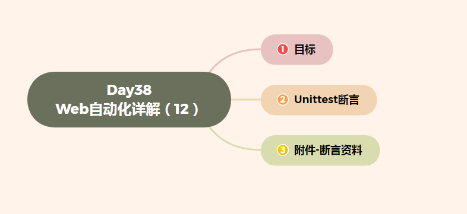

# Day38 Web自动化详解（12）——高级篇——UnitTest断言


[TOC]




# 目标

```
1. 理解什么是断言
2. 掌握断言assertEqual、assertIn方法
3. 了解UnitTest其他断言方法
```

------

# 1. UnitTest断言

### 1.1 什么是断言？

```
概念：让程序代替人为判断测试程序执行结果是否符合预期结果的过程
```

### 1.2 为什么要学习断言？

```
自动化脚本在执行的时候一般都是无人值守状态，我们不知道执行结果是否符合预期结果，所以我们需要让程序代替人
为检测程序执行的结果是否符合预期结果，这就需要使用断言；
```

### 1.3 UnitTest断言分类

```
1. 基本布尔型断言
2. 比较断言
3. 复杂断言

提示：
    1. 这里这介绍基本布尔类型断言
    2. 比较断言、复杂断言有兴趣的同学请参考4.4附件资料
```

#### 基本布尔型断言(掌握常用即可)

```
说明：结果只有True和False
```

| 序号 | 断言方法                             | 断言描述                                 |
| ---- | ------------------------------------ | ---------------------------------------- |
| 1    | assertEqual(arg1, arg2, msg=None)    | 验证arg1=arg2，不等则fail 【掌握】       |
| 2    | assertNotEqual(arg1, arg2, msg=None) | 验证arg1 != arg2, 相等则fail             |
| 3    | assertTrue(expr, msg=None)           | 验证expr是true，如果为false，则fail      |
| 4    | assertFalse(expr,msg=None)           | 验证expr是false，如果为true，则fail      |
| 5    | assertIsNone(expr, msg=None)         | 验证expr是None，不是则fail               |
| 6    | assertIsNotNone(expr, msg=None)      | 验证expr不是None，是则fail               |
| 7    | assertIn(arg1, arg2, msg=None)       | 验证arg1是arg2的子串，不是则fail【掌握】 |

### 1.4 案例

```
需求：
    1. iweb项目登陆，输入正确用户名和密码，断言登录成功的用户名是否为admin，如果断言失败截图保存

扩展：
    1. 图片名称为动态-时间
    2. 图片名称添加断言错误信息
```

### 实现步骤分析

```
1. 成功登陆
2. 获取登陆后的信息
3. 添加断言
```

### 断言主要代码：

```
...
    # 获取登陆信息
    text = self.driver.find_element_by_css_selector(".loginfo").text
    print("登陆成功信息为：",text)
    try:
        # 使用断言 判断text是否包含admin字符
        self.assertIn("admin",text)
    except AssertionError:
        driver.get_screenshot_as_file("../Image/02img.jpg")
        # 抛出异常
        raise
...
```

### 断言总结

```
1. 什么是断言？
2. 需要掌握哪个断言？
3. 断言异常类
4. 如何获取断言错误信息
5. 时间格式(年_月_日 时_分_秒)
```

------

### 回顾

```
 1.3 为什么使用UnitTest框架？    
    1. 能组织用例和执行用例
    2. 提供丰富的断言方法
    3. 提供丰富的日志与测试结果


1. UnitTest用例组织和执行用例 完成
2. 断言方法 完成
3. 接下来我们就学习生成测试结果-HTML报告的生成
```


# 附件-断言资料

#### 基本布尔型断言

| 序号 | 断言方法                                | 断言描述                                     |
| ---- | --------------------------------------- | -------------------------------------------- |
| 1    | assertEqual(arg1, arg2, msg=None)       | 验证arg1=arg2，不等则fail 【常用】           |
| 2    | assertNotEqual(arg1, arg2, msg=None)    | 验证arg1 != arg2, 相等则fail                 |
| 3    | assertTrue(expr, msg=None)              | 验证expr是true，如果为false，则fail 【常用】 |
| 4    | assertFalse(expr,msg=None)              | 验证expr是false，如果为true，则fail 【常用】 |
| 5    | assertIs(arg1, arg2, msg=None)          | 验证arg1、arg2是同一个对象，不是则fail       |
| 6    | assertIsNot(arg1, arg2, msg=None)       | 验证arg1、arg2不是同一个对象，是则fail       |
| 7    | assertIsNone(expr, msg=None)            | 验证expr是None，不是则fail                   |
| 8    | assertIsNotNone(expr, msg=None)         | 验证expr不是None，是则fail                   |
| 9    | assertIn(arg1, arg2, msg=None)          | 验证arg1是arg2的子串，不是则fail             |
| 10   | assertNotIn(arg1, arg2, msg=None)       | 验证arg1不是arg2的子串，是则fail             |
| 11   | assertIsInstance(obj, cls, msg=None)    | 验证obj是cls的实例，不是则fail               |
| 12   | assertNotIsInstance(obj, cls, msg=None) | 验证obj不是cls的实例，是则fail               |

#### 比较断言

| 序号 | 断言方法                                                     | 断言描述                                                     |
| ---- | ------------------------------------------------------------ | ------------------------------------------------------------ |
| 1    | assertAlmostEqual (first, second, places = 7, msg = None, delta = None) | 验证first约等于second。 palces: 指定精确到小数点后多少位，默认为7 |
| 2    | assertNotAlmostEqual (first, second, places, msg, delta)     | 验证first不约等于second。 palces: 指定精确到小数点后多少位，默认为7 注： 在上述的两个函数中，如果delta指定了值，则first和second之间的差值必须≤delta |
| 3    | assertGreater (first, second, msg = None)                    | 验证first > second，否则fail                                 |
| 4    | assertGreaterEqual (first, second, msg = None)               | 验证first ≥ second，否则fail                                 |
| 5    | assertLess (first, second, msg = None)                       | 验证first < second，否则fail                                 |
| 6    | assertLessEqual (first, second, msg = None)                  | 验证first ≤ second，否则fail                                 |
| 7    | assertRegexpMatches (text, regexp, msg = None)               | 验证正则表达式regexp搜索匹配的文本text。 regexp：通常使用re.search() |
| 8    | assertNotRegexpMatches (text, regexp, msg = None)            | 验证正则表达式regexp搜索不匹配的文本text。 regexp：通常使用re.search() 说明：两个参数进行比较（＞、≥、＜、≤、约等、不约等） |

#### 复杂断言

| 序号 | 断言方法                                      | 断言描述                                                     |
| ---- | --------------------------------------------- | ------------------------------------------------------------ |
| 1    | assertListEqual(list1, list2, msg = None)     | 验证列表list1、list2相等，不等则fail，同时报错信息返回具体的不同的地方 |
| 2    | assertTupleEqual (tuple1, tuple2, msg = None) | 验证元组tuple1、tuple2相等，不等则fail，同时报错信息返回具体的不同的地方 |
| 3    | assertSetEqual (set1, set2, msg = None)       | 验证集合set1、set2相等，不等则fail，同时报错信息返回具体的不同的地方 |
| 4    | assertDictEqual (expected, actual, msg = None | 验证字典expected、actual相等，不等则fail，同时报错信息返回具体的不同的地方 |


-16947608893396.jpg)