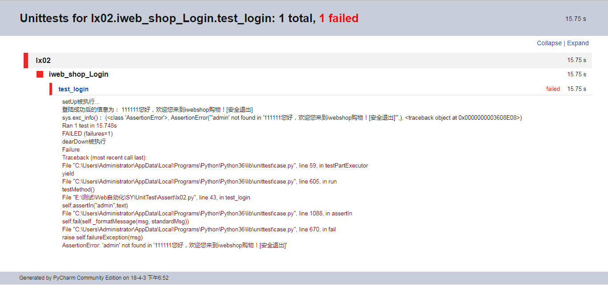
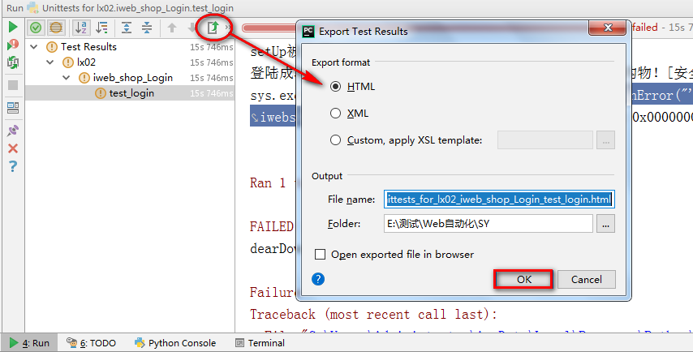

# Day38 Web自动化详解（12）——高级篇——**测试结果-HTML测试报告**

# 测试结果-HTML测试报告

------

## 目标

```
1. 掌握如何生成HTML测试报告方法
```

------

## 1. 什么是HTML测试报告

```
说明：HTML测试报告就是执行完测试用例后以HTML(网页)方式将执行结果生成报告
```

### 1.1 为什么要生成测试报告

```
1. 测试报告是本次测试目的最终体现形态
2. 测试报告内包含了有关本次测试用例的详情
```

## 2. HTML生成报告方式

```
1. Export Test Results （UnitTest 自带）
2. HTMLTestRunner（第三方模板）【重点】
```

### 2.1 Export Test Results （自带）



#### 自带报告生成操作图



```
    提示：适合单条用例执行时使用
```

### 2.2 HTMLTestRunner【重点】


### 1.1 测试报告 生成步骤分析

[HTMLTestRunner.zip](../04img/HTMLTestRunner.zip)

```
1. 复制HTMLTestRunner.py文件到项目文件夹
2. 导入HTMLTestRunner、UnitTest包    
3. discover加载要执行的用例
      (discover=unittest.defaultTestLoader.discover(test_dir,pattern="test*.py"))
4. 设置报告生成路径和文件名
   (file_name=file_dir+nowtime+"Report.html")
5. 打开报告 with open(file_name,'wb') as f:
6. 实例化HTMLTestRunner对象：runner=HTMLTestRunner(stream=f,[title],[description])
    参数说明：
               (stream：文件流，打开写入报告的名称及写入编码格式)
               (
                       []，为可选；
                       title为报告标题，如XXX自动化测试报告
                       description：为说明；比如操作系统、浏览器等版本
               )
7. 执行：runner.run(discover)
```

### 1.2 实现代码

```
import time
from CodeEdit.LX04.Tools.HTMLTestRunner import HTMLTestRunner
import unittest
# 加载当前目录
test_dir='.'
# 加载当前目录下iweb开头的.py文件
discover=unittest.defaultTestLoader.discover(test_dir,pattern="test*.py")
if __name__ == '__main__':
    # 定义报告目录
    file_dir="../Report/"
    # 定义报告名称格式
    nowtime=time.strftime("%Y-%m-%d %H_%M_%S")
    # 报告完整路径和名称
    file_name=file_dir+nowtime+"Report.html"
    with open(file_name,"wb")as f:
        # 实例化HTMLTestRunenr对象，传入报告文件流f
        runner=HTMLTestRunner(stream=f,title="iweb_shop项目Web自动化测试报告",description="测试用例共计2条")
        runner.run(discover)
```

### 1.3 总结

```
1. HTMLTestRunner作用
2. 使用HTMLTestRunner生成报告操作步骤
```