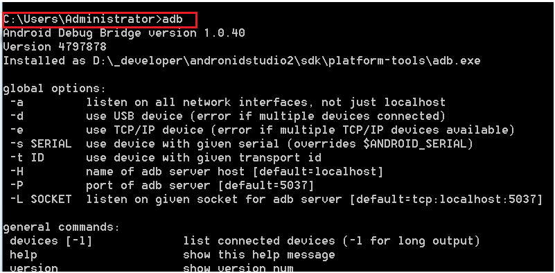
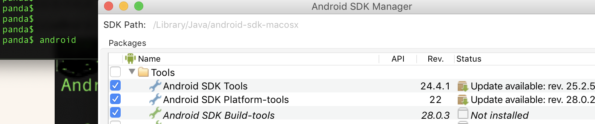
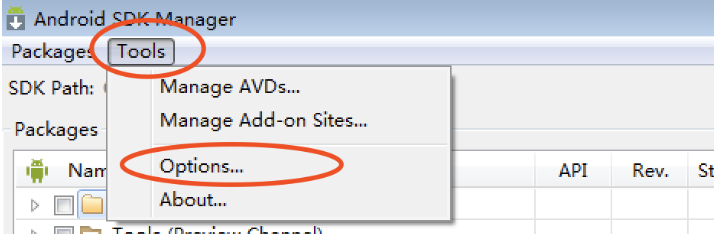
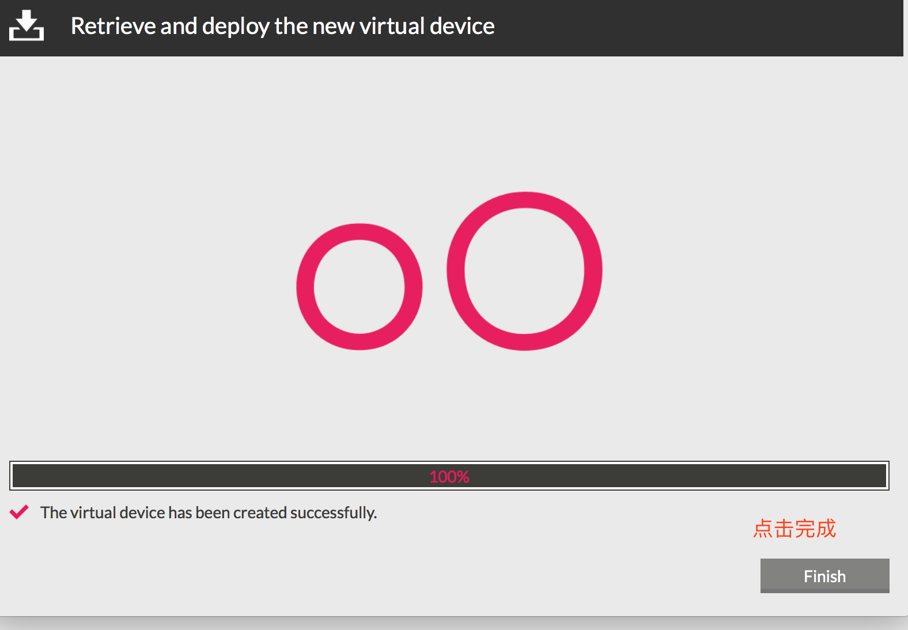

# Day42 移动端测试详解（2）——移动端测试环境搭建


## 移动端测试环境搭建

移动端自动化测试的基础环境配置

- 1. 安装Java环境

  ```
    Android应用为例讲解，需要安装java环境
  ```

- 2. SDK环境

  ```
    Android依赖SDK的环境
  ```

- 3. 模拟器环境

  ```
    考虑大家连接真机不方便，所以采用模拟器替代
  ```


### 1. Windows 安装java环境

安装步骤:

#### 1.1 安装jdk

```
运行jdk-8u151-windows-x64.exe⽂件,默认安装即可

或者官网下载压缩包解压
(https://jdk.java.net/19/)
```

#### 1.2 配置java环境变量(windows为例)

```
1.进入我的电脑-->属性-->高级系统设置--->环境变量

例：
2.在系统变量下点击新建 -> 变量名: JAVA_HOME -> 变量值: C:\Program Files\Java\jdk1.8.0
```

#### 1.3 验证环境变量

```
1.打开dos 快捷键win+r
2.输入java -version
```

出现下图,说明安装成功 


### 2. Mac 安装java环境

将下载的osx版的java环境默认进行安装,然后进行一下配置:

```
1.进入命令行， vim ~/.bash_profile 
2.# set jdk1.8
    JAVA_HOME=/Library/Java/JavaVirtualMachines/jdk1.8.0_151.jdk/Contents/Home
    CLASSPATH=.:$JAVA_HOME/lib/dt.jar:$JAVA_HOME/lib/tools.jar
    PATH=$PATH:$JAVA_HOME/bin
    export JAVA_HOME CLASSPATH
    export PATH
```

启动终端,输入java -version查看是否正常启动


### 1. Window 安装sdk(Androi需要的环境)

安装步骤:

#### 1.1 解压Android sdk 文件夹

**注意:路径中不要有中文, 确保文件夹下有一下两个文件**

如下图: 

#### 1.2 配置到系统环境变量下.

```
SDK环境变量配置(Windowns7为例)

    1.进入我的电脑 -> 属性 -> 高级系统设置 -> 环境变量

    2.在系统变量下点击新建 -> 变量名: ANDROID_HOME -> 变量值: D:\android-sdk -> 点击确定按钮

    3.在系统变量下找到系统的path变量，最后添加：;%ANDROID_HOME%\platform-tools;%ANDROID_HOME%\tools;(最前面是一个分号，如果path变量最后已有分号，可不用添加) -> 点击确定按钮
```

#### 1.3 验证环境变量是否配置成功

- 在dos中输入adb指令,如下图配置成功 
- 在dos中输入**android**指令 出现Android sdk manager对话框 

> 注意:**
>
> **假如sdk中已经有build-tools和platform-tools文件夹,就不需要再进行下载安装了**


### 2. Mac 安装android sdk

1. 把下载的android sdk macosx版本的解压到指定目录(我的解压到//Library/Java/)

   

   > **注意:**
   >
   > **假如sdk没有build-tools和platform-tools文件夹,要把提供的文件夹移动到此处, 后面只需要配置环境变量即可,不需要下载了**

2. 把sdk配置到系统环境变量

   ```
   1.进入命令行， vim ~/.bash_profile
   2.# set android
      ANDROID_HOME=电脑存放的路径/android-sdk-macosx
      PATH=$PATH:$ANDROID_HOME/tools:$ANDROID_HOME/platform-tools
      export ANDROID_HOME 
      export PATH
   ```

   

3. 验证是否成功

   验证**adb命令**: 在终端输入adb,出现adb版本信息说明成功

   

   验证android是否配置成功: 在终端输入**android**, 出现此图片说明成功

   

### 3、选择不同版本的的Android系统进行下载

**注意**:

> 由于安卓镜像在国外,最好更换国内的镜像

步骤

- 在弹出的android sdk manager页面,点击tools, 下啦框点击options

  

- 在弹出的对话框输入国内惊现的地址和端口号.

  


     镜像地址列表(也可以网上查找最新的)：
         中国科学院开源协会镜像站地址:
             IPV4/IPV6: mirrors.opencas.cn 端口：80
             IPV4/IPV6: mirrors.opencas.org 端口：80
             IPV4/IPV6: mirrors.opencas.ac.cn 端口：80
         上海GDG镜像服务器地址:
             sdk.gdgshanghai.com 端口：8000
    
         北京化工大学镜像服务器地址:
             IPv4: ubuntu.buct.edu.cn/ 端口：80
             IPv4: ubuntu.buct.cn/ 端口：80
             IPv6: ubuntu.buct6.edu.cn/ 端口：80
    
         大连东软信息学院镜像服务器地址:
             mirrors.neusoft.edu.cn 端口：80


## 1. window安装andorid模拟器

### 1. 模拟器Genymotion安装

```
1.执行genymotion-2.11.0-vbox.exe(是一个集合程序，包含genymotion和virtualbox) -> 不需要更改配置，直接下一步默认安装

2.安装完genymotion继续等待，会提示安装virtualbox，继续安装，期间会提示安装oracle插件，全部允许安装

3.安装完成后会在桌面展示genymotion和virtualbox两个图标
```


> 注意:
>
> 安装其他的模拟器也可以 ,安装成功就可以.(比如MuMu 逍遥 夜神 雷电)

### 2. Mac 下安装模拟器

mac下安装要装两个dmg文件: genymotion-2.12.1.dmg和VirtualBox-5.2.26-128414-OSX.dmg

```
1.安装genymotion-2.12.1.dmg-》不用更改配置,默认安装就行
2.安装VirtualBox-5.2.26-128414-OSX.dmg  -》 不用更改配置直接安装就行
3.安装后也会看到上面三个应用
```


### 3.虚拟机镜像导入

```
1.打开virtualbox
2.进入virtualbox -> 管理 -> 导入虚拟电脑
3.点击文件选择(Samsung Galaxy S6 - 5.1.0 - API 22 - 1440x2560.ova) -> 点击下一步
4.勾选 重新初始化所有网卡的MAC地址
5.点击导入按钮 -> 等待倒入完成
6.virtualbox列表会展示如下图圈出的选项
```


### 4. 启动模拟器

在genymotion主界面点机start按钮.启动成功就会显示下图


### 5. 安装应用apk

安卓模拟器启动起来后,我们就可以安装要进行测试的应用了.安装成功后,我们的环境搭建就全部结束.

**安装方法:**

- adb命令行(后面讲解)
- 直接拖拽要安装的apk到模拟器上,自动安装

### 注意事项

#### 1. 安装ARM插件

安装某些应用apk时由于apk功能比较丰富,但是模拟器自带的不支持这些功能,所以要安装arm插件,来满足apk的使用.

**(1)、拖动ARM_Translation_Lollipop_20160402.zip到已启动的android虚拟机上**

需要下载对应版本的插件、我们使用的是adnroid5.1 所以使用的是这个

**(2)点击提示的ok按钮**


**(3)、再次点击提示的ok按钮,重启模拟器既可以安装apk文件**


#### 2.  使用其他版本的模拟器的步骤

​	**(1)、需要到genymotion官网上注册一个账号**

​	**(2)、进入genymotion界面,点击add按钮、会弹出登录对话框、输入注册的账号**


**(3)、登录成功后可以选择对应不同的android版本、手机型号进行安装**





