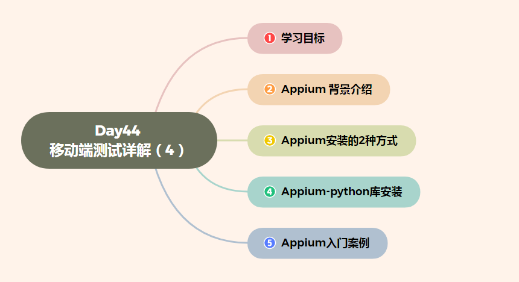
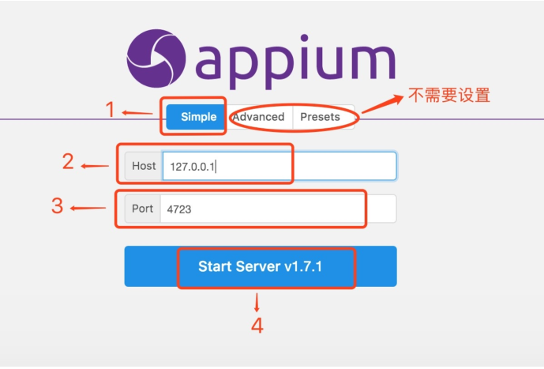
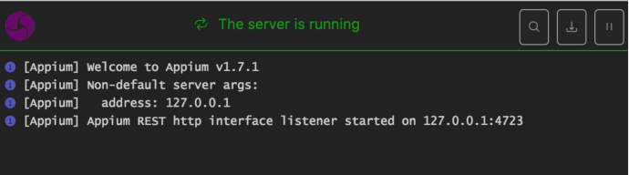

# Day44 移动端测试详解（4）——Appium环境搭建+入门案例

[TOC]




# 学习目标

- **掌握appium的环境搭建**


# 1. Appium 背景介绍

```
1.官网：www.appium.io,由SauceLab公司开发

2.Appium是由nodejs的express框架写的Http Server
Appium使用WebDriver的json wire协议，
来驱动Apple系统的UIAutomation库、Android系统的UIAutomator框架
```

# 2. appium安装的2种方式

### 方式1. Appium 桌面客户端安装

安装步骤

1. 运行appium-desktop-Setup-1.2.7.exe，默认安装即可
2. 启动客户端，按图⽚步骤 1 -> 2 -> 3 -> 4 设置



3.启动成功如下图:



### 方式2. Appium 命令行安装

#### 2.1 安装nodejs

```
nodejs:官网下载地址: https://nodejs.org/en/download/

安装完成后 命令行运行npm或node -v 来查看是否安装成功,如下图:
```


#### 2.2 安装cnpm

```
npm install -g cnpm --registry=https://registry.npm.taobao.org

npm国内一般被墙，所以选择淘宝镜像安装,官网:http://npm.taobao.org
```

#### 2.3 cnpm安装appium

```
命令: cnpm install -g appium
```

如下图:


#### 2.4 启动appium服务

```
启动服务命令:appium
```

启动成功如下图:


# 3. Appium-python库安装

```
我们使用Python语言编写脚本,所以要安装appium的python库

安装命令: pip install Appium-Python-Client
```


# 4. appium入门案例

## 1.打开PyCharm 创建一个新项目

```
在项目里面新建一个 hello.py文件 如下图
```


## 2.在hello.py文件中输入如下代码

```
# 从appium库里面导入driver对象,帮助我们进行脚本和手机间交互
from appium import webdriver
# 导入time
import time
# server 启动参数
desired_caps = {}
# 设备信息
desired_caps['platformName'] = 'Android' #平台名称
desired_caps['platformVersion'] = '5.1'  #平台版本
desired_caps['deviceName'] = '192.168.56.101:5555' #设备号
# app信息
desired_caps['appPackage'] = 'com.android.settings' #应用的包名
desired_caps['appActivity'] = '.Settings' #代表启动的activity
driver = webdriver.Remote('http://localhost:4723/wd/hub', desired_caps) #声明driver对象,让手机完成脚本操作
# time.sleep(5)
# 关闭app driver对象不会关闭
# driver.close_app()
#关闭驱动对象
# driver.quit()
```

desired_caps是负责启动服务端时的参数设置,appium server 与手机端建立会话关系时，根据这些参数服务端可以做出相应的处理.

常用参数:

```
platformName 平台的名称：iOS, Android, or FirefoxOS
platformVersion 设备系统版本号
deviceName 设备号 IOS：instruments -s devices，Android: adb devices
app 安装文件路径：/abs/path/to/my.apk or http://myapp.com/app
appActivity 启动的Activity
appPackage 启动的包
unicodeKeyboard      unicode设置(允许中文输入)
resetKeyboard        键盘设置(允许中文输入)
```

## 3. 启动Appium和 Android模拟器

## 4. 运行hello.py观看模拟器的设置应用是否被打开


-169476233464912.jpg)