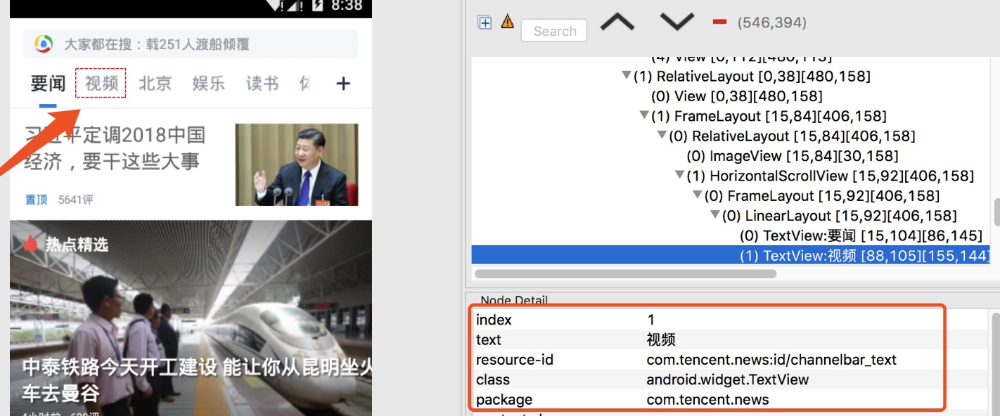

# Day45 移动端测试详解（5）——app操作api+uiautomatorviewer


## 学习目标

- 掌握操作app的基本api
- 掌握元素定位及获取元素信息的api
- 掌握事件操作api
- 掌握app模拟手势操作
- 掌握手机操作的api


#App基础操作API

## 学习目标

- 掌握安装、卸载apk命令
- 掌握判断是否安装apk命令
- 掌握发送及拉取文件命令

完成app自动化需要一些基础条件的支持，本节将讲解APP初始化API.

### 1.1 前置代码

```
# 从appium库里面导入driver对象
from appium import webdriver
# server 启动参数
desired_caps = {}
desired_caps['platformName'] = 'Android'
desired_caps['platformVersion'] = '5.1'
desired_caps['deviceName'] = '192.168.56.101:5555'
desired_caps['appPackage'] = 'com.android.settings'
desired_caps['appActivity'] = '.Settings'
# 声明driver对象
driver = webdriver.Remote('http://127.0.0.1:4723/wd/hub', desired_caps)
```

### 1.2 安装apk到手机

```
driver.install_app(app_path)

参数：app_path：APK文件所在路径

举例:
# driver.install_app(r"D:\Users\Day01\02\login.apk")
# driver.install_app(os.getcwd() + os.sep + "login.apk")
```

### 1.3 卸载手机中app

```
driver.remove_app(app_id)
参数：app_id：需要卸载的app包名

举例:
# driver.remove_app("com.itheima.login")
```

### 1.4 判断app是否已经安装

```
driver.is_app_installed(bundle_id)
参数：bundle_id: 可以传入app包名,返回结果为True(已安装) / False(未安装)

示例:
result=driver.is_app_installed("com.itheima.login")
print(result)
if result : driver.remove_app("com.itheima.login")
else : driver.install_app(os.getcwd() + os.sep + "login.apk")
```

### 1.5 发送文件到手机

```
# 发送abcd.txt文件到手机的sdcard/hello.txt
with open("abcd.txt", "r") as f:
    data = f.read() #读取文件中全部内容
    # base64编码
    b64_data = str(base64.b64encode(data.encode("utf-8")), "utf-8")
    # 发送文件到手机 指定名字
    driver.push_file("/sdcard/hello.txt", b64_data)
```

### 1.6 从手机里面拉取文件

```
data = driver.pull_file("/sdcard/hello.txt")
print(data)
# 解码base64数据
print(str(base64.b64decode(data), "utf-8"))
```

### 1.7 获取当前屏幕内的元素结构

```
page_data = driver.page_source
if "显示" in page_data:
    print("进入设置页面")
else:
    print("没进入设置页面")
```


# 手机控件查看工具uiautomatorviewer

### 1. 工具简介

```
  用来扫描和分析Android应用程序的UI控件的工具.
```

### 2. 如何使用

```
1.进入SDK目录下的tools目录，打开uiautomatorviewer
2.电脑连接真机或打开android模拟器
3.启动待测试app
4.点击uiautomatorviewer的左上⻆Device Screenshot,会生成app的UI控件截图
5.选择截图上需要查看的控件，即可浏览该控件的id,class,text,坐标等信息
```



