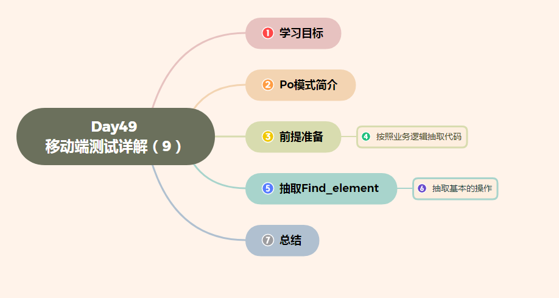

# Day49 移动端测试详解（9）——PO模式

[TOC]





# 1、学习目标

- 掌握PO模式的作用
- 能够按照需求进行抽取

# 2、PO模式简介

## 学习目标

- 知道PO模式的作用及优缺点

### 1. 什么是PO模型

PO模型是Page Object Model的简写,页面对象模型. 

作用, **就是把测试页面和测试脚本进行分离,即把页面封装成类,供测试脚本进行调用.**

### 2. 优缺点

**优点:**

- 提高代码的可读性
- 减少了代码的重复
- 提高代码的可维护性,特别是针对UI界面频繁变动的项目.

**缺点:**

- 造成项目结构比较复杂,因为是根据流程进行了模块化处理

# 3、前提准备

### 1. 需求

- 给指定手机号发送三条短信

### 2. 准备目录

```py
- script
-- test_sms_sending.py
- pytest.ini
```

### 3. 代码

**test_sems_sending.py**

```py
import pytest
from appium import webdriver


"""
业务流程分析：
1.启动短信应用
2.定位到新增按钮
3.定位接收者元素
4.涉及到输入框的先clear 在输入
5.定义三条信息
6.定位到发送元素
7.遍历发送的信息
8.关闭app driver对象不会关闭
9.关闭驱动对象

"""

class TestSmsSending:
    def setup(self):
        desired_caps = dict()
        # 测试设备信息
        desired_caps['platformName'] = 'Android'
        desired_caps['platformVersion'] = '5.1'
        desired_caps['deviceName'] = '192.168.56.101:5555'
        # app信息
        desired_caps['appPackage'] = 'com.android.mms'
        desired_caps['appActivity'] = '.ui.ConversationList'

        # 驱动信息
        self.driver = webdriver.Remote('http://127.0.0.1:4723/wd/hub', desired_caps)

    def teardown(self):
        self.driver.quit()

    def test_sms(self):
        # 2. 定位到新增
        self.driver.find_element_by_id("com.android.mms:id/action_compose_new").click()
        # 3.定位接收者元素
        receive_number = self.driver.find_element_by_id("com.android.mms:id/recipients_editor")
        # 4.涉及到输入框的先clear 在输入
        receive_number.clear()
        receive_number.send_keys("17611111111")
        send_list = [11, 'aaa', 'bbbb']
        # 5.定位到发送元素
        send_sms = self.driver.find_element_by_id("com.android.mms:id/embedded_text_editor")
        send_btn = self.driver.find_element_by_id("com.android.mms:id/send_button_sms")
        # 6.遍历发送的信息
        for i in send_list:
            send_sms.clear()
            send_sms.send_keys(i)
            send_btn.click()
        # 关闭app driver对象不会关闭
        self.driver.close_app()

```

**pytest.ini**

```
[pytest]
addopts = -s
# 测试环境
testpaths = ./script
#测试文件
python_files = test_*
# 测试的类
python_classes = Test*
# 测试的函数
python_functions = test_*
```

# 4、按照业务逻辑抽取代码

## 学习目标

- 能够按照功能进行代码的抽取

### 1. 抽取后的目录

```
- base
- - __init__.py
- - base_driver.py
- page
- - sms_page.py
- script
- - test_sms_send.py
- pytest.ini
```

### 2. 代码

代码的抽取一般先抽取业务功能代码,其次再抽取业务功能中用到的信息.

#### 2.1 抽取功能代码

创建**page(名字是默认的,不要变化)**目录,在目录中创建sms_page文件,把新增短信、输入用户手机号、发送短信功能进行抽取

```pyth
class SmsPage:
    def __init__(self, driver):
        self.driver = driver

    def click_add_sms(self):
        # 2. 定位到新增
        self.driver.find_element_by_id("com.android.mms:id/action_compose_new").click()

    def input_phone_number(self):
        '''定位接受者，填写手机号'''
        # 3.定位接收者元素
        receive_number = self.driver.find_element_by_id("com.android.mms:id/recipients_editor")
        # 4.涉及到输入框的先clear 在输入
        receive_number.clear()
        receive_number.send_keys("17611111111")

    def send_sms(self):
        '''发送短信内容'''
        send_list = [11, 'aaa', 'bbbb']
        # 5.定位到发送元素
        send_sms = self.driver.find_element_by_id("com.android.mms:id/embedded_text_editor")
        send_btn = self.driver.find_element_by_id("com.android.mms:id/send_button_sms")
        # 6.遍历发送的信息
        for i in send_list:
            send_sms.clear()
            send_sms.send_keys(i)
            send_btn.click()
```

**修改test_sms_send.py**

```python
from page.sms_page import SmsPage

class TestSmsSending:
  ...
  def setup(self):
    ...
    # 增加
    self.sms_page = SmsPage(self.driver)
    
  ...
  
	def test_sms(self):
        # 点击新增按钮
        self.sms_page.click_add_sms()
        # 点击输入框输入手机号
        self.sms_page.input_phone_number()
        # 发送短信
        self.sms_page.send_sms()
```

#### 2.2 抽取前置代码

由于设备和应用的基本信息不发生变化,我们也可以进行抽取, 同时把要进行测试的应用名进行变量化,便于后期维护.

**新建base包**, 在包里创建base_driver.py文件

```python
from appium import webdriver


def init_driver(app_package, app_activity):
    desired_caps = dict()
    # 测试设备信息
    desired_caps['platformName'] = 'Android'
    desired_caps['platformVersion'] = '5.1'
    desired_caps['deviceName'] = '192.168.56.101:5555'
    # app信息
    desired_caps['appPackage'] = app_package # 抽取为常量
    desired_caps['appActivity'] = app_activity # 抽取为常量

    # 返回驱动对象
    return  webdriver.Remote('http://127.0.0.1:4723/wd/hub', desired_caps)

```

在__init__.py文件中定义用到的常量和要测试的功能

```python
"""
1.应用的包名和启动名
"""
app_package = 'com.android.mms'
app_activity = ".ui.ConversationList"
```

*修改script/test_sms_send.py*的代码

```python
from base.base_driver import init_driver

class TestSmsSending:

    def setup(self):
        # 更改driver的代码
        self.driver = init_driver(base.app_package, base.app_activity)
        
    ... 
```


# 5、抽取find_element

### 1.抽取find_element的原因

我们发现查找元素都是使用的是find_element_by_xxx()这一类的方法,我们通过查看源码可知道,此类方法都是调用的额find_element()函数, 所以我们可以使用此实现方法.

但是,我们只是换了一种实现方法而已,我们可以在此基础上进一步抽取出find_element()的通用方法, 对于要查找的具体方法我们可以调用通用方法实现.

**find_element_by_id的源码*

```python
   def find_element_by_id(self, id_):
        """Finds an element by id.

        :Args:
         - id\_ - The id of the element to be found.

        :Returns:
         - WebElement - the element if it was found

        :Raises:
         - NoSuchElementException - if the element wasn't found

        :Usage:
            element = driver.find_element_by_id('foo')
        """
        return self.find_element(by=By.ID, value=id_)

    def find_elements_by_id(self, id_):
        """
        Finds multiple elements by id.

        :Args:
         - id\_ - The id of the elements to be found.

        :Returns:
         - list of WebElement - a list with elements if any was found.  An
           empty list if not

        :Usage:
            elements = driver.find_elements_by_id('foo')
        """
        return self.find_elements(by=By.ID, value=id_)
```

### 2. 抽取后的目录

```
- base
- - __init__.py
- - base_action.py
- - base_driver.py
- page
- - sms_page.py
- script
- - test_sms_send.py
- pytest.ini
```

### 3. 代码

base_action.py

```python
class BaseAction:
    def __init__(self, driver):
        self.driver = driver

    def find_element(self, loc):
        """抽取查找元素的基本动作"""
        return self.driver.find_element(loc[0], loc[1])

```

**注意事项:** 假如find_element找不到相应的元素,我们可以添加等待时间,让操作变的慢一些,这样更能模拟人的行为操作

在init.py中增加代码

```
"""
2. 测试发送短信功能
"""
sms_add = (By.ID, "com.android.mms:id/action_compose_new")
sms_receiver_phone_number = (By.ID, "com.android.mms:id/recipients_editor")
sms_sender_edit_content = (By.ID, "com.android.mms:id/embedded_text_editor")
sms_sender_button = (By.ID, "com.android.mms:id/send_button_sms")
```

更改sms_page.py 中关于查找元素部分的代码

```python
import os
import sys
sys.path.append(os.getcwd())
import base
from base.base_action import BaseAction


class SmsPage(BaseAction):
    def __init__(self, driver):
        # self.driver = driver
        # 调用父类的初始化方法
        BaseAction.__init__(self, driver)


    def click_add_sms(self):
        # 2. 定位到新增
        self.find_element(base.sms_add)
        # self.driver.find_element(base.sms_add[0], base.sms_add[1]).click()

        # self.driver.find_element_by_id("com.android.mms:id/action_compose_new").click()

    def input_phone_number(self):
        '''定位接受者，填写手机号'''
        # 3.定位接收者元素
        receive_number = self.find_element(base.sms_receiver_phone_number)
        # receive_number = self.driver.find_element(base.sms_receiver_phone_number[0], base.sms_receiver_phone_number[1])
        # receive_number = self.driver.find_element_by_id("com.android.mms:id/recipients_editor")
        # 4.涉及到输入框的先clear 在输入
        receive_number.clear()
        receive_number.send_keys("17611111111")
        

    def send_sms(self):
        '''发送短信内容'''
        send_list = [11, 'aaa', 'bbbb']
        # 5.定位到发送元素
        send_sms = self.find_element(base.sms_sender_edit_content)
        # send_sms = self.driver.find_element(base.sms_sender_edit_content[0], base.sms_sender_edit_content[1])
        # send_sms = self.driver.find_element_by_id("com.android.mms:id/embedded_text_editor")
        send_btn = self.find_element(base.sms_sender_button)
        # send_btn = self.driver.find_element(base.sms_sender_button[0], base.sms_sender_button[1])
        # send_btn = self.driver.find_element_by_id("com.android.mms:id/send_button_sms")
        # 6.遍历发送的信息
        for i in send_list:
            send_sms.clear()
            send_sms.send_keys(i)
            send_btn.click()

```


# 6、抽取基本的操作

### 1. 抽取基本操作原因

我们多次使用app后发现,我们经常的操作是点击、输入内容操作,所以我们也可以把这样的操作进一步抽取.

### 2. 抽取后的目录

```
- base
- - __init__.py
- - base_action.py
- - base_driver.py
- page
- - sms_page.py
- script
- - test_sms_send.py
- pytest.ini
```

### 3. 代码

在base_action.py中增加基本操作

```python
class BaseAction:
    def __init__(self, driver):
        self.driver = driver

    def click_element(self, loc):
        """点击的基本操作"""
        self.find_element(loc).click()

    def input_element_content(self, loc, content):
        """输入框的基本操作"""
        self.find_element(loc).clear()
        self.find_element(loc).send_keys(content)

    def find_element(self, loc):
        """抽取查找元素的基本动作"""
        self.driver.implicitly_wait(10)
        return self.driver.find_element(loc[0], loc[1])


```

修改sms_page.py 代码

```python
import os
import sys
sys.path.append(os.getcwd())
import base
from base.base_action import BaseAction


class SmsPage(BaseAction):
    def __init__(self, driver):
        # self.driver = driver
        # 调用父类的初始化方法
        BaseAction.__init__(self, driver)

    def click_add_sms(self):
        # 2. 定位到新增
        self.click_element(base.sms_add)
        
    def input_phone_number(self):
        '''定位接受者，填写手机号'''
        # 3.定位接收者元素
        self.input_element_content(base.sms_receiver_phone_number, "17611111111")

    def send_sms(self):
        '''发送短信内容'''
        send_list = [11, 'aaa', 'bbbb']
        # 5.定位到发送元素
        send_sms = self.find_element(base.sms_sender_edit_content)
        # 定位发送按钮
        send_btn = self.find_element(base.sms_sender_button)
       
        # 6.遍历发送的信息
        for i in send_list:
            send_sms.clear()
            send_sms.send_keys(i)
            send_btn.click()

```

### 4. 抽取手机号和发送的短信内容

由于每个人发送短信的手机好吗和短信内容也不一样,所以我们把手机号和短信也作为常量,便于修改

**修改base/__init__.py**

```
"""
2. 测试发送短信功能
"""
# 接收的手机号
phone_number = "17612345678"
# 短信内容
messages = [11, 'aaa', 'bbbb']
```

**修改sms_page.py**

```python
import os
import sys
sys.path.append(os.getcwd())
import base
from base.base_action import BaseAction


class SmsPage(BaseAction):
    
    ...
    
    def input_phone_number(self):
        '''定位接受者，填写手机号'''
        # 3.定位接收者元素
        self.input_element_content(base.sms_receiver_phone_number, base.phone_number)

    def send_sms(self):
        '''发送短信内容'''
        # 短信发送的内容
       	send_messages = base.messages
        # 5.定位到发送元素
        send_sms = self.find_element(base.sms_sender_edit_content)
        # 定位发送按钮
        send_btn = self.find_element(base.sms_sender_button)
       
        # 6.遍历发送的信息
        for i in send_messages:
            send_sms.clear()
            send_sms.send_keys(i)
            send_btn.click()
```

# 7、总结

到此为止我们已经把发送短信的所有功能全部抽取完成,经过抽取我们发现我们的代码文件越来越多,但是维护起来更加容易,也容易扩展,代码的复用率提高了很多.


