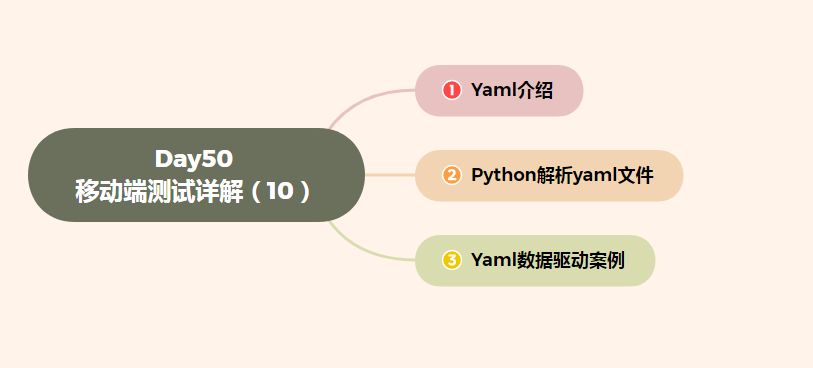

# Day50 移动端测试详解（10）——数据驱动--Yaml


[TOC]




# 1、Yaml介绍

## 学习目标

- 掌握数据的存储方式
- 了解什么是yaml

### 1. 数据存储方式

在了解数据的存储方式之前我们要先知道什么是数据, **数据就是资源,是一切资源的统称**, 数据有不同表现方式和存储方式, 例如文本类型(txt文件、doc文件)、图片、音视频等都是数据,都有不同的表现形式.

**数据存储方式有下面4种**:

- 内存,包括RAM(运行内存)和ROM(物理硬盘)中.
- 文件, 包括文本文件(word、excel、ppt等等)、xml(标记语言)、html(超文本标记语言)、 json、yaml
- 数据库, 例如mysql、oracle、sqlserver、sqlite等等
- 网络

### 2. Yaml简介

> Yaml 是一种所有编程语言可用的友好的数据序列化标准. 
>
> 其语法和其他高阶语言类似,并且可以简单表达清单、散列表、标量等资料形式.

### 3. yaml语法规则及支持的数据结构

#### 3.1 语法规则

1. 大小写敏感
2. 使用缩进表示层级关系
3. 缩进时不允许使用tab键,只允许使用空格
4. 缩进的空格数目不重要,只要相同层级的元素左侧对齐即可

#### 3.2 支持的数据结构

- **object(对象)**, 键值对的集合,又称为映射/hash/字典
- **array(数组),** 一组按照次序排列的值,又称序列(sequence)、列表
- **scalars(纯量)**, 单个的、不可再分的值, 包括**字符串、布尔值、整数、浮点数、null、日期**

#### 3.3 数据结构的使用

**(1)、对象**

- 值为字符

  ```yaml
  data.yaml
     animal: pets # 注意冒号后面必须要有一个空格
  
  转换为python代码
     {'animal': 'pets'}
  ```

- 值为字典

  ```yaml
  data.yaml
     animal: {"ke1":"pets","key2":"app"} # python字典
  
  转换为python代码
     {animal: {"ke1":"pets","key2":"app"}} # 嵌套字典结构
  ```

**(2)、数组**

- 方式一

  ```yaml
  data.yaml
     animal: 
       - data1
       - data2
  转换为python代码
     {'animal': ['data1', 'data2']}
  ```

- 方式一

  ```yaml
  data.yaml
     animal: ['data1', 'data2'] # python列表
  
  转换为python代码
     {'animal': ['data1', 'data2']} # 字典嵌套列表
  ```

**(3)、纯量**

主要包括: **字符串、布尔值、整数、浮点数、null、日期**

```
# 字符串
data.yaml
     value: "hello"
转换为python代码
     {"value":"hello"}

# 布尔值
data.yaml
     value1: true
     value2: false
转换为python代码
     {'value1': True, 'value2': False}
     
# 整数，浮点数
data.yaml
     value1: 12
     value2: 12.102
# 转换为python代码
     {'value1': 12, 'value2': 12.102}
     
# 空(Null)
data.yaml
     value1: ~ # ~ 表示为空
转换为python代码
     {'value1': None}
     
# 日期
data.yaml
     value1: 2017-10-11 15:12:12
转换为python代码
     {'languages': {'value1': datetime.datetime(2017, 10, 11, 15, 12, 12)}}
```

**(4)、锚点和引用**

> 锚点: 标注一个内容,锚点名称自定义, 标示符号是 **&**
>
> 引用: 被标注的内容. 标示符号好是*****,  使用方式: <<: *锚点名

```
data: &imp   # & 是锚点标示符号
    value: 456
name:
    value1: 123
    <<: *imp # "<<:" 合并到当前位置，"*imp" 引用锚点imp
转换为python代码
    {'data': {'value': 456}, 'name': {'value': 456, 'value1': 123}}
```


# 2、python解析yaml文件

## 学习目标

- 掌握python对yaml文件的读写操作


### 1. PyYaml库安装

```
PyYAML为python解析yaml的库.
安装：pip3 install -U PyYAML
```

### 2. python对yaml文件的操作

#### 2.1 读取yaml文件

**使用的方法:**

- yaml.load(stream, Loader=Loader)
  - stream 是等待读取的文件对象

准备yanl文件

```yaml
Search_Data:
      search_test_001:
        value: 456
        expect: [4,5,6]
      search_test_002:
        value: "你好"
        expect: {"value":"你好"}
```

python代码

```python
import yaml

with open("./search_page.yaml", "r") as f:
  data = yaml.load(f)
  print(data)

# 执行结果
{'Search_Data': {
          'search_test_002': {'expect': {'value': '你好'}, 'value': '你好'}, 
          'search_test_001': {'expect': [4, 5, 6], 'value': 456}
			}
}
```

#### 2.2 写入文件内容

**使用的方法:**

- yaml.dump(data, stream, **kwds)
  - Data: 等待写入的数据,类型为字典
  - stream: 打开文件对象
  - encodig: utf-8, 设置写入的编码格式
  - allow_unicode: True/False 

准备数据:

```json
{'Search_Data': {
          'search_test_002': {'expect': {'value': '你好'}, 'value': '你好'}, 
          'search_test_001': {'expect': [4, 5, 6], 'value': 456}
			}
}
```

python代码

```python
import yaml

data = {'Search_Data': {
          'search_test_002': {'expect': {'value': '你好'}, 'value': '你好'},
          'search_test_001': {'expect': [4, 5, 6], 'value': 456}
			}
}

# 要设置编码格式,否则会出现中文乱码
with open('./yaml_hello.yaml', 'w', encoding='utf-8',allow_unicode=True) as f:
    yaml.dump(data, f)

```

执行结果:

```yaml
Search_Data:
  search_test_001:
    expect:
    - 4
    - 5
    - 6
    value: 456
  search_test_002:
    expect:
      value: 你好
    value: 你好  # 设置编码后不出现乱码

```


# 3、yaml数据驱动案例

## 学习目标

- 掌握如何在项目中使用yaml动态修改数据

### 1.什么是数据驱动

> 将测试脚本中的数据独立出来,单独存放到文件中,便于对数据的管理. 

### 2.测试项目

需求:

1. 进入设置点击搜索按钮
2. 输入搜索内容
3. 点击返回

### 3.完成后目录结构

```python
search_content # 项目
- base
	- __init__.py # 初始化文件
  - base_action.py # 封装的基本操作
  - base_driver.py # 驱动初始化
  - read_data.py # 数据解析文件
- data
	- search_data.yaml
- page
	- search_page.py
-	script
	- test_search.py
- pytest.ini
```

### 4. 代码

#### 4.1 创建data目录,创建search_data.yaml

```yaml
search_test_001:
  input_text: "你好"
search_test_002:
  input_text: "1234"
seearch_test_003:
  input_text: "*&^%"
```

#### 4.2 创建base/read_data.py 解析数据

Read_data.py

```python
import yaml
import os

class ReadData:
    def __int__(self, filename):
        self.path = os.getcwd() + os.sep + "data" + os.sep + filename

    def return_data(self):
        with open(self.path, "r") as f:
            data = yaml.load(f)
            return data
```

Base_action.py

```python
class BaseAction:
    def __init__(self, driver):
        self.driver = driver

    def click_element(self, loc):
        """点击的基本操作"""
        self.find_element(loc).click()

    def input_element_content(self, loc, content):
        """输入框的基本操作"""
        self.find_element(loc).clear()
        self.find_element(loc).send_keys(content)

    def find_element(self, loc):
        """抽取查找元素的基本动作"""
        self.driver.implicitly_wait(10)
        return self.driver.find_element(loc[0], loc[1])

```

Base_driver.py

```python
from appium import webdriver


def init_driver(app_package, app_activity):
    desired_caps = dict()
    # 测试设备信息
    desired_caps['platformName'] = 'Android'
    desired_caps['platformVersion'] = '5.1'
    desired_caps['deviceName'] = '192.168.56.101:5555'
    # app信息
    desired_caps['appPackage'] = app_package # 抽取为常量
    desired_caps['appActivity'] = app_activity # 抽取为常量

    # 返回驱动对象
    return  webdriver.Remote('http://127.0.0.1:4723/wd/hub', desired_caps)

```

__init__.py

```python
from appium.webdriver.webdriver import By

"""
1.应用的包名和启动名
"""
app_package = 'com.android.settings'
app_activity = ".Settings"

"""
2.搜索
"""
search_button = (By.XPATH, "//*[@content-desc='搜索']")
search_edit_text = (By.CLASS_NAME, "android.widget.EditText")
back_button = (By.CLASS_NAME, "android.widget.ImageButton")
```


#### 4.3 编写测试脚本script/test_search.py

Test_search.py

```python
import base
import pytest
from page.search_page import SearchPage
from base.base_driver import init_driver
from base.read_data import ReadData

def package_param_data():
    """解析数据"""
    yaml_data = ReadData('search_data.yaml').return_data()
    list_data = []
    for i in yaml_data.keys():
        list_data.append((i, yaml_data.get(i).get('input_text')))
    return list_data


class Test_Search:
  '''测试脚本'''
    def setup_class(self):
        self.driver = init_driver(base.app_package, base.base_driver)

    def teardown_class(self):
        self.driver.quit()

    @pytest.mark.parametrize('test_id, input_text', package_param_data())
    def test_search(self, test_id, input_text):
        sp = SearchPage(self.driver)
        # 调用操作类
        # print("test_id:", test_id)
        sp.input_search(input_text)

```

#### 4.4  编写search_page.py

封装的是搜索的功能

```python
import base
from base.base_action import BaseAction


class SearchPage(BaseAction):

    def click_search(self):
        """点击搜索按钮"""
        self.click_element(base.search_button)

    def input_search(self, text):
        """输入搜索内容"""
        self.input_element_content(base.search_edit_text, text)

    def click_back(self):
        self.click_element(base.back_button)

```

#### 4.5 pytest的配置文件

Pytest.ini

```ini
[pytest]
addopts = -s
test_path = ./script
python_files = test_*
python_classes = Test*
python_functions = test_*
```

### 5. 总结

经过实现我们发现很多代码都是重复的,变化的只是要进行测试的功能模块,因此我们可以对此架构进行重复使用,更改的只是测试脚本文件、搜索功能的集体实现.

新增的是数据驱动这一块,后面也可以重复使用.重点要掌握yaml的数据驱动实现.


-169476779618317.jpg)
