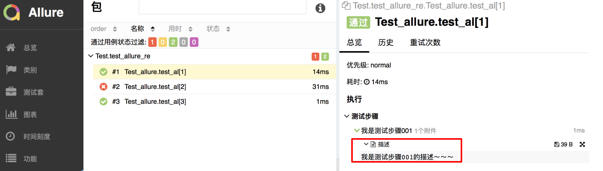
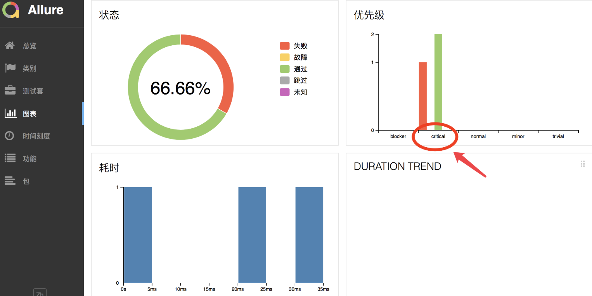
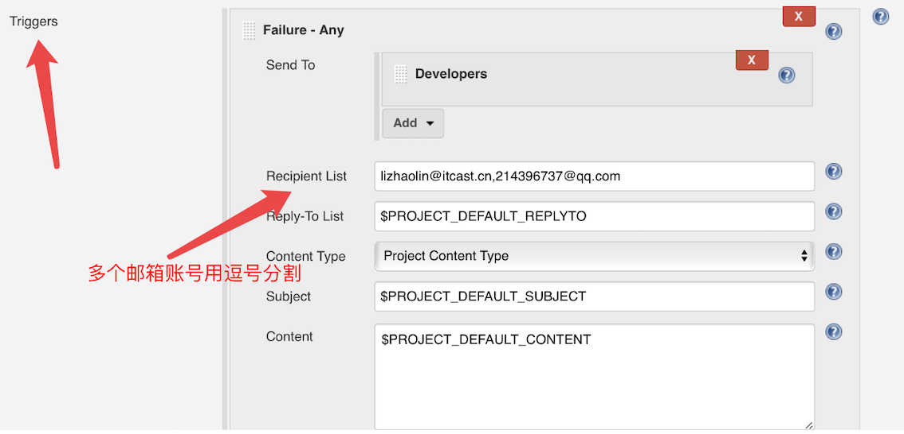
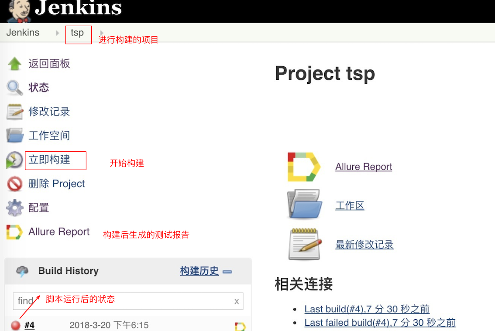

# Day51 移动端测试详解（11）——Allure报告和Jenkins集成


## 学习目标

- 掌握allure工具的使用
- 能够使用allure和pytest生成测试报告
- 掌握Jenkin的相关配置
- 掌握持续集成的配置


# Allure

## 学习目标

- 掌握allure的安装和基本使用

### 1. Allure介绍

[Allure](http://allure.qatools.ru/)是一款非常轻量级并且非常灵活的开源测试报告生成框架,  能够生成美观易读的报告，目前支持语言：Java, PHP, Ruby, Python, Scala, C#。它支持绝大多数测试框架， 例如TestNG、Pytest、JUint等。它简单易用，易于集成.


### 2. Pytest框架集成Allure

Pytest是Python的单元测试框架，非常方便和易用,我们已经使用过了,接下来主要介绍如何将测试报告生成工具Allure集成到Pytest中。

#### 2.1 安装Allure Pytest Adaptor

Allure Pytest Adaptor是Pytest的一个插件，通过它我们可以生成Allure所需要的用于生成测试报告的数据。安装[pytest-allure-adaptor](https://pypi.python.org/pypi/pytest-allure-adaptor)插件方法

```shell
pip install pytest-allure-adaptor
```

#### 2.2 Allure Pytest Adaptor使用案例

创建项目allpure_hello,在项目下创建pytest的配置文件

pytest.ini

```ini
[pytest]
; 在执行命令目录生成report文件夹，文件夹下包含xml文件
addopts = -s --alluredir report 
testpaths = ./script
python_files = test_*.py
python_classes = Test_*
python_functions = test_*
```

在项目根目录下创建script/test_allure_report.py 文件

test_allure_report.py

```python
class TestAllure:

    def setup(self):
        print('---> setup')

    def teardown(self):
        print('teardown')

    def test_a(self):
        print('test_a')
        assert 1

    def test_b(self):
        print('test_')
        assert 0

```

执行命令: pytest , 会在项目根目录下生成report文件夹,文件夹下生成xml文件

#### 2.3 xml转html工具安装

xml是可以用浏览器打开,但是并不美观,我们要把它转化为html格式的,需要安装转化工具: allure

- mac版本

  ```
  1.执行命令: brew install allure
  2.进入report上级目录执行命令：allure generate report/ -o report/html
  3.report目录下会生成index.html文件，即为可视化报告
  ```

- windows版本

  ```
  1.下载压缩包allure-2.5.0.zip
  2.解压
  3.将压缩包内的bin目录配置到path系统环境变量
  4.进入report上级目录执行命令：allure generate report/ -o report/html
  5.report目录下会生成index.html文件，即为可视化报告
  ```

# pytest中使用allure

## 学习目标

- 能够在测试脚本中添加测试步骤和设置错误级别

### 1、添加测试步骤

**添加测试步骤的目的:** 便于在测试报告中明确的显示是第几步发生了错误

**方法:** 

```
@allure.step(title="测试步骤001")
```

**示例代码**

test_allure_report.py

```python
import allure
import pytest

class TestAllure:

    def setup(self):
        print('---> setup')

    def teardown(self):
        print('teardown')
	
  	@pytest.mark.parametrize("a", [1,2,3])
    @allure.step("我是测试步骤001")
    def test_a(self):
        print('test_a')
        assert a != 2

```

执行pytest,重新打开生成的测试报告


### 2. 添加测试描述信息

**添加描述信息目的:** 能够清除知道每一步执行的信息

**方法:**

```
allure.attach("描述", "我是测试步骤001的描述~~")
```

**示例代码**

test_allure_report.py

```python
import allure
import pytest

class TestAllure:

    def setup(self):
        print('---> setup')

    def teardown(self):
        print('teardown')
	
  	@pytest.mark.parametrize("a", [1,2,3])
    @allure.step("我是测试步骤001")
    def test_a(self):
        print('test_a')
        # 添加描述信息
        allure.attach("描述", "我是测试步骤001的描述~~")
        assert a != 2

```

执行pytest,重新打开生成的测试报告



### 3. 添加严重级别

**目的:** 测试用例设置不同的严重级别，可以帮助测试和开发人员更直观的关注重要Case.

**方法:**

```python
@pytest.allure.severity(Severity)
# 参数解释:
  	Severity: 严重级别(BLOCKER,CRITICAL,NORMAL,MINOR,TRIVIAL)
# 使用方式:
		@pytest.allure.severity(pytest.allure.severity_level.CRITICAL)

```

执行pytest,重新打开生成的测试报告

```python
import allure
import pytest

class TestAllure:

    def setup(self):
        print('---> setup')

    def teardown(self):
        print('teardown')
	
  	@pytest.mark.parametrize("a", [1,2,3])
    @allure.step("我是测试步骤001")
    @oytest.allure.severity(pytest.allure.severity_level.CRITICAL)
    def test_a(self):
        print('test_a')
        # 添加描述信息
        allure.attach("描述", "我是测试步骤001的描述~~")
        assert a != 2
```




# Jenkins安装于配置

## 学习目标

- 掌握jenkins的安装和配置

### 1. Jenkins介绍

> Jenkins是一个开源软件项目，是基于Java开发的一种持续集成工具，用于监控持续重复的工作, 旨在提供一个开放易用的软件平台，使软件的持续集成变成可能.

### 2. 安装

#### 2.1 jar包的方式安装

安装要依赖于java环境,必须首先在系统中安装jdk1.5版本以上, 并且配置在系统环境变量中.

安装方式:

1. 下载jenkins.jar
2. 移动到要安装的目录,执行java -jar jenkins.war
3. 代开浏览器输入: localhost:8080

#### 2.2 源码包安装

1. [官网下载jenkins安装包](https://links.jianshu.com/go?to=https://jenkins.io/index.html)

2. 点击下一步,直到安装完成,会自动打开页面, 若没有打开,需要手动打开浏览器输入: localhost:8080
3. 进入默认密码提示文件,输入系统默认的密码:


4. 点击确定保存密码, 然后可以看到让安装插件

   

   

5. 设置用户信息


6. 启动后,**点击开始使用jenkins**, 进入首页

   


# Jenkins持续集配置

## 学习目标

- 掌握Jenkins持续集成的相关配置

### 1. Jenkins安装allure插件

jenkins和allure一起配合可以自动帮我们生成好看的测试报告,不用每次自己都要自己使用命令行生成.

1. 进入jenkins系统管理 -> 管理插件
2. 点击可选插件
3. 搜索框搜索Allure Jenkins Plugin
4. 选中安装

### 2. 安装Allure Commandlin

1. 在Jenkins系统管理——> 全局工具管理

2. 找到Allure Commandline，点击Allure Commandline安装

   

3. 点击后,弹出如下页面, 输入一个别名

   

4. 选择安装版本

5. 点击新增安装-选择解压\*.ip/\*.tar.gz

6. 解压目录选择已经下载好的allure2.5.0.zip所在目录(⚠️ 版本要和第4步的版本一致)

7. 点击保存


### 3. Jenkins 和Git进行代码的持续管理

1. 创建一个自由风格项目—> 点击确定

2. 输入项目描述

3. 选择GitHub Project进行代码的管理

4. 输入github的的本地仓库名(⚠️, 在公司里要选择自己仓库名)

   

5. 勾选git

6. Repository URL 输入和第4步一样

   

7. 点击add添加github用户名和密码

   

### 4. 构建触发器并发送邮件

通过构建触发器,可以在约定的时间自动运行测试脚本,有错误可以自动的给开发人员发送邮件,不用测试人员一直守着.

#### 4.1 构建触发器

1. 根据需要勾选Build periodically选项
2. 在日程表填写定时任务时间


> 日程表填写的参数的含义:
>
> - 第1个参数：分钟 minute，取值 0~59；
> - 第2个参数：小时 hour，取值 0~23；
> - 第3个参数：天 day，取值 1~31；
> - 第4个参数：月 month，取值 1~12；
> - 第5个参数：星期 week，取值 0~7，0 和 7 都是表示星期天；
>
> **5个参数可选择性设定，不写死的参数用 * 号代替，参数之间用空格隔开.**

3. 点击增加构建步骤,选择Execute shell

4. Command框输入:

   ```shell
   export PATH=$PATH:'pytest可执行的目录'
   pytest
   ```

   

#### 4.2 添加测试报告生成路径

1. 构建后操作,点击增加构建后操作步骤,选择Allure Report

2. Path框输入,生成的报告文件夹名称, 注意, 文件夹名要和pytest生成的报告文件夹名称一样

   

#### 4.3 配置邮箱列表

1. 点击增加构建后操作步骤，选择Editable Email Notification
2. 点击Advanced Setting…
3. 点击Trigger的高级按钮
4. Recipient List输入邮件接收列表，多个邮箱逗号分隔



5. 在Jenkins系统中配置邮件

   在系统全局配置中进行邮件配置, 要配置管理员的邮箱、发送/接收邮件的服务器、邮件接收人的邮箱列表.

   配置如下:

   ```
   配置邮件系统用户：
           系统管理-系统设置-Jenkins Location
           系统管理员邮件地址：用户名@163.com(发送邮件用户)
   配置系统邮件：
           系统管理-系统设置-邮件通知
           SMTP服务器：例 smtp.163.com
           用户默认邮件后缀：例如 @163.com
           高级-使用SMTP认证
           输入发送邮箱和密码 -可以使用测试邮件验证
   配置(发送附件)邮件：
           系统管理-系统设置-Extended E-mail Notification
           SMTP server：例 smtp.163.com
           Default user E-mail suffix：例如 @163.com
           高级-Use SMTP Authentication - 输入发送邮件的邮箱和密码
           Default Content Type: HTML(text/html)
           Default Content(报告模版,使用以下html代码即可):
                  <hr/>(本邮件是程序自动下发的，请勿回复！)<hr/>
                   项目名称：$PROJECT_NAME<br/><hr/>
                   构建编号：$BUILD_NUMBER<br/><hr/>
                   git版本号：${GIT_REVISION}<br/><hr/>
                   构建状态：$BUILD_STATUS<br/><hr/>
                   触发原因：${CAUSE}<br/><hr/>
                   目录：${ITEM_ROOTDIR}<br/><hr/>
                   构建日志地址：<a href=" ">${BUILD_URL}console</a ><br/><hr/>
                   构建地址：<a href="$BUILD_URL">$BUILD_URL</a ><br/><hr/>
                   报告地址：<a href="${BUILD_URL}allure">${BUILD_URL}allure</a ><br/><hr/>
                   失败数：${FAILED_TESTS}<br/><hr/>
                   成功数：${FAILED_TESTS}<br/><hr/>
                   变更集：${JELLY_SCRIPT,template="html"}<br/><hr/>
   ```

### 5. 进行项目构建

项目构建有2种方式, 构建后就会运行测试脚本,运行完毕后会很生成测试报告,测试未通过会给相关人员发送邮件

**构建的2种方式:**

- 手动触发构建
- 更新github代码,触发器在定时任务到达时,会触发项目构建

构建后页面,在此页面上我们可以看到构建的历史和构建的状态, 构建状态有三种:

构建的三种状态:

- 蓝色圆球代表构建成功
- 红色圆球代表构建失败
- 灰色圆球代表构建中断



### 6.总结

通过Jenkin、Allure、Pytest、Git 的联合配置使用,会大大解放测试人员的压力,测试人员只要把工作的重心放在测试用例计划、测试用例的编写和测试脚本的编写上面就可以.

