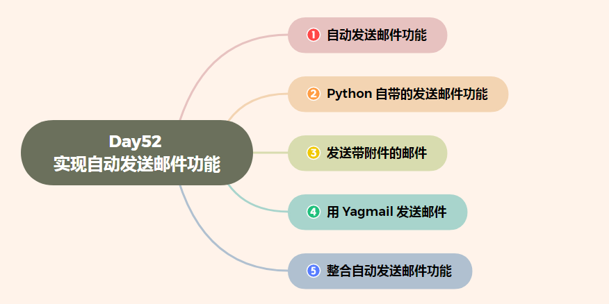
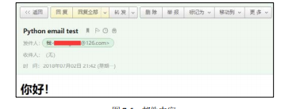
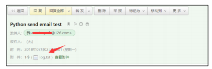
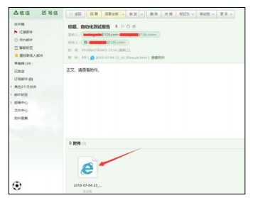

# Day52 实现自动发送邮件功能

[TOC]




# 1、自动发送邮件功能

自动发送邮件功能是自动化测试项目的重要需求之一，当自动化测试用例运行完成之

后，可自动向相关人员的邮箱发送测试报告。严格来讲，这里介绍的发送邮件模块并不属

于 unittest 的扩展，不过，我们仍然可以将它与 unittest 结合使用。

SMTP（Simple Mail Transfer Protocol）是简单邮件传输协议，是一组由源地址到目的

地址传送邮件的规则，可以控制信件的中转方式。Python 的 smtplib 模块提供了简单的 API

用来实现发送邮件功能，它对 SMTP 进行了简单的封装。

在实现发送邮件功能之前，需要补充一个基础知识。在给其他人发送邮件之前，首先

需要有一个自己的邮箱。通过浏览器打开邮箱网址（如 www.126.com），或打开邮箱客户

端（如 Foxmail），登录自己的邮箱账号。如果是邮箱客户端，则还需要配置邮箱服务器地

址（如 smtp.126.com）。然后填写收件人地址、邮件的主题和正文，以及添加附件等。即

便通过 Python 实现发送邮件功能，也需要设置这些信息。


# 2、Python 自带的发送邮件功能

在发送邮件时，除填写主题和正文外，还可以增加抄送人、添加附件等。这里我们分

别把测试报告作为正文和附件进行发送。


```
****．发送邮件正文**

import smtplib

from email.mime.text import MIMEText

from email.header import Header


subject = 'Python email test'

# 编写 HTML 类型的邮件正文

msg = MIMEText('<html><h1>你好！</h1></html>', 'html', 'utf-8')

msg['Subject'] = Header(subject, 'utf-8')

# 发送邮件

smtp = smtplib.SMTP()

smtp.connect("smtp.126.com")

smtp.login("sender@126.com", "a123456")

smtp.sendmail("sender@126.com", "receiver@126.com", msg.as_string())

smtp.quit()
```

首先，调用 email 模块下面的 MIMEText 类，定义发送邮件的正文、格式，以及编码。

然后，调用 email 模块下面的 Header 类，定义邮件的主题和编码类型。

smtplib 模块用于发送邮件。connect()方法指定连接的邮箱服务；login()方法指定登录

邮箱的账号和密码；sendmail()方法指定发件人、收件人，以及邮件的正文； quit()方法用 

于关闭邮件服务器的连接。

登录收件人邮箱，可看到邮件内容如图所示。




# 3、发送带附件的邮件

```
import smtplib

from email.mime.text import MIMEText

from email.mime.multipart import MIMEMultipart

# 邮件主题

subject = 'Python send email test'

# 发送的附件

with open('log.txt', 'rb') as f:
  send_att = f.read()

att = MIMEText(send_att, 'text', 'utf-8')

att["Content-Type"] = 'application/octet-stream'

att["Content-Disposition"] = 'attachment; filename="log.txt"'

msg = MIMEMultipart()

msg['Subject'] = subject

msg.attach(att)

# 发送邮件

smtp = smtplib.SMTP()

smtp.connect("smtp.126.com")

smtp.login("sender@126.com", "a123456")

smtp.sendmail("sender@126.com", "receiver@126.com", msg.as_string())

smtp.quit()
```

带附件的邮件要稍微复杂一些。

首先，读取附件的内容。通过 MIMEText 类，定义发送邮件的正文、格式，以及编码；

Content-Type 指定附件内容类型；application/octet-stream 表示二进制流；Content-Disposition

指定显示附件的文件；attachment; filename="log.txt"指定附件的文件名。

然后，使用 MIMEMultipart 类定义邮件的主题，attach()指定附件信息。

最后，通过 smtplib 模块发送邮件，发送过程与第一个例子相同。

带附件的邮件如图所示。




# 4、用 yagmail 发送邮件


yagmail 是 Python 的一个第三方库，可以让我们以非常简单的方法实现自动发送邮件


GitHub 项目地址： https://github.com/kootenpv/yagmail。

通过 pip 命令安装。

```
> pip install yagmail
```

项目文档提供了的简单发送邮件的例子。

```
import yagmail

# 连接邮箱服务器

yag = yagmail.SMTP(user="sender@126.com", password="a123456", 

host='smtp.126.com')

# 邮件正文

contents = ['This is the body, and here is just text http://somedomain/image.png',

 'You can find an audio file attached.']

# 发送邮件

yag.send('receiver@126.com', 'subject', contents)
```

总共四行代码，是不是比上面的例子简单太多了。有了前面的基础，这里的代码就不

需要做过多解释了。

如果想给多个用户发送邮件，那么只需把收件人放到一个 list 中即可。

```
…

\# 发送邮件

yag.send(['aa@126.com','bb@qq.com','cc@gmail.com'], 'subject', contents)
```

如果想发送带附件的邮件，那么只需指定本地附件的路径即可。

```
…

\# 发送邮件

yag.send('aa@126.com', 'subject', contents, ["d://log.txt","d://baidu_

img.jpg"])
```

另外，还可以通过 list 指定多个附件。yagmail 库极大地简化了发送邮件的代码。


# 5、整合自动发送邮件功能

在学习了如何用 Python 实现发送邮件之后，现在只需将功能集成到自动化测试项目中

即可。打开 run_tests.py 文件，修改代码如下。

```
import time

import unittest

import yagmail

from HTMLTestRunner import HTMLTestRunner

\#把测试报告作为附件发送到指定邮箱

def send_mail(report):

 yag = yagmail.SMTP(user="sender@126.com",

 password="a123456", 

 host='smtp.126.com')

 subject = "主题，自动化测试报告"

 contents = "正文，请查看附件。"

 yag.send('receiver@126.com', subject, contents, report)

 print('email has send out !')

 

if __name__ == '__main__':

 \# 定义测试用例的目录为当前目录

 test_dir = './test_case'

 suit = unittest.defaultTestLoader.discover(test_dir, pattern='test_*.py')

 \# 获取当前日期和时间

 now_time = time.strftime("%Y-%m-%d %H_%M_%S")

 html_report = './test_report/' + now_time + 'result.html'

 fp = open(html_report, 'wb')

 \# 调用 HTMLTestRunner，运行测试用例

 runner = HTMLTestRunner(stream=fp,

 title="百度搜索测试报告",

 description="运行环境：Windows 10, Chrome 浏览器"

 )

 runner.run(suit)

 fp.close()

 send_mail(html_report) # 发送报告
```

整个程序的执行过程可以分为两部分：

（1）定义测试报告文件，并赋值给变量 html_report，通过 HTMLTestRunner 运行测试

用例，将结果写入文件后关闭。

（2）调用 send_mail()函数，并传入 html_report 文件。在 send_mail()函数中，把测试报

告作为邮件的附件发送到指定邮箱。

为什么不把测试报告的内容读取出来作为邮件正文发送呢？因为 HTMLTestRunner 报

告在展示时引用了 Bootstrap 样式库，当作为邮件正文“写死”在邮件中时，会导致样式丢

失，所以作为附件发送更为合适。附件中的自动化测试报告如图所示。




-169476851045019.jpg)