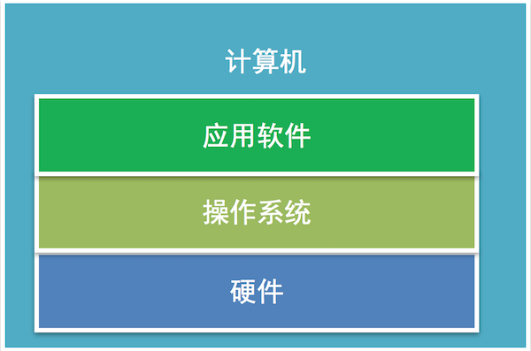
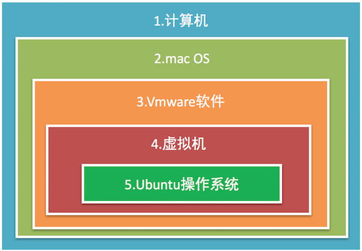
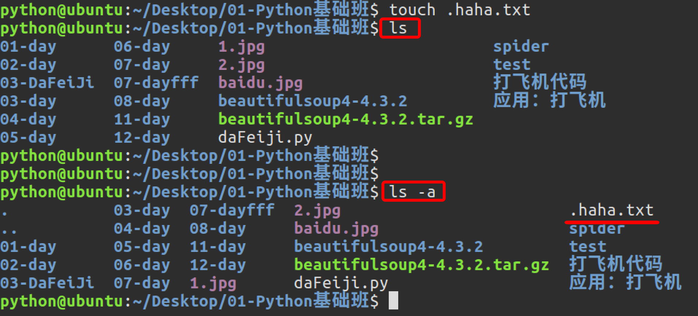
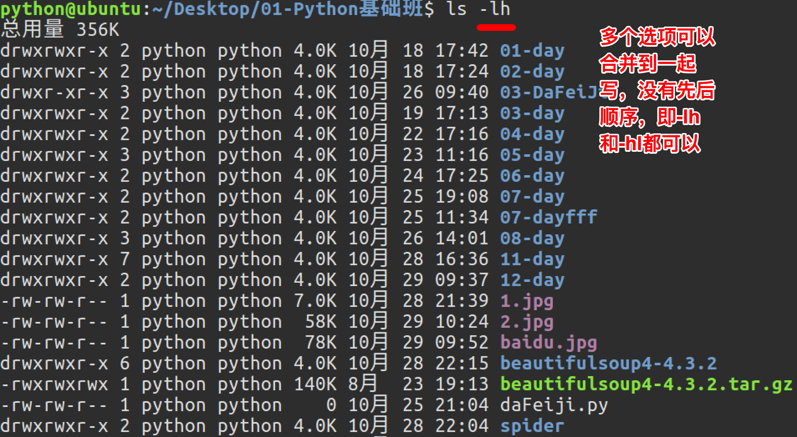

# Day53 Linux基础命令

# 操作系统

**学习目标**

- 能够知道操作系统的作用

------

### 1. 常见的操作系统

- Windows
- mac OS
- Linux
- iOS
- Android

### 2. 操作系统的定义

操作系统直接运行在计算机上的**系统软件**， 它是**控制硬件和支持软件运行的计算机程序**。

### 3. 操作系统的作用

向下**控制硬件**向上**支持软件的运行**，具有承上启下的作用。

### 4. 小结

操作系统是一个控制硬件和支持软件运行的计算机程序，只有安装了操作系统计算机才能进行正常工作。

# 虚拟机软件

**学习目标**

- 能够说出虚拟机的作用

------

### 1. 虚拟机软件的介绍

它是能够虚拟出来计算机的一个软件。

**常用虚拟机软件:**

- Vmware
- VirtualBox

**说明:**

只有安装了虚拟机软件才可以创建虚拟机，当然通过虚拟机软件还可以创建多个虚拟机。

### 2. 虚拟机的介绍

就是模拟一个真实的计算机，好比一个虚拟的电脑，**对于快速学习一个新的操作系统就可以通过虚拟机来完成**。

**说明:**

虚拟机之间是相互独立的，删除虚拟机不会对其它虚拟机产生影响，当然也不会对电脑本身生影响

### 3. 虚拟机软件的安装说明

- Windows和Linux下载VMware Workstation版的安装包
- mac OS下载VMware Fusion版的安装包
- 当对应的安装包下载完成以后双击进行安装就可以了
- 当虚拟机软件安装成功就可以创建虚拟机了

**创建虚拟机效果图**

这里需要提前下载一个操作系统镜像文件

然后安装提示一步步进行安装就可以了。

### 4. 小结

- 对应快速学习一个新的操作系统，我们可以借助虚拟机来完成。

- 虚拟机软件、虚拟机、操作系统它们三者之间的关系：

  

# Ubuntu操作系统

**学习目标**

- 能够说出Windows和Linux文件目录结构的区别

------

### 1. Ubuntu操作系统的介绍

Ubuntu操作系统是属于**Linux操作系统中的一种**，它是免费、稳定又可以拥有绚丽界面的一个操作系统

### 2. Ubuntu图形界面的介绍

- 任务栏
- 窗口操作按钮
- 窗口菜单条

**任务栏效果图:**

**窗口操作按钮效果图:**

**窗口菜单条效果图:**

### 3. 与Windows目录结构对比

**Windows目录结构效果图:**

**说明:**

每一个盘符就是一个根目录，在Windows操作系统里面可能会出现多个根目录。

**Linux目录结构效果图:**

**说明:**

Ubuntu 没有盘符这个概念，只有一个根目录 / 。

**Linux主要目录介绍效果图:**

**主要目录说明:**

- /：根目录
- /bin：可执行二进制文件的目录
- /etc：系统配置文件存放的目录
- /home：用户家目录

### 4. 与Windows窗口对比

**Windows窗口效果图:**

**Linux窗口效果图:**

**窗口对比说明:**

- Windows窗口操作按钮在窗口左边
- Linux窗口操作按钮在窗口右边

### 5. 小结

- Ubuntu操作系统属于Linux操作系统中的一种
- Ubuntu操作系统窗口菜单条会隐藏，鼠标移动上去会显示，而Windows操作系统的窗口菜单条不会隐藏。
- Windows操作系统有可能会有多个盘符（C、D、E、F）
- Ubuntu操作系统没有多个盘符，只有一个根目录（/）
- Ubuntu操作系统比Windows操作系统运行更加稳定。

# Linux内核及发行版

**学习目标**

- 能够知道内核和发行版的关系
- 能够说出常用的Linux发行版操作系统

------

### 1. Linux内核

Linux内核是操作系统内部**操作和控制硬件设备的核心程序**，它是由芬兰人**林纳斯**开发的。

**内核效果图:**

**说明:**

真正操作和控制硬件是由内核来完成的，操作系统是基于内核开发出来的。

### 2. Linux发行版

是Linux内核与各种常用软件的组合产品，通俗来说就是我们常说的Linux操作系统。

**常用的Linux发行版:**

- Ubuntu
- CentOS
- Redhat

**Linux发行版效果图:**

### 3. 小结

- Linux内核是Linux操作系统管理硬件设备的核心程序
- 常用的Linux操作系统都是基于Linux内核开发出来的

# 查看目录命令

**学习目标**

- 能够使用Linux命令查看目录信息

------

### 1. 查看目录命令的使用

| 命令 | 说明                   |
| :--- | :--------------------- |
| ls   | 查看当前目录信息       |
| tree | 以树状方式显示目录信息 |

**ls命令效果图:**

**tree命令效果图:**

### 2. 查看当前目录路径

| 命令 | 说明             |
| :--- | :--------------- |
| pwd  | 查看当前目录路径 |

**pwd命令效果图:**

### 3. 清除终端内容

| 命令  | 说明         |
| :---- | :----------- |
| clear | 清除终端内容 |

**pwd命令效果图:**

 

### 4. 小结

- ls和tree是我们查看目录信息最常用的命令
- ls只能查看一层目录信息
- tree可以查看多层目录信息。

# 切换目录命令

**学习目标**

- 能够使用Linux命令查看目录信息

------

### 1. 切换目录命令的使用

| 命令    | 说明                   |
| :------ | :--------------------- |
| cd 目录 | 切换到指定目录         |
| cd ~    | 切换到当前用户的主目录 |
| cd ..   | 切换到上一级目录       |
| cd .    | 切换到当前目录         |
| cd -    | 切换到上一次目录       |

**注意:**

- cd命令切换目录时，这个目录必须存在。
- cd 后面不写目录等价于cd ~

**cd 目录效果图:**

**cd ~效果图:**

**cd ..效果图:**

**cd .效果图:**

**cd -效果图:**

### 2. 小结

- cd命令是完成目录切换操作的，当切换目录时，这个目录必须存在。

# 绝对路径和相对路径

**学习目标**

- 能够使用绝对路径或者相对路径进行目录切换

------

### 1. 绝对路径

从根目录算起的路径叫做绝对路径

**例如:**

- /home/python/Desktop
- /usr/bin

### 2. 相对路径

从当前目录算起的路径叫做相对路径

**例如:**

- ./test/hello
- ../static/images

### 3. 绝对路径和相对路径的使用

1. 使用绝对路径切换到桌面
   cd /home/python/Desktop
2. 在下载目录以相对路径切换到桌面
   cd Downloads
   cd ../Desktop
3. 在桌面使用相对路径切换到上一级目录的上一级目录 cd Desktop cd ../../

### 4. 自动补全

- 当敲出 文件或者目录或者命令 的前几个字母之后，按下 tab 键，如果输入的没有歧义，系统会自动补全
- 当切换目录或者使用命令的时候，如果不确定当前目录下有那些子目录或者其它命令，可以通过两次tab键查看

### 5. 小结

- 绝对路径和相对路径是路径的两种表现形式，应遵循最短路径原则(使用最短的路径操作某个文件或者目录)。
  - 如果切换的目录离当前目录近可以使用相对路径
  - 如果切换的目录离根目录近可以使用绝对路径
  - 如果切换的目录离根目录和当前目录都一样那么使用绝对路径，因为这样路径很清楚和明确，方便阅读。

# 创建、删除文件及目录命令

**学习目标**

- 能够使用Linux命令创建文件夹

------

### 1. 创建、删除文件及目录命令的使用

| 命令                | 说明                 |
| :------------------ | :------------------- |
| touch 文件名        | 创建指定文件         |
| mkdir 目录名        | 创建目录(文件夹)     |
| rm 文件名或者目录名 | 删除指定文件或者目录 |
| rmdir 目录名        | 删除空目录           |

**touch命令效果图:**

**mkdir命令效果图:**

**rm命令效果图:**

**rm删除目录效果图**

**说明:**

**rm命令想要删除目录需要加上-r选项**，-r表示递归删除目录及其内容

**rmdir命令效果图:**

### 2. 小结

- touch 表示创建文件
- mkdir 表示创建目录
- rm 表示删除文件或者目录，如果删除目录需要使用 -r 选项，-r 表示递归删除目录及其内容
- rmdir 表示删除空目录

# 复制、移动文件及目录命令

**学习目标**

- 能够使用Linux命令拷贝和移动文件

------

### 1. 复制、移动文件及目录命令的使用

| 命令 | 说明                       |
| :--- | :------------------------- |
| cp   | 拷贝文件、拷贝目录         |
| mv   | 移动文件、移动目录、重命名 |

**cp命令效果图:**

**说明:**

- 拷贝目录需要加上-r选项，-r表示递归拷贝目录及其内容

**mv命令移动文件效果图**

**mv命令移动目录效果图**

**mv命令重名名效果图**

### 2. 小结

- cp：拷贝目录需要加上 –r 选项
- mv：移动目录不需要加选项
- mv：命令还可以重命名文件和目录

# 终端命令格式的组成

**学习目标**

- 能够知道终端命令的格式

------

### 1. 终端命令格式说明

**command** [-options] [parameter]

**每项信息的说明:**

- command：命令名, 比如: ls、pwd
- [-options]：选项，可以有零个、一个或者多个选项，多个选项可以合并，比如使用的 -r 就是选项。
- [parameter]：参数，可以有零个、一个 或者 多个参数， 比如: touch 文件名、mkdir 目录名、cd 目标目录(路径)，这些文件名和目录名都是参数。
- []：代表可选

### 2. 小结

- 终端命令完整格式: 命令名 选项(可选) 参数(可选)
- 选项：用于调整命令的功能，比如：-r选项调整cp命令的功能。
- 选项可以分为短选项和长选项
  1. 短选项的格式: '-'后面接单个字母, 比如:-r
  2. 长选项的格式: '--'后面接单词, 比如:--help
- 参数：命令的操作对象，一般是文件名或者目录名。
- 对于命令，它的选项和参数一般情况下没有顺序要求，但是scp命令是必须先选项然后在跟上参数。

# 查看命令帮助

**学习目标**

- 能够知道查看命令帮助的方式

------

### 1. 查看命令帮助方式

- --help 使用说明: 命令 --help
- man 使用说明: man 命令

**查看命令帮助的目的说明:**

- 查看命令帮助目的是查看命令选项信息的

**--help效果图:**

**man效果图:**

**man命令的说明:**

| 操作键 | 说明           |
| :----- | :------------- |
| 空格   | 显示下一屏信息 |
| 回车   | 显示下一行信息 |
| b      | 显示上一屏信息 |
| f      | 显示下一屏信息 |
| q      | 退出           |

### 2. 小结

- --help和man是查看命令帮助的两种方式，主要是查看命令所对应的选项信息

# ls命令选项

**学习目标**

- 能够说出查看目录中隐藏文件的命令选项

------

### 1. ls命令选项使用

| 命令选项 | 说明                       |
| :------- | :------------------------- |
| -l       | 以列表方式显示             |
| -h       | 件大小单位显示，默认是字节 |
| -a       | 显示隐藏文件和隐藏目录     |

**ls命令选项效果图:**

   

**每项信息说明:**

### 2. 小结

- ls不同选项会呈现不同的显示方式，其中-l和-a选项最常用

# mkdir和rm命令选项

**学习目标**

- 能够说出删除文件有提醒信息的命令选项

------

### 1. mkdir命令选项

| 命令选项 | 说明               |
| :------- | :----------------- |
| -p       | 创建所依赖的文件夹 |

**mkdir命令选项效果图:**

### 2. rm命令选项

| 命令选项 | 说明                                 |
| :------- | :----------------------------------- |
| -i       | 交互式提示                           |
| -r       | 递归删除目录及其内容                 |
| -f       | 强制删除，忽略不存在的文件，无需提示 |
| -d       | 删除空目录                           |

**rm -i命令选项效果图:**

**rm -r命令选项效果图:**

**rm -f命令选项效果图:**

**rm -d命令选项效果图:**

### 3. 小结

- 创建嵌套文件夹使用 **“mkdir –p”** 嵌套目录
- 删除空目录使用 **“rmdir 目录名”** 或者 **“rm –d 目录名”**
- 删除非空目录使用 **“rm –r 目录名”**

# cp和mv命令选项

**学习目标**

- 能够说出拷贝文件夹使用的命令选项

------

### 1. cp命令选项

| 命令选项 | 说明                 |
| :------- | :------------------- |
| -i       | 交互式提示           |
| -r       | 递归拷贝目录及其内容 |
| -v       | 显示拷贝后的路径描述 |
| -a       | 保留文件的原有权限   |

**cp -i命令选项效果图:**

**cp -r命令选项效果图:**

**cp -v命令选项效果图:**

**cp -a命令选项效果图:**

**-a选项说明:**

- -a 选项还支持拷贝文件夹并且文件夹中的文件权限不丢失

### 2. mv命令选项

| 命令选项 | 说明                 |
| :------- | :------------------- |
| -i       | 交互式提示           |
| -v       | 显示移动后的路径描述 |

**mv -i命令选项效果图:**

**mv -v命令选项效果图:**

### 3. 小结

- 拷贝文件防止覆盖使用 **“cp –i”** 操作
- 拷贝文件夹使用 **“cp –r”** 操作，拷贝文件夹并且文件权限不丢失使用 **“cp –a”** 操作。
- 移动文件防止覆盖使用 **“mv –i”** 操作
- 移动文件夹直接使用 **“mv”** 即可，**“mv”** 还可以给文件和文件夹重命名。

