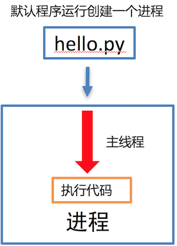

# Day55 Python多任务编程


# 多任务的介绍

**学习目标**

- 能够知道多任务的执行方式

------

### 1. 提问

**利用现学知识能够让两个函数或者方法同时执行吗?**

不能，因为之前所写的程序都是**单任务的**，也就是说一个函数或者方法执行完成另外一个函数或者方法才能执行，要想实现这种操作就需要使用**多任务**。
多任务的最大好处是**充分利用CPU资源，提高程序的执行效率**。

### 2. 多任务的概念

多任务是指在**同一时间内**执行**多个任务**，例如: 现在电脑安装的操作系统都是多任务操作系统，可以同时运行着多个软件。

**多任务效果图:**


### 3. 多任务的执行方式

- 并发
- 并行

**并发:**

在一段时间内**交替**去执行任务。

**例如:**

对于单核cpu处理多任务,操作系统轮流**让各个软件交替执行**，假如:软件1执行0.01秒，切换到软件2，软件2执行0.01秒，再切换到软件3，执行0.01秒……这样反复执行下去。表面上看，每个软件都是交替执行的，但是，由于CPU的执行速度实在是太快了，我们感觉就像这些软件都在同时执行一样，这里需要注意单核cpu是并发的执行多任务的。

**并行:**

对于多核cpu处理多任务，操作系统会给cpu的每个内核安排一个执行的软件，**多个内核是真正的一起执行软件**。这里需要注意**多核cpu是并行的执行多任务，始终有多个软件一起执行**。

### 4. 小结

- 使用多任务就能充分利用CPU资源，提高程序的执行效率，让你的程序具备处理多个任务的能力。
- 多任务执行方式有两种方式：**并发**和**并行**，这里并行才是多个任务真正意义一起执行。

# 进程

**学习目标**

- 能够知道进程的作用

------

### 1. 进程的介绍

在Python程序中，想要实现多任务可以使用进程来完成，进程是实现多任务的一种方式。

### 2. 进程的概念

一个正在运行的程序或者软件就是一个进程，**它是操作系统进行资源分配的基本单位**，也就是说每启动一个进程，操作系统都会给其分配一定的运行资源(内存资源)保证进程的运行。

比如:现实生活中的公司可以理解成是一个进程，公司提供办公资源(电脑、办公桌椅等)，真正干活的是员工，员工可以理解成线程。

**注意:**

**一个程序运行后至少有一个进程，一个进程默认有一个线程**，进程里面可以创建多个线程，**线程是依附在进程里面的，没有进程就没有线程**。

### 3. 进程的作用

**单进程效果图:**



**多进程效果图:**


**说明:**

多进程可以完成多任务，每个进程就好比一家独立的公司，每个公司都各自在运营，每个进程也各自在运行，执行各自的任务。

### 4. 小结

- 进程是操作系统进行资源分配的基本单位。
- 进程是Python程序中实现多任务的一种方式


# 多进程的使用

**学习目标**

- 能够使用多进程完成多任务

------

### 1 导入进程包

```py
#导入进程包
import multiprocessing
```

### 2. Process进程类的说明

**Process([group [, target [, name [, args [, kwargs]]]]])**

- group：指定进程组，目前只能使用None
- target：执行的目标任务名
- name：进程名字
- args：以元组方式给执行任务传参
- kwargs：以字典方式给执行任务传参

**Process创建的实例对象的常用方法:**

- start()：启动子进程实例（创建子进程）
- join()：等待子进程执行结束
- terminate()：不管任务是否完成，立即终止子进程

**Process创建的实例对象的常用属性:**

name：当前进程的别名，默认为Process-N，N为从1开始递增的整数

### 3. 多进程完成多任务的代码

```py
import multiprocessing
import time


# 跳舞任务
def dance():
    for i in range(5):
        print("跳舞中...")
        time.sleep(0.2)


# 唱歌任务
def sing():
    for i in range(5):
        print("唱歌中...")
        time.sleep(0.2)

if __name__ == '__main__':
    # 创建跳舞的子进程
    # group: 表示进程组，目前只能使用None
    # target: 表示执行的目标任务名(函数名、方法名)
    # name: 进程名称, 默认是Process-1, .....
    dance_process = multiprocessing.Process(target=dance, name="myprocess1")
    sing_process = multiprocessing.Process(target=sing)

    # 启动子进程执行对应的任务
    dance_process.start()
    sing_process.start()
```

**执行结果:**

```py
唱歌中...
跳舞中...
唱歌中...
跳舞中...
唱歌中...
跳舞中...
唱歌中...
跳舞中...
唱歌中...
跳舞中...
```

### 4. 小结

1. 导入进程包
   - import multiprocessing
2. 创建子进程并指定执行的任务
   - sub_process = multiprocessing.Process (target=任务名)
3. 启动进程执行任务
   - sub_process.start()


# 获取进程编号

**学习目标**

- 能够知道如果获取进程编号

------

### 1. 获取进程编号的目的

**获取进程编号的目的是验证主进程和子进程的关系，可以得知子进程是由那个主进程创建出来的。**

获取进程编号的两种操作

- 获取当前进程编号
- 获取当前父进程编号

### 2. 获取当前进程编号

**os.getpid()** 表示获取当前进程编号

**示例代码:**

```py
import multiprocessing
import time
import os


# 跳舞任务
def dance():
    # 获取当前进程的编号
    print("dance:", os.getpid())
    # 获取当前进程
    print("dance:", multiprocessing.current_process())
    for i in range(5):
        print("跳舞中...")
        time.sleep(0.2)
        # 扩展:根据进程编号杀死指定进程
        os.kill(os.getpid(), 9)


# 唱歌任务
def sing():
    # 获取当前进程的编号
    print("sing:", os.getpid())
    # 获取当前进程
    print("sing:", multiprocessing.current_process())
    for i in range(5):
        print("唱歌中...")
        time.sleep(0.2)


if __name__ == '__main__':

    # 获取当前进程的编号
    print("main:", os.getpid())
    # 获取当前进程
    print("main:", multiprocessing.current_process())
    # 创建跳舞的子进程
    # group: 表示进程组，目前只能使用None
    # target: 表示执行的目标任务名(函数名、方法名)
    # name: 进程名称, 默认是Process-1, .....
    dance_process = multiprocessing.Process(target=dance, name="myprocess1")
    sing_process = multiprocessing.Process(target=sing)

    # 启动子进程执行对应的任务
    dance_process.start()
    sing_process.start()
```

**执行结果:**

```py
main: 70763
main: <_MainProcess(MainProcess, started)>
dance: 70768
dance: <Process(myprocess1, started)>
跳舞中...
sing: 70769
sing: <Process(Process-2, started)>
唱歌中...
唱歌中...
唱歌中...
唱歌中...
唱歌中...
```

### 3. 获取当前父进程编号

**os.getppid()** 表示获取当前父进程编号

**示例代码:**

```py
import multiprocessing
import time
import os


# 跳舞任务
def dance():
    # 获取当前进程的编号
    print("dance:", os.getpid())
    # 获取当前进程
    print("dance:", multiprocessing.current_process())
    # 获取父进程的编号
    print("dance的父进程编号:", os.getppid())
    for i in range(5):
        print("跳舞中...")
        time.sleep(0.2)
        # 扩展:根据进程编号杀死指定进程
        os.kill(os.getpid(), 9)


# 唱歌任务
def sing():
    # 获取当前进程的编号
    print("sing:", os.getpid())
    # 获取当前进程
    print("sing:", multiprocessing.current_process())
    # 获取父进程的编号
    print("sing的父进程编号:", os.getppid())
    for i in range(5):
        print("唱歌中...")
        time.sleep(0.2)


if __name__ == '__main__':

    # 获取当前进程的编号
    print("main:", os.getpid())
    # 获取当前进程
    print("main:", multiprocessing.current_process())
    # 创建跳舞的子进程
    # group: 表示进程组，目前只能使用None
    # target: 表示执行的目标任务名(函数名、方法名)
    # name: 进程名称, 默认是Process-1, .....
    dance_process = multiprocessing.Process(target=dance, name="myprocess1")
    sing_process = multiprocessing.Process(target=sing)

    # 启动子进程执行对应的任务
    dance_process.start()
    sing_process.start()
main: 70860
main: <_MainProcess(MainProcess, started)>
dance: 70861
dance: <Process(myprocess1, started)>
dance的父进程编号: 70860
跳舞中...
sing: 70862
sing: <Process(Process-2, started)>
sing的父进程编号: 70860
唱歌中...
唱歌中...
唱歌中...
唱歌中...
唱歌中...
```

### 4. 小结

- 获取当前进程编号
  - os.getpid()
- 获取当前父进程编号
  - os.getppid()
- 获取进程编号可以查看父子进程的关系

# 进程执行带有参数的任务

**学习目标**

- 能够写出进程执行带有参数的任务

------

### 1. 进程执行带有参数的任务的介绍

前面我们使用进程执行的任务是没有参数的，假如我们使用进程执行的任务带有参数，如何给函数传参呢?

Process类执行任务并给任务传参数有两种方式:

- args 表示以元组的方式给执行任务传参
- kwargs 表示以字典方式给执行任务传参

### 2. args参数的使用

**示例代码:**

```py
import multiprocessing
import time


# 带有参数的任务
def task(count):
    for i in range(count):
        print("任务执行中..")
        time.sleep(0.2)
    else:
        print("任务执行完成")


if __name__ == '__main__':
    # 创建子进程
    # args: 以元组的方式给任务传入参数
    sub_process = multiprocessing.Process(target=task, args=(5,))
    sub_process.start()
```

**执行结果:**

```py
任务执行中..
任务执行中..
任务执行中..
任务执行中..
任务执行中..
任务执行完成
```

### 3. kwargs参数的使用

**示例代码:**

```py
import multiprocessing
import time


# 带有参数的任务
def task(count):
    for i in range(count):
        print("任务执行中..")
        time.sleep(0.2)
    else:
        print("任务执行完成")


if __name__ == '__main__':
    # 创建子进程

    # kwargs: 表示以字典方式传入参数
    sub_process = multiprocessing.Process(target=task, kwargs={"count": 3})
    sub_process.start()
```

**执行结果:**

```py
任务执行中..
任务执行中..
任务执行中..
任务执行完成
```

### 4. 小结

- 进程执行任务并传参有两种方式:
  - **元组方式传参(args)**: 元组方式传参一定要和参数的顺序保持一致。
  - **字典方式传参(kwargs)**: 字典方式传参字典中的key一定要和参数名保持一致。

# 进程的注意点

**学习目标**

- 能够说出进程的注意点

------

### 1. 进程的注意点介绍

1. 进程之间不共享全局变量
2. 主进程会等待所有的子进程执行结束再结束

### 2. 进程之间不共享全局变量

```py
import multiprocessing
import time

# 定义全局变量
g_list = list()


# 添加数据的任务
def add_data():
    for i in range(5):
        g_list.append(i)
        print("add:", i)
        time.sleep(0.2)

    # 代码执行到此，说明数据添加完成
    print("add_data:", g_list)


def read_data():
    print("read_data", g_list)


if __name__ == '__main__':
    # 创建添加数据的子进程
    add_data_process = multiprocessing.Process(target=add_data)
    # 创建读取数据的子进程
    read_data_process = multiprocessing.Process(target=read_data)

    # 启动子进程执行对应的任务
    add_data_process.start()
    # 主进程等待添加数据的子进程执行完成以后程序再继续往下执行，读取数据
    add_data_process.join()
    read_data_process.start()

    print("main:", g_list)

    # 总结: 多进程之间不共享全局变量
```

**执行结果:**

```py
add: 0
add: 1
add: 2
add: 3
add: 4
add_data: [0, 1, 2, 3, 4]
main: []
read_data []
```

**进程之间不共享全局变量的解释效果图:**


### 3. 进程之间不共享全局变量的小结

- 创建子进程会对主进程资源进行拷贝，也就是说子进程是主进程的一个副本，好比是一对双胞胎，之所以进程之间不共享全局变量，是因为操作的不是同一个进程里面的全局变量，只不过不同进程里面的全局变量名字相同而已。

### 4. 主进程会等待所有的子进程执行结束再结束

假如我们现在创建一个子进程，这个子进程执行完大概需要2秒钟，现在让主进程执行0.5秒钟就退出程序，查看一下执行结果，示例代码如下:

```py
import multiprocessing
import time


# 定义进程所需要执行的任务
def task():
    for i in range(10):
        print("任务执行中...")
        time.sleep(0.2)

if __name__ == '__main__':
    # 创建子进程
    sub_process = multiprocessing.Process(target=task)
    sub_process.start()

    # 主进程延时0.5秒钟
    time.sleep(0.5)
    print("over")
    exit()

    # 总结： 主进程会等待所有的子进程执行完成以后程序再退出
```

**执行结果:**

```py
任务执行中...
任务执行中...
任务执行中...
over
任务执行中...
任务执行中...
任务执行中...
任务执行中...
任务执行中...
任务执行中...
任务执行中...
```

**说明:**

通过上面代码的执行结果，我们可以得知: **主进程会等待所有的子进程执行结束再结束**

假如我们就让主进程执行0.5秒钟，子进程就销毁不再执行，那怎么办呢?

- 我们可以设置**守护主进程** 或者 在主进程退出之前 **让子进程销毁**

**守护主进程:**

- 守护主进程就是主进程退出子进程销毁不再执行

**子进程销毁:**

- 子进程执行结束

**保证主进程正常退出的示例代码:**

```py
import multiprocessing
import time


# 定义进程所需要执行的任务
def task():
    for i in range(10):
        print("任务执行中...")
        time.sleep(0.2)

if __name__ == '__main__':
    # 创建子进程
    sub_process = multiprocessing.Process(target=task)
    # 设置守护主进程，主进程退出子进程直接销毁，子进程的生命周期依赖与主进程
    # sub_process.daemon = True
    sub_process.start()

    time.sleep(0.5)
    print("over")
    # 让子进程销毁
    sub_process.terminate()
    exit()

    # 总结： 主进程会等待所有的子进程执行完成以后程序再退出
    # 如果想要主进程退出子进程销毁，可以设置守护主进程或者在主进程退出之前让子进程销毁
```

**执行结果:**

```py
任务执行中...
任务执行中...
任务执行中...
over
```

### 5. 主进程会等待所有的子进程执行结束再结束的小结

- 为了保证子进程能够正常的运行，主进程会等所有的子进程执行完成以后再销毁，设置守护主进程的目的是**主进程退出子进程销毁，不让主进程再等待子进程去执行**。
- 设置守护主进程方式： **子进程对象.daemon = True**
- 销毁子进程方式： **子进程对象.terminate()**


# 线程

**学习目标**

能够知道线程的作用

------

### 1. 线程的介绍

在Python中，想要实现多任务除了使用进程，还可以使用线程来完成，线程是实现多任务的另外一种方式。

### 2. 线程的概念

线程是进程中执行代码的一个分支，每个执行分支（线程）要想工作执行代码需要cpu进行调度 ，也就是说线程是cpu调度的基本单位，每个进程至少都有一个线程，而这个线程就是我们通常说的主线程。

### 3. 线程的作用

多线程可以完成多任务

**多线程效果图:**


### 4. 小结

- 线程是Python程序中实现多任务的另外一种方式，线程的执行需要cpu调度来完成。


补充理解： 

看了一遍排在前面的答案，类似”**进程是资源分配的最小单位，线程是CPU调度的最小单位“**这样的回答感觉太抽象，都不太容易让人理解。

做个简单的比喻：进程=火车，线程=车厢

- 线程在进程下行进（单纯的车厢无法运行）
- 一个进程可以包含多个线程（一辆火车可以有多个车厢）
- 不同进程间数据很难共享（一辆火车上的乘客很难换到另外一辆火车，比如站点换乘）
- 同一进程下不同线程间数据很易共享（A车厢换到B车厢很容易）
- 进程要比线程消耗更多的计算机资源（采用多列火车相比多个车厢更耗资源）
- 进程间不会相互影响，一个线程挂掉将导致整个进程挂掉（一列火车不会影响到另外一列火车，但是如果一列火车上中间的一节车厢着火了，将影响到所有车厢）
- 进程可以拓展到多机，进程最多适合多核（不同火车可以开在多个轨道上，同一火车的车厢不能在行进的不同的轨道上）
- 进程使用的内存地址可以上锁，即一个线程使用某些共享内存时，其他线程必须等它结束，才能使用这一块内存。（比如火车上的洗手间）－"互斥锁"
- 进程使用的内存地址可以限定使用量（比如火车上的餐厅，最多只允许多少人进入，如果满了需要在门口等，等有人出来了才能进去）－“信号量”

看了一遍排在前面的答案，类似”**进程是资源分配的最小单位，线程是CPU调度的最小单位“**这样的回答感觉太抽象，都不太容易让人理解。

做个简单的比喻：进程=火车，线程=车厢

- 线程在进程下行进（单纯的车厢无法运行）
- 一个进程可以包含多个线程（一辆火车可以有多个车厢）
- 不同进程间数据很难共享（一辆火车上的乘客很难换到另外一辆火车，比如站点换乘）
- 同一进程下不同线程间数据很易共享（A车厢换到B车厢很容易）
- 进程要比线程消耗更多的计算机资源（采用多列火车相比多个车厢更耗资源）
- 进程间不会相互影响，一个线程挂掉将导致整个进程挂掉（一列火车不会影响到另外一列火车，但是如果一列火车上中间的一节车厢着火了，将影响到所有车厢）
- 进程可以拓展到多机，进程最多适合多核（不同火车可以开在多个轨道上，同一火车的车厢不能在行进的不同的轨道上）
- 进程使用的内存地址可以上锁，即一个线程使用某些共享内存时，其他线程必须等它结束，才能使用这一块内存。（比如火车上的洗手间）－"互斥锁"
- 进程使用的内存地址可以限定使用量（比如火车上的餐厅，最多只允许多少人进入，如果满了需要在门口等，等有人出来了才能进去）－“信号量”


作者：知乎用户
链接：https://www.zhihu.com/question/25532384/answer/411179772
来源：知乎
著作权归作者所有。商业转载请联系作者获得授权，非商业转载请注明出处。


# 多线程的使用

**学习目标**

- 能够使用多线程完成多任务

------

### 1. 导入线程模块

```py
#导入线程模块
import threading
```

### 2. 线程类Thread参数说明

Thread([group [, target [, name [, args [, kwargs]]]]])

- group: 线程组，目前只能使用None
- target: 执行的目标任务名
- args: 以元组的方式给执行任务传参
- kwargs: 以字典方式给执行任务传参
- name: 线程名，一般不用设置

### 3. 启动线程

启动线程使用start方法

### 4. 多线程完成多任务的代码

```py
import threading
import time

# 唱歌任务
def sing():
    # 扩展： 获取当前线程
    # print("sing当前执行的线程为：", threading.current_thread())
    for i in range(3):
        print("正在唱歌...%d" % i)
        time.sleep(1)

# 跳舞任务
def dance():
    # 扩展： 获取当前线程
    # print("dance当前执行的线程为：", threading.current_thread())
    for i in range(3):
        print("正在跳舞...%d" % i)
        time.sleep(1)


if __name__ == '__main__':
    # 扩展： 获取当前线程
    # print("当前执行的线程为：", threading.current_thread())
    # 创建唱歌的线程
    # target： 线程执行的函数名
    sing_thread = threading.Thread(target=sing)

    # 创建跳舞的线程
    dance_thread = threading.Thread(target=dance)

    # 开启线程
    sing_thread.start()
    dance_thread.start()
```

**执行结果:**

```py
正在唱歌...0
正在跳舞...0
正在唱歌...1
正在跳舞...1
正在唱歌...2
正在跳舞...2
```

### 5. 小结

1. 导入线程模块
   - import threading
2. 创建子线程并指定执行的任务
   - sub_thread = threading.Thread(target=任务名)
3. 启动线程执行任务
   - sub_thread.start()

# 线程执行带有参数的任务

**学习目标**

- 能够写出线程执行带有参数的任务

------

### 1. 线程执行带有参数的任务的介绍

前面我们使用线程执行的任务是没有参数的，假如我们使用线程执行的任务带有参数，如何给函数传参呢?

Thread类执行任务并给任务传参数有两种方式:

- args 表示以元组的方式给执行任务传参
- kwargs 表示以字典方式给执行任务传参

### 2. args参数的使用

**示例代码:**

```py
import threading
import time


# 带有参数的任务
def task(count):
    for i in range(count):
        print("任务执行中..")
        time.sleep(0.2)
    else:
        print("任务执行完成")


if __name__ == '__main__':
    # 创建子线程
    # args: 以元组的方式给任务传入参数
    sub_thread = threading.Thread(target=task, args=(5,))
    sub_thread.start()
```

**执行结果:**

```py
任务执行中..
任务执行中..
任务执行中..
任务执行中..
任务执行中..
任务执行完成
```

### 3. kwargs参数的使用

**示例代码:**

```py
import threading
import time


# 带有参数的任务
def task(count):
    for i in range(count):
        print("任务执行中..")
        time.sleep(0.2)
    else:
        print("任务执行完成")


if __name__ == '__main__':
    # 创建子线程
    # kwargs: 表示以字典方式传入参数
    sub_thread = threading.Thread(target=task, kwargs={"count": 3})
    sub_thread.start()
```

**执行结果:**

```py
任务执行中..
任务执行中..
任务执行中..
任务执行完成
```

### 4. 小结

- 线程执行任务并传参有两种方式:
  - **元组方式传参(args)** ：元组方式传参一定要和参数的顺序保持一致。
  - **字典方式传参(kwargs)**：字典方式传参字典中的key一定要和参数名保持一致。

# 线程的注意点

**学习目标**

- 能够说出线程的注意点

------

### 1. 线程的注意点介绍

1. 线程之间执行是无序的
2. 主线程会等待所有的子线程执行结束再结束
3. 线程之间共享全局变量
4. 线程之间共享全局变量数据出现错误问题

### 2. 线程之间执行是无序的

```py
import threading
import time


def task():
    time.sleep(1)
    print("当前线程:", threading.current_thread().name)


if __name__ == '__main__':

   for _ in range(5):
       sub_thread = threading.Thread(target=task)
       sub_thread.start()
```

**执行结果:**

```py
当前线程: Thread-1
当前线程: Thread-2
当前线程: Thread-4
当前线程: Thread-5
当前线程: Thread-3
```

**说明:**

- 线程之间执行是无序的，它是由cpu调度决定的 ，cpu调度哪个线程，哪个线程就先执行，没有调度的线程不能执行。
- 进程之间执行也是无序的，它是由操作系统调度决定的，操作系统调度哪个进程，哪个进程就先执行，没有调度的进程不能执行。

### 3. 主线程会等待所有的子线程执行结束再结束

假如我们现在创建一个子线程，这个子线程执行完大概需要2.5秒钟，现在让主线程执行1秒钟就退出程序，查看一下执行结果，示例代码如下:

```py
import threading
import time


# 测试主线程是否会等待子线程执行完成以后程序再退出
def show_info():
    for i in range(5):
        print("test:", i)
        time.sleep(0.5)


if __name__ == '__main__':
    sub_thread = threading.Thread(target=show_info)
    sub_thread.start()

    # 主线程延时1秒
    time.sleep(1)
    print("over")
```

**执行结果:**

```py
test: 0
test: 1
over
test: 2
test: 3
test: 4
```

**说明:**

通过上面代码的执行结果，我们可以得知: **主线程会等待所有的子线程执行结束再结束**

假如我们就让主线程执行1秒钟，子线程就销毁不再执行，那怎么办呢?

- 我们可以设置**守护主线程**

**守护主线程:**

- 守护主线程就是主线程退出子线程销毁不再执行

**设置守护主线程有两种方式：**

1. threading.Thread(target=show_info, daemon=True)
2. 线程对象.setDaemon(True)

**设置守护主线程的示例代码:**

```py
import threading
import time


# 测试主线程是否会等待子线程执行完成以后程序再退出
def show_info():
    for i in range(5):
        print("test:", i)
        time.sleep(0.5)


if __name__ == '__main__':
    # 创建子线程守护主线程 
    # daemon=True 守护主线程
    # 守护主线程方式1
    sub_thread = threading.Thread(target=show_info, daemon=True)
    # 设置成为守护主线程，主线程退出后子线程直接销毁不再执行子线程的代码
    # 守护主线程方式2
    # sub_thread.setDaemon(True)
    sub_thread.start()

    # 主线程延时1秒
    time.sleep(1)
    print("over")
```

**执行结果:**

```py
test: 0
test: 1
over
```

### 3. 线程之间共享全局变量

**需求:**

1. 定义一个列表类型的全局变量
2. 创建两个子线程分别执行向全局变量添加数据的任务和向全局变量读取数据的任务
3. 查看线程之间是否共享全局变量数据

```py
import threading
import time


# 定义全局变量
my_list = list()

# 写入数据任务
def write_data():
    for i in range(5):
        my_list.append(i)
        time.sleep(0.1)
    print("write_data:", my_list)


# 读取数据任务
def read_data():
    print("read_data:", my_list)


if __name__ == '__main__':
    # 创建写入数据的线程
    write_thread = threading.Thread(target=write_data)
    # 创建读取数据的线程
    read_thread = threading.Thread(target=read_data)

    write_thread.start()
    # 延时
    # time.sleep(1)
    # 主线程等待写入线程执行完成以后代码在继续往下执行
    write_thread.join()
    print("开始读取数据啦")
    read_thread.start()
```

**执行结果:**

```py
write_data: [0, 1, 2, 3, 4]
开始读取数据啦
read_data: [0, 1, 2, 3, 4]
```

### 4. 线程之间共享全局变量数据出现错误问题

**需求:**

1. 定义两个函数，实现循环100万次，每循环一次给全局变量加1
2. 创建两个子线程执行对应的两个函数，查看计算后的结果

```py
import threading

# 定义全局变量
g_num = 0


# 循环一次给全局变量加1
def sum_num1():
    for i in range(1000000):
        global g_num
        g_num += 1

    print("sum1:", g_num)


# 循环一次给全局变量加1
def sum_num2():
    for i in range(1000000):
        global g_num
        g_num += 1
    print("sum2:", g_num)


if __name__ == '__main__':
    # 创建两个线程
    first_thread = threading.Thread(target=sum_num1)
    second_thread = threading.Thread(target=sum_num2)

    # 启动线程
    first_thread.start()
    # 启动线程
    second_thread.start()
```

**执行结果:**

```py
sum1: 1210949
sum2: 1496035
```

**注意点:**

**多线程同时对全局变量操作数据发生了错误**

**错误分析:**

两个线程first_thread和second_thread都要对全局变量g_num(默认是0)进行加1运算，但是由于是多线程同时操作，有可能出现下面情况：

1. 在g_num=0时，first_thread取得g_num=0。此时系统把first_thread调度为”sleeping”状态，把second_thread转换为”running”状态，t2也获得g_num=0
2. 然后second_thread对得到的值进行加1并赋给g_num，使得g_num=1
3. 然后系统又把second_thread调度为”sleeping”，把first_thread转为”running”。线程t1又把它之前得到的0加1后赋值给g_num。
4. 这样导致虽然first_thread和first_thread都对g_num加1，但结果仍然是g_num=1

**全局变量数据错误的解决办法:**

线程同步: 保证同一时刻只能有一个线程去操作全局变量 同步: 就是协同步调，按预定的先后次序进行运行。如:你说完，我再说, 好比现实生活中的对讲机

线程同步的方式:

1. **线程等待(join)**
2. **互斥锁**

**线程等待的示例代码:**

```py
import threading

# 定义全局变量
g_num = 0


# 循环1000000次每次给全局变量加1
def sum_num1():
    for i in range(1000000):
        global g_num
        g_num += 1

    print("sum1:", g_num)


# 循环1000000次每次给全局变量加1
def sum_num2():
    for i in range(1000000):
        global g_num
        g_num += 1
    print("sum2:", g_num)


if __name__ == '__main__':
    # 创建两个线程
    first_thread = threading.Thread(target=sum_num1)
    second_thread = threading.Thread(target=sum_num2)

    # 启动线程
    first_thread.start()
    # 主线程等待第一个线程执行完成以后代码再继续执行，让其执行第二个线程
    # 线程同步： 一个任务执行完成以后另外一个任务才能执行，同一个时刻只有一个任务在执行
    first_thread.join()
    # 启动线程
    second_thread.start()
```

**执行结果:**

```py
sum1: 1000000
sum2: 2000000
```

### 5. 小结

- 线程执行执行是无序的
- 主线程默认会等待所有子线程执行结束再结束，设置守护主线程的目的是主线程退出子线程销毁。
- 线程之间共享全局变量，好处是可以对全局变量的数据进行共享。
- 线程之间共享全局变量可能会导致数据出现错误问题，可以使用线程同步方式来解决这个问题。
  - 线程等待(join)

# 互斥锁

**学习目标**

- 能够知道互斥锁的作用

------

### 1.互斥锁的概念

互斥锁: 对共享数据进行锁定，保证同一时刻只能有一个线程去操作。

注意:

- 互斥锁是**多个线程一起去抢**，抢到锁的线程先执行，没有抢到锁的线程需要等待，等互斥锁使用完释放后，其它等待的线程再去抢这个锁。

**为了更好的理解互斥锁，请看下面的图:**


### 3. 互斥锁的使用

threading模块中定义了Lock变量，这个变量本质上是一个函数，通过调用这个函数可以获取一把互斥锁。

**互斥锁使用步骤:**

```py
# 创建锁
mutex = threading.Lock()

# 上锁
mutex.acquire()

...这里编写代码能保证同一时刻只能有一个线程去操作, 对共享数据进行锁定...

# 释放锁
mutex.release()
```

**注意点:**

- **acquire和release方法之间的代码同一时刻只能有一个线程去操作**
- **如果在调用acquire方法的时候 其他线程已经使用了这个互斥锁，那么此时acquire方法会堵塞，直到这个互斥锁释放后才能再次上锁。**

### 4. 使用互斥锁完成2个线程对同一个全局变量各加100万次的操作

```py
import threading


# 定义全局变量
g_num = 0

# 创建全局互斥锁
lock = threading.Lock()


# 循环一次给全局变量加1
def sum_num1():
    # 上锁
    lock.acquire()
    for i in range(1000000):
        global g_num
        g_num += 1

    print("sum1:", g_num)
    # 释放锁
    lock.release()


# 循环一次给全局变量加1
def sum_num2():
    # 上锁
    lock.acquire()
    for i in range(1000000):
        global g_num
        g_num += 1
    print("sum2:", g_num)
    # 释放锁
    lock.release()


if __name__ == '__main__':
    # 创建两个线程
    first_thread = threading.Thread(target=sum_num1)
    second_thread = threading.Thread(target=sum_num2)
    # 启动线程
    first_thread.start()
    second_thread.start()

    # 提示：加上互斥锁，那个线程抢到这个锁我们决定不了，那线程抢到锁那个线程先执行，没有抢到的线程需要等待
    # 加上互斥锁多任务瞬间变成单任务，性能会下降，也就是说同一时刻只能有一个线程去执行
```

**执行结果:**

```py
sum1: 1000000
sum2: 2000000
```

**说明:**

通过执行结果可以地址**互斥锁能够保证多个线程访问共享数据不会出现数据错误问题**

### 5. 小结

- 互斥锁的作用就是保证同一时刻只能有一个线程去操作共享数据，保证共享数据不会出现错误问题
- 使用互斥锁的好处确保某段关键代码只能由一个线程从头到尾完整地去执行
- 使用互斥锁会影响代码的执行效率，多任务改成了单任务执行
- 互斥锁如果没有使用好容易出现死锁的情况

# 死锁

**学习目标**

- 能够知道产生死锁的原因

------

### 1. 死锁的概念

死锁: 一直等待对方释放锁的情景就是死锁

为了更好的理解死锁，来看一个现实生活的效果图:


**说明:**

现实社会中，男女双方一直等待对方先道歉的这种行为就好比是死锁。

**死锁的结果**

- 会造成应用程序的停止响应，不能再处理其它任务了。

### 2. 死锁示例

**需求:**

根据下标在列表中取值, 保证同一时刻只能有一个线程去取值

```py
import threading
import time

# 创建互斥锁
lock = threading.Lock()


# 根据下标去取值， 保证同一时刻只能有一个线程去取值
def get_value(index):

    # 上锁
    lock.acquire()
    print(threading.current_thread())
    my_list = [3,6,8,1]
    # 判断下标释放越界
    if index >= len(my_list):
        print("下标越界:", index)
        return
    value = my_list[index]
    print(value)
    time.sleep(0.2)
    # 释放锁
    lock.release()


if __name__ == '__main__':
    # 模拟大量线程去执行取值操作
    for i in range(30):
        sub_thread = threading.Thread(target=get_value, args=(i,))
        sub_thread.start()
```

### 3. 避免死锁

- 在合适的地方释放锁

```py
import threading
import time

# 创建互斥锁
lock = threading.Lock()


# 根据下标去取值， 保证同一时刻只能有一个线程去取值
def get_value(index):

    # 上锁
    lock.acquire()
    print(threading.current_thread())
    my_list = [3,6,8,1]
    if index >= len(my_list):
        print("下标越界:", index)
        # 当下标越界需要释放锁，让后面的线程还可以取值
        lock.release()
        return
    value = my_list[index]
    print(value)
    time.sleep(0.2)
    # 释放锁
    lock.release()


if __name__ == '__main__':
    # 模拟大量线程去执行取值操作
    for i in range(30):
        sub_thread = threading.Thread(target=get_value, args=(i,))
        sub_thread.start()
```

### 4. 小结

- 使用互斥锁的时候需要注意死锁的问题，要在合适的地方注意释放锁。
- 死锁一旦产生就会造成应用程序的停止响应，应用程序无法再继续往下执行了。

# 进程和线程的对比

**学习目标**

- 能够知道进程和线程的关系

------

### 1. 进程和线程的对比的三个方向

1. 关系对比
2. 区别对比
3. 优缺点对比

### 2. 关系对比

1. 线程是依附在进程里面的，没有进程就没有线程。
2. 一个进程默认提供一条线程，进程可以创建多个线程。


### 2. 区别对比

1. 进程之间不共享全局变量
2. 线程之间共享全局变量，但是要注意资源竞争的问题，解决办法: 互斥锁或者线程同步
3. 创建进程的资源开销要比创建线程的资源开销要大
4. 进程是操作系统资源分配的基本单位，线程是CPU调度的基本单位
5. 线程不能够独立执行，必须依存在进程中
6. 多进程开发比单进程多线程开发稳定性要强

### 3. 优缺点对比

- 进程优缺点:
  - 优点：可以用多核
  - 缺点：资源开销大
- 线程优缺点:
  - 优点：资源开销小
  - 缺点：不能使用多核

### 4. 小结

- 进程和线程都是完成多任务的一种方式
- 多进程要比多线程消耗的资源多，但是多进程开发比单进程多线程开发稳定性要强，某个进程挂掉不会影响其它进程。
- 多进程可以使用cpu的多核运行，多线程可以共享全局变量。
- 线程不能单独执行必须依附在进程里面