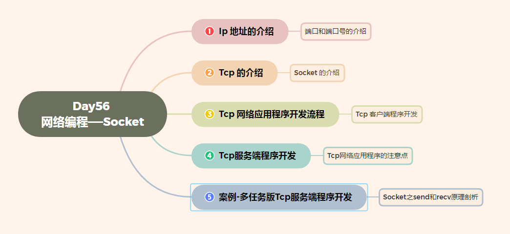
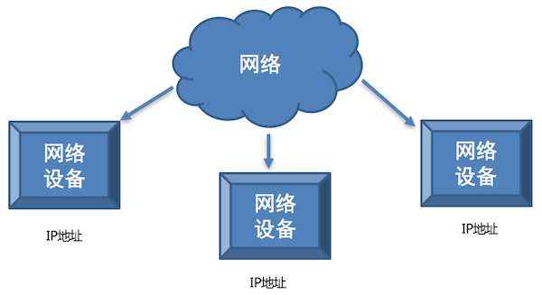
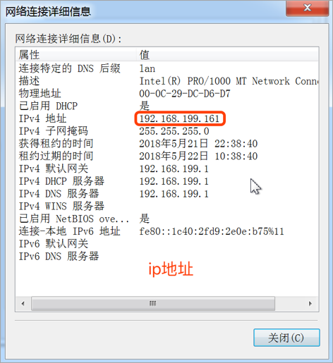
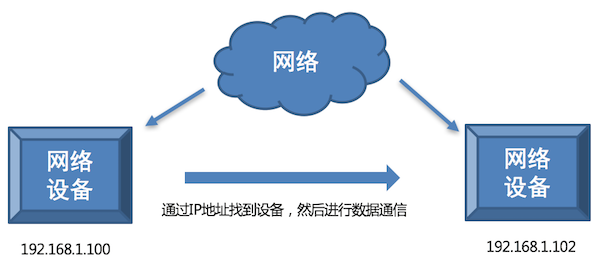
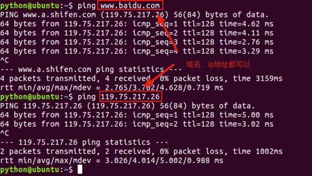
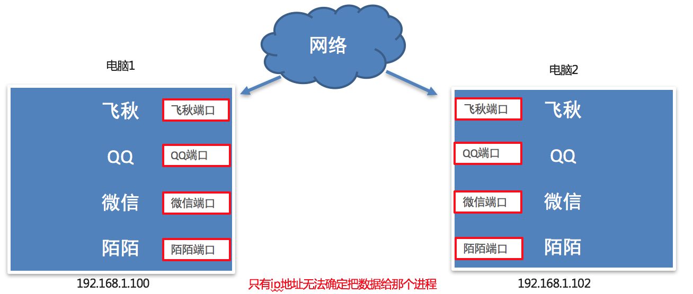
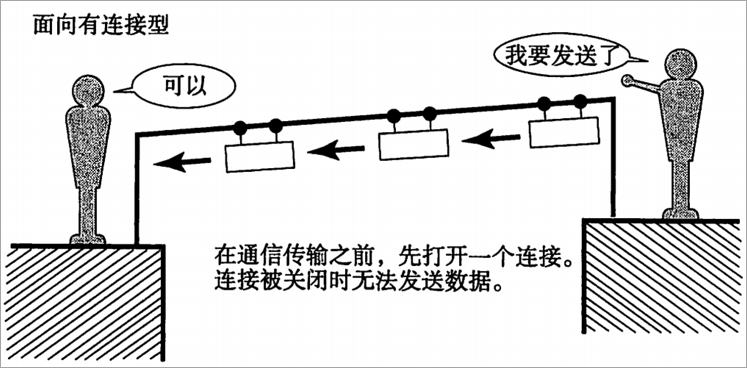
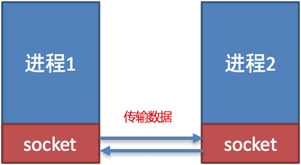
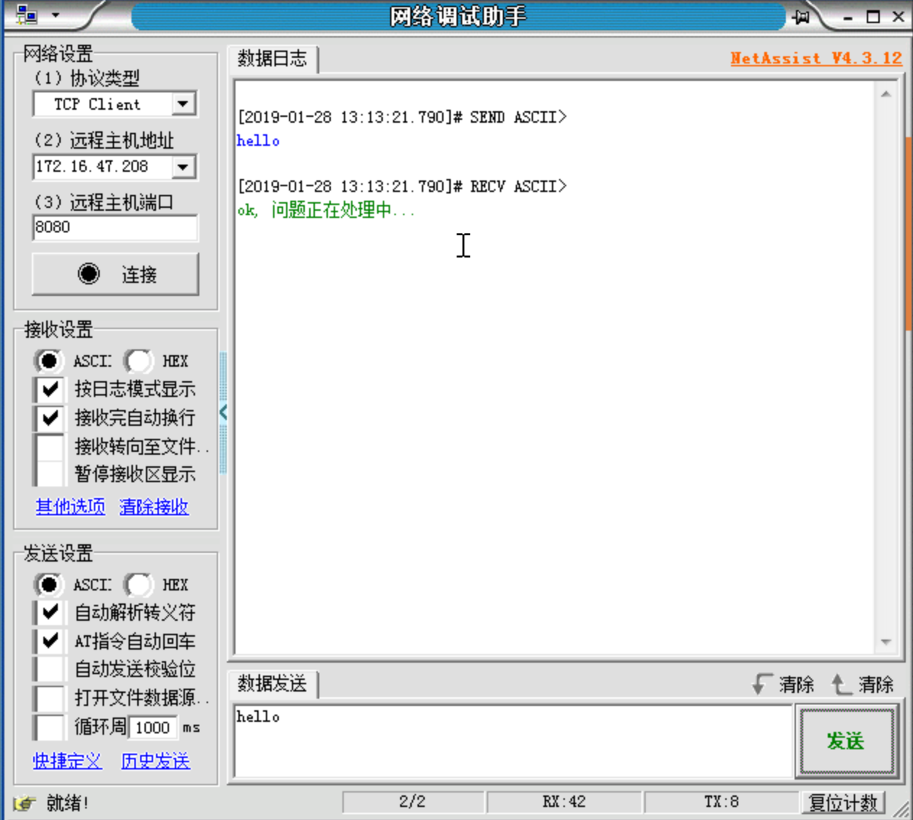
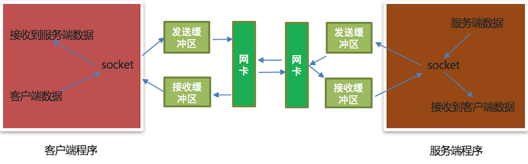

# Day56 网络编程——socket

[TOC]





# IP 地址的介绍

**学习目标**

- 能够说出IP 地址的作用

------

### 1. IP 地址的概念

IP 地址就是**标识网络中设备的一个地址**，好比现实生活中的家庭地址。

**网络中的设备效果图:**



### 2. IP 地址的表现形式



**说明:**

- IP 地址分为两类： **IPv4** 和 **IPv6**
- IPv4 是目前使用的ip地址
- IPv6 是未来使用的ip地址
- IPv4 是由点分十进制组成
- IPv6 是由冒号十六进制组成

#### 2. IP 地址的作用

IP 地址的作用是**标识网络中唯一的一台设备的**，也就是说通过IP地址能够找到网络中某台设备。

**IP地址作用效果图:**



### 3. 查看 IP 地址

- Linux 和 mac OS 使用 **ifconfig** 这个命令
- Windows 使用 **ipconfig** 这个命令

**说明:**

**ifconfig** 和 **ipconfig** 都是查看网卡信息的，网卡信息中包括这个设备对应的IP地址


说明:

- 192.168.1.107是设备在网络中的IP地址
- 127.0.0.1表示本机地址，提示：如果和自己的电脑通信就可以使用该地址。
- 127.0.0.1该地址对应的域名是**localhost**，**域名是 ip 地址的别名**，通过域名能解析出一个对应的ip地址。

### 4. 检查网络是否正常

- 检查网络是否正常使用 ping 命令

**检查网络是否正常效果图**



**说明:**

- ping www.baidu.com 检查是否能上公网
- ping 当前局域网的ip地址 检查是否在同一个局域网内
- ping 127.0.0.1 检查本地网卡是否正常

### 3. 小结

- IP 地址的作用是标识网络中唯一的一台设备的
- IP 地址的表现形式分为: IPv4 和 IPv6
- 查看网卡信息：ifconfig
- 检查网络： ping


# 端口和端口号的介绍

**学习目标**

- 能够说出端口和端口号的作用

------

### 1. 问题思考

不同电脑上的飞秋之间进行数据通信，它是如何保证把数据给飞秋而不是给其它软件呢?

**其实，每运行一个网络程序都会有一个端口，想要给对应的程序发送数据，找到对应的端口即可。**

**端口效果图:**



### 2. 什么是端口

**端口是传输数据的通道**，好比教室的门，**是数据传输必经之路**。

那么如何准确的找到对应的端口呢?

**其实，每一个端口都会有一个对应的端口号，好比每个教室的门都有一个门牌号，想要找到端口通过端口号即可。**

**端口号效果图:**


### 3. 什么端口号

操作系统为了统一管理这么多端口，**就对端口进行了编号**，这就是端口号，**端口号其实就是一个数字**，好比我们现实生活中的门牌号,

端口号有65536个。

那么最终飞秋之间进行数据通信的流程是这样的，**通过ip地址找到对应的设备，通过端口号找到对应的端口，然后通过端口把数据传输给应用程序**。

**最终通信流程效果图:**


### 4. 端口和端口号的关系

端口号可以标识唯一的一个端口。

### 5. 端口号的分类

- 知名端口号
- 动态端口号

**知名端口号:**

知名端口号是指**众所周知的端口号，范围从0到1023。**

- 这些端口号一般固定分配给一些服务，比如21端口分配给FTP(文件传输协议)服务，25端口分配给SMTP（简单邮件传输协议）服务，80端口分配给HTTP服务。

**动态端口号:**

一般程序员**开发应用程序使用端口号称为动态端口号, 范围是从1024到65535。**

- 如果程序员开发的程序没有设置端口号，操作系统会在动态端口号这个范围内随机生成一个给开发的应用程序使用。
- 当运行一个程序默认会有一个端口号，当这个程序退出时，所占用的这个端口号就会被释放。

### 5. 小结

- 端口的作用就是**给运行的应用程序提供传输数据的通道**。

- 端口号的作用是**用来区分和管理不同端口的，通过端口号能找到唯一个的一个端口**。

- 端口号可以分为两类：

   

  知名端口号

   

  和

   

  动态端口号

  - 知名端口号的范围是0到1023
  - 动态端口号的范围是1024到65535

  

# TCP 的介绍

**学习目标**

- 能够说出TCP 的特点

------

### 1. 网络应用程序之间的通信流程

之前我们学习了 IP 地址和端口号，通过 IP 地址能够找到对应的设备，然后再通过端口号找到对应的端口，再通过端口把数据传输给应用程序，**这里要注意，数据不能随便发送，在发送之前还需要选择一个对应的传输协议，保证程序之间按照指定的传输规则进行数据的通信，** 而这个传输协议就是我们今天学习的 TCP。

### 2. TCP 的概念

TCP 的英文全拼(Transmission Control Protocol)简称**传输控制协议**，它是一种**面向连接的、可靠的、基于字节流的传输层通信协议**。

**面向连接的效果图:**



**TCP 通信步骤:**

1. 创建连接
2. 传输数据
3. 关闭连接

**说明:**

TCP 通信模型相当于生活中的’打电话‘，在通信开始之前，一定要先建立好连接，才能发送数据，通信结束要关闭连接。


### 3. TCP 的特点

1. 面向连接
   - 通信双方必须先建立好连接才能进行数据的传输，数据传输完成后，双方必须断开此连接，以释放系统资源。
2. 可靠传输
   - TCP 采用发送应答机制
   - 超时重传
   - 错误校验
   - 流量控制和阻塞管理

### 4. 总结

TCP 是一个**稳定、可靠的传输协议，常用于对数据进行准确无误的传输，比如: 文件下载，浏览器上网**。

# socket 的介绍

**学习目标**

- 能够说出 socket 的作用

------

### 1. 问题思考

到目前为止我们学习了 ip 地址和端口号还有 tcp 传输协议，为了保证数据的完整性和可靠性我们使用 tcp 传输协议进行数据的传输，为了能够找到对应设备我们需要使用 ip 地址，为了区别某个端口的应用程序接收数据我们需要使用端口号，那么通信数据是如何完成传输的呢？

使用 **socket** 来完成

### 2. socket 的概念

socket (简称 套接字) 是**进程之间通信一个工具**，好比现实生活中的**插座**，所有的家用电器要想工作都是基于插座进行，**进程之间想要进行网络通信需要基于这个 socket**。

**插座效果图:**


**socket 效果图:**



### 3. socket 的作用

负责**进程之间的网络数据传输**，好比数据的搬运工。

### 4. socket 使用场景

不夸张的说，只要跟**网络相关的应用程序或者软件都使用到了 socket** 。


### 5. 小结

进程之间**网络数据的传输**可以通过 **socket** 来完成， **socket 就是进程间网络数据通信的工具。**

# TCP 网络应用程序开发流程

**学习目标**

- 能够知道TCP客户端程序的开发流程

------

### 1. TCP 网络应用程序开发流程的介绍

TCP 网络应用程序开发分为:

- TCP 客户端程序开发
- TCP 服务端程序开发

**说明:**

客户端程序是指运行在**用户设备上的程序** 服务端程序是指运行在**服务器设备上的程序**，专门为客户端提供数据服务。

### 2. TCP 客户端程序开发流程的介绍


**步骤说明:**

1. 创建客户端套接字对象
2. 和服务端套接字建立连接
3. 发送数据
4. 接收数据
5. 关闭客户端套接字

### 3. TCP 服务端程序开发流程的介绍


**步骤说明:**

1. 创建服务端端套接字对象
2. 绑定端口号
3. 设置监听
4. 等待接受客户端的连接请求
5. 接收数据
6. 发送数据
7. 关闭套接字

### 4. 小结

1. TCP 网络应用程序开发分为**客户端程序开发**和**服务端程序开发**。
2. **主动发起建立连接请求的**是客户端程序
3. **等待接受连接请求的**是服务端程序

# TCP 客户端程序开发

**学习目标**

- 能够写出 TCP 客户端应用程序发送和接收消息

------

### 1. 开发 TCP 客户端程序开发步骤回顾

1. 创建客户端套接字对象
2. 和服务端套接字建立连接
3. 发送数据
4. 接收数据
5. 关闭客户端套接字

### 2. socket 类的介绍

导入 socket 模块 **import socket**

创建客户端 socket 对象 **socket.socket(AddressFamily, Type)**

**参数说明:**

- AddressFamily 表示IP地址类型, 分为TPv4和IPv6
- Type 表示传输协议类型

**方法说明:**

- connect((host, port)) 表示和服务端套接字建立连接, host是服务器ip地址，port是应用程序的端口号
- send(data) 表示发送数据，data是二进制数据
- recv(buffersize) 表示接收数据, buffersize是每次接收数据的长度

### 3. TCP 客户端程序开发示例代码

```py
import socket


if __name__ == '__main__':
    # 创建tcp客户端套接字
    # 1. AF_INET：表示ipv4
    # 2. SOCK_STREAM: tcp传输协议
    tcp_client_socket = socket.socket(socket.AF_INET, socket.SOCK_STREAM)
    # 和服务端应用程序建立连接
    tcp_client_socket.connect(("192.168.131.62", 8080))
    # 代码执行到此，说明连接建立成功
    # 准备发送的数据
    send_data = "你好服务端，我是客户端小黑!".encode("gbk")
    # 发送数据
    tcp_client_socket.send(send_data)
    # 接收数据, 这次接收的数据最大字节数是1024
    recv_data = tcp_client_socket.recv(1024)
    # 返回的直接是服务端程序发送的二进制数据
    print(recv_data)
    # 对数据进行解码
    recv_content = recv_data.decode("gbk")
    print("接收服务端的数据为:", recv_content)
    # 关闭套接字
    tcp_client_socket.close()
```

**执行结果:**

```py
b'hello'
接收服务端的数据为: hello
```

**说明**

1. str.encode(编码格式) 表示把字符串编码成为二进制
2. data.decode(编码格式) 表示把二进制解码成为字符串

**网络调试助手充当服务端程序:**


### 4. 小结

1. 导入socket模块
2. 创建TCP套接字‘socket’
   - 参数1: ‘AF_INET’, 表示IPv4地址类型
   - 参数2: ‘SOCK_STREAM’, 表示TCP传输协议类型
3. 发送数据‘send’
   - 参数1: 要发送的二进制数据， 注意: 字符串需要使用encode()方法进行编码
4. 接收数据‘recv’
   - 参数1: 表示每次接收数据的大小，单位是字节
5. 关闭套接字‘socket’表示通信完成

# TCP服务端程序开发

**学习目标**

- 能够写出TCP服务端应用程序接收和发送消息

------

### 1. 开发 TCP 服务端程序开发步骤回顾

1. 创建服务端端套接字对象
2. 绑定端口号
3. 设置监听
4. 等待接受客户端的连接请求
5. 接收数据
6. 发送数据
7. 关闭套接字

### 2. socket 类的介绍

导入 socket 模块
**import socket**

创建服务端 socket 对象
**socket.socket(AddressFamily, Type)**

**参数说明:**

- AddressFamily 表示IP地址类型, 分为TPv4和IPv6
- Type 表示传输协议类型

**方法说明:**

- bind((host, port)) 表示绑定端口号, host 是 ip 地址，port 是端口号，ip 地址一般不指定，表示本机的任何一个ip地址都可以。
- listen (backlog) 表示设置监听，backlog参数表示最大等待建立连接的个数。
- accept() 表示等待接受客户端的连接请求
- send(data) 表示发送数据，data 是二进制数据
- recv(buffersize) 表示接收数据, buffersize 是每次接收数据的长度

### 3. TCP 服务端程序开发示例代码

```py
import socket

if __name__ == '__main__':
    # 创建tcp服务端套接字
    tcp_server_socket = socket.socket(socket.AF_INET, socket.SOCK_STREAM)
    # 设置端口号复用，让程序退出端口号立即释放
    tcp_server_socket.setsockopt(socket.SOL_SOCKET, socket.SO_REUSEADDR, True) 
    # 给程序绑定端口号
    tcp_server_socket.bind(("", 8989))
    # 设置监听
    # 128:最大等待建立连接的个数， 提示： 目前是单任务的服务端，同一时刻只能服务与一个客户端，后续使用多任务能够让服务端同时服务与多个客户端，
    # 不需要让客户端进行等待建立连接
    # listen后的这个套接字只负责接收客户端连接请求，不能收发消息，收发消息使用返回的这个新套接字来完成
    tcp_server_socket.listen(128)
    # 等待客户端建立连接的请求, 只有客户端和服务端建立连接成功代码才会解阻塞，代码才能继续往下执行
    # 1. 专门和客户端通信的套接字： service_client_socket
    # 2. 客户端的ip地址和端口号： ip_port
    service_client_socket, ip_port = tcp_server_socket.accept()
    # 代码执行到此说明连接建立成功
    print("客户端的ip地址和端口号:", ip_port)
    # 接收客户端发送的数据, 这次接收数据的最大字节数是1024
    recv_data = service_client_socket.recv(1024)
    # 获取数据的长度
    recv_data_length = len(recv_data)
    print("接收数据的长度为:", recv_data_length)
    # 对二进制数据进行解码
    recv_content = recv_data.decode("gbk")
    print("接收客户端的数据为:", recv_content)
    # 准备发送的数据
    send_data = "ok, 问题正在处理中...".encode("gbk")
    # 发送数据给客户端
    service_client_socket.send(send_data)
    # 关闭服务与客户端的套接字， 终止和客户端通信的服务
    service_client_socket.close()
    # 关闭服务端的套接字, 终止和客户端提供建立连接请求的服务
    tcp_server_socket.close()
```

**执行结果:**

```py
客户端的ip地址和端口号: ('172.16.47.209', 52472)
接收数据的长度为: 5
接收客户端的数据为: hello
```

**说明:**

当客户端和服务端建立连接后，**服务端程序退出后端口号不会立即释放，需要等待大概1-2分钟。**

解决办法有两种:

1. 更换服务端端口号
2. 设置端口号复用(推荐大家使用)，也就是说让服务端程序退出后端口号立即释放。

设置端口号复用的代码如下:

```py
# 参数1: 表示当前套接字
# 参数2: 设置端口号复用选项
# 参数3: 设置端口号复用选项对应的值
tcp_server_socket.setsockopt(socket.SOL_SOCKET, socket.SO_REUSEADDR, True)
```

**网络调试助手充当客户端程序:**



### 4. 小结

1. 导入socket模块
2. 创建TCP套接字‘socket’
   - 参数1: ‘AF_INET’, 表示IPv4地址类型
   - 参数2: ‘SOCK_STREAM’, 表示TCP传输协议类型
3. 绑定端口号‘bind’
   - 参数: 元组, 比如:(ip地址, 端口号)
4. 设置监听‘listen’
   - 参数: 最大等待建立连接的个数
5. 等待接受客户端的连接请求‘accept’
6. 发送数据‘send’
   - 参数: 要发送的二进制数据， 注意: 字符串需要使用encode()方法进行编码
7. 接收数据‘recv’
   - 参数: 表示每次接收数据的大小，单位是字节，注意: 解码成字符串使用decode()方法
8. 关闭套接字‘socket’表示通信完成

# TCP网络应用程序的注意点

**学习目标**

- 能够说出开发TCP网络应用程序的注意点

------

### 1. TCP网络应用程序的注意点介绍

1. 当 TCP 客户端程序想要和 TCP 服务端程序进行通信的时候必须要先**建立连接**
2. TCP 客户端程序一般不需要绑定端口号，因为客户端是主动发起建立连接的。
3. **TCP 服务端程序必须绑定端口号**，否则客户端找不到这个 TCP 服务端程序。
4. listen 后的套接字是被动套接字，**只负责接收新的客户端的连接请求，不能收发消息。**
5. 当 TCP 客户端程序和 TCP 服务端程序连接成功后， TCP 服务器端程序会产生一个**新的套接字**，收发客户端消息使用该套接字。
6. **关闭 accept 返回的套接字意味着和这个客户端已经通信完毕**。
7. **关闭 listen 后的套接字意味着服务端的套接字关闭了，会导致新的客户端不能连接服务端，但是之前已经接成功的客户端还能正常通信。**
8. **当客户端的套接字调用 close 后，服务器端的 recv 会解阻塞，返回的数据长度为0**，服务端可以通过返回数据的长度来判断客户端是否已经下线，反之**服务端关闭套接字，客户端的 recv 也会解阻塞，返回的数据长度也为0**。

# 案例-多任务版TCP服务端程序开发

**学习目标**

- 能够说出多任务版TCP服务端程序的实现过程

------

### 1. 需求

目前我们开发的TCP服务端程序只能服务于一个客户端，如何开发一个多任务版的TCP服务端程序能够服务于多个客户端呢?

完成多任务，可以使用**线程**，比进程更加节省内存资源。

### 2. 具体实现步骤

1. 编写一个TCP服务端程序，循环等待接受客户端的连接请求
2. 当客户端和服务端建立连接成功，创建子线程，使用子线程专门处理客户端的请求，防止主线程阻塞
3. 把创建的子线程设置成为守护主线程，防止主线程无法退出。

### 3. 多任务版TCP服务端程序的示例代码:

```py
import socket
import threading


# 处理客户端的请求操作
def handle_client_request(service_client_socket, ip_port):
    # 循环接收客户端发送的数据
    while True:
        # 接收客户端发送的数据
        recv_data = service_client_socket.recv(1024)
        # 容器类型判断是否有数据可以直接使用if语句进行判断，如果容器类型里面有数据表示条件成立，否则条件失败
        # 容器类型: 列表、字典、元组、字符串、set、range、二进制数据
        if recv_data:
            print(recv_data.decode("gbk"), ip_port)
            # 回复
            service_client_socket.send("ok，问题正在处理中...".encode("gbk"))

        else:
            print("客户端下线了:", ip_port)
            break
    # 终止和客户端进行通信
    service_client_socket.close()


if __name__ == '__main__':
    # 创建tcp服务端套接字
    tcp_server_socket = socket.socket(socket.AF_INET, socket.SOCK_STREAM)
    # 设置端口号复用，让程序退出端口号立即释放
    tcp_server_socket.setsockopt(socket.SOL_SOCKET, socket.SO_REUSEADDR, True)
    # 绑定端口号
    tcp_server_socket.bind(("", 9090))
    # 设置监听, listen后的套接字是被动套接字，只负责接收客户端的连接请求
    tcp_server_socket.listen(128)
    # 循环等待接收客户端的连接请求
    while True:
        # 等待接收客户端的连接请求
        service_client_socket, ip_port = tcp_server_socket.accept()
        print("客户端连接成功:", ip_port)
        # 当客户端和服务端建立连接成功以后，需要创建一个子线程，不同子线程负责接收不同客户端的消息
        sub_thread = threading.Thread(target=handle_client_request, args=(service_client_socket, ip_port))
        # 设置守护主线程
        sub_thread.setDaemon(True)
        # 启动子线程
        sub_thread.start()


    # tcp服务端套接字可以不需要关闭，因为服务端程序需要一直运行
    # tcp_server_socket.close()
```

**执行结果:**

```py
客户端连接成功: ('172.16.47.209', 51528)
客户端连接成功: ('172.16.47.209', 51714)
hello1 ('172.16.47.209', 51528)
hello2 ('172.16.47.209', 51714)
```

### 4. 小结

1. 编写一个TCP服务端程序，循环等待接受客户端的连接请求

   ```py
    while True:
        service_client_socket, ip_port = tcp_server_socket.accept()
   ```

2. 当客户端和服务端建立连接成功，创建子线程，使用子线程专门处理客户端的请求，防止主线程阻塞

   ```py
    while True:
        service_client_socket, ip_port = tcp_server_socket.accept() 
        sub_thread = threading.Thread(target=handle_client_request, args=(service_client_socket, ip_port))
        sub_thread.start()
   ```

3. 把创建的子线程设置成为守护主线程，防止主线程无法退出。

   ```Python
    while True:
        service_client_socket, ip_port = tcp_server_socket.accept() 
        sub_thread = threading.Thread(target=handle_client_request, args=(service_client_socket, ip_port))
        sub_thread.setDaemon(True) 
        sub_thread.start()
   ```


# socket之send和recv原理剖析

**学习目标**

- 能够知道send和recv的底层工作原理

------

### 1. 认识TCP socket的发送和接收缓冲区

当创建一个TCP socket对象的时候会有一个**发送缓冲区**和一个**接收缓冲区**，**这个发送和接收缓冲区指的就是内存中的一片空间。**

### 2. send原理剖析

send是不是直接把数据发给服务端?

不是，要想发数据，必须得**通过网卡发送数据**，应用程序是无法直接通过网卡发送数据的，它需要调用操作系统接口，也就是说，应用程序把发送的数据先写入到**发送缓冲区**(内存中的一片空间)，再**由操作系统控制网卡把发送缓冲区的数据发送给服务端网卡** 。

### 3. recv原理剖析

recv是不是直接从客户端接收数据?

不是，**应用软件是无法直接通过网卡接收数据的**，它需要调用操作系统接口，**由操作系统通过网卡接收数据**，把接收的数据**写入到接收缓冲区**(内存中的一片空间），应用程序**再从接收缓存区获取客户端发送的数据**。

### 4. send和recv原理剖析图



**说明:**

- 发送数据是发送到发送缓冲区
- 接收数据是从接收缓冲区 获取

### 5. 小结

不管是recv还是send都不是直接接收到对方的数据和发送数据到对方，**发送数据会写入到发送缓冲区，接收数据是从接收缓冲区来读取，发送数据和接收数据最终是由操作系统控制网卡来完成。**


-16951939207834.jpg)


