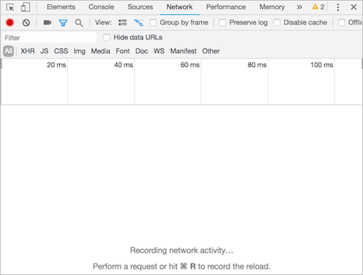

# Day57 HTTP协议和静态Web服务器

[TOC]


# HTTP 协议

**学习目标**

- 能够知道 HTTP 协议的作用

------

### 1. HTTP 协议的介绍

HTTP 协议的全称是(HyperText Transfer Protocol)，翻译过来就是**超文本传输协议**。

超文本是超级文本的缩写，是指超越文本限制或者超链接，比如:图片、音乐、视频、超链接等等都属于超文本。

HTTP 协议的制作者是**蒂姆·伯纳斯-李**，1991年设计出来的，**HTTP 协议设计之前目的是传输网页数据的，现在允许传输任意类型的数据**。

**传输 HTTP 协议格式的数据是基于 TCP 传输协议的，发送数据之前需要先建立连接。**

### 2. HTTP 协议的作用

它**规定了浏览器和 Web 服务器通信数据的格式，也就是说浏览器和web服务器通信需要使用http协议**。

### 3. 浏览器访问web服务器的通信过程

**通信效果图:**


### 4. 小结

- HTTP协议是一个超文本传输协议
- HTTP协议是一个基于TCP传输协议传输数据的
- HTTP协议规定了浏览器和 Web 服务器通信数据的格式

# URL

**学习目标**

- 能够知道URL的组成部分

------

### 1. URL的概念

URL的英文全拼是(Uniform Resoure Locator),表达的意思是统一资源定位符，通俗理解就是网络资源地址，也就是我们常说的网址。

### 2. URL的组成

**URL的样子:**

https://news.163.com/18/1122/10/E178J2O4000189FH.html

**URL的组成部分:**

1. **协议部分**: https://、http://、ftp://
2. **域名部分**: news.163.com
3. **资源路径部分**: /18/1122/10/E178J2O4000189FH.html

**域名:**

域名就是**IP地址的别名**，它是用点进行分割使用英文字母和数字组成的名字，**使用域名目的就是方便的记住某台主机IP地址**。

**URL的扩展:**

https://news.163.com/hello.html?page=1&count=10

- **查询参数部分**: ?page=1&count=10

**参数说明:**

- ? 后面的 page 表示第一个参数，后面的参数都使用 & 进行连接

### 3. 小结

- URL就是网络资源的地址，简称网址，通过URL能够找到网络中对应的资源数据。
- URL组成部分
  1. 协议部分
  2. 域名部分
  3. 资源路径部分
  4. 查询参数部分 [可选]

# 查看HTTP协议的通信过程

**学习目标**

- 能够使用谷歌浏览器的开发者工具查看HTTP协议的通信过程

------

### 1. 谷歌浏览器开发者工具的使用

首先需要安装Google Chrome浏览器，然后Windows和Linux平台按**F12**调出开发者工具, mac OS选择 视图 -> 开发者 -> 开发者工具或者直接使用 **alt+command+i** 这个快捷键，还有一个多平台通用的操作就是在**网页右击选择检查**。

**开发者工具的效果图:**



**开发者工具的标签选项说明:**

- 元素（Elements）：用于查看或修改HTML标签
- 控制台（Console）：执行js代码
- 源代码（Sources）：查看静态资源文件，断点调试JS代码
- 网络（Network）：查看http协议的通信过程

**开发者工具使用效果图:**


**开发者工具的使用说明:**

1. 点击Network标签选项
2. 在浏览器的地址栏输入百度的网址，就能看到请求百度首页的http的通信过程
3. **这里的每项记录都是请求+响应的一次过程**

### 2. 查看HTTP协议的通信过程

**查看http请求信息效果图:**

 

**查看http响应信息效果图:**

 

### 3. 小结

- 谷歌浏览器的开发者工具是查看http协议的通信过程利器，通过Network标签选项可以查看每一次的请求和响应的通信过程，调出开发者工具的通用方法是在网页右击选择检查。
- 开发者工具的Headers选项总共有三部分组成:
  1. General: 主要信息
  2. Response Headers: 响应头
  3. Request Headers: 请求头
- Response选项是查看响应体信息的

# HTTP 请求报文

**学习目标**

- 能够知道HTTP请求报文的结构

------

### 1. HTTP 请求报文介绍

**HTTP最常见的请求报文有两种:**

1. GET 方式的请求报文
2. POST 方式的请求报文

**说明:**

- GET: 获取web服务器数据
- POST: 向web服务器提交数据

### 2. HTTP GET 请求报文分析

**HTTP GET 请求报文效果图:**


**GET 请求报文说明:**

```http
---- 请求行 ----
GET / HTTP/1.1  # GET请求方式 请求资源路径 HTTP协议版本
---- 请求头 -----
Host: www.itcast.cn  # 服务器的主机地址和端口号,默认是80
Connection: keep-alive # 和服务端保持长连接
Upgrade-Insecure-Requests: 1 # 让浏览器升级不安全请求，使用https请求
User-Agent: Mozilla/5.0 (Macintosh; Intel Mac OS X 10_12_4) AppleWebKit/537.36 (KHTML, like Gecko) Chrome/69.0.3497.100 Safari/537.36  # 用户代理，也就是客户端的名称
Accept:text/html,application/xhtml+xml,application/xml;q=0.9,image/webp,image/apng,*/*;q=0.8 # 可接受的数据类型
Accept-Encoding: gzip, deflate # 可接受的压缩格式
Accept-Language: zh-CN,zh;q=0.9 #可接受的语言
Cookie: pgv_pvi=1246921728; # 登录用户的身份标识

---- 空行 ----
```

**GET 请求原始报文说明:**

```http
GET / HTTP/1.1\r\n
Host: www.itcast.cn\r\n  
Connection: keep-alive\r\n
Upgrade-Insecure-Requests: 1\r\n
User-Agent: Mozilla/5.0 (Macintosh; Intel Mac OS X 10_12_4) AppleWebKit/537.36 (KHTML, like Gecko) Chrome/69.0.3497.100 Safari/537.36\r\n
Accept: text/html,application/xhtml+xml,application/xml;q=0.9,image/webp,image/apng,*/*;q=0.8\r\n
Accept-Encoding: gzip, deflate\r\n
Accept-Language: zh-CN,zh;q=0.9\r\n
Cookie: pgv_pvi=1246921728; \r\n
\r\n  (请求头信息后面还有一个单独的’\r\n’不能省略)
```

**说明：**

- 每项数据之间使用:**\r\n**

### 3. HTTP POST 请求报文分析

**HTTP POST 请求报文效果图:**


**请求体效果图:**


**POST 请求报文说明:**

```http
---- 请求行 ----
POST /xmweb?host=mail.itcast.cn&_t=1542884567319 HTTP/1.1 # POST请求方式 请求资源路径 HTTP协议版本
---- 请求头 ----
Host: mail.itcast.cn # 服务器的主机地址和端口号,默认是80
Connection: keep-alive # 和服务端保持长连接
Content-Type: application/x-www-form-urlencoded  # 告诉服务端请求的数据类型
User-Agent: Mozilla/5.0 (Macintosh; Intel Mac OS X 10_12_4) AppleWebKit/537.36 (KHTML, like Gecko) Chrome/69.0.3497.100 Safari/537.36 # 客户端的名称
---- 空行 ----
---- 请求体 ----
username=hello&pass=hello # 请求参数
```

**POST 请求原始报文说明:**

```http
POST /xmweb?host=mail.itcast.cn&_t=1542884567319 HTTP/1.1\r\n
Host: mail.itcast.cn\r\n
Connection: keep-alive\r\n
Content-Type: application/x-www-form-urlencoded\r\n
User-Agent: Mozilla/5.0 (Macintosh; Intel Mac OS X 10_12_4) AppleWebKit/537.36 (KHTML, like Gecko) Chrome/69.0.3497.100 Safari/537.36\r\n
\r\n(请求头信息后面还有一个单独的’\r\n’不能省略)
username=hello&pass=hello
```

**说明：**

- 每项数据之间使用:**\r\n**

### 4. 小结

- 一个HTTP请求报文可以由**请求行、请求头、空行和请求体**4个部分组成。
- 请求行是由三部分组成:
  1. **请求方式**
  2. **请求资源路径**
  3. **HTTP协议版本**
- **GET方式的请求报文没有请求体，只有请求行、请求头、空行组成**。
- **POST方式的请求报文可以有请求行、请求头、空行、请求体四部分组成，注意:POST方式可以允许没有请求体，但是这种格式很少见**。

**GET和POST请求对比效果图:**


# HTTP响应报文

**学习目标**

- 能够知道HTTP响应报文的结构

------

### 1. HTTP响应报文分析

**HTTP 响应报文效果图:**


**响应报文说明:**

```http
--- 响应行/状态行 ---
HTTP/1.1 200 OK # HTTP协议版本 状态码 状态描述
--- 响应头 ---
Server: Tengine # 服务器名称
Content-Type: text/html; charset=UTF-8 # 内容类型
Transfer-Encoding: chunked # 发送给客户端内容不确定内容长度，发送结束的标记是0\r\n, Content-Length表示服务端确定发送给客户端的内容大小，但是二者只能用其一。
Connection: keep-alive # 和客户端保持长连接
Date: Fri, 23 Nov 2018 02:01:05 GMT # 服务端的响应时间
--- 空行 ---
--- 响应体 ---
<!DOCTYPE html><html lang=“en”> …</html> # 响应给客户端的数据
```

**原始响应报文说明:**

```http
HTTP/1.1 200 OK\r\n
Server: Tengine\r\n
Content-Type: text/html; charset=UTF-8\r\n
Transfer-Encoding: chunked\r\n
Connection: keep-alive\r\n
Date: Fri, 23 Nov 2018 02:01:05 GMT\r\n
\r\n(响应头信息后面还有一个单独的’\r\n’不能省略)
<!DOCTYPE html><html lang=“en”> …</html>
```

**说明:**

每项数据之间使用:**\r\n**

### 2. HTTP 状态码介绍

HTTP 状态码是**用于表示web服务器响应状态的3位数字代码**。

| 状态码 | 说明                             |
| :----- | :------------------------------- |
| 200    | 请求成功                         |
| 307    | 重定向                           |
| 400    | 错误的请求，请求地址或者参数有误 |
| 404    | 请求资源在服务器不存在           |
| 500    | 服务器内部源代码出现错误         |

### 3. 小结

- 一个HTTP响应报文是由**响应行、响应头、空行和响应体**4个部分组成。 
- 响应行是由三部分组成：**HTTP协议版本 状态码 状态描述**，最常见的状态码是200

# 搭建Python自带静态Web服务器

**学习目标**

- 能够知道搭建Python自带Web服务器

------

### 1. 静态Web服务器是什么？

可以**为发出请求的浏览器提供静态文档的程序**。

平时我们浏览百度新闻数据的时候，**每天的新闻数据都会发生变化，那访问的这个页面就是动态的**，而我们开发的是**静态的，页面的数据不会发生变化**。

### 2. 如何搭建Python自带的静态Web服务器

搭建Python自带的静态Web服务器使用 **python3 -m http.server 端口号**, 效果图如下:


**-m选项说明:**

-m表示**运行包里面的模块**，执行这个命令的时候，需要进入你**自己指定静态文件的目录**，然后通过浏览器就能访问对应的 html文件了，这样一个静态的web服务器就搭建好了。

### 3. 访问搭建的静态Web服务器

通过浏览器访问搭建的静态Web服务器，效果图如下:


### 4. 查看浏览器和搭建的静态Web服务器的通信过程

查看http的通信过程,效果图如下:


### 5. 小结

- 静态Web服务器是为发出请求的浏览器提供静态文档的程序，
- 搭建Python自带的Web服务器使用python3 –m http.server 端口号 这个命令即可，端口号不指定默认是8000

# 静态Web服务器-返回固定页面数据

**学习目标**

- 能够写出组装固定页面数据的响应报文

------

### 1. 开发自己的静态Web服务器

**实现步骤:**

1. 编写一个TCP服务端程序
2. 获取浏览器发送的http请求报文数据
3. 读取固定页面数据，把页面数据组装成HTTP响应报文数据发送给浏览器。
4. HTTP响应报文数据发送完成以后，关闭服务于客户端的套接字。

### 2. 静态Web服务器-返回固定页面数据的示例代码

```py
import socket


if __name__ == '__main__':
    # 创建tcp服务端套接字
    tcp_server_socket = socket.socket(socket.AF_INET, socket.SOCK_STREAM)
    # 设置端口号复用, 程序退出端口立即释放
    tcp_server_socket.setsockopt(socket.SOL_SOCKET, socket.SO_REUSEADDR, True)
    # 绑定端口号
    tcp_server_socket.bind(("", 9000))
    # 设置监听
    tcp_server_socket.listen(128)
    while True:
        # 等待接受客户端的连接请求
        new_socket, ip_port = tcp_server_socket.accept()
        # 代码执行到此，说明连接建立成功
        recv_client_data = new_socket.recv(4096)
        # 对二进制数据进行解码
        recv_client_content = recv_client_data.decode("utf-8")
        print(recv_client_content)

        with open("static/index.html", "rb") as file:
            # 读取文件数据
            file_data = file.read()


        # 响应行
        response_line = "HTTP/1.1 200 OK\r\n"
        # 响应头
        response_header = "Server: PWS1.0\r\n"

        # 响应体
        response_body = file_data

        # 拼接响应报文
        response_data = (response_line + response_header + "\r\n").encode("utf-8") + response_body
        # 发送数据
        new_socket.send(response_data)

        # 关闭服务与客户端的套接字
        new_socket.close()
```

### 3. 小结

1. 编写一个TCP服务端程序

   ```py
   tcp_server_socket = socket.socket(socket.AF_INET, socket.SOCK_STREAM)
   # 循环接受客户端的连接请求
   while True:
       conn_socket, ip_port = tcp_server_socket.accept()
   ```

2. 获取浏览器发送的http请求报文数据

   ```py
   client_request_data = conn_socket.recv(4096)
   ```

3. 读取固定页面数据，把页面数据组装成HTTP响应报文数据发送给浏览器。

   ```py
   response_data = (response_line + response_header + "\r\n").encode("utf-8") + response_body
   conn_socket.send(response_data)
   ```

4. HTTP响应报文数据发送完成以后，关闭服务于客户端的套接字。

   ```py
   conn_socket.close()
   ```

# 静态Web服务器-返回指定页面数据

**学习目标**

- 能够写出组装指定页面数据的响应报文

------

### 1. 静态Web服务器的问题


目前的Web服务器，不管用户访问什么页面，返回的都是固定页面的数据，接下来需要根据用户的请求返回指定页面的数据

**返回指定页面数据的实现步骤:**

1. 获取用户请求资源的路径
2. 根据请求资源的路径，读取指定文件的数据
3. 组装指定文件数据的响应报文，发送给浏览器
4. 判断请求的文件在服务端不存在，组装404状态的响应报文，发送给浏览器

### 2. 静态Web服务器-返回指定页面数据的示例代码

```py
import socket


def main():
    # 创建tcp服务端套接字
    tcp_server_socket = socket.socket(socket.AF_INET, socket.SOCK_STREAM)
    # 设置端口号复用, 程序退出端口立即释放
    tcp_server_socket.setsockopt(socket.SOL_SOCKET, socket.SO_REUSEADDR, True)
    # 绑定端口号
    tcp_server_socket.bind(("", 9000))
    # 设置监听
    tcp_server_socket.listen(128)
    while True:
        # 等待接受客户端的连接请求
        new_socket, ip_port = tcp_server_socket.accept()
        # 代码执行到此，说明连接建立成功
        recv_client_data = new_socket.recv(4096)
        if len(recv_client_data) == 0:
            print("关闭浏览器了")
            new_socket.close()
            return

        # 对二进制数据进行解码
        recv_client_content = recv_client_data.decode("utf-8")
        print(recv_client_content)
        # 根据指定字符串进行分割， 最大分割次数指定2
        request_list = recv_client_content.split(" ", maxsplit=2)

        # 获取请求资源路径
        request_path = request_list[1]
        print(request_path)

        # 判断请求的是否是根目录，如果条件成立，指定首页数据返回
        if request_path == "/":
            request_path = "/index.html"

        try:
            # 动态打开指定文件
            with open("static" + request_path, "rb") as file:
                # 读取文件数据
                file_data = file.read()
        except Exception as e:
            # 请求资源不存在，返回404数据
            # 响应行
            response_line = "HTTP/1.1 404 Not Found\r\n"
            # 响应头
            response_header = "Server: PWS1.0\r\n"
            with open("static/error.html", "rb") as file:
                file_data = file.read()
            # 响应体
            response_body = file_data

            # 拼接响应报文
            response_data = (response_line + response_header + "\r\n").encode("utf-8") + response_body
            # 发送数据
            new_socket.send(response_data)
        else:
            # 响应行
            response_line = "HTTP/1.1 200 OK\r\n"
            # 响应头
            response_header = "Server: PWS1.0\r\n"

            # 响应体
            response_body = file_data

            # 拼接响应报文
            response_data = (response_line + response_header + "\r\n").encode("utf-8") + response_body
            # 发送数据
            new_socket.send(response_data)
        finally:
            # 关闭服务与客户端的套接字
            new_socket.close()

if __name__ == '__main__':
    main()
```

### 3. 小结

1. 获取用户请求资源的路径

   ```py
    request_list = client_request_conent.split(” ”,  maxsplit=2)
    request_path = request_list[1]
   ```

2. 根据请求资源的路径，读取请求指定文件的数据

   ```py
    with open("static" + request_path, "rb") as file:
    file_data = file.read()
   ```

3. 组装指定文件数据的响应报文，发送给浏览器

   ```py
    response_data = (response_line + response_header + "\r\n").encode("utf-8") + response_body
    conn_socket.send(response_data)
   ```

4. 判断请求的文件在服务端不存在，组装404状态的响应报文，发送给浏览器

   ```py
    try:
        # 打开指定文件,代码省略...
    except Exception as e:
        conn_socket.send(404响应报文数据)
   ```

# 静态Web服务器-多任务版

**学习目标**

- 能够写出多线程版的多任务web服务器程序

------

### 1. 静态Web服务器的问题

目前的Web服务器，不能支持多用户同时访问，只能一个一个的处理客户端的请求，那么如何开发多任务版的web服务器同时处理 多个客户端的请求?

可以使用**多线程**，比进程更加节省内存资源。

**多任务版web服务器程序的实现步骤:**

1. 当客户端和服务端建立连接成功，创建子线程，使用子线程专门处理客户端的请求，防止主线程阻塞。
2. 把创建的子线程设置成为守护主线程，防止主线程无法退出。

### 2. 静态Web服务器-多任务版的示例代码

```py
import socket
import threading


# 处理客户端的请求
def handle_client_request(new_socket):
    # 代码执行到此，说明连接建立成功
    recv_client_data = new_socket.recv(4096)
    if len(recv_client_data) == 0:
        print("关闭浏览器了")
        new_socket.close()
        return

    # 对二进制数据进行解码
    recv_client_content = recv_client_data.decode("utf-8")
    print(recv_client_content)
    # 根据指定字符串进行分割， 最大分割次数指定2
    request_list = recv_client_content.split(" ", maxsplit=2)

    # 获取请求资源路径
    request_path = request_list[1]
    print(request_path)

    # 判断请求的是否是根目录，如果条件成立，指定首页数据返回
    if request_path == "/":
        request_path = "/index.html"

    try:
        # 动态打开指定文件
        with open("static" + request_path, "rb") as file:
            # 读取文件数据
            file_data = file.read()
    except Exception as e:
        # 请求资源不存在，返回404数据
        # 响应行
        response_line = "HTTP/1.1 404 Not Found\r\n"
        # 响应头
        response_header = "Server: PWS1.0\r\n"
        with open("static/error.html", "rb") as file:
            file_data = file.read()
        # 响应体
        response_body = file_data

        # 拼接响应报文
        response_data = (response_line + response_header + "\r\n").encode("utf-8") + response_body
        # 发送数据
        new_socket.send(response_data)
    else:
        # 响应行
        response_line = "HTTP/1.1 200 OK\r\n"
        # 响应头
        response_header = "Server: PWS1.0\r\n"

        # 响应体
        response_body = file_data

        # 拼接响应报文
        response_data = (response_line + response_header + "\r\n").encode("utf-8") + response_body
        # 发送数据
        new_socket.send(response_data)
    finally:
        # 关闭服务与客户端的套接字
        new_socket.close()


# 程序入口函数
def main():
    # 创建tcp服务端套接字
    tcp_server_socket = socket.socket(socket.AF_INET, socket.SOCK_STREAM)
    # 设置端口号复用, 程序退出端口立即释放
    tcp_server_socket.setsockopt(socket.SOL_SOCKET, socket.SO_REUSEADDR, True)
    # 绑定端口号
    tcp_server_socket.bind(("", 9000))
    # 设置监听
    tcp_server_socket.listen(128)

    while True:
        # 等待接受客户端的连接请求
        new_socket, ip_port = tcp_server_socket.accept()
        print(ip_port)
        # 当客户端和服务器建立连接程，创建子线程
        sub_thread = threading.Thread(target=handle_client_request, args=(new_socket,))
        # 设置守护主线程
        sub_thread.setDaemon(True)
        # 启动子线程执行对应的任务
        sub_thread.start()


if __name__ == '__main__':
    main()
```

### 3. 小结

1. 当客户端和服务端建立连接成功，创建子线程，使用子线程专门处理客户端的请求，防止主线程阻塞。

   ```py
    while True:
        conn_socket, ip_port = tcp_server_socket.accept()
        # 开辟子线程并执行对应的任务
        sub_thread = threading.Thread(target=handle_client_request, args=(conn_socket,))
   ```

2. 把创建的子线程设置成为守护主线程，防止主线程无法退出。

   ```py
    # 开辟子线程并执行对应的任务
    sub_thread = threading.Thread(target=handle_client_request, args=(conn_socket,))
    sub_thread.setDaemon(True) # 设置守护主线程
    sub_thread.start()
   ```

# 静态Web服务器-面向对象开发

**学习目标**

- 能够写出面向对象方式的多任务web服务器程序

------

### 1. 以面向对象的方式开发静态Web服务器

**实现步骤:**

1. 把提供服务的Web服务器抽象成一个类(HTTPWebServer)
2. 提供Web服务器的初始化方法，在初始化方法里面创建socket对象
3. 提供一个开启Web服务器的方法，让Web服务器处理客户端请求操作。

### 2. 静态Web服务器-面向对象开发的示例代码

```py
import socket
import threading


# 定义web服务器类
class HttpWebServer(object):
    def __init__(self):
        # 创建tcp服务端套接字
        tcp_server_socket = socket.socket(socket.AF_INET, socket.SOCK_STREAM)
        # 设置端口号复用, 程序退出端口立即释放
        tcp_server_socket.setsockopt(socket.SOL_SOCKET, socket.SO_REUSEADDR, True)
        # 绑定端口号
        tcp_server_socket.bind(("", 9000))
        # 设置监听
        tcp_server_socket.listen(128)
        # 保存创建成功的服务器套接字
        self.tcp_server_socket = tcp_server_socket

    # 处理客户端的请求
    @staticmethod
    def handle_client_request(new_socket):
        # 代码执行到此，说明连接建立成功
        recv_client_data = new_socket.recv(4096)
        if len(recv_client_data) == 0:
            print("关闭浏览器了")
            new_socket.close()
            return

        # 对二进制数据进行解码
        recv_client_content = recv_client_data.decode("utf-8")
        print(recv_client_content)
        # 根据指定字符串进行分割， 最大分割次数指定2
        request_list = recv_client_content.split(" ", maxsplit=2)

        # 获取请求资源路径
        request_path = request_list[1]
        print(request_path)

        # 判断请求的是否是根目录，如果条件成立，指定首页数据返回
        if request_path == "/":
            request_path = "/index.html"

        try:
            # 动态打开指定文件
            with open("static" + request_path, "rb") as file:
                # 读取文件数据
                file_data = file.read()
        except Exception as e:
            # 请求资源不存在，返回404数据
            # 响应行
            response_line = "HTTP/1.1 404 Not Found\r\n"
            # 响应头
            response_header = "Server: PWS1.0\r\n"
            with open("static/error.html", "rb") as file:
                file_data = file.read()
            # 响应体
            response_body = file_data

            # 拼接响应报文
            response_data = (response_line + response_header + "\r\n").encode("utf-8") + response_body
            # 发送数据
            new_socket.send(response_data)
        else:
            # 响应行
            response_line = "HTTP/1.1 200 OK\r\n"
            # 响应头
            response_header = "Server: PWS1.0\r\n"

            # 响应体
            response_body = file_data

            # 拼接响应报文
            response_data = (response_line + response_header + "\r\n").encode("utf-8") + response_body
            # 发送数据
            new_socket.send(response_data)
        finally:
            # 关闭服务与客户端的套接字
            new_socket.close()

    # 启动web服务器进行工作
    def start(self):
        while True:
            # 等待接受客户端的连接请求
            new_socket, ip_port = self.tcp_server_socket.accept()
            # 当客户端和服务器建立连接程，创建子线程
            sub_thread = threading.Thread(target=self.handle_client_request, args=(new_socket,))
            # 设置守护主线程
            sub_thread.setDaemon(True)
            # 启动子线程执行对应的任务
            sub_thread.start()


# 程序入口函数
def main():
    # 创建web服务器对象
    web_server = HttpWebServer()
    # 启动web服务器进行工作
    web_server.start()


if __name__ == '__main__':
    main()
```

### 3. 小结

1. 把提供服务的Web服务器抽象成一个类(HTTPWebServer)

   ```py
    class HttpWebServer(object):
   ```

2. 提供Web服务器的初始化方法，在初始化方法里面创建socket对象

   ```py
    def __init__(self):
    # 初始化服务端套接字，设置监听，代码省略..
   ```

3. 提供一个开启Web服务器的方法，让Web服务器处理客户端请求操作。

   ```py
    def start(self):
    while True:
        service_client_socket, ip_port = self.tcp_server_socket.accept()
        # 连接建立成功，开辟子线程处理客户端的请求
        sub_thread = threading.Thread(target=self.handle_client_request, args=(service_client_socket,))
        sub_thread.start()
   ```

# 静态Web服务器-命令行启动动态绑定端口号

**学习目标**

- 能够写出获取终端命令行参数动态绑定端口号的web服务器程序

### 1. 开发命令行启动动态绑定端口号的静态web服务器

**实现步骤:**

1. 获取执行python程序的终端命令行参数
2. 判断参数的类型，设置端口号必须是整型
3. 给Web服务器类的初始化方法添加一个端口号参数，用于绑定端口号

### 2. 静态Web服务器-命令行启动动态绑定端口号的示例代码

```py
import socket
import threading
import sys


# 定义web服务器类
class HttpWebServer(object):
    def __init__(self, port):
        # 创建tcp服务端套接字
        tcp_server_socket = socket.socket(socket.AF_INET, socket.SOCK_STREAM)
        # 设置端口号复用, 程序退出端口立即释放
        tcp_server_socket.setsockopt(socket.SOL_SOCKET, socket.SO_REUSEADDR, True)
        # 绑定端口号
        tcp_server_socket.bind(("", port))
        # 设置监听
        tcp_server_socket.listen(128)
        # 保存创建成功的服务器套接字
        self.tcp_server_socket = tcp_server_socket

    # 处理客户端的请求
    @staticmethod
    def handle_client_request(new_socket):
        # 代码执行到此，说明连接建立成功
        recv_client_data = new_socket.recv(4096)
        if len(recv_client_data) == 0:
            print("关闭浏览器了")
            new_socket.close()
            return

        # 对二进制数据进行解码
        recv_client_content = recv_client_data.decode("utf-8")
        print(recv_client_content)
        # 根据指定字符串进行分割， 最大分割次数指定2
        request_list = recv_client_content.split(" ", maxsplit=2)

        # 获取请求资源路径
        request_path = request_list[1]
        print(request_path)

        # 判断请求的是否是根目录，如果条件成立，指定首页数据返回
        if request_path == "/":
            request_path = "/index.html"

        try:
            # 动态打开指定文件
            with open("static" + request_path, "rb") as file:
                # 读取文件数据
                file_data = file.read()
        except Exception as e:
            # 请求资源不存在，返回404数据
            # 响应行
            response_line = "HTTP/1.1 404 Not Found\r\n"
            # 响应头
            response_header = "Server: PWS1.0\r\n"
            with open("static/error.html", "rb") as file:
                file_data = file.read()
            # 响应体
            response_body = file_data

            # 拼接响应报文
            response_data = (response_line + response_header + "\r\n").encode("utf-8") + response_body
            # 发送数据
            new_socket.send(response_data)
        else:
            # 响应行
            response_line = "HTTP/1.1 200 OK\r\n"
            # 响应头
            response_header = "Server: PWS1.0\r\n"

            # 响应体
            response_body = file_data

            # 拼接响应报文
            response_data = (response_line + response_header + "\r\n").encode("utf-8") + response_body
            # 发送数据
            new_socket.send(response_data)
        finally:
            # 关闭服务与客户端的套接字
            new_socket.close()

    # 启动web服务器进行工作
    def start(self):
        while True:
            # 等待接受客户端的连接请求
            new_socket, ip_port = self.tcp_server_socket.accept()
            # 当客户端和服务器建立连接程，创建子线程
            sub_thread = threading.Thread(target=self.handle_client_request, args=(new_socket,))
            # 设置守护主线程
            sub_thread.setDaemon(True)
            # 启动子线程执行对应的任务
            sub_thread.start()


# 程序入口函数
def main():

    print(sys.argv)
    # 判断命令行参数是否等于2,
    if len(sys.argv) != 2:
        print("执行命令如下: python3 xxx.py 8000")
        return

    # 判断字符串是否都是数字组成
    if not sys.argv[1].isdigit():
        print("执行命令如下: python3 xxx.py 8000")
        return

    # 获取终端命令行参数
    port = int(sys.argv[1])
    # 创建web服务器对象
    web_server = HttpWebServer(port)
    # 启动web服务器进行工作
    web_server.start()


if __name__ == '__main__':
    main()
```

### 3. 小结

1. 获取执行python程序的终端命令行参数

   ```py
    sys.argv
   ```

2. 判断参数的类型，设置端口号必须是整型

   ```py
    if not sys.argv[1].isdigit():
        print("启动命令如下: python3 xxx.py 9090")
        return
    port = int(sys.argv[1])
   ```

3. 给Web服务器类的初始化方法添加一个端口号参数，用于绑定端口号

   ```py
    def __init__(self, port):
        self.tcp_server_socket.bind((“”, port))
   ```


-16951941247185.jpg)