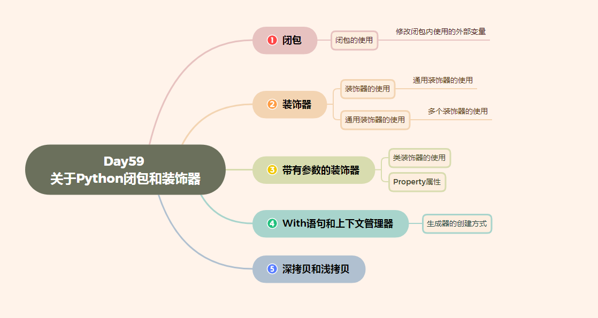

# Day59 关于Python闭包和装饰器

[TOC]





# 闭包

**学习目标**

- 能够知道闭包的构成条件
- 能够知道定义闭包的语法格式

------

### 1. 闭包的介绍

我们前面已经学过了函数，我们知道当函数调用完，函数内定义的变量都销毁了，但是我们有时候需要保存函数内的这个变量，每次在这个变量的基础上完成一些列的操作，比如: 每次在这个变量的基础上和其它数字进行求和计算，那怎么办呢?

我们就可以通过咱们今天学习的**闭包**来解决这个需求。

**闭包的定义:**

在函数嵌套的前提下，内部函数使用了外部函数的变量，并且外部函数返回了内部函数，我们把这个**使用外部函数变量的内部函数称为闭包**。

### 2. 闭包的构成条件

通过闭包的定义，我们可以得知闭包的形成条件:

1. 在函数嵌套(函数里面再定义函数)的前提下
2. 内部函数使用了外部函数的变量(还包括外部函数的参数)
3. 外部函数返回了内部函数

### 3. 简单闭包的示例代码

```py
# 定义一个外部函数
def func_out(num1):
    # 定义一个内部函数
    def func_inner(num2):
        # 内部函数使用了外部函数的变量(num1)
        result = num1 + num2
        print("结果是:", result)
    # 外部函数返回了内部函数，这里返回的内部函数就是闭包
    return func_inner

# 创建闭包实例    
f = func_out(1)
# 执行闭包
f(2)
f(3)
```

**运行结果:**

```py
结果是: 3
结果是: 4
```

**闭包执行结果的说明:**

通过上面的输出结果可以看出闭包保存了外部函数内的变量num1，每次执行闭包都是在num1 = 1 基础上进行计算。

### 4. 闭包的作用

- 闭包可以保存外部函数内的变量，不会随着外部函数调用完而销毁。

**注意点:**

- 由于闭包引用了外部函数的变量，则外部函数的变量没有及时释放，消耗内存。

### 5. 小结

1. 当返回的内部函数使用了外部函数的变量就形成了闭包

2. 闭包可以对外部函数的变量进行保存

3. 实现闭包的标准格式:

   ```py
    # 外部函数
    def test1(a):
        b = 10
        # 内部函数
        def test2():
            # 内部函数使用了外部函数的变量或者参数
            print(a, b)
        # 返回内部函数, 这里返回的内部函数就是闭包实例
        return test2
   ```

# 闭包的使用

**学习目标**

- 能够知道闭包的作用

------

### 1. 案例

需求: 根据配置信息使用闭包实现不同人的对话信息，例如对话:

张三: 到北京了吗? 李四: 已经到了，放心吧。

### 2. 实现步骤说明

1. 定义外部函数接收不同的配置信息参数，参数是人名
2. 定义内部函数接收对话信息参数
3. 在内部函数里面把配置信息和对话信息进行拼接输出

### 3. 功能代码的实现

```py
# 外部函数
def config_name(name):
    # 内部函数
    def say_info(info):
        print(name + ": " + info)

    return say_info

tom = config_name("Tom")

tom("你好!")
tom("你好, 在吗?")

jerry = config_name("jerry")

jerry("不在, 不和玩!")
```

**运行结果:**

```py
Tom: 你好!
Tom: 你好, 在吗?
jerry: 不在, 不和玩!
```

**闭包案例说明:**

- 闭包还可以提高代码的可重用性，不需要再手动定义额外的功能函数。

### 5. 小结

- 闭包不仅可以保存外部函数的变量还可以提高代码的可重用行。

# 修改闭包内使用的外部变量

**学习目标**

- 能够知道修改闭包内使用的外部变量所需要的关键字

------

### 1. 修改闭包内使用的外部变量

**修改闭包内使用的外部变量的错误示例:**

```py
# 定义一个外部函数
def func_out(num1):

    # 定义一个内部函数
    def func_inner(num2):
        # 这里本意想要修改外部num1的值，实际上是在内部函数定义了一个局部变量num1
        num1 = 10
        # 内部函数使用了外部函数的变量(num1)
        result = num1 + num2
        print("结果是:", result)

    print(num1)
    func_inner(1)
    print(num1)

    # 外部函数返回了内部函数，这里返回的内部函数就是闭包
    return func_inner

# 创建闭包实例
f = func_out(1)
# 执行闭包
f(2)
```

**修改闭包内使用的外部变量的错误示例:**

```py
# 定义一个外部函数
def func_out(num1):

    # 定义一个内部函数
    def func_inner(num2):
        # 这里本意想要修改外部num1的值，实际上是在内部函数定义了一个局部变量num1
        nonlocal num1  # 告诉解释器，此处使用的是 外部变量a
        # 修改外部变量num1
        num1 = 10
        # 内部函数使用了外部函数的变量(num1)
        result = num1 + num2
        print("结果是:", result)

    print(num1)
    func_inner(1)
    print(num1)

    # 外部函数返回了内部函数，这里返回的内部函数就是闭包
    return func_inner

# 创建闭包实例
f = func_out(1)
# 执行闭包
f(2)
```

### 2. 小结

- 修改闭包内使用的外部函数变量使用 nonlocal 关键字来完成。

# 装饰器

**学习目标**

- 能够知道定义装饰器的语法格式

------

### 1. 装饰器的定义

就是**给已有函数增加额外功能的函数，它本质上就是一个闭包函数**。

**装饰器的功能特点:**

1. 不修改已有函数的源代码
2. 不修改已有函数的调用方式
3. 给已有函数增加额外的功能

### 2. 装饰器的示例代码

```py
# 添加一个登录验证的功能
def check(fn):
    def inner():
        print("请先登录....")
        fn()
    return inner


def comment():
    print("发表评论")

# 使用装饰器来装饰函数
comment = check(comment)
comment()

# 装饰器的基本雏形
# def decorator(fn): # fn:目标函数.
#     def inner():
#         '''执行函数之前'''
#         fn() # 执行被装饰的函数
#         '''执行函数之后'''
#     return inner
```

**代码说明:**

- 闭包函数有且只有一个参数，必须是函数类型，这样定义的函数才是装饰器。
- 写代码要遵循开放封闭原则，它规定已经实现的功能代码不允许被修改，但可以被扩展。

**执行结果:**

```py
请先登录....
发表评论
```

### 3. 装饰器的语法糖写法

如果有多个函数都需要添加登录验证的功能，每次都需要编写func = check(func)这样代码对已有函数进行装饰，这种做法还是比较麻烦。

Python给提供了一个装饰函数更加简单的写法，那就是语法糖，语法糖的书写格式是: @装饰器名字，通过语法糖的方式也可以完成对已有函数的装饰

```py
# 添加一个登录验证的功能
def check(fn):
    print("装饰器函数执行了")
    def inner():
        print("请先登录....")
        fn()
    return inner

# 使用语法糖方式来装饰函数
@check
def comment():
    print("发表评论")


comment()
```

**说明:**

- @check 等价于 comment = check(comment)
- 装饰器的执行时间是加载模块时立即执行。

**执行结果:**

```py
请先登录....
发表评论
```

### 4. 小结

- 装饰器本质上就是一个闭包函数，它可以对已有函数进行额外的功能扩展。

- 装饰器的语法格式:

  ```py
  # 装饰器
  # def decorator(fn): # fn:被装饰的目标函数.
  #     def inner():
  #         '''执行函数之前'''
  #         fn() # 执行被装饰的目标函数
  #         '''执行函数之后'''
  #     return inner
  ```

- 装饰器的语法糖用法: @装饰器名称，同样可以完成对已有函数的装饰操作。

# 装饰器的使用

**学习目标**

- 能够说出装饰器的作用

------

### 1. 装饰器的使用场景

1. 函数执行时间的统计
2. 输出日志信息

### 2. 装饰器实现已有函数执行时间的统计

```py
import time

# 装饰器函数
def get_time(func):
    def inner():
        begin = time.time()
        func()
        end = time.time()
        print("函数执行花费%f" % (end-begin))
    return inner


@get_time
def func1():
    for i in range(100000):
        print(i)


func1()
```

**执行结果:**

```py
...
99995
99996
99997
99998
99999
函数执行花费0.329066
```

### 2. 小结

通过上面的示例代码可以得知装饰器的作用:

- 在不改变已有函数源代码及调用方式的前提下，对已有函数进行功能的扩展。

# 通用装饰器的使用

**学习目标**

- 能够写出通用的装饰器

------

### 1. 装饰带有参数的函数

```py
# 添加输出日志的功能
def logging(fn):
    def inner(num1, num2):
        print("--正在努力计算--")
        fn(num1, num2)

    return inner


# 使用装饰器装饰函数
@logging
def sum_num(a, b):
    result = a + b
    print(result)


sum_num(1, 2)
```

**运行结果:**

```py
--正在努力计算--
3
```

### 2. 装饰带有返回值的函数

```py
# 添加输出日志的功能
def logging(fn):
    def inner(num1, num2):
        print("--正在努力计算--")
        result = fn(num1, num2)
        return result
    return inner


# 使用装饰器装饰函数
@logging
def sum_num(a, b):
    result = a + b
    return result


result = sum_num(1, 2)
print(result)
```

**运行结果:**

```py
--正在努力计算--
3
```

### 3. 装饰带有不定长参数的函数

```py
# 添加输出日志的功能
def logging(fn):
    def inner(*args, **kwargs):
        print("--正在努力计算--")
        fn(*args, **kwargs)

    return inner


# 使用语法糖装饰函数
@logging
def sum_num(*args, **kwargs):
    result = 0
    for value in args:
        result += value

    for value in kwargs.values():
        result += value

    print(result)

sum_num(1, 2, a=10)
```

**运行结果:**

```py
--正在努力计算--
13
```

### 4. 通用装饰器

```py
# 添加输出日志的功能
def logging(fn):
    def inner(*args, **kwargs):
        print("--正在努力计算--")
        result = fn(*args, **kwargs)
        return result

    return inner


# 使用语法糖装饰函数
@logging
def sum_num(*args, **kwargs):
    result = 0
    for value in args:
        result += value

    for value in kwargs.values():
        result += value

    return result


@logging
def subtraction(a, b):
    result = a - b
    print(result)

result = sum_num(1, 2, a=10)
print(result)

subtraction(4, 2)
```

**运行结果:**

```py
--正在努力计算--
13
--正在努力计算--
2
```

### 5. 小结

- 通用装饰器的语法格式:

  ```py
  # 通用装饰器
  def logging(fn):
    def inner(*args, **kwargs):
        print("--正在努力计算--")
        result = fn(*args, **kwargs)
        return result
  
    return inner
  ```

# 多个装饰器的使用

**学习目标**

- 能够使用多个装饰器装饰一个函数

------

### 1. 多个装饰器的使用示例代码

```py
def make_div(func):
    """对被装饰的函数的返回值 div标签"""
    def inner(*args, **kwargs):
        return "<div>" + func() + "</div>"
    return inner


def make_p(func):
    """对被装饰的函数的返回值 p标签"""
    def inner(*args, **kwargs):
        return "<p>" + func() + "</p>"
    return inner


# 装饰过程: 1 content = make_p(content) 2 content = make_div(content)
# content = make_div(make_p(content))
@make_div
@make_p
def content():
    return "人生苦短"

result = content()

print(result)
```

**代码说明:**

- 多个装饰器的装饰过程是: 离函数最近的装饰器先装饰，然后外面的装饰器再进行装饰，由内到外的装饰过程

### 2. 小结

- 多个装饰器可以对函数进行多个功能的装饰，装饰顺序是由内到外的进行装饰

# 带有参数的装饰器

**学习目标**

- 能够写出带有参数的装饰器

------

### 1. 带有参数的装饰器介绍

带有参数的装饰器就是使用装饰器装饰函数的时候可以传入指定参数，**语法格式: @装饰器(参数,...)**

**错误写法:**

```py
def decorator(fn, flag):
    def inner(num1, num2):
        if flag == "+":
            print("--正在努力加法计算--")
        elif flag == "-":
            print("--正在努力减法计算--")
        result = fn(num1, num2)
        return result
    return inner


@decorator('+')
def add(a, b):
    result = a + b
    return result

result = add(1, 3)
print(result)
```

**执行结果:**

```py
Traceback (most recent call last):
  File "/home/python/Desktop/test/hho.py", line 12, in <module>
    @decorator('+')
TypeError: decorator() missing 1 required positional argument: 'flag'
```

**代码说明:**

- 装饰器只能接收一个参数，并且还是函数类型。

**正确写法:**

在装饰器外面再包裹上一个函数，让最外面的函数接收参数，返回的是装饰器，因为@符号后面必须是装饰器实例。

```py
# 添加输出日志的功能
def logging(flag):

    def decorator(fn):
        def inner(num1, num2):
            if flag == "+":
                print("--正在努力加法计算--")
            elif flag == "-":
                print("--正在努力减法计算--")
            result = fn(num1, num2)
            return result
        return inner

    # 返回装饰器
    return decorator


# 使用装饰器装饰函数
@logging("+")
def add(a, b):
    result = a + b
    return result


@logging("-")
def sub(a, b):
    result = a - b
    return result

result = add(1, 2)
print(result)

result = sub(1, 2)
print(result)
```

### 2. 小结

- 使用带有参数的装饰器，其实是在装饰器外面又包裹了一个函数，使用该函数接收参数，返回是装饰器，因为 @ 符号需要配合装饰器实例使用

# 类装饰器的使用

**学习目标**

- 能够知道类装饰器的使用

------

### 1. 类装饰器的介绍

装饰器还有一种特殊的用法就是类装饰器，就是通过定义一个类来装饰函数。

**类装饰器示例代码:**

```py
class Check(object):
    def __init__(self, fn):
        # 初始化操作在此完成
        self.__fn = fn

    # 实现__call__方法，表示对象是一个可调用对象，可以像调用函数一样进行调用。
    def __call__(self, *args, **kwargs):
        # 添加装饰功能
        print("请先登陆...")
        self.__fn()


@Check
def comment():
    print("发表评论")


comment()
```

**代码说明:**

### 说明：

- @Check 等价于 comment = Check(comment), 所以需要提供一个**init**方法，并多增加一个fn参数。
- 要想类的实例对象能够像函数一样调用，需要在类里面使用**call**方法，把类的实例变成可调用对象(callable)，也就是说可以像调用函数一样进行调用。
- 在**call**方法里进行对fn函数的装饰，可以添加额外的功能。

**执行结果:**

```py
请先登陆...
发表评论
```

### 2. 小结

- 想要让类的实例对象能够像函数一样进行调用，需要在类里面使用**call**方法，把类的实例变成可调用对象(callable)
- 类装饰器装饰函数功能在**call**方法里面进行添加

# property属性

**学习目标**

- 能够知道装饰器方式的property属性的定义方式

------

### 1. property属性的介绍

property属性就是负责把一个方法当做属性进行使用，这样做可以简化代码使用。

**定义property属性有两种方式**

1. 装饰器方式
2. 类属性方式

### 2. 装饰器方式

```py
class Person(object):

    def __init__(self):
        self.__age = 0

    # 装饰器方式的property, 把age方法当做属性使用, 表示当获取属性时会执行下面修饰的方法
    @property
    def age(self):
        return self.__age

    # 把age方法当做属性使用, 表示当设置属性时会执行下面修饰的方法
    @age.setter
    def age(self, new_age):
        if new_age >= 150:
            print("成精了")
        else:
            self.__age = new_age

# 创建person
p = Person()
print(p.age)
p.age = 100
print(p.age)
p.age = 1000
```

**运行结果:**

```py
0
100
成精了
```

**代码说明:**

- @property 表示把方法当做属性使用, 表示当获取属性时会执行下面修饰的方法
- @方法名.setter 表示把方法当做属性使用,表示当设置属性时会执行下面修饰的方法
- 装饰器方式的property属性修饰的方法名一定要一样。

### 3. 类属性方式

```py
class Person(object):

    def __init__(self):
        self.__age = 0

    def get_age(self):
        """当获取age属性的时候会执行该方法"""
        return self.__age

    def set_age(self, new_age):
        """当设置age属性的时候会执行该方法"""
        if new_age >= 150:
            print("成精了")
        else:
            self.__age = new_age

    # 类属性方式的property属性
    age = property(get_age, set_age)

# 创建person
p = Person()
print(p.age)
p.age = 100
print(p.age)
p.age = 1000
```

**运行结果:**

```py
0
100
成精了
```

**代码说明:**

- property的参数说明:
  - 第一个参数是获取属性时要执行的方法
  - 第二个参数是设置属性时要执行的方法

### 4. 小结

- 定义property属性有两种方式:
  1. 装饰器方式
  2. 类属性方式
- 装饰器方式:
  1. @property 修饰获取值的方法
  2. @方法名.setter 修饰设置值的方法
- 类属性方式:
  1. 类属性 = property(获取值方法, 设置值方法)

# with语句和上下文管理器

**学习目标**

- 能够知道自定义上下文管理器的两种方式

------

### 1. with语句的使用

**基础班向文件中写入数据的示例代码:**

```py
 # 1、以写的方式打开文件
 f = open("1.txt", "w")
 # 2、写入文件内容
 f.write("hello world")
 # 3、关闭文件
 f.close()
```

**代码说明:**

- 文件使用完后必须关闭，因为文件对象会占用操作系统的资源，并且操作系统同一时间能打开的文件数量也是有限的

**这种写法可能出现一定的安全隐患，错误代码如下:**

```py
 # 1、以读的方式打开文件
 f = open("1.txt", "r")
 # 2、读取文件内容
 f.write("hello world")
 # 3、关闭文件
 f.close()
```

**运行结果:**

```py
Traceback (most recent call last):
  File "/home/python/Desktop/test/xxf.py", line 4, in <module>
    f.write("hello world")
io.UnsupportedOperation: not writable
```

**代码说明:**

- 由于文件读写时都有可能产生IOError，一旦出错，后面的f.close()就不会调用。
- 为了保证无论是否出错都能正确地关闭文件，我们可以使用try ... finally来解决

**安全写法, 代码如下:**

```py
try:
    # 1、以读的方式打开文件
    f = open("1.txt", "r")
    # 2、读取文件内容
    f.write("xxxxx")

except IOError as e:
    print("文件操作出错", e)

finally:
    # 3、关闭文件
    f.close()
```

**运行结果:**

```py
文件操作出错 not writable
```

这种方法虽然代码运行良好,但是缺点就是代码过于冗长,并且需要添加try-except-finally语句,不是很方便,也容易忘记.

在这种情况下,**Python提供了 with 语句的这种写法，既简单又安全，并且 with 语句执行完成以后自动调用关闭文件操作，即使出现异常也会自动调用关闭文件操作**。

**with 语句的示例代码:**

```py
# 1、以写的方式打开文件
with open("1.txt", "w") as f:
    # 2、读取文件内容
    f.write("hello world")
```

### 2. 上下文管理器

一个类只要实现了`__enter__()和__exit__()`这个两个方法，通过该类创建的对象我们就称之为上下文管理器。

上下文管理器可以使用 with 语句，**with语句之所以这么强大，背后是由上下文管理器做支撑的**，也就是说刚才使用 open 函数创建的文件对象就是就是一个上下文管理器对象。

**自定义上下文管理器类,模拟文件操作:**

定义一个File类，实现 `__enter__() 和 __exit__()`方法，然后使用 with 语句来完成操作文件， 示例代码:

```py
class File(object):

    # 初始化方法
    def __init__(self, file_name, file_model):
        # 定义变量保存文件名和打开模式
        self.file_name = file_name
        self.file_model = file_model

    # 上文方法
    def __enter__(self):
        print("进入上文方法")
        # 返回文件资源
        self.file = open(self.file_name,self.file_model)
        return self.file

    # 下文方法
    def __exit__(self, exc_type, exc_val, exc_tb):
        print("进入下文方法")
        self.file.close()


if __name__ == '__main__':

    # 使用with管理文件
    with File("1.txt", "r") as file:
        file_data = file.read()
        print(file_data)
```

**运行结果:**

```py
进入上文方法
hello world
进入下文方法
```

**代码说明:**

- `__enter__`表示上文方法，需要返回一个操作文件对象
- `__exit__`表示下文方法，with语句执行完成会自动执行，即使出现异常也会执行该方法。

### 3. 上下文管理器的另外一种实现方式

假如想要让一个函数成为上下文管理器，Python 还提供了一个 @contextmanager 的装饰器，更进一步简化了上下文管理器的实现方式。通过 yield 将函数分割成两部分，yield 上面的语句在 `__enter__` 方法中执行，yield 下面的语句在 `__exit__` 方法中执行，紧跟在 yield 后面的参数是函数的返回值。

```py
# 导入装饰器
from contextlib import contextmanager


# 装饰器装饰函数，让其称为一个上下文管理器对象
@contextmanager
def my_open(path, mode):
    try:
        # 打开文件
        file = open(file_name, file_mode)
        # yield之前的代码好比是上文方法
        yield file
    except Exception as e:
        print(e)
    finally:
        print("over")
        # yield下面的代码好比是下文方法
        file.close()

# 使用with语句
with my_open('out.txt', 'w') as f:
    f.write("hello , the simplest context manager")
```

### 4. 小结

- Python 提供了 with 语句用于简化资源释放的操作，使用 with 语句操作建立在上下文管理器(实现`__enter__和__exit__`)的基础上
- Python 还提供了一个 @contextmanager 装饰器，更进一步简化上下管理器的实现，让一个函数可以成为上下文管理器，结合 with 语句来使用

# 生成器的创建方式

**学习目标**

- 能够知道生成器的两种创建方式

------

### 1. 生成器的介绍

根据程序员制定的规则循环生成数据，当条件不成立时则生成数据结束。数据不是一次性全部生成处理，而是使用一个，再生成一个，可以**节约大量的内存**。

### 2. 创建生成器的方式

1. 生成器推导式
2. yield 关键字

**生成器推导式:**

- 与列表推导式类似，只不过生成器推导式使用小括号

```py
# 创建生成器
my_generator = (i * 2 for i in range(5))
print(my_generator)

# next获取生成器下一个值
# value = next(my_generator)
# print(value)

# 遍历生成器
for value in my_generator:
    print(value)
```

**代码说明:**

- next 函数获取生成器中的下一个值
- for 循环遍历生成器中的每一个值

**运行结果:**

```py
<generator object <genexpr> at 0x101367048>
0
2
4
6
8
```

**yield 关键字:**

- 只要在def函数里面看到有 yield 关键字那么就是生成器

```py
def mygenerater(n):
    for i in range(n):
        print('开始生成...')
        yield i
        print('完成一次...')


if __name__ == '__main__':

    g = mygenerater(2)
    # 获取生成器中下一个值
    # result = next(g)
    # print(result)

    # while True:
    #     try:
    #         result = next(g)
    #         print(result)
    #     except StopIteration as e:
    #         break

    # # for遍历生成器, for 循环内部自动处理了停止迭代异常，使用起来更加方便
    for i in g:
        print(i)
```

**代码说明:**

- 代码执行到 yield 会暂停，然后把结果返回出去，下次启动生成器会在暂停的位置继续往下执行
- 生成器如果把数据生成完成，再次获取生成器中的下一个数据会抛出一个StopIteration 异常，表示停止迭代异常
- while 循环内部没有处理异常操作，需要手动添加处理异常操作
- for 循环内部自动处理了停止迭代异常，使用起来更加方便，推荐大家使用。

**运行结果:**

```py
开始生成...
0
完成一次...
开始生成...
1
完成一次...
```

### 3. 生成器的使用场景

数学中有个著名的斐波拉契数列（Fibonacci），数列中第一个数为0，第二个数为1，其后的每一个数都可由前两个数相加得到：

0, 1, 1, 2, 3, 5, 8, 13, 21, 34, ...

现在我们使用生成器来实现这个斐波那契数列，每次取值都通过算法来生成下一个数据, **生成器每次调用只生成一个数据，可以节省大量的内存。**

```py
def fibonacci(num):
    a = 0
    b = 1

    # 记录生成fibonacci数字的下标
    current_index = 0

    while current_index < num:
        result = a
        a, b = b, a + b
        current_index += 1
        # 代码执行到yield会暂停，然后把结果返回出去，下次启动生成器会在暂停的位置继续往下执行
        yield result


fib = fibonacci(5)
# 遍历生成的数据
for value in fib:
    print(value)
```

**运行结果:**

```py
0
1
1
2
3
```

### 4. 小结

- 生成器是根据算法生成数据的一种机制，每次调用生成器只生成一个值，可以节省大量内存。
- 生成器的创建有两种方式:
  - 1. 生成器推导式
  - 1. yield 关键字

# 深拷贝和浅拷贝

**学习目标**

- 能够知道深拷贝和浅拷贝的区别

------

### 1. 浅拷贝

copy函数是浅拷贝，只对可变类型的第一层对象进行拷贝，对拷贝的对象开辟新的内存空间进行存储，不会拷贝对象内部的子对象。

**不可变类型的浅拷贝示例代码:**

```py
import copy  # 使用浅拷贝需要导入copy模块

# 不可变类型有: 数字、字符串、元组

a1 = 123123
b1 = copy.copy(a1)  # 使用copy模块里的copy()函数就是浅拷贝了
# 查看内存地址
print(id(a1))
print(id(b1))

print("-" * 10)
a2 = "abc"
b2 = copy.copy(a2)
# 查看内存地址
print(id(a2))
print(id(b2))

print("-" * 10)
a3 = (1, 2, ["hello", "world"])
b3 = copy.copy(a3)
# 查看内存地址
print(id(a3))
print(id(b3))
```

**运行结果:**

```py
140459558944048
140459558944048
----------
140459558648776
140459558648776
----------
140459558073328
140459558073328
```

**不可变类型的浅拷贝说明:**

- **通过上面的执行结果可以得知，不可变类型进行浅拷贝不会给拷贝的对象开辟新的内存空间，而只是拷贝了这个对象的引用。**

**可变类型的浅拷贝示例代码:**

```py
import copy # 使用浅拷贝需要导入copy模块

# 可变类型有: 列表、字典、集合

a1 = [1, 2]
b1 = copy.copy(a1) # 使用copy模块里的copy()函数就是浅拷贝了
# 查看内存地址
print(id(a1))
print(id(b1))
print("-" * 10)
a2 = {"name": "张三", "age": 20}
b2 = copy.copy(a2)
# 查看内存地址
print(id(a2))
print(id(b2))
print("-" * 10)
a3 = {1, 2, "王五"}
b3 = copy.copy(a3)
# 查看内存地址
print(id(a3))
print(id(b3))

print("-" * 10)
a4 = [1, 2, [4, 5]]
# 注意：浅拷贝只会拷贝父对象，不会对子对象进行拷贝
b4 = copy.copy(a4) # 使用copy模块里的copy()函数就是浅拷贝了
# 查看内存地址
print(id(a4))
print(id(b4))
print("-" * 10)
# 查看内存地址
print(id(a4[2]))
print(id(b4[2]))

# 修改数据
a4[2][0] = 6

# 子对象的数据会受影响
print(a4)
print(b4)
```

**运行结果:**

```py
139882899585608
139882899585800
----------
139882919626432
139882919626504
----------
139882919321672
139882899616264
----------
139882899587016
139882899586952
----------
139882899693640
139882899693640
[1, 2, [6, 5]]
[1, 2, [6, 5]]
```

**可变类型的浅拷贝说明:**

- **通过上面的执行结果可以得知，可变类型进行浅拷贝只对可变类型的第一层对象进行拷贝，对拷贝的对象会开辟新的内存空间进行存储，子对象不进行拷贝。**

### 2. 深拷贝

deepcopy函数是深拷贝, 只要发现对象有可变类型就会对该对象到最后一个可变类型的每一层对象就行拷贝, 对每一层拷贝的对象都会开辟新的内存空间进行存储。

**不可变类型的深拷贝示例代码:**

```py
import copy  # 使用深拷贝需要导入copy模块

# 不可变类型有: 数字、字符串、元组

a1 = 1
b1 = copy.deepcopy(a1)  # 使用copy模块里的deepcopy()函数就是深拷贝了
# 查看内存地址
print(id(a1))
print(id(b1))
print("-" * 10)
a2 = "张三"
b2 = copy.deepcopy(a2)
# 查看内存地址
print(id(a2))
print(id(b2))
print("-" * 10)
a3 = (1, 2)
b3 = copy.deepcopy(a3)
# 查看内存地址
print(id(a3))
print(id(b3))
print("-" * 10)

# 注意: 元组里面要是有可变类型对象，发现对象有可变类型就会该对象到最后一个可变类型的每一层对象进行拷贝
a4 = (1, ["李四"])
b4 = copy.deepcopy(a4)
# 查看内存地址
print(id(a4))
print(id(b4))
# 元组里面的可变类型子对象也会进行拷贝
print(id(a4[1]))
print(id(b4[1]))
```

**运行结果:**

```py
9289120
9289120
----------
140115621848320
140115621848320
----------
140115621859592
140115621859592
----------
140115602480584
140115621834568
140115602328136
140115602436168
```

**不可变类型的深拷贝说明:**

- 通过上面的执行结果可以得知：
  - **不可变类型进行深拷贝如果子对象没有可变类型则不会进行拷贝，而只是拷贝了这个对象的引用，否则会对该对象到最后一个可变类型的每一层对象就行拷贝, 对每一层拷贝的对象都会开辟新的内存空间进行存储**

**可变类型的深拷贝示例代码:**

```py
import copy  # 使用深拷贝需要导入copy模块

# 可变类型有: 列表、字典、集合

a1 = [1, 2]
b1 = copy.deepcopy(a1)  # 使用copy模块里的deepcopy()函数就是深拷贝了
# 查看内存地址
print(id(a1))
print(id(b1))
print("-" * 10)
a2 = {"name": "张三"}
b2 = copy.deepcopy(a2)
# 查看内存地址
print(id(a2))
print(id(b2))
print("-" * 10)
a3 = {1, 2}
b3 = copy.deepcopy(a3)
# 查看内存地址
print(id(a3))
print(id(b3))
print("-" * 10)

a4 = [1, 2, ["李四", "王五"]]
b4 = copy.deepcopy(a4)  # 使用copy模块里的deepcopy()函数就是深拷贝了
# 查看内存地址
print(id(a4))
print(id(b4))

# 查看内存地址
print(id(a4[2]))
print(id(b4[2]))
a4[2][0] = "王五"
# 因为列表的内存地址不同，所以数据不会收到影响
print(a4)
print(b4)
```

**运行结果:**

```py
140348291721736
140348291721928
----------
140348311762624
140348311221592
----------
140348311457864
140348291752456
----------
140348291723080
140348291723144
140348291723208
140348291723016
[1, 2, ['王五', '王五']]
[1, 2, ['李四', '王五']]
```

**可变类型的深拷贝说明:**

- 通过上面的执行结果可以得知, 可变类型进行深拷贝会对该对象到最后一个可变类型的每一层对象就行拷贝, 对每一层拷贝的对象都会开辟新的内存空间进行存储。

### 3. 浅拷贝和深拷贝的区别

- 浅拷贝最多拷贝对象的一层
- 深拷贝可能拷贝对象的多层

### 4. 总结

- 浅拷贝使用copy.copy函数
- 深拷贝使用copy.deepcopy函数
- 不管是给对象进行深拷贝还是浅拷贝，只要拷贝成功就会开辟新的内存空间存储拷贝的对象。
- 浅拷贝和深拷贝的区别是:
  - 浅拷贝最多拷贝对象的一层，深拷贝可能拷贝对象的多层。


-16951970323657.jpg)