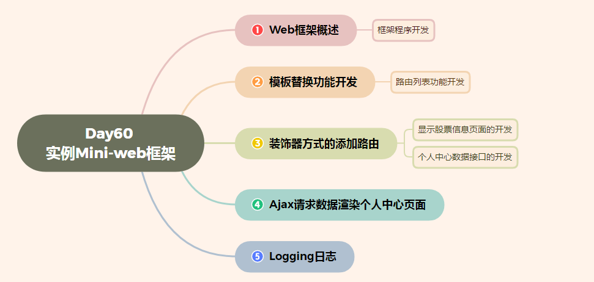
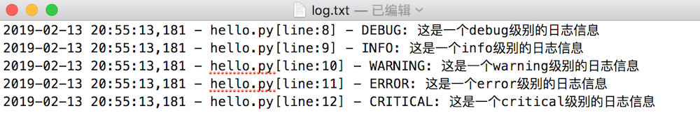

# Day60 实例mini-Web框架


[TOC]





# web框架概述

**学习目标**

- 能够知道web框架和web服务器的关系

------

### 1. web框架和web服务器的关系介绍

前面已经学习过web服务器, 我们知道web服务器主要是接收用户的http请求,根据用户的请求返回不同的资源数据，但是之前我们开发的是静态web服务器，返回的都是静态资源数据，假如我们想要web服务器返回动态资源那么该如何进行处理呢？

这里我们给大家介绍一个web框架，**使用web框架专门负责处理用户的动态资源请求，这个web框架其实就是一个为web服务器提供服务的应用程序**，简称web框架。


**关系说明:**

- web服务器接收浏览器发起的请求，如果是动态资源请求找web框架来处理
- web框架负责处理浏览器的动态资源请求，把处理的结果发生给web服务器
- web服务器再把响应结果发生给浏览器

### 2. 静态资源

不需要经常变化的资源，这种资源web服务器可以提前准备好，比如: png/jpg/css/js等文件。

### 3. 动态资源

和静态资源相反, 这种资源会经常变化，比如: 我们在京东浏览商品时经常会根据条件进行筛选，选择不同条件, 浏览的商品就不同，这种资源web服务器无法提前准备好，需要web框架来帮web服务器进行准备，在这里web服务器可以把.html的资源请求认为是动态资源请求交由web框架进行处理。

### 4. WSGI协议

它是web服务器和web框架之间进行协同工作的一个规则，WSGI协议规定web服务器把动态资源的请求信息传给web框架处理，web框架把处理好的结果返回给web服务器。

### 5. 小结

- web框架是专门为web服务器处理动态资源请求的一个应用程序
- web框架和web服务器的关系是web框架专门服务于web服务器，给web服务器提供处理动态资源请求的服务。

# 框架程序开发

**学习目标**

- 能够知道使用web框架程序处理客户端的动态资源请求操作

------

### 1. 框架职责介绍

- 接收web服务器的动态资源请求，给web服务器提供处理动态资源请求的服务。

### 2. 动态资源判断

- 根据请求资源路径的后缀名进行判断
  - 如果请求资源路径的后缀名是.html则是动态资源请求, 让web框架程序进行处理。
  - 否则是静态资源请求，让web服务器程序进行处理。

**web服务器程序(web.py)代码:**

```py
import socket
import threading
import sys
import framework


# 定义web服务器类
class HttpWebServer(object):
    def __init__(self, port):
        # 创建tcp服务端套接字
        tcp_server_socket = socket.socket(socket.AF_INET, socket.SOCK_STREAM)
        # 设置端口号复用, 程序退出端口立即释放
        tcp_server_socket.setsockopt(socket.SOL_SOCKET, socket.SO_REUSEADDR, True)
        # 绑定端口号
        tcp_server_socket.bind(("", port))
        # 设置监听
        tcp_server_socket.listen(128)
        self.tcp_server_socket = tcp_server_socket

    # 处理客户的请求
    @staticmethod
    def handle_client_quest(new_socket):
        # 代码执行到此，说明连接建立成功
        recv_client_data = new_socket.recv(4096)
        if len(recv_client_data) == 0:
            print("关闭浏览器了")
            # 关闭服务与客户端的套接字
            new_socket.close()
            return

        # 对二进制数据进行解码
        recv_client_content = recv_client_data.decode("utf-8")
        print(recv_client_content)
        # 根据指定字符串进行分割， 最大分割次数指定2
        request_list = recv_client_content.split(" ", maxsplit=2)

        # 获取请求资源路径
        request_path = request_list[1]
        print(request_path)

        # 判断请求的是否是根目录，如果条件成立，指定首页数据返回
        if request_path == "/":
            request_path = "/index.html"

        # 判断是否是动态资源请求
        if request_path.endswith(".html"):
            """这里是动态资源请求，把请求信息交给框架处理"""
            # 字典存储用户的请求信息
            env = {
                "request_path": request_path
            }

            # 获取处理结果
            status, headers, response_body = framework.handle_request(env)

            # 使用框架处理的数据拼接响应报文
            # 响应行
            response_line = "HTTP/1.1 %s\r\n" % status
            # 响应头
            response_header = ""
            # 遍历头部信息
            for header in headers:
                # 拼接多个响应头
                response_header += "%s: %s\r\n" % header
            response_data = (response_line +
                             response_header +
                             "\r\n" +
                             response_body).encode("utf-8")
            # 发送数据
            new_socket.send(response_data)
            # 关闭socket
            new_socket.close()

        else:
            """这里是静态资源请求"""
            try:
                # 动态打开指定文件
                with open("static" + request_path, "rb") as file:
                    # 读取文件数据
                    file_data = file.read()
            except Exception as e:
                # 请求资源不存在，返回404数据
                # 响应行
                response_line = "HTTP/1.1 404 Not Found\r\n"
                # 响应头
                response_header = "Server: PWS1.0\r\n"
                with open("static/error.html", "rb") as file:
                    file_data = file.read()
                # 响应体
                response_body = file_data

                # 拼接响应报文
                response_data = (response_line + response_header + "\r\n").encode("utf-8") + response_body
                # 发送数据
                new_socket.send(response_data)
            else:
                # 响应行
                response_line = "HTTP/1.1 200 OK\r\n"
                # 响应头
                response_header = "Server: PWS1.0\r\n"

                # 响应体
                response_body = file_data

                # 拼接响应报文
                response_data = (response_line + response_header + "\r\n").encode("utf-8") + response_body
                # 发送数据
                new_socket.send(response_data)
            finally:
                # 关闭服务与客户端的套接字
                new_socket.close()

    def start(self):
        while True:
            # 等待接受客户端的连接请求
            new_socket, ip_port = self.tcp_server_socket.accept()
            sub_thread = threading.Thread(target=self.handle_client_quest, args=(new_socket,))
            # 设置守护线程
            sub_thread.setDaemon(True)
            sub_thread.start()


# 程序入口函数
def main():

    # 获取命令行参数判断长度
    if len(sys.argv) != 2:
        print("执行命令如下: python3 xxx.py 9000")
        return

    # 判断端口号是否是数字
    if not sys.argv[1].isdigit():
        print("执行命令如下: python3 xxx.py 9000")
        return

    # 需要转成int类型
    port = int(sys.argv[1])

    # 创建web服务器
    web_server = HttpWebServer(port)
    # 启动web服务器
    web_server.start()


if __name__ == '__main__':
    main()
```

### 3. 处理客户端的动态资源请求

1. 创建web框架程序
2. 接收web服务器的动态资源请求
3. 处理web服务器的动态资源请求并把处理结果返回给web服务器
4. web服务器把处理结果组装成响应报文发送给浏览器

**web框架程序(framework.py)代码:**

```py
"""miniweb框架，负责处理动态资源请求"""
import time


# 获取首页数据
def index():
    # 响应状态
    status = "200 OK";
    # 响应头
    response_header = [("Server", "PWS2.0")]
    # 处理后的数据
    data = time.ctime()

    return status, response_header, data


# 没有找到动态资源
def not_found():
    # 响应状态
    status = "404 Not Found";
    # 响应头
    response_header = [("Server", "PWS2.0")]
    # 处理后的数据
    data = "not found"

    return status, response_header, data


# 处理动态资源请求
def handle_request(env):
    # 获取动态请求资源路径
    request_path = env["request_path"]
    print("接收到的动态资源请求:", request_path)

    if request_path == "/index.html":
        # 获取首页数据
        result = index()
        return result
    else:
        # 没有找到动态资源
        result = not_found()
        return result
```

### 4. 小结

- 动态资源的判断通过请求资源路径的后缀是.html来完成，否则是静态资源
- 处理客户端的动态资源请求
  1. 接收web服务器的动态资源请求
  2. 处理动态资源请求并把处理结果返回给web服务器
  3. web服务器把处理结果组装成响应报文发送给浏览器

# 模板替换功能开发

**学习目标**

- 能够实现模板替换功能

------

### 1. 读取股票信息模板文件

**framework.py示例代码:**

```py
# 获取首页数据
def index():
    # 响应状态
    status = "200 OK";
    # 响应头
    response_header = [("Server", "PWS2.0")]

    # 打开模板文件，读取数据
    with open("template/index.html", "r") as file:
        file_data = file.read()
```

### 2. 使用模拟数据替换模板变量

**framework.py示例代码:**

```py
# 获取首页数据
def index():
    # 响应状态
    status = "200 OK";
    # 响应头
    response_header = [("Server", "PWS2.0")]

    # 1. 打开模板文件，读取数据
    with open("template/index.html", "r") as file:
        file_data = file.read()

    # 处理后的数据, 从数据库查询
    data = time.ctime()
    # 2. 替换模板文件中的模板遍历
    result = file_data.replace("", data)

    return status, response_header, result
```

### 3. 小结

- 模板替换功能
  1. 打开template目录下的index.html模板文件，读取模板文件数据
  2. 把模板文件中的模板变量进行替换


# 路由列表功能开发

**学习目标**

- 能够知道路由列表的实现

------

### 1. 路由的介绍

接着上面程序的判断场景，假如咱们再处理一个个人中心的动态资源请求非常简单，再添加一个函数和更加一个分支判断就可以实现了。

**framework.py 示例代码:**

```py
# 获取个人中心数据
def center():
    # 响应状态
    status = "200 OK";
    # 响应头
    response_header = [("Server", "PWS2.0")]

    # 打开模板文件，读取数据
    with open("template/center.html", "r") as file:
        file_data = file.read()

    # 处理后的数据, 从数据库查询
    data = time.ctime()
    # 替换模板文件中的模板遍历
    result = file_data.replace("", data)

    return status, response_header, result


# 处理动态资源请求
def handle_request(env):
    # 获取动态请求资源路径
    request_path = env["request_path"]
    print("接收到的动态资源请求:", request_path)

    if request_path == "/index.html":
        # 获取首页数据
        result = index()
        return result
    elif request_path == "/center.html":
        # 获取个人中心数据
        result = center()
        return result
    else:
        # 没有找到动态资源
        result = not_found()
        return result
```

那如果咱们的框架处理的页面请求路径再多一些，比如:5个路径判断，大家可能感觉条件分支完全可以胜任，如果是40个甚至更多呢? 如果这是还是用普通的条件分支简直无法忍受。

解决办法: **可以使用路由**

**什么是路由？**

路由就是请求的URL到处理函数的映射，也就是说提前把请求的URL和处理函数关联好。

**路由列表**

这么多的路由如何管理呢， 可以使用一个路由列表进行管理，通过路由列表保存每一个路由。

| 请求路径     | 处理函数   |
| :----------- | :--------- |
| /login.html  | login函数  |
| /index.html  | index函数  |
| /center.html | center函数 |

### 2. 在路由列表添加路由

**framework.py 示例代码:**

```py
# 定义路由列表
route_list = [
    ("/index.html", index),
    ("/center.html", center)
]
```

### 3. 根据用户请求遍历路由列表处理用户请求

**framework.py 示例代码:**

```py
# 处理动态资源请求
def handle_request(env):
    # 获取动态请求资源路径
    request_path = env["request_path"]
    print("接收到的动态资源请求:", request_path)
    # 遍历路由列表，选择执行的函数
    for path, func in route_list:
        if request_path == path:
            result = func()
            return result
    else:
        # 没有找到动态资源
        result = not_found()
        return result

    # if request_path == "/index.html":
    #     # 获取首页数据
    #     result = index()
    #     return result
    # elif request_path == "/center.html":
    #     # 获取个人中心数据
    #     result = center()
    #     return result
    # else:
    #     # 没有找到动态资源
    #     result = not_found()
    #     return result
```

### 小结

- 路由是请求的URL到处理函数的映射
- 路由列表是用来保存每一个设置好的路由
- 用户的动态资源请求通过遍历路由列表找到对应的处理函数来完成。

# 装饰器方式的添加路由

**学习目标**

- 能够知道装饰器方式的添加路由

------

### 1. 使用带有参数的装饰器添加路由

前面我们已经实现了路由列表，但是每次添加路由都需要手动添加来完成，接下来我们想要完成路由的自动添加，可以通过装饰器来实现，在使用装饰器对处理函数进行装饰的时候我们需要知道装饰的函数和那个请求路径进行关联，也就是说装饰器需要接收一个url参数，这样我们定义的装饰器是一个带有参数的装饰器。

**示例代码:**

```py
"""miniweb框架，负责处理动态资源请求"""
import time

# 定义路由列表
route_list = []


# 定义带有参数的装饰器
def route(path):
    # 装饰器
    def decorator(func):
        # 当执行装饰器装饰指定函数的时候，把路径和函数添加到路由列表
        route_list.append((path, func))

        def inner():
            # 执行指定函数
            return func()

        return inner
    # 返回装饰器
    return decorator


# 获取首页数据
@route("/index.html")
def index():
    # 响应状态
    status = "200 OK";
    # 响应头
    response_header = [("Server", "PWS2.0")]

    # 打开模板文件，读取数据
    with open("template/index.html", "r") as file:
        file_data = file.read()

    # 处理后的数据, 从数据库查询
    data = time.ctime()
    # 替换模板文件中的模板遍历
    result = file_data.replace("", data)

    return status, response_header, result


# 获取个人中心数据
@route("/center.html")
def center():
    # 响应状态
    status = "200 OK";
    # 响应头
    response_header = [("Server", "PWS2.0")]

    # 打开模板文件，读取数据
    with open("template/center.html", "r") as file:
        file_data = file.read()

    # 处理后的数据, 从数据库查询
    data = time.ctime()
    # 替换模板文件中的模板遍历
    result = file_data.replace("", data)

    return status, response_header, result


# 没有找到动态资源
def not_found():
    # 响应状态
    status = "404 Not Found";
    # 响应头
    response_header = [("Server", "PWS2.0")]
    # 处理后的数据
    data = "not found"

    return status, response_header, data


# 处理动态资源请求
def handle_request(env):
    # 获取动态请求资源路径
    request_path = env["request_path"]
    print("接收到的动态资源请求:", request_path)
    # 遍历路由列表，选择执行的函数
    for path, func in route_list:
        if request_path == path:
            result = func()
            return result
    else:
        # 没有找到动态资源
        result = not_found()
        return result
```

### 2. 小结

- 使用带有参数的装饰器对处理函数进行装饰，并完成路由的添加功能。

# 显示股票信息页面的开发

**学习目标**

- 能够实现股票信息数据的查询

------

### 1. 数据准备

```sql
-- 创建数据库
create database stock_db charset=utf8;
-- 切换数据库
use stock_db;
-- 执行sql文件
source stock_db.sql;
```

### 2. 根据sql语句查询股票信息

**示例代码:**

```py
# 获取首页数据
@route("/index.html")
def index():
    # 响应状态
    status = "200 OK";
    # 响应头
    response_header = [("Server", "PWS2.0")]

    # 打开模板文件，读取数据
    with open("template/index.html", "r") as file:
        file_data = file.read()

    # 处理后的数据, 从数据库查询
    conn = pymysql.connect(host="localhost",
                           port=3306,
                           user="root",
                           password="mysql",
                           database="stock_db",
                           charset="utf8")

    # 获取游标
    cursor = conn.cursor()
    # 查询sql语句
    sql = "select * from info;"
    # 执行sql
    cursor.execute(sql)
    # 获取结果集
    result = cursor.fetchall()
    print(result)
```

### 3. 使用查询数据替换模板变量

**示例代码:**

```py
# 获取首页数据
@route("/index.html")
def index():
    # 响应状态
    status = "200 OK";
    # 响应头
    response_header = [("Server", "PWS2.0")]

    # 打开模板文件，读取数据
    with open("template/index.html", "r") as file:
        file_data = file.read()

    # 处理后的数据, 从数据库查询
    conn = pymysql.connect(host="localhost",
                           port=3306,
                           user="root",
                           password="mysql",
                           database="stock_db",
                           charset="utf8")

    # 获取游标
    cursor = conn.cursor()
    # 查询sql语句
    sql = "select * from info;"
    # 执行sql
    cursor.execute(sql)
    # 获取结果集
    result = cursor.fetchall()
    print(result)

    data = ""
    for row in result:
        data += '''<tr>
                    <td>%s</td>
                    <td>%s</td>
                    <td>%s</td>
                    <td>%s</td>
                    <td>%s</td>
                    <td>%s</td>
                    <td>%s</td>
                    <td>%s</td>
                    <td><input type="button" value="添加" id="toAdd" name="toAdd" systemidvaule="000007"></td>
                   </tr>''' % row

    # 替换模板文件中的模板遍历
    result = file_data.replace("", data)

    return status, response_header, result
```

### 4. 小结

- 根据sql语句查询股票信息
- 使用查询数据替换模板变量

# 个人中心数据接口的开发

**学习目标**

- 能够知道个人中心数据接口的开发步骤

------

### 1. 根据sql语句查询个人中心数据

```py
# 个人中心数据接口开发
@route("/center_data.html")
def center_data():
    # 响应状态
    status = "200 OK";
    # 响应头
    response_header = [("Server", "PWS2.0"), ("Content-Type", "text/html;charset=utf-8")]
    conn = pymysql.connect(host="localhost",
                           port=3306,
                           user="root",
                           password="mysql",
                           database="stock_db",
                           charset="utf8")

    # 获取游标
    cursor = conn.cursor()
    # 查询sql语句
    sql = '''select i.code, i.short, i.chg, 
             i.turnover, i.price, i.highs, f.note_info 
             from info as i inner join focus as f on i.id = f.info_id;'''
    # 执行sql
    cursor.execute(sql)
    # 获取结果集
    result = cursor.fetchall()
    # 关闭游标
    cursor.close()
    # 关闭数据库连接
    conn.close()
    print(result)
```

### 2. 将个人中心数据转成json字符串并返回

```py
# 个人中心数据接口开发
@route("/center_data.html")
def center_data():
    # 响应状态
    status = "200 OK";
    # 响应头
    response_header = [("Server", "PWS2.0"), ("Content-Type", "text/html;charset=utf-8")]
    conn = pymysql.connect(host="localhost",
                           port=3306,
                           user="root",
                           password="mysql",
                           database="stock_db",
                           charset="utf8")

    # 获取游标
    cursor = conn.cursor()
    # 查询sql语句
    sql = '''select i.code, i.short, i.chg, 
             i.turnover, i.price, i.highs, f.note_info 
             from info as i inner join focus as f on i.id = f.info_id;'''
    # 执行sql
    cursor.execute(sql)
    # 获取结果集
    result = cursor.fetchall()
    # 关闭游标
    cursor.close()
    # 关闭数据库连接
    conn.close()
    # 个人中心数据列表
    center_data_list = list()
    # 遍历每一行数据转成字典
    for row in result:
        # 创建空的字典
        center_dict = dict()
        center_dict["code"] = row[0]
        center_dict["short"] = row[1]
        center_dict["chg"] = row[2]
        center_dict["turnover"] = row[3]
        center_dict["price"] = str(row[4])
        center_dict["highs"] = str(row[5])
        center_dict["note_info"] = row[6]
        # 添加每个字典信息
        center_data_list.append(center_dict)

    # 把列表字典转成json字符串, 并在控制台显示
    json_str = json.dumps(center_data_list,ensure_ascii=False)
    print(json_str)
    return status, response_header, json_str
```

**代码说明:**

- json.dumps函数把字典转成json字符串
  1. 函数的第一个参数表示要把指定对象转成json字符串
  2. 参数的第二个参数ensure_ascii=False表示不使用ascii编码，可以在控制台显示中文。
- 响应头添加Content-Type表示指定数据的编码格式

### 3. 小结

- web框架程序还可以开发数据接口，为客户端程序提供数据服务。
  - 1. 根据sql语句查询数据库
  - 1. 把数据转成json字符串返回
  - 1. 浏览器通过指定接口地址获取web框架提供的数据。

# ajax请求数据渲染个人中心页面

**学习目标**

- 能够知道使用ajax发送请求获取个人中心的数据

------

### 1. 根据用户请求返回个人中心空模板文件数据

```py
# 获取个人中心数据
@route("/center.html")
def center():
    # 响应状态
    status = "200 OK"
    # 响应头
    response_header = [("Server", "PWS2.0")]

    # 打开模板文件，读取数据
    with open("template/center.html", "r") as file:
        file_data = file.read()

    # 替换模板文件中的模板遍历
    result = file_data.replace("", "")

    return status, response_header, result
```

### 2. 在个人中心模板文件添加ajax请求获取个人中心数据

```js
// 发送ajax请求获取个人中心页面数据
// 路径写成 center_data.html，发送ajax的时候路径其实是http://ip地址:端口号/center.data.html
$.get("center_data.html", function (data) {
        alert(data);
    }
}, "json");
```

### 3. 将个人中心数据在页面完成展示

```js
// 发送ajax请求获取个人中心页面数据
$.get("center_data.html", function (data) {

    var data_array = data;

    // 获取table标签对象
    var $table = $(".table")
    for(var i = 0; i < data_array.length; i++){
        // 获取每一条对象
        var center_obj = data_array[i];
        var row_html = '<tr>' +
            '<td>'+ center_obj.code +'</td>' +
            '<td>'+ center_obj.short +'</td>' +
            '<td>'+ center_obj.chg +'</td>' +
            '<td>'+ center_obj.turnover +'</td>' +
            '<td>'+ center_obj.price +'</td>' +
            '<td>'+ center_obj.highs +'</td>' +
            '<td>'+ center_obj.note_info +'</td>' +
            '<td><a type="button" class="btn btn-default btn-xs" href="/update/000007.html"> <span class="glyphicon glyphicon-star" aria-hidden="true"></span> 修改 </a></td><td><input type="button" value="删除" id="toDel" name="toDel" systemidvaule="000007"></td></tr>';
        // 为table标签添加每一行组装的html数据
        $table.append(row_html);
    }

}, "json");
```

### 4. 小结

- 根据用户请求返回个人中心空模板文件数据
- 在个人中心模板文件添加ajax请求获取个人中心数据
- 将个人中心数据在页面完成展示


# logging日志

**学习目标**

- 能够知道logging日志的使用

------

### 1. logging日志的介绍

在现实生活中，记录日志非常重要，比如:银行转账时会有转账记录；飞机飞行过程中，会有个黑盒子（飞行数据记录器）记录着飞机的飞行过程，那在咱们python程序中想要记录程序在运行时所产生的日志信息，怎么做呢?

可以使用 **logging** 这个包来完成

**记录程序日志信息的目的是:**

1. 可以很方便的了解程序的运行情况
2. 可以分析用户的操作行为、喜好等信息
3. 方便开发人员检查bug

### 2. logging日志级别介绍

日志等级可以分为5个，从低到高分别是:

1. DEBUG
2. INFO
3. WARNING
4. ERROR
5. CRITICAL

**日志等级说明:**

- DEBUG：程序调试bug时使用
- INFO：程序正常运行时使用
- WARNING：程序未按预期运行时使用，但并不是错误，如:用户登录密码错误
- ERROR：程序出错误时使用，如:IO操作失败
- CRITICAL：特别严重的问题，导致程序不能再继续运行时使用，如:磁盘空间为空，一般很少使用
- 默认的是WARNING等级，当在WARNING或WARNING之上等级的才记录日志信息。
- 日志等级从低到高的顺序是: DEBUG < INFO < WARNING < ERROR < CRITICAL

### 3. logging日志的使用

在 logging 包中记录日志的方式有两种:

1. 输出到控制台
2. 保存到日志文件

**日志信息输出到控制台的示例代码:**

```py
import logging

logging.debug('这是一个debug级别的日志信息')
logging.info('这是一个info级别的日志信息')
logging.warning('这是一个warning级别的日志信息')
logging.error('这是一个error级别的日志信息')
logging.critical('这是一个critical级别的日志信息')
```

**运行结果:**

```py
WARNING:root:这是一个warning级别的日志信息
ERROR:root:这是一个error级别的日志信息
CRITICAL:root:这是一个critical级别的日志信息
```

**说明:**

- 日志信息只显示了大于等于WARNING级别的日志，这说明默认的日志级别设置为WARNING

**logging日志等级和输出格式的设置:**

```py
import logging

# 设置日志等级和输出日志格式
logging.basicConfig(level=logging.DEBUG,
                    format='%(asctime)s - %(filename)s[line:%(lineno)d] - %(levelname)s: %(message)s')

logging.debug('这是一个debug级别的日志信息')
logging.info('这是一个info级别的日志信息')
logging.warning('这是一个warning级别的日志信息')
logging.error('这是一个error级别的日志信息')
logging.critical('这是一个critical级别的日志信息')
```

**运行结果:**

```py
2019-02-13 20:41:33,080 - hello.py[line:6] - DEBUG: 这是一个debug级别的日志信息
2019-02-13 20:41:33,080 - hello.py[line:7] - INFO: 这是一个info级别的日志信息
2019-02-13 20:41:33,080 - hello.py[line:8] - WARNING: 这是一个warning级别的日志信息
2019-02-13 20:41:33,080 - hello.py[line:9] - ERROR: 这是一个error级别的日志信息
2019-02-13 20:41:33,080 - hello.py[line:10] - CRITICAL: 这是一个critical级别的日志信息
```

**代码说明:**

- level 表示设置的日志等级
- format 表示日志的输出格式, 参数说明:
  - %(levelname)s: 打印日志级别名称
  - %(filename)s: 打印当前执行程序名
  - %(lineno)d: 打印日志的当前行号
  - %(asctime)s: 打印日志的时间
  - %(message)s: 打印日志信息

**日志信息保存到日志文件的示例代码:**

```py
import logging

logging.basicConfig(level=logging.DEBUG,
                    format='%(asctime)s - %(filename)s[line:%(lineno)d] - %(levelname)s: %(message)s',
                    filename="log.txt",
                    filemode="w")

logging.debug('这是一个debug级别的日志信息')
logging.info('这是一个info级别的日志信息')
logging.warning('这是一个warning级别的日志信息')
logging.error('这是一个error级别的日志信息')
logging.critical('这是一个critical级别的日志信息')
```

**运行结果:**



### 4. logging日志在mini-web项目中应用

**web.py 程序使用logging日志示例:**

1. 程序入口模块设置logging日志的设置

   ```py
    import socket
    import threading
    import sys
    import framework
    import logging
   
    # logging日志的配置
    logging.basicConfig(level=logging.DEBUG,
                        format='%(asctime)s - %(filename)s[line:%(lineno)d] - %(levelname)s: %(message)s',
                        filename="log.txt",
                        filemode="w")
   ```

2. INFO级别的日志输出，示例代码:

   ```py
    # 判断是否是动态资源请求
    if request_path.endswith(".html"):
        """这里是动态资源请求，把请求信息交给框架处理"""
        logging.info("动态资源请求:" + request_path)
        ...
    else:
        """这里是静态资源请求"""
        logging.info("静态资源请求:" + request_path)
        ...
   ```

3. WARNING级别的日志输出，示例代码:

   ```py
    # 获取命令行参数判断长度
    if len(sys.argv) != 2:
        print("执行命令如下: python3 xxx.py 9000")
        logging.warning("用户在命令行启动程序参数个数不正确!")
        return
   
    # 判断端口号是否是数字
    if not sys.argv[1].isdigit():
        print("执行命令如下: python3 xxx.py 9000")
        logging.warning("用户在命令行启动程序参数不是数字字符串!")
        return
   ```

**framework.py 程序使用logging日志示例:**

1. ERROR级别的日志输出，示例代码:

   ```py
    # 处理动态资源请求
    def handle_request(env):
        # 获取动态请求资源路径
        request_path = env["request_path"]
        print("接收到的动态资源请求:", request_path)
        # 遍历路由列表，选择执行的函数
        for path, func in route_list:
            if request_path == path:
                result = func()
                return result
        else:
            logging.error("没有设置相应的路由:" + request_path)
            # 没有找到动态资源
            result = not_found()
            return result
   ```

**说明:**

- logging日志配置信息在程序入口模块设置一次，整个程序都可以生效。
  - logging.basicConfig 表示 logging 日志配置操作

### 5. 小结

- 记录python程序中日志信息使用 logging 包来完成
- logging日志等级有5个:
  1. DEBUG
  2. INFO
  3. WARNING
  4. ERROR
  5. CRITICAL
- 打印(记录)日志的函数有5个:
  1. logging.debug函数, 表示: 打印(记录)DEBUG级别的日志信息
  2. logging.info函数, 表示: 打印(记录)INFO级别的日志信息
  3. logging.warning函数, 表示: 打印(记录)WARNING级别的日志信息
  4. logging.error函数, 表示: 打印(记录)ERROR级别的日志信息
  5. logging.critical函数, 表示: 打印(记录)CRITICAL级别的日志信息


-16952575318078.jpg)


