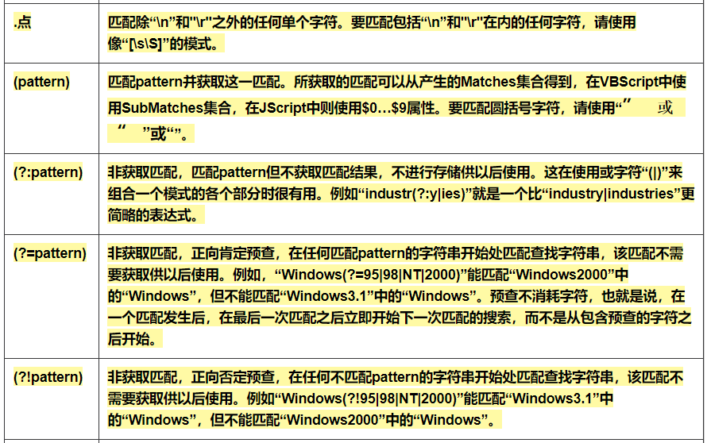

# Day61 正则表达式


# 正则表达式的概述

**学习目标**

- 能够知道正则表达式的作用

------

### 1. 正则表达式的介绍

在实际开发过程中经常会有查找符合某些复杂规则的字符串的需要，比如:邮箱、图片地址、手机号码等，这时候想匹配或者查找符合某些规则的字符串就可以使用正则表达式了。

### 2. 正则表达式概念

**正则表达式就是记录文本规则的代码**

### 3. 正则表达式的样子

0\d{2}-\d{8} 这个就是一个正则表达式，表达的意思是匹配的是座机号码

### 4. 正则表达式的特点

- 正则表达式的语法很令人头疼，可读性差
- 正则表达式通用行很强，能够适用于很多编程语言

### 5. 小结

- 正则表达式是匹配符合某些规则的字符串数据

# re模块介绍

**学习目标**

- 能够知道在python中使用正则表达式需要导入的模块

------

### 1. re模块的介绍

在Python中需要通过正则表达式对字符串进行匹配的时候，可以使用一个 re 模块

```py
# 导入re模块
import re

# 使用match方法进行匹配操作
result = re.match(正则表达式,要匹配的字符串)

# 如果上一步匹配到数据的话，可以使用group方法来提取数据
result.group()
```

### 2. re模块的使用

```py
import re


# 使用match方法进行匹配操作
result = re.match("itcast","itcast.cn")
# 获取匹配结果
info = result.group()
print(info)
```

**运行结果:**

```py
itcast
```

### 3. 小结

- re.match() 根据正则表达式从头开始匹配字符串数据

# 匹配单个字符

**学习目标**

- 能够使用re模块匹配单个字符

------

### 1. 匹配单个字符

在上一小节中，了解到通过re模块能够完成使用正则表达式来匹配字符串

本小节，将要讲解正则表达式的单字符匹配

| 代码 | 功能                                     |
| :--: | :--------------------------------------- |
|  .   | 匹配任意1个字符（除了\n）                |
| [ ]  | 匹配[ ]中列举的字符                      |
|  \d  | 匹配数字，即0-9                          |
|  \D  | 匹配非数字，即不是数字                   |
|  \s  | 匹配空白，即 空格，tab键                 |
|  \S  | 匹配非空白                               |
|  \w  | 匹配非特殊字符，即a-z、A-Z、0-9、_、汉字 |
|  \W  | 匹配特殊字符，即非字母、非数字、非汉字   |

### 示例1： .

```python
import re

ret = re.match(".","M")
print(ret.group())

ret = re.match("t.o","too")
print(ret.group())

ret = re.match("t.o","two")
print(ret.group())
```

运行结果：

```python
M
too
two
```

### 示例2：[]

```python
import re

# 如果hello的首字符小写，那么正则表达式需要小写的h
ret = re.match("h","hello Python") 
print(ret.group())


# 如果hello的首字符大写，那么正则表达式需要大写的H
ret = re.match("H","Hello Python") 
print(ret.group())

# 大小写h都可以的情况
ret = re.match("[hH]","hello Python")
print(ret.group())
ret = re.match("[hH]","Hello Python")
print(ret.group())
ret = re.match("[hH]ello Python","Hello Python")
print(ret.group())

# 匹配0到9第一种写法
ret = re.match("[0123456789]Hello Python","7Hello Python")
print(ret.group())

# 匹配0到9第二种写法
ret = re.match("[0-9]Hello Python","7Hello Python")
print(ret.group())

ret = re.match("[0-35-9]Hello Python","7Hello Python")
print(ret.group())

# 下面这个正则不能够匹配到数字4，因此ret为None
ret = re.match("[0-35-9]Hello Python","4Hello Python")
# print(ret.group())
```

运行结果：

```python
h
H
h
H
Hello Python
7Hello Python
7Hello Python
7Hello Python
```

### 示例3：\d

```python
import re

# 普通的匹配方式
ret = re.match("嫦娥1号","嫦娥1号发射成功") 
print(ret.group())

ret = re.match("嫦娥2号","嫦娥2号发射成功") 
print(ret.group())

ret = re.match("嫦娥3号","嫦娥3号发射成功") 
print(ret.group())

# 使用\d进行匹配
ret = re.match("嫦娥\d号","嫦娥1号发射成功") 
print(ret.group())

ret = re.match("嫦娥\d号","嫦娥2号发射成功") 
print(ret.group())

ret = re.match("嫦娥\d号","嫦娥3号发射成功") 
print(ret.group())
```

运行结果：

```python
嫦娥1号
嫦娥2号
嫦娥3号
嫦娥1号
嫦娥2号
嫦娥3号
```

### 示例4：\D

```python
import re

match_obj = re.match("\D", "f")
if match_obj:
    # 获取匹配结果
    print(match_obj.group())
else:
    print("匹配失败")
```

运行结果:

```python
f
```

### 示例5：\s

```python
import re

# 空格属于空白字符
match_obj = re.match("hello\sworld", "hello world")
if match_obj:
    result = match_obj.group()
    print(result)
else:
    print("匹配失败")


# \t 属于空白字符
match_obj = re.match("hello\sworld", "hello\tworld")
if match_obj:
    result = match_obj.group()
    print(result)
else:
    print("匹配失败")
```

运行结果:

```python
hello world
hello world
```

### 示例6：\S

```python
import re

match_obj = re.match("hello\Sworld", "hello&world")
if match_obj:
result = match_obj.group()
print(result)
else:
print("匹配失败")


match_obj = re.match("hello\Sworld", "hello$world")
if match_obj:
result = match_obj.group()
print(result)
else:
print("匹配失败")
```

运行结果:

```python
hello&world  
hello$world
```

### 示例7：\w

```python
import re

# 匹配非特殊字符中的一位
match_obj = re.match("\w", "A")
if match_obj:
    # 获取匹配结果
    print(match_obj.group())
else:
    print("匹配失败")
```

执行结果:

```
A
```

### 示例8：\W

```python
# 匹配特殊字符中的一位
match_obj = re.match("\W", "&")
if match_obj:
    # 获取匹配结果
    print(match_obj.group())
else:
    print("匹配失败")
```

执行结果:

```
&
```

### 小结

- . 表示匹配任意1个字符（除了\n）
- [ ] 表示匹配[ ]中列举的1个字符
- \d 表示匹配一个数字，即0-9
- \D 表示匹配一个非数字，即不是数字
- \s 表示匹配一个空白字符，即 空格，tab键
- \S | 匹配一个非空白字符
- \w | 匹配一个非特殊字符，即a-z、A-Z、0-9、_、汉字
- \W | 匹配一个特殊字符，即非字母、非数字、非汉字

# 匹配多个字符

**学习目标**

- 能够使用re模块匹配多个字符

------

### 1. 匹配多个字符

| 代码  | 功能                                                |
| :---: | :-------------------------------------------------- |
|   *   | 匹配前一个字符出现0次或者无限次，即可有可无         |
|   +   | 匹配前一个字符出现1次或者无限次，即至少有1次        |
|   ?   | 匹配前一个字符出现1次或者0次，即要么有1次，要么没有 |
|  {m}  | 匹配前一个字符出现m次                               |
| {m,n} | 匹配前一个字符出现从m到n次                          |

### 示例1：*

需求：匹配出一个字符串第一个字母为大小字符，后面都是小写字母并且这些小写字母可 有可无

```python
import re

ret = re.match("[A-Z][a-z]*","M")
print(ret.group())

ret = re.match("[A-Z][a-z]*","MnnM")
print(ret.group())

ret = re.match("[A-Z][a-z]*","Aabcdef")
print(ret.group())
```

运行结果：

```python
M
Mnn
Aabcdef
```

### 示例2：+

需求：匹配一个字符串，第一个字符是t,最后一个字符串是o,中间至少有一个字符

```python
import re


match_obj = re.match("t.+o", "two")
if match_obj:
    print(match_obj.group())
else:
    print("匹配失败")
```

运行结果：

```python
two
```

### 示例3：?

需求：匹配出这样的数据，但是https 这个s可能有，也可能是http 这个s没有

```python
import re

match_obj = re.match("https?", "http")
if match_obj:
    print(match_obj.group())
else:
    print("匹配失败")
```

运行结果：

```python
https
```

### 示例4：{m}、{m,n}

需求：匹配出，8到20位的密码，可以是大小写英文字母、数字、下划线

```python
import re


ret = re.match("[a-zA-Z0-9_]{6}","12a3g45678")
print(ret.group())

ret = re.match("[a-zA-Z0-9_]{8,20}","1ad12f23s34455ff66")
print(ret.group())
```

运行结果：

```python
12a3g4
1ad12f23s34455ff66
```

### 2. 小结

- *表示匹配前一个字符出现0次或者无限次，即可有可无
- +表示匹配前一个字符出现1次或者无限次，即至少有1次
- ?表示匹配前一个字符出现1次或者0次，即要么有1次，要么没有
- {m}表示匹配前一个字符出现m次
- {m,n}表示匹配前一个字符出现从m到n次

# 匹配开头和结尾

**学习目标**

- 能够使用re模块匹配指定字符串开头或者结尾

------

### 1. 匹配开头和结尾

| 代码 | 功能           |
| :--: | :------------- |
|  ^   | 匹配字符串开头 |
|  $   | 匹配字符串结尾 |

### 示例1：^

需求：匹配以数字开头的数据

```python
import re

# 匹配以数字开头的数据
match_obj = re.match("^\d.*", "3hello")
if match_obj:
    # 获取匹配结果
    print(match_obj.group())
else:
    print("匹配失败")
```

运行结果:

```python
3hello
```

### 示例2：$

需求: 匹配以数字结尾的数据

```python
import re
# 匹配以数字结尾的数据
match_obj = re.match(".*\d$", "hello5")
if match_obj:
    # 获取匹配结果
    print(match_obj.group())
else:
    print("匹配失败")
```

运行结果：

```python
hello5
```

### 示例3：^ 和 $

需求: 匹配以数字开头中间内容不管以数字结尾

```python
match_obj = re.match("^\d.*\d$", "4hello4")
if match_obj:
    # 获取匹配结果
    print(match_obj.group())
else:
    print("匹配失败")
```

运行结果:

```python
4hello4
```

### 2.除了指定字符以外都匹配

[^指定字符]: 表示除了指定字符都匹配

需求: 第一个字符除了aeiou的字符都匹配

```python
import re


match_obj = re.match("[^aeiou]", "h")
if match_obj:
    # 获取匹配结果
    print(match_obj.group())
else:
    print("匹配失败")
```

执行结果

```
h
```

### 3. 小结

- ^ 表示匹配字符串开头
- $ 表示匹配字符串结尾

### 4. 课下练习

- 1.匹配出163的邮箱地址，且@符号之前有4到20位，例如hello@163.com
- 2.匹配出11位手机号码
- 3.匹配出微博中的话题, 比如: #幸福是奋斗出来的#

# 匹配分组

**学习目标**

- 能够使用re模块提取分组数据

------

### 1. 匹配分组相关正则表达式

|     代码     | 功能                             |
| :----------: | :------------------------------- |
|      \|      | 匹配左右任意一个表达式           |
|     (ab)     | 将括号中字符作为一个分组         |
|    `\num`    | 引用分组num匹配到的字符串        |
| `(?P<name>)` | 分组起别名                       |
|  (?P=name)   | 引用别名为name分组匹配到的字符串 |

### 示例1：|

需求：在列表中["apple", "banana", "orange", "pear"]，匹配apple和pear

```python
import re

# 水果列表
fruit_list = ["apple", "banana", "orange", "pear"]

# 遍历数据
for value in fruit_list:
    # |    匹配左右任意一个表达式
    match_obj = re.match("apple|pear", value)
    if match_obj:
        print("%s是我想要的" % match_obj.group())
    else:
        print("%s不是我要的" % value)
```

执行结果:

```python
apple是我想要的
banana不是我要的
orange不是我要的
pear是我想要的
```

### 示例2：( )

需求：匹配出163、126、qq等邮箱

```python
import re

match_obj = re.match("[a-zA-Z0-9_]{4,20}@(163|126|qq|sina|yahoo)\.com", "hello@163.com")
if match_obj:
    print(match_obj.group())
    # 获取分组数据
    print(match_obj.group(1))
else:
    print("匹配失败")
```

执行结果:

```
hello@163.com
163
```

需求: 匹配qq:10567这样的数据，提取出来qq文字和qq号码

```python
import re

match_obj = re.match("(qq):([1-9]\d{4,10})", "qq:10567")

if match_obj:
    print(match_obj.group())
    # 分组:默认是1一个分组，多个分组从左到右依次加1
    print(match_obj.group(1))
    # 提取第二个分组数据
    print(match_obj.group(2))
else:
    print("匹配失败")
```

执行结果:

```
qq
10567
```

### 示例3：\num

需求：匹配出`<html>hh</html>`

```python
match_obj = re.match("<[a-zA-Z1-6]+>.*</[a-zA-Z1-6]+>", "<html>hh</div>")

if match_obj:
    print(match_obj.group())
else:
    print("匹配失败")

match_obj = re.match("<([a-zA-Z1-6]+)>.*</\\1>", "<html>hh</html>")

if match_obj:
    print(match_obj.group())
else:
    print("匹配失败")
```

运行结果：

```html
<html>hh</div>
<html>hh</html>
```

需求：匹配出`<html><h1>www.itcast.cn</h1></html>`

```python
match_obj = re.match("<([a-zA-Z1-6]+)><([a-zA-Z1-6]+)>.*</\\2></\\1>", "<html><h1>www.itcast.cn</h1></html>")

if match_obj:
    print(match_obj.group())
else:
    print("匹配失败")
```

运行结果：

```html
<html><h1>www.itcast.cn</h1></html>
```

### 示例4：`(?P<name>)` `(?P=name)`

需求：匹配出`<html><h1>www.itcast.cn</h1></html>`

```python
match_obj = re.match("<(?P<name1>[a-zA-Z1-6]+)><(?P<name2>[a-zA-Z1-6]+)>.*</(?P=name2)></(?P=name1)>", "<html><h1>www.itcast.cn</h1></html>")

if match_obj:
    print(match_obj.group())
else:
    print("匹配失败")
```

运行结果：

```html
<html><h1>www.itcast.cn</h1></html>
```

### 2. 小结

- | 表示匹配左右任意一个表达式
- (ab) 表示将括号中字符作为一个分组
- `\num` 表示引用分组num匹配到的字符串
- `(?P<name>)` 表示分组起别名
- (?P=name) 表示引用别名为name分组匹配到的字符串
- (分组数据)：分组数是从左到右的方式进行分配的，最左边的是第一个分组，依次类推


# 常用正则表达式速查手册

### 一、校验数字的表达式 

1. 数字：`^[0-9]*$`
2. n位的数字：`^\d{n}$`
3. 至少n位的数字：`^\d{n,}$`
4. m-n位的数字：`^\d{m,n}$`
5. 零和非零开头的数字：`^(0|[1-9][0-9]*)$`
6. 非零开头的最多带两位小数的数字：`^([1-9][0-9]*)+(.[0-9]{1,2})?$`
7. 带1-2位小数的正数或负数：`^(\-)?\d+(\.\d{1,2})?$`
8. 正数、负数、和小数：`^(\-|\+)?\d+(\.\d+)?$`
9. 有两位小数的正实数：`^[0-9]+(.[0-9]{2})?$`
10. 有1~3位小数的正实数：`^[0-9]+(.[0-9]{1,3})?$`
11. 非零的正整数：`^[1-9]\d*$ 或 ^([1-9][0-9]*){1,3}$ 或 ^\+?[1-9][0-9]*$`
12. 非零的负整数：`^\-[1-9][]0-9"*$ 或 ^-[1-9]\d*$`
13. 非负整数：`^\d+$ 或 ^[1-9]\d*|0$`
14. 非正整数：`^-[1-9]\d*|0$ 或 ^((-\d+)|(0+))$`
15. 非负浮点数：`^\d+(\.\d+)?$ 或 ^[1-9]\d*\.\d*|0\.\d*[1-9]\d*|0?\.0+|0$`
16. 非正浮点数：`^((-\d+(\.\d+)?)|(0+(\.0+)?))$ 或 ^(-([1-9]\d*\.\d*|0\.\d*[1-9]\d*))|0?\.0+|0$`
17. 正浮点数：`^[1-9]\d*\.\d*|0\.\d*[1-9]\d*$ 或 ^(([0-9]+\.[0-9]*[1-9][0-9]*)|([0-9]*[1-9][0-9]*\.[0-9]+)|([0-9]*[1-9][0-9]*))$`
18. 负浮点数：`^-([1-9]\d*\.\d*|0\.\d*[1-9]\d*)$ 或 ^(-(([0-9]+\.[0-9]*[1-9][0-9]*)|([0-9]*[1-9][0-9]*\.[0-9]+)|([0-9]*[1-9][0-9]*)))$`
19. 浮点数：`^(-?\d+)(\.\d+)?$ 或 ^-?([1-9]\d*\.\d*|0\.\d*[1-9]\d*|0?\.0+|0)$`

## 二、校验字符的表达式

1. 汉字：`^[\u4e00-\u9fa5]{0,}$`
2. 英文和数字：`^[A-Za-z0-9]+$ 或 ^[A-Za-z0-9]{4,40}$`
3. 长度为3-20的所有字符：`^.{3,20}$`
4. 由26个英文字母组成的字符串：`^[A-Za-z]+$`
5. 由26个大写英文字母组成的字符串：`^[A-Z]+$`
6. 由26个小写英文字母组成的字符串：`^[a-z]+$`
7. 由数字和26个英文字母组成的字符串：`^[A-Za-z0-9]+$`
8. 由数字、26个英文字母或者下划线组成的字符串：`^\w+$ 或 ^\w{3,20}`
9. 中文、英文、数字包括下划线：`^[\u4E00-\u9FA5A-Za-z0-9_]+$`
10. 中文、英文、数字但不包括下划线等符号：`^[\u4E00-\u9FA5A-Za-z0-9]+$ 或 ^[\u4E00-\u9FA5A-Za-z0-9]{2,20}$`
11. 可以输入含有`^%&',;=?$\"`等字符：`[^%&',;=?$\x22]+`
12. 禁止输入含有~的字符`[^~\x22]+`

### 其它：

`.*`匹配除 `\n` 以外的任何字符。

`/[\u4E00-\u9FA5]/` 汉字

`/[\uFF00-\uFFFF]/` 全角符号

`/[\u0000-\u00FF]/` 半角符号

## 三、特殊需求表达式

1. Email地址：`^\w+([-+.]\w+)*@\w+([-.]\w+)*\.\w+([-.]\w+)*$`
2. 域名：`[a-zA-Z0-9][-a-zA-Z0-9]{0,62}(/.[a-zA-Z0-9][-a-zA-Z0-9]{0,62})+/.?`
3. InternetURL：`[a-zA-z]+://[^\s]* 或 ^http://([\w-]+\.)+[\w-]+(/[\w-./?%&=]*)?$`
4. 手机号码：`^(13[0-9]|14[5|7]|15[0|1|2|3|5|6|7|8|9]|18[0|1|2|3|5|6|7|8|9])\d{8}$`
5. 电话号码("XXX-XXXXXXX"、"XXXX-XXXXXXXX"、"XXX-XXXXXXX"、"XXX-XXXXXXXX"、"XXXXXXX"和"XXXXXXXX)：`^(\(\d{3,4}-)|\d{3.4}-)?\d{7,8}$`
6. 国内电话号码(0511-4405222、021-87888822)：`\d{3}-\d{8}|\d{4}-\d{7}`
7. 身份证号(15位、18位数字)：`^\d{15}|\d{18}$`
8. 短身份证号码(数字、字母x结尾)：`^([0-9]){7,18}(x|X)?$ 或 ^\d{8,18}|[0-9x]{8,18}|[0-9X]{8,18}?$`
9. 帐号是否合法(字母开头，允许5-16字节，允许字母数字下划线)：`^[a-zA-Z][a-zA-Z0-9_]{4,15}$`
10. 密码(以字母开头，长度在6~18之间，只能包含字母、数字和下划线)：`^[a-zA-Z]\w{5,17}$`
11. 强密码(必须包含大小写字母和数字的组合，不能使用特殊字符，长度在8-10之间)：`^(?=.*\d)(?=.*[a-z])(?=.*[A-Z]).{8,10}$`
12. 日期格式：`^\d{4}-\d{1,2}-\d{1,2}`
13. 一年的12个月(01～09和1～12)：`^(0?[1-9]|1[0-2])$`
14. 一个月的31天(01～09和1～31)：`^((0?[1-9])|((1|2)[0-9])|30|31)$`

### 钱的输入格式：

1.有四种钱的表示形式我们可以接受:"10000.00" 和 "10,000.00", 和没有 "分" 的 "10000" 和 "10,000"：`^[1-9][0-9]*$`

2.这表示任意一个不以0开头的数字,但是,这也意味着一个字符"0"不通过,所以我们采用下面的形式：`^(0|[1-9][0-9]*)$`

3.一个0或者一个不以0开头的数字.我们还可以允许开头有一个负号：`^(0|-?[1-9][0-9]*)$`

4.这表示一个0或者一个可能为负的开头不为0的数字.让用户以0开头好了.把负号的也去掉,因为钱总不能是负的吧.下面我们要加的是说明可能的小数部分：`^[0-9]+(.[0-9]+)?$`

5.必须说明的是,小数点后面至少应该有1位数,所以"10."是不通过的,但是 "10" 和 "10.2" 是通过的：`^[0-9]+(.[0-9]{2})?$`

6.这样我们规定小数点后面必须有两位,如果你认为太苛刻了,可以这样：`^[0-9]+(.[0-9]{1,2})?$`

7.这样就允许用户只写一位小数.下面我们该考虑数字中的逗号了,我们可以这样：`^[0-9]{1,3}(,[0-9]{3})*(.[0-9]{1,2})?$`

8.1到3个数字,后面跟着任意个 逗号+3个数字,逗号成为可选,而不是必须：`^([0-9]+|[0-9]{1,3}(,[0-9]{3})*)(.[0-9]{1,2})?$`

> 备注：这就是最终结果了,别忘了`+`可以用`*`替代如果你觉得空字符串也可以接受的话(奇怪,为什么?)最后,别忘了在用函数时去掉去掉那个反斜杠,一般的错误都在这里

1. xml文件：`^([a-zA-Z]+-?)+[a-zA-Z0-9]+\\.[x|X][m|M][l|L]$`
2. 中文字符的正则表达式：`[\u4e00-\u9fa5]`
3. 双字节字符：`[^\x00-\xff]` (包括汉字在内，可以用来计算字符串的长度(一个双字节字符长度计2，ASCII字符计1))
4. 空白行的正则表达式：`\n\s*\r` (可以用来删除空白行)
5. HTML标记的正则表达式：`<(\S*?)[^>]*>.*?</\1>|<.*? />` (网上流传的版本太糟糕，上面这个也仅仅能部分，对于复杂的嵌套标记依旧无能为力)
6. 首尾空白字符的正则表达式：`^\s*|\s*$或(^\s*)|(\s*$)` (可以用来删除行首行尾的空白字符(包括空格、制表符、换页符等等)，非常有用的表达式)
7. 腾讯QQ号：`[1-9][0-9]{4,}` (腾讯QQ号从10000开始)
8. 中国邮政编码：`[1-9]\d{5}(?!\d)` (中国邮政编码为6位数字)
9. IP地址：`\d+\.\d+\.\d+\.\d+` (提取IP地址时有用)
10. IP地址：`((?:(?:25[0-5]|2[0-4]\\d|[01]?\\d?\\d)\\.){3}(?:25[0-5]|2[0-4]\\d|[01]?\\d?\\d))`
11. IP-v4地址：`\\b(?:(?:25[0-5]|2[0-4][0-9]|[01]?[0-9][0-9]?)\\.){3}(?:25[0-5]|2[0-4][0-9]|[01]?[0-9][0-9]?)\\b` (提取IP地址时有用)
12. 校验IP-v6地址:`(([0-9a-fA-F]{1,4}:){7,7}[0-9a-fA-F]{1,4}|([0-9a-fA-F]{1,4}:){1,7}:|([0-9a-fA-F]{1,4}:){1,6}:[0-9a-fA-F]{1,4}|([0-9a-fA-F]{1,4}:){1,5}(:[0-9a-fA-F]{1,4}){1,2}|([0-9a-fA-F]{1,4}:){1,4}(:[0-9a-fA-F]{1,4}){1,3}|([0-9a-fA-F]{1,4}:){1,3}(:[0-9a-fA-F]{1,4}){1,4}|([0-9a-fA-F]{1,4}:){1,2}(:[0-9a-fA-F]{1,4}){1,5}|[0-9a-fA-F]{1,4}:((:[0-9a-fA-F]{1,4}){1,6})|:((:[0-9a-fA-F]{1,4}){1,7}|:)|fe80:(:[0-9a-fA-F]{0,4}){0,4}%[0-9a-zA-Z]{1,}|::(ffff(:0{1,4}){0,1}:){0,1}((25[0-5]|(2[0-4]|1{0,1}[0-9]){0,1}[0-9])\\.){3,3}(25[0-5]|(2[0-4]|1{0,1}[0-9]){0,1}[0-9])|([0-9a-fA-F]{1,4}:){1,4}:((25[0-5]|(2[0-4]|1{0,1}[0-9]){0,1}[0-9])\\.){3,3}(25[0-5]|(2[0-4]|1{0,1}[0-9]){0,1}[0-9]))`
13. 子网掩码：`((?:(?:25[0-5]|2[0-4]\\d|[01]?\\d?\\d)\\.){3}(?:25[0-5]|2[0-4]\\d|[01]?\\d?\\d))`
14. 校验日期:`^(?:(?!0000)[0-9]{4}-(?:(?:0[1-9]|1[0-2])-(?:0[1-9]|1[0-9]|2[0-8])|(?:0[13-9]|1[0-2])-(?:29|30)|(?:0[13578]|1[02])-31)|(?:[0-9]{2}(?:0[48]|[2468][048]|[13579][26])|(?:0[48]|[2468][048]|[13579][26])00)-02-29)$`(“yyyy-mm-dd“ 格式的日期校验，已考虑平闰年。)
15. 抽取注释：`<!--(.*?)-->`
16. 查找CSS属性:`^\\s*[a-zA-Z\\-]+\\s*[:]{1}\\s[a-zA-Z0-9\\s.#]+[;]{1}`
17. 提取页面超链接:`(<a\\s*(?!.*\\brel=)[^>]*)(href="https?:\\/\\/)((?!(?:(?:www\\.)?'.implode('|(?:www\\.)?', $follow_list).'))[^" rel="external nofollow"  ]+)"((?!.*\\brel=)[^>]*)(?:[^>]*)>`
18. 提取网页图片:`\\< *[img][^\\\\>]*[src] *= *[\\"\\']{0,1}([^\\"\\'\\ >]*)`
19. 提取网页颜色代码:`^#([A-Fa-f0-9]{6}|[A-Fa-f0-9]{3})$`
20. 文件扩展名效验:`^([a-zA-Z]\\:|\\\\)\\\\([^\\\\]+\\\\)*[^\\/:*?"<>|]+\\.txt(l)?$`
21. 判断IE版本：`^.*MSIE [5-8](?:\\.[0-9]+)?(?!.*Trident\\/[5-9]\\.0).*$`

### 附表:





