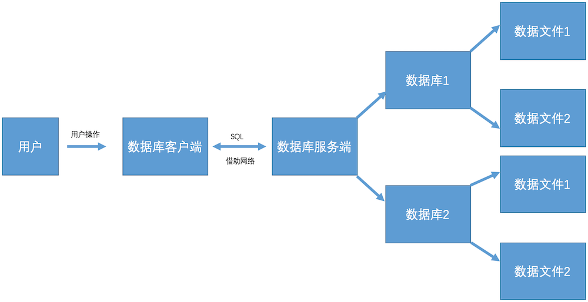

# Day62 MySQL数据库的基本使用

# 数据库

**学习目标**

- 能够知道数据库的作用

------

### 1. 数据库的介绍

数据库就是**存储和管理数据的仓库**，数据按照一定的格式进行存储，用户可以对数据库中的数据进行增加、修改、删除、查询等操作。

### 2. 数据库的分类

- 关系型数据库
- 非关系型数据库

**关系型数据库:**

是指采用了关系模型来组织数据的数据库，简单来说，**关系模型指的就是二维表格模型**，好比Excel文件中的表格，强调使用表格的方式存储数据。

**关系型数据库效果图:**


**关系型数据库中核心元素**

- 数据行
- 数据列
- 数据表
- 数据库(数据表的集合)

**常用的关系型数据库:**

- Oracle
- Microsoft SQL Server
- MySQL
- SQLite

**非关系型数据库:**

非关系型数据库，又被称为NoSQL（Not Only SQL )，意为不仅仅是SQL，对NoSQL 最普遍的定义是“非关联型的”，强调 Key-Value 的方式存储数据。

**常用的非关系型数据库:**

- MongoDB
- Redis

提示: 目前我们先学习一下关系型数据库，而非关系型数据库会在后面课程中进行学习，大家先知道一下即可。

**数据库排行榜效果图:**


### 3. 数据库的作用

数据库的作用就是存储和管理数据的，比如: 我们在京东网站上的浏览的商品列表数据，这些数据都会存储在数据库。

**用户浏览商品列表效果图:**


### 4. 数据库的特点

1. 持久化存储
2. 读写速度极高
3. 保证数据的有效性

### 5. 小结

- 数据库就是存储和管理数据的一个仓库，是用来持久化存储和快速读取数据的。
- 数据库可以分为**关系型数据库**和**非关系型数据库**

# 关系型数据库管理系统

**学习目标**

- 知道数据库和数据库管理系统的关系

------

### 1. 关系型数据库管理系统的介绍

数据库管理系统（英语全拼：Relational Database Management System，简称RDBMS）是**为管理关系型数据库而设计的软件系统，如果大家想要使用关系型数据库就需要安装数据库管理系统，其实就是一个应用软件**。

**关系型数据库管理系统可以分为:**

- 关系型数据库服务端软件
- 关系型数据库客户端软件

**关系型数据库服务端软件:**

主要负责管理不同的数据库，而每个数据库里面会有一系列数据文件，数据文件是用来存储数据的, 其实数据库就是一系列数据文件的集合。

**关系型数据库客户端软件:**

主要负责和关系型数据库服务端软件进行通信, 向服务端传输数据或者从服务端获取数据.

**关系型数据库管理系统的效果图:**



**说明:**

1. 用户操作关系型数据库客户端，实现数据库相关操作。
2. 关系数据库客户端借助网络使用SQL语言和关系型数据库服务端进行数据通信
3. 关系型数据库服务端管理着不同的数据库，每个数据库会有一系列的数据文件，数据都保存在数据文件里面，每个数据库可以理解成是一个文件夹。

通过上面的效果图我们可以得知，数据库客户端和数据库服务器想要通信需要使用SQL

**通信流程效果图**


### 2. SQL的介绍

SQL(Structured Query Language)是结构化查询语言，是一种用来操作RDBMS的数据库的语言。也就是说通过 SQL 可以操作 oracle,sql server,mysql,sqlite 等关系型的数据库。

SQL的作用是实现数据库客户端和数据库服务端之间的通信，SQL就是通信的桥梁。

**SQL语言主要分为：**

- **DQL：数据查询语言，用于对数据进行查询，如select**
- **DML：数据操作语言，对数据进行增加、修改、删除，如insert、update、delete**
- TPL：事务处理语言，对事务进行处理，包括begin transaction、commit、rollback
- DCL：数据控制语言，进行授权与权限回收，如grant、revoke
- DDL：数据定义语言，进行数据库、表的管理等，如create、drop

**说明:**

- 对于程序员来讲，重点是数据的增、删、改、查，必须熟练编写DQL、DML，能够编写DDL完成数据库、表的操作，其它操作如TPL、DCL了解即可.
- SQL语言不区分大小写

### 3. 小结

- 关系型数据库管理系统是一个软件，它可以管理不同的数据库，想要对数据库进行操作安装对应的关系型数据库管理系统软件即可。
- SQL的作用是实现数据库客户端和数据库服务端之间的通信，好比是通信桥梁。


# MySQL数据库

**学习目标**

- 能够知道MySQL数据库的安装

------

### 1. MySQL数据库的介绍

MySQL是一个关系型数据库管理系统，在 WEB 应用方面，MySQL是最好的 RDBMS (Relational Database Management System，关系数据库管理系统) 应用软件，它是由瑞典MySQL AB 公司开发，目前属于 Oracle 旗下产品，MySQL 是最流行的关系型数据库管理系统中的一个。

**MySQL的特点:**

1. MySQL是开源的，所以你不需要支付额外的费用。
2. MySQL支持大型的数据库。可以处理拥有上千万条记录的大型数据库。
3. MySQL使用标准的SQL数据语言形式。
4. MySQL可以安装在不同的操作系统，并且提供多种编程语言的操作接口。这些编程语言包括C、C++、Python、Java、Ruby等等。

### 2. MySQL数据库的安装

- MySQL数据库服务端软件的安装
- MySQL数据库客户端软件的安装

**MySQL数据库服务端软件的安装:**

在Ubuntu中打开终端，输入下面的命令:

```
sudo apt-get install mysql-server
```

**说明:**

- 目前大家使用的Ubuntu中已经安装好了MySQL服务端软件，无需再安装。

**显示MySQL服务端安装包信息效果图:**


**查看MySQL服务效果图:**


**ps说明**

- ps 查看当前系统中的进程
- -a 表示所有用户
- -u 表示显示用户名
- -x 表示显示所有的执行程序

**查看MySQL服务状态:**

```
sudo service mysql status
```

**停止MySQL服务:**

```
sudo service mysql stop
```

**启动MySQL服务:**

```
sudo service mysql start
```

**重启MySQL服务:**

```
sudo service mysql restart
```

**MySQL配置文件的介绍:**

配置文件路径为: /etc/mysql/mysql.conf.d/mysqld.cnf

**查看MySQL配置文件效果图:**


**主要配置信息说明:**

```
port表示端口号，默认为3306

bind-address表示服务器绑定的ip，默认为127.0.0.1

datadir表示数据库保存路径，默认为/var/lib/mysql

log_error表示错误日志，默认为/var/log/mysql/error.log
```

**MySQL数据库客户端软件的安装:**

客户端是程序员或者dba使用的软件，通过socket方式与服务端程序通信。

常用的MySQL数据库客户端软件有

1. 图形化界面客户端Navicat
2. 命令行客户端mysql

**图形化界面客户端Navicat的使用**

1. 可以到[Navicat官网下载](https://www.navicat.com.cn/download/navicat-for-mysql)
2. 将压缩文件拷贝到Ubuntu虚拟机中，放到桌面上，解压

**Navicat的使用说明:**

```
tar zxvf navicat112_mysql_cs_x64.tar.gz

./start_navicat
```

**启动效果图:**


**说明:**

点击两次“取消”按钮, 不需要进行安装。

**试用效果图**


**启动后效果图**


**试用过期的解决办法:**

当过期后，删除用户主目录下的.navicat64目录，继续再使用14天。

```
cd ~
rm -r .navicat64
```

**命令行客户端mysql的安装**

在Ubuntu中打开终端，输入下面的命令:

```
sudo apt-get install mysql-client
```

**说明:**

- 目前大家使用的Ubuntu中已经安装好了MySQL命令行客户端软件，无需再安装。

**显示MySQL客户端安装包信息效果图:**


**mysql命令的使用帮助:**

```
mysql --help
```

**MySQL客户端的使用:**

MySQL客户端连接MySQL服务端命令

```
mysql -uroot -p
```

**连接效果图:**


**说明:**

- -u: 表示MySQL服务端的用户名
- -p: 表示MySQL服务端的密码
- quit 或者 exit 或者 ctr + d 表示退出

### 3. 小结

- MySQL是一个关系型数据库管理系统
- 安装MySQL服务端软件使用: sudo apt-get install mysql-server
- 安装MySQL客户端软件使用: sudo apt-get install mysql-client
- 图形化MySQL客户端软件使用Navicat

# 数据类型和约束

**学习目标**

- 能够知道数据类型和数据约束的作用

------

大家都知道数据库中的数据保存在数据表中，在表中为了更加准确的存储数据，保证数据的正确有效，可以在创建表的时候，为表添加一些强制性的验证，比如:数据类型和约束。

### 1. 数据类型

数据类型是指在创建表的时候为表中字段指定数据类型，只有数据符合类型要求才能存储起来，使用数据类型的原则是:够用就行，尽量使用取值范围小的，而不用大的，这样可以更多的节省存储空间。

**常用数据类型如下:**

- 整数：int，bit
- 小数：decimal
- 字符串：varchar,char
- 日期时间: date, time, datetime
- 枚举类型(enum)

**数据类型说明:**

- decimal表示浮点数，如 decimal(5, 2) 表示共存5位数，小数占 2 位.
- char表示固定长度的字符串，如char(3)，如果填充'ab'时会补一个空格为'ab '，3表示字符数
- varchar表示可变长度的字符串，如varchar(3)，填充'ab'时就会存储'ab'，3表示字符数
- 对于图片、音频、视频等文件，不存储在数据库中，而是上传到某个服务器上，然后在表中存储这个文件的保存路径.
- 字符串 text 表示存储大文本，当字符大于 4000 时推荐使用, 比如技术博客.

### 2. 数据约束

约束是指数据在数据类型限定的基础上额外增加的要求.

**常见的约束如下:**

- 主键 primary key: 物理上存储的顺序. MySQL 建议所有表的主键字段都叫 id, 类型为 int unsigned.
- 非空 not null: 此字段不允许填写空值.
- 惟一 unique: 此字段的值不允许重复.
- 默认 default: 当不填写字段对应的值会使用默认值，如果填写时以填写为准.
- 外键 foreign key: 对关系字段进行约束, 当为关系字段填写值时, 会到关联的表中查询此值是否存在, 如果存在则填写成功, 如果不存在则填写失败并抛出异常.

### 3. 数据类型附录表

##### 1. 整数类型

| 类型        | 字节大小 | 有符号范围(Signed)                         | 无符号范围(Unsigned)     |
| :---------- | :------- | :----------------------------------------- | :----------------------- |
| TINYINT     | 1        | -128 ~ 127                                 | 0 ~ 255                  |
| SMALLINT    | 2        | -32768 ~ 32767                             | 0 ~ 65535                |
| MEDIUMINT   | 3        | -8388608 ~ 8388607                         | 0 ~ 16777215             |
| INT/INTEGER | 4        | -2147483648 ~2147483647                    | 0 ~ 4294967295           |
| BIGINT      | 8        | -9223372036854775808 ~ 9223372036854775807 | 0 ~ 18446744073709551615 |

##### 2. 字符串

| 类型     | 说明                        | 使用场景                     |
| :------- | :-------------------------- | :--------------------------- |
| CHAR     | 固定长度，小型数据          | 身份证号、手机号、电话、密码 |
| VARCHAR  | 可变长度，小型数据          | 姓名、地址、品牌、型号       |
| TEXT     | 可变长度，字符个数大于 4000 | 存储小型文章或者新闻         |
| LONGTEXT | 可变长度， 极大型文本数据   | 存储极大型文本数据           |

##### 3. 时间类型

| 类型      | 字节大小 | 示例                                                  |
| :-------- | :------- | :---------------------------------------------------- |
| DATE      | 4        | '2020-01-01'                                          |
| TIME      | 3        | '12:29:59'                                            |
| DATETIME  | 8        | '2020-01-01 12:29:59'                                 |
| YEAR      | 1        | '2017'                                                |
| TIMESTAMP | 4        | '1970-01-01 00:00:01' UTC ~ '2038-01-01 00:00:01' UTC |

### 4. 小结

- 常用的数据类型:
  - 整数：int，bit
  - 小数：decimal
  - 字符串：varchar,char
  - 日期时间: date, time, datetime
  - 枚举类型(enum)
- 常见的约束:
  - 主键约束 primary key
  - 非空约束 not null
  - 惟一约束 unique
  - 默认约束 default
  - 外键约束 foreign key
- 数据类型和约束保证了表中数据的准确性和完整性

# 图形化客户端Navicat

**学习目标**

- 能够使用 Navicat 创建数据库并向表中添加数据

------

### 1. Navicat的介绍

Navicat 是一套快速、可靠并价格适宜的数据库管理工具, 适用于三种平台: Windows、mac OS 及 Linux。 可以用来对本机或远程的 MySQL、SQL Server、SQLite、Oracle 等数据库进行管理及开发。 专门为简化数据库的操作而设计。 它的设计符合数据库管理员、开发人员及中小企业的需求。 Navicat 是一个数据库图形化客户端软件, 让你可以以安全并且简单的方式对数据库进行操作。

### 2. Navicat的使用

Navicat 的使用从三方面来介绍:

1. 和MySQL数据库服务端建立连接
2. 数据库的操作
3. 数据表的操作
4. 数据表中数据的操作

**和MySQL数据库服务端建立连接:**  

**数据库的操作:**

1. 创建数据库
2. 编辑数据库
3. 删除数据库

**创建数据库:**

1. 在左侧栏空白处右击，选择“新建数据库”进行点击。
   

2. 点击后弹出新窗口，填写数据库名称并选择编码格式

   

   说明:

   - 字符集: 就是编码格式，**选择utf8的国际通用编码格式, 支持中文**。
   - 排序规则: **utf8_general_ci 表示大小写不敏感，不区分大小写字母,a 和 A 在字符判断中会被当做一样的处理，区分大小写可以选择utf8_bin**

3. 双击选择创建好的数据库进行使用
   

**编辑数据库:**

1. 选择对应的数据库，右击选择“编辑数据库”
   
2. 点击“编辑数据库”，可以修改字符集、排序规则
   

**删除数据库:**

1. 选择对应的数据库，右击选择“删除数据库” 

**数据表的操作:**

1. 创建数据表
2. 编辑数据表
3. 删除数据表

**创建数据表:**

1. 选择数据库中的表，右击选择“新建表”
   
   

   **说明:**

   - id 字段: int 类型 无符号 主键 非空 自动增长
   - name 字段: varchar 类型 非空
   - sex 字段: char 类型 允许为空 默认值:男

**编辑数据表:**

1. 选择需要编辑的表，右击选择“设计表”  

**删除数据表:**

1. 选择对应的数据表，右击选择“删除表” 

**数据表中数据的操作:**

1. 查看表中数据
2. 添加数据
3. 修改数据
4. 删除数据

**查看表中数据:**

1. 双击对应的表，查看表中数据 

**添加数据:**

1. 点击加号添加数据，数据添加完成后需要点击对号让数据生效 

**修改数据:**

1. 选择需要修改的记录，进行编辑修改即可，修改后需要点击对号让数据生效 

**删除数据:**

1. 选中要删除的记录，右击选择“删除记录”或者点击减号进行删除 

   **说明:**

   - 对于重要数据，可以添加一个字段作为标识，而不是进行物理删除.

### 3. 小结

- Navicat 是一个数据库图形化客户端软件，对数据库、数据表以及表中数据提供了非常方便、简单的操作
- 在工作中为了提高开发效率往往会使用Navicat, 但是学习阶段为了夯实同学们的基础, 能够在面试和工作中在处理数据的时候得心应手, 我们使用命令行客户端的操作而不适用图形化工具。

# 命令行客户端MySQL的使用

**学习目标**

- 能够知道使用命令行连接数据库命令
- 能够写出增、删、改、查的SQL语句

------

### 1. 登录和登出数据库

**登录数据库:**

输入下面命令:

```sql
mysql -uroot -p
```

**说明:**

- -u 后面是登录的用户名
- -p 后面是登录密码, 如果不填写, 回车之后会提示输入密码

**登录数据库效果图:**


**登录成功后, 输入如下命令查看效果：**

```sql
# 显示当前时间
select now();
```

**登出(退出)数据库:**

```sql
quit 或 exit 或 ctrl + d
```

### 2. 数据库操作的SQL语句

1. 查看所有数据库

   ```sql
   show databases;
   ```

2. 创建数据库

   ```sql
   create database 数据库名 charset=utf8;
   例：
   create database python charset=utf8;
   ```

3. 使用数据库

   ```sql
   use 数据库名;
   ```

4. 查看当前使用的数据库

   ```sql
   select database();
   ```

5. 删除数据库-慎重

   ```sql
   drop database 数据库名;
   例：
   drop database python;
   ```

### 3. 表结构操作的SQL语句

1. 查看当前数据库中所有表

   ```sql
   show tables;
   ```

2. 创建表

   ```sql
   create table students(
    id int unsigned primary key auto_increment not null,
    name varchar(20) not null,
    age tinyint unsigned default 0,
    height decimal(5,2),
    gender enum('男','女','人妖','保密')
   );
   ```

   **说明:**

   ```sql
   create table 表名(
   字段名称 数据类型  可选的约束条件,
   column1 datatype contrai,
   ...
   );
   ```

3. 修改表-添加字段

   ```sql
   alter table 表名 add 列名 类型 约束;
   例：
   alter table students add birthday datetime;
   ```

4. 修改表-修改字段类型

   ```sql
   alter table 表名 modify 列名 类型 约束;
   例：
   alter table students modify birthday date not null;
   ```

   **说明:**

   - modify: 只能修改字段类型或者约束，不能修改字段名

5. 修改表-修改字段名和字段类型

   ```sql
   alter table 表名 change 原名 新名 类型及约束;
   例：
   alter table students change birthday birth datetime not null;
   ```

   **说明:**

   - change: 既能对字段重命名又能修改字段类型还能修改约束

6. 修改表-删除字段

   ```sql
   alter table 表名 drop 列名;
   例：
   alter table students drop birthday;
   ```

7. 查看创表SQL语句

   ```sql
   show create table 表名;
   例：
   show create table students;
   ```

8. 查看创库SQL语句

   ```sql
   show create database 数据库名;
   例：
   show create database mytest;
   ```

9. 删除表

   ```sql
   drop table 表名;
   例：
   drop table students;
   ```

### 4. 表数据操作的SQL语句

1. 查询数据

   ```sql
   -- 1. 查询所有列
   select * from 表名;
   例：
   select * from students;
   -- 2. 查询指定列
   select 列1,列2,... from 表名;
   例：
   select id,name from students;
   ```

2. 添加数据

   ```sql
   -- 1. 全列插入：值的顺序与表结构字段的顺序完全一一对应
   insert into 表名 values (...)
   例:
   insert into students values(0, 'xx', default, default, '男');
   -- 2. 部分列插入：值的顺序与给出的列顺序对应
   insert into 表名 (列1,...) values(值1,...)
   例:
   insert into students(name, age) values('王二小', 15);
   -- 3. 全列多行插入
   insert into 表名 values(...),(...)...;
   例:
   insert into students values(0, '张飞', 55, 1.75, '男'),(0, '关羽', 58, 1.85, '男');
   -- 4. 部分列多行插入
   insert into 表名(列1,...) values(值1,...),(值1,...)...;
   例：
   insert into students(name, height) values('刘备', 1.75),('曹操', 1.6);
   ```

   **说明:**

   - 主键列是自动增长，但是在全列插入时需要占位，通常使用空值(0或者null或者default)
   - 在全列插入时，如果字段列有默认值可以使用 default 来占位，插入后的数据就是之前设置的默认值

3. 修改数据

   ```sql
   update 表名 set 列1=值1,列2=值2... where 条件
   例：
   update students set age = 18, gender = '女' where id = 6;
   ```

4. 删除数据

   ```sql
   delete from 表名 where 条件
   例：
   delete from students where id=5;
   ```

   问题:

   上面的操作称之为物理删除，一旦删除就不容易恢复，我们可以使用逻辑删除的方式来解决这个问题。

   ```sql
   -- 添加删除表示字段，0表示未删除 1表示删除
   alter table students add isdelete bit default 0;
   -- 逻辑删除数据
   update students set isdelete = 1 where id = 8;
   ```

   **说明:**

   - 逻辑删除，本质就是修改操作

### 5. 小结

- 登录数据库: mysql -uroot -p
- 退出数据库: quit 或者 exit 或者 ctr + d
- 创建数据库: create database 数据库名 charset=utf8;
- 使用数据库: use 数据库名;
- 删除数据库: drop database 数据库名;
- 创建表: create table 表名(字段名 字段类型 约束, ...);
- 修改表-添加字段: alter table 表名 add 字段名 字段类型 约束
- 修改表-修改字段类型: alter table 表名 modify 字段名 字段类型 约束
- 修改表-修改字段名和字段类型: alter table 表名 change 原字段名 新字段名 字段类型 约束
- 修改表-删除字段: alter table 表名 drop 字段名;
- 删除表: drop table 表名;
- 查询数据: select * from 表名; 或者 select 列1,列2,... from 表名;
- 插入数据: insert into 表名 values (...) 或者 insert into 表名 (列1,...) values(值1,...)
- 修改数据: update 表名 set 列1=值1,列2=值2... where 条件
- 删除数据: delete from 表名 where 条件

# as和distinct关键字

**学习目标**

- 能够知道去除重复数据行的关键字

------

### 1. as关键字

在使用SQL语句显示结果的时候，往往在屏幕显示的字段名并不具备良好的可读性，此时可以使用 as 给字段起一个别名。

1. 使用 as 给字段起别名

   ```sql
   select id as 序号, name as 名字, gender as 性别 from students;
   ```

2. 可以通过 as 给表起别名

   ```sql
   -- 如果是单表查询 可以省略表名
   select id, name, gender from students;
   
   -- 表名.字段名
   select students.id,students.name,students.gender from students;
   
   -- 可以通过 as 给表起别名 
   select s.id,s.name,s.gender from students as s;
   ```

   **说明:**

   - 在这里给表起别名看起来并没有什么意义,然而并不是这样的，我们在后期学习 自连接 的时候，必须要对表起别名。

### 2. distinct关键字

distinct可以去除重复数据行。

```sql
select distinct 列1,... from 表名;

例： 查询班级中学生的性别
select name, gender from students;

-- 看到了很多重复数据 想要对其中重复数据行进行去重操作可以使用 distinct
select distinct name, gender from students;
```

### 3. 小结

- as 关键字可以给表中字段 或者 表名起别名
- distinct 关键字可以去除重复数据行。

# where条件查询

**学习目标**

- 能够写出模糊查询的SQL语句

------

### 1. where条件查询的介绍

使用where条件查询可以对表中的数据进行筛选，条件成立的记录会出现在结果集中。

**where语句支持的运算符:**

1. 比较运算符
2. 逻辑运算符
3. 模糊查询
4. 范围查询
5. 空判断

**where条件查询语法格式如下:**

```sql
select * from 表名 where 条件;
例：
select * from students where id = 1;
```

### 2. 比较运算符查询

1. 等于: =
2. 大于: >
3. 大于等于: >=
4. 小于: <
5. 小于等于: <=
6. 不等于: != 或 <>

**例1：查询编号大于3的学生:**

```sql
select * from students where id > 3;
```

**例2：查询编号不大于4的学生:**

```sql
select * from students where id <= 4;
```

**例3：查询姓名不是“黄蓉”的学生:**

```sql
select * from students where name != '黄蓉';
```

**例4：查询没被删除的学生:**

```sql
select * from students where is_delete=0;
```

### 3. 逻辑运算符查询

1. and
2. or
3. not

**例1：查询编号大于3的女同学:**

```sql
select * from students where id > 3 and gender=0;
```

**例2：查询编号小于4或没被删除的学生:**

```sql
select * from students where id < 4 or is_delete=0;
```

**例3：查询年龄不在10岁到15岁之间的学生:**

```sql
select * from students where not (age >= 10 and age <= 15);
```

**说明:**

- 多个条件判断想要作为一个整体，可以结合‘()’。

### 4. 模糊查询

1. like是模糊查询关键字
2. %表示任意多个任意字符
3. _表示一个任意字符

**例1：查询姓黄的学生:**

```sql
select * from students where name like '黄%';
```

**例2：查询姓黄并且“名”是一个字的学生:**

```sql
select * from students where name like '黄_';
```

**例3：查询姓黄或叫靖的学生:**

```sql
select * from students where name like '黄%' or name like '%靖';
```

### 5. 范围查询

1. between .. and .. 表示在一个连续的范围内查询
2. in 表示在一个非连续的范围内查询

**例1：查询编号为3至8的学生:**

```sql
select * from students where id between 3 and 8;
```

**例2：查询编号不是3至8的男生:**

```
select * from students where (not id between 3 and 8) and gender='男';
```

### 6. 空判断查询

1. 判断为空使用: is null
2. 判断非空使用: is not null

**例1：查询没有填写身高的学生:**

```sql
select * from students where height is null;
```

**注意:**

1. 不能使用 where height = null 判断为空
2. 不能使用 where height != null 判断非空
3. null 不等于 '' 空字符串

### 7. 小结

- 常见的比较运算符有 >,<,>=,<=,!=
- 逻辑运算符and表示多个条件同时成立则为真，or表示多个条件有一个成立则为真，not表示对条件取反
- like和%结合使用表示任意多个任意字符，like和_结合使用表示一个任意字符
- between-and限制连续性范围 in限制非连续性范围
- 判断为空使用: is null
- 判断非空使用: is not null

# 排序

**学习目标**

- 能够知道升序查询和降序查询的关键字

------

### 1. 排序查询语法

排序查询语法：

```sql
select * from 表名 order by 列1 asc|desc [,列2 asc|desc,...]
```

**语法说明:**

1. 先按照列1进行排序，如果列1的值相同时，则按照 列2 排序，以此类推
2. asc从小到大排列，即升序
3. desc从大到小排序，即降序
4. 默认按照列值从小到大排列（即asc关键字）

**例1：查询未删除男生信息，按学号降序:**

```sql
select * from students where gender=1 and is_delete=0 order by id desc;
```

**例2：显示所有的学生信息，先按照年龄从大-->小排序，当年龄相同时 按照身高从高-->矮排序:**

```sql
select * from students  order by age desc,height desc;
```

### 2. 小结

1. 排序使用 order by 关键字
2. asc 表示升序
3. desc 表示降序

# 分页查询

**学习目标**

- 能够使用 limit 关键字实现分页查询

------

### 1. 分页查询的介绍

当我们在京东购物，浏览商品列表的时候，由于数据特别多，一页显示不完，一页一页的进行显示，这就是分页查询

### 2. 分页查询的语法

```sql
select * from 表名 limit start,count
```

**说明:**

1. limit是分页查询关键字
2. start表示开始行索引，默认是0
3. count表示查询条数

**例1：查询前3行男生信息:**

```sql
select * from students where gender=1 limit 0,3;
简写
select * from students where gender=1 limit 3;
```

### 3. 分页查询案例

已知每页显示m条数据，求第n页显示的数据

提示: 关键是求每页的开始行索引

**查询学生表，获取第n页数据的SQL语句:**

```sql
select * from students limit (n-1)*m,m
```

### 4. 小结

- 使用 limit 关键字可以限制数据显示数量，通过 limit 关键可以完成分页查询
- limit 关键字后面的第一个参数是开始行索引(默认是0，不写就是0)，第二个参数是查询条数