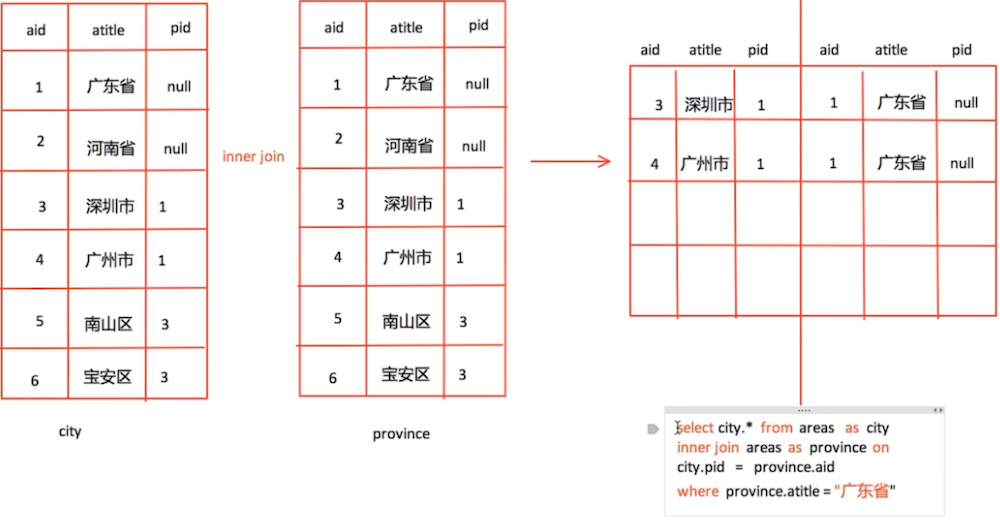
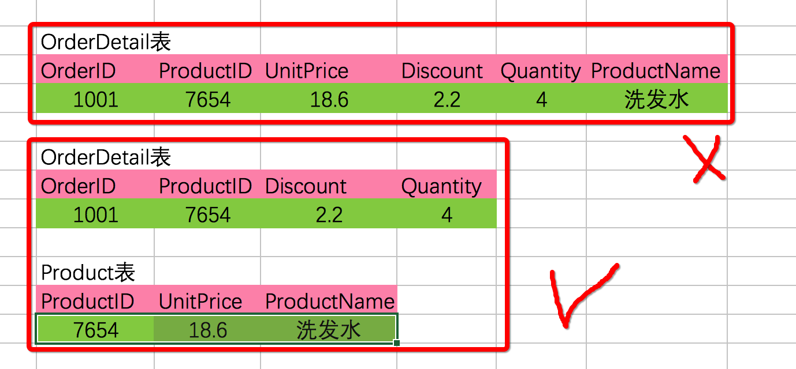

# Day63 MySQL数据库的条件查询

# 聚合函数

**学习目标**

- 能够写出查询总行数的SQL语句

------

### 1. 聚合函数的介绍

聚合函数又叫组函数，通常是对表中的数据进行统计和计算，一般结合分组(group by)来使用，用于统计和计算分组数据。

**常用的聚合函数:**

1. count(col): 表示求指定列的总行数
2. max(col): 表示求指定列的最大值
3. min(col): 表示求指定列的最小值
4. sum(col): 表示求指定列的和
5. avg(col): 表示求指定列的平均值

### 2. 求总行数

```sql
-- 返回非NULL数据的总行数.
select count(height) from students; 
-- 返回总行数，包含null值记录;
select count(*) from students;
```

### 3. 求最大值

```sql
-- 查询女生的编号最大值
select max(id) from students where gender = 2;
```

### 4. 求最小值

```sql
-- 查询未删除的学生最小编号
select min(id) from students where is_delete = 0;
```

### 5. 求和

```sql
-- 查询男生的总身高
select sum(height) from students where gender = 1;
-- 平均身高
select sum(height) / count(*) from students where gender = 1;
```

### 6. 求平均值

```sql
-- 求男生的平均身高, 聚合函数不统计null值，平均身高有误
select avg(height) from students where gender = 1;
-- 求男生的平均身高, 包含身高是null的
select avg(ifnull(height,0)) from students where gender = 1;
```

**说明**

- ifnull函数: 表示判断指定字段的值是否为null，如果为空使用自己提供的值。

### 7. 聚合函数的特点

- 聚合函数默认忽略字段为null的记录 要想列值为null的记录也参与计算，必须使用ifnull函数对null值做替换。

### 8. 小结

- count(col): 表示求指定列的总行数
- max(col): 表示求指定列的最大值
- min(col): 表示求指定列的最小值
- sum(col): 表示求指定列的和
- avg(col): 表示求指定列的平均值

# 分组查询

**学习目标**

- 能够写出分组查询的SQL语句

------

### 1. 分组查询介绍

分组查询就是将查询结果按照指定字段进行分组，字段中数据相等的分为一组。

**分组查询基本的语法格式如下：**

GROUP BY 列名 [HAVING 条件表达式] [WITH ROLLUP]

**说明:**

- 列名: 是指按照指定字段的值进行分组。
- HAVING 条件表达式: 用来过滤分组后的数据。
- WITH ROLLUP：在所有记录的最后加上一条记录，显示select查询时聚合函数的统计和计算结果

### 2. group by的使用

group by可用于单个字段分组，也可用于多个字段分组

```sql
-- 根据gender字段来分组
select gender from students group by gender;
-- 根据name和gender字段进行分组
select name, gender from students group by name, gender;
```

### 3. group by + group_concat()的使用

group_concat(字段名): 统计每个分组指定字段的信息集合，每个信息之间使用逗号进行分割

```sql
-- 根据gender字段进行分组， 查询gender字段和分组的name字段信息
select gender,group_concat(name) from students group by gender;
```

### 4. group by + 聚合函数的使用

```sql
-- 统计不同性别的人的平均年龄
select gender,avg(age) from students group by gender;
-- 统计不同性别的人的个数
select gender,count(*) from students group by gender;
```

### 5. group by + having的使用

having作用和where类似都是过滤数据的，但having是过滤分组数据的，只能用于group by

```sql
-- 根据gender字段进行分组，统计分组条数大于2的
select gender,count(*) from students group by gender having count(*)>2;
```

### 6. group by + with rollup的使用

with rollup的作用是：在最后记录后面新增一行，显示select查询时聚合函数的统计和计算结果

```sql
-- 根据gender字段进行分组，汇总总人数
select gender,count(*) from students group by gender with rollup;
-- 根据gender字段进行分组，汇总所有人的年龄
select gender,group_concat(age) from students group by gender with rollup;
```

### 7. 小结

- group by 根据指定的一个或者多个字段对数据进行分组
- group_concat(字段名)函数是统计每个分组指定字段的信息集合
- 聚合函数在和 group by 结合使用时, 聚合函数统计和计算的是每个分组的数据
- having 是对分组数据进行条件过滤
- with rollup在最后记录后面新增一行，显示select查询时聚合函数的统计和计算结果

# 连接查询-内连接

**学习目标**

- 能够写出内连接查询的SQL语句

------

### 1. 连接查询的介绍

连接查询可以实现多个表的查询，当查询的字段数据来自不同的表就可以使用连接查询来完成。

连接查询可以分为:

1. 内连接查询
2. 左连接查询
3. 右连接查询
4. 自连接查询

### 2. 内连接查询

查询两个表中符合条件的共有记录

**内连接查询效果图:**


**内连接查询语法格式:**

```sql
select 字段 from 表1 inner join 表2 on 表1.字段1 = 表2.字段2
```

**说明:**

- inner join 就是内连接查询关键字
- on 就是连接查询条件

**例1：使用内连接查询学生表与班级表:**

```sql
select * from students as s inner join classes as c on s.cls_id = c.id;
```

### 3. 小结

- 内连接使用inner join .. on .., on 表示两个表的连接查询条件
- 内连接根据连接查询条件取出两个表的 “交集”

# 连接查询-左连接

**学习目标**

- 能够写出左连接查询的SQL语句

------

### 1. 左连接查询

以左表为主根据条件查询右表数据，如果根据条件查询右表数据不存在使用null值填充

**左连接查询效果图:**


**左连接查询语法格式:**

```sql
select 字段 from 表1 left join 表2 on 表1.字段1 = 表2.字段2
```

**说明:**

- left join 就是左连接查询关键字
- on 就是连接查询条件
- 表1 是左表
- 表2 是右表

**例1：使用左连接查询学生表与班级表:**

```sql
select * from students as s left join classes as c on s.cls_id = c.id;
```

### 2. 小结

- 左连接使用left join .. on .., on 表示两个表的连接查询条件
- 左连接以左表为主根据条件查询右表数据，右表数据不存在使用null值填充。

# 连接查询-右连接

**学习目标**

- 能够写出右连接查询的SQL语句

------

### 1. 右连接查询

以右表为主根据条件查询左表数据，如果根据条件查询左表数据不存在使用null值填充

**右连接查询效果图:**


**右连接查询语法格式:**

```sql
select 字段 from 表1 right join 表2 on 表1.字段1 = 表2.字段2
```

**说明:**

- right join 就是右连接查询关键字
- on 就是连接查询条件
- 表1 是左表
- 表2 是右表

**例1：使用右连接查询学生表与班级表:**

```sql
select * from students as s right join classes as c on s.cls_id = c.id;
```

### 2. 小结

- 右连接使用right join .. on .., on 表示两个表的连接查询条件
- 右连接以右表为主根据条件查询左表数据，左表数据不存在使用null值填充。

# 连接查询-自连接

**学习目标**

- 能够写出自连接查询的SQL语句

------

### 1. 自连接查询

左表和右表是同一个表，根据连接查询条件查询两个表中的数据。

**区域表效果图**


**例1：查询省的名称为“山西省”的所有城市**



**创建areas表:**

```sql
create table areas(
    id varchar(30) not null primary key, 
    title varchar(30), 
    pid varchar(30)
);
```

**执行sql文件给areas表导入数据:**

```sql
source areas.sql;
```

**说明:**

- source 表示执行的sql文件

**自连接查询的用法:**

```sql
select c.id, c.title, c.pid, p.title from areas as c inner join areas as p on c.pid = p.id where p.title = '山西省';
```

**说明:**

- 自连接查询必须对表起别名

### 小结

- 自连接查询就是把一张表模拟成左右两张表，然后进行连表查询。
- 自连接就是一种特殊的连接方式，连接的表还是本身这张表

# 子查询

**学习目标**

- 能够写出子查询的SQL语句

------

### 1. 子查询的介绍

在一个 select 语句中,嵌入了另外一个 select 语句, 那么被嵌入的 select 语句称之为子查询语句，外部那个select语句则称为主查询.

**主查询和子查询的关系:**

1. 子查询是嵌入到主查询中
2. 子查询是辅助主查询的,要么充当条件,要么充当数据源
3. 子查询是可以独立存在的语句,是一条完整的 select 语句

### 2. 子查询的使用

**例1. 查询大于平均年龄的学生:**

```sql
select * from students where age > (select avg(age) from students);
```

**例2. 查询学生在班的所有班级名字:**

```sql
select name from classes where id in (select cls_id from students where cls_id is not null);
```

**例3. 查找年龄最大,身高最高的学生:**

```sql
select * from students where (age, height) =  (select max(age), max(height) from students);
```

### 3. 小结

- 子查询是一个完整的SQL语句，子查询被嵌入到一对小括号里面

# 数据库设计之三范式

**学习目标**

- 能够知道一个表结构的设计是否符合三范式的要求

------

### 1. 数据库设计之三范式的介绍

范式: 对设计数据库提出的一些规范，目前有迹可寻的共有8种范式，一般遵守3范式即可。

- 第一范式（1NF）: 强调的是列的原子性，即列不能够再分成其他几列。
- 第二范式（2NF）: 满足 1NF，另外包含两部分内容，一是表必须有一个主键；二是非主键字段 必须完全依赖于主键，而不能只依赖于主键的一部分。
- 第三范式（3NF）: 满足 2NF，另外非主键列必须直接依赖于主键，不能存在传递依赖。即不能存在：非主键列 A 依赖于非主键列 B，非主键列 B 依赖于主键的情况。

### 2. 第一范式的介绍

**如图所示的表结构:**


**说明:**

- 这种表结构设计就没有达到 1NF，要符合 1NF 我们只需把列拆分，即：把 contact 字段拆分成 name 、tel、addr 等字段。

### 3. 第二范式的介绍

**如图所示的表结构:**



**说明:**

- 这种表结构设计就没有达到 2NF，因为 Discount（折扣），Quantity（数量）完全依赖于主键（OrderID），而 UnitPrice单价，ProductName产品名称 只依赖于 ProductID, 所以 OrderDetail 表不符合 2NF。
- 我们可以把【OrderDetail】表拆分为【OrderDetail】（OrderID，ProductID，Discount，Quantity）和【Product】（ProductID，UnitPrice，ProductName）这样就符合第二范式了。

### 4. 第三范式的介绍

**如图所示的表结构:**


**说明:**

- 这种表结构设计就没有达到 3NF，因为 OrderDate，CustomerID，CustomerName，CustomerAddr，CustomerCity 等非主键列都完全依赖于主键（OrderID），所以符合 2NF。不过问题是 CustomerName，CustomerAddr，CustomerCity 直接依赖的是 CustomerID（非主键列），而不是直接依赖于主键，它是通过传递才依赖于主键，所以不符合 3NF。
- 我们可以把【Order】表拆分为【Order】（OrderID，OrderDate，CustomerID）和【Customer】（CustomerID，CustomerName，CustomerAddr，CustomerCity）从而达到 3NF。

### 5. E-R模型的介绍

E-R模型即实体-关系模型，E-R模型就是描述数据库存储数据的结构模型。

**E-R模型的使用场景:**

1. 对于大型公司开发项目，我们需要根据产品经理的设计，我们先使用建模工具, 如:power designer，db desinger等这些软件来画出实体-关系模型(E-R模型)
2. 然后根据三范式设计数据库表结构

**E-R模型的效果图:**


**说明:**

- 实体: 用矩形表示，并标注实体名称
- 属性: 用椭圆表示，并标注属性名称，
- 关系: 用菱形表示，并标注关系名称
  - 一对一
  - 一对多
  - 多对多

**一对一的关系:**


**说明:**

- 关系也是一种数据，需要通过一个字段存储在表中
- 1对1关系，在表A或表B中创建一个字段，存储另一个表的主键值

**一对多的关系:**


**说明:**

- 1对多关系，在多的一方表(学生表)中创建一个字段，存储班级表的主键值

**多对多的关系:**


**说明:**

- 多对多关系，新建一张表C，这个表只有两个字段，一个用于存储A的主键值，一个用于存储B的主键值

### 5. 小结

- 范式就是设计数据库的一些通用规范。
  - 1NF强调字段是最小单元，不可再分
  - 2NF强调在1NF基础上必须要有主键和非主键字段必须完全依赖于主键，也就是说 不能部分依赖
  - 3MF强调在2NF基础上 非主键字段必须直接依赖于主键，也就是说不能传递依赖(间接依赖)。
- E-R模型由 实体、属性、实体之间的关系构成，主要用来描述数据库中表结构。
- 开发流程是先画出E-R模型，然后根据三范式设计数据库中的表结构

# 外键SQL语句的编写

**学习目标**

- 能够写出删除外键约束的SQL语句

------

### 1. 外键约束作用

外键约束:对外键字段的值进行更新和插入时会和引用表中字段的数据进行验证，数据如果不合法则更新和插入会失败，保证数据的有效性

### 2. 对于已经存在的字段添加外键约束

```sql
-- 为cls_id字段添加外键约束
alter table students add foreign key(cls_id) references classes(id);
```

### 3. 在创建数据表时设置外键约束

```sql
-- 创建学校表
create table school(
    id int not null primary key auto_increment, 
    name varchar(10)
);

-- 创建老师表
create table teacher(
    id int not null primary key auto_increment, 
    name varchar(10), 
    s_id int not null, 
    foreign key(s_id) references school(id)
);
```

### 4. 删除外键约束

```sql
-- 需要先获取外键约束名称,该名称系统会自动生成,可以通过查看表创建语句来获取名称
show create table teacher;

-- 获取名称之后就可以根据名称来删除外键约束
alter table teacher drop foreign key 外键名;
```

### 5. 小结

- 添加外键约束: alter table 从表 add foreign key(外键字段) references 主表(主键字段);
- 删除外键约束: alter table 表名 drop foreign key 外键名;

# 演练-分组和聚合函数的组合使用

**学习目标**

- 能够写出分组和聚合函数组合使用的SQL语句

------

### 1. 数据准备

```sql
-- 创建 "京东" 数据库
create database jing_dong charset=utf8;

-- 使用 "京东" 数据库
use jing_dong;

-- 创建一个商品goods数据表
create table goods(
    id int unsigned primary key auto_increment not null,
    name varchar(150) not null,
    cate_name varchar(40) not null,
    brand_name varchar(40) not null,
    price decimal(10,3) not null default 0,
    is_show bit not null default 1,
    is_saleoff bit not null default 0
);

-- 向goods表中插入数据

insert into goods values(0,'r510vc 15.6英寸笔记本','笔记本','华硕','3399',default,default); 
insert into goods values(0,'y400n 14.0英寸笔记本电脑','笔记本','联想','4999',default,default);
insert into goods values(0,'g150th 15.6英寸游戏本','游戏本','雷神','8499',default,default); 
insert into goods values(0,'x550cc 15.6英寸笔记本','笔记本','华硕','2799',default,default); 
insert into goods values(0,'x240 超极本','超级本','联想','4880',default,default); 
insert into goods values(0,'u330p 13.3英寸超极本','超级本','联想','4299',default,default); 
insert into goods values(0,'svp13226scb 触控超极本','超级本','索尼','7999',default,default); 
insert into goods values(0,'ipad mini 7.9英寸平板电脑','平板电脑','苹果','1998',default,default);
insert into goods values(0,'ipad air 9.7英寸平板电脑','平板电脑','苹果','3388',default,default); 
insert into goods values(0,'ipad mini 配备 retina 显示屏','平板电脑','苹果','2788',default,default); 
insert into goods values(0,'ideacentre c340 20英寸一体电脑 ','台式机','联想','3499',default,default); 
insert into goods values(0,'vostro 3800-r1206 台式电脑','台式机','戴尔','2899',default,default); 
insert into goods values(0,'imac me086ch/a 21.5英寸一体电脑','台式机','苹果','9188',default,default); 
insert into goods values(0,'at7-7414lp 台式电脑 linux ）','台式机','宏碁','3699',default,default); 
insert into goods values(0,'z220sff f4f06pa工作站','服务器/工作站','惠普','4288',default,default); 
insert into goods values(0,'poweredge ii服务器','服务器/工作站','戴尔','5388',default,default); 
insert into goods values(0,'mac pro专业级台式电脑','服务器/工作站','苹果','28888',default,default); 
insert into goods values(0,'hmz-t3w 头戴显示设备','笔记本配件','索尼','6999',default,default); 
insert into goods values(0,'商务双肩背包','笔记本配件','索尼','99',default,default); 
insert into goods values(0,'x3250 m4机架式服务器','服务器/工作站','ibm','6888',default,default); 
insert into goods values(0,'商务双肩背包','笔记本配件','索尼','99',default,default);
```

**表结构说明:**

- id 表示主键 自增
- name 表示商品名称
- cate_name 表示分类名称
- brand_name 表示品牌名称
- price 表示价格
- is_show 表示是否显示
- is_saleoff 表示是否售完

### 2. SQL语句演练

1. 查询类型cate_name为 '超极本' 的商品名称、价格

   ```sql
    select name,price from goods where cate_name = '超级本';
   ```

2. 显示商品的分类

   ```sql
    select cate_name from goods group by cate_name;
   ```

3. 求所有电脑产品的平均价格,并且保留两位小数

   ```sql
    select round(avg(price),2) as avg_price from goods;
   ```

4. 显示每种商品的平均价格

   ```sql
    select cate_name,avg(price) from goods group by cate_name;
   ```

5. 查询每种类型的商品中 最贵、最便宜、平均价、数量

   ```sql
    select cate_name,max(price),min(price),avg(price),count(*) 
    from goods group by cate_name;
   ```

6. 查询所有价格大于平均价格的商品，并且按价格降序排序

   ```sql
    select id,name,price from goods 
    where price > (select round(avg(price),2) as avg_price from goods) 
    order by price desc;
   ```