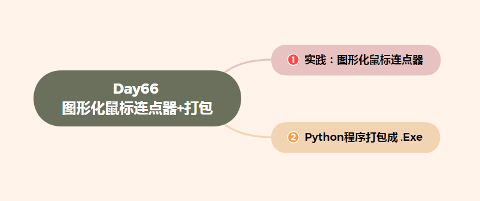
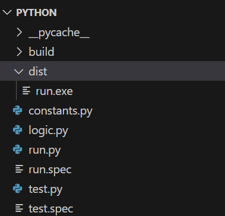

# Day66 实践：图形化鼠标连点器 + Python程序打包成 .exe


[TOC]





# 一、实践：图形化鼠标连点器


```python
# ----------------------------------------------------------
# 免责声明：
# 本代码仅供学习和参考使用，不得用于任何商业用途。
# 作者不对代码的正确性、稳定性或适用性做出任何保证。
# 作者不承担任何因使用本代码而导致的任何直接或间接损失。
# 使用者应该在理解代码的基础上谨慎使用，并自行承担风险。
# 软件名称：鱼猫鼠标连点器
# 软件版本：0.3.0
# 最后编辑时间：2023/5/21
# ----------------------------------------------------------

 # 导入类库
import time
import threading
import pynput.mouse  # 导入pynput库中的mouse模块，用于控制鼠标
from pynput.keyboard import Key, Listener  # 导入pynput库中的keyboard模块，用于监听键盘事件
from tkinter import *  # 导入tkinter库，用于创建GUI界面
import ctypes

LEFT = 0  # 定义常量，表示左键的编号为0
RIGHT = 1  # 定义常量，表示右键的编号为1


# 鼠标连点控制类
class MouseClick:
    def __init__(self, button, time):
        self.mouse = pynput.mouse.Controller()  # 创建鼠标控制器对象
        self.running = False  # 确认是否在运行
        self.time = time  # 连点时间间隔
        self.button = button  # 连点的鼠标按钮
        # 开启主监听线程，监听键盘按键事件
        self.listener = Listener(on_press=self.key_press)
        self.listener.start()

    def key_press(self, key):
        # 键盘按键事件处理函数
        if key == Key.f8:
            if self.running:
                self.running = False
                state.delete('0.0', END)
                state.insert(INSERT, "当前状态：鱼猫工作中，但是并没有开始连续点击ฅ(°ω°ฅ)\n")
                state.insert(INSERT, "按下 Esc 让鱼猫进入摸鱼状态。\n")
                state.insert(INSERT, "按下 F8 开始连续点击。\n")
                # 停止连点也需要调用这个函数
                self.mouse_click()
            else:
                self.running = True
                state.delete('0.0', END)
                state.insert(INSERT, "当前状态：连续点击中◥(ฅº￦ºฅ)◤\n")
                state.insert(INSERT, "不需要按Esc，只需再次按下F8就可以停止连续点击，铲屎官要记住瞄~\n")
                self.mouse_click()
        elif key == Key.esc:
            btn_start['state'] = NORMAL
            state.delete('0.0', END)
            state.insert(INSERT, "当前状态：鱼猫空闲摸鱼中ฅ^•ﻌ•^ฅ\n")
            state.insert(
                INSERT, "选择要连续点击的鼠标按钮并设置时间间隔，之后点击“开始”按钮。")
            # 退出主监听线程
            self.listener.stop()

    def mouse_click(self):
        # 这里还需要额外线程进行监听，为了能够更新self.running，防止陷入死循环
        key_listener = Listener(on_press=self.key_press)
        key_listener.start()
        while self.running:
            self.mouse.click(self.button)  # 模拟鼠标点击
            time.sleep(self.time)  # 间隔一定时间
        key_listener.stop()


# 新线程处理函数
def new_thread_start(button, time):
    MouseClick(button, time)


# 开始按键处理函数
def start():
    try:
        # 将文本框读到的字符串转化为浮点数
        time = float(input.get())
        if mouse.get() == LEFT:
            button = pynput.mouse.Button.left
        elif mouse.get() == RIGHT:
            button = pynput.mouse.Button.right
        btn_start['state'] = DISABLED
        state.delete('0.0', END)
        state.insert(INSERT, "当前状态：鱼猫工作中，但是并没有开始连续点击ฅ(°ω°ฅ)\n")
        state.insert(INSERT, "按下 Esc 让鱼猫进入摸鱼状态。\n")
        state.insert(INSERT, "按下 F8 开始连续点击。\n")
        # 开启新线程，避免GUI卡死
        t = threading.Thread(target=new_thread_start, args=(button, time))
        # 开启守护线程，这样在GUI意外关闭时线程能正常退出
        t.start()
        # 不能使用 t.join()，# 否则也会卡死
    except:
        state.delete('0.0', END)
        state.insert(INSERT, "铲屎官的时间输入格式错误瞄！\n")
        state.insert(INSERT, "铲屎官应该输入整数或小数瞄~")
        from tkinter import Tk


# -------------------------------- 以下是GUI界面 --------------------------------
root = Tk()  # 创建Tkinter窗口对象

# 高dpi设置
ctypes.windll.shcore.SetProcessDpiAwareness(1)  # 设置高dpi
ScaleFactor = ctypes.windll.shcore.GetScaleFactorForDevice(0)  # 获取缩放因子
root.tk.call('tk', 'scaling', ScaleFactor / 75)  # 设置缩放因子

root.title('鱼猫鼠标连点器 V0.3.0')  # 设置窗口标题
root.geometry('500x300')  # 设置窗口大小
root.iconbitmap(r'F:\yumao.ico')  # 设置窗口图标路径
root.resizable(False, False)  # 禁止用户调整窗口大小

mouse = IntVar()  # 创建一个整数变量，用于存储鼠标按钮选择

# 创建一个标签，用于显示“鼠标按钮”文本
lab1 = Label(root, text='鼠标按钮', font=("微软雅黑", 11), fg="green")
lab1.place(relx=0.05, y=10, relwidth=0.4, height=30)

# 创建两个单选按钮，分别用于选择左键和右键
r1 = Radiobutton(root,
                 text='左键',
                 font=("微软雅黑", 10),
                 value=0,
                 variable=mouse)
r1.place(relx=0.05, y=40, relwidth=0.15, height=30)

r2 = Radiobutton(root,
                 text='右键',
                 font=("微软雅黑", 10),
                 value=1,
                 variable=mouse)
r2.place(relx=0.2, y=40, relwidth=0.3, height=30)

# 创建一个标签，用于显示“时间间隔”文本
lab2 = Label(root, text='时间间隔', font=("微软雅黑", 11), fg="red")
lab2.place(relx=0.55, y=10, relwidth=0.4, height=30)

# 创建一个文本框，用于输入时间间隔
input = Entry(root, relief="flat", font=("微软雅黑", 10))
input.place(relx=0.55, y=40, relwidth=0.4, height=30)

# 创建一个标签，用于显示“当前状态和说明”文本
label3 = Label(root,
               text='---------- 当前状态和说明 ----------',
               font=("微软雅黑", 8),
               fg="blue")
label3.place(relx=0.05, y=90, relwidth=0.9, height=20)

# 创建一个文本框，用于显示当前状态和说明
state = Text(root, relief="flat", font=("微软雅黑", 10))
state.place(relx=0.05, y=110, relwidth=0.9, height=120)
state.insert(INSERT, "当前状态：鱼猫空闲摸鱼中ฅ^•ﻌ•^ฅ\n")
state.insert(INSERT, "选择要连点的鼠标按钮并设置时间间隔，之后点击“开始”按钮。\n")

# 创建一个按钮，用于开始连点
btn_start = Button(root,
                   text='开始',
                   font=("微软雅黑", 12),
                   fg="white",
                   bg="#207fdf",
                   relief="flat",
                   command=start)
btn_start.place(relx=0.3, y=240, relwidth=0.4, height=30)

root.mainloop()  # 进入GUI主循环
# -------------------------------- 以上是GUI界面 --------------------------------
```


# 二、Python程序打包成 .exe


使用以下命令首先安装包

 

pip install pyinstaller

 参数以及用法

1. -F生成结果是一个exe文件，所有的第三方依赖、资源和代码均被打包进该exe内
2. -D生成结果是一个目录，各种第三方依赖、资源和exe 同时存储在该目录
3. （默认）-a不包含unicode支持-d执行生成的exe时，会输出一些log，有助于查错
4. -w不显示命令行窗口
5. -c显示命令行窗口
6. （默认）-p指定额外的import路径，类似于使用python path
7. -i指定图标
8. -v显示版本号
9. -n生成的.exe 的文件名

```
pyinstaller -F -w -i python.ico Demo.py 就表示 -F，打包只生成一个 exe 文件，-w，在运行程序的时候不打打开命令行的窗口，-i 就是打包带有自己设置的 ico 图标。


```

打包完成后会在dist路径下生成打包的exe程序。

[](https://img2023.cnblogs.com/blog/3034655/202305/3034655-20230517225320441-1916897518.png)

官方地址：[pyinstaller](https://pyinstaller.org/en/stable/)


这将生成一个可执行文件，可以在Windows、Linux和MacOS上运行。


2、使用cx_Freeze
cx_Freeze是另一个流行的Python打包工具，它可以将Python代码打包成独立的可执行文件。

使用cx_Freeze打包Python代码也很简单，只需要在命令行中输入以下命令：

```
cxfreeze your_script.py --target-dir dist
1
```

这将生成一个可执行文件，可以在Windows、Linux和MacOS上运行。


3、使用py2exe
py2exe是一个Python打包工具，它可以将Python代码打包成Windows可执行文件。

使用py2exe打包Python代码也很简单，只需要在命令行中输入以下命令：

```
python setup.py py2exe
```

1
这将生成一个Windows可执行文件。

4、使用py2app
py2app是一个Python打包工具，它可以将Python代码打包成MacOS可执行文件。

使用py2app打包Python代码也很简单，只需要在命令行中输入以下命令：

```
python setup.py py2app
```


这将生成一个MacOS可执行文件。


5、使用Nuitka
Nuitka是一个Python编译器，它可以将Python代码编译成C++代码，然后将其打包成可执行文件。

使用Nuitka打包Python代码也很简单，只需要在命令行中输入以下命令：

```
nuitka your_script.py

这将生成一个可执行文件，可以在Windows、Linux和MacOS上运行。
```

6、使用Nuitka+pyinstaller
Nuitka和pyinstaller可以结合使用，将Python代码编译成C++代码，然后使用pyinstaller将其打包成可执行文件。

使用Nuitka+pyinstaller打包Python代码也很简单，只需要在命令行中输入以下命令：

```
nuitka --standalone your_script.py
pyinstaller your_script.spec
```


这将生成一个可执行文件，可以在Windows、Linux和MacOS上运行。


一. pyinstaller和Nuitka使用感受

1.1 使用需求

这次也是由于项目需要，要将python的代码转成exe的程序，在找了许久后，发现了2个都能对python项目打包的工具——pyintaller和nuitka。

这2个工具同时都能满足项目的需要：

隐藏源码。这里的pyinstaller是通过设置key来对源码进行加密的；而nuitka则是将python源码转成C++（这里得到的是二进制的pyd文件，防止了反编译），然后再编译成可执行文件。

方便移植。用户使用方便，不用再安装什么python啊，第三方包之类的。

1.2 使用感受

2个工具使用后的最大的感受就是：

pyinstaller体验很差！

一个深度学习的项目最后转成的exe竟然有近3个G的大小（pyinstaller是将整个运行环境进行打包），对，你没听错，一个EXE有3个G！

打包超级慢，启动超级慢。

nuitka真香！

同一个项目，生成的exe只有7M！

打包超级快（1min以内），启动超级快。

二. Nuitka的安装及使用
2.1 nuitka的安装

直接利用pip即可安装：pip install Nuitka

下载vs2019(MSVS)或者MinGW64，反正都是C++的编译器，随便下。

2.2 使用过程

对于第三方依赖包较多的项目（比如需要import torch,tensorflow,cv2,numpy,pandas,geopy等等）而言，这里最好打包的方式是只将属于自己的代码转成C++，不管这些大型的第三方包！

以下是我demo的一个目录结构（这里使用了pytq5框架写的界面）：

├─utils//源码1文件夹├─src//源码2文件夹├─logo.ico//demo的图标└─demo.py//main文件
使用以下命令（调试）直接生成exe文件：

```
nuitka --standalone --show-memory --show-progress --nofollow-imports --plugin-enable=qt-plugins --follow-import-to=utils,src --output-dir=out --windows-icon-from-ico=./logo.ico demo.py


nuitka --standalone --show-memory --show-progress --nofollow-imports  --follow-import-to=utils,src --output-dir=out tk01.py


```

这里简单介绍下我上面的nuitka的命令：

--standalone：方便移植到其他机器，不用再安装python

--show-memory --show-progress：展示整个安装的进度过程

--nofollow-imports：不编译代码中所有的import，比如keras，numpy之类的。

--plugin-enable=qt-plugins：我这里用到pyqt5来做界面的，这里nuitka有其对应的插件。

--follow-import-to=utils,src：需要编译成C++代码的指定的2个包含源码的文件夹，这里用,来进行分隔。

--output-dir=out：指定输出的结果路径为out。

--windows-icon-from-ico=./logo.ico：指定生成的exe的图标为logo.ico这个图标，这里推荐一个将图片转成ico格式文件的网站（比特虫）。

--windows-disable-console：运行exe取消弹框。这里没有放上去是因为我们还需要调试，可能哪里还有问题之类的。

经过1min的编译之后，你就能在你的目录下看到：

├─utils//源码1文件夹├─src//源码2文件夹├─out//生成的exe文件夹   
   ├─demo.build   
   └─demo.dist 
             └─demo.exe//生成的exe文件├─logo.ico//demo的图标└─demo.py//main文件
当然这里你会发现真正运行exe的时候，会报错：no module named torch,cv2,tensorflow等等这些没有转成C++的第三方包。

这里需要找到这些包（我的是在software\python3.7\Lib\site-packages下）复制（比如numpy,cv2这个文件夹）到demo.dist路径下。

至此，exe能完美运行啦！


-16947612810458-16952780073641.jpg)

