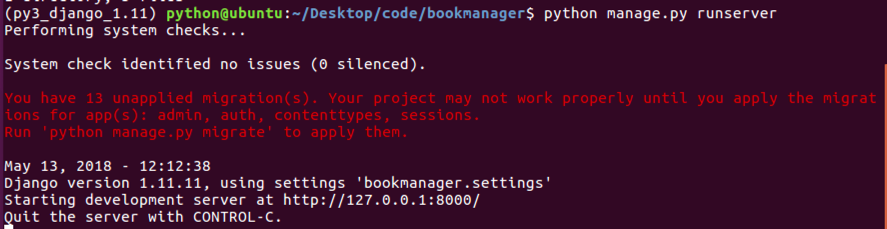
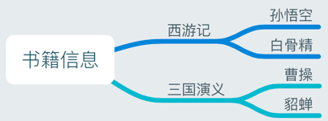
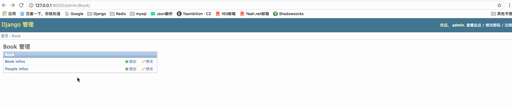
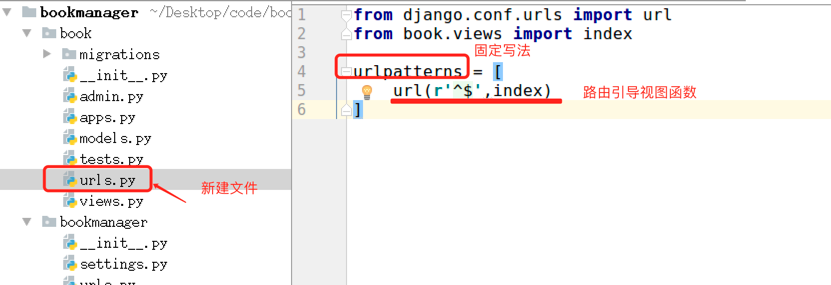
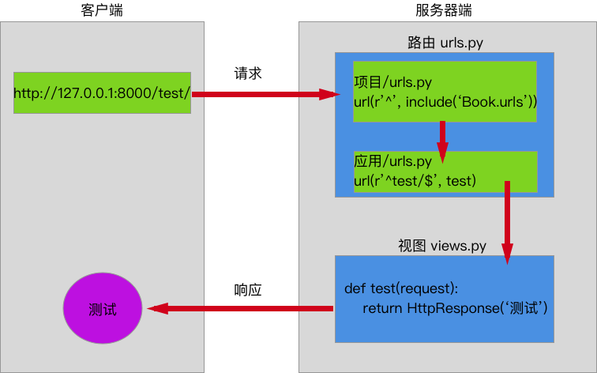
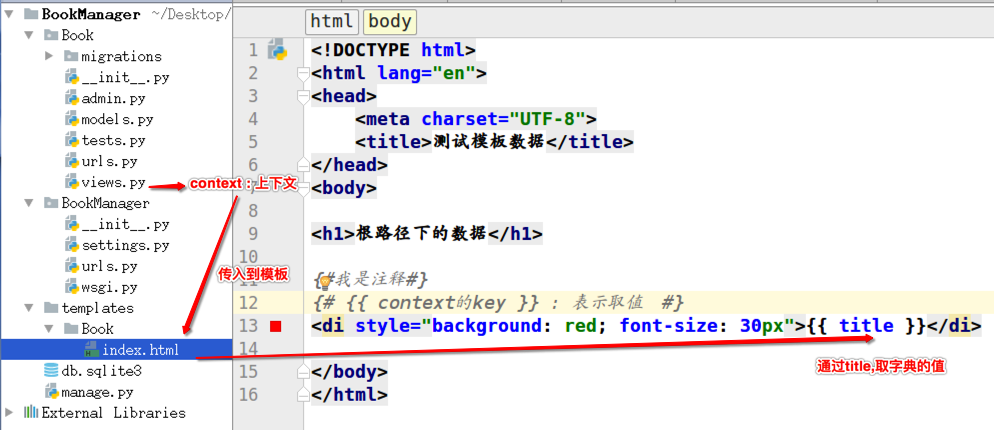
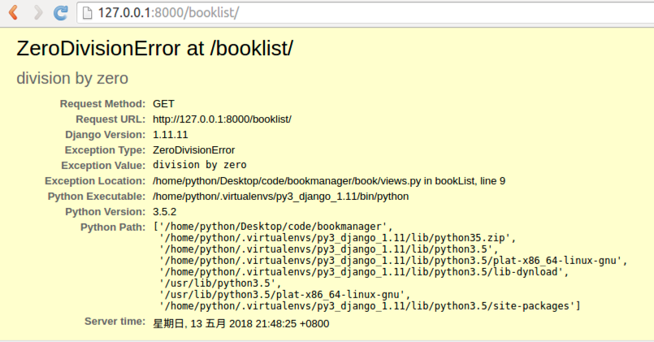

# Day67 Python Web 框架 Django（1）——Django流程 

[TOC]


# Python Web 框架要点

## 1. Web应用程序处理流程


## 2. Web程序框架的意义

- 用于搭建Web应用程序
- 免去不同Web应用相同代码部分的重复编写，只需关心Web应用核心的业务逻辑实现

## 3. Web应用程序的本质

- 接收并解析HTTP请求，获取具体的请求信息
- 处理本次HTTP请求，即完成本次请求的业务逻辑处理
- 构造并返回处理结果——HTTP响应

## 4. Web框架学习方法

- 如何搭建工程程序
  - 工程的组建
  - 工程的配置
  - 路由定义
  - 视图函数定义
- 如何获取请求数据（操作request对象）
- 如何构造响应数据（构造response对象）
- 框架提供的其他功能组件的使用
  - 数据库
  - 模板
  - admin

# Django介绍


## 1. 简介

Django，**发音为[`dʒæŋɡəʊ]**，是用python语言写的开源web开发框架，并遵循MVC设计。劳伦斯出版集团为了开发以新闻内容为主的网站，而开发出来了这个框架，于2005年7月在BSD许可证下发布。这个名称来源于比利时的爵士音乐家DjangoReinhardt，他是一个吉普赛人，主要以演奏吉它为主，还演奏过小提琴等。**由于Django在近年来的迅速发展，应用越来越广泛，被著名IT开发杂志SDTimes评选为2013SDTimes100，位列"API、库和框架"分类第6位，被认为是该领域的佼佼者。**


Django的**主要目的是简便、快速的开发数据库驱动的网站。**它强调代码复用，多个组件可以很方便的以"插件"形式服务于整个框架，Django有许多功能强大的第三方插件，你甚至可以很方便的开发出自己的工具包。这使得Django具有很强的可扩展性。它还强调快速开发和DRY(DoNotRepeatYourself)原则。

## 2. 特点

### 1） 重量级框架

对比Flask框架，Django原生提供了众多的功能组件，让开发更简便快速。

- 提供项目工程管理的自动化脚本工具
- 数据库ORM支持（对象关系映射，英语：Object Relational Mapping）
- 模板
- 表单
- Admin管理站点
- 文件管理
- 认证权限
- session机制
- 缓存

### 2）MVT模式

有一种程序设计模式叫**MVC**，其核心思想是**分工、解耦，让不同的代码块之间降低耦合，增强代码的可扩展性和可移植性，实现向后兼容**。

> MVC的全拼为**Model-View-Controller**，最早由TrygveReenskaug在1978年提出，是施乐帕罗奥多研究中心(Xerox PARC)在20世纪80年代为程序语言Smalltalk发明的一种软件设计模式，是为了将传统的输入（input）、处理（processing）、输出（output）任务运用到图形化用户交互模型中而设计的。随着标准输入输出设备的出现，开发人员只需要将精力集中在业务逻辑的分析与实现上。后来被推荐为Oracle旗下Sun公司Java EE平台的设计模式，并且受到越来越多的使用ColdFusion和PHP的开发者的欢迎。现在虽然不再使用原来的分工方式，但是这种分工的思想被沿用下来，广泛应用于软件工程中，是一种典型并且应用广泛的软件架构模式。后来，MVC的思想被应用在了Ｗeb开发方面，被称为Ｗeb MVC框架。

#### MVC模式说明


- M全拼为Model，主要封装对数据库层的访问，对数据库中的数据进行增、删、改、查操作。
- V全拼为View，用于封装结果，生成页面展示的html内容。
- C全拼为Controller，用于接收请求，处理业务逻辑，与Model和View交互，返回结果。

#### Django的MVT


- M全拼为Model，与MVC中的M功能相同，负责和数据库交互，进行数据处理。
- V全拼为View，与MVC中的C功能相同，接收请求，进行业务处理，返回应答。
- T全拼为Template，与MVC中的V功能相同，负责封装构造要返回的html。

**注：差异就在于黑线黑箭头标识出来的部分**

## 3. Django学习资料

- [官方网站](https://www.djangoproject.com/)
- [Github源码](https://github.com/django/django)
- [1.11版英文文档](https://docs.djangoproject.com/en/1.11/)
- [1.11版中文文档](https://yiyibooks.cn/xx/Django_1.11.6/index.html)
- [Django Book 教程](http://djangobook.com/)
- [Tange With Django 教程](http://www.tangowithdjango.com/book17/)


# Django流程

## 重点

- **MVT流程:掌握M,V,T的每个模块的功能,了解MVT的流程**


- **创建Django项目和应用**
  - django-admin startproject name
  - python manager.py startapp name
- **视图和ULR**
  - 视图的请求和响应
  - URL的匹配路径

## 为什么要搭建虚拟环境?

- 在开发过程中, 当需要使用

  ```
  python
  ```

  的某些工具包/框架时需要联网安装

  - 比如联网安装Django框架django的1.11.11版本

```
sudo pip install django==1.11.11
```

- **提示**：使用如上命令, 会将Django安装到`/usr/local/lib/python2.7/dist-packages`路径下

- **问题**：如果在一台电脑上, 想开发多个不同的项目, 需要用到同一个包的不同版本, 如果使用上面的命令, 在同一个目录下安装或者更新, 新版本会覆盖以前的版本, 其它的项目就无法运行了.

- 解决方案

  :

  ```
  虚拟环境
  ```

  - **作用**:`虚拟环境`可以搭建独立的`python运行环境`, 使得单个项目的运行环境与其它项目互不影响.
  - 所有的`虚拟环境`都位于`/home/`下的隐藏目录`.virtualenvs`下

## 如何搭建虚拟环境?

- 安装虚拟环境的命令 :

```
sudo pip install virtualenv
sudo pip install virtualenvwrapper
```

> 安装完虚拟环境后，如果提示找不到mkvirtualenv命令，须配置环境变量：

```
# 1、创建目录用来存放虚拟环境
mkdir 
$HOME/.virtualenvs

# 2、打开~/.bashrc文件，并添加如下：
export WORKON_HOME=$HOME/.virtualenvs
source /usr/local/bin/virtualenvwrapper.sh

# 3、运行
source ~/.bashrc
```

- 创建虚拟环境的命令 :

  - 提示：如果不指定python版本，默认安装的是python2的虚拟环境

  - 在python2中，创建虚拟环境

    ```
    mkvirtualenv 虚拟环境名称
    例 ：
    mkvirtualenv py_django
    ```

  - 在python3中，创建虚拟环境

    ```
    mkvirtualenv -p python3 虚拟环境名称
    例 ：
    mkvirtualenv -p python3 py3_django
    ```

    

- 提示 :

  - 创建虚拟环境需要联网
  - 创建成功后, 会自动工作在这个虚拟环境上
  - 工作在虚拟环境上, 提示符最前面会出现 “虚拟环境名称”

## 如何使用虚拟环境?

- 查看虚拟环境的命令 :

```
workon
```


- 使用虚拟环境的命令 :

```
workon 虚拟环境名称

例 ：使用py3_django的虚拟环境
workon py3_django
```


- 退出虚拟环境的命令 :

```
deactivate
```


- 删除虚拟环境的命令 :

```
rmvirtualenv 虚拟环境名称

例 ：删除虚拟环境py3_django

先退出：deactivate
再删除：rmvirtualenv py3_django
```


## 如何在虚拟环境中安装工具包?

[文档](https://pip.pypa.io/en/stable/user_guide/)

- 提示 : 工具包安装的位置 :
  - python2版本下：
    - `~/.virtualenvs/py_flask/lib/python2.7/site-packages/`
  - python3版本下：
    - `~/.virtualenvs/py3_flask/lib/python3.5/site-packages`
- python3版本下安装django-1.11.11的包 :

```
pip install 包名称

例 : 安装django-1.11.11的包
pip install django==1.11.11
```


- 查看虚拟环境中安装的包 :

```
pip list
```


# 创建Django项目

[官方文档](https://docs.djangoproject.com/en/1.11/intro/tutorial01/)

## 步骤

- **创建Django项目**
  - django-admin startproject name
- **创建子应用**
  - python manager.py startapp name

# 创建工程

在使用Flask框架时，项目工程目录的组织与创建是需要我们自己手动创建完成的。

在django中，项目工程目录可以借助django提供的命令帮助我们创建。

## 1. 创建

创建工程的命令为：

```
django-admin startproject 工程名称
```

例如：想要在桌面的code目录中创建一个名为bookmanager的项目工程，可执行如下命令：

```
cd ~/Desktop/Code
django-admin startproject bookmanager
```

执行后，会多出一个新目录名为bookmanager，此即为新创建的工程目录。

## 2. 工程目录说明

查看创建的工程目录，结构如下


- 与项目同名的目录，此处为bookmanager。
- **settings.py**是项目的整体配置文件。
- **urls.py**是项目的URL配置文件。
- **wsgi.py**是项目与WSGI兼容的Web服务器入口。
- **manage.py**是项目管理文件，通过它管理项目。

## 3. 运行开发服务器

在开发阶段，为了能够快速预览到开发的效果，django提供了一个纯python编写的轻量级web服务器，仅在开发阶段使用。

运行服务器命令如下：

```
python manage.py runserver ip:端口
或：
python manage.py runserver
```

**可以不写IP和端口，默认IP是127.0.0.1，默认端口为8000**。

启动后可见如下信息：



在浏览器中输入网址“127.0.0.1:8000”便可看到效果。


- django默认工作在调式Debug模式下，如果增加、修改、删除文件，服务器会自动重启。
- 按ctrl+c停止服务器。

# 创建子应用

在Web应用中，通常有一些业务功能模块是在不同的项目中都可以复用的，故在开发中通常将工程项目拆分为不同的子功能模块，各功能模块间可以保持相对的独立，在其他工程项目中需要用到某个特定功能模块时，可以将该模块代码整体复制过去，达到复用。

在Flask框架中也有类似子功能应用模块的概念，即蓝图Blueprint。

**Django的视图编写是放在子应用中的。**

## 1. 创建

在django中，创建子应用模块目录仍然可以通过命令来操作，即：

```
python manage.py startapp 子应用名称
```

**manage.py**为上述创建工程时自动生成的管理文件。

例如，在刚才创建的bookmanager工程中，想要创建一个用户book子应用模块，可执行：

```
cd ~/Desktop/code/book
python manage.py startapp book
```

执行后，可以看到工程目录中多出了一个名为book的子目录。

## 2. 子应用目录说明

查看此时的工程目录，结构如下：


- **admin.py**文件跟网站的后台管理站点配置相关。
- **apps.py**文件用于配置当前子应用的相关信息。
- **migrations**目录用于存放数据库迁移历史文件。
- **models.py**文件用户保存数据库模型类。
- **tests.py**文件用于开发测试用例，编写单元测试。
- **views.py**文件用于编写Web应用视图。

## 3. 注册安装子应用

创建出来的子应用目录文件虽然被放到了工程项目目录中，但是django工程并不能立即直接使用该子应用，需要注册安装后才能使用。

在工程配置文件settings.py中，**INSTALLED_APPS**项保存了工程中已经注册安装的子应用，初始工程中的INSTALLED_APPS如下：


**注册安装一个子应用的方法，即是将子应用的配置信息文件apps.py中的Config类添加到INSTALLED_APPS列表中。**

例如，将刚创建的book子应用添加到工程中，可在INSTALLED_APPS列表中添加**'book.apps.BookConfig'**。


## 4. 设置PyCharm的环境

问题:


首先找到pycharm的设置选项:


选择虚拟环境

添加虚拟环境:


添加本地虚拟环境


添加完成

一路点几个确定之后问题解决


# 模型

- 当前项目的开发, 都是数据驱动的。

- 以下为书籍信息管理的数据关系：书籍和人物是 ：一对多关系

  

- 要先分析出项目中所需要的数据, 然后设计数据库表.

> 书籍信息表

| 字段名 | 字段类型  | 字段说明 |
| :----- | :-------- | :------- |
| id     | AutoField | 主键     |
| name   | CharField | 书名     |

| id   | name     |
| :--- | :------- |
| 1    | 西游记   |
| 2    | 三国演义 |

> 人物信息表

| 字段名 | 字段类型     | 字段说明 |
| :----- | :----------- | :------- |
| id     | AutoField    | 主键     |
| name   | CharField    | 人名     |
| gender | BooleanField | 性别     |
| book   | ForeignKey   | 外键     |

| id   | name   | gender | book |
| :--- | :----- | :----- | :--- |
| 1    | 孙悟空 | False  | 1    |
| 2    | 白骨精 | True   | 1    |
| 3    | 曹操   | False  | 2    |
| 4    | 貂蝉   | True   | 2    |

## 使用Django进行数据库开发的提示 ：

- `MVT`设计模式中的`Model`, 专门负责和数据库交互.对应`(models.py)`
- 由于`Model`中内嵌了`ORM框架`, 所以不需要直接面向数据库编程.
- 而是定义模型类, 通过`模型类和对象`完成数据库表的`增删改查`.
- `ORM框架`就是把数据库表的行与相应的对象建立关联, 互相转换.使得数据库的操作面向对象.

## 使用Django进行数据库开发的步骤 ：

1. 定义模型类
2. 模型迁移
3. 操作数据库

#### 1. 定义模型类

- 根据书籍表结构设计模型类:

  - 模型类：BookInfo
  - 书籍名称字段：name

- 根据人物表结构设计模型类：

  - 模型类：PeopleInfo
  - 人物姓名字段：name
  - 人物性别字段：gender
  - 外键约束：book
    - 外键要指定所属的模型类`book = models.ForeignKey(BookInfo)`

- 说明 :

  - 书籍-人物的关系为一对多. 一本书中可以有多个英雄.
  - 不需要定义主键字段, 在生成表时会自动添加, 并且值为自增长.

- 根据数据库表的设计

  - 在`models.py`中定义模型类,继承自`models.Model`

  - ```
    from django.db import models
    
    # Create your models here.
    # 准备书籍列表信息的模型类
    class BookInfo(models.Model):
        # 创建字段，字段类型...
        name = models.CharField(max_length=10)
    
    # 准备人物列表信息的模型类
    class PeopleInfo(models.Model):
        name = models.CharField(max_length=10)
        gender = models.BooleanField()
        # 外键约束：人物属于哪本书
        book = models.ForeignKey(BookInfo)
    ```

#### 2. 模型迁移 （建表）

- 迁移由两步完成 :

  - 生成迁移文件：根据模型类生成创建表的语句

    ```
    python manage.py makemigrations
    ```

  - 执行迁移：根据第一步生成的语句在数据库中创建表

    ```
    python manage.py migrate
    ```

- 迁移前

  

- 迁移后


- **提示：默认采用**`sqlite3`**数据库来存储数据**

# 站点管理

- **站点**: 分为`内容发布`和`公共访问`两部分

- **内容发布**的部分由网站的管理员负责查看、添加、修改、删除数据

- `Django`能够根据定义的模型类自动地生成管理模块

- 使用

  ```
  Django
  ```

  的管理模块, 需要按照如下步骤操作 :

  - 1.管理界面本地化
  - 2.创建管理员
  - 3.注册模型类
  - 4.发布内容到数据库

#### 1.管理界面本地化

- 本地化是将显示的语言、时间等使用本地的习惯，这里的本地化就是进行中国化.

- 中国大陆地区使用`简体中文`, 时区使用`亚洲/上海时区`, 注意这里不使用北京时区.

- 本地化前

  

- 本地化后


#### 2.创建管理员

- 创建管理员的命令 :

  ```
    python manage.py createsuperuser
  ```

- 按提示输入用户名、邮箱、密码

  

- 重置密码

- ```
  python manager.py changepassword 用户名
  ```

- 登陆站点 :`http://127.0.0.1:8000/admin`

  - 需要服务器是启动状态

    

- 登陆站点成功

  - 站点界面中没有书籍和人物管理入口,因为没有注册模型类

    

#### 3.注册模型类

- 在`应用`的`admin.py`文件中注册模型类

  - 需要导入模型模块 :`from book.models import BookInfo,PeopleInfo`

    

- 注册模型后

  

> **注册模型成功后, 就可以在站点管理界面方便快速的管理数据.**

#### 4.发布内容到数据库



- 发布内容后，优化模型类展示

- ```
  # 准备书籍列表信息的模型类
  class BookInfo(models.Model):
      # 创建字段，字段类型...
      name = models.CharField(max_length=10)
  
      def __str__(self):
          """将模型类以字符串的方式输出"""
          return self.name
  ```

  

# 视图和URL

- 站点管理页面做好了, 接下来就要做`公共访问`的页面了.

- 对于

  ```
  Django
  ```

  的设计框架

  ```
  MVT
  ```

  .

  - 用户在URL中请求的是视图.
  - 视图接收请求后进行处理.
  - 并将处理的结果返回给请求者.

- 使用视图时需要进行两步操作

  - 1.定义视图
  - 2.配置URLconf

#### 1. 定义视图

- 视图就是一个`Python`函数，被定义在`应用`的`views.py`中.

- 视图的第一个参数是`HttpRequest`类型的对象`reqeust`，包含了所有`请求信息`.

- 视图必须返回`HttpResponse对象`，包含返回给请求者的`响应信息`.

- 需要导入`HttpResponse`模块 :`from django.http import HttpResponse`

- 定义视图函数 : 响应字符串`OK!`给客户端

  

> **思考 : 如何才能让请求找到视图?**

#### 2. 配置URLconf

- 查找视图的过程 :

  - 1.请求者在浏览器地址栏中输入URL, 请求到网站.

  - 2.网站获取URL信息.

  - 3.然后与编写好的URLconf逐条匹配.

  - 4.如果匹配成功则调用对应的视图.

  - 5.如果所有的URLconf都没有匹配成功.则返回404错误.

    

- `URLconf`入口

  

- 需要两步完成`URLconf`配置

  - 1.在`项目`中定义`URLconf`
  - 2.在`应用`中定义`URLconf`

- **在**`项目`**中定义**`URLconf`

  

- **在**`应用`**中定义**`URLconf`

  - 提示：一条`URLconf`包括URL规则、视图两部分

    - URL规则使用正则表达式定义.

    - 视图就是在`views.py`中定义的视图函数.

      

    - url匹配过程

    - 

#### 3. 测试：请求访问

- `http://127.0.0.1:8000/`

  

#### 4. 总结

视图处理过程如下图：


> 使用视图时需要进行两步操作，两步操作不分先后
>
> 1. 配置`URLconf`
> 2. 在`应用/views.py`中定义视图

# 总结View和URL匹配流程




> 思考 : 网站如何向客户端返回一个漂亮的页面呢？

- 提示 :
  - 漂亮的页面需要`html`、`css`、`js`.
  - 可以把这一堆字段串全都写到视图中, 作为`HttpResponse()`的参数,响应给客户端.
- 问题 :
  - 视图部分代码臃肿, 耦合度高.
  - 这样定义的字符串是不会出任何效果和错误的.
  - 效果无法及时查看.有错也不容易及时发现.
- 设想 :
  - 是否可以有一个专门定义前端页面的地方, 效果可以及时展示,错误可以及时发现,并且可以降低模块间耦合度!
- 解决问题 :**模板**
  - `MVT`设计模式中的`T`,`Template`
- **在**`Django`**中, 将前端的内容定义在模板中, 然后再把模板交给视图调用, 各种漂亮、炫酷的效果就出现了.**

## 模板使用步骤

- 1.创建模板
- 2.设置模板查找路径
- 3.模板接收视图传入的数据
- 4.模板处理数据

#### 1.创建模板

- 在`应用`同级目录下创建模板文件夹`templates`. 文件夹名称固定写法.

- 在`templates`文件夹下, 创建`应用`同名文件夹. 例, `Book`

- 在`应用`同名文件夹下创建`网页模板`文件. 例 :`index.html`

  

#### 2.设置模板查找路径


#### 3.模板接收视图传入的数据

- 视图模板加载

  

#### 4.模板处理数据



#### 5. 查看模板处理数据成果


# 总结View-Templates流程


## 展示书籍列表

## 需求


## 实现步骤

- 1.创建视图
- 2.创建模板
- 3.配置URLconf

#### 1.创建视图

- 查询数据库数据

- 构造上下文

- 传递上下文到模板

  ```
  # 定义视图：提供书籍列表信息
  def bookList(request):
      # 查询数据库书籍列表数据
      books = BookInfo.objects.all()
      # 构造上下文
      context = {'books':books}
      # 数据交给模板处理，处理完成后通过视图响应给客户端
      return render(request, 'Book/booklist.html', context)
  ```

#### 2.创建模板

- 读取上下文数据
- 构造网页html文档 : 书籍信息以列表样式展示

```
<!DOCTYPE html>
<html lang="en">
<head>
    <meta charset="UTF-8">
    <title>书籍列表信息</title>
</head>
<body>

<ul>

</ul>

</body>
</html>
```

#### 3.配置URLconf

- 进入`应用`中的`urls.py`文件

  ```
  from django.conf.urls import url
  from book.views import index,bookList
  
  urlpatterns = [
      url(r'^$',index),
      # 匹配书籍列表信息的URL,调用对应的bookList视图
      url(r'^booklist/$',bookList)
  ]
  ```

# 配置和静态文件

## 配置文件

### 1. BASE_DIR

```
BASE_DIR = os.path.dirname(os.path.dirname(os.path.abspath(__file__)))
```

当前工程的根目录，Django会依此来定位工程内的相关文件，我们也可以使用该参数来构造文件路径。

### 2. DEBUG

调试模式，创建工程后初始值为**True**，即默认工作在调试模式下。

作用：

- 修改代码文件，程序自动重启

- Django程序出现异常时，向前端显示详细的错误追踪信息，例如

  

- 而非调试模式下，仅返回Server Error (500)

**注意：部署线上运行的Django不要运行在调式模式下，记得修改DEBUG=False和ALLOW_HOSTS。**

### 3. 本地语言与时区

Django支持本地化处理，即显示语言与时区支持本地化。

本地化是将显示的语言、时间等使用本地的习惯，这里的本地化就是进行中国化，中国大陆地区使用**简体中文**，时区使用**亚洲/上海**时区，注意这里不使用北京时区表示。

初始化的工程默认语言和时区为英语和UTC标准时区

```
LANGUAGE_CODE = 'en-us'  # 语言
TIME_ZONE = 'UTC'  # 时区# 时区
```

将语言和时区修改为中国大陆信息

```
LANGUAGE_CODE = 'zh-Hans'
TIME_ZONE = 'Asia/Shanghai'
```

## 静态文件

项目中的CSS、图片、js都是静态文件。一般会将静态文件放到一个单独的目录中，以方便管理。在html页面中调用时，也需要指定静态文件的路径，Django中提供了一种解析的方式配置静态文件路径。静态文件可以放在项目根目录下，也可以放在应用的目录下，由于有些静态文件在项目中是通用的，所以推荐放在项目的根目录下，方便管理。

为了提供静态文件，需要配置两个参数：

- **STATICFILES_DIRS**存放查找静态文件的目录
- **STATIC_URL**访问静态文件的URL前缀

### 示例

1） 在项目根目录下创建static目录来保存静态文件。

2） 在bookmanager/settings.py中修改静态文件的两个参数为

```
STATIC_URL = '/static/'
STATICFILES_DIRS = [
    os.path.join(BASE_DIR, 'static'),
]
```

3）此时在static添加的任何静态文件都可以使用网址**/static/文件在static中的路径**来访问了。

例如，我们向static目录中添加一个index.html文件，在浏览器中就可以使用127.0.0.1:8000/static/index.html来访问。

或者我们在static目录中添加了一个子目录和文件book/detail.html，在浏览器中就可以使用127.0.0.1:8000/static/book/detail.html来访问。

## App应用配置

在每个应用目录中都包含了apps.py文件，用于保存该应用的相关信息。

在创建应用时，Django会向apps.py文件中写入一个该应用的配置类，如

```
from django.apps import AppConfig


class BookConfig(AppConfig):
    name = 'book'
```

我们将此类添加到工程settings.py中的INSTALLED_APPS列表中，表明注册安装具备此配置属性的应用。

- **AppConfig.name**属性表示这个配置类是加载到哪个应用的，每个配置类必须包含此属性，默认自动生成。

- **AppConfig.verbose_name**属性用于设置该应用的直观可读的名字，此名字在Django提供的Admin管理站点中会显示，如

  ```
  from django.apps import AppConfig
  
  class UsersConfig(AppConfig):
      name = 'book'
      verbose_name = '图书管理'
  ```


-16947612810458-16952780683132.jpg)

