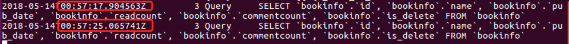
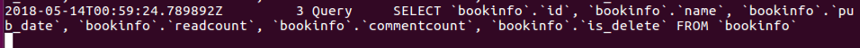

# Day68 Python Web 框架 Django（2）——Django模型

[TOC]


# Django模型

## 重点

- **模型配置**
- **数据的增删改**
  - 增:`book = BookInfo() book.save()` 和`BookInfo.objects.create()`
  - 删:`book.delete()` 和`BookInfo.objects.get().delete()`
  - 改:`book.name='xxx' book.save()` 和 `BookInfo.objects.get().update(name=xxx)`
- **数据的查询**
  - 基础查询
  - F对象和Q对象
  - 关联查询
  - 查询集QuerySet

## MVT图解


# 项目准备

1.创建项目

```
django-admin startproject bookmanager
```

2.创建应用

```
python manager.py startapp book
```

3.更换python解释器：按需选择

```
  # 进入指定虚拟环境
  which python

  # python2
  /home/python/.virtualenvs/py_django/bin/python

  # python3
  /home/python/.virtualenvs/py3_django/bin/python
```

4.安装应用

```
INSTALLED_APPS = [
    'django.contrib.admin',
    'django.contrib.auth',
    'django.contrib.contenttypes',
    'django.contrib.sessions',
    'django.contrib.messages',
    'django.contrib.staticfiles',
    #添加子应用
    'book.apps.BookConfig'
]
```

5.本地化

```
#设置中文
LANGUAGE_CODE = 'zh-Hans'
#亚洲上海时区
TIME_ZONE = 'Asia/Shanghai'
```

6.模板路径

- 在应用同级目录下,创建`templates`模板文件夹

  ```
  TEMPLATES = [
      {
          'BACKEND': 'django.template.backends.django.DjangoTemplates',
          'DIRS': [os.path.join(BASE_DIR,'templates')],
          'APP_DIRS': True,
          'OPTIONS': {
              'context_processors': [
                  'django.template.context_processors.debug',
                  'django.template.context_processors.request',
                  'django.contrib.auth.context_processors.auth',
                  'django.contrib.messages.context_processors.messages',
              ],
          },
      },
  ]
  ```

7.项目中匹配urls

- 正则 : 路径只要不是`admin/`就算匹配成功。并包含到应用中的`urls.py`

  ```
  from django.conf.urls import url,include
  from django.contrib import admin
  
  urlpatterns = [
      url(r'^admin/', admin.site.urls),
      #正则为：只要不是 admin/ 就算匹配成功
      url(r'^',include('book.urls'))
  ]
  ```

8.应用中匹配`urls.py`

- 应用中创建 `urls.py`

- 正则 : 路径中包含`booklist/`，就调用视图中对应的`bookList`函数

  ```
  from django.conf.urls import url
  from book.views import bookList
  
  urlpatterns = [
  
      # 匹配书籍列表信息的URL,调用对应的bookList视图
      url(r'^booklist/$',bookList)
  ]
  ```

9.准备视图

```
# 定义视图：提供书籍列表信息
def bookList(request):

    return HttpResponse('OK!')
```

10.开启服务器, 测试项目

```
 # 进入项目文件中, 开启项目对应的服务器
 python manage.py runserver

 # 浏览器中输入网址
 http://127.0.0.1:8000/booklist/
```


# 配置

在settings.py中保存了数据库的连接配置信息，Django默认初始配置使用**sqlite**数据库。

```
DATABASES = {
    'default': {
        'ENGINE': 'django.db.backends.sqlite3',
        'NAME': os.path.join(BASE_DIR, 'db.sqlite3'),
    }
}
```

1. 使用**MySQL**数据库首先需要安装驱动程序

   ```
   pip install PyMySQL
   ```

2. 在Django的工程同名子目录的__init__.py文件中添加如下语句

   ```
   import pymysql
   
   pymysql.install_as_MySQLdb()
   ```

   作用是让Django的ORM能以mysqldb的方式来调用PyMySQL。

3. 修改**DATABASES**配置信息

   ```
   DATABASES = {
       'default': {
           'ENGINE': 'django.db.backends.mysql',
           'HOST': '127.0.0.1',  # 数据库主机
           'PORT': 3306,  # 数据库端口
           'USER': 'root',  # 数据库用户名
           'PASSWORD': 'mysql',  # 数据库用户密码
           'NAME': 'book'  # 数据库名字
       }
   }
   ```

4. 在MySQL中创建数据库

   ```
   create database book charset=utf8;
   ```

# 定义模型类

- 模型类被定义在"应用/models.py"文件中。
- 模型类必须继承自Model类，位于包django.db.models中。

接下来首先以"图书-人物"管理为例进行演示。

## 1 定义

在models.py 文件中定义模型类。

```
from django.db import models

# Create your models here.
# 准备书籍列表信息的模型类
class BookInfo(models.Model):
    # 创建字段，字段类型...
    name = models.CharField(max_length=20, verbose_name='名称')
    pub_date = models.DateField(verbose_name='发布日期',null=True)
    readcount = models.IntegerField(default=0, verbose_name='阅读量')
    commentcount = models.IntegerField(default=0, verbose_name='评论量')
    is_delete = models.BooleanField(default=False, verbose_name='逻辑删除')

    class Meta:
        db_table = 'bookinfo'  # 指明数据库表名
        verbose_name = '图书'  # 在admin站点中显示的名称

    def __str__(self):
        """定义每个数据对象的显示信息"""
        return self.name

# 准备人物列表信息的模型类
class PeopleInfo(models.Model):
    GENDER_CHOICES = (
        (0, 'male'),
        (1, 'female')
    )
    name = models.CharField(max_length=20, verbose_name='名称')
    gender = models.SmallIntegerField(choices=GENDER_CHOICES, default=0, verbose_name='性别')
    description = models.CharField(max_length=200, null=True, verbose_name='描述信息')
    book = models.ForeignKey(BookInfo, on_delete=models.CASCADE, verbose_name='图书')  # 外键
    is_delete = models.BooleanField(default=False, verbose_name='逻辑删除')

    class Meta:
        db_table = 'peopleinfo'
        verbose_name = '人物信息'

    def __str__(self):
        return self.name
```

**1） 数据库表名**

模型类如果未指明表名，Django默认以**小写app应用名_小写模型类名**为数据库表名。

可通过**db_table**指明数据库表名。

**2） 关于主键**

django会为表创建自动增长的主键列，每个模型只能有一个主键列，如果使用选项设置某属性为主键列后django不会再创建自动增长的主键列。

默认创建的主键列属性为id，可以使用pk代替，pk全拼为primary key。

**3） 属性命名限制**

- 不能是python的保留关键字。

- 不允许使用连续的下划线，这是由django的查询方式决定的。

- 定义属性时需要指定字段类型，通过字段类型的参数指定选项，语法如下：

  ```
  属性=models.字段类型(选项)
  ```

**4）字段类型**

| 类型             | 说明                                                         |
| :--------------- | :----------------------------------------------------------- |
| AutoField        | 自动增长的IntegerField，通常不用指定，不指定时Django会自动创建属性名为id的自动增长属性 |
| BooleanField     | 布尔字段，值为True或False                                    |
| NullBooleanField | 支持Null、True、False三种值                                  |
| CharField        | 字符串，参数max_length表示最大字符个数                       |
| TextField        | 大文本字段，一般超过4000个字符时使用                         |
| IntegerField     | 整数                                                         |
| DecimalField     | 十进制浮点数， 参数max_digits表示总位数， 参数decimal_places表示小数位数 |
| FloatField       | 浮点数                                                       |
| DateField        | 日期， 参数auto_now表示每次保存对象时，自动设置该字段为当前时间，用于"最后一次修改"的时间戳，它总是使用当前日期，默认为False； 参数auto_now_add表示当对象第一次被创建时自动设置当前时间，用于创建的时间戳，它总是使用当前日期，默认为False; 参数auto_now_add和auto_now是相互排斥的，组合将会发生错误 |
| TimeField        | 时间，参数同DateField                                        |
| DateTimeField    | 日期时间，参数同DateField                                    |
| FileField        | 上传文件字段                                                 |
| ImageField       | 继承于FileField，对上传的内容进行校验，确保是有效的图片      |

**5） 选项**

| 选项        | 说明                                                         |
| :---------- | :----------------------------------------------------------- |
| null        | 如果为True，表示允许为空，默认值是False                      |
| blank       | 如果为True，则该字段允许为空白，默认值是False                |
| db_column   | 字段的名称，如果未指定，则使用属性的名称                     |
| db_index    | 若值为True, 则在表中会为此字段创建索引，默认值是False        |
| default     | 默认                                                         |
| primary_key | 若为True，则该字段会成为模型的主键字段，默认值是False，一般作为AutoField的选项使用 |
| unique      | 如果为True, 这个字段在表中必须有唯一值，默认值是False        |

**null是数据库范畴的概念，blank是表单验证范畴的**

**6） 外键**

在设置外键时，需要通过**on_delete**选项指明主表删除数据时，对于外键引用表数据如何处理，在django.db.models中包含了可选常量：

- **CASCADE**级联，删除主表数据时连通一起删除外键表中数据
- **PROTECT**保护，通过抛出**ProtectedError**异常，来阻止删除主表中被外键应用的数据
- **SET_NULL**设置为NULL，仅在该字段null=True允许为null时可用
- **SET_DEFAULT**设置为默认值，仅在该字段设置了默认值时可用
- **SET()**设置为特定值或者调用特定方法
- **DO_NOTHING**不做任何操作，如果数据库前置指明级联性，此选项会抛出**IntegrityError**异常

## 2 迁移

将模型类同步到数据库中。

**1）生成迁移文件**

```
python manage.py makemigrations
```

**2）同步到数据库中**

```
python manage.py migrate
```

## 3 添加测试数据

```
insert into bookinfo(name, pub_date, readcount,commentcount, is_delete) values
('射雕英雄传', '1980-5-1', 12, 34, 0),
('天龙八部', '1986-7-24', 36, 40, 0),
('笑傲江湖', '1995-12-24', 20, 80, 0),
('雪山飞狐', '1987-11-11', 58, 24, 0);
insert into peopleinfo(name, gender, book_id, description, is_delete)  values
    ('郭靖', 1, 1, '降龙十八掌', 0),
    ('黄蓉', 0, 1, '打狗棍法', 0),
    ('黄药师', 1, 1, '弹指神通', 0),
    ('欧阳锋', 1, 1, '蛤蟆功', 0),
    ('梅超风', 0, 1, '九阴白骨爪', 0),
    ('乔峰', 1, 2, '降龙十八掌', 0),
    ('段誉', 1, 2, '六脉神剑', 0),
    ('虚竹', 1, 2, '天山六阳掌', 0),
    ('王语嫣', 0, 2, '神仙姐姐', 0),
    ('令狐冲', 1, 3, '独孤九剑', 0),
    ('任盈盈', 0, 3, '弹琴', 0),
    ('岳不群', 1, 3, '华山剑法', 0),
    ('东方不败', 0, 3, '葵花宝典', 0),
    ('胡斐', 1, 4, '胡家刀法', 0),
    ('苗若兰', 0, 4, '黄衣', 0),
    ('程灵素', 0, 4, '医术', 0),
    ('袁紫衣', 0, 4, '六合拳', 0);
```

## shell工具和查看MySQL数据库日志

### 1 shell工具

Django的manage工具提供了**shell**命令，帮助我们配置好当前工程的运行环境（如连接好数据库等），以便可以直接在终端中执行测试python语句。

通过如下命令进入shell

```
python manage.py shell
```


导入两个模型类，以便后续使用

```
from book.models import BookInfo,PeopleInfo
```

### 2 查看MySQL数据库日志

查看mysql数据库日志可以查看对数据库的操作记录。 mysql日志文件默认没有产生，需要做如下配置：

```
sudo vi /etc/mysql/mysql.conf.d/mysqld.cnf
```


把68，69行前面的#去除，然后保存并使用如下命令重启mysql服务。

```
sudo service mysql restart
```

使用如下命令打开mysql日志文件。

```
tail -f /var/log/mysql/mysql.log  # 可以实时查看数据库的日志内容
# 如提示需要sudo权限，执行
# sudo tail -f /var/log/mysql/mysql.log
```

# 数据库操作-增、删、改、查

## 1 增加

增加数据有两种方法。

**1）save**

通过创建模型类对象，执行对象的save()方法保存到数据库中。

```
>>> from book.models import BookInfo,PeopleInfo
>>> book = BookInfo(
...         name='python入门',
...         pub_date='2010-1-1'
...     )
>>> book.save()
>>> book
<BookInfo: python入门>
```


**2）create**

通过模型类.objects.create()保存。

```
>>> PeopleInfo.objects.create(
...         name='itheima',
...         book=book
...     )
<PeopleInfo: itheima>
```

## 2 修改

修改更新有两种方法

**1）save**

**修改模型类对象的属性，然后执行save()方法**

```
>>> person = PeopleInfo.objects.get(name='itheima')
>>> person.name = 'itcast'
>>> person.save()
>>> person
<PeopleInfo: itcast>
```

**2）update**

**使用模型类.objects.filter().update()**，会返回受影响的行数

```
>>> PeopleInfo.objects.filter(name='itcast').update(name='传智播客')
1
```


## 3 删除

删除有两种方法

**1）模型类对象delete**

```
>>> person = PeopleInfo.objects.get(name='传智播客')
>>> person.delete()
(1, {'book.PeopleInfo': 1})
```

**2）模型类.objects.filter().delete()**

```
>>> BookInfo.objects.filter(name='python入门').delete()
(1, {'book.BookInfo': 1, 'book.PeopleInfo': 0})
```

## 4 数据库操作-查询


### 1 基本查询

**get**查询单一结果，如果不存在会抛出**模型类.DoesNotExist**异常。

**all**查询多个结果。

**count**查询结果数量。

```
>>> BookInfo.objects.get(id=1)
<BookInfo: 射雕英雄传>

>>> BookInfo.objects.get(pk=2)
<BookInfo: 天龙八部>

>>> BookInfo.objects.get(pk=20)
Traceback (most recent call last):
  File "<console>", line 1, in <module>
  File "/home/python/.virtualenvs/py3_django_1.11/lib/python3.5/site-packages/django/db/models/manager.py", line 85, in manager_method
    return getattr(self.get_queryset(), name)(*args, **kwargs)
  File "/home/python/.virtualenvs/py3_django_1.11/lib/python3.5/site-packages/django/db/models/query.py", line 380, in get
    self.model._meta.object_name
book.models.DoesNotExist: BookInfo matching query does not exist.


>>> BookInfo.objects.all()
<QuerySet [<BookInfo: 射雕英雄传>, <BookInfo: 天龙八部>, <BookInfo: 笑傲江湖>, <BookInfo: 雪山飞狐>]>

>>> BookInfo.objects.count()
4
```

### 2 过滤查询

实现SQL中的where功能，包括

- **filter**过滤出多个结果
- **exclude**排除掉符合条件剩下的结果
- **get**过滤单一结果

对于过滤条件的使用，上述三个方法相同，故仅以**filter**进行讲解。

过滤条件的表达语法如下：

```
属性名称__比较运算符=值

# 属性名称和比较运算符间使用两个下划线，所以属性名不能包括多个下划线
查询编号为1的图书
查询书名包含'湖'的图书
查询书名以'部'结尾的图书
查询书名为空的图书
查询编号为1或3或5的图书
查询编号大于3的图书
查询1980年发表的图书
查询1990年1月1日后发表的图书
```

**1）相等**

**exact：表示判等。**

例：查询编号为1的图书。

```
BookInfo.objects.filter(id__exact=1)
可简写为：
BookInfo.objects.filter(id=1)
```

**2）模糊查询**

**contains：是否包含。**

> 说明：如果要包含%无需转义，直接写即可。

例：查询书名包含'传'的图书。

```
BookInfo.objects.filter(name__contains='传')
<QuerySet [<BookInfo: 射雕英雄传>]>
```

**startswith、endswith：以指定值开头或结尾。**

例：查询书名以'部'结尾的图书

```
>>> BookInfo.objects.filter(name__endswith='部')
<QuerySet [<BookInfo: 天龙八部>]>
```

> 以上运算符都区分大小写，在这些运算符前加上i表示不区分大小写，如iexact、icontains、istartswith、iendswith.

**3） 空查询**

**isnull：是否为null。**

例：查询书名为空的图书。

```
>>> BookInfo.objects.filter(name__isnull=True)
<QuerySet []>
```

**4） 范围查询**

**in：是否包含在范围内。**

例：查询编号为1或3或5的图书

```
>>> BookInfo.objects.filter(id__in=[1,3，5])
<QuerySet [<BookInfo: 射雕英雄传>, <BookInfo: 笑傲江湖>]>
```

**5）比较查询**

- **gt**大于 (greater then)
- **gte**大于等于 (greater then equal)
- **lt**小于 (less then)
- **lte**小于等于 (less then equal)

例：查询编号大于3的图书

```
BookInfo.objects.filter(id__gt=3)
```

**不等于的运算符，使用exclude()过滤器。**

例：查询编号不等于3的图书

```
>>> BookInfo.objects.filter(id__gt=3)
<QuerySet [<BookInfo: 雪山飞狐>]>
```

**6）日期查询**

**year、month、day、week_day、hour、minute、second：对日期时间类型的属性进行运算。**

例：查询1980年发表的图书。

```
>>> BookInfo.objects.filter(pub_date__year=1980)
<QuerySet [<BookInfo: 射雕英雄传>]>
```

例：查询1990年1月1日后发表的图书。

```
>>> BookInfo.objects.filter(pub_date__gt='1990-1-1')
<QuerySet [<BookInfo: 笑傲江湖>]>
```


## F和Q对象

#### F对象

之前的查询都是对象的属性与常量值比较，两个属性怎么比较呢？ 答：使用F对象，被定义在django.db.models中。

语法如下：

```
F(属性名)
```

例：查询阅读量大于等于评论量的图书。

```
>>> from django.db.models import F
>>> BookInfo.objects.filter(readcount__gt=F('commentcount'))
<QuerySet [<BookInfo: 雪山飞狐>]>
```

可以在F对象上使用算数运算。

例：查询阅读量大于2倍评论量的图书。

```
>>> BookInfo.objects.filter(readcount__gt=F('commentcount')*2)
<QuerySet [<BookInfo: 雪山飞狐>]>
```

#### Q对象

**多个过滤器逐个调用表示逻辑与关系，同sql语句中where部分的and关键字。**

例：查询阅读量大于20，并且编号小于3的图书。

```
>>> BookInfo.objects.filter(readcount__gt=20,id__lt=3)
<QuerySet [<BookInfo: 天龙八部>]>

或者

>>> BookInfo.objects.filter(readcount__gt=20).filter(id__lt=3)
<QuerySet [<BookInfo: 天龙八部>]>
```

**如果需要实现逻辑或or的查询，需要使用Q()对象结合|运算符**，Q对象被义在django.db.models中。

语法如下：

```
Q(属性名__运算符=值)
```

例：查询阅读量大于20的图书，改写为Q对象如下。

```
BookInfo.objects.filter(Q(readcount__gt=20))
```

Q对象可以使用&、|连接，&表示逻辑与，|表示逻辑或。

例：查询阅读量大于20，或编号小于3的图书，只能使用Q对象实现

```
>>> BookInfo.objects.filter(Q(readcount__gt=20)|Q(id__lt=3))
<QuerySet [<BookInfo: 射雕英雄传>, <BookInfo: 天龙八部>, <BookInfo: 雪山飞狐>]>
```

Q对象前可以使用~操作符，表示非not。

例：查询编号不等于3的图书。

```
>>> BookInfo.objects.filter(~Q(id=3))
<QuerySet [<BookInfo: 射雕英雄传>, <BookInfo: 天龙八部>, <BookInfo: 雪山飞狐>]>
```

## 聚合函数和排序函数

### 1. 聚合函数

使用aggregate()过滤器调用聚合函数。聚合函数包括：**Avg**平均，**Count**数量，**Max**最大，**Min**最小，**Sum**求和，被定义在django.db.models中。

例：查询图书的总阅读量。

```
>>> from django.db.models import Sum
>>> BookInfo.objects.aggregate(Sum('readcount'))
{'readcount__sum': 126}
```

注意aggregate的返回值是一个字典类型，格式如下：

```
  {'属性名__聚合类小写':值}

  如:{'readcount__sum': 126}
```

使用count时一般不使用aggregate()过滤器。

例：查询图书总数。

```
BookInfo.objects.count()
```

注意count函数的返回值是一个数字。

### 2. 排序

使用**order_by**对结果进行排序

```
# 默认升序
>>> BookInfo.objects.all().order_by('readcount')
<QuerySet [<BookInfo: 射雕英雄传>, <BookInfo: 笑傲江湖>, <BookInfo: 天龙八部>, <BookInfo: 雪山飞狐>]>


# 降序
>>> BookInfo.objects.all().order_by('-readcount')
<QuerySet [<BookInfo: 雪山飞狐>, <BookInfo: 天龙八部>, <BookInfo: 笑傲江湖>, <BookInfo: 射雕英雄传>]>
```

## 关联查询

```
查询书籍为1的所有人物信息
查询人物为1的书籍信息
```

由一到多的访问语法：

一对应的模型类对象.多对应的模型类名小写_set 例：

```
>>> book = BookInfo.objects.get(id=1)
>>> book.peopleinfo_set.all()
<QuerySet [<PeopleInfo: 郭靖>, <PeopleInfo: 黄蓉>, <PeopleInfo: 黄药师>, <PeopleInfo: 欧阳锋>, <PeopleInfo: 梅超风>]>
```

由多到一的访问语法:

多对应的模型类对象.多对应的模型类中的关系类属性名 例：

```
person = PeopleInfo.objects.get(id=1)
person.book
<BookInfo: 射雕英雄传>
```

访问一对应的模型类关联对象的id语法:

多对应的模型类对象.关联类属性_id

例：

```
>>> person = PeopleInfo.objects.get(id=1)
>>> person.book_id
1
```

#### 关联过滤查询

**由多模型类条件查询一模型类数据**:

语法如下：

```
关联模型类名小写__属性名__条件运算符=值
```

> **注意：如果没有"__运算符"部分，表示等于。**

```
查询图书，要求图书人物为"郭靖"
查询图书，要求图书中人物的描述包含"八"
```

例：

查询图书，要求图书人物为"郭靖"

```
>>> book = BookInfo.objects.filter(peopleinfo__name='郭靖')
>>> book
<QuerySet [<BookInfo: 射雕英雄传>]>
```

查询图书，要求图书中人物的描述包含"八"

```
>>> book = BookInfo.objects.filter(peopleinfo__description__contains='八')
>>> book
<QuerySet [<BookInfo: 射雕英雄传>, <BookInfo: 天龙八部>]>
```

**由一模型类条件查询多模型类数据**:

语法如下：

```
一模型类关联属性名__一模型类属性名__条件运算符=值
```

> **注意：如果没有"__运算符"部分，表示等于。**

```
查询书名为“天龙八部”的所有人物
查询图书阅读量大于30的所有人物
```

例：

查询书名为“天龙八部”的所有人物。

```
>>> people = PeopleInfo.objects.filter(book__name='天龙八部')
>>> people
<QuerySet [<PeopleInfo: 乔峰>, <PeopleInfo: 段誉>, <PeopleInfo: 虚竹>, <PeopleInfo: 王语嫣>]>
```

查询图书阅读量大于30的所有人物

```
>>> people = PeopleInfo.objects.filter(book__readcount__gt=30)
>>> people
<QuerySet [<PeopleInfo: 乔峰>, <PeopleInfo: 段誉>, <PeopleInfo: 虚竹>, <PeopleInfo: 王语嫣>, <PeopleInfo: 胡斐>, <PeopleInfo: 苗若兰>, <PeopleInfo: 程灵素>, <PeopleInfo: 袁紫衣>]>
```

## 查询集QuerySet

## 1 概念

Django的ORM中存在查询集的概念。

查询集，也称查询结果集、QuerySet，表示从数据库中获取的对象集合。

当调用如下过滤器方法时，Django会返回查询集（而不是简单的列表）：

- all()：返回所有数据。
- filter()：返回满足条件的数据。
- exclude()：返回满足条件之外的数据。
- order_by()：对结果进行排序。

对查询集可以再次调用过滤器进行过滤，如

```
>>> books = BookInfo.objects.filter(readcount__gt=30).order_by('pub_date')
>>> books
<QuerySet [<BookInfo: 天龙八部>, <BookInfo: 雪山飞狐>]>
```

也就意味着查询集可以含有零个、一个或多个过滤器。过滤器基于所给的参数限制查询的结果。

**从SQL的角度讲，查询集与select语句等价，过滤器像where、limit、order by子句。**

**判断某一个查询集中是否有数据**：

- exists()：判断查询集中是否有数据，如果有则返回True，没有则返回False。

## 2 两大特性

#### 1）惰性执行

创建查询集不会访问数据库，直到调用数据时，才会访问数据库，调用数据的情况包括迭代、序列化、与if合用

例如，当执行如下语句时，并未进行数据库查询，只是创建了一个查询集books

```
books = BookInfo.objects.all()
```

继续执行遍历迭代操作后，才真正的进行了数据库的查询

```
for book in books:
    print(book.name)
```

#### 2）缓存

使用同一个查询集，第一次使用时会发生数据库的查询，然后Django会把结果缓存下来，再次使用这个查询集时会使用缓存的数据，减少了数据库的查询次数。

**情况一**：如下是两个查询集，无法重用缓存，每次查询都会与数据库进行一次交互，增加了数据库的负载。

```
from book.models import BookInfo

 [book.id for book in BookInfo.objects.all()]

 [book.id for book in BookInfo.objects.all()]
```




**情况二**：经过存储后，可以重用查询集，第二次使用缓存中的数据。

```
books=BookInfo.objects.all()

[book.id for book in books]

[book.id for book in books]
```




## 3 限制查询集

可以对查询集进行取下标或切片操作，等同于sql中的limit和offset子句。

> 注意：不支持负数索引。

**对查询集进行切片后返回一个新的查询集，不会立即执行查询。**

如果获取一个对象，直接使用[0]，等同于[0:1].get()，但是如果没有数据，[0]引发IndexError异常，[0:1].get()如果没有数据引发DoesNotExist异常。

示例：获取第1、2项，运行查看。

```
>>> books = BookInfo.objects.all()[0:2]
>>> books
<QuerySet [<BookInfo: 射雕英雄传>, <BookInfo: 天龙八部>]>
```

## 4.分页

[官方分页文档](https://docs.djangoproject.com/en/1.11/topics/pagination/)

```
#查询数据
books = BookInfo.objects.all()
#导入分页类
from django.core.paginator import Paginator
#创建分页实例
paginator=Paginator(books,2)
#获取指定页码的数据
page_skus = paginator.page(1)
#获取分页数据
total_page=paginator.num_pages
```


-16947612810458-16952781179033.jpg)

