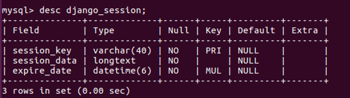

# Day69 Python Web 框架 Django（3）——Django视图

[TOC]


# 视图

## 重点

- HttpRequest
  - 位置参数和关键字参数
  - 查询字符串
  - 请求体:表单数据,JSON数据
  - 请求头
- **HttpResponse**
  - HttpResponse
  - JsonResponse
  - redirect
- **类视图**
  - 类视图的定义和使用
  - 类视图装饰器(难点)

# 视图介绍和项目准备


## 视图介绍

- 视图就是`应用`中`views.py`文件中的函数

- 视图的第一个参数必须为

  ```
  HttpRequest对象
  ```

  ，还可能包含下参数如

  - 通过正则表达式组获取的位置参数
  - 通过正则表达式组获得的关键字参数

- 视图必须返回一个

  ```
  HttpResponse对象
  ```

  或

  ```
  子对象
  ```

  作为响应

  - 子对象： `JsonResponse` `HttpResponseRedirect`

- 视图负责接受Web请求

  ```
  HttpRequest
  ```

  ，进行逻辑处理，返回Web响应

  ```
  HttpResponse
  ```

  给请求者

  - 响应内容可以是`HTML内容`，`404错误`，`重定向`，`json数据`...

- 视图处理过程如下图：

  

> 使用视图时需要进行两步操作，两步操作不分先后
>
> 1. 配置`URLconf`
> 2. 在`应用/views.py`中定义视图

## 项目准备

- 创建项目+创建应用+安装应用+配置模板路径+本地化+mysql数据库+URLconf+视图

- mysql数据库使用之前的book

  ```
  DATABASES = {
      'default': {
          'ENGINE': 'django.db.backends.mysql',
          'HOST': '127.0.0.1', # 数据库主机
          'PORT': 3306, # 数据库端口
          'USER': 'root', # 数据库用户名
          'PASSWORD': 'mysql', # 数据库用户密码
          'NAME': 'book' # 数据库名字
      }
  }
  ```

- URLconf

  - `settings.py`中：指定url配置

    ```
    ROOT_URLCONF = 'bookmanager.urls'
    ```

  - 项目中`urls.py`：只要不是`admin/`就匹配成功，包含到应用中的`urls.py`

    ```
    from django.conf.urls import url,include
    from django.contrib import admin
    
    urlpatterns = [
         url(r'^admin/', include(admin.site.urls)),
    
         # 只要不是‘admin/’就匹配成功，包含到应用中的urls.py
         url(r'^', include('book.urls')),
     ]
    ```

- 应用中`urls.py`：匹配`testproject/`成功就调用`views`中的`testproject`函数，测试项目逻辑

  ```
    from django.conf.urls import url
    import views
  
    urlpatterns = [
        # 匹配`testproject/`成功就调用`views`中的`testproject`函数
        url(r'^testproject/$', views.testproject),
    ]
  ```

- 视图：测试项目逻辑

  ```
  from django.http import HttpResponse
  
    # 测试项目逻辑
    def testproject(request):
        return HttpResponse('测试项目逻辑')
  ```

- 在models.py 文件中定义模型类

```
from django.db import models

# Create your models here.
# 准备书籍列表信息的模型类
class BookInfo(models.Model):
    # 创建字段，字段类型...
    name = models.CharField(max_length=20, verbose_name='名称')
    pub_date = models.DateField(verbose_name='发布日期',null=True)
    readcount = models.IntegerField(default=0, verbose_name='阅读量')
    commentcount = models.IntegerField(default=0, verbose_name='评论量')
    is_delete = models.BooleanField(default=False, verbose_name='逻辑删除')

    class Meta:
        db_table = 'bookinfo'  # 指明数据库表名
        verbose_name = '图书'  # 在admin站点中显示的名称

    def __str__(self):
        """定义每个数据对象的显示信息"""
        return self.name

# 准备人物列表信息的模型类
class PeopleInfo(models.Model):
    GENDER_CHOICES = (
        (0, 'male'),
        (1, 'female')
    )
    name = models.CharField(max_length=20, verbose_name='名称')
    gender = models.SmallIntegerField(choices=GENDER_CHOICES, default=0, verbose_name='性别')
    description = models.CharField(max_length=200, null=True, verbose_name='描述信息')
    book = models.ForeignKey(BookInfo, on_delete=models.CASCADE, verbose_name='图书')  # 外键
    is_delete = models.BooleanField(default=False, verbose_name='逻辑删除')

    class Meta:
        db_table = 'peopleinfo'
        verbose_name = '人物信息'

    def __str__(self):
        return self.name
```

1**）生成迁移文件**

```
python manage.py makemigrations
```

**2）同步到数据库中**

```
python manage.py migrate
```

3**）添加测试数据**

```
insert into bookinfo(name, pub_date, readcount,commentcount, is_delete) values
('射雕英雄传', '1980-5-1', 12, 34, 0),
('天龙八部', '1986-7-24', 36, 40, 0),
('笑傲江湖', '1995-12-24', 20, 80, 0),
('雪山飞狐', '1987-11-11', 58, 24, 0);
insert into peopleinfo(name, gender, book_id, description, is_delete)  values
    ('郭靖', 1, 1, '降龙十八掌', 0),
    ('黄蓉', 0, 1, '打狗棍法', 0),
    ('黄药师', 1, 1, '弹指神通', 0),
    ('欧阳锋', 1, 1, '蛤蟆功', 0),
    ('梅超风', 0, 1, '九阴白骨爪', 0),
    ('乔峰', 1, 2, '降龙十八掌', 0),
    ('段誉', 1, 2, '六脉神剑', 0),
    ('虚竹', 1, 2, '天山六阳掌', 0),
    ('王语嫣', 0, 2, '神仙姐姐', 0),
    ('令狐冲', 1, 3, '独孤九剑', 0),
    ('任盈盈', 0, 3, '弹琴', 0),
    ('岳不群', 1, 3, '华山剑法', 0),
    ('东方不败', 0, 3, '葵花宝典', 0),
    ('胡斐', 1, 4, '胡家刀法', 0),
    ('苗若兰', 0, 4, '黄衣', 0),
    ('程灵素', 0, 4, '医术', 0),
    ('袁紫衣', 0, 4, '六合拳', 0);
```

# URLconf

- 浏览者通过在浏览器的地址栏中输入网址请求网站
- 对于Django开发的网站，由哪一个视图进行处理请求，是由url匹配找到的

### 配置URLconf

- 1.`settings.py`中

  - 指定url配置

    ```
    ROOT_URLCONF = '项目.urls'
    ```

- 2.项目中`urls.py`

  - 匹配成功后，包含到应用的`urls.py`

    ```
    url(正则, include('应用.urls'))
    ```

- 3.应用中`urls.py`

  - 匹配成功后，调用`views.py`对应的函数

    ```
    url(正则, views.函数名)
    ```

- 4.提示

  ```
    1. 正则部分推荐使用 r，表示字符串不转义，这样在正则
    表达式中使用 \ 只写一个就可以
  
    2. 不能在开始加反斜杠，推荐在结束加反斜杠
        正确：path/
        正确：path
        错误：/path
        错误：/path/
  
    3. 请求的url被看做是一个普通的python字符串，进行匹配时不包括域名、get或post参数
        3.1 如请求地址如下：
            http://127.0.0.1:8000/18/?a=10
        3.2 去掉域名和参数部分后，只剩下如下部分与正则匹配
            18/
  ```

**说明：**

虽然路由结尾带/能带来上述好处，但是却违背了HTTP中URL表示资源位置路径的设计理念。

是否结尾带/以所属公司定义风格为准。

## 路由命名与reverse反解析（逆向）

### 1 路由命名

在定义路由的时候，可以为路由命名，方便查找特定视图的具体路径信息。

\1) 在使用include函数定义路由时，可以使用namespace参数定义路由的命名空间，如

```
url(r'^',include('book.urls',namespace='book'))
```

命名空间表示，凡是book.urls中定义的路由，均属于namespace指明的book名下。

**命名空间的作用：避免不同应用中的路由使用了相同的名字发生冲突，使用命名空间区别开。**

\2) 在定义普通路由时，可以使用name参数指明路由的名字，如

```
urlpatterns = [
    url(r'^$',index),
    # 匹配书籍列表信息的URL,调用对应的bookList视图
    url(r'^booklist/$',bookList,name='index'),
    url(r'^testproject/$',views.testproject,name='test'),
]
```

### 2 reverse反解析

使用reverse函数，可以根据路由名称，返回具体的路径，如：

```
from django.core.urlresolvers import reverse
#或者
from django.urls import reverse

def testproject(request):

    return HttpResponse("OK")

# 定义视图：提供书籍列表信息
def bookList(request):

    url = reverse('book:test')
    print(url)
    return HttpResponse('index')
```

- 对于未指明namespace的，reverse(路由name)
- 对于指明namespace的，reverse(命名空间namespace:路由name)

### 使用 PostMan 对请求进行测试

PostMan 是一款功能强大的网页调试与发送网页 HTTP 请求的 Chrome 插件，可以直接去对我们写出来的路由和视图函数进行调试，作为后端程序员是必须要知道的一个工具。

- 安装方式1：去 Chrome 商店直接搜索 PostMan 扩展程序进行安装
- 安装方式2：https://www.getpostman.com/官网下载桌面版
- 安装方式3：将已下载好的 PostMan 插件文件夹拖入到浏览器
  - 打开 Chrome 的扩展程序页面，打开`开发者模式`选项 
  - 将插件文件夹拖入到浏览器(或者点击加载已解压的扩展程序选择文件夹)
    - 在 Mac 下生成桌面图标，可以点击启动
    - 在 ubuntu 旧版的 Chrome 浏览器中会显示以下效果，可以直接点击启动 
- 使用 PostMan，打开之后，会弹出注册页面，选择下方的`Skip this,go straight to the app`进行程序


# HttpRequest对象

回想一下，利用HTTP协议向服务器传参有几种途径？

- 提取URL的特定部分，如/weather/beijing/2018，可以在服务器端的路由中用正则表达式截取；
- 查询字符串（query string)，形如key1=value1&key2=value2；
- 请求体（body）中发送的数据，比如表单数据、json、xml；
- 在http报文的头（header）中。

## 1 URL路径参数

- 如果想从URL中获取值，需要在正则表达式中使用`分组`，

- 获取值分为两种方式

  - 位置参数
    - 参数的位置不能错
  - 关键字参数
    - 参数的位置可以变，跟关键字保持一致即可

- 注意：两种参数的方式不要混合使用，在一个正则表达式中只能使用一种参数方式

- 分别使用以上两种获取URL值的方式提取出

  ```
  18 188
  ```

  - `http://127.0.0.1:8000/18/188/`

#### 位置参数

- 应用中`urls.py`

  ```
   url(r'^(\d+)/(\d+)/$', views.index),
  ```

- 视图中函数: 参数的位置不能错

  ```
  def index(request, value1, value2):
        # 构造上下文
        context = {'v1':value1, 'v2':value2}
        return render(request, 'Book/index.html', context)
  ```

#### 关键字参数

- 应用中`urls.py`

  - 其中`?P<value1>`部分表示为这个参数定义的名称为`value1`

  - 可以是其它名称，起名要做到见名知意

    ```
    url(r'^(?P<value1>\d+)/(?P<value2>\d+)/$', views.index),
    ```

- 视图中函数: 参数的位置可以变，跟关键字保持一致即可

  ```
  def index(request, value2, value1):
        # 构造上下文
        context = {'v1':value1, 'v2':value2}
        return render(request, 'Book/index.html', context)
  ```

## 2 Django中的QueryDict对象

HttpRequest对象的属性GET、POST都是QueryDict类型的对象

与python字典不同，QueryDict类型的对象用来处理同一个键带有多个值的情况

- 方法get()：根据键获取值

  如果一个键同时拥有多个值将获取最后一个值

  如果键不存在则返回None值，可以设置默认值进行后续处理

  ```
  get('键',默认值)
  ```

- 方法getlist()：根据键获取值，值以列表返回，可以获取指定键的所有值

  如果键不存在则返回空列表[]，可以设置默认值进行后续处理

  ```
  getlist('键',默认值)
  ```

## 3. 查询字符串Query String

获取请求路径中的查询字符串参数（形如?k1=v1&k2=v2），可以通过request.GET属性获取，返回QueryDict对象。

```
# /get/?a=1&b=2&a=3

def get(request):
    a = request.GET.get('a')
    b = request.GET.get('b')
    alist = request.GET.getlist('a')
    print(a)  # 3
    print(b)  # 2
    print(alist)  # ['1', '3']
    return HttpResponse('OK')
```

**重要：查询字符串不区分请求方式，即假使客户端进行POST方式的请求，依然可以通过request.GET获取请求中的查询字符串数据。**

## 4 请求体

请求体数据格式不固定，可以是表单类型字符串，可以是JSON字符串，可以是XML字符串，应区别对待。

可以发送请求体数据的请求方式有**POST**、**PUT**、**PATCH**、**DELETE**。

**Django默认开启了CSRF防护**，会对上述请求方式进行CSRF防护验证，在测试时可以关闭CSRF防护机制，方法为在settings.py文件中注释掉CSRF中间件，如：


### 4.1 表单类型 Form Data

前端发送的表单类型的请求体数据，可以通过request.POST属性获取，返回QueryDict对象。

```
def post(request):
    a = request.POST.get('a')
    b = request.POST.get('b')
    alist = request.POST.getlist('a')
    print(a)
    print(b)
    print(alist)
    return HttpResponse('OK')
```

## 4.2 非表单类型 Non-Form Data

非表单类型的请求体数据，Django无法自动解析，可以通过**request.body**属性获取最原始的请求体数据，自己按照请求体格式（JSON、XML等）进行解析。**request.body返回bytes类型。**

例如要获取请求体中的如下JSON数据

```
{"a": 1, "b": 2}
```

可以进行如下方法操作：

```
import json

def post_json(request):
    json_str = request.body
    json_str = json_str.decode()  # python3.6 无需执行此步
    req_data = json.loads(json_str)
    print(req_data['a'])
    print(req_data['b'])
    return HttpResponse('OK')
```

## 5 请求头

可以通过**request.META**属性获取请求头headers中的数据，**request.META为字典类型**。

常见的请求头如：

- `CONTENT_LENGTH`– The length of the request body (as a string).
- `CONTENT_TYPE`– The MIME type of the request body.
- `HTTP_ACCEPT`– Acceptable content types for the response.
- `HTTP_ACCEPT_ENCODING`– Acceptable encodings for the response.
- `HTTP_ACCEPT_LANGUAGE`– Acceptable languages for the response.
- `HTTP_HOST`– The HTTP Host header sent by the client.
- `HTTP_REFERER`– The referring page, if any.
- `HTTP_USER_AGENT`– The client’s user-agent string.
- `QUERY_STRING`– The query string, as a single (unparsed) string.
- `REMOTE_ADDR`– The IP address of the client.
- `REMOTE_HOST`– The hostname of the client.
- `REMOTE_USER`– The user authenticated by the Web server, if any.
- `REQUEST_METHOD`– A string such as`"GET"`or`"POST"`.
- `SERVER_NAME`– The hostname of the server.
- `SERVER_PORT`– The port of the server (as a string).

具体使用如:

```
def get_headers(request):
    print(request.META['CONTENT_TYPE'])
    return HttpResponse('OK')
```

## 6 其他常用HttpRequest对象属性

- **method**：一个字符串，表示请求使用的HTTP方法，常用值包括：'GET'、'POST'。
- **user：请求的用户对象。**
- path：一个字符串，表示请求的页面的完整路径，不包含域名和参数部分。
- encoding：一个字符串，表示提交的数据的编码方式。
  - 如果为None则表示使用浏览器的默认设置，一般为utf-8。
  - 这个属性是可写的，可以通过修改它来修改访问表单数据使用的编码，接下来对属性的任何访问将使用新的encoding值。
- FILES：一个类似于字典的对象，包含所有的上传文件。

# HttpResponse对象

视图在接收请求并处理后，必须返回HttpResponse对象或子对象。HttpRequest对象由Django创建，HttpResponse对象由开发人员创建。

## 1 HttpResponse

可以使用**django.http.HttpResponse**来构造响应对象。

```
HttpResponse(content=响应体, content_type=响应体数据类型, status=状态码)
```

也可通过HttpResponse对象属性来设置响应体、响应体数据类型、状态码：

- content：表示返回的内容。
- status_code：返回的HTTP响应状态码。

响应头可以直接将HttpResponse对象当做字典进行响应头键值对的设置：

```
response = HttpResponse()
response['itcast'] = 'Python'  # 自定义响应头Itcast, 值为Python
```

示例：

```
from django.http import HttpResponse

def response(request):
    return HttpResponse('itcast python', status=400)
    或者
    response = HttpResponse('itcast python')
    response.status_code = 400
    response['itcast'] = 'Python'
    return response
```

## 2 HttpResponse子类

Django提供了一系列HttpResponse的子类，可以快速设置状态码

- HttpResponseRedirect 301
- HttpResponsePermanentRedirect 302
- HttpResponseNotModified 304
- HttpResponseBadRequest 400
- HttpResponseNotFound 404
- HttpResponseForbidden 403
- HttpResponseNotAllowed 405
- HttpResponseGone 410
- HttpResponseServerError 500

## 3 JsonResponse

若要返回json数据，可以使用JsonResponse来构造响应对象，作用：

- 帮助我们将数据转换为json字符串
- 设置响应头**Content-Type**为**application/json**

```
from django.http import JsonResponse

def response(request):
    return JsonResponse({'city': 'beijing', 'subject': 'python'})
```

## 4 redirect重定向

```
from django.shortcuts import redirect

def response(request):
    return redirect('/get_header')
```

# 状态保持

- 浏览器请求服务器是无状态的。
- **无状态**：指一次用户请求时，浏览器、服务器无法知道之前这个用户做过什么，每次请求都是一次新的请求。
- **无状态原因**：浏览器与服务器是使用Socket套接字进行通信的，服务器将请求结果返回给浏览器之后，会关闭当前的Socket连接，而且服务器也会在处理页面完毕之后销毁页面对象。
- 有时需要保持下来用户浏览的状态，比如用户是否登录过，浏览过哪些商品等
- 实现状态保持主要有两种方式：
  - 在客户端存储信息使用`Cookie`
  - 在服务器端存储信息使用`Session`

# Cookie

Cookie，有时也用其复数形式Cookies，指某些网站为了辨别用户身份、进行session跟踪而储存在用户本地终端上的数据（通常经过加密）。Cookie最早是网景公司的前雇员Lou Montulli在1993年3月的发明。Cookie是由服务器端生成，发送给User-Agent（一般是浏览器），浏览器会将Cookie的key/value保存到某个目录下的文本文件内，下次请求同一网站时就发送该Cookie给服务器（前提是浏览器设置为启用cookie）。Cookie名称和值可以由服务器端开发自己定义，这样服务器可以知道该用户是否是合法用户以及是否需要重新登录等。服务器可以利用Cookies包含信息的任意性来筛选并经常性维护这些信息，以判断在HTTP传输中的状态。Cookies最典型记住用户名。

Cookie是存储在浏览器中的一段纯文本信息，建议不要存储敏感信息如密码，因为电脑上的浏览器可能被其它人使用。

#### Cookie的特点

- Cookie以键值对的格式进行信息的存储。
- Cookie基于域名安全，不同域名的Cookie是不能互相访问的，如访问itcast.cn时向浏览器中写了Cookie信息，使用同一浏览器访问baidu.com时，无法访问到itcast.cn写的Cookie信息。
- 当浏览器请求某网站时，会将浏览器存储的跟网站相关的所有Cookie信息提交给网站服务器。

## 1 设置Cookie

可以通过**HttpResponse**对象中的**set_cookie**方法来设置cookie。

```
HttpResponse.set_cookie(cookie名, value=cookie值, max_age=cookie有效期)
```

- **max_age**单位为秒，默认为**None** 。如果是临时cookie，可将max_age设置为None。

示例：

```
def cookie(request):
    response = HttpResponse('ok')
    response.set_cookie('itcast1', 'python1')  # 临时cookie
    response.set_cookie('itcast2', 'python2', max_age=3600)  # 有效期一小时
    return response
```

## 2 读取Cookie

可以通过**HttpResponse**对象的**COOKIES**属性来读取本次请求携带的cookie值。**request.COOKIES为字典类型**。

```
def cookie(request):
    cookie1 = request.COOKIES.get('itcast1')
    print(cookie1)
    return HttpResponse('OK')
```

## 3 删除Cookie

可以通过**HttpResponse**对象中的delete_cookie方法来删除。

```
response.delete_cookie('itcast2')
```

# Session

## 1 启用Session

**Django项目默认启用Session。**

可以在settings.py文件中查看，如图所示


如需禁用session，将上图中的session中间件注释掉即可。

## 2 存储方式

在settings.py文件中，可以设置session数据的存储方式，可以保存在数据库、本地缓存等。

### 2.1 数据库

存储在数据库中，如下设置可以写，也可以不写，**这是默认存储方式**。

```
SESSION_ENGINE='django.contrib.sessions.backends.db'
```

如果存储在数据库中，需要在项INSTALLED_APPS中安装Session应用。


数据库中的表如图所示


表结构如下



由表结构可知，操作Session包括三个数据：键，值，过期时间。

### 2.2 本地缓存

存储在本机内存中，如果丢失则不能找回，比数据库的方式读写更快。

```
SESSION_ENGINE='django.contrib.sessions.backends.cache'
```

### 2.3 混合存储

优先从本机内存中存取，如果没有则从数据库中存取。

```
SESSION_ENGINE='django.contrib.sessions.backends.cached_db'
```

### 2.4 Redis

在redis中保存session，需要引入第三方扩展，我们可以使用**django-redis**来解决。

[网络连接](https://django-redis-chs.readthedocs.io/zh_CN/latest/)

1） 安装扩展

```
pip install django-redis
```

2）配置

在settings.py文件中做如下设置

```
CACHES = {
    'default': {
        'BACKEND': 'django_redis.cache.RedisCache',
        'LOCATION': 'redis://127.0.0.1:6379/1',
        'OPTIONS': {
            'CLIENT_CLASS': 'django_redis.client.DefaultClient',
        }
    }
}
SESSION_ENGINE = 'django.contrib.sessions.backends.cache'
SESSION_CACHE_ALIAS = 'default'
```

#### 注意

如果redis的ip地址不是本地回环127.0.0.1，而是其他地址，访问Django时，可能出现Redis连接错误，如下：


解决方法：

修改redis的配置文件，添加特定ip地址。

打开redis的配置文件

```
sudo vim /etc/redis/redis.conf
```

在如下配置项进行修改（如要添加10.211.55.5地址）


重新启动redis服务

```
sudo service redis-server restart
```

## 3 Session操作

通过HttpRequest对象的session属性进行会话的读写操作。

1） 以键值对的格式写session。

```
request.session['键']=值
```

2）根据键读取值。

```
request.session.get('键',默认值)
```

3）清除所有session，在存储中删除值部分。

```
request.session.clear()
```

4）清除session数据，在存储中删除session的整条数据。

```
request.session.flush()
```

5）删除session中的指定键及值，在存储中只删除某个键及对应的值。

```
del request.session['键']
```

6）设置session的有效期

```
request.session.set_expiry(value)
```

- 如果value是一个整数，session将在value秒没有活动后过期。
- 如果value为0，那么用户session的Cookie将在用户的浏览器关闭时过期。
- 如果value为None，那么session有效期将采用系统默认值， **默认为两周**，可以通过在settings.py中设置**SESSION_COOKIE_AGE**来设置全局默认值。

# 类视图与中间件

# 类视图

思考：一个视图，是否可以处理两种逻辑？比如get和post请求逻辑。

## 如何在一个视图中处理get和post请求


## 注册视图处理get和post请求

以函数的方式定义的视图称为**函数视图**，函数视图便于理解。但是遇到一个视图对应的路径提供了多种不同HTTP请求方式的支持时，便需要在一个函数中编写不同的业务逻辑，代码可读性与复用性都不佳。

```
def register(request):
    """处理注册"""

    # 获取请求方法，判断是GET/POST请求
    if request.method == 'GET':
        # 处理GET请求，返回注册页面
        return render(request, 'register.html')
    else:
        # 处理POST请求，实现注册逻辑
        return HttpResponse('这里实现注册逻辑')
```

## 类视图使用

在Django中也可以使用类来定义一个视图，称为**类视图**。

使用类视图可以将视图对应的不同请求方式以类中的不同方法来区别定义。如下所示

```
from django.views.generic import View

class RegisterView(View):
    """类视图：处理注册"""

    def get(self, request):
        """处理GET请求，返回注册页面"""
        return render(request, 'register.html')

    def post(self, request):
        """处理POST请求，实现注册逻辑"""
        return HttpResponse('这里实现注册逻辑')
```

类视图的好处：

- **代码可读性好**
- **类视图相对于函数视图有更高的复用性** ， 如果其他地方需要用到某个类视图的某个特定逻辑，直接继承该类视图即可

定义类视图需要继承自Django提供的父类**View**，可使用`from django.views.generic import View`或者`from django.views.generic.base import View`导入，定义方式如上所示。

**配置路由时，使用类视图的**`as_view()`**方法来添加**。

```
urlpatterns = [
    # 视图函数：注册
    # url(r'^register/$', views.register, name='register'),
    # 类视图：注册
    url(r'^register/$', views.RegisterView.as_view(), name='register'),
]
```

## 类视图原理

```
@classonlymethod
    def as_view(cls, **initkwargs):
        """
        Main entry point for a request-response process.
        """
        ...省略代码...

        def view(request, *args, **kwargs):
            self = cls(**initkwargs)
            if hasattr(self, 'get') and not hasattr(self, 'head'):
                self.head = self.get
            self.request = request
            self.args = args
            self.kwargs = kwargs
            # 调用dispatch方法，按照不同请求方式调用不同请求方法
            return self.dispatch(request, *args, **kwargs)

        ...省略代码...

        # 返回真正的函数视图
        return view


    def dispatch(self, request, *args, **kwargs):
        # Try to dispatch to the right method; if a method doesn't exist,
        # defer to the error handler. Also defer to the error handler if the
        # request method isn't on the approved list.
        if request.method.lower() in self.http_method_names:
            handler = getattr(self, request.method.lower(), self.http_method_not_allowed)
        else:
            handler = self.http_method_not_allowed
        return handler(request, *args, **kwargs)
```

## 类视图的多继承重写dispatch

```
class CenterView(View):

    def get(self,request):
        return HttpResponse("OK")

    def post(self,request):
        return HttpResponse("OK")
```

使用面向对象多继承的特性。

```
class CenterView(LoginRequireMixin,View):

    def get(self,request):
        return HttpResponse("OK")

    def post(self,request):
        return HttpResponse("OK")
```

# 中间件

Django中的中间件是一个轻量级、底层的插件系统，可以介入Django的请求和响应处理过程，修改Django的输入或输出。中间件的设计为开发者提供了一种无侵入式的开发方式，增强了Django框架的健壮性。

我们可以使用中间件，在Django处理视图的不同阶段对输入或输出进行干预。

[中间件文档](https://docs.djangoproject.com/en/1.11/topics/http/middleware/)

## 1 中间件的定义方法

定义一个中间件工厂函数，然后返回一个可以被调用的中间件。

中间件工厂函数需要接收一个可以调用的get_response对象。

返回的中间件也是一个可以被调用的对象，并且像视图一样需要接收一个request对象参数，返回一个response对象。

```
def simple_middleware(get_response):
    # 此处编写的代码仅在Django第一次配置和初始化的时候执行一次。

    def middleware(request):
        # 此处编写的代码会在每个请求处理视图前被调用。

        response = get_response(request)

        # 此处编写的代码会在每个请求处理视图之后被调用。

        return response

    return middleware
```

例如，在book应用中新建一个middleware.py文件，

```
def my_middleware(get_response):
    print('init 被调用')
    def middleware(request):
        print('before request 被调用')
        response = get_response(request)
        print('after response 被调用')
        return response
    return middleware
```

**定义好中间件后，需要在settings.py 文件中添加注册中间件**

```
MIDDLEWARE = [
    'django.middleware.security.SecurityMiddleware',
    'django.contrib.sessions.middleware.SessionMiddleware',
    'django.middleware.common.CommonMiddleware',
    # 'django.middleware.csrf.CsrfViewMiddleware',
    'django.contrib.auth.middleware.AuthenticationMiddleware',
    'django.contrib.messages.middleware.MessageMiddleware',
    'django.middleware.clickjacking.XFrameOptionsMiddleware',
    'book.middleware.my_middleware',  # 添加中间件
]
```

定义一个视图进行测试

```
def middleware(request):
    print('view 视图被调用')
    return HttpResponse('OK')
```

执行结果


**注意：Django运行在调试模式下，中间件init部分有可能被调用两次。**

## 2 多个中间件的执行顺序

- 在请求视图被处理**前**，中间件**由上至下**依次执行
- 在请求视图被处理**后**，中间件**由下至上**依次执行


示例：

定义两个中间件

```
def my_middleware(get_response):
    print('init 被调用')
    def middleware(request):
        print('before request 被调用')
        response = get_response(request)
        print('after response 被调用')
        return response
    return middleware

def my_middleware2(get_response):
    print('init2 被调用')
    def middleware(request):
        print('before request 2 被调用')
        response = get_response(request)
        print('after response 2 被调用')
        return response
    return middleware
```

注册添加两个中间件

```
MIDDLEWARE = [
    'django.middleware.security.SecurityMiddleware',
    'django.contrib.sessions.middleware.SessionMiddleware',
    'django.middleware.common.CommonMiddleware',
    # 'django.middleware.csrf.CsrfViewMiddleware',
    'django.contrib.auth.middleware.AuthenticationMiddleware',
    'django.contrib.messages.middleware.MessageMiddleware',
    'django.middleware.clickjacking.XFrameOptionsMiddleware',
    'users.middleware.my_middleware',  # 添加
    'users.middleware.my_middleware2',  # 添加
]
```

执行结果

```
init2 被调用
init 被调用
before request 被调用
before request 2 被调用
view 视图被调用
after response 2 被调用
after response 被调用
```


-16947612810458-16952781504904.jpg)