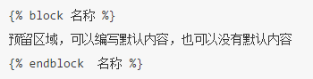

# Day70 Python Web 框架 Django（4）——Django模板

[TOC]


# 模板

## 重点

- 自带模板
  - 基本使用
  - 流程控制
  - 过滤器
  - 继承
- **Jinja2模板**
  - 配置
- **CSRF**
  - 原理
  - 如何防范

### Django使用自带模板

## 1 配置

在工程中创建模板目录templates。

在settings.py配置文件中修改**TEMPLATES**配置项的DIRS值：

```
TEMPLATES = [
    {
        'BACKEND': 'django.template.backends.django.DjangoTemplates',
        'DIRS': [os.path.join(BASE_DIR, 'templates')],  # 此处修改
        'APP_DIRS': True,
        'OPTIONS': {
            'context_processors': [
                'django.template.context_processors.debug',
                'django.template.context_processors.request',
                'django.contrib.auth.context_processors.auth',
                'django.contrib.messages.context_processors.messages',
            ],
        },
    },
]
```

### 2 定义模板

在templates目录中新建一个模板文件，如index.html

```
<!DOCTYPE html>
<html lang="en">
<head>
    <meta charset="UTF-8">
    <title>Title</title>
</head>
<body>
{{ city }}
</body>
</html>
```

### 3 模板渲染

调用模板分为两步骤：

1. 找到模板 loader.get_template(模板文件在模板目录中的相对路径) -> 返回模板对象
2. 渲染模板 模板对象.render(context=None, request=None) -> 返回渲染后的html文本字符串 context 为模板变量字典，默认值为None request 为请求对象，默认值为None

例如，定义一个视图

```
from django.http import HttpResponse
from django.template import loader

def index(request):
    # 1.获取模板
    template=loader.get_template('index.html')

    context={'city': '北京'}
    # 2.渲染模板
    return HttpResponse(template.render(context))
```

**Django提供了一个函数render可以简写上述代码。**

render(request对象, 模板文件路径, 模板数据字典)

```
from django.shortcuts import render

def index(request):
    context={'city': '北京'}
    return render(request,'index.html',context)
```

### 4 模板语法

#### 4.1 模板变量

变量名必须由字母、数字、下划线（不能以下划线开头）和点组成。

语法如下：


模板变量可以使python的内建类型，也可以是对象。

```
def index(request):
    context = {
        'city': '北京',
        'adict': {
            'name': '西游记',
            'author': '吴承恩'
        },
        'alist': [1, 2, 3, 4, 5]
    }
    return render(request, 'index.html', context)
```


#### 4.2 模板语句

**1）for循环：**


**2）if条件：**


比较运算符如下：

```
==
!=
<
>
<=
>=
```

布尔运算符如下：

```
and
or
not
```

**注意：运算符左右两侧不能紧挨变量或常量，必须有空格。**


### 4.3 注释

1）单行注释语法如下：


2）多行注释使用comment标签，语法如下：


# 过滤器

语法如下:

- 使用管道符号|来应用过滤器，用于进行计算、转换操作，可以使用在变量、标签中。

- 如果过滤器需要参数，则使用冒号:传递参数。

- ```
  变量|过滤器:参数
  ```

列举几个如下：

- **safe**，禁用转义，告诉模板这个变量是安全的，可以解释执行

- **length**，长度，返回字符串包含字符的个数，或列表、元组、字典的元素个数。

- **default**，默认值，如果变量不存在时则返回默认值。

- ```
  data|default:'默认值'
  ```

- **date**，日期，用于对日期类型的值进行字符串格式化，常用的格式化字符如下：

  - Y表示年，格式为4位，y表示两位的年。

  - m表示月，格式为01,02,12等。

  - d表示日, 格式为01,02等。

  - j表示日，格式为1,2等。

  - H表示时，24进制，h表示12进制的时。

  - i表示分，为0-59。

  - s表示秒，为0-59。

  - ```
    value|date:"Y年m月j日  H时i分s秒"
    ```

# 模板继承

模板继承和类的继承含义是一样的，主要是为了提高代码重用，减轻开发人员的工作量。

**父模板**

如果发现在多个模板中某些内容相同，那就应该把这段内容定义到父模板中。

标签block：用于在父模板中预留区域，留给子模板填充差异性的内容，名字不能相同。 为了更好的可读性，建议给endblock标签写上名字，这个名字与对应的block名字相同。父模板中也可以使用上下文中传递过来的数据。

**子模板**

标签extends：继承，写在子模板文件的第一行。



子模版不用填充父模版中的所有预留区域，如果子模版没有填充，则使用父模版定义的默认值。


填充父模板中指定名称的预留区域。


# Django使用jinja2模板

### jinja2介绍

> Jinja2：是 Python 下一个被广泛应用的模板引擎，是由Python实现的模板语言，他的设计思想来源于 Django 的模板引擎，并扩展了其语法和一系列强大的功能，尤其是Flask框架内置的模板语言

由于django默认模板引擎功能不齐全,速度慢，所以我们也可以在Django中使用jinja2, jinja2宣称比django默认模板引擎快10-20倍。

Django主流的第三方APP基本上也都同时支持Django默认模板及jinja2，所以要用jinja2也不会有多少障碍。

### 安装jinja2模块

```
    pip install jinja2
```

### Django配置jinja2

1. 在项目文件中创建 jinja2_env.py 文件

```
from jinja2 import Environment

def environment(**options):
    env = Environment(**options)

    return env
```

2.在settings.py文件

```
TEMPLATES = [
    {
        'BACKEND': 'django.template.backends.jinja2.Jinja2',#修改1
        'DIRS': [os.path.join(BASE_DIR, 'templates')],
        'APP_DIRS':True,
        'OPTIONS':{
            'environment': 'jinja2_env.environment',# 修改2
            'context_processors':[
                'django.template.context_processors.debug',
                'django.template.context_processors.request',
                'django.contrib.auth.context_processors.auth',
                'django.contrib.messages.context_processors.messages',
            ],
        },
    },
]
```

### jinja2模板的使用绝大多数和Django自带模板一样


### jinja2自定义过滤器

[Django文档](https://docs.djangoproject.com/en/1.11/topics/templates/#module-django.template.backends.django)

##### 在jinja2_env.py文件中自定义过滤器

```
from jinja2 import Environment

def environment(**options):
    env = Environment(**options)

    # 2.将自定义的过滤器添加到 环境中
    env.filters['do_listreverse'] = do_listreverse

    return env

# 1.自定义过滤器
def do_listreverse(li):
    if li == "B":
        return "哈哈"
```

# CSRF

- `CSRF`全拼为`Cross Site Request Forgery`，译为跨站请求伪造。

- ```
  CSRF
  ```

  指攻击者盗用了你的身份，以你的名义发送恶意请求。

  - 包括：以你名义发送邮件，发消息，盗取你的账号，甚至于购买商品，虚拟货币转账......

- 造成的问题：个人隐私泄露以及财产安全。

### CSRF攻击示意图

- 客户端访问服务器时没有同服务器做安全验证


### 防止 CSRF 攻击

##### 步骤

1. 在客户端向后端请求界面数据的时候，后端会往响应中的 cookie 中设置 csrf_token 的值
2. 在 Form 表单中添加一个隐藏的的字段，值也是 csrf_token
3. 在用户点击提交的时候，会带上这两个值向后台发起请求
4. 后端接受到请求，以会以下几件事件：
   - 从 cookie中取出 csrf_token
   - 从 表单数据中取出来隐藏的 csrf_token 的值
   - 进行对比
5. 如果比较之后两值一样，那么代表是正常的请求，如果没取到或者比较不一样，代表不是正常的请求，不执行下一步操作

### 代码演示

##### 未进行 csrf 校验的 WebA

- 后端代码实现

```
#定义路由
from django.conf.urls  import url
from pay import views
urlpatterns = [
    url(r'^$',views.LoginView.as_view(),name='index'),   #登录路由 
    url(r'^transfer/$',views.TransferView.as_view(),name='transfer'), #转账路由
]

#定义视图
class LoginView(View):

    def post(self,request):

        # 取到表单中提交上来的参数
        username = request.POST.get("username")
        password = request.POST.get("password")

        if not all([username, password]):
            print('参数错误')
        else:
            print(username, password)
            if username == 'laowang' and password == '1234':
                # 状态保持，设置用户名到cookie中表示登录成功
                response = redirect(reverse('transfer'))
                response.set_cookie('username', username)
                return response
            else:
                print('密码错误')
        return render(request,'login.html')
    def get(self,request):
        return render(request,'login.html')

class TransferView(View):


    def post(self,request):
        # 从cookie中取到用户名
        username = request.COOKIES.get('username', None)
        # 如果没有取到，代表没有登录
        if not username:
            return redirect(reverse('index'))


        to_account = request.POST.get("to_account")
        money = request.POST.get("money")

        print('假装执行转操作，将当前登录用户的钱转账到指定账户')
        return HttpResponse('转账 %s 元到 %s 成功' % (money, to_account))

    def get(self, request):
        # 渲染转换页面
        response = render(request, 'transfer.html')

        return response
```

- 前端登录页面代码

```
<!DOCTYPE html>
<html lang="en">
<head>
    <meta charset="UTF-8">
    <title>登录</title>
</head>
<body>

<h1>我是网站A，登录页面</h1>

<form method="post">
    <label>用户名：</label><input type="text" name="username" placeholder="请输入用户名"><br/>
    <label>密码：</label><input type="password" name="password" placeholder="请输入密码"><br/>
    <input type="submit" value="登录">
</form>

</body>
</html>
```

- 前端转账页面代码

```
<!DOCTYPE html>
<html lang="en">
<head>
    <meta charset="UTF-8">
    <title>转账</title>
</head>
<body>
<h1>我是网站A，转账页面</h1>

<form method="post">
    <label>账户：</label><input type="text" name="to_account" placeholder="请输入要转账的账户"><br/>
    <label>金额：</label><input type="number" name="money" placeholder="请输入转账金额"><br/>
    <input type="submit" value="转账">
</form>

</body>
</html>
```

> 运行测试，如果在未登录的情况下，不能直接进入转账页面，测试转账是成功的

##### 攻击网站B的代码

- 后端代码实现

```
#定义路由
from django.conf.urls import url
from ads import views

urlpatterns = [
    url(r'^$',views.AdsView.as_view()),
]

#定义视图
class AdsView(View):

    def get(self,request):

        return render(request,'index.html')
```

- 前端代码实现

```
<!DOCTYPE html>
<html lang="en">
<head>
    <meta charset="UTF-8">
    <title>Title</title>
</head>
<body>

<h1>我是网站B</h1>

<form method="post" action="http://127.0.0.1:9000/transfer/">
    <input type="hidden" name="to_account" value="黑客">
    <input type="hidden" name="money" value="190000" hidden>
    <input type="submit" value="点击领取优惠券">
</form>

</body>
</html>
```

> 运行测试，在用户登录网站A的情况下，点击网站B的按钮，可以实现伪造访问

### 在网站A中实现 csrf_token 校验的流程

- 导入生成 csrf_token 的函数

```
 from django.middleware.csrf import get_token
 csrf_token = get_token(request)
```

- 在渲染转账页面的，做以下几件事情：

  1. 生成 csrf_token 的值
  2. 在返回转账页面的响应里面设置 csrf_token 到 cookie 中
  3. 将 csrf_token 保存到表单的隐藏字段中

  ```
   def get(self, request):
          # 生成csrf_token
          from django.middleware.csrf import get_token
          csrf_token = get_token(request)
  
          # 渲染转换页面，传入 csrf_token 到模板中
          response = render(request, 'transfer.html',context={'csrf_token':csrf_token})
  
          # 设置csrf_token到cookie中，用于提交校验
          response.set_cookie('csrf_token', csrf_token)
  
          return response
  ```

- 在转账模板表单中添加 csrf_token 隐藏字段

```
<head>
    <meta charset="UTF-8">
    <title>转账</title>
</head>
<body>
<h1>我是网站A，转账页面</h1>

<form method="post">
    <input type="hidden" name="csrftoken" value="{{ csrf_token }}">
    <label>账户：</label><input type="text" name="to_account" placeholder="请输入对方账户"><br/>
    <label>金额：</label><input type="number" name="money" placeholder="请输入转账金额"><br/>
    <input type="submit" value="转账">
</form>

</body>
</html>
```

运行测试，进入到转账页面之后，查看 cookie 和 html 源代码


- 在执行转账逻辑之前进行 csrf_token 的校验

```
 # 取出表单中的 csrf_token
 form_csrf_token = request.POST.get("csrftoken")
 # 取出 cookie 中的 csrf_token
 cookie_csrf_token = request.COOKIES.get('csrf_token')
 # 进行对比
 if cookie_csrf_token != form_csrf_token:
     return HttpResponse('token校验失败，可能是非法操作')
```

运行测试，用户直接在网站 A 操作没有问题，再去网站B进行操作，发现转账不成功，因为网站 B 获取不到表单中的 csrf_token 的隐藏字段，而且浏览器有**同源策略**，网站B是获取不到网站A的 cookie 的，所以就解决了**跨站请求伪造**的问题

## 在 Django项目中解决 CSRF 攻击

Django默认是开启CSRF的


模板中设置 CSRF 令牌

```

或者
<input type="hidden" value="{{ csrf_token }}">
```


-16947612810458-16952781778515.jpg)

