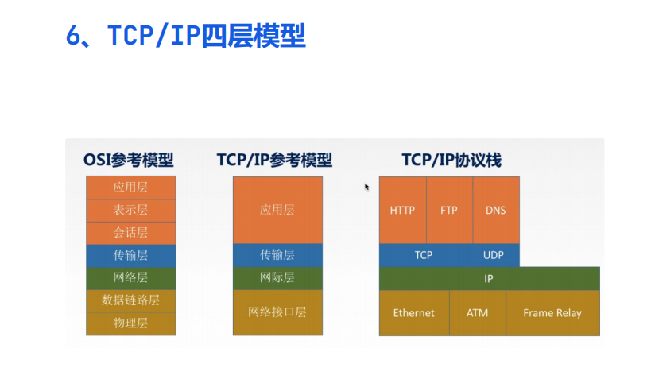
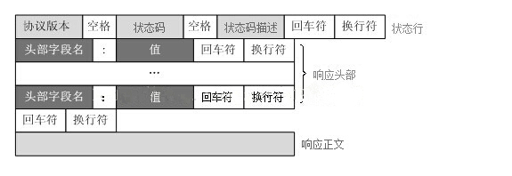

# Day71 计算机网络相关知识提要

[TOC]


# 计算机网络

## 一、网络 7 层架构(ISO/OSI协议参考模型)

​	物理层：主要定义物理设备标准，如网线的接口类型、光纤的接口类型、各种传输介质的传输速率等。它的主要作用是传输比特流（就是由 1、0 转化为电流强弱来进行传输,到达目的地后在转化为1、0，也就是我们常说的模数转换与数模转换）。这一层的数据叫做比特。
​	数据链路层：主要将从物理层接收的数据进行 MAC 地址（网卡的地址）的封装与解封装。常把这一层的数据叫做帧。在这一层工作的设备是交换机，数据通过交换机来传输。
​	网络层：主要将从下层接收到的数据进行 IP 地址（例 192.168.0.1)的封装与解封装。在这一层工作的设备是路由器，常把这一层的数据叫做数据包。
​	传输层：定义了一些传输数据的协议和端口号（WWW 端口 80 等），如：TCP（传输控制协议，传输效率低，可靠性强，用于传输可靠性要求高，数据量大的数据），UDP（用户数据报协议，与 TCP 特性恰恰相反，用于传输可靠性要求不高，数据量小的数据，如 QQ 聊天数据就是通过这种方式传输的）。 主要是将从下层接收的数据进行分段进行传输，到达目的地址后在进行重组。常常把这一层数据叫做段。
​	会话层：通过传输层（端口号：传输端口与接收端口）建立数据传输的通路。主要在你的系统之间发起会话或或者接受会话请求（设备之间需要互相认识可以是 IP 也可以是 MAC 或者是主机名）
​	表示层：主要是进行对接收的数据进行解释、加密与解密、压缩与解压缩等（也就是把计算机能够识别的东西转换成人能够能识别的东西（如图片、声音等））
​	应用层：主要是一些终端的应用，比如说FTP（各种文件下载），WEB（IE浏览），QQ之类的（你就把它理解成我们在电脑屏幕上可以看到的东西．就 是终端应用）。
​	
​	
​	

## 二、TCP/IP 原理

​	TCP/IP 协议不是 TCP 和 IP 这两个协议的合称，而是指因特网整个 TCP/IP 协议族。从协议分层模型方面来讲，TCP/IP 由四个层次组成：网络接口层、网络层、传输层、应用层。
​	

	1、应用层(Application Layer)
	    应用层(Application Layer)包含所有的高层协议，包括：虚拟终端协议(TELNET，TELecommunications NETwork)、文件传输协议(FTP，File Transfer Protocol)、电子邮件传输协议(SMTP，Simple Mail Transfer Protocol)、域名服务(DNS，Domain Name Service)、网上新闻传输协议(NNTP，Net News Transfer Protocol)和超文本传送协议(HTTP，HyperText Transfer Protocol)等。
	2、传输层(Tramsport Layer-TCP/UDP)
	    传输层(Tramsport Layer)使源端和目的端机器上的对等实体可以进行会话。在这一层定义了两个端到端的协议：传输控制协议(TCP，Transmission Control Protocol)和用户数据报协议(UDP，User Datagram Protocol)。TCP 是面向连接的协议，它提供可靠的报文传输和对上层应用的连接服务。为此，除了基本的数据传输外，它还有可靠性保证、流量控制、多路复用、优先权和安全性控制等功能。UDP 是面向无连接的不可靠传输的协议，主要用于不需要 TCP 的排序和流量控制等功能的应用程序。
	3、网络层(Internet Layer)
	  网络层(Internet Layer)是整个体系结构的关键部分，其功能是使主机可以把分组发往任何网络，并使分组独立地传向目标。这些分组可能经由不同的网络，到达的顺序和发送的顺序也可能不同。高层如果需要顺序收发，那么就必须自行处理对分组的排序。互联网层使用因特网协议(IP，Internet Protocol)。
	4、网络访问层(Network Access Layer)
	   网络访问层(Network Access Layer)在 TCP/IP ：是TCP/IP协议栈的最底层，它提供物理网络的接口，实现对复杂数据的发送和接收。网络访问层协议为网络接口、数据传输提供了对应的技术规范。网络访问层对应 OSI 七层网络模型的物理层和数据链路层。
	5、四层协议和对应的标准七层协议的关系如下图
	————————————————

## 三、TCP 三次握手/四次挥手

​	1、三次握手
​	SYN：同步序列编号（Synchronize Sequence Numbers）、seq：序号--sequence number、
ACK (Acknowledge character）即是确认字符  、ack number 确认序号
​	第一次握手： 主机 A 发送位码为 syn＝1,随机产生 seq number=1234567 的数据包到服务器主机 B，由 SYN=1 知道，A 要求建立联机；
​	第二次握手： 主机 B 收到请求后要确认联机信息，向 A 发 送 ack number=( 主 机 A 的seq+1),syn=1,ack=1,随机产生 seq=7654321 的包
​	第三次握手： 主机 A 收到后检查 ack number 是否正确，即第一次发送的 seq number+1,以及位码ack 是否为 1，若正确，主机 A 会再发送 ack number=(主机 B 的 seq+1),ack=1，主机 B 收到后确认。
​	

	2、四次挥手
	TCP 建立连接要进行三次握手，而断开连接要进行四次。这是由于 TCP 的半关闭造成的。因为 TCP 连接是全双工的(即数据可在两个方向上同时传递)，所以进行关闭时每个方向上都要单独进行关闭。这个单方向的关闭就叫半关闭。当一方完成它的数据发送任务，就发送一个 FIN 来向另一方通告将要终止这个方向的连接。
	关闭客户端到服务器的连接：首先客户端 A 发送一个 FIN，用来关闭客户到服务器的数据传送，然后等待服务器的确认。其中终止标志位 FIN=1，序列号 seq=u
	服务器收到这个 FIN，它发回一个 ACK，确认号 ack 为收到的序号加 1。
	关闭服务器到客户端的连接：也是发送一个 FIN 给客户端。
	客户段收到 FIN 后，并发回一个 ACK 报文确认，并将确认序号 seq 设置为收到序号加 1。首先进行关闭的一方将执行主动关闭，而另一方执行被动关闭。
	————————————————
	主机 A 发送 FIN 后，进入终止等待状态， 服务器 B 收到主机 A 连接释放报文段后，就立即给主机 A 发送确认，然后服务器 B 就进入 close-wait 状态，此时 TCP 服务器进程就通知高层应用进程，因而从 A 到 B 的连接就释放了。此时是“半关闭”状态。即 A 不可以发送给B，但是 B 可以发送给 A。此时，若 B 没有数据报要发送给 A 了，其应用进程就通知 TCP 释放连接，然后发送给 A 连接释放报文段，并等待确认。A 发送确认后，进入 time-wait，注意，此时 TCP 连接还没有释放掉，然后经过时间等待计时器设置的 2MSL 后，A 才进入到close 状态。
	为什么会有TIME_WAIT状态：
		确保有足够的时间让对方收到ACK包
		避免新旧连接混淆
	3、TCP/IP状态
		1、LISTENING（listening)
		FTP服务启动后首先处于侦听（LISTENING）状态。
		2、ESTABLISHED（established）
		建立连接。表示两台机器正在通信。
		3、CLOSE_WAIT
		对方主动关闭连接或者网络异常导致连接中断，这时我方的状态会变成CLOSE_WAIT，此时我方要调用close()来使得连接正确关闭。
		4、TIME_WAIT
		我方主动调用close()断开连接，收到对方确认后状态变为TIME_WAIT。
		5、SYN_SENT
		SYN_SENT状态表示请求连接，当你要访问其它的计算机的服务时首先要发个同步信号给该端口，此时状态为SYN_SENT，如果连接成功了就变为 ESTABLISHED。

## 四、TCP 长连接与短连接

​	1、长连接和短连接使用原因
​	当网络通信时采用TCP协议时，在真正的读写操作之前，server与client之间必须建立一个连接，当读写操作完成后，双方不再需要这个连接时它们可以释放这个连接，连接的建立是需要三次握手的，而释放则需要4次挥手，所以说每个连接的建立都是需要资源消耗和时间消耗的。
​	2、HTTP的长连接和短连接
​	HTTP的长连接和短连接本质上是TCP长连接和短连接。
​	在HTTP/1.0中默认使用短连接。也就是说，客户端和服务器每进行一次HTTP操作，就建立一次连接，任务结束就中断连接。当客户端浏览器访问的某个HTML或其他类型的Web页中包含有其他的Web资源（如JavaScript文件、图像文件、CSS文件等），每遇到这样一个Web资源，浏览器就会重新建立一个HTTP会话。
​	而从HTTP/1.1起，默认使用长连接，用以保持连接特性。使用长连接的HTTP协议，会在响应头加入这行代码：
​	Connection:keep-alive
​	1
​	在使用长连接的情况下，当一个网页打开完成后，客户端和服务器之间用于传输HTTP数据的TCP连接不会关闭，客户端再次访问这个服务器时，会继续使用这一条已经建立的连接。Keep-Alive不会永久保持连接，它有一个保持时间，可以在不同的服务器软件（如Apache）中设定这个时间。实现长连接需要客户端和服务端都支持长连接。
​	3、TCP—长连接
​	 所谓长连接，指在一个TCP连接上可以连续发送多个数据包，在TCP连接保持期间，如果没有数据包发送，需要双方发检测包以维持此连接，一般需要自己做在线维持（不发生RST包和四次挥手）。
​	连接→数据传输→保持连接(心跳)→数据传输→保持连接(心跳)→……→关闭连接（一个TCP连接通道多个读写通信）；
​	这就要求长连接在没有数据通信时，定时发送数据包(心跳)，以维持连接状态；
​	 TCP保活功能，保活功能主要为服务器应用提供，服务器应用希望知道客户主机是否崩溃，从而可以代表客户使用资源。如果客户已经消失，使得服务器上保留一个半开放的连接，而服务器又在等待来自客户端的数据，则服务器将应远等待客户端的数据，保活功能就是试图在服务器端检测到这种半开放的连接。
​	4、TCP—短连接
​	 短连接是指通信双方有数据交互时，就建立一个TCP连接，数据发送完成后，则断开此TCP连接（管理起来比较简单，存在的连接都是有用的连接，不需要额外的控制手段）；
​	 连接→数据传输→关闭连接；
​	5、应用场景
​	 长连接： 多用于操作频繁（读写），点对点的通讯，而且连接数不能太多情况，。每个TCP连接都需要三步握手，这需要时间，如果每个操作都是先连接，再操作的话那么处理速度会降低很多，所以每个操作完后都不断开，次处理时直接发送数据包就OK了，不用建立TCP连接。
​	例如：数据库的连接用长连接， 如果用短连接频繁的通信会造成socket错误，而且频繁的socket 创建也是对资源的浪费。
​	 短连接： 像WEB网站的http服务一般都用短链接（http1.0只支持短连接，1.1keep alive 带时间，操作次数限制的长连接），因为长连接对于服务端来说会耗费一定的资源，而像WEB网站这么频繁的成千上万甚至上亿客户端的连接用短连接会更省一些资源，如果用长连接，而且同时有成千上万的用户，如果每个用户都占用一个连接的话，那可想而知吧。所以并发量大，但每个用户无需频繁操作情况下需用短连好；

## 五、HTTP原理

​	 HTTP 是一个无状态的协议。无状态是指客户机（Web 浏览器）和服务器之间不需要建立持久的连接，这意味着当一个客户端向服务器端发出请求，然后服务器返回响应(response)，连接就被关闭了，在服务器端不保留连接的有关信息.HTTP 遵循请求(Request)/应答(Response)模型。客户机（浏览器）向服务器发送请求，服务器处理请求并返回适当的应答。所有 HTTP 连接都被构造成一套请求和应答。
​	1、地址解析
​	如用客户端浏览器请求这个页面：http://www.lydms.com:8080/index.htm 从中分解出协议名、主机名、端口、对象路径等部分，对于我们的这个地址，解析得到的结果如下：
​	协议名： http
​	主机名： www.lydms.com
​	端口： 8080
​	对象路径： /index.htm
​	在这一步，需要域名系统 DNS 解析域名 localhost.com,得主机的 IP 地址。
​	2、封装 HTTP 请求数据包
​	把以上部分结合本机自己的信息，封装成一个 HTTP 请求数据包
​	3、封装成 TCP 包并建立连接
​	封装成 TCP 包，建立 TCP 连接（TCP 的三次握手）
​	4、客户机发送请求命
​	客户机发送请求命令：建立连接后，客户机发送一个请求给服务器，请求方式的格式为：统一资源标识符（URL）、协议版本号，后边是 MIME 信息包括请求修饰符、客户机信息和可内容。
​	5、服务器响应
​	服务器接到请求后，给予相应的响应信息，其格式为一个状态行，包括信息的协议版本号、一个成功或错误的代码，后边是 MIME 信息包括服务器信息、实体信息和可能的内容。
​	6、服务器关闭 TCP 连接
​	一般情况下，一旦 Web 服务器向浏览器发送了请求数据，它就要关闭 TCP 连接，然后如果浏览器或者服务器在其头信息加入了这行代码 Connection:keep-alive，TCP 连接在发送后将仍然保持打开状态，于是，浏览器可以继续通过相同的连接发送请求。保持连接节省了为每个请求建立新连接所需的时间，还节约了网络带宽。

## 六、HTTPS

​	六、HTTPS
​	HTTPS（全称：Hypertext Transfer Protocol over Secure Socket Layer），是以安全为目标的HTTP 通道，简单讲是 HTTP 的安全版。即 HTTP 下加入 SSL 层，HTTPS 的安全基础是 SSL。其所用的端口号是 443。 过程大致如下：
​	1、SSL/TLS之间的关系
​	SSL 是英文“Secure Sockets Layer”的缩写，中文叫做“安全套接层”。它是在上世纪90年代中期，由网景公司设计的。
​	为啥要发明 SSL 这个协议呢？因为原先互联网上使用的 HTTP 协议是明文的，存在很多缺点——比如传输内容会被偷窥（嗅探）和篡改。发明 SSL 协议，就是为了解决这些问题。
​	到了1999年，SSL 因为应用广泛，已经成为互联网上的事实标准。IETF 就在那年把 SSL 标准化。标准化之后的名称改为 TLS（是“Transport Layer Security”的缩写），中文叫做“传输层安全协议”。
​	很多人都把这两者并列称呼（SSL/TLS），因为这两者可以视作同一个东西的不同阶段。
​	2、建立连接获取证书
​	SSL 客户端通过 TCP 和服务器建立连接之后（443 端口），并且在一般的 tcp 连接协商（握手）过程中请求证书。即客户端发出一个消息给服务器，这个消息里面包含了自己可实现的算法列表和其它一些需要的消息，SSL 的服务器端会回应一个数据包，这里面确定了这次通信所需要的算法，然后服务器向客户端返回证书。（证书里面包含了服务器信息：域名。申请证书的公司，公共秘钥）。
​	3、证书验证
​	Client 在收到服务器返回的证书后，判断签发这个证书的公共签发机构，并使用这个机构的公共秘钥确认签名是否有效，客户端还会确保证书中列出的域名就是它正在连接的域名。
​	4、数据加密和传输
​	如果确认证书有效，那么生成对称秘钥并使用服务器的公共秘钥进行加密。然后发送给服务器，服务器使用它的私钥对它进行解密，这样两台计算机可以开始进行对称加密进行通信。
​	

## 七、CDN 原理

​	CND 一般包含分发服务系统、负载均衡系统和管理系统。
​	1、分发服务系统
​	其基本的工作单元就是各个 Cache 服务器。负责直接响应用户请求，将内容快速分发到用户；同时还负责内容更新，保证和源站内容的同步。根据内容类型和服务种类的不同，分发服务系统分为多个子服务系统，如：网页加速服务、流媒体加速服务、应用加速服务等。每个子服务系统都是一个分布式的服务集群，由功能类似、地域接近的分布部署的 Cache 集群组成。在承担内容同步、更新和响应用户请求之外，分发服务系统还需要向上层的管理调度系统反馈各个Cache 设备的健康状况、响应情况、内容缓存状况等，以便管理调度系统能够根据设定的策略决定由哪个 Cache 设备来响应用户的请求。
​	2、负载均衡系统
​	负载均衡系统是整个 CDN 系统的中枢。负责对所有的用户请求进行调度，确定提供给用户的最终访问地址。使用分级实现。最基本的两极调度体系包括全局负载均衡（GSLB）和本地负载均衡（SLB）。GSLB 根据用户地址和用户请求的内容，主要根据就近性原则，确定向用户服务的节点。一般通过 DNS解析或者应用层重定向（Http 3XX 重定向）的方式实现。SLB 主要负责节点内部的负载均衡。当用户请求从 GSLB 调度到 SLB 时，SLB 会根据节点内各个Cache 设备的工作状况和内容分布情况等对用户请求重定向。SLB 的实现有四层调度（LVS）、七层调度（Nginx）和链路负载调度等。
​	3、管理系统
​	分为运营管理和网络管理子系统。网络管理系统实现对 CDN 系统的设备管理、拓扑管理、链路监控和故障管理，为管理员提供对全网资源的可视化的集中管理，通常用 web 方式实现。运营管理是对 CDN 系统的业务管理，负责处理业务层面的与外界系统交互所必须的一些收集、整理、交付工作。
​	包括用户管理、产品管理、计费管理、统计分析等。

## 八、TCP/IP协议族

​	TCP/IP只提供无连接、不可靠的服务。
​	传输之前需要进行三次握手。
​	IP的主要功能包括将上层数据(如TCP、UDP数据)或者同层的其它数据(如ICMP数据)封装到IP数据报中，将IP数据报传送到最终目的地；为了使数据能够在链路层上进行传输，对数据进行分段，确定数据报到达其它网络中的目的地的路径。
​	1、应用层协议—文件传输服务(FTP)
​	用来在计算机之间传输文件。
​	实际Internet的FTP服务是一种匿名(anonymous)FTP服务，设置一个特殊的用户名-anonymous，供公众使用。
​	匿名登录到FTP服务器后，其工作方式与常规FTP相同。通常处于安全目的，大多数匿名FTP服务器只允许下载，不允许上传文件。
​	FTP在客户端到服务器建立2条TCP连接，一条是控制连接，主要用于传输命令和参数(端口21)；另一条是数据连接，主要用于传输文件(端口号20)。
​	2、应用层协议—远程登录协议(Telnet)
​	远程登录服务实在Telnet协议的支持下，将用户计算机和远程主机连接起来，在远程计算机上运行程序，用户输入的信息通过Telnet协议发送给远程主机，主机在TCP端口监听用户请求，并处理后，将结果通过Telnet协议返回给客户。客户再经过适当的转换显示在计算机屏幕上。因为使用Telnet命令进行远程登录，所有称为Telnet远程登录。
​	由客户端软件、服务器软件以及Telnet通用协议三部分组成。
​	3、应用层协议—电子邮件协议（SMTP)
​	电子邮件(E-mail)利用计算机进行信息交换的电子媒体信件。
​	基于客户端/服务器模式，有E-mail客户端软件、E-mail服务器、通信协议三部分组成。发送邮件，首先到达自己注册的邮件服务器主机，再在网络传输中经过多个计算机和路由中转到达目的地的邮件服务器主机，进入收件人的电子邮箱，最后邮件的接收者上网并启动电子邮件管理程序，会自动下载到自己计算机，完成接受邮件。
​	SMTP：简单邮件传输协议
​	MIME：Internet邮件扩充协议
​	PEM：增强私密邮件保护协议
​	POP：来保管用户未能及时取走的邮件，简单的纯文本协议，每次传输以正规E-mail为单位，不提供部分传输。
​	4、传输层协议—TCP
​	在IP提供的不可靠数据服务的基础上为应用程序提供一个可靠的、面向连接的、全双工的数据传输服务。TCP在源主机和目的之间建立和关闭连接操作是，均需要通过三次握手来确认建立和关闭是否成功。TCP虽然提供了一个可靠的数据传输服务，但是以牺牲通信量来实现的。
​	TCP采用了重发技术： 发送数据时，启动定时器，在规定时间内没有收到确认信息，就重新发送数据包。
​	5、传输层协议—UDP
​	用户数据报协议是一种不可靠、无连接的协议，与同层面向连接的TCP相比，UDP是一种无连接的协议(无错误检测功能)。TCP有助于提供可靠的连接，UDP有助于提高传输的高速率性。不负责重新发送丢失的包，不对接收的数据进行排序，不消除重复的IP数据报，不负责建立和终止连接。(都是UDP应用程序负责的)
​	TCP：交互式会话应用程序(FTP等)。
​	UDP：自己进行错误检测、不需要检测错误(DNS、SNMP)。
​	6、网际层协议—IP
​	IP只提供无连接、不可靠的服务，把差错检测和流量控制之类的服务授权给了其他层的协议。
​	IP的主要功能：
​	将上层数据(TCP、UDP数据)或同层其他数据(ICMP数据)封装到IP数据报中；
​	将IP数据报传送到最终目的地；
​	为了使数据能够在链路层上进行传输，对数据进行分段；
​	确定数据报到达其它网络中的目的地的路径。
​	7、网际层协议—ICMP
​	Internet控制信息协议，用于发送查错报文的协议。ICMP让IP更加稳固。也是利用IP来传送报文的。ping工具就是利用ICMP报文进行目标是否可达测试。
​	5种差错报文：(源抑制、超时、目的不可达、重定向和要求分段)
​	4种信息报文：回应请求、回应应答、地址屏蔽码请求和地址屏蔽码应答。
​	8、网际层协议—ARP和RARP
​	地址解析协议(ARP)和反地址解析协议(RARP)
​	ARP的作用是将IP地址转为物理地址，RARP的作用是将物理地址转为IP地址。每台设备都有唯一的物理地址(通过网卡给出)，为了屏蔽底层协议及物理地址上的差异，IP协议又使用了IP地址。因此，在传输过程中，必须对IP地址和物理地址进行相互转换。
​	9、网络接口层协议—以太网(Ethernet IEEE 802.3
​	Ethernet IEEE 802.3：标准局域网，速度10Mps，传输介质为铜缆。
​	Ethernet IEEE 802.3u：快速以太网，速度100Mps，传输介质为双绞线。
​	Ethernet IEEE 802.3z：千兆以太网，速度1000Mps，传输介质为光纤或双绞线。
​	10、网络接口层协议—令牌环网(Ethernet IEEE 802.5)
​	1、只有拥有令牌才可以发送数据。
​	2、发送数据时，需要捕获一个令牌。
​	3、令牌不为空，需要等待。
​	11、网络接口层协议—光纤分布式数据接口(FDDI)
​	以光纤为传输介质。
​	采用双环体系结构，两环上的信息反方向流动。双环中一环称为主环，另一个环称为次环。正常情况下，主环传输数据，次环处于空闲状态。
​	双环设计的目的是提供高可靠性和稳定性。FDDI定义的传输介质有单模光纤和多模光纤两种。
​	12、网络接口层协议—点对点协议(PPP)
​	主要用于”拨号上网“这种广域连接模式。优点简单、具备用户验证功能、可以解决IP分配等。为各种主机、网桥和路由器之间简单连接的一种通用解决方案。
​	利用以太网(Ethernet)资源在以太网上运行PPP来进行用户认证接入的方式成为PPPoE。是目前ADSL接入方式中最广泛的技术标准。
​	ATM网络撒花姑娘运行PPP来管理用户再认证的方式成为PPPoA。
​	PPPoA和PPPoE运行原理相同，不同的是运行环境的不同。
​	13、其他—ADSL(非对称用户数据线)
​	ADSL Modem上网拨号方式有3中，即专线方式(静态IP)、PPPoA和PPPoE。
​	ADSL独享带宽，安全可靠。费用低廉,使用过去的电话线路，可以分离电话机和ADSL Modem(上网)。
​	14、其他—IPv4和IPv6
​	IPv4：32位二进制，能表示IP地址个数：2^32=40亿
​	IPv6:128位二级制，能表示IP地址个数：2128=3.4*1038。

1、TCP和UDP的区别
	TCP提供面向连接的、可靠的数据流传输，而UDP提供的是非面向连接的、不可靠的数据流传输；
	TCP传输单位称为TCP报文段，UDP传输单位称为用户数据报；
	TCP注重数据安全性，UDP数据传输快，因为不需要连接等待，少了许多操作，但是其安全性却一般。

2. TCP和UDP分别对应的常见应用层协议？
   2.1 TCP对应的应用层协议
    FTP：定义了文件传输协议，使用21端口。常说某某计算机开了FTP服务便是启动了文件传输服务。下载文件，上传主页，都要用到FTP服务。
    Telnet：它是一种用于远程登陆的端口，用户可以以自己的身份远程连接到计算机上，通过这种端口可以提供一种基于DOS模式下的通信服务。如以前的BBS是-纯字符界面的，支持BBS的服务器将23端口打开，对外提供服务。
    SMTP：定义了简单邮件传送协议，现在很多邮件服务器都用的是这个协议，用于发送邮件。如常见的免费邮件服务中用的就是这个邮件服务端口，所以在电子邮件设置-中常看到有这么SMTP端口设置这个栏，服务器开放的是25号端口。
    POP3：它是和SMTP对应，POP3用于接收邮件。通常情况下，POP3协议所用的是110端口。也是说，只要你有相应的使用POP3协议的程序（例如Fo-xmail或Outlook），就可以不以Web方式登陆进邮箱界面，直接用邮件程序就可以收到邮件（如是163邮箱就没有必要先进入网易网站，再进入自己的邮-箱来收信）。
    HTTP：从Web服务器传输超文本到本地浏览器的传送协议。
   2.2 UDP对应的应用层协议
    DNS：用于域名解析服务，将域名地址转换为IP地址。DNS用的是53号端口。
    SNMP：简单网络管理协议，使用161号端口，是用来管理网络设备的。由于网络设备很多，无连接的服务就体现出其优势。
    TFTP(Trival File Transfer Protocal)：简单文件传输协议，该协议在熟知端口69上使用UDP服务。

   各协议对应的端口号

   摘自计算机网络(面试必备知识点)

3. TCP协议如何来保证传输的可靠性
   TCP提供一种面向连接的、可靠的字节流服务。其中，面向连接意味着两个使用TCP的应用（通常是一个客户和一个服务器）在彼此交换数据之前必须先建立一个TCP连接。在一个TCP连接中，仅有两方进行彼此通信；而字节流服务意味着两个应用程序通过TCP链接交换8bit字节构成的字节流，TCP不在字节流中插入记录标识符。
   对于可靠性，TCP通过以下方式进行保证：
   数据包校验：目的是检测数据在传输过程中的任何变化，若校验出包有错，则丢弃报文段并且不给出响应，这时TCP发送数据超时后会重发数据；
   对失序数据包重排序：既然TCP报文段作为IP数据报来传输，而IP数据报的到达可能会失序，因此TCP报文段的到达也可能会失序。TCP将对失序数据进行重新排序，然后才交给应用层；
   丢弃重复数据：对于重复数据，能够丢弃重复数据；
   应答机制：当TCP收到发自TCP连接另一端的数据，它将发送一个确认。这个确认不是立即发送，通常将推迟几分之一秒；
   超时重发：当TCP发出一个段后，它启动一个定时器，等待目的端确认收到这个报文段。如果不能及时收到一个确认，将重发这个报文段；
   流量控制：TCP连接的每一方都有固定大小的缓冲空间。TCP的接收端只允许另一端发送接收端缓冲区所能接纳的数据，这可以防止较快主机致使较慢主机的缓冲区溢出，这就是流量控制。TCP使用的流量控制协议是可变大小的滑动窗口协议。

4. 解释一下IP的定义，在哪个层上？主要作用是？TCP与UDP呢？
   IP是 Internet protocol 的缩写，是网络层的主要协议，作用是提供不可靠、无连接的数据包传输协传送。
    TCP是 Transmit Control Protocol（传输控制协议），在传输层，TCP提供一种面向连接的、可靠地字节流服务。
    UDP是 User Datagram Protocol（用户数据报协议），在传输层，UDP提供不可靠的传输控制数据服务。

5. IP地址的分类
   IP地址是指互联网协议地址，是IP协议提供的一种统一的地址格式，它为互联网上的每一个网络和每一台主机分配一个逻辑地址，以此来屏蔽物理地址的差异。IP地址编址方案将IP地址空间划分为A、B、C、D、E五类，其中A、B、C是基本类，D、E类作为多播和保留使用，为特殊地址。
   　　
     每个IP地址包括两个标识码（ID），即网络ID和主机ID。同一个物理网络上的所有主机都使用同一个网络ID，网络上的一个主机（包括网络上工作站，服务器和路由器等）有一个主机ID与其对应。A~E类地址的特点如下：
    A类地址：以0开头，第一个字节范围：0~127；
    B类地址：以10开头，第一个字节范围：128~191；
    C类地址：以110开头，第一个字节范围：192~223；
    D类地址：以1110开头，第一个字节范围为224~239；
    E类地址：以1111开头，保留地址

6. 分别写出OSI、TCP/IP及五层协议的体系结构
   从上至下
   OSI：应用层、表示层、会话层、传输层、网络层、数据链路层、物理层；
   TCP/IP：应用层、运输层、网际层、网络接口层；
   五层协议：应用层、运输层、网络层、数据链路层、物理层；

   6.1 OSI每一层对应的协议
   	体系	协议
   	物理层	RJ45、CLOCK、IEEE802.3 （中继器，集线器）
   	数据链路	PPP、FR、HDLC、VLAN、MAC（网桥，交换机）
   	网络层	IP、ICMP、ARP、RARP、OSPF、IPX、RIP、IGRP、（路由器）
   	传输层	TCP、UDP、SPX
   	会话层	NFS、SQL、NETBIOS、RPC
   	表示层	JPEG、MPEG、ASII
   	应用层	FTP、DNS、Telnet、SMTP、HTTP、WWW、NFS
   	
   6.2 OSI每一层的作用
   	体系	作用
   	物理层	通过媒介传输比特,确定机械及电气规范（比特Bit）
   	数据链路层	将比特组装成帧和点到点的传递（帧Frame）
   	网络层	负责数据包从源到宿的传递和网际互连（包PackeT）
   	传输层	提供端到端的可靠报文传递和错误恢复（段Segment）
   	会话层	建立、管理和终止会话（会话协议数据单元SPDU）
   	表示层	对数据进行翻译、加密和压缩（表示协议数据单元PPDU）
   	应用层	允许访问OSI环境的手段（应用协议数据单元APDU）
   	拓展：
   	网关的定义：一个链接两种不同协议簇的进程，为某一个特定的应用提供服务。
   	在TCP/IP协议簇中，IP层使用不可靠的服务，TCP提供可靠的服务，为了提供可靠到的服务，TCP采用了超时重传，发送和接收端到端的确认分组机制。
   	网桥是在数据链路层对网络进行互联的，路由器是在网络层对网络进行互联的。

7. 对称加密与非对称加密
   对称密钥加密是指加密和解密使用同一个密钥的方式，这种方式存在的最大问题就是密钥发送问题，即如何安全地将密钥发给对方；而非对称加密是指使用一对非对称密钥，即公钥和私钥，公钥可以随意发布，但私钥只有自己知道。发送密文的一方使用对方的公钥进行加密处理，对方接收到加密信息后，使用自己的私钥进行解密。典型的算法：DES
     由于非对称加密的方式不需要发送用来解密的私钥，所以可以保证安全性；但是和对称加密比起来，它非常的慢，所以我们还是要用对称加密来传送消息，但对称加密所使用的密钥我们可以通过非对称加密的方式发送出去。典型的算法：RSA

8. Get与POST的区别
   GET提交的数据会放在URL之后，以?分割URL和传输数据，参数之间以&相连，如EditPosts.aspx?name=test1&id=123456. POST方法是把提交的数据放在HTTP包的Body中。
   GET提交的数据大小有限制（因为浏览器对URL的长度有限制），而POST方法提交的数据没有限制。
   GET方式需要使用Request.QueryString来取得变量的值，而POST方式通过Request.Form来获取变量的值。
   GET方式提交数据，会带来安全问题，比如一个登录页面，通过GET方式提交数据时，用户名和密码将出现在URL上，如果页面可以被缓存或者其他人可以访问这台机器，就可以从历史记录获得该用户的账号和密码。

9. ipconfig和netstat的作用？
   ipconfig显示当前TCP/IP配置的信息，帮助用户查看网络状况，可以看到很多网络信息，比如延迟，IP，主机信息，物理地址信息等。
   netstat主要用于提供系统的接口命令。可以使用相关参数打印出每一个接口的MTU、输入分组数、输入错误、冲突以及当前的输出队列长度。

10. 两台笔记本连起来后ping不同，可能是哪些原因？
    网线问题。确认网线连接是否正确，电脑之间连的线和电脑与USB之间连的线分正线、反线，是不同的。但是对于使用千兆网卡的除外，千兆位网卡有自动识别功课，既可以是正线也可以是反线。
    局域网设置问题。电脑互连是要设置的，看看是否安装了必要的网络协议，最重要的是，IP地址是否设置正确，互联的时候最好一台电脑为正，一台电脑为副，为主的设为网关。
    网卡驱动未正确安装
    防火墙设置有问题
    是否有什么软件阻止ping包

11. 运行net share返回结果是什么?
    显示本地计算机上所有共享资源相关信息。如果加上参数 ShareName ，则仅显示有关该共享的信息。

12. net use和net user 分别指什么？
     net use是对用户进行管理，如添加、删除网络使用用户等。
     net user 是对网络设备进行管理

13. 交换和路由的区别是什么，VLAN有什么特点？
    交换机是指转发和过滤帧，是交换机的工作，它在OSI参考模型的第二层。
    而路由器是指网络线路当中非直连的链路，它是路由器的工作，在OSI参考模型的第三层。
    交换和路由的区别很大。首先，交换是不需要IP的，而路由需要，因为IP就是第三层的协议，第二层需要的是MAC地址；再有，第二层可以做NAT、ACL、QOS等。
    VLAN是虚拟局域网络的英文缩写，它是一个纯二层的技术，它的特点有三个：控制广播，安全，灵活性和可扩展性。

14. 简单描述DNS域名系统的工作原理
    当DNS客户机需要在程序中使用名称时，它会查询DNS服务器来解析该名称。客户机发送的每条查询信息包括3条信息：指定的DNS域名，指定的查询类型，DNS域名的指定类别。基于UDP服务，端口53.该应用一般不直接为用户使用，而是为其他应用服务，如HTTP,SMTP等，在其中需要完成主机名到IP地址的转换。
    ————————————————
    版权声明：本文为CSDN博主「lucky多多」的原创文章，遵循CC 4.0 BY-SA版权协议，转载请附上原文出处链接及本声明。
    原文链接：https://blog.csdn.net/weixin_41948075/article/details/88625382

15. 提供可靠数据流传输控制的是OSI的第几层？
    会话层

16. 在浏览器中输入www.baidu.com后执行的全部过程
    1、客户端浏览器通过DNS解析到www.baidu.com的IP地址220.181.27.48，通过该IP地址找到客户端到服务器的路径。客户端浏览器发起一个HTTP会话到220.181.27.48，通过TCP进行封装数据包，输入到网络层。
    2、在客户端的传输层，把HTTP会话请求分成报文段，添加源和目的端口，如服务器使用80端口监听客户端的请求，客户端由系统随机选择一个端口如5000，与服务器进行交换，服务器把相应的请求返回给客户端的5000端口，然后使用IP层的IP地址查找目的端。
    3、客户端的网络层不用关心应用层或者传输层的东西，主要做的是通过查找路由表确定如何到达服务器，期间可能经过多个路由器，这些都是由路由器来完成的工作，通过查找路由表决定通过过哪个路径到达服务器。
    4、客户端的链路层，包通过链路层发送到路由器，通过邻居协议查找给定IP地址的MAC地址，然后发送ARP请求查找目的地址，如果得到回应后就可以使用ARP的请求应答交换的IP数据包现在就可以传输了，然后发送IP数据包到达服务器的地址。

17. ARP是地址解析协议，简单解释一下工作原理？
    首先，每个主机都会在自己的ARP缓冲区中建立一个ARP列表，以表示IP地址和MAC地址之间的对应关系。
    当源主机要发送数据时，首先检查ARP列表中是否有对应IP地址的目的主机的MAC地址，如果有，则直接发送数据，如果没有，就向本网段的所有主机发送ARP数据包，该数据包包括的内容有：源主机 IP地址，源主机MAC地址，目的主机的IP 地址。
    当本网络的所有主机收到该ARP数据包时，首先检查数据包中的IP地址是否是自己的IP地址，如果不是，则忽略该数据包，如果是，则首先从数据包中取出源主机的IP和MAC地址写入到ARP列表中，如果已经存在，则覆盖，然后将自己的MAC地址写入ARP响应包中，告诉源主机自己是它想要找的MAC地址。
    源主机收到ARP响应包后。将目的主机的IP和MAC地址写入ARP列表，并利用此信息发送数据。如果源主机一直没有收到ARP响应数据包，表示ARP查询失败。广播发送ARP请求，单播发送ARP响应。





```
http
	GET请求报文
		请求行
			---- 请求行 ----
GET / HTTP/1.1  # GET请求方式 请求资源路径 HTTP协议版本
		请求头
			---- 请求头 -----
Host: www.itcast.cn  # 服务器的主机地址和端口号,默认是80
Connection: keep-alive # 和服务端保持长连接
Upgrade-Insecure-Requests: 1 # 让浏览器升级不安全请求，使用https请求
User-Agent: Mozilla/5.0 (Macintosh; Intel Mac OS X 10_12_4) AppleWebKit/537.36 (KHTML, like Gecko) Chrome/69.0.3497.100 Safari/537.36  # 用户代理，也就是客户端的名称
Accept:text/html,application/xhtml+xml,application/xml;q=0.9,image/webp,image/apng,*/*;q=0.8 # 可接受的数据类型
Accept-Encoding: gzip, deflate # 可接受的压缩格式
Accept-Language: zh-CN,zh;q=0.9 #可接受的语言
Cookie: pgv_pvi=1246921728; # 登录用户的身份标识

		空行
			
---- 空行 ----
	POST请求报文
		请求行
			---- 请求行 ----
POST /xmweb?host=mail.itcast.cn&_t=1542884567319 HTTP/1.1 # POST请求方式 请求资源路径 HTTP协议版本
		请求头
			---- 请求头 ----
Host: mail.itcast.cn # 服务器的主机地址和端口号,默认是80
Connection: keep-alive # 和服务端保持长连接
Content-Type: application/x-www-form-urlencoded  # 告诉服务端请求的数据类型
User-Agent: Mozilla/5.0 (Macintosh; Intel Mac OS X 10_12_4) AppleWebKit/537.36 (KHTML, like Gecko) Chrome/69.0.3497.100 Safari/537.36 # 客户端的名称

		空行
			---- 空行 ----
		请求体
			---- 请求体 ----
username=hello&pass=hello # 请求参数
	HTTP请求格式(请求协议)
		
	HTTP响应格式（响应协议）
		

URL的组成
	URL的样子:
		https://news.163.com/18/1122/10/E178J2O4000189FH.html
	URL的组成部分:
		协议部分: https://、http://、ftp://
		域名部分: news.163.com
		资源路径部分: /18/1122/10/E178J2O4000189FH.html

```


=




-16947612810458-16952782472676.jpg)