# Day72 前端知识提要（1）——HTML

# html 的介绍

**学习目标**

- 能够知道html的作用

------

### 1. 网页效果图 -- 百度首页

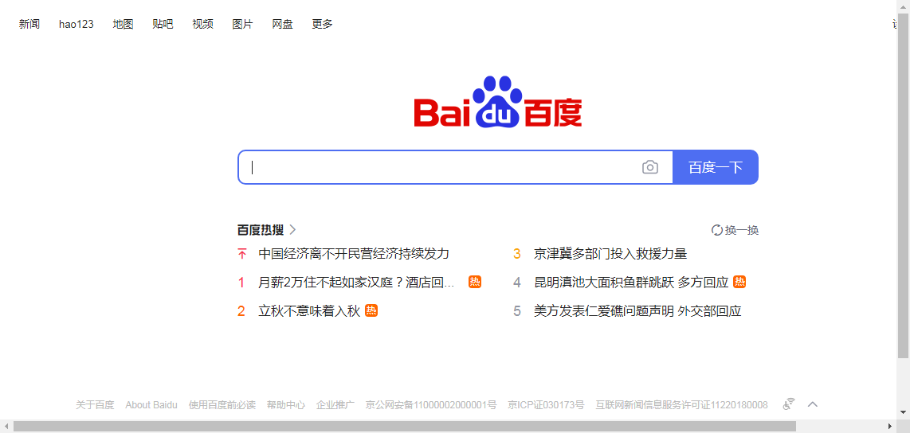

### 2. html的定义

HTML 的全称为：HyperText Mark-up Language, 指的是超文本标记语言。 标记：就是标签, `<标签名称> </标签名称>`, 比如: `<html></html>、<h1></h1>` 等，标签大多数都是成对出现的。

所谓超文本，有两层含义:

1. 因为网页中还可以图片、视频、音频等内容(超越文本限制)
2. 它还可以在网页中跳转到另一个网页，与世界各地主机的网页链接(超链接文本)

### 3. html的作用

html是用来开发网页的，它是开发网页的语言。

### 4. 小结

- html是开发网页的语言
- html中的标签大多数都是成对出现的, 格式: `<标签名></标签名>`

# html 的基本结构

**学习目标**

- 能够写出html的基本结构

### 1. 结构代码

```html
<!DOCTYPE html>
<html>
    <head>            
        <meta charset="UTF-8">
        <title>网页标题</title>
    </head>
    <body>
          网页显示内容
    </body>
</html>
```

1. 第一行`<!DOCTYPE html>`是文档声明, 用来指定页面所使用的html的版本, 这里声明的是一个html5的文档。
2. `<html>...</html>`标签是开发人员在告诉浏览器，整个网页是从`<html>`这里开始的，到`<html>`结束,也就是html文档的开始和结束标签。
3. `<head>...</head>`标签用于定义文档的头部,是负责对网页进行设置标题、编码格式以及引入css和js文件的。
4. `<body>...</body>`标签是编写网页上显示的内容。

### 2. 浏览网页文件

网页文件的后缀是**.html**或者**.htm**, **一个html文件就是一个网页**，html文件用编辑器打开显示的是文本，可以用文本的方式编辑它，如果用浏览器打开，浏览器会按照标签描述内容将文件渲染成网页。

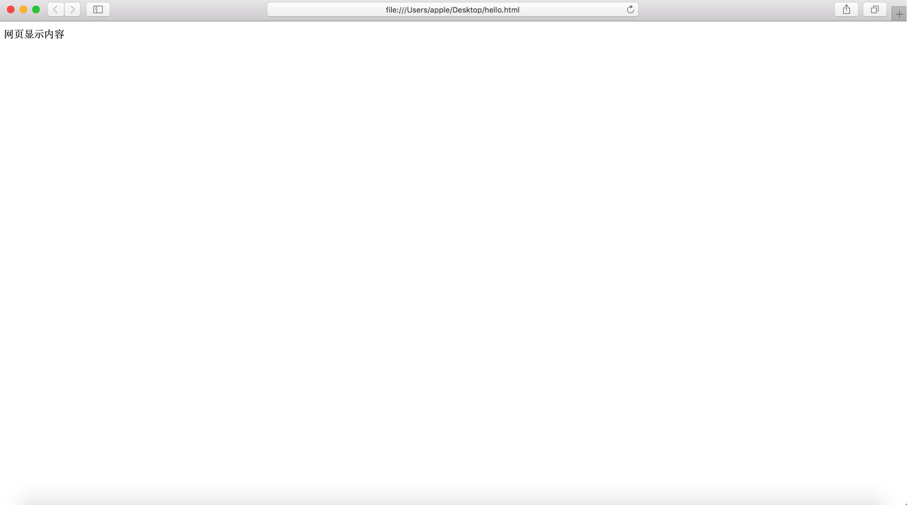

### 3. 小结


# vscode 的基本使用

**学习目标**

- 能够安装和卸载 vscode 的插件
- 能够设置 vscode 的颜色主题和字体大小

------

### 1. vscode 的基本介绍

全拼是 Visual Studio Code (简称 VS Code) 是由微软研发的一款免费、开源的跨平台**代码编辑器**，目前是前端(网页)开发使用最多的一款软件开发工具。

### 2. vscode 的安装

1. 下载网址: https://code.visualstudio.com/Download
2. 选择对应的安装包进行下载: 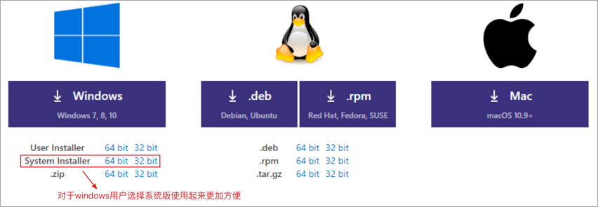
3. 根据下载的安装包双击进行安装即可，当然为了更好的使用 vscode 还可以安装对应的插件。

### 3. vscode 的插件安装

|                     插件名                     |         说明         |
| :--------------------------------------------: | :------------------: |
| Chinese (Simplified) Language Pack for VS Code |   中文(简体)汉化包   |
|                open in browser                 | 右击在浏览器打开html |

1. 汉化插件安装 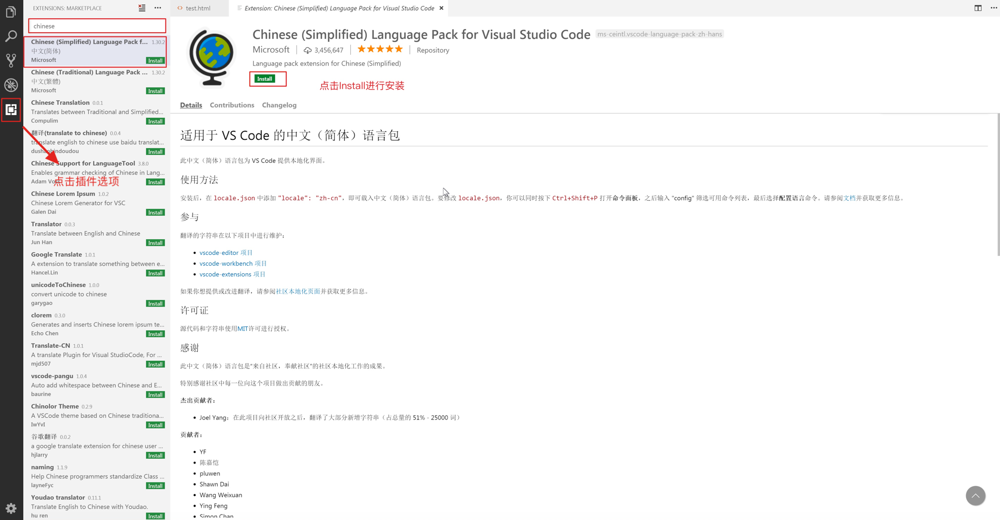 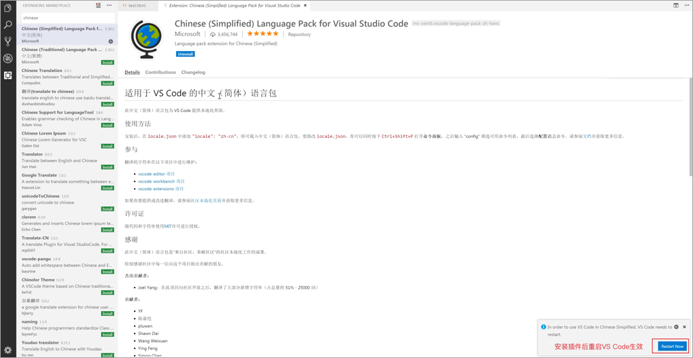
2. open in browser插件安装 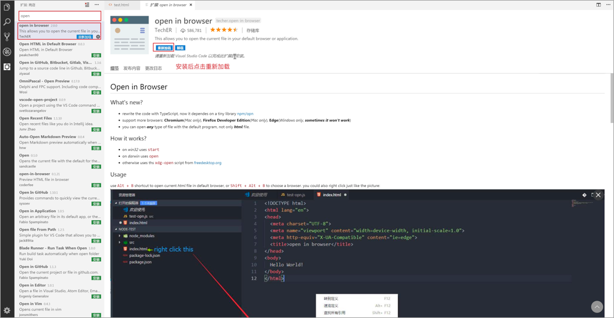 **注意: 如果在vscode打开的html文档中右击没有出现 open in browser 类型的选项，需要把当前打开的文件关掉，重新打开这个文件就好了。**

### 4. vscode 的插件卸载

点击对应安装的插件，然后再点击卸载按钮即可。

### 5. vscode 的使用

1. 打开文件夹创建文件 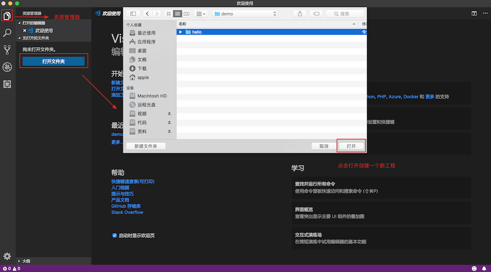 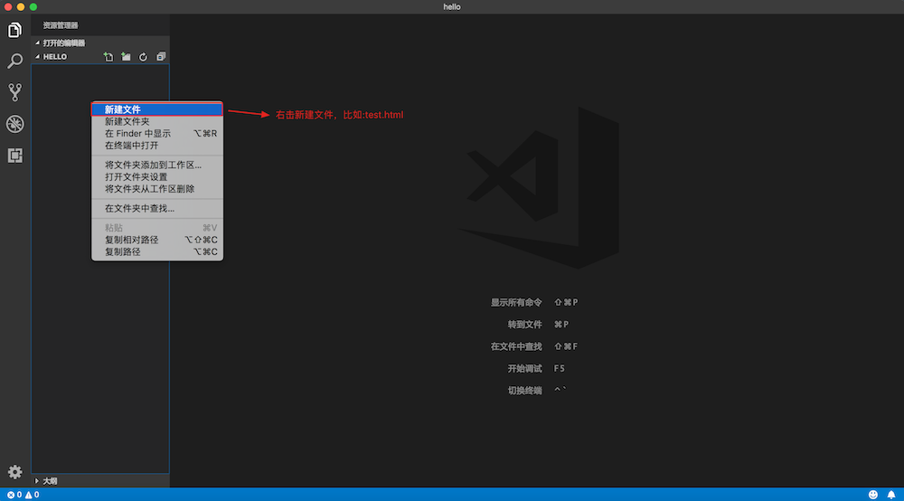
2. 快速创建html文档的基本结构 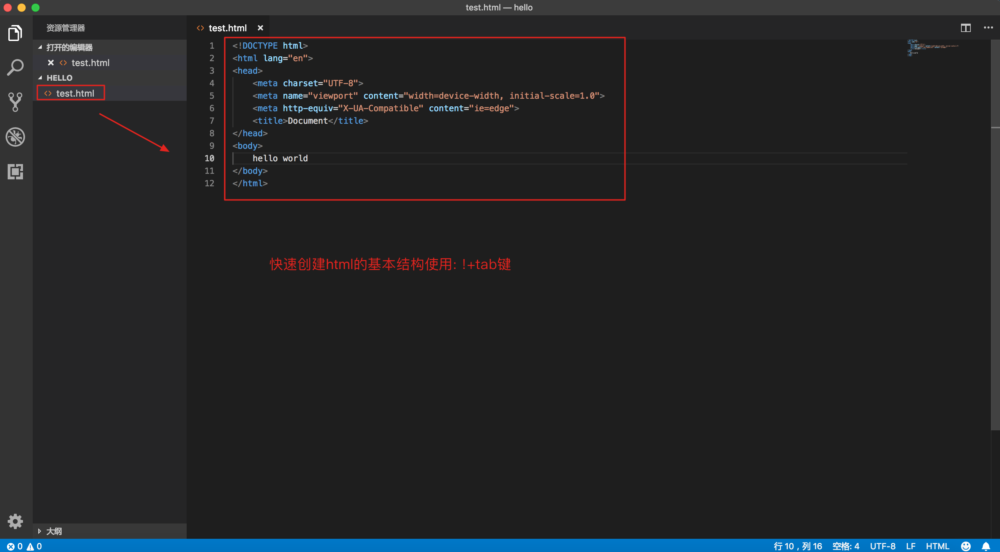
3. 右击在浏览器打开html文档 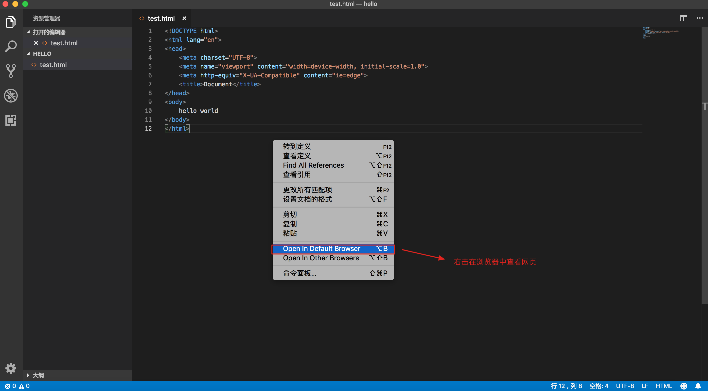

### 6. 设置字体大小

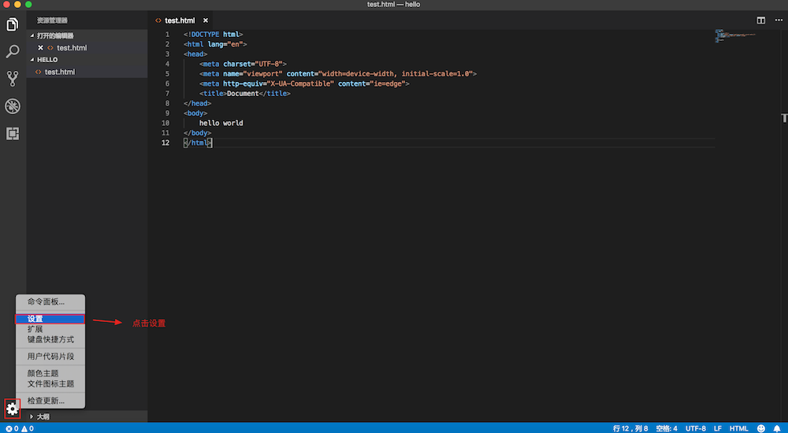
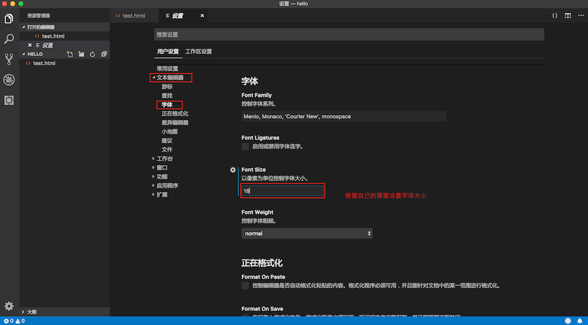

### 7. 设置颜色主题

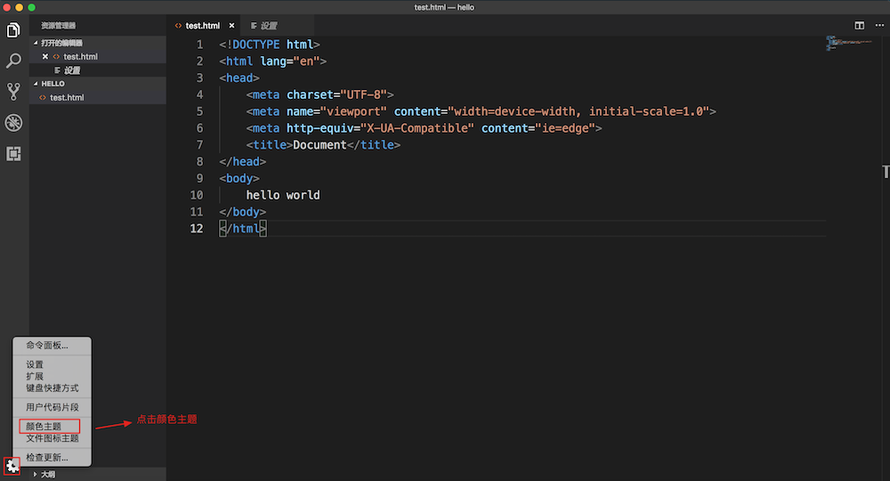
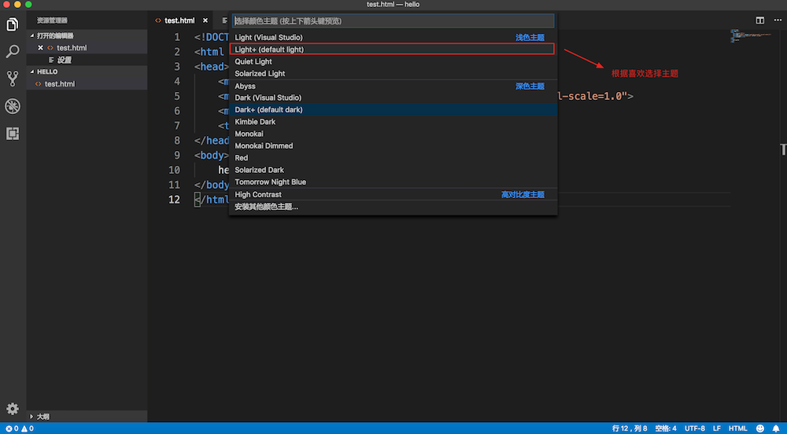

### 8. 设置默认浏览器[可选]

1. 可以根据自己的需要设置默认使用的浏览器 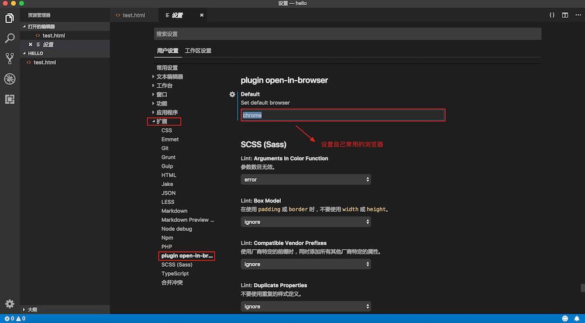

### 9. 小结

- vscode 是由微软研发的一款免费、开源的跨平台代码编辑器
- 通过资源管理器打开文件夹创建HTML文件，编写 HTML 代码
- 可以根据需要安装对应的插件
- 可以设置字体大小和颜色主题

# 初始常用的 html 标签

**学习目标**

- 能够知道单标签和双标签的区别

------

### 1. 常用的 html 标签

```html
<!-- 1、成对出现的标签：-->

<h1>h1标题</h1>
<div>这是一个div标签</div>
<p>这个一个段落标签</p>


<!-- 2、单个出现的标签： -->
<br>

<hr>

<!-- 3、带属性的标签，如src、alt 和 href等都是属性 -->

<a href="http://www.baidu.com">百度网</a>

<!-- 4、标签的嵌套 -->
<div>
    
    <a href="http://www.baidu.com">百度网</a>
</div>
```

**提示:**

1. 标签不区分大小写，但是推荐使用小写。
2. 根据标签的书写形式，标签分为双标签(闭合标签)和单标签(空标签)
   2.1 双标签是指由开始标签和结束标签组成的一对标签，这种标签允许嵌套和承载内容，比如: div标签
   2.2 单标签是一个标签组成，没有标签内容， 比如: img标签

### 2. 小结

- 学习 html 语言就是学习标签的用法，常用的标签有20多个。
- 编写 html 标签建议使用小写
- 根据书写形式，html 标签分为双标签和单标签
- 单标签没有标签内容，双标签可以嵌套其它标签和承载文本内容

# 资源路径

**学习目标**

- 能够知道相对路径和绝对路径的区别

------

当我们使用img标签显示图片的时候，需要指定图片的资源路径，比如:

```html

```

这里的src属性就是设置图片的资源路径的，资源路径可以分为**相对路径和绝对路径**。

### 1. 相对路径

> 从当前操作 html 的文档所在目录算起的路径叫做相对路径

**示例代码:**

```html
<!-- 相对路径方式1 -->

<!-- 相对路径方式2 -->

```

### 2. 绝对路径

> 从根目录算起的路径叫做绝对路径，Windows 的根目录是指定的盘符，mac OS 和Linux 是/

**示例代码:**

```html
<!-- 绝对路径 -->


```

**提示:**

一般都会使用相对路径，绝对路径的操作在其它电脑上打开会有可能出现资源文件找不到的问题

### 3. 小结

- 相对路径和绝对路径是 html 标签使用资源文件的两种方式，一般使用相对路径。
- 相对路径是从当前操作的 html 文档所在目录算起的路径
- 绝对 路径是从根目录算起的路径

# 列表标签

**学习目标**

- 能够知道列表标签的种类

------

### 1. 列表标签的种类

- 无序列表标签(ul标签)
- 有序列表标签(ol标签)

### 2. 无序列表

```
<!-- ul标签定义无序列表 -->
<ul>
    <!-- li标签定义列表项目 -->
    <li>列表标题一</li>
    <li>列表标题二</li>
    <li>列表标题三</li>
</ul>
```

### 3. 有序列表

```
<!-- ol标签定义有序列表 -->
<ol>
    <!-- li标签定义列表项目 -->
    <li><a href="#">列表标题一</a></li>
    <li><a href="#">列表标题二</a></li>
    <li><a href="#">列表标题三</a></li>
</ol>
```

### 4. 小结

- 列表标签有无序列表标签(ul标签)和有序列表标签(ol标签)
- 列表项目对顺序有要求的时候使用ol标签
- 列表项目对顺序无要求的时候使用ul标签

# 表格标签

**学习目标**

- 能够知道表格的边线合并

------

### 1. 表格的结构

> 表格是由行和列组成，好比一个excel文件

### 2. 表格标签

- `<table>`标签：表示一个表格
  - `<tr>`标签：表示表格中的一行
    - `<td>`标签：表示表格中的列
    - `<th>`标签：表示表格中的表头

**示例代码:**

```
<table>
    <tr>
        <th>姓名</th>
        <th>年龄</th>
    </tr>
    <tr>
        <td>张三</td>
        <td>18</td> 
    </tr>
</table>
```

**表格边线合并:**

border-collapse 设置表格的边线合并，如：border-collapse:collapse;

# 表单标签

**学习目标**

- 能够知道表单中常用的表单元素标签

------

### 1. 表单的介绍

> 表单用于搜集不同类型的用户输入(用户输入的数据)，然后可以把用户数据提交到web服务器 。

### 2. 表单相关标签的使用

1. `<form>`标签 表示表单标签，定义整体的表单区域
2. `<label>`标签 表示表单元素的文字标注标签，定义文字标注
3. `<input>`标签 表示表单元素的用户输入标签，定义不同类型的用户输入数据方式
   - type属性
     - type="text" 定义单行文本输入框
     - type="password" 定义密码输入框
     - type="radio" 定义单选框
     - type="checkbox" 定义复选框
     - type="file" 定义上传文件
     - type="submit" 定义提交按钮
     - type="reset" 定义重置按钮
     - type="button" 定义一个普通按钮
4. `<textarea>`标签 表示表单元素的多行文本输入框标签 定义多行文本输入框
5. `<select>`标签 表示表单元素的下拉列表标签 定义下拉列表
   - `<option>`标签 与`<select>`标签配合，定义下拉列表中的选项

**示例代码:**

```
<form>
    <p>
        <label>姓名：</label><input type="text">
    </p>
    <p>
        <label>密码：</label><input type="password">
    </p>
    <p>
        <label>性别：</label>
        <input type="radio"> 男
        <input type="radio"> 女
    </p>
    <p>
        <label>爱好：</label>
        <input type="checkbox"> 唱歌
        <input type="checkbox"> 跑步
        <input type="checkbox"> 游泳
    </p>
    <p>
        <label>照片：</label>
        <input type="file">
    </p>
    <p>
        <label>个人描述：</label>
        <textarea></textarea>
    </p>
    <p>
        <label>籍贯：</label>
        <select>
            <option>北京</option>
            <option>上海</option>
            <option>广州</option>
            <option>深圳</option>
        </select>
    </p>
    <p>
        <input type="submit" value="提交">
        <input type="reset" value="重置">
    </p>
</form>
```

### 3. 小结

- 表单标签是`<form>`标签
- 常用的表单元素标签有: `<label>`、`<input>`、 `<textarea>`、`<select>` 等标签

# 表单提交

**学习目标**

- 能够知道表单的提交方式
- 能够知道表单中action属性的作用

------

### 1. 表单属性设置

`<form>`标签 表示表单标签，定义整体的表单区域

- action属性 设置表单数据提交地址
- method属性 设置表单提交的方式，一般有“GET”方式和“POST”方式, 不区分大小写

### 2. 表单元素属性设置

- name属性 设置表单元素的名称，该名称是提交数据时的参数名
- value属性 设置表单元素的值，该值是提交数据时参数名所对应的值

### 3. 示例代码

```
 <form action="https://www.baidu.com" method="GET">
    <p>
        <label>姓名：</label><input type="text" name="username" value="11" />
    </p>
    <p>
        <label>密码：</label><input type="password" name="password" />
    </p>
    <p>
        <label>性别：</label>
        <input type="radio" name="gender" value="0" /> 男
        <input type="radio" name="gender" value="1" /> 女
    </p>
    <p>
        <label>爱好：</label>
        <input type="checkbox" name="like" value="sing" /> 唱歌
        <input type="checkbox" name="like" value="run" /> 跑步
        <input type="checkbox" name="like" value="swiming" /> 游泳
    </p>
    <p>
        <label>照片：</label>
        <input type="file" name="person_pic">
    </p>
    <p>
        <label>个人描述：</label>
        <textarea name="about"></textarea>
    </p>
    <p>
        <label>籍贯：</label>
        <select name="site">
            <option value="0">北京</option>
            <option value="1">上海</option>
            <option value="2">广州</option>
            <option value="3">深圳</option>
        </select>
    </p>
    <p>
        <input type="submit" name="" value="提交">
        <input type="reset" name="" value="重置">
    </p>
</form>
```

### 小结

- 表单标签的作用就是可以把用户输入数据一起提交到web服务器。
- 表单属性设置
  - action: 是设置表单数据提交地址
  - method: 是表单提交方式，提交方式有GET和POST
- 表单元素属性设置
  - name: 表单元素的名称，用于作为提交表单数据时的参数名
  - value: 表单元素的值，用于作为提交表单数据时参数名所对应的值