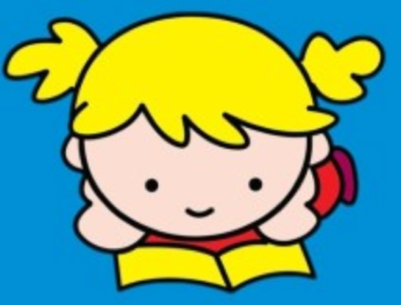
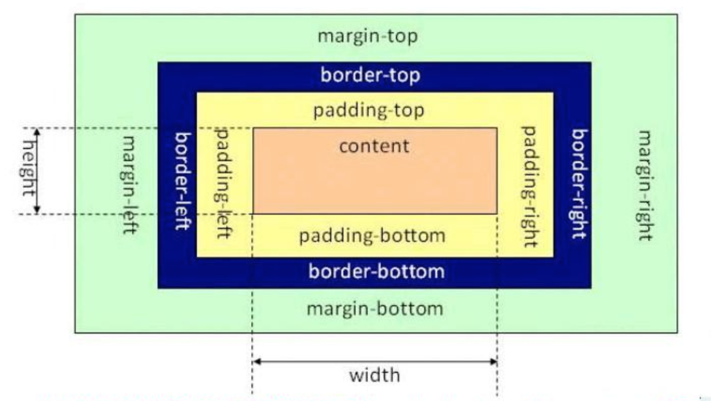

# Day73 前端知识提要（2）——CSS

[TOC]


# css 的介绍

**学习目标**

- 能够知道css的作用

------

### 1. css 的定义

> css(Cascading Style Sheet)层叠样式表，它是用来美化页面的一种语言。

**没有使用css的效果图**


**使用css的效果图**



### 2. css 的作用

1. 美化界面, 比如: 设置标签文字大小、颜色、字体加粗等样式。
2. 控制页面布局, 比如: 设置浮动、定位等样式。

### 3. css 的基本语法

选择器{

样式规则

}

样式规则：

属性名1：属性值1;

属性名2：属性值2;

属性名3：属性值3;

...

选择器:**是用来选择标签的，选出来以后给标签加样式。**

**代码示例:**

```html
div{ 
    width:100px; 
    height:100px; 
    background:gold; 
}
```

**说明**

css 是由两个主要的部分构成：**选择器和一条或多条样式规则**，注意:**样式规则需要放到大括号里面。**

### 4. 小结

- css 是层叠样式表，它是用来美化网页和控制页面布局的。
- 定义 css 的语法格式是: 选择器{样式规则}

# css 的引入方式

**学习目标**

- 能够知道 css 的引入三种方式

------

**css的三种引入方式**

1. 行内式
2. 内嵌式（内部样式）
3. 外链式

### 1. 行内式

> 直接在标签的 style 属性中添加 css 样式

**示例代码:**

```html
<div style="width:100px; height:100px; background:red ">hello</div>
```

优点：方便、直观。 缺点：缺乏可重用性。

### 2. 内嵌式（内部样式）

> 在`<head>`标签内加入`<style>`标签，在`<style>`标签中编写css代码。

**示例代码:**

```html
<head>
   <style type="text/css">
      h3{
         color:red;
      }
   </style>
</head>
```

优点：在同一个页面内部便于复用和维护。 缺点：在多个页面之间的可重用性不够高。

### 3. 外链式

> 将css代码写在一个单独的.css文件中，在`<head>`标签中使用`<link>`标签直接引入该文件到页面中。

**示例代码:**

```html
<link rel="stylesheet" type="text/css" href="css/main.css">
```

优点：使得css样式与html页面分离，便于整个页面系统的规划和维护，可重用性高。 缺点：css代码由于分离到单独的css文件，容易出现css代码过于集中，若维护不当则极容易造成混乱。

### 4. css引入方式选择

1. 行内式几乎不用
2. 内嵌式在学习css样式的阶段使用
3. 外链式在公司开发的阶段使用，可以对 css 样式和 html 页面分别进行开发。

### 5. 小结

- css 的引入有三种方式, 分别是行内式、内嵌式、外链式。
- 外链式是在公司开发的时候会使用，最能体现 div+css 的标签内容与显示样式分离的思想， 也最易改版维护，代码看起来也是最美观的一种。

# css 选择器

**学习目标**

- 能够说出 css 选择器的种类

------

### 1. css 选择器的定义

css 选择器是用来选择标签的，选出来以后给标签加样式。

### 2. css 选择器的种类

1. 标签选择器
2. 类选择器
3. 层级选择器(后代选择器)
4. id选择器
5. 组选择器
6. 伪类选择器

### 3. 标签选择器

根据标签来选择标签，**以标签开头**，此种选择器影响范围大，一般用来做一些通用设置。

**示例代码**

```html
<style type="text/css">
    p{
        color: red;
    }
</style>

<div>hello</div>
<p>hello</p>
```

### 4. 类选择器

根据类名来选择标签，**以 . 开头**, 一个类选择器可应用于多个标签上，一个标签上也可以使用多个类选择器，多个类选择器需要使用空格分割，应用灵活，可复用，是css中应用最多的一种选择器。

**示例代码**

```
<style type="text/css">
    .blue{color:blue}
    .big{font-size:20px}
    .box{width:100px;height:100px;background:gold} 
</style>

<div class="blue">这是一个div</div>
<h3 class="blue big box">这是一个标题</h3>
<p class="blue box">这是一个段落</p>
```

### 5. 层级选择器(后代选择器)

根据层级关系选择后代标签，**以选择器1 选择器2开头**，主要应用在标签嵌套的结构中，减少命名。

**示例代码**

```
<style type="text/css">
    div p{
        color: red;
    }
    .con{width:300px;height:80px;background:green}
    .con span{color:red}
    .con .pink{color:pink}
    .con .gold{color:gold}    
</style>

<div>
    <p>hello</p>
</div>

<div class="con">
    <span>哈哈</span>
    <a href="#" class="pink">百度</a>
    <a href="#" class="gold">谷歌</a>
</div>
<span>你好</span>
<a href="#" class="pink">新浪</a>
```

**注意点: 这个层级关系不一定是父子关系，也有可能是祖孙关系，只要有后代关系都适用于这个层级选择器**

### 6. id选择器

根据id选择标签，以#开头, 元素的id名称不能重复，所以id选择器只能对应于页面上一个元素，不能复用，id名一般给程序使用，所以不推荐使用id作为选择器。

**示例代码**

```
<style type="text/css">
    #box{color:red} 
</style>

<p id="box">这是一个段落标签</p>   <!-- 对应以上一条样式，其它元素不允许应用此样式 -->
<p>这是第二个段落标签</p> <!-- 无法应用以上样式，每个标签只能有唯一的id名 -->
<p>这是第三个段落标签</p> <!-- 无法应用以上样式，每个标签只能有唯一的id名  -->
```

**注意点: 虽然给其它标签设置id=“box”也可以设置样式，但是不推荐这样做，因为id是唯一的，以后js通过id只能获取一个唯一的标签对象。**

### 7. 组选择器

根据组合的选择器选择不同的标签，**以 , 分割开**, 如果有公共的样式设置，可以使用组选择器。

**示例代码**

```
<style type="text/css">
    .box1,.box2,.box3{width:100px;height:100px}
    .box1{background:red}
    .box2{background:pink}
    .box2{background:gold}
</style>

<div class="box1">这是第一个div</div>
<div class="box2">这是第二个div</div>
<div class="box3">这是第三个div</div>
```

### 8. 伪类选择器

用于向选择器添加特殊的效果, **以 : 分割开**, 当用户和网站交互的时候改变显示效果可以使用伪类选择器

**示例代码**

```
<style type="text/css">
    .box1{width:100px;height:100px;background:gold;}
    .box1:hover{width:300px;}
</style>

<div class="box1">这是第一个div</div>
```

### 9. 小结

- css 选择器就是用来选择标签设置样式的
- 常用的 css 选择器有六种，分别是:
  1. 标签选择器
  2. 类选择器
  3. 层级选择器(后代选择器)
  4. id选择器
  5. 组选择器
  6. 伪类选择器

# css 属性

**学习目标**

- 能够知道常用的样式属性

------

我们知道 css 作用是美化 HTML 网页和控制页面布局的,接下来我们来学习一下经常使用一些样式属性。

### 1. 布局常用样式属性

- width 设置元素(标签)的宽度，如：width:100px;
- height 设置元素(标签)的高度，如：height:200px;
- background 设置元素背景色或者背景图片，如：background:gold; 设置元素的背景色, background: url(images/logo.png); 设置元素的背景图片。
- border 设置元素四周的边框，如：border:1px solid black; 设置元素四周边框是1像素宽的黑色实线
- 以上也可以拆分成四个边的写法，分别设置四个边的：
- border-top 设置顶边边框，如：border-top:10px solid red;
- border-left 设置左边边框，如：border-left:10px solid blue;
- border-right 设置右边边框，如：border-right:10px solid green;
- border-bottom 设置底边边框，如：border-bottom:10px solid pink;
- padding 设置元素包含的内容和元素边框的距离，也叫内边距，如padding:20px;padding是同时设置4个边的，也可以像border一样拆分成分别设置四个边:padding-top、padding-left、padding-right、padding-bottom。
- margin 设置元素和外界的距离，也叫外边距，如margin:20px;margin是同时设置4个边的，也可以像border一样拆分成分别设置四个边:margin-top、margin-left、margin-right、margin-bottom。
- float 设置元素浮动，浮动可以让块元素排列在一行，浮动分为左浮动：float:left; 右浮动：float:right;

### 2. 文本常用样式属性

- color 设置文字的颜色，如： color:red;
- font-size 设置文字的大小，如：font-size:12px;
- font-family 设置文字的字体，如：font-family:'微软雅黑';为了避免中文字不兼容，一般写成：font-family:'Microsoft Yahei';
- font-weight 设置文字是否加粗，如：font-weight:bold; 设置加粗 font-weight:normal 设置不加粗
- line-height 设置文字的行高，如：line-height:24px; 表示文字高度加上文字上下的间距是24px，也就是每一行占有的高度是24px
- text-decoration 设置文字的下划线，如：text-decoration:none; 将文字下划线去掉
- text-align 设置文字水平对齐方式，如text-align:center 设置文字水平居中
- text-indent 设置文字首行缩进，如：text-indent:24px; 设置文字首行缩进24px

### 3. 布局常用样式属性示例代码

```html
<style>

    .box1{
        width: 200px; 
        height: 200px; 
        background:yellow; 
        border: 1px solid black;
    }

    .box2{
        /* 这里是注释内容 */
        /* 设置宽度 */
        width: 100px;
        /* 设置高度 */
        height: 100px;
        /* 设置背景色 */
        background: red;
        /* 设置四边边框 */
        /* border: 10px solid black; */
        border-top: 10px solid black;
        border-left: 10px solid black;
        border-right: 10px solid black;
        border-bottom: 10px solid black;
        /* 设置内边距， 内容到边框的距离，如果设置四边是上右下左 */
        /* padding: 10px;   */
        padding-left: 10px;
        padding-top: 10px;
        /* 设置外边距，设置元素边框到外界元素边框的距离 */
        margin: 10px;
        /* margin-top: 10px;
        margin-left: 10px; */
        float: left;
    }

    .box3{
        width: 48px; 
        height: 48px; 
        background:pink; 
        border: 1px solid black;
        float: left;
    }

</style>

<div class="box1">
    <div class="box2">
        padding 设置元素包含的内容和元素边框的距离
    </div>
    <div class="box3">
    </div>
</div>
```

### 4. 文本常用样式属性示例

```html
<style>
    p{
       /* 设置字体大小  浏览器默认是 16px */
       font-size:20px;
       /* 设置字体 */
       font-family: "Microsoft YaHei"; 
       /* 设置字体加粗 */
       font-weight: bold;
       /* 设置字体颜色 */
       color: red;
       /* 增加掉下划线 */
       text-decoration: underline;
       /* 设置行高  */
       line-height: 100px;
       /* 设置背景色 */
       background: green;
       /* 设置文字居中 */
       /* text-align: center; */
       text-indent: 40px;
    }

    a{
        /* 去掉下划线 */
        text-decoration: none;
    }
</style>

<a href="#">连接标签</a>
<p>
    你好，世界!
</p>
```

### 5. 小结

- 设置不同的样式属性会呈现不同网页的显示效果
- 样式属性的表现形式是: **属性名:属性值;**

# css 元素溢出

**学习目标**

- 能够说出元素溢出的解决办法

------

### 1. 什么是 css 元素溢出

当**子元素(标签)的尺寸超过父元素(标签)的尺寸时**，此时需要设置父元素显示溢出的子元素的方式，设置的方法是通过**overflow属性**来完成。

**overflow的设置项：**

1. visible 默认值, 显示子标签溢出部分。
2. hidden 隐藏子标签溢出部分。
3. auto 如果子标签溢出，则可以滚动查看其余的内容。

### 2. 示例代码

```
<style>
    .box1{
        width: 100px;
        height: 200px;
        background: red;
        /* 在父级上设置子元素溢出的部分如何显示 */
        /* overflow: hidden; */
        overflow: auto;
    }
    .box2{
        width: 50px;
        height: 300px;
        background: yellow;
    }
</style>

<div class="box1">
    <div class="box2">hello</div>
</div>
```

### 3. 小结

- overflow样式属性是设置子标签溢出的显示方式
- 常用使用**overflow:hidden;**来解决元素溢出

# css 显示特性

**学习目标**

- 能够说出标签隐藏设置

------

### 1. display 属性的使用

display 属性是用来设置元素的类型及隐藏的，常用的属性有：

- none 元素隐藏且不占位置
- inline 元素以行内元素显示
- block 元素以块元素显示

### 2. 示例代码

```
<style>
    .box{
        /* 将块元素转化为行内元素 */
        display:inline;
    } 

    .link01{
        /* 将行内元素转化为块元素 */
        display:block;
        background: red;

    }

    .con{
        width:200px;
        height:200px;
        background:gold;

        /* 将元素隐藏 */
        display:none;
    }

</style>

<div class="con"></div>
<div class="box">这是第一个div</div>
<div class="box">这是第二个div</div>
<a href="#" class="link01">这是第一个链接</a>
<a href="#" class="link01">这是第二个链接</a>
```

**说明:**

行内元素不能设置宽高， 块元素或者行内块元素可以设置宽高。

### 3. 小结

- 通常隐藏元素使用 `display:none`

# 盒子模型

**学习目标**

- 能够知道盒子模型中的各个属性

------

### 1. 盒子模型的介绍

所谓的盒子模型就是把HTML页面的元素看作一个矩形盒子，矩形盒子是由内容(content)、内边距(padding)、边框(border)、外边距(margin)四部分组成。

**盒子模型示意图如下：**



### 2. 盒子模型相关样式属性

- 盒子的内容宽度(width)，注意：不是盒子的宽度
- 盒子的内容高度(height)，注意：不是盒子的高度
- 盒子的边框(border)
- 盒子内的内容和边框之间的间距(padding)
- 盒子与盒子之间的间距(margin)

**设置宽高：**

设置盒子的宽高，此宽高是指盒子内容的宽高，不是盒子整体宽高

```
width:200px;  /* 设置盒子的宽度，此宽度是指盒子内容的宽度，不是盒子整体宽度(难点) */ 
height:200px; /* 设置盒子的高度，此高度是指盒子内容的高度，不是盒子整体高度(难点) */
```

**设置边框:**

设置一边的边框，比如顶部边框，可以按如下设置：

```
border-top:10px solid red;
```

说明:

其中10px表示线框的粗细；solid表示线性；red表示边框的颜色

设置其它三个边的方法和上面一样，把上面的'top'换成'left'就是设置左边，换成'right'就是设置右边，换成'bottom'就是设置底边。

四个边如果设置一样，可以将四个边的设置合并成一句：

```
border:10px solid red;
```

**设置内间距padding**

设置盒子四边的内间距，可设置如下：

```
padding-top：20px;     /* 设置顶部内间距20px */ 
padding-left:30px;     /* 设置左边内间距30px */ 
padding-right:40px;    /* 设置右边内间距40px */ 
padding-bottom:50px;   /* 设置底部内间距50px */
```

上面的设置可以简写如下：

```
padding：20px 40px 50px 30px; /* 四个值按照顺时针方向，分别设置的是 上 右 下 左  
四个方向的内边距值。 */
```

padding后面还可以跟3个值，2个值和1个值，它们分别设置的项目如下：

```
padding：20px 40px 50px; /* 设置顶部内边距为20px，左右内边距为40px，底部内边距为50px */ 
padding：20px 40px; /* 设置上下内边距为20px，左右内边距为40px*/ 
padding：20px; /* 设置四边内边距为20px */
```

**设置外间距margin**

外边距的设置方法和padding的设置方法相同，将上面设置项中的'padding'换成'margin'就是外边距设置方法。

**盒子的真实尺寸**

盒子的width和height值固定时，如果盒子增加border和padding，盒子整体的尺寸会变大，所以盒子的真实尺寸为：

- 盒子宽度 = width + padding左右 + border左右
- 盒子高度 = height + padding上下 + border上下

### 小结

- 盒子模型的5个主要样式属性
  - width：内容的宽度(不是盒子的宽度)
  - height：内容的高度(不是盒子的高度)
  - padding：内边距。
  - border：边框。
  - margin：外边距
- 盒子的真实尺寸只会受到宽度、高度、边框、内边距四个属性的影响，不会受到外边距属性的影响。


-16947612810458-16952783206048.jpg)