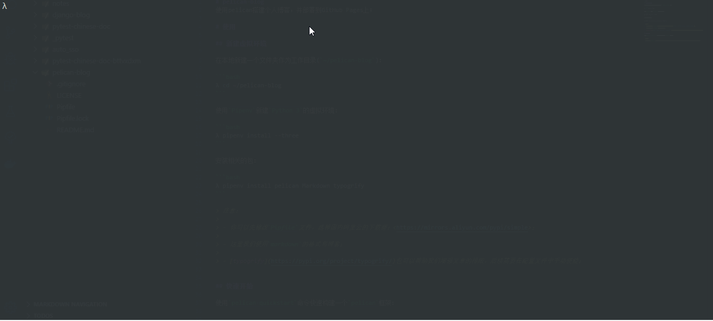

# Day78 Python生成个人主页——pelican


# Python开的的pelican搭建个人blog 一

> 
>
> 
>
> 前几天心血来潮，想要在`GitHub Pages`上搭建一个静态博客；之前，我也曾基于`Django`开发过自己的博客，并买了云主机部署，但是访问量感人，慢慢自己也不打理了，就把云主机退订了（去吃吨好的~~~）；
>
> 虽然搭建静态博客很简单，但是也想记录一下，如果恰好能对你有所帮助或启发，那我也觉的很开心了。

搭建静态博客的工具多种多样，即有流行的[WordPress](https://wordpress.org/)，也有`GitHub Pages`官方推荐的[Jekyll](https://jekyllcn.com/)；其实，选用哪种工具不重要，关键是一步步的理解它，遇到问题、解决问题的思路和过程；

因为我本人对`Python`比较熟悉，所以我选用基于`Python`开发的[pelican](https://blog.getpelican.com/)，它基本满足我的需求：

- 支持`markdown`的格式；
- 提供自动化构建；
- 足够的主题库和插件库，并且支持定制化；
- ...

本文主要涉及`pelican`的基本使用方法，最终在本地搭建一个简陋的博客网站；

# 1. 准备环境

选定工作目录，并使用[pipenv](https://pipenv.readthedocs.io/en/latest/)创建一个虚拟环境：


```
λ mkdir pelican-blog
λ cd pelican-blog

# 创建基于 Python 3 的虚拟环境 
λ pipenv install --three

# 查看虚拟环境中的 Python 版本
λ pipenv run python --version
Python 3.7.3
```

在虚拟环境中安装必要的包：


```
λ pipenv install Markdown pelican

# 查看包之间的依赖关系
λ pipenv graph
Markdown==3.1.1
  - setuptools [required: >=36, installed: 41.6.0]
pelican==4.2.0
  - blinker [required: Any, installed: 1.4]
  - docutils [required: Any, installed: 0.15.2]
  - feedgenerator [required: >=1.9, installed: 1.9]
    - pytz [required: >=0a, installed: 2019.3]
    - six [required: Any, installed: 1.13.0]
  - jinja2 [required: >=2.7, installed: 2.10.3]
    - MarkupSafe [required: >=0.23, installed: 1.1.1]
  - pygments [required: Any, installed: 2.4.2]
  - python-dateutil [required: Any, installed: 2.8.1]
    - six [required: >=1.5, installed: 1.13.0]
  - pytz [required: >=0a, installed: 2019.3]
  - six [required: >=1.4, installed: 1.13.0]
  - unidecode [required: Any, installed: 1.1.1]
```

------

# 2. 新建项目

`pelican`提供了一个命令行工具：`pelican-quickstart`，能够让我们快速地新建一个网站项目；

它在执行的过程中，会交互式的询问一些配置项，如果你现在还不能确定的话，那就大胆的使用默认值吧，后面还可以在配置文件中修改；

[](https://files.cnblogs.com/files/luizyao/pelican-quickstart.gif)

命令执行完成后，它会在我们的项目中新建如下的目录和文件：


```
.
├── content         # 目录，存放原始博文和相关静态文件
├── output          # 目录，存放构建后的网站源码
├── Makefile        
├── pelicanconf.py  # 构建相关的配置文件
├── publishconf.py  # 发布相关的配置文件
└── tasks.py
```

其中，`content/`目录存放所有的`markdown`格式的文本，我们还可以再新建一个`content/images/`的子目录，用于存放所有的图片；

> 注意：
>
> 在自动构建的过程中，`content/images/`中的文件会被无损地拷贝到`output/images/`中，通过修改`pelicanconf.py`文件中`STATIC_PATHS`的配置项（默认值为`['images']`）可以改变这种行为；

------

# 3. 第一篇博文

现在我们在`content/`目录下添加第一篇`markdown`格式的文章，就以本文为例；

`pelican`可以很“聪明”地从文章的元数据中提取需要的信息，所以我们以特定的格式编写文章的开头：


```
Title: 一、从零开始搭建自己的静态博客 -- 基础篇
Date: 2019-11-21 14:37
Modified: 2019-11-22 11:09
Category: 工具
Tags: pelican
Author: luizyao
Slug: pelican-blog-chapter-1
Summary: 本文简要的介绍 pelican 的基本用法
Status: published

<开始正文>
```

> 注意：
>
> - 更多元数据以参考：https://docs.getpelican.com/en/stable/content.html#file-metadata；
> - 如果你使用`VSCode`作为你的日常开发工具，那么我建议你使用[psioniq File Header](https://marketplace.visualstudio.com/items?itemName=psioniq.psi-header)插件为不同类型的文件自动生成头信息模版；

------

# 4. 修改配置文件

在正式开始构建之前，我们需要完善一下配置文件`pelicanconf.py`：


```
# pelicanconf.py

# 修改时区
TIMEZONE = 'Asia/Shanghai'

# 添加一个 GitHub 的“丝带”链接
GITHUB_URL = 'https://github.com/luizyao'

# 修改社交账号的展示
SOCIAL = (
    ('GitHub', 'https://github.com/luizyao'),
)

# 修改默认的时间格式（'%a %d %B %Y'）
DEFAULT_DATE_FORMAT = "%Y-%m-%d %H:%M"

# 为元数据定义默认值
DEFAULT_METADATA = {
    # 默认发布的文章都是草稿，除非在文章元数据中明确指定：Status: published
    'status': 'draft',
}
```

------

# 5. 本地构建和访问

我们通过以下命令构建网站并自动适配文件的修改，通过[http://localhost:8000](http://localhost:8000/)访问：


```
λ pipenv run pelican --autoreload --listen content/
```

> 注意：
>
> - 不要忘记把文章元数据中的`Status: draft`改成`Status: published`，不然我们是看不到这篇文章的；
>
> - `pelican`默认使用`notmyidea`这个主题来构建网站；你可以通过`pelican-themes`命令查看已安装的主题：
>
> 
>
>   ```
> λ pipenv run pelican-themes --list
> notmyidea
> simple
>   ```
>
>   然后通过在`pelicanconf.py`中设定`THEME = 'simple'`或者构建时传入`-t 'simple'`选项来使用主题`simple`，实际上和纯文本差不多了；

------

# 6. `markdown`解析异常

- 这是一个列表：

  

  ```
  if 1：
      print('这是一段python代码')
  ```

这个时候，如果你访问我们的网站，你会发现上面的`markdown`代码被展示成下面的形式，根本就不是我们想要的缩进代码块的效果：

[](https://files.cnblogs.com/files/luizyao/screenshot_markdown_error.bmp)

为什么会这样呢？我们又该如何解决这个问题？

## 6.1. `Markdown`包的实现机制

`pelican`使用[Markdown](https://pypi.org/project/Markdown/)包作为`markdown`文本的解释器，这个包严格实现了[John Gruber’s Markdown](http://daringfireball.net/projects/markdown/)语法，并提供一些扩展；

`John Gruber`是`markdown`语法的发明者，他在`2004`发布了第一个版本的`markdown`语法，这一版本的语法有着明显的特点：

- 不支持三个反引号（`'```'`）包裹代码的写法；
- 不支持表格；
- 定义了严格的嵌套缩进的格式，必须是`4`个空格；
- ...

虽然自从发布了第一版之后，就再也没有更新过，但是现在流行的各种`markdown`语法都是基于它的扩展和补充，例如：[GitHub Markdown](https://help.github.com/categories/writing-on-github/)、[PHP Markdown](https://michelf.ca/projects/php-markdown/)等；

> 注意：
>
> 虽然`Markdown`包严格实现了`John Gruber’s Markdown`语法，但是具体的实现还是有一些差别的，更多细节可以参考：https://python-markdown.github.io/#differences

## 6.2. `pelican`默认使用的`Markdown`扩展

上一节中我们提到，`Markdown`包同样提供一些扩展用于解析更多类型的语法，这些扩展又分为官方扩展和第三方扩展；

通过查阅`pelican`的源码（或官方文档），可以看到其默认使用了以下扩展：


```
# pelican/settings.py

'MARKDOWN': {
    'extension_configs': {
        'markdown.extensions.codehilite': {'css_class': 'highlight'},
        'markdown.extensions.extra': {},
        'markdown.extensions.meta': {},
    },
    'output_format': 'html5',
},
```

首先，我们看一下[markdown.extensions.extra](https://python-markdown.github.io/extensions/extra/)扩展：

它主要实现了大多数`PHP Markdown`的语法，是其它`6`个扩展的合集：

| 扩展               | 文档                                                         | 描述               |
| :----------------- | :----------------------------------------------------------- | :----------------- |
| Abbreviations      | https://python-markdown.github.io/extensions/abbreviations/  |                    |
| Attribute Lists    | https://python-markdown.github.io/extensions/attr_list/      |                    |
| Definition Lists   | https://python-markdown.github.io/extensions/definition_lists/ |                    |
| Fenced Code Blocks | https://python-markdown.github.io/extensions/fenced_code_blocks/ | 扩展了代码块的写法 |
| Footnotes          | https://python-markdown.github.io/extensions/footnotes/      |                    |
| Tables             | https://python-markdown.github.io/extensions/tables/         | 支持表格           |

我们重点看一下`Fenced Code Blocks`，因为它支持了我常用的三个反引号包裹代码块的写法：

> GitHub‘s backtick (```) syntax is also supported:
>
> 
>
> ```
> # more python code
> ```

然后，我们再看一下[markdown.extensions.codehilite](https://www.cnblogs.com/luizyao/p/11910504.html)扩展：

它基于[Pygments](http://pygments.org/)包为我们提供了代码的高亮显示，我们主要看一下它的一些可配置选项：

- `linenums`：如果置为`True`，将会为代码块每行标上行号；
- `css_class`：为`<div>`标签加上`class`属性，默认是`codehilite`；在这里，`pelican`使用的是`highlight`;

最后，我们看一下[markdown.extensions.meta](https://python-markdown.github.io/extensions/meta_data/)：

它主要是`pelican`内部使用，还记得我们每个`markdown`文本的开头都要有特定的格式吗？就是通过这个扩展读取的；感兴趣的同学可以自己去看一下，这里我们就不多说了；

## 6.3. 向第三方扩展寻求帮助

看到现在，我们也没有找到想要的解决方案：对列表里缩进嵌套反引号包裹的代码块，进行正确的渲染；

还好我们还有众多的第三方扩展供我们使用：https://github.com/Python-Markdown/markdown/wiki/Third-Party-Extensions

我们找到一个[pymdownx.extra](https://facelessuser.github.io/pymdown-extensions/extensions/extra/)的扩展貌似可以代替`markdown.extensions.extra`，来一起看一下吧：

它和`markdown.extensions.extra`大部分是一样的，只是有以下不同：

- 新包含了[BetterEm](https://facelessuser.github.io/pymdown-extensions/extensions/betterem/)扩展：优化粗体和斜体的展示（不关心）；
- 新包含了[ExtraRawHTML](https://facelessuser.github.io/pymdown-extensions/extensions/extrarawhtml/)扩展：增加了对原始`HTML`代码的处理（不关心）；
- 使用[SuperFences](https://facelessuser.github.io/pymdown-extensions/extensions/superfences/)扩展代替`Fenced Code Blocks`：加强版的`markdown`语法解析（看来正式我们想要的）；

> 其实，看到`SuperFences`文档的第一句话，我就知道妥了，嘻嘻；
>
> Allowing the nesting of fences under blockquotes, lists, or other block elements (see Limitations for more info).
>
> 文档的内容很丰富，我们就不再这里一一解释了，有兴趣的同学可以自己去看一看，说不定有什么意外的收获呢！！！

## 6.4. 解决问题

现在，我们来实际解决这个问题：

1. 安装必要的包：

   

   ```
   λ pipenv install pymdown-extensions
   ```

2. 修改`pelicanconf.py`文件中`MARKDOWN`的默认配置：

   

   ```
   # 使用第三方扩展来增强对 markdown 语言的解析，但是首先要安装 pymdown-extensions 模块
   MARKDOWN = {
       'extension_configs': {
           'markdown.extensions.codehilite': {'css_class': 'highlight'},
           'pymdownx.extra': {},
           'markdown.extensions.meta': {},
       },
       'output_format': 'html5',
   }
   ```

------

# 7. One more thing

我在浏览`SuperFences`文档时，发现一个很有意思的章节：https://facelessuser.github.io/pymdown-extensions/extensions/superfences/#code-highlighting；

它推荐了[pymdownx.highlight](https://facelessuser.github.io/pymdown-extensions/extensions/highlight/)代替`markdown.extensions.codehilite`，那我们就来看看这到底是个什么鬼？

在它的文档中有一句话大概能说明两者的关系：

> The Highlight extension is inspired by CodeHilite, but differs in features. PyMdown Extensions chooses not to implement special language headers for standard Markdown code blocks like CodeHilite does; PyMdown Extensions takes the position that language headers are better suited in fenced code blocks.

更多实现上的细节，我们不再去深究，主要看看我们可以用来干什么？

比如，为代码块每行加上行号：

咦？`markdown.extensions.codehilite`也可以啊，它不是也有一个`linenums`的选项吗？置成`True`不就行了；

说的对，不过丑。

一般情况下，为代码块添加行号有两种样式：

- `table`：默认的样式，创建一个表，第一列是行号；
- `inline`：在每行代码的开头，但是复制代码会把行号一起复制，不方便；

不过，`pymdownx.highlight`提供了第三种样式：`pymdownx-inline`，它和`inline`很像，只是复制时不会加上行号，因为实际上把行号元素渲染成下面这样：


```
<span class="lineno" data-linenos="1 "></span>
```

然后，我们通过以下的`CSS`样式去“激活”它：


```
[data-linenos]:before {
  content: attr(data-linenos);
}
```

下面，我们来将它具体的应用到我们的项目中吧：

首先，修改`pelicanconf.py`文件中`MARKDOWN`的默认配置：


```
# 使用第三方扩展来增强对 markdown 语言的解析，但是首先要安装 pymdown-extensions 模块
MARKDOWN = {
    'extension_configs': {
        'pymdownx.highlight': {
            'css_class': 'highlight',
            'linenums': True,
            'linenums_style': 'pymdownx-inline',
        },
        'pymdownx.extra': {},
        'markdown.extensions.meta': {},
    },
    'output_format': 'html5',
}
```

然后，在`output/theme/css/main.css`文件的末尾加上下面这段代码：


```
[data-linenos]:before {
  content: attr(data-linenos);
}
```

最后重启下服务，就能看到效果了：

[](https://files.cnblogs.com/files/luizyao/Screenshot_full_site.bmp)

> 注意：
>
> 这里有个问题，如果我们重新执行构建命令，`output/theme/css/main.css`文件又会被覆盖成原先的内容，我们这个效果就看不到了；
>
> 不过这并不是我们最终的方案，所以我们也不在这里继续深究了。

> GitHub：[https://github.com/luizyao/pelican-blog/tree/chapter-](https://github.com/luizyao/pelican-blog/tree/chapter-1)


# Python开的的pelican搭建个人blog 二


我们已经成功地在本地搭建了一个博客网站，它使用的是`pelican`默认的`notmyidea`主题；

> 如果你不太记得了，可以再看看这篇文章：[一、从零开始搭建自己的静态博客 -- 基础篇](https://www.cnblogs.com/luizyao/p/11910504.html)；

其实，`pelican`拥有众多的开源主题库，我们可以在[`pelican`主题仓库](https://github.com/getpelican/pelican-themes)上选择一个自己喜欢的主题应用到项目中；

> http://pelicanthemes.com/网站提供在线预览主题的功能；

我选择的是[pelican-alchemy](https://github.com/nairobilug/pelican-alchemy)主题，它的在线`Demo`是：https://nairobilug.github.io/pelican-alchemy/；

下面，我们来一步一步的将其应用到我们的项目中；

# 1. 下载主题

我粗略的浏览了一下`pelican-alchemy`的文档和`issue`列表，考虑到后续有可能会做一些修改，所以我决定先将其`fork`到自己的仓库；

然后，我在项目根目录新建一个目录`themes/`用于存放所有下载的主题，然后将`fork`后的`pelican-alchemy`作为一个独立的子仓库克隆到目录下：


```
λ mkdir themes
λ git submodule add git@github.com:luizyao/pelican-alchemy.git themes/pelican-alchemy
```

> 注意：
>
> `git submodule add <url> <path>`命令是将一个仓库添加到指定的目录下作为独立的子仓库；
>
> 如果你仔细观察，会发现我们的根目录下多了一个文件：`.gitmodules`，它记录了子仓库的信息；
>
> 例如：我们项目中这个文件的内容是：
>
> 
>
> ```
> [submodule "themes/pelican-alchemy"]
>  path = themes/pelican-alchemy
>  url = git@github.com:luizyao/pelican-alchemy.git
> ```
>
> 常用的和子仓库的相关的操作有下面几个：
>
> - 克隆父仓库时，连同子仓库一起克隆：
>
> 
>
>   ```
> git clone --recurse-submodules <URL> <directory>
>   ```
>
> - 查看父仓库中所有子仓库的状态：
>
> 
>
>   ```
> λ git submodule status
> 3381c5031bf30d3b1212619b662898f178d695f1 themes/pelican-alchemy (v2.1-43-g3381c50)
>   ```
>
>   `3381c5031bf30d3b1212619b662898f178d695f1`是对当前`Commit Id`的`SHA-1`加密字串；
>
> - 删除子仓库：
>
> 
>
>   ```
> git rm <submodule path> && git commit
>   ```
>
>   再手动删除`.git/modules/<name>/`目录
>
> 如果你想了解更多关于`git submodule`的内容，可以通过`git submodule --help`阅读它的官方文档；

------

# 2. 使用主题

## 2.1. 基本配置


```
# pelicanconf.py

# 主题所在的相对目录
THEME = 'themes/pelican-alchemy/alchemy'

# 副标题
SITESUBTITLE = '戒骄戒躁 砥砺前行'

# 头像
SITEIMAGE = '/images/profile.png width=200 height=200'

# 友链
LINKS = (
    ('pytest-chinese-doc', 'https://luizyao.github.io/pytest-chinese-doc/'),
)

# 代码高亮的样式
PYGMENTS_STYLE = 'friendly'

# 使用 Bootswatch 样式：https://bootswatch.com/
BOOTSTRAP_CSS = 'https://cdn.bootcss.com/bootswatch/4.3.1/lux/bootstrap.min.css'

# 生成 sitemap.xml 文件，它是一个对爬虫友好的文件，方便搜索引擎抓取网站页面
DIRECT_TEMPLATES = ['index', 'tags', 'categories', 'authors', 'archives', 'sitemap']
SITEMAP_SAVE_AS = 'sitemap.xml'

# 构建后的 html 文件路径和 URL 标识
ARTICLE_URL = 'posts/{date:%Y}/{date:%m}/{slug}.html'
ARTICLE_SAVE_AS = ARTICLE_URL
DRAFTS_URL = 'drafts/{date:%Y}/{date:%m}/{slug}.html'
DRAFTS_SAVE_AS = ARTICLE_URL
PAGE_URL = 'pages/{slug}.html'
PAGE_SAVE_AS = PAGE_URL

# RSS 订阅
FEED_ALL_RSS = 'feeds/all.rss.xml'
```

> 具体细节可以参考：https://github.com/nairobilug/pelican-alchemy/wiki/Settings

## 2.2. 高级配置

### 2.2.1. 配置网站图标

通过在线工具https://realfavicongenerator.net/可以生成适配各种平台和浏览器的`favicon`文件：

下载上面生成的`favicon`包，并解压到项目`content/extras`目录下：


```
λ ls content/extras/
android-chrome-192x192.png  favicon.ico         safari-pinned-tab.svg
android-chrome-384x384.png  favicon-16x16.png   site.webmanifest
apple-touch-icon.png        favicon-32x32.png
browserconfig.xml           mstile-150x150.png
```

修改模版中的`base.html`文件：


```
<!-- themes/pelican-alchemy/alchemy/templates/base.html --> 


  <link rel="apple-touch-icon" href="{{ SITEURL }}/apple-touch-icon.png" sizes="180x180">
  <link rel="icon" type="image/png" href="{{ SITEURL }}/favicon-32x32.png" sizes="32x32">
  <link rel="icon" type="image/png" href="{{ SITEURL }}/favicon-16x16.png" sizes="16x16">
  <link rel="manifest" href="{{ SITEURL }}/manifest.json">
  <meta name="theme-color" content="#333333">


<!-- 改成 --> 


  <link rel="apple-touch-icon" href="{{ SITEURL }}/apple-touch-icon.png" sizes="180x180">
  <link rel="icon" type="image/png" href="{{ SITEURL }}/favicon-32x32.png" sizes="32x32">
  <link rel="icon" type="image/png" href="{{ SITEURL }}/favicon-16x16.png" sizes="16x16">
  <link rel="manifest" href="{{ SITEURL }}/site.webmanifest">
  <link rel="mask-icon" href="{{ SITEURL }}/safari-pinned-tab.svg" color="#5bbad5">
  <meta name="msapplication-TileColor" content="#da532c">
  <meta name="theme-color" content="#ffffff">

```

修改`pelicanconf.py`配置文件：


```
# pelicanconf.py

# 在构建中，它们会无损的拷贝到 output 的同名目录下
STATIC_PATHS = ['extras', 'images', 'css']

# 构建时，extras/android-chrome-192x192.png文件，拷贝到output/android-chrome-192x192.png，不再是output/extras/android-chrome-192x192.png
EXTRA_PATH_METADATA = {
    'extras/android-chrome-192x192.png': {'path': 'android-chrome-192x192.png'},
    'extras/android-chrome-512x512.png': {'path': 'android-chrome-512x512.png'},
    'extras/apple-touch-icon.png': {'path': 'apple-touch-icon.png'},
    'extras/browserconfig.xml': {'path': 'browserconfig.xml'},
    'extras/favicon-16x16.png': {'path': 'favicon-16x16.png'},
    'extras/favicon-32x32.png': {'path': 'favicon-32x32.png'},
    'extras/favicon.ico': {'path': 'favicon.ico'},
    'extras/manifest.json': {'path': 'manifest.json'},
    'extras/mstile-150x150.png': {'path': 'mstile-150x150.png'},
    'extras/safari-pinned-tab.svg': {'path': 'safari-pinned-tab.svg'},
    # 自定义样式
    'css/custom.css': {'path': 'theme/css/custom.css'},
}

# 自定义样式的URL目录
THEME_CSS_OVERRIDES = ('theme/css/custom.css',)

RFG_FAVICONS = True
```

### 2.2.2. 更新`Font Awesome`的版本

`pelican-alchemy`使用`Font Awesome 4.7.0`版本，并且使用的是静态资源的相对引用；

我们将其修改为最新的`5.11.2`版本的`CDN`引入，修改主题模版中的`base.html`文件：


```
<!-- themes/pelican-alchemy/alchemy/templates/base.html --> 

<link rel="stylesheet" href="{{ SITEURL }}/theme/css/font-awesome.min.css">

<!-- 改成 --> 

<link href="https://cdn.bootcss.com/font-awesome/5.11.2/css/fontawesome.min.css" rel="stylesheet">
<link href="https://cdn.bootcss.com/font-awesome/5.11.2/css/solid.css" rel="stylesheet">
<link href="https://cdn.bootcss.com/font-awesome/5.11.2/css/brands.css" rel="stylesheet">
```

除了上面的步骤，我们还有一个额外的工作要做：**因为`5.x`的版本已经不使用`fa`前缀，取而代之的是`fas`（[`Solid`样式](https://fontawesome.com/icons?s=solid)）和`fab`（[`Brands`样式](https://fontawesome.com/icons?s=brands)）；**

所以，对于主题中那些类似`class="fa fa-github"`的样式，应该修改为`class="fab fa-github"`，主要涉及`article.html`、`index.html`和`header.html`这些文件；

最后，修改`pelicanconf.py`文件中关于`ICONS`配置的格式，需要额外指定样式类别：


```
# pelicanconf.py

# 社交属性，请到<https://fontawesome.com/icons>网站确定图标样式的类别
ICONS = [
    ('fab', 'github', 'https://github.com/luizyao'),
    ('fas', 'blog', 'https://www.cnblogs.com/luizyao/'),
    ('fas', 'rss', 'feeds/all.rss.xml')
]
```

> `pelican-alchemy`有一个`open`的`issue`：https://github.com/nairobilug/pelican-alchemy/issues/69是关于`Font Awesome`版本的，后续可能会更新到`5.x`版本，目前`issue`处于接收反馈的状态；
>
> 至于为什么不使用`CDN`，貌似还和伟大的防火墙有关呢。。。
>
> > I'm sure you've heard of the Great Firewall of China; India, Russia, some African countries are doing similar things. You never know which URL or IP might become inaccessible

### 2.2.3. 使用`Bootstrap`的样式

我们可以为特定类型的元素添加`Bootstrap`的官方样式；例如：为每个`img`元素添加`class = "img-fluid"`的样式；

首先，安装依赖包：


```
# beautifulsoup4为插件所依赖的第三方包
λ pipenv install beautifulsoup4
```

然后，下载[Bootstrapify](https://github.com/ingwinlu/pelican-bootstrapify)插件：


```
λ mkdir plugins
λ git submodule add git@github.com:ingwinlu/pelican-bootstrapify.git plugins/pelican-bootstrapify
```

最后，修改`pelicanconf.py`配置文件：


```
# 到哪里寻找插件
PLUGIN_PATHS = ['plugins']

# 想要使用的插件名
PLUGINS = ['pelican-bootstrapify']

# 想要添加的 Bootstrap 样式
BOOTSTRAPIFY = {
    'table': ['table', 'table-striped', 'table-hover'],
    'img': ['img-fluid'],
}
```

## 2.3. 定制主题

下面我们为`pelican-alchemy`做一些定制化的操作，添加一些新的功能；

### 2.3.1. 添加返回顶部链接

修改`base.html`文件，在`<head>`中添加如下部分：


```
<!-- themes/pelican-alchemy/alchemy/templates/base.html --> 

<script src="https://cdn.bootcss.com/jquery/3.4.1/jquery.min.js"></script>
<script src="https://cdn.bootcss.com/scrollup/2.4.1/jquery.scrollUp.min.js"></script>

<script>
  $(function () {
    $.scrollUp({
      scrollText: '<i class="fas fa-2x fa-chevron-circle-up"></i>'
    });
  });
</script>
```

### 2.3.2. 支持目录

我自己写了一个的插件，用于替代`pelican`默认的`MarkdownReader`，它有以下功能：

- 使用增强的`markdown`解析

  - [pymdownx.extra](https://facelessuser.github.io/pymdown-extensions/extensions/extra/)代替`markdown.extensions.extra`；
  - [pymdownx.highlight](https://facelessuser.github.io/pymdown-extensions/extensions/highlight/)代替`markdown.extensions.codehilite`；

- 支持以下方式生成文章目录：

  1. 在`markdown`文本内的`[TOC]`标记处生成目录；

  2. 通过元数据`toc`自定义目录样式；例如：

     

     ```
     
       <aside class="col-md-4">
         <div class="widget widget-content">
           <h3 class="widget-title">文章目录</h3>
           <div class="toc">
             <ul>
               {{ article.toc | safe }}
             </ul>
           </div>
         </div>
       </aside>
     
     ```

- 如果没配`summary`或者`summary`为空，支持自动截取开头部分字符作为摘要；

使用方法：

1. 作为一个子仓库下载

   

   ```
   # 项目根目录创建目录
   λ mkdir plugins
   # 下载
   λ git submodule add git@github.com:luizyao/pelican-md-reader.git plugins/pelican-md-reader
   ```

2. 修改`pelicanconf.py`配置文件

   

   ```
   # pelicanconf.py
   
   # 到哪里寻找插件
   PLUGIN_PATHS = ['plugins']
   
   # 想要使用的插件名
   PLUGINS = ['pelican-md-reader']
   ```

> 更多细节可以参考：[pelican-md-reader](https://github.com/luizyao/pelican-md-reader)

### 2.3.3. 汉化

主要关键字汉化；

------

# 3. 完整的`pelicanconf.py`文件


```
#!/usr/bin/env python
# -*- coding: utf-8 -*- #
from __future__ import unicode_literals

AUTHOR = 'luizyao'
SITENAME = "luizyao's blog"
SITEURL = ''

PATH = 'content'

DEFAULT_LANG = 'en'

# Feed generation is usually not desired when developing
FEED_ALL_ATOM = None
CATEGORY_FEED_ATOM = None
TRANSLATION_FEED_ATOM = None
AUTHOR_FEED_ATOM = None
AUTHOR_FEED_RSS = None

DEFAULT_PAGINATION = 10

# Uncomment following line if you want document-relative URLs when developing
# RELATIVE_URLS = True

# 修改时区
TIMEZONE = 'Asia/Shanghai'

# 修改默认的时间格式（'%a %d %B %Y'）
DEFAULT_DATE_FORMAT = "%Y-%m-%d %H:%M"

# 为元数据定义默认值
DEFAULT_METADATA = {
    # 默认发布的文章都是草稿，除非在文章元数据中明确指定：Status: published
    'status': 'draft',
}

# pelican-alchemy 原有的配置

# 主题所在的相对目录
THEME = 'themes/pelican-alchemy/alchemy'

# 副标题
SITESUBTITLE = '戒骄戒躁 砥砺前行'

# 头像
SITEIMAGE = '/images/profile.png width=200 height=200'

# 友链
LINKS = (
    ('pytest-chinese-doc', 'https://luizyao.github.io/pytest-chinese-doc/'),
)

# 代码高亮的样式
PYGMENTS_STYLE = 'friendly'

# 使用 Bootswatch 样式：https://bootswatch.com/
BOOTSTRAP_CSS = 'https://cdn.bootcss.com/bootswatch/4.3.1/lux/bootstrap.min.css'

# 生成 sitemap.xml 文件
DIRECT_TEMPLATES = ['index', 'tags', 'categories', 'authors', 'archives', 'sitemap']
SITEMAP_SAVE_AS = 'sitemap.xml'

# 构建后的 html 文件路径和 URL 标识
ARTICLE_URL = 'posts/{date:%Y}/{date:%m}/{slug}.html'
ARTICLE_SAVE_AS = ARTICLE_URL
DRAFTS_URL = 'drafts/{date:%Y}/{date:%m}/{slug}.html'
DRAFTS_SAVE_AS = ARTICLE_URL
PAGE_URL = 'pages/{slug}.html'
PAGE_SAVE_AS = PAGE_URL

# RSS 订阅
FEED_ALL_RSS = 'feeds/all.rss.xml'

# 在构建中，它们会无损的拷贝到 output 的同名目录下
STATIC_PATHS = ['extras', 'images', 'css']

# 构建时，extras/android-chrome-192x192.png文件，拷贝到output/android-chrome-192x192.png，不再是output/extras/android-chrome-192x192.png
EXTRA_PATH_METADATA = {
    'extras/android-chrome-192x192.png': {'path': 'android-chrome-192x192.png'},
    'extras/android-chrome-512x512.png': {'path': 'android-chrome-512x512.png'},
    'extras/apple-touch-icon.png': {'path': 'apple-touch-icon.png'},
    'extras/browserconfig.xml': {'path': 'browserconfig.xml'},
    'extras/favicon-16x16.png': {'path': 'favicon-16x16.png'},
    'extras/favicon-32x32.png': {'path': 'favicon-32x32.png'},
    'extras/favicon.ico': {'path': 'favicon.ico'},
    'extras/manifest.json': {'path': 'manifest.json'},
    'extras/mstile-150x150.png': {'path': 'mstile-150x150.png'},
    'extras/safari-pinned-tab.svg': {'path': 'safari-pinned-tab.svg'},
    # 自定义样式
    'css/custom.css': {'path': 'theme/css/custom.css'},
}

# 自定义样式的URL目录
THEME_CSS_OVERRIDES = ('theme/css/custom.css',)

RFG_FAVICONS = True

# 到哪里寻找插件
PLUGIN_PATHS = ['plugins']

# 想要使用的插件名
PLUGINS = ['pelican-bootstrapify', 'pelican-md-reader']

# 想要添加的 Bootstrap 样式
BOOTSTRAPIFY = {
    'table': ['table', 'table-striped', 'table-hover'],
    'img': ['img-fluid'],
}

# 社交属性，请到<https://fontawesome.com/icons>网站确定图标样式的类别
ICONS = [
    ('fab', 'github', 'https://github.com/luizyao'),
    ('fas', 'blog', 'https://www.cnblogs.com/luizyao/'),
    ('fas', 'rss', 'feeds/all.rss.xml')
]
```

------

# 4. 预览

[https://blog.luizyao.com](https://blog.luizyao.com/)

> Github: https://github.com/luizyao/pelican-blog


