# Day79 Django项目实践（1）

[TOC]


# 欢迎来到美多商城！


# 项目需求分析

> 需求分析原因：
>
> - 可以整体的了解项目的业务流程和主要的业务需求。
> - 项目中，**需求驱动开发**。即开发人员需要以需求为目标来实现业务逻辑。
>
> 需求分析方式：
>
> - 企业中，借助 **产品原型图** 分析需求。
> - 需求分析完后，前端按照产品原型图开发前端页面，**后端开发对应的业务及响应处理**。
>
> 需求分析内容：
>
> - 页面及其**业务流程和业务逻辑**。
>
> 提示：
>
> - 我们现在借助 **示例网站** 作为原型图来分析需求。

### 1. 项目主要页面介绍

> **1.首页广告**


> **2.注册**

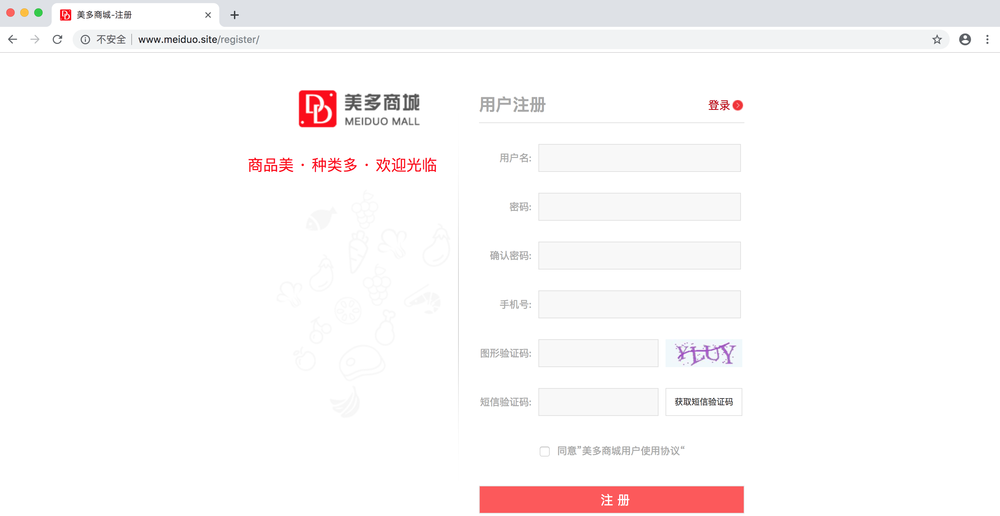

> **3.登录**


> **4.QQ登录**

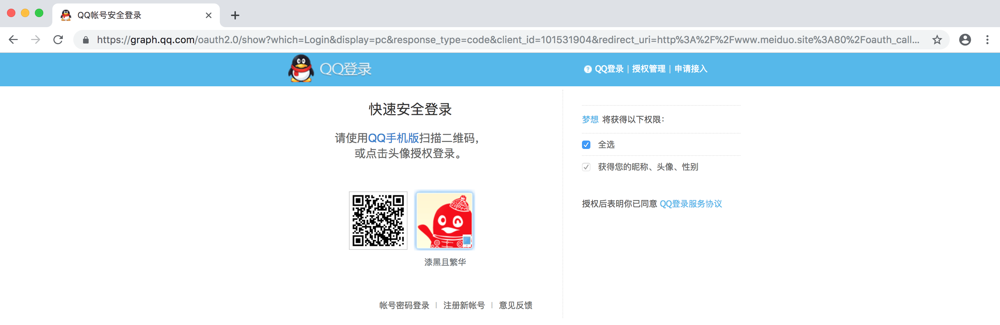

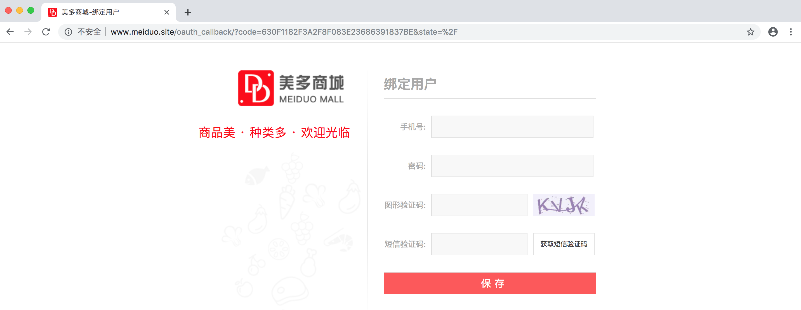

> **5.个人信息**

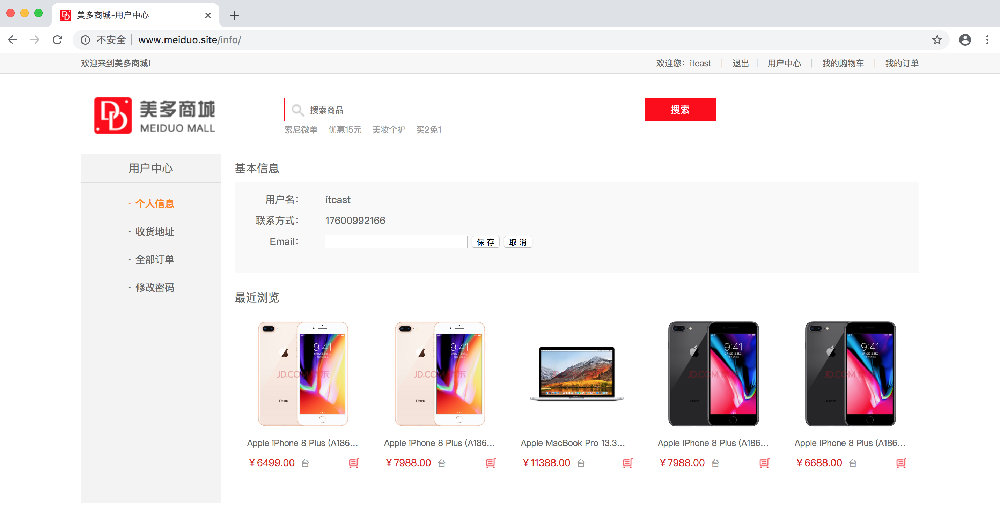

> **6.收货地址**

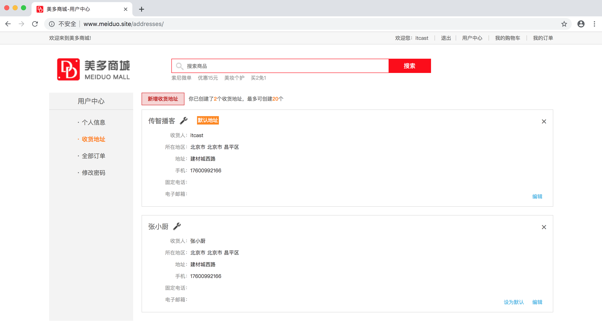

> **7.我的订单**

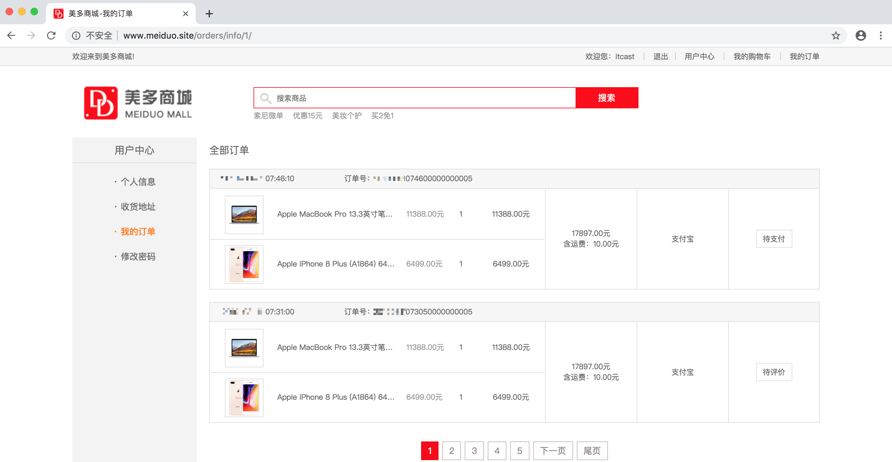

> **8.修改密码**

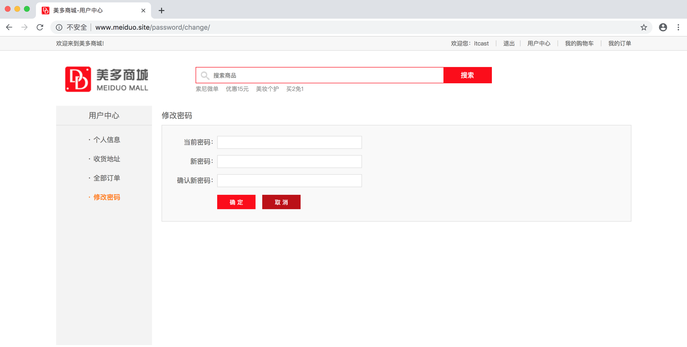

> **9.商品列表**

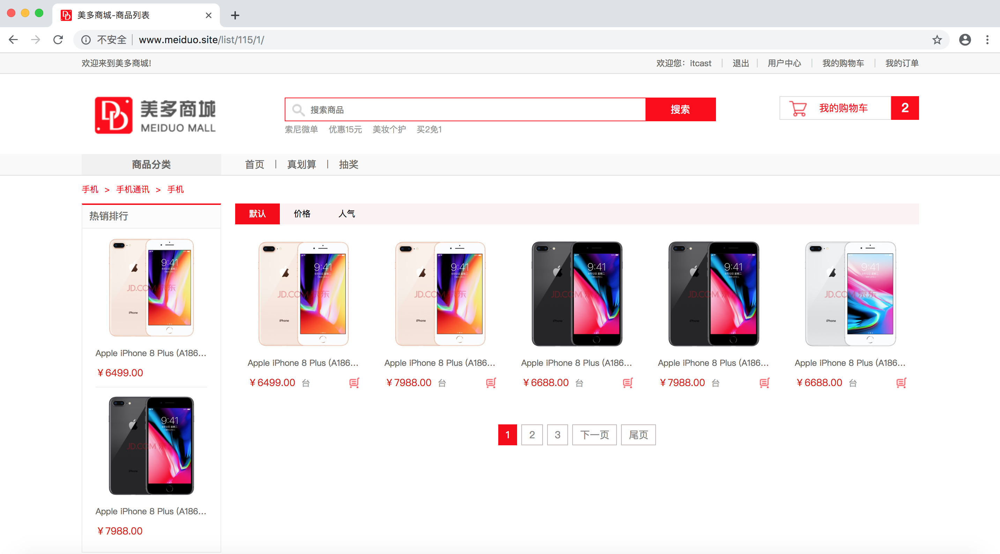

> **10.商品搜索**

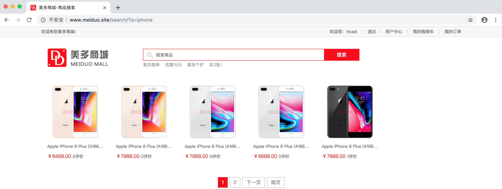

> **11.商品详情**

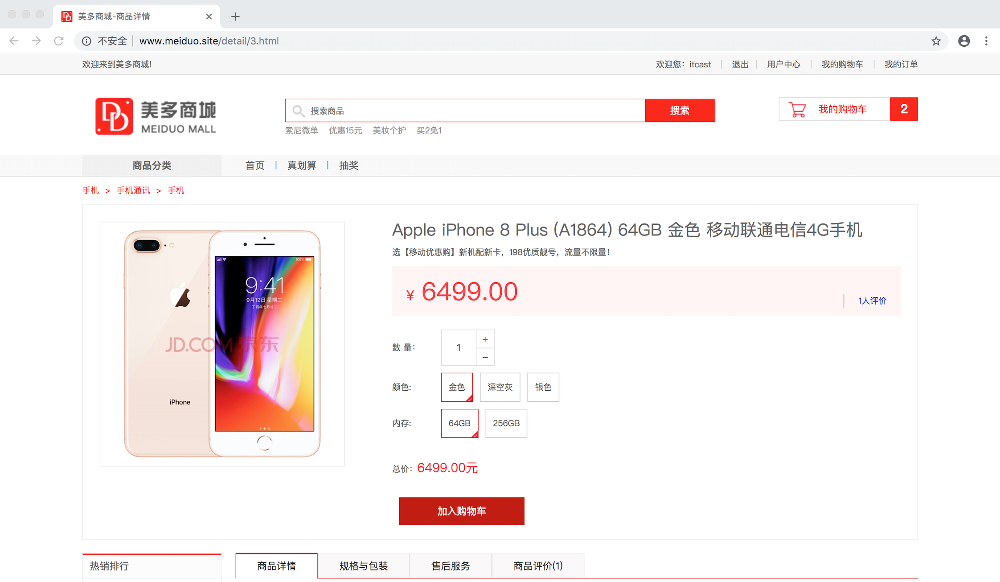

> **12.购物车**

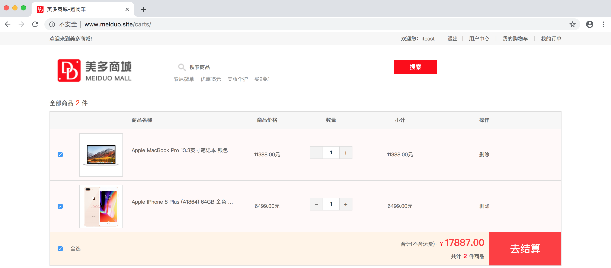

> **13.结算订单**

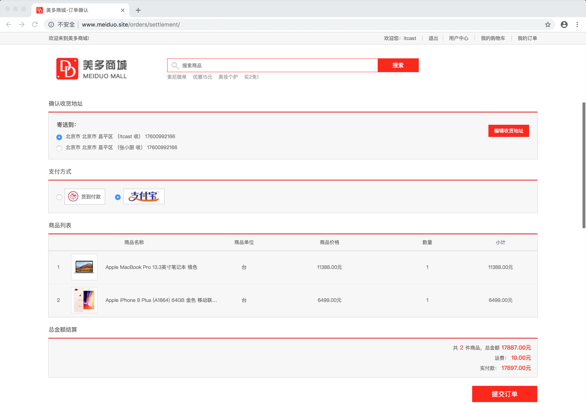

> **14.提交订单**

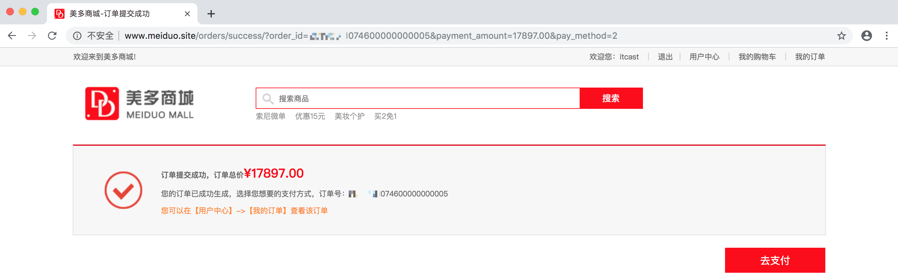

> **15.支付宝支付**

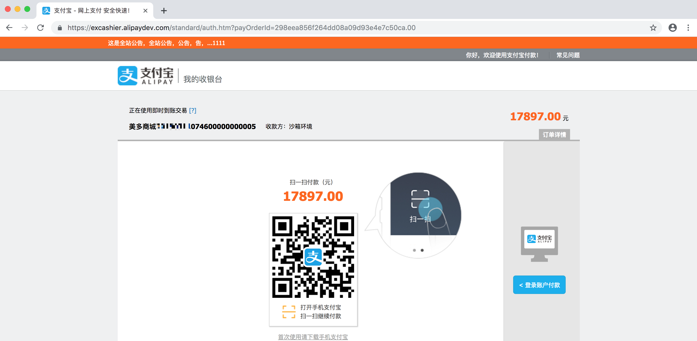

> **16.支付结果处理**

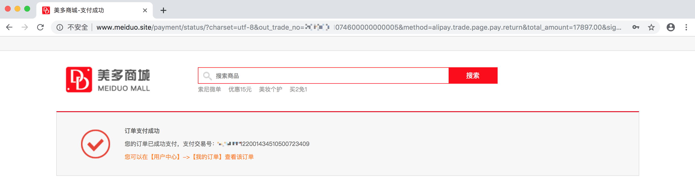

> **17.订单商品评价**

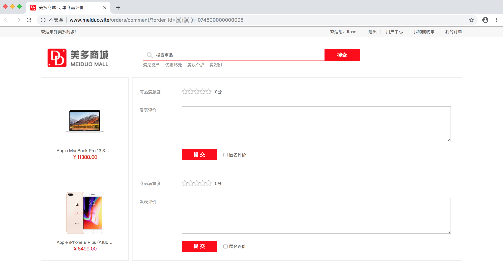

### 2. 归纳项目主要模块

> 为了方便项目管理及多人协同开发，我们根据需求将功能划分为不同的模块。
>
> 将来在项目中，每个**`模块`**都会对应一个**`子应用`**进行**`管理和解耦`**。

| 模块           | 功能                                             |
| -------------- | ------------------------------------------------ |
| **验证**       | 图形验证、短信验证                               |
| **用户**       | 注册、登录、用户中心                             |
| **第三方登录** | QQ登录                                           |
| **首页广告**   | 首页广告                                         |
| **商品**       | 商品列表、商品搜索、商品详情                     |
| **购物车**     | 购物车管理、购物车合并                           |
| **订单**       | 确认订单、提交订单                               |
| **支付**       | 支付宝支付、订单商品评价                         |
| **MIS系统**    | 数据统计、用户管理、权限管理、商品管理、订单管理 |

### 3. 知识要点

1. 需求分析原因：需求驱动开发。
2. 需求分析方式：企业中，使用产品原型图。
3. 需求分析内容：页面及业务逻辑。
4. 需求分析结果：划分业务模块，明确每个模块下的主要功能，并以子应用的形式进行管理。


# 项目架构设计

### 1. 项目开发模式

| 选项         | 技术选型                |
| ------------ | ----------------------- |
| **开发模式** | 前后端不分离            |
| **后端框架** | Django + Jinja2模板引擎 |
| **前端框架** | Vue.js                  |

> 说明：
>
> - 前后端不分离的开发模式，是为了提高搜索引擎排名，即**SEO**。特别是首页，详情页和列表页。
> - 页面需要整体刷新：我们会选择使用Jinja2模板引擎来实现。
> - 页面需要局部刷新：我们会选择使用Vue.js来实现。

### 2. 项目运行机制

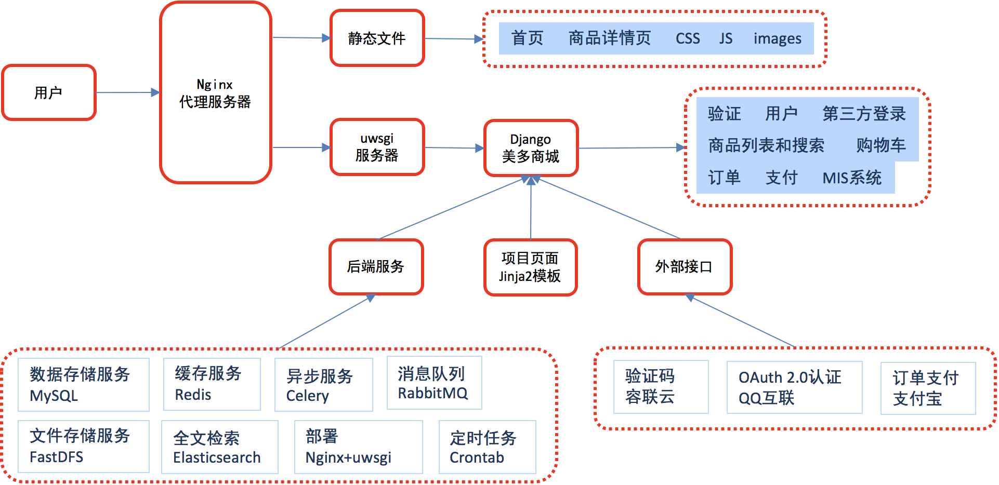

### 3. 知识要点

1. 项目开发模式
   - 前后端不分离，方便**SEO**。
   - 采用Django + Jinja2模板引擎 + Vue.js实现前后端逻辑。
2. 项目运行机制
   - 代理服务：Nginx服务器（反向代理）
   - 静态服务：Nginx服务器（静态首页、商品详情页、...）
   - 动态服务：uwsgi服务器（美多商场业务场景）
   - 后端服务：MySQL、Redis、Celery、RabbitMQ、Docker、FastDFS、Elasticsearch、Crontab
   - 外部接口：容联云、QQ互联、支付宝


# 工程创建和配置


https://gitee.com/zjsharp/meiduo_project_0417.git


# 创建工程

> 美多商城项目源代码采用**`远程仓库托管`**。

### 1. 准备项目代码仓库

> **1.源码托管网站**

- 码云（https://gitee.com/）

> **2.创建源码远程仓库：meiduo_project**


### 2. 克隆项目代码仓库

> **1.进入本地项目目录**

```bash
$ mkdir ~/projects
$ cd projects/
```

> **2.克隆仓库**

```bash
$ git clone https://gitee.com/zjsharp/meiduo_project.git


git clone https://gitee.com/thetoast/meiduo_project.git
```

### 3. 创建美多商城工程

> **1.进入本地项目仓库**

```bash
$ cd ~/projects/meiduo_project/


cd meiduo_project
```

> **2.创建美多商城虚拟环境，安装Django框架**

```bash
$ mkvirtualenv -p python3 meiduo_mall
$ pip install django==1.11.11

创建python3虚拟环境
mkvirtualenv -p python3 虚拟环境名称

例：
mkvirtualenv -p python3 py_django

例 ：使用python3的虚拟环境

workon py3_flask
先退出：deactivate
再删除：rmvirtualenv py_django

source .git-prompt.sh

echo "function gi() { curl -L -s https://www.gitignore.io/api/ \$@ ;}" >> ~/.zshrc && source ~/.zshrc
```

> **3.创建美多商城Django工程**

```bash
$ django-admin startproject meiduo_mall
```

> 创建工程完成后：运行程序，测试结果。


```
python manage.py runserver
```


-16947612810458-169527858204514.jpg)


