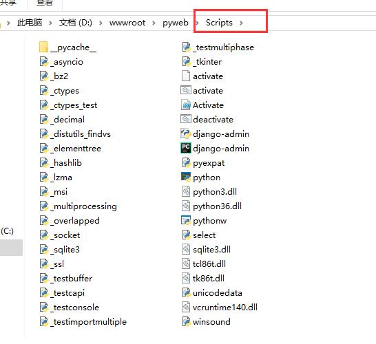
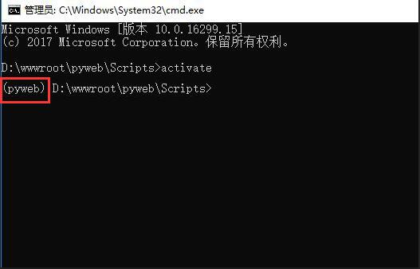

# Day82 django实践


1、搭建虚拟环境如何在Windows环境下搭建Python虚拟环境

cmd中直接安装 virtualenv : 

```
pip install virtualenv
```

在cmd环境下新建文件夹：

```
mkdir myproject
```

cd进入到新建文件夹中：

```
cd myproject
```

在myproject中新建虚拟环境 : 

```
virtualenv venv

virtualenv -p C:\Users\180927\AppData\Local\Programs\Python\Python311\python.exe my_project_env
```


如果存在多个python解释器，可以选择指定一个Python解释器（比如``python2.7``），没有指定则由系统默认的解释器来搭建： 

```
virtualenv -p /usr/bin/python2.7 my_project_env

virtualenv -p C:\Users\180927\AppData\Local\Programs\Python\Python311\python.exe my_project_env
```


#新建虚拟环境为venv，创建虚拟环境的时候 “virtualenv --no-site-packages venv”，如果virtualenv版本大于20，加上--no-site-packages时候会报错，默认版本大于20是不用加的。

```
# --system-site-packages: give the virtual environment access to the system site-packages dir (默认为 False，无需指明)
```

进入到.\venv\Scripts里面直接对文件夹cmd

```
.\myproject\venv\Scripts>activate
```

#此时为激活venv，激活后就进入到venv的环境中了，然后就可以直接pip install 各种库了。
#此时用pip list才能正确显示出虚拟环境里面装的库的信息，如果不activate，直接在venv下    用pip list 会显示外部python环境里面的库，并不是虚拟环境里面的库。
再直接输入

```
deactivate 
```

则退出虚拟环境。


# virtualenv使用技巧大全,python新手必备知识

2018年07月10日 

点击次数：53801

搞Python开发时，总会遇到需要同时运行多个不同软件版本项目的时候。每个项目的依赖需求也不一样，那咋整？这个时候我们就需要用到Virtualenv了。


那么什么是Virtualenv呢？Virtualenv是一个能创建隔绝的独立的Python虚拟环境工具。通过它可以防止各个项目之间因为Python版本不同或第三方库版本不同引起冲突，它能够建立多个相互独立，互不影响的Python工作环境。

Virtualenv的安装很简单，一行命令就能搞定：

```
pip install virtualenv
```


Virtualenv安装好之后，就是给自己的项目创建一个虚拟环境。

```
virtualenv pyweb  #pyweb  为虚拟环境目录名，目录名自定义.
```

当然你也可以使用下面的命令创建指定Python版本的虚拟环境。

```
virtualenv 环境名称 --python=/usr/bin/python3.6    #指定创建一个版本为python3.6的虚拟环境
virtualenv  环境名称 --python='C:\python\python3.8.exe'
```


在哪个目录下创建，就会在该目录下生成一个名为pyweb的文件夹。


至于启动虚拟环境，Windows下和Linux下，略有不同。

**Linux下：**


我们进入创建的虚拟环境的bin目录下，然后使用如下命令启动

```
source activate
```

启动成功之后就会在命令行前出现一个pyweb


这就说明虚拟环境启动成功。我们就可以在这个虚拟环境下做自己想要做的事了。


**Windows下：**

进入pyweb目录下的Scripts目录下。



然后输入：activate 回车，就能启动虚拟环境。



至于退出虚拟环境，使用如下命令即可！

```
Linux下任意目录
>>>deactivate 

>>>windows cd 进入虚拟环境Scripts目录
>>>deactivate.exe
```


安装virtualenv以后，我们不同的项目只需要安装不同的虚拟环境，在不同的环境下工作，就不再相互影响到。妈妈再也不用担心我们出现各种莫名其妙的坑了。

**温馨提示：**安装virtualenv的时候，一定要留意自己系统默认的Python版本，不同版本安装出来的virtualenv版本可能不一样。

联系站长

Django与python版本

```
Django 1.11版本兼容Python 2.7、3.4、3.5、3.6、3.7（added in 1.11.17）# 1.11.5 python<=3.6` `Django 2.0版本兼容Python 3.4、3.5、3.6、3.7` `Django 2.1、2.2版本兼容Python 3.5、3.6、3.7` `Django 3.0版本兼容Python 3.6、3.7、3.8` `# https://pypi.org/project/Django/
```


| Django 版本 | Python 版本                                          |
| :---------- | :--------------------------------------------------- |
| 2.2         | 3.5，3.6，3.7，3.8（2.2.8 添加），3.9（2.2.17 添加） |
| 3.0         | 3.6，3.7，3.8，3.9 （3.0.11 添加）                   |
| 3.1         | 3.6，3.7，3.8，3.9（3.1.3 添加）                     |
| 3.2         | 3.6, 3.7, 3.8, 3.9, 3.10 (在 3.2.9 中就已经加入了)   |
| 4.0         | 3.8，3.9，3.10                                       |


# Django2.0入门教程:Django常用命令

作者：吴秀峰 时间:2018年7月18日 14:00 点击次数:42065

前面一章，我们使用过Django创建APP应用的命令，下面再向大家介绍一些Django常用的命令。

```
安装Django： pip install django  指定版本 pip3 install django==2.0

新建项目： django-admin.py startproject mysite

新建APP : python manage.py startapp blog

启动：python manage.py runserver 8080

**同步或者更改生成 数据库：**

python manage.py makemigrations

python manage.py migrate

清空数据库： python manage.py flush

创建管理员： python manage.py createsuperuser

修改用户密码： python manage.py changepassword username

Django项目环境终端： python manage.py shell

这个命令和 直接运行 python 进入 shell 的区别是：你可以在这个 shell 里面调用当前项目的 models.py 中的 API，对于操作数据的测试非常方便。

更多关于Django的命令在终端输入：python manage.py 查看
```


https://www.django.cn/course/show-40.html

```

virtualenv -p C:\Users\180927\AppData\Local\Programs\Python\Python310\python.exe env

cd env\Scritps

activate

pip install django==2.0.1
pip install pillow
pip install pymysql


django-admin startproject myblog

cd myblog
python manage.py startapp blog


mkdir templates 

python manage.py runserver


```


