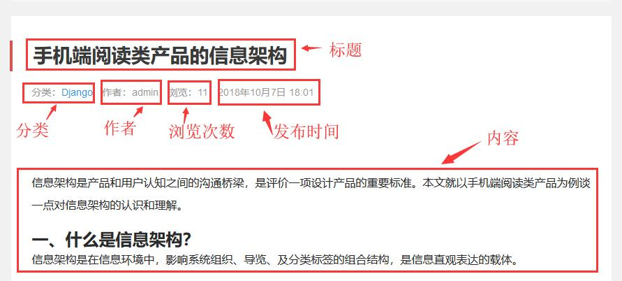
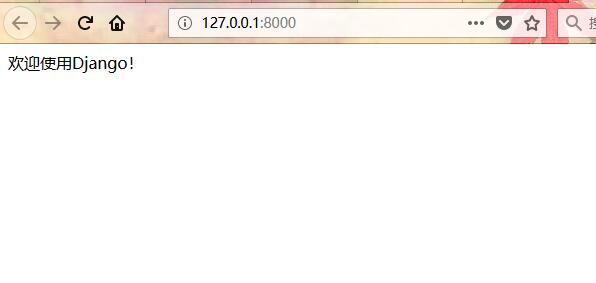
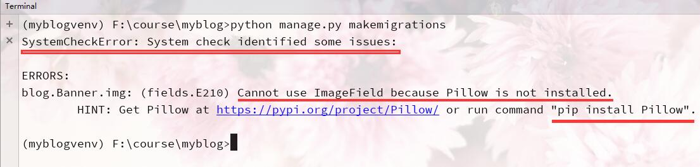

# Day83 django实践——基于Django2.1.1和python3.6Django的博客系统开发


# 1、搭建虚拟环境（windows）


1、搭建虚拟环境如何在Windows环境下搭建Python虚拟环境

cmd中直接安装 virtualenv : 

```
pip install virtualenv
```

在cmd环境下新建文件夹：

```
mkdir myproject
```

cd进入到新建文件夹中：

```
cd myproject
```

在myproject中新建虚拟环境 : 

```
virtualenv venv

virtualenv -p C:\Users\180927\AppData\Local\Programs\Python\Python311\python.exe my_project_env
```


如果存在多个python解释器，可以选择指定一个Python解释器（比如``python2.7``），没有指定则由系统默认的解释器来搭建： 

```
virtualenv -p /usr/bin/python2.7 my_project_env

virtualenv -p C:\Users\180927\AppData\Local\Programs\Python\Python311\python.exe my_project_env
```


#新建虚拟环境为venv，创建虚拟环境的时候 “virtualenv --no-site-packages venv”，如果virtualenv版本大于20，加上--no-site-packages时候会报错，默认版本大于20是不用加的。

```
# --system-site-packages: give the virtual environment access to the system site-packages dir (默认为 False，无需指明)
```

进入到.\venv\Scripts里面直接对文件夹cmd

```
.\myproject\venv\Scripts>activate
```

#此时为激活venv，激活后就进入到venv的环境中了，然后就可以直接pip install 各种库了。
#此时用pip list才能正确显示出虚拟环境里面装的库的信息，如果不activate，直接在venv下    用pip list 会显示外部python环境里面的库，并不是虚拟环境里面的库。
再直接输入

```
deactivate 
```

则退出虚拟环境。


## virtualenv使用技巧大全,python新手必备知识


搞Python开发时，总会遇到需要同时运行多个不同软件版本项目的时候。每个项目的依赖需求也不一样，那咋整？这个时候我们就需要用到Virtualenv了。


那么什么是Virtualenv呢？Virtualenv是一个能创建隔绝的独立的Python虚拟环境工具。通过它可以防止各个项目之间因为Python版本不同或第三方库版本不同引起冲突，它能够建立多个相互独立，互不影响的Python工作环境。

Virtualenv的安装很简单，一行命令就能搞定：

```
pip install virtualenv
```


Virtualenv安装好之后，就是给自己的项目创建一个虚拟环境。

```
virtualenv pyweb  #pyweb  为虚拟环境目录名，目录名自定义.
```

当然你也可以使用下面的命令创建指定Python版本的虚拟环境。

```
virtualenv 环境名称 --python=/usr/bin/python3.6    #指定创建一个版本为python3.6的虚拟环境
virtualenv  环境名称 --python='C:\python\python3.8.exe'
```


在哪个目录下创建，就会在该目录下生成一个名为pyweb的文件夹。


至于启动虚拟环境，Windows下和Linux下，略有不同。

**Linux下：**


我们进入创建的虚拟环境的bin目录下，然后使用如下命令启动

```
source activate
```

启动成功之后就会在命令行前出现一个pyweb


这就说明虚拟环境启动成功。我们就可以在这个虚拟环境下做自己想要做的事了。


**Windows下：**

进入pyweb目录下的Scripts目录下。


然后输入：activate 回车，就能启动虚拟环境。


至于退出虚拟环境，使用如下命令即可！

```
Linux下任意目录
>>>deactivate 

>>>windows cd 进入虚拟环境Scripts目录
>>>deactivate.exe
```


安装virtualenv以后，我们不同的项目只需要安装不同的虚拟环境，在不同的环境下工作，就不再相互影响到。妈妈再也不用担心我们出现各种莫名其妙的坑了。

**温馨提示：**安装virtualenv的时候，一定要留意自己系统默认的Python版本，不同版本安装出来的virtualenv版本可能不一样。

联系站长

Django与python版本

```
Django 1.11版本兼容Python 2.7、3.4、3.5、3.6、3.7（added in 1.11.17）# 1.11.5 python<=3.6` `Django 2.0版本兼容Python 3.4、3.5、3.6、3.7` `Django 2.1、2.2版本兼容Python 3.5、3.6、3.7` `Django 3.0版本兼容Python 3.6、3.7、3.8` `# https://pypi.org/project/Django/
```


| Django 版本 | Python 版本                                          |
| :---------- | :--------------------------------------------------- |
| 2.2         | 3.5，3.6，3.7，3.8（2.2.8 添加），3.9（2.2.17 添加） |
| 3.0         | 3.6，3.7，3.8，3.9 （3.0.11 添加）                   |
| 3.1         | 3.6，3.7，3.8，3.9（3.1.3 添加）                     |
| 3.2         | 3.6, 3.7, 3.8, 3.9, 3.10 (在 3.2.9 中就已经加入了)   |
| 4.0         | 3.8，3.9，3.10                                       |


## Django2.0入门教程:Django常用命令

前面一章，我们使用过Django创建APP应用的命令，下面再向大家介绍一些Django常用的命令。

```
安装Django： pip install django  指定版本 pip3 install django==2.0

新建项目： django-admin.py startproject mysite

新建APP : python manage.py startapp blog

启动：python manage.py runserver 8080

**同步或者更改生成 数据库：**

python manage.py makemigrations

python manage.py migrate

清空数据库： python manage.py flush

创建管理员： python manage.py createsuperuser

修改用户密码： python manage.py changepassword username

Django项目环境终端： python manage.py shell

这个命令和 直接运行 python 进入 shell 的区别是：你可以在这个 shell 里面调用当前项目的 models.py 中的 API，对于操作数据的测试非常方便。

更多关于Django的命令在终端输入：python manage.py 查看
```


https://www.django.cn/course/show-40.html

```

virtualenv -p C:\Users\180927\AppData\Local\Programs\Python\Python310\python.exe env

cd env\Scritps

activate

pip install django==2.0.1
pip install pillow
pip install pymysql


django-admin startproject myblog

cd myblog
python manage.py startapp blog


mkdir templates 

python manage.py runserver


前端引入

在页面顶部：
 #django2及之前的版本用这样的方法django3用下面的
  #django3 用这个语法

#引入CSS、JS
　

```


# Django博客开发教程:开发前的准备

作者：吴秀峰 时间:2018年10月9日 00:00 点击次数:53003

开发前的准备：

1、安装好Python环境。[Python3安装详细步骤](https://www.django.cn/article/show-20.html)

2、安装好virtualenv虚拟环境。[virtualenv虚拟环境安装方法](https://www.django.cn/article/show-5.html)

3、安装好Pycharm开发工具。

# Django博客开发教程:项目需求分析

作者：吴秀峰 时间:2018年10月9日 16:37 点击次数:51457

当我们要开发一个项目的时候，首先需要了解我们项目的具体需求，根据需求类型划分网站功能，并详细了解这些需求的业务流程。然后更具需求和业务流程进行数据库设计。本教程以一个Blog为例进行介绍，Blog演示站地址如下：http://demo.django.cn/

blog的功能相对比较简单，主要以文章为主。

**从功能需求来看**，这个Blog的功能分为：网站首页、文章分类、文章内容、幻灯图片、文章推荐、文章排行、热门推荐、文章搜索、友情链接。

**1、网站首页**：网站首页是整个网站的主界面，也是网站入口界面，里面主要展示Blog的动态信息及Blog功能导。网站动态信息以文章为主，如最新文章、幻灯图片、推荐阅读、文章排行、热门推荐、友情链接等。导航栏主要是将文章的分类的链接展示在首页，方便用户浏览。

**2、文章分类**，主要展示文章分类信息及链接，方便用户按需查看。文章分类可以在后台添加删除。

3、文章内容，主要展示文章所属分类、文章所属标签、文章内容、作者信息，发布时间信息。可以通过后台增、删、改。

**4、幻灯图片**，在网站首页，通过图片和文字展示一些重要信息，可以通过后台添加图片、图片描述、图片链接。

**5、文章推荐，**推荐一些重要的文章，可以在后台进行推荐。

**6、文章排行，**可根据文章浏览数，按时间段进行查询，然后展示出来。具体可根据自己的需求修改。

**7、热门推荐，**同样的推荐一些需要推荐的文章，可以在后台按需求或推荐位进行设置。

**8、文章搜索，**通过关键词搜索文章。

**9、友情链接，**展示相互链接的网站的名称与链接，可以通过后台添加与删除。

**10、单页面，**展示网站介绍，作者联系方式等信息，此类信息不经常变动，可以通过后台实现修改，也可以通过修改模板实现。


了解需求之后，就由UI设计师根据网站需求来设计网站页面，然后由前端工程师根据设计好的页面进行切图，实现HTML静态页面，最后由后端根据HTML页面和需求实现数据库构建和网站后台开发。

**从设计方面来看，**Blog主要分为六个页面，分别是：网站首页、文章分类列表页、文章内容页、搜索列表页、标签列表页、单页面。

1、网站首页，信息聚合的地方，展示多种信息。对应演示站的这个网址：http://demo.django.cn/

2、文章分类列表页，点击分类，进入一个同一分类文章展示的列表页面，对应演示站这个地址：http://demo.django.cn/list-2.html

3、文章内容页，文章内容展示页面，对应演示站这个地址：http://demo.django.cn/show-7.html

4、搜索列表页，通过首页搜索按钮，展示出与搜索 词相关的文章列表。对应地址：[http://demo.django.cn/s/?search=%E8%AE%BE%E8%AE%A1](http://demo.django.cn/s/?search=设计)

5、标签列表页，展示同一个标签下的所有文章。对应网址：[http://demo.django.cn/tag/Python%E6%95%99%E7%A8%8B](http://demo.django.cn/tag/Python教程)

6、单页面，展示网站介绍、作者介绍或者联系方式等信息。对应网址：http://demo.django.cn/about/


# Django博客开发教程:数据库设计分析

作者：吴秀峰 时间:2018年10月9日 17:34 点击次数:47832

从网站需求分析及网站功能、页面设计可以知道，我们的Blog主要以文章内容为主。所以我们在设计数据库的时候，我们主要以文章信息为核心数据，然后逐步向外扩展相关联的数据信息。

从这篇文章http://demo.django.cn/show-10.html可以看到，文章有标题、分类、作者、浏览次数、发布时间、文章标签等信息。




这其中，**文章与分类**的关系是一对多的关系，什么是一对多？就是一篇文章只能有一个分类，而一个分类里可以有多篇文章。**文章与标签**的关系是多对多的关系，多对多简单理解就是，一篇文章可以有多个标签，一个标签里同样可以有多篇文章。关于一对多、多对多，大家可以查看这篇文章：[多个数据模型间的关系](https://www.django.cn/course/show-13.html)

我们将文章表命名为Article，通过前面的分析得出文章信息表Article的数据库结构如下：

| **表字段 **  | **字段类型 **            | **备注 **                              |
| ------------ | ------------------------ | -------------------------------------- |
| id           | int类型，长度为11        | 主键，由系统自动生成                   |
| title        | CharField类型，长度为100 | 文章标题                               |
| category     | ForeignKey               | 外键，关联文章分类表                   |
| tags         | ManyToManyField          | 多对多，关联标签列表                   |
| body         | TextField                | 文章内容                               |
| user         | ForeignKey               | 外键，文章作者关联用户模型，系统自带的 |
| views        | PositiveIntegerField     | 文章浏览数，正的整数，不能为负         |
| tui          | ForeignKey               | 外键，关联推荐位表                     |
| created_time | DateTimeField            | 文章发布时间                           |

从文章表里，我们关联了一个**分类表**，我们把这个分类表命名为category，category表的数据库结构如下：

| **表字段** | **字段类型**            | ***\*备注\****       |
| ---------- | ----------------------- | -------------------- |
| id         | int类型，长度为11       | 主键，由系统自动生成 |
| name       | CharField类型，长度为30 | 分类名               |

文章关联的**标签表**，我们命名为tag，结构如下：

| **表字段** | **字段类型**            | ***\*备注\****       |
| ---------- | ----------------------- | -------------------- |
| id         | int类型，长度为11       | 主键，由系统自动生成 |
| name       | CharField类型，长度为30 | 标签名               |

文章关联的**推荐位表**，命名为tui，结构如下：

| **表字段** | **字段类型**            | ***\*备注\****       |
| ---------- | ----------------------- | -------------------- |
| id         | int类型，长度为11       | 主键，由系统自动生成 |
| name       | CharField类型，长度为30 | 标签名               |

除此之外，我们还有两个独立的表，和文章没有关联的，一个是幻灯图片的表，一个是友情链接的表。

**幻灯图表**，命名为banner，数据库结构如下：

| **表字段** | **字段类型**             | **备注**                             |
| ---------- | ------------------------ | ------------------------------------ |
| id         | int类型，长度为11        | 主键，由系统自动生成                 |
| text_info  | CharField类型，长度为100 | 标题，图片文本信息                   |
| img        | ImageField类型           | 图片类型，保存传图片的路径           |
| link_url   | URLField类型             | 图片链接的URL                        |
| is_active  | BooleanField布尔类型     | 有True 和False两个值，意思为是否激活 |

**友情链接**表命名为link，结构如下：

| **表字段** | **字段类型**            | **备注**             |
| ---------- | ----------------------- | -------------------- |
| id         | int类型，长度为11       | 主键，由系统自动生成 |
| name       | CharField类型，长度为70 | 友情链接的名称       |
| linkurl    | URLField类型            | 友情链接的URL        |

至此，我们的数据库构造大致完成，后期如果还有其它的需求，我们可以在这基础上进行增加或者删除。下面我们就开始进行项目的创建与开发。


# Django博客开发教程:创建项目

作者：吴秀峰 时间:2018年10月9日 20:32 点击次数:56100

我们对需求和数据库都进行分析了之后，我们就开始来创建我们的项目。教程是在windows10操作系统下，用的Python3.6和django2.1.1，开发工具为pycharm。

打开我们的Pycharm，新建一个项目。


说明：

1为项目保存路径，myblog为项目名。

2为选择使用的虚拟环境软件，这里选virtualenv。

3为虚拟环境保存目录，我把它保存在项目里，虚拟环境默认名为env，我系统里有多个项目为了区分出来命名为myblogenv

4为使用的模板语言，我们默认用django模板语言。

5为创建项目的时候建立一个模板文件目录，用来存放模板文件。用CMD命令创建项目的话，模板目录需要自己手动创建。

6为创建一个名为blog的APP应用。同样的用CMD命令创建的话，需要手动通过python manage.py startapp blog命令来进行创建。更多Django命令，请查看：[Django常用命令](https://www.django.cn/course/show-4.html)

点击创建之后，Pycharm自动帮我们完成Django软件下载安装和Django的项目创建。

**注意：**如果对需要指定Django版本的话，不能直接使用这个方法，这个方法会直接下载最新版本的Django。指定版本的话，请使用CMD通过命令如：pip install django==2.0.1安装。

安装成功之后项目目录结构如下图所示：


第一个黑色的**myblog**为项目文件夹目录。

blog为APP应用目录，也是我们上面设置第6项才创建的。myblog为项目配置目录，myblogvenv为Pycharm创建的虚拟环境目录，与项目无关，不用理会。

目录里的文件含义如下：

```
blog                #APP应用名和目录
│  admin.py        #对应应用后台管理配置文件。
│  apps.py         #对应应用的配置文件。
│  models.py       #数据模块，数据库设计就在此文件中设计。后面重点讲解
│  tests.py        #自动化测试模块，可在里面编写测试脚本自动化测试
│  views.py        #视图文件，用来执行响应代码的。你在浏览器所见所得都是它处理的。
│  __init__.py
│
├─migrations        #数据迁移、移植文目录，记录数据库操作记录，内容自动生成。
│  │  __init__.py
myblog               #项目配置目录
│  __init__.py       #初始化文件，一般情况下不用做任何修改。
│  settings.py        #项目配置文件，具体如何配置后面有介绍。
│  url.py             #项目URL设置文件，可理解为路由，可以控制你访问去处。
│  wsgi.py          #为Python服务器网关接口，是Python与WEB服务器之间的接口。
myblogvenv            #Pycharm创建的虚拟环境目录，和项目无关，不需要管它。
templates           #项目模板文件目录，用来存放模板文件
manage.py     #命令行工具，通过可以与项目与行交互。在终端输入python manege.py help，可以查看功能。
```


# Django博客开发教程:基础配置

作者：吴秀峰 时间:2018年10月9日 20:59 点击次数:56894

创建项目之后，我们需要对项目进行最基础的配置。这些配置是我们做项目的时候必须要配置的，所以我们先提前配置好。

我们打开myblog目录下的settings.py文件。

一、设置域名访问权限

```
myblog/settings.py
ALLOWED_HOSTS = []      #修改前
ALLOWED_HOSTS = ['*']   #修改后，表示任何域名都能访问。如果指定域名的话，在''里放入指定的域名即可
```

二、设置TEMPLATES里的'DIRS'，添加模板目录templates的路径，后面我们做网站模板的时候用得着。

```
myblog/settings.py
#修改前
'DIRS': []
#修改后
'DIRS': [os.path.join(BASE_DIR, 'templates')]
注：使用pycharm创建的话会自动添加
```

三、找到DATABASES设置网站数据库类型。这里我们使用默认的sqlite3。如果需要使用Mysql请查看文章：[Django如何使用Mysql数据库](https://www.django.cn/forum/forum-6.html)，其它数据库请查看官方文档。[官方文档](https://docs.djangoproject.com/en/2.1/ref/settings/#databases)，后期上线部署的话，也可以进行数据库与数据库之间的数据转换。具体可查看：[如何把SQLite数据库转换为Mysql数据库](https://www.django.cn/article/show-17.html)

四、在INSTALLED_APPS添加APP应用名称。

```
myblog/settings.py

INSTALLED_APPS = [
    'django.contrib.admin',
    ....
    'blog.apps.BlogConfig',#注册APP应用
]
#使用pycharm创建的话，这里自动添加了，如果是终端命令创建的话，需要手动添加应用名称如'blog',
```

五、修改项目语言和时区

```
myblog/settings.py
#修改前为英文
LANGUAGE_CODE = 'en-us'
#修改后
LANGUAGE_CODE = 'zh-hans' #语言修改为中文
#时区，修改前
TIME_ZONE = 'UTC'
#修改后
TIME_ZONE = 'Asia/Shanghai' #
```

六、在项目根目录里创建static和media，两个目录。static用来存放模板CSS、JS、图片等静态资源，media用来存放上传的文件，后面我们在讲解数据库创建的时候有说明。

settings里找到STATIC_URL，然后在后面一行加上如下代码。

```
myblog/settings.py

#设置静态文件目录和名称
STATIC_URL = '/static/'

#加入下面代码

#这个是设置静态文件夹目录的路径
STATICFILES_DIRS = (
    os.path.join(BASE_DIR, 'static'),
)
#设置文件上传路径，图片上传、文件上传都会存放在此目录里
MEDIA_URL = '/media/'
MEDIA_ROOT = os.path.join(BASE_DIR, 'media')
```

基本配置完成，更多关于配置文件的介绍，请查看文章：[全局配置settings详解](https://www.django.cn/course/show-10.html)


# Django博客开发教程:欢迎页面

作者：吴秀峰 时间:2018年10月9日 21:58 点击次数:52130

基础配置做好了之后，我们就可以先迁移数据到数据库，然后启动我们的项目，感受Django的魅力。

在Pycharm左下角底部的Terminal，会弹出Terminal终端窗口，Pycharm自动会帮我们启动虚拟环境。如下图所示：


这里面有两个地方需要留意：

1、留意项目路径，看这个路径是不是我们项目的路径。

2、留意路径前有没有我们创建的虚拟环境名，之前我们创建的虚拟环境名是myblogvenv，如果显示正确，则说明我们启动正确。如果没有虚拟环境名，则进入项目目录下的myblogvenv\Scripts目录里，在终端输入activate启动虚拟环境，然后再切换到项目根目录里。如果前面的虚拟环境名称不对，则在终端输入deactivate退出虚拟环境，然后按上面的方法启动虚拟环境。

上面都OK了，我们就在终端里依次输入如下命令进行数据库迁移：

```
python manage.py makemigrations
python manage.py migrate
```


迁移数据之后，网站目录里自动会创建一个数据库文件db.sqlite3，里面存放着我们的数据。


之后输入下面命令创建管理帐号和密码：

```
python manage.py createsuperuser
```


注意：密码不要太简单或者和电子邮件相似，不然Django会有风险提示。

最后，我们输入下面有命令，启动我们的Django项目：

```
python manage.py runserver #默认使用8000端口
python manage.py runserver 8080 #指定启动端口
python manage.py runserver 127.0.0.1:9000 #指定IP和端口
```


提示启动成功，然后我们在浏览器里输入：http://127.0.0.1:8000/

就可以查看到Django默认的欢迎页面！


是不是有一种成就感？这就是Django的强大之处。几个命令就可以实现一个网站创建。自己动手试试吧。

关于更多的Django命令，大家可以查看文章：[Django常用命令](https://www.django.cn/course/show-4.html)

有的朋友觉得这还是不过瘾，说这个欢迎页面是Django自带的，我们能自己做一个欢迎页面么？答案是肯定的。

首先，打开打开bolg目录下的views.py文件，在里面输入：

```
myblog/blog/views.py

from django.http import HttpResponse

def hello(request):
    return HttpResponse('欢迎使用Django！')
```

再打开myblog目录下的urls.py文件，在文件里添加两行代码：

```
myblog/myblog/urls.py

from django.contrib import admin
from django.urls import path
from blog import views         #+ 
urlpatterns = [
    path('admin/', admin.site.urls),
    path('', views.hello),   #+
]
```

留意：代码后面有个**#+**表示是我新添加的代码。

代码写好之后，启动项目，刷新页面。就可以看到：



OK，自定义欢迎页面成功显示！

之后，我们在浏览器里面访问：http://127.0.0.1:8000/admin 就可以进入Django自带的后台管理。


输入刚才我们创建的帐号与密码，点击登录。


进入到管理后台，这个后台功能十分强大。后面我们会对其进行详细介绍。


# Django博客开发教程:创建数据库模型

作者：吴秀峰 时间:2018年10月9日 23:38 点击次数:59442

Django是通过Model操作数据库，不管你数据库的类型是MySql或者Sqlite，Django它自动帮你生成相应数据库类型的SQL语句，所以不需要关注SQL语句和类型，对数据的操作Django帮我们自动完成。只要回写Model就可以了！

django根据代码中定义的类来自动生成数据库表。我们写的类表示数据库的表，如果根据这个类创建的对象是数据库表里的一行数据，对象.id 对象.value是每一行里的数据。

基本的原则如下：
每个模型在Django中的存在形式为一个Python类
每个模型都是django.db.models.Model的子类
模型里的每个类代表数据库中的一个表
模型的每个字段（属性）代表数据表的某一列
Django将自动为你生成数据库访问API

之前我们在前面的[数据库设计分析](https://www.django.cn/course/show-34.html)文章里已经分析过数据库的结构。完成博客，我们需要存储六种数据：文章分类、文章、文章标签、幻灯图、推荐位、友情链接。每种数据一个表。

**分类表结构设计**：

表名：Category、分类名：name

**标签表设计：**

表名：Tag、标签名：name

**文章表结构设计：**

表名：Article、标题：title、摘要：excerpt、分类：category、标签：tags、推荐位、内容：body、创建时间：created_time、作者：user、文章封面图片img

**幻灯图表结构设计：**

表名：Banner、图片文本text_info、图片img、图片链接link_url、图片状态is_active。

**推荐位表结构设计：**

表名：Tui、推荐位名name。

**友情链接表结构设计：**

表名：Link、链接名name、链接网址linkurl。

**其中：**

文章和分类是一对多的关系，文章和标签是多对多的关系，文章和作者是一对多的关系，文章和推荐位是一对多关系(看自己的需求，也可以设计成多对多)。

打开blog/models.py,输入代码：

```
from django.db import models
from django.contrib.auth.models import User 
#导入Django自带用户模块

# 文章分类
class Category(models.Model):
    name = models.CharField('博客分类', max_length=100)
    index = models.IntegerField(default=999, verbose_name='分类排序')

    class Meta:
        verbose_name = '博客分类'
        verbose_name_plural = verbose_name

    def __str__(self):
        return self.name
#文章标签
class Tag(models.Model):
    name = models.CharField('文章标签',max_length=100)
    class Meta:
        verbose_name = '文章标签'
        verbose_name_plural = verbose_name

    def __str__(self):
        return self.name
#推荐位
class Tui(models.Model):
    name = models.CharField('推荐位',max_length=100)

    class Meta:
        verbose_name = '推荐位'
        verbose_name_plural = verbose_name

    def __str__(self):
        return self.name

#文章
class Article(models.Model):
    title = models.CharField('标题', max_length=70)
    excerpt = models.TextField('摘要', max_length=200, blank=True)
    category = models.ForeignKey(Category, on_delete=models.DO_NOTHING, verbose_name='分类', blank=True, null=True)
     #使用外键关联分类表与分类是一对多关系
    tags = models.ManyToManyField(Tag,verbose_name='标签', blank=True)
    #使用外键关联标签表与标签是多对多关系
    img = models.ImageField(upload_to='article_img/%Y/%m/%d/', verbose_name='文章图片', blank=True, null=True)
     body = models.TextField()
    user = models.ForeignKey(User, on_delete=models.CASCADE, verbose_name='作者')
     """
     文章作者，这里User是从django.contrib.auth.models导入的。
     这里我们通过 ForeignKey 把文章和 User 关联了起来。
     """
    views = models.PositiveIntegerField('阅读量', default=0)
    tui = models.ForeignKey(Tui, on_delete=models.DO_NOTHING, verbose_name='推荐位', blank=True, null=True)
    
    created_time = models.DateTimeField('发布时间', auto_now_add=True)
    modified_time = models.DateTimeField('修改时间', auto_now=True)

    class Meta:
        verbose_name = '文章'
        verbose_name_plural = '文章'

    def __str__(self):
        return self.title

#Banner
class Banner(models.Model):
    text_info = models.CharField('标题', max_length=50, default='')
    img = models.ImageField('轮播图', upload_to='banner/')
    link_url = models.URLField('图片链接', max_length=100)
    is_active = models.BooleanField('是否是active', default=False)

    def __str__(self):
        return self.text_info

    class Meta:
        verbose_name = '轮播图'
        verbose_name_plural = '轮播图'


#友情链接
class Link(models.Model):
    name = models.CharField('链接名称', max_length=20)
    linkurl = models.URLField('网址',max_length=100)

    def __str__(self):
        return self.name
    class Meta:
        verbose_name = '友情链接'
        verbose_name_plural = '友情链接'
```

提示：上面的代码直接复制有可能导致其中几行代码格式缩进有问题，请自行检查一下。好多朋友就是在这出问题的。


这里面我们多增加了一个img图片封面字段，用于上传文章封面图片的，article_img/为上传目录，%Y/%m/%d/为自动在上传的图片上加上文件上传的时间。

里面的模型字段与模型元数据Meta选项详解我在这里就不做过多介绍，更多请点击文章[数据模型字段及属性详解](https://www.django.cn/course/show-12.html)和[模型元数据Meta选项详解](https://www.django.cn/course/show-14.html)了解。

我们已经编写了博客数据库模型的代码，但那还只是 Python 代码而已，Django 还没有把它翻译成数据库语言，因此实际上这些数据库表还没有真正的在数据库中创建。我们需要进行数据库迁移。

在迁移之前，我们先需要设置数据库，如果我们使用默认的数据库的话，就不需要设置，Django默认使用

sqlite3数据库，如果我们想使用Mysql数据库的话，则需要我们单独配置。我们打开settings.py文件，找到DATABASES，然后把它修改成如下代码：

```
############修改成mysql如下：
DATABASES = {
    'default': {
        'ENGINE': 'django.db.backends.mysql',
        'NAME': 'test',    #你的数据库名称
        'USER': 'root',   #你的数据库用户名
        'PASSWORD': '445813', #你的数据库密码
        'HOST': '', #你的数据库主机，留空默认为localhost
        'PORT': '3306', #你的数据库端口
    }}

#由于mysql默认引擎为MySQLdb，在__init__.py文件中添加下面代码
#在python3中须替换为pymysql,可在主配置文件（和项目同名的文件下，不是app配置文件）中增加如下代码
#import pymysql
#pymysql.install_as_MySQLdb()
#如果找不到pymysql板块，则通过pip install pymysql进行安装。
```

更多关于Django数据库的配置，请查看官方文档：[数据库设置](https://docs.djangoproject.com/en/2.1/ref/settings/#databases)

数据库设置好之后，我们就依次输入下面的命令进行数据库迁移：

```
python manage.py makemigrations
python manage.py migrate
```

迁移的时候，会有如下提示：



出现这个原因是因为我们的幻灯图使用到图片字段，我们需要引入图片处理包。提示里也给了我们处理方案，输入如下命令，安装Pillow模块即可：

```
pip install Pillow
```


安装成功之后再迁移数据库


数据库迁移成功之后，程序会在blog下的migrations目录里自动生成几个000开头的文件，文件里面记录着数据库迁移记录：


大家可以查看一下。了解迁移的过程。本文就不做过多介绍。

# Django博客开发教程:用Admin管理后台管理数据

作者：吴秀峰 时间:2018年10月10日 00:15 点击次数:49868

上节我们我们把数据库迁移到数据库里去了，那么现在我们数据库里是个什么样的情况呢？我们点击Pycharm右上角的Database，然后在网站项目里选中我们的数据库文件db.sqlite3，把它拖到Database框里。


然后点击db，就可以查看到我们的网站数据库，我们可以对数据进行增、删、改、查操作。


更多相关方面的操作请查看文章：[使用Pycharm里的Database对数据库进行可视化操作](https://www.django.cn/article/show-13.html)

Pycharm Batabase限制非常大，下面我们介绍如何使用Django自带的admin管理网站数据。django的admin后台管理它可以让我们快速便捷管理数据，我们可以在各个app目录下的admin.py文件中对其进行控制。想要对APP应用进行管理，最基本的前提是要先在settings里对其进行注册，就是在INSTALLED_APPS里把APP名添加进去，我们在前面的文章[基础配置](https://www.django.cn/course/show-36.html)有提到过。

注册APP应用之后，我们想要在admin后台里对数据库表进行操作，我们还得在应用APP下的admin.py文件里对数据库表先进行注册。我们的APP应用是blog，所以我们需要在blog/admin.py文件里进行注册：

```
blog/admin.py

from django.contrib import admin
from .models import Banner, Category, Tag, Tui, Article, Link 
#导入需要管理的数据库表

@admin.register(Article)
class ArticleAdmin(admin.ModelAdmin):
    list_display = ('id', 'category', 'title', 'tui', 'user', 'views', 'created_time')
    # 文章列表里显示想要显示的字段
    list_per_page = 50
    # 满50条数据就自动分页
    ordering = ('-created_time',)
    #后台数据列表排序方式
    list_display_links = ('id', 'title')
    # 设置哪些字段可以点击进入编辑界面


@admin.register(Banner)
class BannerAdmin(admin.ModelAdmin):
    list_display = ('id', 'text_info', 'img', 'link_url', 'is_active')

@admin.register(Category)
class CategoryAdmin(admin.ModelAdmin):
    list_display = ('id', 'name', 'index')

@admin.register(Tag)
class TagAdmin(admin.ModelAdmin):
    list_display = ('id', 'name')

@admin.register(Tui)
class TuiAdmin(admin.ModelAdmin):
    list_display = ('id', 'name')

@admin.register(Link)
class LinkAdmin(admin.ModelAdmin):
    list_display = ('id', 'name','linkurl')
```

关于admin定制和数据库表注册管理方法，在文章[定制Admin管理后台](https://www.django.cn/course/show-16.html)有详细介绍。

登录管理后台http://127.0.0.1:8000/admin/

注册之前的后台：


注册之后，启动项目，刷新页面：


多出了之前我们在models里创建的表。我们可以在后台里面对这些表进行增、删、改方面的操作。


提示：如果复制上面的代码运行提示出错，请检查models.py里代码的格式，有个地方直接复制代码可能导致格式不对，请自行检查一下。留言里出现的问题大多是这个问题。


# Django博客开发教程:使用富文本编辑器添加数据

作者：吴秀峰 时间:2018年10月10日 01:29 点击次数:39404

在Django admin后台添加数据的时候，文章内容文本框想发布一篇图文并茂的文章需就得手写Html代码，这十分吃力，也没法上传图片和文件。这显然不是我等高大上程序猿想要的。


为提升效率，我们可以使用富文本编辑器添加数据。支持Django的富文本编辑器很多，这里我推荐使用DjangoUeditor，Ueditor是百度开发的一个富文本编辑器，功能强大。下面教大家安装如何使用DjangoUeditor。

1、首先我们先下载DjangoUeditor包。点击下面的链接进行下载！下载完成然后解压到项目根目录里。

[DjangoUeditor.zip](https://www.django.cn/media/upfile/DjangoUeditor_20181010013851_248.zip)

2、settings.py里注册APP，在INSTALLED_APPS里添加'DjangoUeditor',。

```
myblog/settings.y
INSTALLED_APPS = [
    'django.contrib.admin',
    ....
    'DjangoUeditor', #注册APP应用
]
```

3、myblog/urls.py里添加url。

```
myblog/urls.py
...
from django.urls import path, include
#留意上面这行比原来多了一个include

urlpatterns = [
    path('admin/', admin.site.urls),
    path('', views.hello),
    path('ueditor/', include('DjangoUeditor.urls')), #添加DjangoUeditor的URL
]
```

4、修改blog/models.py里需要使用富文本编辑器渲染的字段。这里面我们要修改的是Article表里的body字段。

把原来的：

```
blog/models.py

body = models.TextField()
```

修改成：

```
blog/models.py
from DjangoUeditor.models import UEditorField #头部增加这行代码导入UEditorField

body = UEditorField('内容', width=800, height=500, 
                    toolbars="full", imagePath="upimg/", filePath="upfile/",
                    upload_settings={"imageMaxSize": 1204000},
                    settings={}, command=None, blank=True
                    )
```

留意里面的imagePath="upimg/", filePath="upfile/" 这两个是图片和文件上传的路径，我们上传文件，会自动上传到项目根目录media文件夹下对应的upimg和upfile目录里，这个目录名可以自行定义。有的人问，为什么会上传到media目录里去呢？那是因为之前我们在[基础配置](https://www.django.cn/course/show-36.html)文章里，设置了上传文件目录media。

上面步骤完成后，我们启动项目，进入文章发布页面。提示出错：

```
render() got an unexpected keyword argument 'renderer'
```


错误页面上有提示，出错的地方是下面文件的93行。

```
F:\course\myblog\myblogvenv\lib\site-packages\django\forms\boundfield.py in as_widget, line 93
```

我这里使用的是最新版本的Django2.1.1所以报错，解决办法很简单。打开这个文件的93行，注释这行即可。


修改成之后，重新刷新页面，就可以看到我们的富文本编辑器正常显示。


留意，如果我们在富文本编辑器里，上传图片，在编辑器内容里不显示上传的图片。那我们还需要进行如下设置，打开myblog/urls.py文件，在里面输入如下代码：

```
myblog/urls.py
....
from django.urls import path, include, re_path
#上面这行多加了一个re_path
from django.views.static import serve
#导入静态文件模块
from django.conf import settings
#导入配置文件里的文件上传配置

urlpatterns = [
    path('admin/', admin.site.urls),
    ....
    re_path('^media/(?P<path>.*)$', serve, {'document_root': settings.MEDIA_ROOT}),#增加此行
]
```

设置好了之后，图片就会正常显示。这样我们就可以用DjangoUeditor富文本编辑器发布图文并茂的文章了。

# Django博客开发教程:URL与视图函数

作者：吴秀峰 时间:2018年10月10日 22:10 点击次数:32372

在讲URL与视图函数之前我们先给大家简单介绍一下用户访问网站的流程。我们访问一个网站的时候，一般先打开浏览器，然后在浏览器的地址栏里输入一个网址，也就是URL，然后回车，我们就可以在浏览器里看到这个网址返回的内容。这是我们能看得见的过程，还有一些我们看不见的过程，那就是：当我们在浏览器里输入网址（URL）时，回车，然后浏览器就会向目标网址发送一个HTTP请求，服务器收到请求之后就会给这个请求做出一个响应，这个响应就是把对应的内容通过浏览器渲染出来，呈现给我们看。这个过程就是请求与响应。

下图，就是请求响应的过程。


更多相关的内容，大家可以查看文章：[请求与响应](https://www.django.cn/course/show-6.html)

上面我们提到了URL，这个URL在我们的Django中，其实是由我们自己构造的。(这个说法不太严谨，但为了方便大家理解之后的内容，先当这说辞是正确的。)

Django中，我们约定URL是在项目同名目录下的urls.py文件里urlpatterns列表构造的。

myblog/myblog/urls.py


表现形式如下：

```
urlpatterns = [
    path(正则表达式, views视图函数，参数，别名),
]
括号里的参数说明：
1、一个正则表达式字符串
2、一个可调用对象，通常为一个视图函数或一个指定视图函数路径的字符串
3、可选的要传递给视图函数的默认参数（字典形式）
4、一个可选的name参数(别名)
```

比如我想构造三个URL，网站首页(http://www.django.cn/)、新闻（http://www.django.cn/news/）、论坛(http://www.django.cn/bbs/)，我们可以这么做。

```
urlpatterns = [
    path('', views.index), #里面留空，代表首页
    path('news/',views.news),#news
    path('bbs/',views.bbs),#bbs
]
```

URL就是这么构造的，我们的域名www.django.cn不需要写，完整的URL应该要这么写：path(正则表达式, views视图函数，参数，别名), 里面的正则表达式, views视图函数，是必须要写的，而参数，别名是可选的。我们在有特殊需要的时候才写。关于URL详细介绍和使用方法可以查看文章：[路由配置系统URLconf](https://www.django.cn/course/show-7.html)

通过上面我们可以看到，每个URL都对应一个views视图函数名，视图函数名不能相同，否则会报错。视图函数，Django中约定写在APP应用里的views.py文件里。然后在urls.py文件里通过下面的方式导入：

```
from APP应用名 import views
from APP应用名.vews import 函数名或类名
```

视图函数是一个简单的Python 函数，它接受Web请求并且返回Web响应。响应可以是一张网页的HTML内容，一个重定向，一个404错误，一个XML文档，或者一张图片. . . 是任何东西都可以。无论视图本身包含什么逻辑，都要返回响应。这个视图函数代码一般约定是放置在项目或应用程序目录中的名为views.py的文件中。

http请求中产生两个核心对象：
1、http请求---->HttpRequest对象，用户请求相关的所有信息（对象）
2、http响应---->HttpResponse对象，响应字符串

之前我们在[欢迎页面](https://www.django.cn/course/show-37.html)这章的时候有操作过一次。我们回顾一下：

首先，打开打开bolg目录下的views.py文件，写一个hello视图函数，在里面输入：

```
from django.http import HttpResponse

def hello(request):
   """
  写一个hello函数，通过request接收URL或者说是http请求信息，
  然后给这个请求返回一个HttpResponse对象
  """
    return HttpResponse('欢迎使用Django！')
```

例子里，我们用到的request，就是HttpRequest对象。HttpResponse("欢迎使用Django！")，就是HttpRequest对象，它向http请求响应了一段字符串对象。

我们打开myblog目录下的urls.py文件中先导入视图函数，然后构造一个URL，代码如下：

```
from blog import views  #导入视图函数
urlpatterns = [
    ...
    path('', views.hello),   #这个是我们构造的URL
]
```

代码写完之后，启动项目就可以在浏览器里看到视图函数返回的字符串"欢迎使用Django！"

每一个URL都会对应一个视图函数，当一个用户请求访问Django站点的一个页面时，然后就由Django路由系统（URL配置文件）去决定要执行哪个视图函数使用的算法。

通过URL对应关系匹配 ->找到对应的函数（或者类）->返回字符串(或者读取Html之后返回渲染的字符串）这个过程也就是我们Django请求的生命周期。

视图函数，就是围绕着HttpRequest和HttpResponse这两个对象进行的。了解更多相关知识，可查看入门教程里的：[视图函数](https://www.django.cn/course/show-9.html)

# Django博客开发教程:体验django模板

作者：吴秀峰 时间:2018年10月11日 00:23 点击次数:32700

上面我们有说过，用户发送请求的时候，视图会返回一个响应，响应可以是一个重定向，一个404错误，一个XML文档，一张图片或者是一个HTML内容的网页。前面几个返回的信息比较有限，我们重点更多是放在HTML内容的网页。我们把这样的页面按规范写好，然后都放在项目根目录下的templates文件夹里，这样的页面，我们称之为"模板"页面。

Django做为一个WEB框架，需要一种很便利的方法去动态生成HTML网页，因为有了模板这个概念。模板页面包含一些基础的HTML代码和一些特殊的语法，这些特殊的语法主要用于如何将数据动态的插入HTML页面中。

这些特殊的语法我们把它做**变量、标签**。变量是模板中最基本的组成单位。这些模板变量由视图函数生成的，然后通过上下文传递到模板里，然后由浏览器渲染出来。

上面的都是理论， 我们不管它。我们直接说如何在模板里调用视图函数传过来的变量。这些变量有很多种类型，也就是Python支持的数据类型比如：普通变量、列表、字典等。

在这之前我们要先设置好模板路径，把这个路径在settings里设置好，不然就没法访问我们的模板目录，之前我在文章：[基础配置](https://www.django.cn/course/show-36.html) 里已经设置好了，下面我们直接使用就行。更多关于settings的配置可以查看文章：[全局配置settings详解](https://www.django.cn/course/show-10.html)

**一、变量**

1、在文件myblog/urls.py里设置一个URL：

```
myblog/urls.py
urlpatterns = [
    ...
    path('', views.index), 
    #把原来的views.hello修改成views.index  ''留空，表示为首页
    ...
]
```

2、在文件blog/views.py里添加一个视图函数：

```
blog/vews.py

#添加一个函数
def index(request):
    #添加两个变量，并给它们赋值
    sitename = 'Django中文网'
    url = 'www.django.cn'
    #把两个变量封装到上下文里
    context = {
        'sitename': sitename,
        'url':url,
    }
    #把上下文传递到模板里
    return render(request,'index.html',context)
```

3、在项目根目录下templates文件夹里新建一个文件index.html,输入如下内容：

```
templates/index.html

<!DOCTYPE html>
<html lang="en">
<head>
    <meta charset="UTF-8">
    <title>MyBlog</title>
</head>
<body>
<h3>网站名：{{ sitename }}</h3>
<h3>域名：{{ url }}</h3>
</body>
</html>
```

然后启动项目，在浏览器里访问 http://127.0.0.1:8000  就可以查看到我们在视图函数里我们设置的内容。


代码里的{{ sitename }}和{{ url}}就是模板变量，变量的数据类型是字符串或整形。在Django模板中，变量需要用{{ 变量名}}来显示。

**二、列表**

1、在视图函数index里添加如下代码：

```
blog/views.py
def index(request):
    sitename = 'Django中文网'
    url = 'www.django.cn'
    #新加一个列表
    list=[
        '开发前的准备',
        '项目需求分析',
        '数据库设计分析',
        '创建项目',
        '基础配置',
        '欢迎页面',
        '创建数据库模型',
    ]
    context = {
        'sitename': sitename,
        'url':url, 
        'list':list, #把list封装到context
    }
    return render(request,'index.html',context)
```

2、在模板文件index.html添加如下代码：

```
templates/index.html

<!DOCTYPE html>
<html lang="en">
<head>
    <meta charset="UTF-8">
    <title>MyBlog</title>
</head>
<body>
<h3>网站名：{{ sitename }}</h3>
<h3>域名：{{ url }}</h3>
{#新下面的代码#}
<div>
    <ul>
    <h4>Blog教程目录：</h4>
        
        <li>{{ list }}</li>
        
    </ul>
</div>
</body>
</html>
```

然后我们在浏览器里刷新页面，显示如下：


新加代码里 的属于Django模板的内置标签，它可以遍历输出变量的内容。

**三、字典**

1、在视图函数里添加如下代码：

```
blog/views.py

def index(request):
    ....
    #在来的基础上新加一个字典
    mydict={
        'name': '吴秀峰',
        'qq': '445813',
        'wx': 'vipdjango',
        'email': '445813@qq.com',
        'Q群': '10218442',
    }
    context = {
        ...
        #把mydict封装到上下文
        'mydict':mydict,
    }
    return render(request,'index.html',context)
```

2、在模板文件index.html添加如下代码:

```
templates/index.html
<!DOCTYPE html>
<html lang="en">
<head>
    <meta charset="UTF-8">
    <title>MyBlog</title>
</head>
<body>
...
<!-- 新加如下代码 -->
<div>
    <ul>
    <h4>Blog教程作者信息：</h4>
        
        <li>{{ key }}：{{ values }}</li>
        
    </ul>
</div>
</body>
</html>
```

新加的代码里， 是遍历输出字典里的 key和values的内容。

我们刷新页面，就能看到新的效果：


上面的就是在模板里调用变量、列表、字典的方法。当然，模板里还有许多内置的标签和过滤器。这里就不一一介绍。后面我们用上的时候，我会做特别的提醒。

上述代码我已经上传到服务器，请大家自行下载查看：

[模板体验代码.zip](https://www.django.cn/media/upfile/模板体验代码_20181023122903_709.zip)

与作者交流

# Django博客开发教程:体验数据查询

作者：吴秀峰 时间:2018年10月23日 12:27 点击次数:27273

进行数据查询之前，我们需要先进入我们的管理后台，在里面添加一些数据。然后我们用Pycharm打开我们的数据库。具体操作方法：[用Pycharm可视化操作数据库](https://www.django.cn/article/show-13.html)

我们的数据结构长这般模样：


双击blog_article，可以查看到文章表里的内容和里面的字段：


数据查询，就是在视图函数里(views.py文件里)对模型Product进行实例化，并生成对象。生成的对象就是我们要查询的数据。然后我们可以对这个对象的属性进行逐一赋值，对象的属性来自于Product模型中所定义的字段。直白一点的说法就是，我们在视图层里对某一个数据库表进行查询，然后得到一个对象，我们可以通过这个对象能获取到这个表里的所有字段的值。具体操作如下：

1、从models.py里导入模型Product(也就是类名，或者说表名)：

```
blog/views.py
#比如我信要查询所有文章，我们就要views.py文件头部把文章表从数据模型导入
from .models import Article
```

2、在视图函数里对要查询的Product进行声明并实例化，然后生成对象allarticle。

```
blog/views.py

def index(request):
    #对Article进行声明并实例化，然后生成对象allarticle
    allarticle = Article.objects.all()
    #把查询到的对象，封装到上下文
    context = {
        'allarticle': allarticle,
    }
    #把上传文传到模板页面index.html里
    return render(request,'index.html',context)
```

注：这里我在原来的基础上，把index视图函数里的内容删除了，修改成上面的内容，下面的模板页面index.html也是如此。

3、打开templates/index.html页面，修改成下面的内容：

```
<!DOCTYPE html>
<html lang="en">
<head>
    <meta charset="UTF-8">
    <title>MyBlog</title>
</head>
<body>

<div>
    <ul>
    <h4>所有文章：</h4>
        
        <li>{{ article.title }}</li>
        
    </ul>
</div>

</div>
</body>
</html>
```

然后访问网站首页。就能看到我们的查询结果。


在模板里，我们可以对对象的属性进行赋值。比如模板里的{{ article.title }} 标题，就是我们通过**{{ 对象.属性(字段) }}**获取到对应的值。其它字段也是通过这样的方法来实现。

例如：

```
templates/index.html

<!DOCTYPE html>
<html lang="en">
<head>
    <meta charset="UTF-8">
    <title>MyBlog</title>
</head>
<body>

<div>
    <ul>
    <h4>所有文章：</h4>
        
        <li>
            标题：{{ article.title }}<br />
            栏目：{{ article.category }}<br />
            作者：{{ article.user }}<br />
            时间：{{ article.created_time }}<br />

        </li>
        
    </ul>
</div>

</div>
</body>
</html>
```


从之前的文章我们可以看到，如果我们想要将数据库的数据展现到网页上，需要由视图、模型与模板共同实现，步骤如下：

1、在models.py里定义数据模型，以类的方式定义数据表的字段。在数据库创建数据表时，数据表由模型定义的类生成。

2、在视图views.py导入模型所定义的类，我们把这个类称之为数据表对象，然后在视图函数里使用Django的数据库操作方法，实现数据库操作，从而获取到数据表里的数据。

3、视图函数获取到数据之后，将数据以字典、列表或对象（上下文context）的方式传递给HTML模板，并由模板引擎接收和解析，最后生成相应的HTML网页，在浏览器里展现出来。

更多关于数据库查询操作方面的文章，请查看：[ORM之QuerySet API](https://www.django.cn/course/show-18.html) 和 [ORM QuerySet查询](https://www.django.cn/course/show-31.html)

与作者交流

# Django博客开发教程:一些常用的模板使用方法

作者：吴秀峰 时间:2018年10月24日 20:02 点击次数:30467

**一、django static文件的引入方式**

 \1. 在django project中创建 static文件夹
 2.settings.py中配置要在 STATIC_URL = '/static/' 下边　

```
STATICFILES_DIRS = [
    os.path.join(BASE_DIR, 'static'), 
]
```

或

```
STATICFILES_DIRS = os.path.join(BASE_DIR, 'static')
```

在做基础配置的时候，我们已经做好了。[基础配置](https://www.django.cn/course/show-36.html)

3.前端引入

```
在页面顶部：
 #django2及之前的版本用这样的方法django3用下面的
  #django3 用这个语法

#引入CSS、JS
　

```

**二、模板(template)包含、继承与  的用法
**

使用模板前，先设置TEMPLATES里的'DIRS'，添加模板目录templates的路径，这样Django才能自动找到模板页面：

```
#修改前
'DIRS': []
#修改后
'DIRS': [os.path.join(BASE_DIR, 'templates')]
```

Django模板存放方式有两种方法：

1、在项目根下创建templates目录，然后把模板存入在templates目录里，多个APP的话，就直接在templates目录下建立与APP名相同名称的目录即可。Django会自动查找到，这种方法简单、直观，适合个人或小项目。

2、各个APP下单独建立一个templates目录，然后再建立一个与项目名相同的的目录，把模板放到对应的目录里。这样的方法适合大项目多人协作，每个人只负责各自的APP项目的时候。多样式多站点(域名)的情况也适用，不同的APP用不同的模板样式，不同的域名。

两种方法，模板调用方法一样：

```
return render(request, 'app/index.html', context)
```

两种方法各有优点，大家选适合自己的就好，后面本教程就用第一个方法。

**模板包含**

以我们的演示站为例，http://demo.django.cn/ 我们可以看到，网站所有页面的头部和尾部都一样，只有中间的部分不一样。这时我们就可以把这个页面分为三个部分，每个部分分别存放在页面**head.html、index.html、footer.html**中，其中，**头部head.html**用来放所有页面头部相同的代码、**主体部分index.html**放与其它页面不相同的代码、**尾部head.html**放与其它页面尾部相同的代码。

举例，我们的首页代码如下：

```
<!DOCTYPE html>
<html lang="en">
<head>
    <meta charset="UTF-8">
    <title>MyBlog</title>
</head>
<body>
<div>头部</div>

<div>中部</div>

<div>尾部</div>

</div>
</body>
</html>
```

这时我们把这个页面分成三个页面，内容分别如下：

头部head.html

```
templates/head.html

<!DOCTYPE html>
<html lang="en">
<head>
    <meta charset="UTF-8">
    <title>MyBlog</title>
</head>
<body>
<div>头部</div>
```

主体部分index.html

```
templates/index.html

<div>中部</div>
```

尾部footer.html

```
templates/footer.html

<div>尾部</div>
</div>
</body>
</html>
```

假如，我们想实现首页模板调用的时候，我们可以这样做，就能合并成一个完整的首页代码如下：

```
templates/index.html


<div>中部</div>

```

我们只需要在主体代码的头部和尾部分别用和标签把头部文件和尾部文件包含进来，就能组合成一个完整的页面。这样的方法就是模板包含，我们其它页面只要是头部和尾部都相同的，我们只需要把这两个文件分别包含进来就行了。

这种方法还适用于另一种情况。比如我们所有页面的主体部分，其中有一小块代码都是相同的，我们在做模板的时候，如果内容需要修改的话，每个页面都要修改一次，很麻烦，并浪费时间。我们可以把这个代码单独提取出来，放在另一个页面xxx.html里，在调用的时候，我们只需要通过这个代码就能把页面xxx.html包含进来。具体的，还需要大家根据页面的实际情况灵活使用。

**模板继承**

还是以上面的代码为例，我们的页面index.html代码：

```
index.html

<!DOCTYPE html>
<html lang="en">
<head>
    <meta charset="UTF-8">
    <title>MyBlog</title>
</head>
<body>
<div>头部</div>

<div>中部</div>

<div>尾部</div>

</div>
</body>
</html>
```

我们把所有页面相同的代码单独提取出来放在 base.html页面里，然后在代码不同的位置，也就是主体那里用模板标签 替换。

```
templates/base.html

<!DOCTYPE html>
<html lang="en">
<head>
    <meta charset="UTF-8">
    <title>MyBlog</title>
</head>
<body>
<div>头部</div>





<div>尾部</div>

</div>
</body>
</html>
```

在实现首页模板的时候，我们通过下面的代码实现，组合成一个完整的首页：

```
templates/index.html

 

<div>中部</div>

```

这里里面的 的意思是继承 base.html页面的代码，需要留意的是，使用继承方法的话，这个代码一定要放页面的第一行。

我们还看到，两个页面里都有代码 代码 里的xxx可以自由命名，这个代码意思是告诉模板引擎：这个位置我要预留给别人放东西的。这个部分子模板可以重载，每个标签所要做的是告诉模板引擎，该模板下的这一块内容将有可能被子模板覆盖。

一般这个代码要父模板base.html里定义好，才可以在别的子模板上引用。引用的时候我们以开始，把代码放在这个标记对中间，最后以 结尾。

 标签非常有用，一般来说，基础模板中的  标签越多越好，用起来也会更灵活。例如，我的子页面想要多引用一个CSS样式文件，这个样式只需要应用在当前页面就行。我们可以在base.html模板里多加一个 标签,然后在子模板页面里加入代码：

```


#CSS样式文件路径
<link href='' type='text/css' />


```

这样的话，这个CSS就只在当前页面生效。

这样的应用场景非常多，比如我们做SEO的时候，不同页面要放不同的标题、关键词、描述等。

提示：不允许在同一个模板中定义多个同名的  ，不然就会出错。

模板的一些基本用法就介绍到这里。下面的章节就教大家如何实现网站的各个功能模块和各个页面的展现！

这里我把之前的源码都打包一份，大家可以下载下来对比一下。里面有一些数据，后台帐号密码是:admin qq445813 需要用到的软件和版本号都放在文件requirements.txt里。如果添加数据出错，请查看[使用富文本编辑器添加数据](https://www.django.cn/course/show-40.html)解决。

[myblog.zip](https://www.django.cn/media/upfile/myblog_20181024232952_528.zip)

与作者交流

# Django博客开发教程:实现模板之前的分析与准备

作者：吴秀峰 时间:2018年10月24日 23:19 点击次数:28372

在之前的[体验django模板](https://www.django.cn/course/show-42.html)、[体验数据查询](https://www.django.cn/course/show-43.html)以及[一些常用的模板使用方法](https://www.django.cn/course/show-44.html)文章里，向大家介绍了如何将数据库的数据展现到网页上，和一些简单的模板使用方法。之后我们就开始实现各种页面的展现。

在此之前，我们先从前端设计师手里拿到模板，然后分析模板页面结构和代码，并通过需求思索如何实现。模板下载地址：

[templates.zip](https://www.django.cn/media/upfile/templates_20181028073441_386.zip)

拿静态模板页面之后，结合我们之前的[项目需求分析](https://www.django.cn/course/show-33.html)知道，我们需要实现六个页面的展现。网站首页、文章分类列表页、搜索列表页、标签列表页、文章内容展示页、单页面（联系我们）。其中，文章分类列表页、搜索列表页、标签列表页这三个页面展示结构都一样我们只需要一个模板页面即可。所以说我们真正需要实现的只有4个页面，这四个页面分别对应前端给我们模板里的**首页(index.html)**、**列表页（list.html）**、**内容页(show.html)**、**单页(page.html)**。了解我们需要做的工作之后，我们开始做好准备工作。

1、我们把静态模板static目录里的所有文件夹和文件复制到项目目录下的static目录里，然后把index.html、list.html、show.html、page.html四个页面复制到项目下templates目录里（之前做测试时templates目录里的index.html删除掉）。

2、这四个页面，通过观察我们发现，头部和尾部是相同的，只有中间主体部分不相同，所以我们把这些相同的页面代码提取出来，新建一个文件base.html，把代码放到base.html里，头部代码和尾部代码中间部分用下面代码替代：

```


```

index.html、list.html、show.html、page.html四个页面，我们把头部和尾部相同的代码删除掉，然后把剩下的代码放到下面代码标志对中间：

```
 
#把头部和尾部相同的代码删除之后把剩余放到这里面来

```

最后每个页面的第一行加上代码

```

```

意思是继承 base.html页面的代码。

3、其中list.html和show.html这两个页面的右侧部分和index.html右侧除“热门文章排行"部分之外，都一样，所以我们也把这部分单独提取出来，放到right.html页面里，原来的位置我们用下面的代码替代：

```

```

这个代码的意思是把right.html包含进来。

4、修改base.html页面，首先我们先在base.html页面第一行加上如下代码：

```

  #django3 及以上用这个标签
```

告诉模板引擎，我们要加载引入静态资源。

然后把头部的CSS样式文件修改成下面的样子：

```
templates/base.html

<link rel='stylesheet' id='bootstrap-css' href='' type='text/css' media='all'/>
<link rel='stylesheet' id='fontawesome-css' href='' type='text/css' media='all'/>
<link rel='stylesheet' id='stylesheet-css' href='' type='text/css' media='all'/>
<link rel='stylesheet' id='raxus-css' href='' type='text/css' media='all'/>
<link rel='stylesheet' id='open-social-style-css' href='' type='text/css' media='all'/>
```

网站LOGO图片：

```
templates/base.html

</a>
```

尾部的JS文件：

```
templates/base.html

<script src=""></script>
<script type="text/javascript" src=""></script>
<script type='text/javascript' src=""></script>
<script type='text/javascript' src=''></script>
<script type='text/javascript' src=''></script>
<script type='text/javascript' src=''></script>
<script type='text/javascript' src=''></script>
<script type='text/javascript' src=''></script>
<script type='text/javascript' src=''></script>
```

修改完成之后，我们由原来的4个页面变成6个页面。


我把修改之后的文件上传上来，不太清楚的朋友可以下载下来对比一下。

[templates.zip](https://www.django.cn/media/upfile/templates_20181028085930_548.zip)

因为我们要实现6个页面的展现，**网站首页、文章分类列表页、搜索列表页、标签列表页、文章内容展示页、单页面（联系我们）**。所以我们需要在urls.py里，给每个页面都设置一个URL，并给每个URL添加一个别名：

```
myblog/urls.py

from blog import views
#导入blogAPP下的views

urlpatterns = [
    path('admin/', admin.site.urls),#管理后台
    path('', views.index, name='index'),#网站首页
    path('list-<int:lid>.html', views.list, name='list'),#列表页
    path('show-<int:sid>.html', views.show, name='show'),#内容页
    path('tag/<tag>', views.tag, name='tags'),#标签列表页
    path('s/', views.search, name='search'),#搜索列表页
    path('about/', views.about, name='about'),#联系我们单页
    path('ueditor/', include('DjangoUeditor.urls')),
    re_path('^media/(?P<path>.*)$', serve, {'document_root': settings.MEDIA_ROOT}),
]
```

里面其中列表页和内容页分、标签页面别传入一个整形参数**lid**和**sid**和一个**tag**参数。

然后在blog/views.py文件里，写六个视图函数，与myblog/urls.py文件里的六个url一一对应，视图函数里的先用pass替代（之前体验的视图函数index删除掉）:

```
blog/views.py

#首页
def index(request):
    pass

#列表页
def list(request,lid):
    pass

#内容页
def show(request,sid):
    pass

#标签页
def tag(request, tag):
    pass

# 搜索页
def search(request):
    pass
# 关于我们
def about(request):
    pass
```

留意，列表页和内容页、标签页面的视图函数里我们也都多接收了一个参数，与urls.py里的url里的参数对应上。

此时，我们的准备工作已经完毕，下面我们将进行各个页面的实现。

与作者交流

# Django博客开发教程:实现网站首页

作者：吴秀峰 时间:2018年10月28日 09:43 点击次数:43465

实现首页模板前，我们先把共公的页面模板base.html调用好。首先我们先看导航部分，除开**首页**和**关于博主**之外，其它的其实是我们的文章分类名。如图：


我们只需要在首页视图函数里，查询出所有的文章分类名称，然后在模板页面上展示就行。

```
blog/views.py

from .models import Category
#从models里导入Category类
def index(request):
    allcategory = Category.objects.all()#通过Category表查出所有分类
    #把查询出来的分类封装到上下文里
    context = {
            'allcategory': allcategory,
        }
    return render(request, 'index.html', context)#把上下文传到index.html页面
```

打开base.html页面，我们找到导航代码：

```
templates/base.html

<nav class="nav fl">
    <ul id="fix-list" class="fix-list clearfix">
        <li id="menu-item-24086" class="menu-item"><a href="/">首页</a></li>
        <li id="menu-item-117720" class="menu-item">
            <a href="/list-1.html">Django</a></li>
        <li id="menu-item-117720" class="menu-item">
            <a href="/list-2.html">Python</a></li>
        <li id="menu-item-117720" class="menu-item">
            <a href="/list-3.html">Linux</a></li>
        <li id="menu-item-117720" class="menu-item">
            <a href="/list-4.html">Mysql</a></li>
        <li id="menu-item-117720" class="menu-item">
            <a href="/list-5.html">运维知识</a></li>
        <li id="menu-item-117720" class="menu-item">
            <a href="/list-6.html">我的日记</a></li>
        <li id="menu-item-24086" class="menu-item"><a href="/about/">关于博主</a></li>
    </ul>
</nav>
```

里面的<li></li>标签只留下首页和关于博主的：

```
<nav class="nav fl">
    <ul id="fix-list" class="fix-list clearfix">
        <li id="menu-item-117720" class="menu-item"><a href="/">首页</a></li>
        
        <li id="menu-item-117720" class="menu-item"><a href="/about/">关于博主</a></li>
    </ul>
</nav>
```

然后中间部分加入如下代码：

```

<li id="menu-item-117720" class="menu-item">
 <a href="list-{{ category.id }}.html">{{ category.name }}</a>
 </li>

```

最终代码：

```
templates/base.html

<nav class="nav fl">
    <ul id="fix-list" class="fix-list clearfix">
        <li id="menu-item-117720" class="menu-item"><a href="/">首页</a></li>
        
        
         <li id="menu-item-117720" class="menu-item">
         <a href="list-{{ category.id }}.html">{{ category.name }}</a>
         </li>
        
        
        <li id="menu-item-117720" class="menu-item"><a href="/about/">关于博主</a></li>
    </ul>
</nav>
```

代码里面我们通过下面的代码遍历输出变量的内容：

```

```

文章分类名我们通过下面的代码可得到：

```
{{ category.name }}
```

点击文章分类名，就是进入到各个文章分类的列表页面，结合myblog/urls.py里的列表页面URL list-<int:lid>.html是由**list-**和**分类ID**组成，所以完整的URL是：

```
网站首页(网站域名)/list-分类ID.html
```

在模板页面调用url别名的代码是：

```
  #xxx为别名 网站首页就是
```

分类ID通过下面的代码可得到：

```
{{ category.id }}
```

为什么可以通过这样的方式可以查到分类ID，之前的文章有提到：[体验数据查询](https://www.django.cn/course/show-43.html)

最后得到完整的列表URL代码如下：

```
list-{{ category.id }}.html
```

弄好之后，然后我们刷新页面就能看到效果。

**首页幻灯图的实现**

实现前，要先添加一些数据**。**然后在首页视图函数里查询出所有的幻灯图的数据：

```
blog/views.py

from blog.models import Category, Banner
#把Banner表导入
def index(request):
    allcategory = Category.objects.all()
    banner = Banner.objects.filter(is_active=True)[0:4]#查询所有幻灯图数据，并进行切片
    context = {
                'allcategory': allcategory,
                'banner':banner, #把查询到的幻灯图数据封装到上下文
        }
    return render(request, 'index.html', context)
```

提示：我们通过filrter查询出所有激活的is_active幻灯图数据，并进行切片，只显示4条数据。

首页index.html文件里，找到幻灯图代码，里面的<li></li>标签只保留一个，然后修改成如下代码“

```
templates/index.html


<li class="slide fix-width">
    <a href="{{ b.link_url }}" title="{{ b.text_info }}">
    </a>
        <span class="text ani-left"><strong>{{ b.text_info }}</strong></span>
    </li>

```

其中{{ b.link_url }}表示图片链接的URL，{{ b.text_info }}为图片的标题描述，{{ b.img }}为上传的图片名，完整的图片路径由media/{{ b.img }}组成。media/就是我们之前设置的图片上传的目录。

**首页推荐阅读实现**

我们在发布文章的时候，要先在推荐位里选择好要推荐的文章，然后再进行查询展现。


首页视图函数里：

```
blog/views.py
from blog.models import Category,Banner, Article
#我们查询的是进行推荐的文章，所以要导入文章Article表
def index(request):
    ....
    tui = Article.objects.filter(tui__id=1)[:3]#查询推荐位ID为1的文章
    context = {
            ...
            'tui':tui,
        }
    return render(request, 'index.html', context)
```

**提示：**filter查询条件里的tui__id=1，表示为通过文章里的外键推荐位进行筛选。

首页index.html页面，找到推荐阅读里面三个结构相同的代码，保留一个，然后修改成：

```
templates/index.html


<div class="caption">
    <h4><a href="show-{{ t.id }}.html" title="{{ t.title }}"
               rel="bookmark">{{ t.title }}</a></h4>
    <p>{{ t.excerpt|truncatechars:"80" }}</p>
    </div>

```

里面要留意的是文章的URL的构成，这和列表URL一样，这里不重复，{{ t.excerpt|truncatechars:"80" }}这个代码表示截取文章摘要的80个字符。

**首页最新文章实现**

首页最新文章，调用的是所有分类里的最新文章，这里只调用10篇：

```
blog/views.py

def index(request):
    ...
    allarticle = Article.objects.all().order_by('-id')[0:10]
    context = {
        ...
        'allarticle': allarticle,
        }
    return render(request, 'index.html', context)
```

里面的.order_by('-id')为数据排序方式，[0:10]为只获取10索引切片，只获取最新的10篇文章。

首页最新文章的，只保留一个文章展示代码，然后修改为：

```
templates/index.html


    <div class="article-box clearfix excerpt-1">
        <div class="col-md-4">
            <div class="thumbnail">
                <a href="show-{{ a.id }}.html" title="{{ a.title }}">
                    </a>
            </div>
        </div>
        <div class="col-md-8">
            <h2><a href="show-{{ a.id }}.html" target="_blank"
                   title="{{ a.title }}">{{ a.title }}</a></h2>
            <p class="txtcont hidden-xs"><a href="show-{{ a.id }}.html" target="_blank"
                                            title="{{ a.title }}">{{ a.excerpt }}</a></p>
            <div class="meta"><span class="label label-info"><a
                    href="list-{{ a.category.id }}.html">{{ a.category.name }}</a></span>
                <time class="item"><i class="fa fa-clock-o"></i>{{ a.created_time|date:"Y年m月d日" }}
                </time>
            </div>
        </div>
    </div>

```

**提示：**里面分类名和分类ID是文章里的外键字段，所以我们是通过代码{{ a.category.name }}和{{ a.category.id}}这样的方式进行调用的。时间字段我们进行格式化，然后通过年月日的形式展现，{{ a.created_time|date:"Y年m月d日" }}。

**热门文章排行实现**

热门文章的实现有多种方式，如果你想要在上面展示自己指定的文章，你可以在后台通过再添加一个推荐位来实现，也可以查询所有文章，通过文章浏览数进行倒序展示，也可以查询数据库通过随机的方式展示。代码分别如下：

```
blog/views.py

def index(request):
    ...
    #hot = Article.objects.all().order_by('?')[:10]#随机推荐
    #hot = Article.objects.filter(tui__id=3)[:10]   #通过推荐进行查询，以推荐ID是3为例
    hot = Article.objects.all().order_by('views')[:10]#通过浏览数进行排序
    context = {
               ... 
          'hot':hot,
        }
    return render(request, 'index.html', context)
```

热门文章推荐代码里，<ol></ol>标志对里，找到<li></li>标签，只保留一个，然后修改成如下代码：

```
templates/index.html


<li><a href="show-{{ h.id }}.html" title="{{ h.title }}">{{ h.title }}</a></li>

```

**右侧热门推荐实现**

打侧的热门推荐代码在right.html里，所以我们需要修改right.html页面，这个地方我们是通过后台的推荐位ID为2实现的，我们在发文章的时候，进行推荐就可以了。查询代码：

```
blog/views.py

def index(request):
    ...
    remen = Article.objects.filter(tui__id=2)[:6]
    context = {
            ...
            'remen':remen,
        }
    return render(request, 'index.html', context)
```

打开right.html页面，修改对应代码：

```
templates/right.html

<ul class="post-hot clearfix">

    <li>
        <div class="img">
        <a href="show-{{ k.id }}.html" title="{{ k.title }}">
        
        </a>
        </div>
        <div class="text">
        <a href="show-{{ k.id }}.html" title="{{ k.title }}"
                   target="_blank">{{ k.title }}</a>
        </div>
       </li>

</ul>
```

**右侧所有标签实现**

```
blog/views.py

from blog.models import Category,Banner, Article, Tag
#导入标签表
def index(request):
    ...
    tags = Tag.objects.all()
    context = {
            ...
            'tags':tags,
        }
    return render(request, 'index.html', context)
```

找到标签代码，修改为：

```
templates/right.html

<div class="tags">
    
        <a href="tag/{{ tag.name }}">{{ tag.name }}</a>
    
</div>
```

右侧的二维码图片就简单了，我们修改一下路径就行。留意，加之前我们要在right.html头部加入：

```
templates/right.html


#上面的代码要加在第一行


修改为：

```

**尾部的友情链接实现：**

```
blog/views.py
from blog.models import Category,Banner, Article, Tag, Link
#导入友情链接表Link

def index(request):
    ...
    link = Link.objects.all()
    context = {
            ...
            'link':link,
        }
    return render(request, 'index.html', context)
```

找到友情链接代码，修改为：

```
templates/index.html

<ul class="clears">
    
        <li><a href="{{ l.linkurl }}" target="_blank">{{ l.name }}</a></li>
    
</ul>
```

全部修改好之后，刷新页面，就能看到效果。

# Django博客开发教程:实现文章列表

作者：吴秀峰 时间:2018年10月28日 13:17 点击次数:24200

文章列表的URL是：网站域名/list-分类ID.html，文章列表页面需要调用的地方相对首页就少了很多。我这边就不再像首页那样做详细解释了。

直接上视图函数代码：

```
blog/views.py

#文章列表
def list(request,lid):
    list = Article.objects.filter(category_id=lid)#获取通过URL传进来的lid，然后筛选出对应文章
    cname = Category.objects.get(id=lid)#获取当前文章的栏目名
    remen = Article.objects.filter(tui__id=2)[:6]#右侧的热门推荐
    allcategory = Category.objects.all()#导航所有分类
    tags = Tag.objects.all()#右侧所有文章标签
    return render(request, 'list.html', locals())
```

大家留意一下Article.objects.filter(category_id=lid)，通过filter查询到的是多个文章对象，(request,lid)这里面的lid是通过url传过来的，表示分类的id，然后我们在视图函数里接收。category_id=lid表示筛选出文章里分类id与传过进来的id相等文章。id=lid则是在文章分类里筛选出id与lid相同的分类，然后在列表页里展现。

大家可能也留意到了，我们这个视图函数里和首页视图函数对比少了一个context = {...}而多了一个locals()，这个locals()代替了context，locals()的作用是返回一个包含当前作用域里面的所有变量和它们的值的字典。由于后面我们进行代码优化的时候用的着，所以先介绍给大家。

打开templates/list.html页面。你的位置，后面的代码修改为：

```
templates/list.html

您的位置： <a itemprop="breadcrumb" href="/">首页</a> » 
<span class="current">Python</span></div>
修改为： 
<a itemprop="breadcrumb" href="">首页</a> » 
<span class="current">{{ cname }} </span></div>
```

分类：

```
templates/list.html

<h4 class="post-left-title">分类：Python</h4>
修改为：
<h4 class="post-left-title">分类：{{ cname}}</h4>
```

文章列表展示修改为：

```
templates/list.html


    <div class="article-box clearfix excerpt-1">
        <div class="col-md-4">
            <div class="thumbnail">
                <a href="show-{{ list.id }}.html" title="{{ list.title }}">
                    </a>
            </div>
        </div>
        <div class="col-md-8">
            <h2><a href="show-{{ list.id }}.html" target="_blank"
                   title="{{ list.title }}">{{ list.title }}</a></h2>
            <p class="txtcont hidden-xs"><a href="show-{{ list.id }}.html"
                                            target="_blank"
                                            title="{{ list.title }}">{{ list.excerpt }}</a></p>
            <div class="meta"><span class="label label-info"><a
                    href="list-{{ list.category_id }}.html">{{ list.category.name }}</a></span>
                <time class="item"><i
                        class="fa fa-clock-o"></i>{{ list.created_time|date:"Y年m月d日" }}
                </time>
            </div>
        </div>
    </div>

```

最后是文章分页，如果文章数量太多，我们需要对查询出来的数据进行分页展示。Django自带一个强大的分页功能插件，我们使用的时候，先在视图函数里导入，然后再使用。

```
blog/views.py
from django.core.paginator import Paginator, EmptyPage, PageNotAnInteger
#导入分页插件包
def list(request,lid):
    ...
    page = request.GET.get('page')#在URL中获取当前页面数
    paginator = Paginator(list, 5)#对查询到的数据对象list进行分页，设置超过5条数据就分页
    try:
        list = paginator.page(page)#获取当前页码的记录
    except PageNotAnInteger:
        list = paginator.page(1)#如果用户输入的页码不是整数时,显示第1页的内容
    except EmptyPage:
        list = paginator.page(paginator.num_pages)#如果用户输入的页数不在系统的页码列表中时,显示最后一页的内容
    return render(request, 'list.html', locals())
```

分页代码修改为：

```
templates/list.html

<div class="pagination">
    <ul>
        <li class="prev-page"></li>
        <li class="active"><span>1</span></li>
        <li><a href="?page=2">2</a></li>
        <li class="next-page"><a href="?page=2">下一页</a></li>
    </ul>
</div>

修改为：

<div class="pagination">
    <ul>
        
        <li class="prev-page"><a href="?page={{ list.previous_page_number }}">上一页</a></li>
        
         <li class="prev-page"></li>
        


            
                
                    
                        <li class="active"><span>{{ num }}</span></li>
                    
                        <li><a href="?page={{ num }}">{{ num }}</a></li>
                    
                
                    <li class="disabled"><span>...</span></li>
                
            


            
                <li class="next-page"><a href="?page={{ list.next_page_number }}">下一页</a></li>
            
                <li class="prev-page"></li>
            
    </ul>
</div>
```

这个分页代码就不做过多解释，大家有不明白的可以加我微信：**VIPdjango**进行咨询，也可以自行百度。

至此，列表页面实现完毕。

# Django博客开发教程:实现文章内容页

作者：吴秀峰 时间:2018年10月28日 14:36 点击次数:18001

文章内容的URL是：网站域名/show-文章ID.html，文章ID是通过URL里的sid传进来的。

视图函数代码：

```
blog/views.py

def show(request,sid):
    show = Article.objects.get(id=sid)#查询指定ID的文章
    allcategory = Category.objects.all()#导航上的分类
    tags = Tag.objects.all()#右侧所有标签
    remen = Article.objects.filter(tui__id=2)[:6]#右侧热门推荐
    hot = Article.objects.all().order_by('?')[:10]#内容下面的您可能感兴趣的文章，随机推荐
    previous_blog = Article.objects.filter(created_time__gt=show.created_time,category=show.category.id).first()
    netx_blog = Article.objects.filter(created_time__lt=show.created_time,category=show.category.id).last()
    show.views = show.views + 1
    show.save()
    return render(request, 'show.html', locals())
```

代码里Article.objects.get(id=sid)，因为获取的是单个对象，所以用get方法，id=sid查询URL传过来的指定id的文章。previous_blog和netx_blog是文章上一篇下一篇，我们通过发布文章时间来进行筛选文章的，比当前文章发布的时间小就是上一篇，比当前文章发布时间大就是下一篇。category=show.category.id，则是指定查询的文章为当前分类下的文章。

文章的浏览数，我们先通过show.views查询到当前浏览数，然后对这个数进行加1操作，意思是每访问一次页面（视图函数），就进行加1操作。然后再通过show.save()进行保存。

```
show.views = show.views + 1
show.save()
```

打开文章内容页模板show.html页面。最上边，您的位置，那里的代码修改为：

```
<div class="breadcrumb">您的位置： <a itemprop="breadcrumb" href="">首页</a> » <a
    href="list-{{ show.category.id }}.html">{{ show.category.name }}</a> »
<span class="current">正文</span></div>
```

文章标题修改为：

```
<h1 class="post-title">{{ show.title }}</h1>
```

标题下的几个字段修改为：

```
<span class="item">分类：<a href="list-{{ show.category.id }}.html" rel="category tag">{{ show.category.name }}</a></span>
<span class="item">作者：{{ show.user }}</span>
<span class="item">浏览：{{ show.views }}</span>
<span class="item">{{ show.created_time }}</span>
```

文章内容里内容信息修改为：

```
<article class="article-content">
{{ show.body|safe }}
</article>
```

文章内容信息下面的文章标签，修改为：

```
<div class="post-tag"><span class="fa fa-tags" aria-hidden="true"></span>标签：

    <a href="tag/{{ tag.name }}" rel="tag">{{ tag.name }}</a>

</div>
```

值得留意的是标签的URL构造，要结合myblog/urls.py里的结构来构造。

文章的上一篇下一篇修改为：

```
    <div>
        <div><b>上一篇：</b>
            
                <a href="show-{{ netx_blog.pk }}.html" class="article-tag">{{ netx_blog }}</a>
            
                没有了
            
        </div>
        <div><b>下一篇：</b>
            
                <a href="show-{{ previous_blog.pk }}.html" class="article-tag">{{ previous_blog }}</a>
            
                没有了
            
        </div>
    </div>
</div>
```

这里面要留意的就是需要判断当前文章有没有上一篇和下就篇。有的话就显示，没有的话就输出'没有了'。

文章内容最下面的'你可能感兴趣：'这里我直接是随机调用的文章，大家如果想调用与文章相关联的文章，可以通过查询相同标签下文章进行展现，这样关联性就会强一些，当前了如果你的文章想进行一些商业广告推送，你也可以通过在后台添加推荐位来实现。了解原理之后，可以灵活根据自己的需求来实现。

```
<ul>

<li>
 <div class="pic">
   <a href="show-{{ h.id }}.html" title="{{ h.title }}">
   </a>
  </div>
    <a class="descript " href="show-{{ h.id }}.html" rel="bookmark"
           title="{{ h.title }}">{{ h.title }}</a>
</li>

</ul>
```

至此，文章内容页实现完毕。

# Django博客开发教程:实现标签页面

作者：吴秀峰 时间:2018年10月28日 16:44 点击次数:15866

标签列表是的URL是：网站域名/tag/标签名，标签名是URL里的<tag>传进来的。标签页面和列表页面展现样式是一样的，前面我们也提及过，所以我们直接复制list.html页面，然后更名为tags.html。

视图函数代码：

```
blog/views.py

def tag(request, tag):
    list = Article.objects.filter(tags__name=tag)#通过文章标签进行查询文章
    remen = Article.objects.filter(tui__id=2)[:6]
    allcategory = Category.objects.all()
    tname = Tag.objects.get(name=tag)#获取当前搜索的标签名
    page = request.GET.get('page')
    tags = Tag.objects.all()
    paginator = Paginator(list, 5)
    try:
        list = paginator.page(page)  # 获取当前页码的记录
    except PageNotAnInteger:
        list = paginator.page(1)  # 如果用户输入的页码不是整数时,显示第1页的内容
    except EmptyPage:
        list = paginator.page(paginator.num_pages)  # 如果用户输入的页数不在系统的页码列表中时,显示最后一页的内容
    return render(request, 'tags.html', locals())
```

标签列表页的实现，没有什么特别需要留意的地方。和列表页差不多，我直接上代码。打开templates/tags.html页面找到下面位置进行修改。

您的位置：

```
templates/tags.html

<div class="breadcrumb">您的位置： <a itemprop="breadcrumb" href="">首页</a> » <span
class="current">标签：{{ tname }}</span></div>
```

获取当前页面查询的标签名：

```
templates/tags.html

<div class="main-title">
    <h4 class="post-left-title">标签：{{ tname }}</h4>
</div>
```

显示当前标签下的所有文章：

```
templates/tags.html


    <div class="article-box clearfix excerpt-1">
        <div class="col-md-4">
            <div class="thumbnail">
                <a href="show-{{ list.id }}.html" title="{{ list.title }}">
                    </a>
            </div>
        </div>
        <div class="col-md-8">
            <h2><a href="show-{{ list.id }}.html" target="_blank"
                   title="{{ list.title }}">{{ list.title }}</a></h2>
            <p class="txtcont hidden-xs"><a href="show-{{ list.id }}.html"
                                            target="_blank"
                                            title="{{ list.title }}">{{ list.excerpt }}</a></p>
            <div class="meta"><span class="label label-info"><a
                    href="list-{{ list.category_id }}.html">{{ list.category.name }}</a></span>
                <time class="item"><i
                        class="fa fa-clock-o"></i>{{ list.created_time|date:"Y年m月d日" }}
                </time>
            </div>
        </div>
    </div>

```

列表分页：

```
templates/tags.html

<div class="pagination">
    <ul>
        
        <li class="prev-page"><a href="?page={{ list.previous_page_number }}">上一页</a></li>
        
         <li class="prev-page"></li>
        


            
                
                    
                        <li class="active"><span>{{ num }}</span></li>
                    
                        <li><a href="?page={{ num }}">{{ num }}</a></li>
                    
                
                    <li class="disabled"><span>...</span></li>
                
            


            
                <li class="next-page"><a href="?page={{ list.next_page_number }}">下一页</a></li>
            
                <li class="prev-page"></li>
            
    </ul>
</div>
```

标签页面实现完毕！

# Django博客开发教程:实现搜索页面

作者：吴秀峰 时间:2018年10月28日 17:36 点击次数:19922

搜索列表页的URL是：网站域名/s/搜索关键词,搜索页面，同样我们直接复制一份list.html页面，然后更名为search.html。

视图函数代码：

```
def search(request):
    ss=request.GET.get('search')#获取搜索的关键词
    list = Article.objects.filter(title__icontains=ss)#获取到搜索关键词通过标题进行匹配
    remen = Article.objects.filter(tui__id=2)[:6]
    allcategory = Category.objects.all()
    page = request.GET.get('page')
    tags = Tag.objects.all()
    paginator = Paginator(list, 10)
    try:
        list = paginator.page(page) # 获取当前页码的记录
    except PageNotAnInteger:
        list = paginator.page(1) # 如果用户输入的页码不是整数时,显示第1页的内容
    except EmptyPage:
        list = paginator.page(paginator.num_pages) # 如果用户输入的页数不在系统的页码列表中时,显示最后一页的内容
    return render(request, 'search.html', locals())
```

里面要留意的是title__icontains=ss，这话的意思是，用搜索关键词ss和文章标题进行匹配，如果标题包含关键词ss就会被筛选出来，__icontains方法不区分字母大小写。

打开tempates/base.html页面，找到头部的搜索代码，把action的URL修改为下面的：

```
tempates/base.html

action="s/"
```

打开tempates/search.html页面，对照下面的代码进行修改。

您当前位置：

```
tempates/search.html

<div class="breadcrumb">您的位置： <a itemprop="breadcrumb" href="">首页</a> » 
<span class="current">关键词：{{ ss }}</span></div>
```

搜索的关键词：

```
tempates/search.html

<div class="main-title">
    <h4 class="post-left-title">关键词：{{ ss }}</h4>
</div>
```

搜索出来的文章列表：

```
tempates/search.html


<div class="article-box clearfix excerpt-1">
<div class="col-md-4">
    <div class="thumbnail">
        <a href="show-{{ list.id }}.html" title="{{ list.title }}">
            </a>
    </div>
</div>
<div class="col-md-8">
    <h2><a href="show-{{ list.id }}.html" target="_blank"
           title="{{ list.title }}">{{ list.title }}</a></h2>
    <p class="txtcont hidden-xs"><a href="show-{{ list.id }}.html"
                                    target="_blank"
                                    title="{{ list.title }}">{{ list.excerpt }}</a></p>
    <div class="meta"><span class="label label-info"><a
            href="list-{{ list.category_id }}.html">{{ list.category.name }}</a></span>
        <time class="item"><i
                class="fa fa-clock-o"></i>{{ list.created_time|date:"Y年m月d日" }}
        </time>
    </div>
</div>
</div>

```

列表分页：

```
tempates/search.html

<div class="pagination">
<ul>
    
    <li class="prev-page"><a href="s/?search={{ ss }}&page={{ list.previous_page_number }}">上一页</a></li>
    
     <li class="prev-page"></li>
    


        
            
                
                    <li class="active"><span>{{ num }}</span></li>
                
                    <li><a href="s/?search={{ ss }}&page={{ num }}">{{ num }}</a></li>
                
            
                <li class="disabled"><span>...</span></li>
            
        


        
            <li class="next-page"><a href="s/?search={{ ss }}&page={{ list.next_page_number }}">下一页</a></li>
        
            <li class="prev-page"></li>
        
</ul>
</div>
```

留意：这里面的分页URL和列表页、标签页的分页URL是不一样的，自己留意对比。然后可以自己尝试修改和列表页面一样的URL结构试试。

搜索页面实现完毕！更多疑问可以加微信:VIPdjango交流！

# Django博客开发教程:单页面实现与代码优化

作者：吴秀峰 时间:2018年10月28日 18:38 点击次数:25833

单页面的URL是：网站域名/about/，由于单页面里面的东西比较少，我们就只查询一下分类表获取所有文章分类即可。视图函数代码：

```
blog/views.py

# 关于我们
def about(request):
    allcategory = Category.objects.all()
    return render(request, 'page.html',locals())
```

打开page.html页面，把里面的内容修改为自己想的要内容。把右边的二维码修改一下：

```
templates/page.html


```

至此，所有页面都实现完成。

下面我们需要进行小范围的代码优化。大家仔细观察一下，可以看到，我们每个视图函数里都有重复的查询语句。我们访问一次就得查询一次，那我们有没有方法，能让它只查询一次呢？答案是肯定的，我们先把重复的语句提取出来，单独放到一个函数里去。然后把这个函数添加到全局变量。这样，我们只需要查询一次就能实现所有视图函数都能获取到查询的数据。我们查看到，重复的有下面这几句：

```
blog/views.py

allcategory = Category.objects.all()
remen = Article.objects.filter(tui__id=2)[:6]
tags = Tag.objects.all()
```

我们把这几句单独提取出来，单独放到另一个函数里：

```
blog/views.py

def global_variable(request):
     allcategory = Category.objects.all()
    remen = Article.objects.filter(tui__id=2)[:6]
    tags = Tag.objects.all()
    return locals()
```

然后打开myblog/settings.py，找到TEMPLATES，在里面添加代码：

```
myblog/settings.py

TEMPLATES = [
    {
        'BACKEND': 'django.template.backends.django.DjangoTemplates',
        'DIRS': [os.path.join(BASE_DIR, 'templates')]
        ,
        'APP_DIRS': True,
        'OPTIONS': {
            'context_processors': [
                'django.template.context_processors.debug',
                'django.template.context_processors.request',
                'django.contrib.auth.context_processors.auth',
                'django.contrib.messages.context_processors.messages',
                'blog.views.global_variable',#添加此处
            ],
        },
    },
]
```

然后在blog/views.py里，打首页视图函数修改成：

```
blog/views.py
def index(request):
    banner = Banner.objects.filter(is_active=True)[0:4]
    tui = Article.objects.filter(tui__id=1)[:3]
    allarticle = Article.objects.all().order_by('-id')[0:10]
    hot = Article.objects.all().order_by('views')[:10]
    link = Link.objects.all()
    return render(request, 'index.html', locals())
```

然后在所有的视图函数里，把有有这三句代码的全删除：

```
allcategory = Category.objects.all()
remen = Article.objects.filter(tui__id=2)[:6]
tags = Tag.objects.all()
```

最后得到的完整的视图函数代码如下：

```
blog/views.py

from django.shortcuts import render
from blog.models import Category,Banner, Article, Tag, Link
from django.core.paginator import Paginator, EmptyPage, PageNotAnInteger


def global_variable(request):
    allcategory = Category.objects.all()
    remen = Article.objects.filter(tui__id=2)[:6]
    tags = Tag.objects.all()
    return locals()

#首页
def index(request):
    banner = Banner.objects.filter(is_active=True)[0:4]
    tui = Article.objects.filter(tui__id=1)[:3]
    allarticle = Article.objects.all().order_by('-id')[0:10]
    hot = Article.objects.all().order_by('views')[:10]
    link = Link.objects.all()
    return render(request, 'index.html', locals())

#列表页
def list(request,lid):
    list = Article.objects.filter(category_id=lid)
    cname = Category.objects.get(id=lid)
    page = request.GET.get('page')
    paginator = Paginator(list, 5)
    try:
        list = paginator.page(page)#获取当前页码的记录
    except PageNotAnInteger:
        list = paginator.page(1)#如果用户输入的页码不是整数时,显示第1页的内容
    except EmptyPage:
        list = paginator.page(paginator.num_pages)#如果用户输入的页数不在系统的页码列表中时,显示最后一页的内容
    return render(request, 'list.html', locals())


#内容页
def show(request,sid):
    show = Article.objects.get(id=sid)
    hot = Article.objects.all().order_by('?')[:10]
    previous_blog = Article.objects.filter(created_time__gt=show.created_time,category=show.category.id).first()
    netx_blog = Article.objects.filter(created_time__lt=show.created_time,category=show.category.id).last()
    show.views = show.views + 1
    show.save()
    return render(request, 'show.html', locals())

#标签页
def tag(request, tag):
    list = Article.objects.filter(tags__name=tag)
    tname = Tag.objects.get(name=tag)
    page = request.GET.get('page')
    paginator = Paginator(list, 5)
    try:
        list = paginator.page(page)  # 获取当前页码的记录
    except PageNotAnInteger:
        list = paginator.page(1)  # 如果用户输入的页码不是整数时,显示第1页的内容
    except EmptyPage:
        list = paginator.page(paginator.num_pages)  # 如果用户输入的页数不在系统的页码列表中时,显示最后一页的内容
    return render(request, 'tags.html', locals())

# 搜索页
def search(request):
    ss=request.GET.get('search')
    list = Article.objects.filter(title__contains=ss)
    page = request.GET.get('page')
    paginator = Paginator(list, 10)
    try:
        list = paginator.page(page)  # 获取当前页码的记录
    except PageNotAnInteger:
        list = paginator.page(1)  # 如果用户输入的页码不是整数时,显示第1页的内容
    except EmptyPage:
        list = paginator.page(paginator.num_pages)  # 如果用户输入的页数不在系统的页码列表中时,显示最后一页的内容
    return render(request, 'search.html', locals())


# 关于我们
def about(request):
    return render(request, 'page.html',locals())
```

至此，我们所有的页面都已经完成。之后就是上线部署了。

关于项目部署，请查看文章下面的文章：

### [CentOS7下部署Django项目详细操作步骤](https://www.django.cn/article/show-4.html)

### [Windows server iis部署Django详细操作](https://www.django.cn/article/show-21.html)

### [Ubuntu部署Django项目方法详解](https://www.django.cn/article/show-22.html)

如果还有什么疑问，大家可以留言交流。完整的项源码我先不放出，自己动手实现一遍，这样才能达到学习的目的。如果实在弄不出来了，那就加我的微信:VIPdjango，获取源码。加我的时候，请发送验证"源码"。
