# Day 85部署项目——使用宝塔面板快速部署Django项目

[TOC]


# 使用宝塔面板快速部署Django项目


这是一个专门为新得不能再新的新手准备的教程，能快速让新手部署Django，让新手少走一些不必要的弯路，节省大量时间。之前发布了几篇文章，教大家如何在一些常见的操作系统下部署Django项目，得到了不少网友支持。部署Django项目我们一般都推荐使用Linux操作系统，这样能更加效率的运行Django。教程发布出来之后，有很多网友联系上了我，说是新手不会使用Linux操作系统，不熟悉Linux命令。奈何，最终还是我一个人扛下了所有，一一远程帮他们解决。

刚开始的时候，人少还好说，后来加我的人越来越多，都是问一些基本的常识的问题。最终促使我写了这篇文章，这篇文章是基于Centos操作系统下使用宝塔面板来部署Django项目。全程只使用几个命令，让不管再怎么新的新手也能快速部署Django项目。言归正传，下面就教大家如何部署。

场景：假设我们刚购买了一台新的Linux服务器，已经安装好Centos操作系统。

**1、在服务器供应商管理后台安全组里开放必要端口。**

国内的云服务器是把所有的端口给屏蔽了的，如果想使用的话需要自己在服务器提供商后台里的安全组里开放端口。比较常见的是阿里云、腾讯云、百度云等。大多数的服务器商是不需要做此操作的。我们需要开通的端口一般为：80、443、21、22、3306、8888，这些端口具体的用处我就不一一介绍了，但8888端口主要是用于访问宝塔的。

**2、下载Xshell软件。**

Xshell软件主要是用来登录Linux服务器的，使用方法很简单，自己百度下载就Ok。我们下载安装好之后，就登录服务器。

**3、系统根目录上创建WWW目录。**

终端输入命令:

```
mkdir /www
```

这个目录主要是用于存放宝塔面板和网站（项目）数据的。如果服务器有多个数据盘，建议把磁盘挂在到 /www目录下。

**4、安装宝塔面板**

我们直接终端输入下面的命令安装宝塔面板:

```
yum install -y wget && wget -O install.sh http://download.bt.cn/install/install_6.0.sh && sh install.sh
```

更多的信息可以访问下面的地址查看：https://www.bt.cn/bbs/thread-19376-1-1.html

安装过程很简单，就不做过多介绍。这个时候我们可以泡点茶，喝点茶，做等就好。安装成功之后就看到如下类似的信息：


这个是宝塔面板的登录地址、用户名和登录密码，你需要把这个复制保存起来。

更多关于宝塔的其它操作，可以直接在终端输入:bt，回车然后得到如下的选项：


我们在浏览器里访问之前保存的那个地址，那个地址是用来登录宝塔面板，管理宝塔面板的。

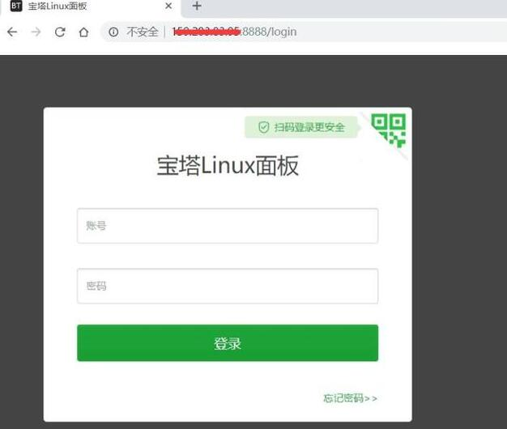

**5、安装常用的WEB服务组件。**

登录成功岳我们可以看到如下界面：


这里面只有Nginx是必须要安装的，如果你使用的是Mysql数据库，那么Mysql也勾选上（留意Django3.0之后的版本不再支持Mysql5.5版本），其它的你可以根据自己的需求来决定是否安装。后面如果想安装其它的，也可以在软件管理里安装。留意：软件名后面的三角符号点击它可以选择软件的版本。新手建议默认即可。选择好之后，点击一键安装。然后继续喝茶做等。

**6、安装Python项目管理插件**

这个安装成功之后，我们在左边的‘软件商店’里选择‘宝塔插件’，找到‘Python项目管理’这个插件进行安装。


(注意：最新的宝塔版本已经更新，安装项目管理器的时候会让你选择安装的版本，建议选1.9的。)

**7、安装项目所需要的Python版本。**

安装成功之后，我们点击设置。

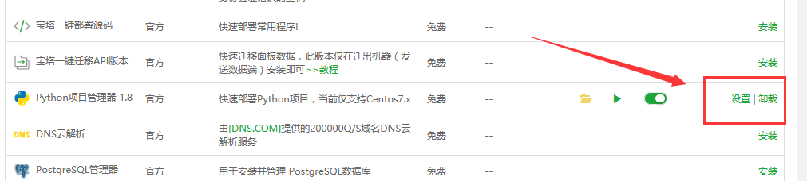

然后出现如下界面：


我们在版本管理里安装我们需要的Python版本。这里我以3.7.2为例，选择了国内的节点，国内节点安装会快一些。等一会就会安装成功。

**8、添加项目站点**


域名处填写自己的域名即可，没有域名填写服务器IP地址。

**9、上传Django项目源码。**

留意：在打包项目源码之前，先在本地环境使用下面的命令把环境依赖包导出到requirements.txt文件里，并把这个文件存放在项目目录下，这一步奏非常重要，请务必记得操作。

导出命令：

```
pip freeze > requirements.txt
```

这一步操作好之后，我们就通过下面的步骤把项目源码上传上到服务器上去。


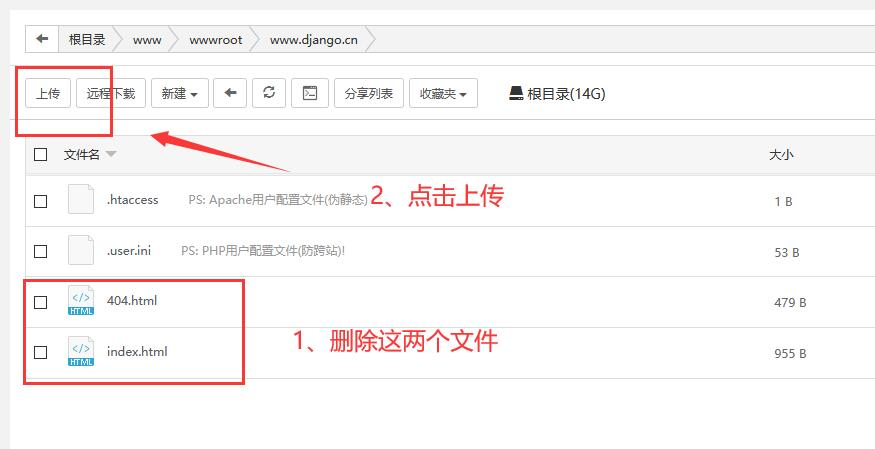

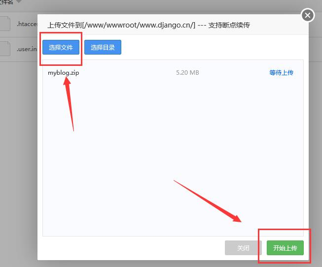

解压项目


解压成功之后，就像下面那样。留意路径，记得源码一定要解压到根目录里。然后再检查一下，项目里有没有requirements.txt这个文件。


**10、添加uwsgi配置文件uwsgi.ini**

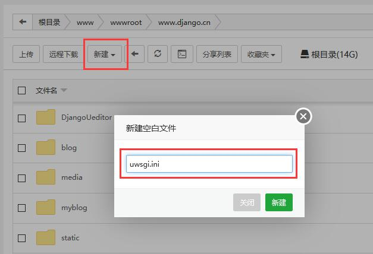

留意：新建一个空白文件，文件名为uwsgi.ini。新建成功之后输入如下代码，然后保存：

```
#添加配置选择
[uwsgi]
#配置和nginx连接的socket连接
socket=127.0.0.1:8997
#配置项目路径，项目的所在目录
chdir=/www/wwwroot/www.django.cn/
#配置wsgi接口模块文件路径,也就是wsgi.py这个文件所在的目录
wsgi-file=myblog/wsgi.py
#配置启动的进程数
processes=4
#配置每个进程的线程数
threads=2
#配置启动管理主进程
master=True
#配置存放主进程的进程号文件
pidfile=uwsgi.pid
#配置dump日志记录
daemonize=uwsgi.log
#虚拟环境路径(可选)
virtualenv=/www/wwwroot/www.django.cn/venv
```

这里面，我们最需要留意的是项目路径和wsgi.py所在的目录。

***\*11、修改网站配置\**
**

左侧网站，然后点击网站名，在弹出的窗口里找到'配置文件'，然后配置文件里输入如下代码：

```
    location / {
       include uwsgi_params;
       uwsgi_pass 127.0.0.1:8997;  #端口要和uwsgi里配置的一样
       uwsgi_param UWSGI_SCRIPT myblog.wsgi;  #wsgi.py所在的目录名+.wsgi
       uwsgi_param UWSGI_CHDIR /www/wwwroot/www.django.cn/; #项目路径
    }
      location /static/ {
      alias /www/wwwroot/www.django.cn/static/; #静态资源路径
      }
```

里面的端口、路径都要和uwsgi.ini里的一致。


**12、Python项目管理插件里添加项目**

在左右的软件商店里找到Python项目管理插件，然后点击设置，添加项目。里面的各种选项很简单，按实际情况填写就行。

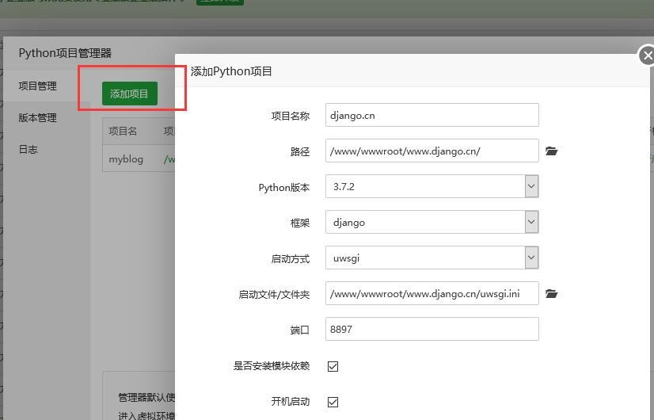

值得说的就是那个端口，端口要和uwsgi.ini里面的那个端口一致。如果有多个项目的话，不同的项目要填写不同的端口。端口随便填写，只要不与其它常用软件端口冲突就好。

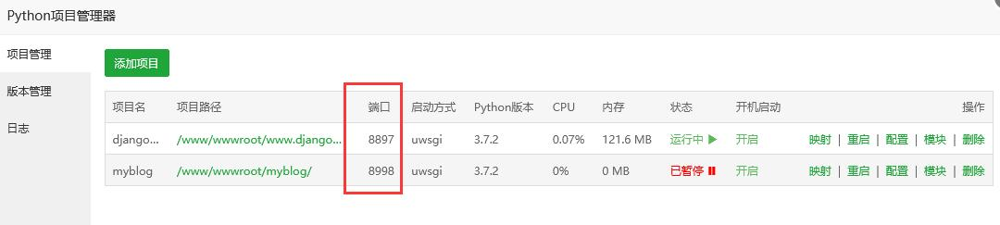

**留意：**

使用Python项目管理插件新建项目成功之后，会自动在项目j源码目录里创建一个虚拟环境，虚拟环境目录一般都是以xxxxxxx_venv形式命名的。

进入虚拟环境方法：

```
#1.9版本的:
source /www/wwwroot/www.django.cn/myblog_venv/bin/activate


#2.0版本的
/www/wwwroot/www.django.cn/d69daf27a976191fa87ff9_venv/bin/python3 manage.py makemigrations
/www/wwwroot/www.django.cn/d69daf169413721fa87ff9_venv/bin/python3 manage.py  migrate
/www/wwwroot/www.django.cn/d69daf169413721fa87ff9_venv/bin/python3 manage.py  runserver
```

项目管理器默认使用pip安装项目根目录requirements.txt内的模块，这也是之前我强调把环境依赖包文件放到项目目录下的原因，如有其他模块需要安装请手动进入虚拟环境安装。

以上配置完成之后，基本已经部署完毕。我们在浏览器里访问我们的域名，就能查看到网站。

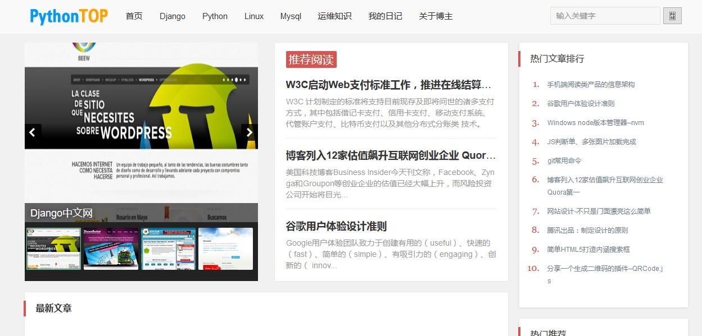

**14、解决管理后台样式丢失**

如果后台样式丢失了，如图：


解决办法：

在宝塔面板里，点击网站路径进入项目路径下，找到settins.py文件，我们在末尾处添加静态资源收集路径

```
#把APP静态资源收集到指定的目录下，这里我收集到static目录下
STATIC_ROOT  = os.path.join(BASE_DIR, 'static')
```

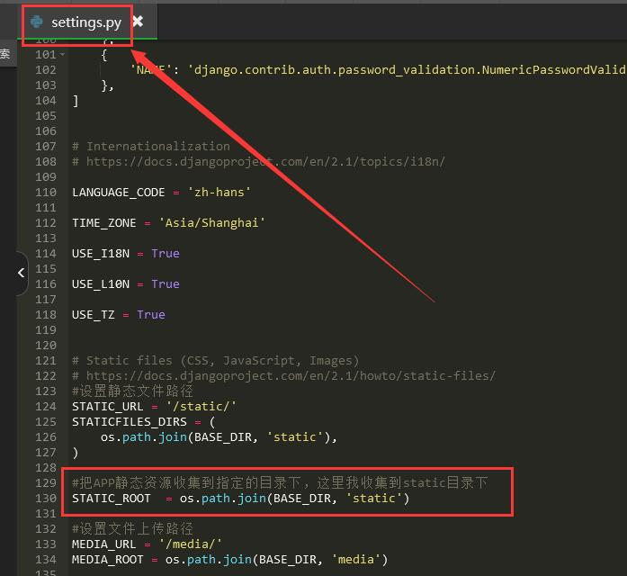

之后在SSH终端进入项目虚拟环境：

```
source /www/wwwroot/myblog/myblog_venv/bin/activate
```

成功进入虚拟环境会出现如下标记：

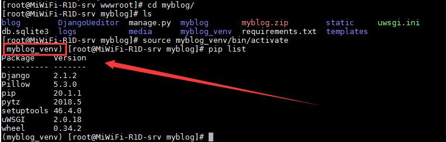

出现项目名_venv这个标记，才说明已经成功进入虚拟环境。

然后我们使用下面的命令收集静态文件：

```
python manage.py collectstatic
```

如下图:

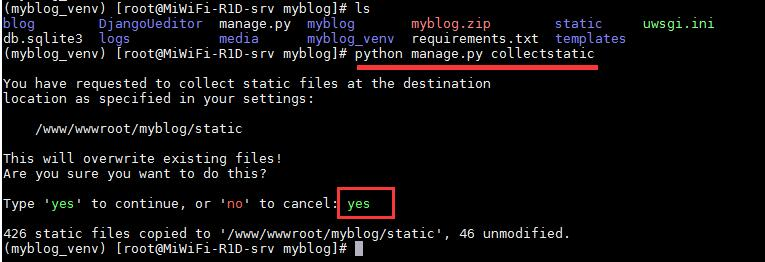

收集成功之后，刷新后台页面，样式就恢复正常。

至此教程结束。

**问题整理：**

1、访问显示出现 Internal Server Error 之类的错误的话，可能是程序不能正常运行的原因。请进入虚拟环境下，使用python manage.py runserver 命令运行项目，看项目能不能正常运行，不能正常运行就按错误提示进行解决就好。程序能正常运行使用项目管理器重启一下项目就能正常访问。

2、如果出现：Django运行提示:SQLite 3.8.3 or later is required (found 3.7.17) 这样的错误，请按这篇文章操作。https://www.django.cn/forum/forum-21090.html

3、如果在第十二步建立项目时提现出错，请把“是否安装模块依赖”这个选项去掉，等项目建立完成之后再进入虚拟环境手动安装依赖模块。（错误提示类似帖子后面留言处。）


### [CentOS7下部署Django项目详细操作步骤](https://www.django.cn/article/show-4.html)

### [Windows server iis部署Django详细操作](https://www.django.cn/article/show-21.html)

### [Ubuntu部署Django项目方法详解](https://www.django.cn/article/show-22.html)


### [使用宝塔面板快速部署Django项目（新手建议直接使用这种方法）](https://www.django.cn/article/show-30.html)

在部署的过程中，如果发现其它问题，可以文章后面留言，方便我收集错误和更新处理方法。


-16947612810458-169527888364024.jpg)

