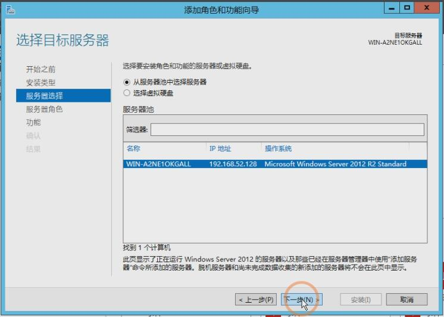
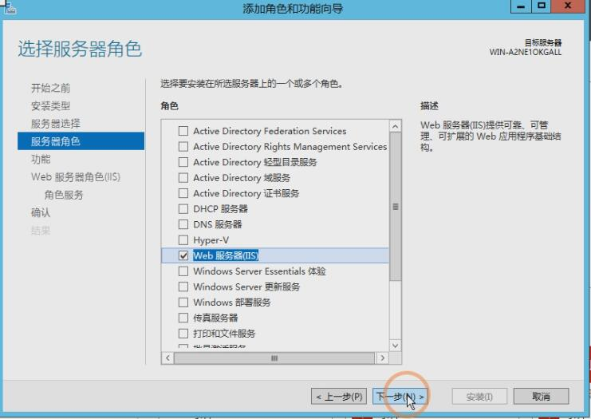
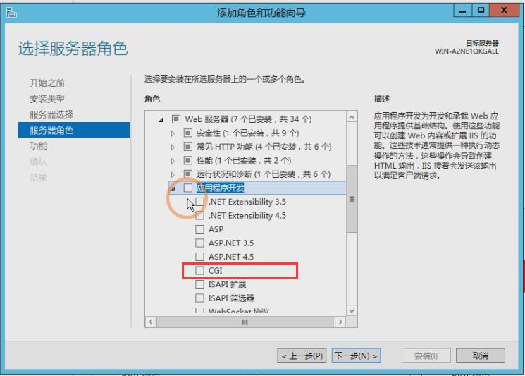
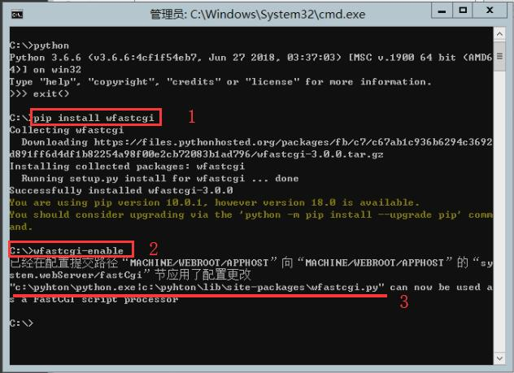
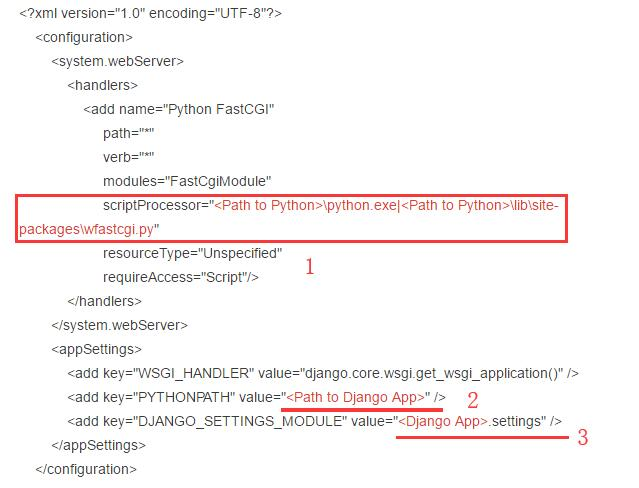
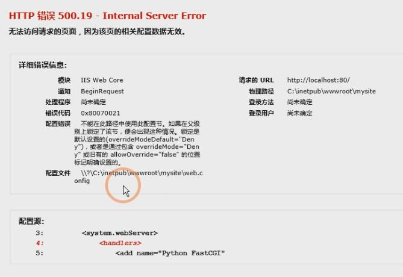
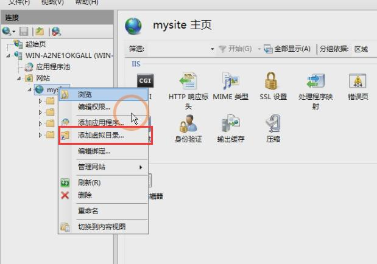

# Day86  部署项目——Windows server iis部署Django详细操作

# Windows server iis部署Django详细操作

2018年10月19日 

点击次数：48614

教程基于Windows server2012+Python3.6+IIS之上部署django的，同样适用于server2012之上的版本服务器和windows7以上的windows操作系统。

**提示：**Python不要安装在windows用户目录下，项目也不要放在windows用户目录下，这样就能避免出很多问题。

如果觉得看文字没意思，想看视频教程的，请点击这里：[Django项目部署视频教程](https://mp.weixin.qq.com/s/vF8yC0WUM9B0PmsQSMutiQ)

**1、安装IIS和CGI**

打开服务器管理器，选择添加角色和功能，选择要添加的服务器角色（**WEB服务器IIS**），然后安装







IIS安装成功之后，然后安装CGI，再次选择**添加角色和功能**，找到之前安装的**WEB服务器IIS**，点击它。


在展开的选项里找到**WEB服务器**，点击它，找到**应用程序开发**点击在展开的列表里找到**CGI**，勾选，然后下一步，安装它。




安装好CGI之后，我们在浏览器里输入http://127.0.0.1 访问IIS，如果出现如下页面，说明IIS安装成功。


**2、安装Python3**

在C盘建立python目录，然后从Python官网下载Windows版本的64位的Python安装包，并安装它。具体可以参考文章：[python3安装详细步骤](https://www.django.cn/article/show-20.html)

***\*3、安装wfastcgi\****

在Windows下，我们没法使用uwsgi，但我们可以使用wfastcgi替代它，打开CMD窗口，输入命令安装wfastcgi：

```
pip install wfastcgi
```

安装成功之后，通过下面命令启动它：

```
wfastcgi-enable
```



如上图，启动成功之后，它会把Python路径和wfastcgi的路径显示出来，我们需要把这个路径复制出来，保存好，后边用得着。

```
c:\python\python.exe|c:\python\lib\site-packages\wfastcgi.py
```

注意：上面的路径，是由Python解释器的路径和“|”以及“wfastcgi.py”文件路径组成。

***\*4、在IIS里添加项目网站
\****


把我们本地项目源码上传到服务器相应的目录里。

留意：搬迁项目的时候我们先在本地换到项目路径下，用下面的命令把当前项目环境的软件包信息和依赖软件导出到requirements.txt文件里。

```
pip freeze > requirements.txt
```

然后把项目源码打包，上传到服务器的网站路径里，解压。

之后打开CMD切换到项目文件夹路径，输入下面命令，安装项目所需要依赖和软件包：

```
pip install -r requirements.txt
```


如果使用的是Mysql数据库，请自行安装Mysql和导入数据，这里就不详细介绍。


**注意：**项目所需要的库和依赖软件都安装完成之后，请先使用下面命令运行一下项目，确保源码能正常运行，之后再进行下一步。

```
python manage.py runserver
```


***\*5、在项目根目录里新建一个web.config配置文件，放入以下内容：\****

```
<?xml version="1.0" encoding="UTF-8"?>
    <configuration>
        <system.webServer>
            <handlers>
                <add name="Python FastCGI" 
                     path="*" 
                     verb="*" 
                     modules="FastCgiModule" 
                     scriptProcessor="<Path to Python>\python.exe|<Path to Python>\lib\site-packages\wfastcgi.py" 
                     resourceType="Unspecified" 
                     requireAccess="Script"/>
            </handlers>
        </system.webServer>
        <appSettings>
            <add key="WSGI_HANDLER" value="django.core.wsgi.get_wsgi_application()" />
            <add key="PYTHONPATH" value="<Path to Django App>" />
            <add key="DJANGO_SETTINGS_MODULE" value="<Django App>.settings" />
        </appSettings>
    </configuration>
```



留意：这里面我标记的三个地方，我们需要修改。

1、替换为我们之前我们启动wfastcgi时复制的python和wfastcgi的路径。

2、填写我们的项目路径。

3、填写settings.py的位置。<django App>修改成我们的settings.py所在目录的目录名即可。

修改完毕，启动IIS，在浏览器里输入http://127.0.0.1 就能访问网站。

**6、如果访问IIS出现如下错误：**



HTTP 错误 500.19 Internal Server Error

出现这样的情况是因为IIS7之后的版本都采用了更安全的 web.config 管理机制，默认情况下会锁住配置项不允许更改。我们把它解锁了就OK。

打开CMD，在里面依次输入下面两个命令：

```
%windir%\system32\inetsrv\appcmd unlock config -section:system.webServer/handlers 

%windir%\system32\inetsrv\appcmd unlock config -section:system.webServer/modules

#提示：如果使用上面的命令提示%windir%载入出错，请把%windir% 修改为 C:\windows

C:\windows\system32\inetsrv\appcmd unlock config -section:system.webServer/handlers 

C:\windows\system32\inetsrv\appcmd unlock config -section:system.webServer/modules
```


解除了锁定之后，再访问网站就能正常显示了。

还有种情况：有时候访问页面，或者单独访问网站后台出现400错误，这个时候可能是因为没有给网站权限的原因。我们打开IIS，找到网站，右键，编辑权限，给IIS用户添加修改和写入权限。就能正常访问。


**7、给静态资源添加虚拟目录
**

网站能访问了，但我们的前端样式显示有问题。那是因为我们没有在IIS里指定我们的静态资源目录，我们给它添加上虚拟目录就能解决。

步骤：

1、添加虚拟目录，在IIS找选中网站项目名，右键--添加虚拟路径




添加虚拟目录时，别名放与你settings里设置的一致，比如'static'，物理路径就是静态资源的实际目录。

2、在static目录里新建一个web.config文件，然后写入下面的内容：

```
<?xml version="1.0" encoding="UTF-8"?>
    <configuration>
      <system.webServer>
      <!-- this configuration overrides the FastCGI handler to let IIS serve the static files -->
      <handlers>
        <clear/>
   <add name="StaticFile" path="*" verb="*" modules="StaticFileModule" resourceType="File" requireAccess="Read" />
     </handlers>
   </system.webServer>
</configuration>
```

重启IIS，访问网站，前端就能正常显示。

**8、管理后台样式丢失解决
**

正常情况下，部署的时候管理后台样式是不能正常显示的，我们需要收集这些样式到项目里去，才能正常显示。

步骤：

1、在settings.py里添加STATIC_ROOT配置指定收集路径如：

```
#指定样式收集目录，路径一般为项目里的static文件夹
STATIC_ROOT  = os.path.join(BASE_DIR, 'static')
#或
STATIC_ROOT = 'C:\python\mysite\static'
```

然后CMD下运行如下面命令，进行样式采集：

```
python manage.py collectstatic
```

采集完成之后，刷新页面。后台样式成功显示。至此，部署结束。


**错误收集：**

1. 出现如下截图的错误大多是源码不能正常运行的原因，先在服务器项目目录里运行下面的命令，能运行再进行下一步，不能运行，请先检查源码。

```
python manage.py runserver
```


如果能正常运行项目，请检查一下Python安装路径，Python不要安装在某个用户的目录下，这样容易导致权限方面的问题。

更多关于其它服务器部署Django的，请查看下面的文章：

### 

### [CentOS7下部署Django项目详细操作步骤](https://www.django.cn/article/show-4.html)

### [Windows server iis部署Django详细操作](https://www.django.cn/article/show-21.html)

### [Ubuntu部署Django项目方法详解](https://www.django.cn/article/show-22.html)

### [使用宝塔面板快速部署Django项目（新手建议直接使用这种方法）](https://www.django.cn/article/show-30.html)

在部署的过程中，如果发现其它问题，可以文章后面留言，方便我收集错误和更新处理方法。