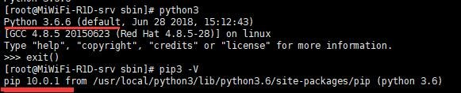
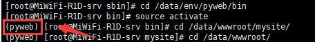
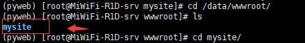
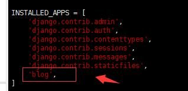
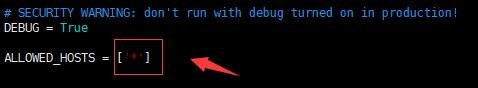
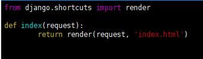

# Day 87  部署项目——CentOS7下部署Django项目详细操作步骤

[TOC]


# CentOS7下部署Django项目详细操作步骤


## **部署是基于：centos7+nginx+uwsgi+python3+django 之上做的**

软件版本详细介绍，纯净操作系统：Centos7.0 Python版本：python3.6 Django版本:django2.0.6
本文包括以下几个部分内容：

㈠、[服务器环境部署详细步骤](https://www.django.cn/article/show-4.html#buzhou)

㈡、[本地项目搬迁到服务器](https://www.django.cn/article/show-4.html#banqian)

㈢、[Django后台样式丢失解决办法](https://www.django.cn/article/show-4.html#yangsi)

㈣、[Django开启SSL证书（https域名）详细步骤](https://www.django.cn/article/show-4.html#ssl)

㈤、[Django多站点部署方法](https://www.django.cn/article/show-4.html#duo)

如果觉得看文字没意思，想看视频教程的，请点击这里：[Django项目部署视频教程](https://mp.weixin.qq.com/s/vF8yC0WUM9B0PmsQSMutiQ)

------

**详细步骤(下面步骤都是ROOT权限执行):**

**一、更新系统软件包**
yum update -y

**二、安装软件管理包和可能使用的依赖**

```
yum -y groupinstall "Development tools"
yum install openssl-devel bzip2-devel expat-devel gdbm-devel readline-devel sqlite-devel psmisc libffi-devel
```

**三、下载Pyhton3到/usr/local 目录
**

```
cd /usr/local
wget https://www.python.org/ftp/python/3.6.6/Python-3.6.6.tgz
```

解压

```
tar -zxvf Python-3.6.6.tgz
```

进入 Python-3.6.6路径

```
cd Python-3.6.6
```

编译安装到指定路径

```
./configure --prefix=/usr/local/python3
```

注意：/usr/local/python3 路径可以自己指定，自己记着就行，下边要用到。

安装python3

```
make
make install
```

安装完成之后 建立软链接 添加变量 方便在终端中直接使用python3

```
ln -s /usr/local/python3/bin/python3.6 /usr/bin/python3
```

Python3安装完成之后pip3也一块安装完成，不需要再单独安装
同样给pip3建立软链接

```
ln -s /usr/local/python3/bin/pip3.6 /usr/bin/pip3
```

**四、查看Python3和pip3安装情况**



**五、安装virtualenv ，建议大家都安装一个virtualenv，方便不同版本项目管理。**

```
pip3 install virtualenv
```

建立软链接

```
ln -s /usr/local/python3/bin/virtualenv /usr/bin/virtualenv
```

安装成功在根目录下建立两个文件夹，主要用于存放env和网站文件的。(个人习惯，其它人可根据自己的实际情况处理)

```
mkdir -p /data/env
mkdir -p /data/wwwroot
```

**六、切换到/data/env/下，创建指定版本的虚拟环境。**

```
virtualenv --python=/usr/bin/python3 pyweb
```

然后进入/data/env/pyweb/bin
启动虚拟环境：

```
source activate
```




留意我标记的位置，出现(pyweb)，说明是成功进入虚拟环境。

**七、虚拟环境里用pip3安django和uwsgi**

```
pip3 install django （如果用于生产的话，则需要指定安装和你项目相同的版本）
pip3 install uwsgi
```

**留意：****uwsgi要安装两次**，先在系统里安装一次，然后进入对应的虚拟环境安装一次。

给uwsgi建立软链接，方便使用

```
ln -s /usr/local/python3/bin/uwsgi /usr/bin/uwsgi
```


**注意：**如果是项目在本地，想部署到线上的，之后这几步可以不用看，建议跳转到：[本地项目搬迁到服务器](https://www.django.cn/article/show-4.html#banqian)

**八、切换到网站目录/data/wwwroot,创建Django项目**

```
django-admin.py startproject mysite
```

创建成功之后，/data/wwwroot下面就会多出一个mysite文件夹，我们的项目就在这个文件夹里。



然后新建立一个名叫blog的APP

```
python3 manage.py startapp blog
```

进入项目文件夹/data/wwwroot/mysite,添加static和templates，分别用于存放静态文件和模板文件。
编辑项目里mysite/settings.py文件

```
vim /data/wwwroot/mysite/mysite/settings.py
```


在INSTALLED_APPS 列表里添加'blog'，注意，后面要加上一个逗号','.




修改ALLOWED_HOSTS，['*']，可以让任何IP访问





TEMPLATES的DIRS里添加模板路径

```
os.path.join(BASE_DIR, 'templates')
```


尾部添加

```
STATICFILES_DIRS = (
    os.path.join(BASE_DIR,'static'),
    )
```


然后 :wq 保存

**九、在templates下添加index.html文件，输入下面内容。**
vim /data/wwwroot/mystie/templates/index.html

```
<!DOCTYPE html>
<html>
<head>
<meta charset="utf-8">
<title>我的网站</title>
</head>
<body>
<h1>欢迎光临我的网站！</h1>
</body>
</html>
```


**十、配置URL**

```
vim /data/wwwroot/mysite/mysite/urls.py

from blog import views  #导入views
urlpatterns = [
    ...
    path('', views.index), #添加这行
    ....
]
```


**十一、编辑blog APP下的views.py**

```
vim /data/wwwroot/mysite/blog/views.py

def index(request):
    return render(request, 'index.html')
```





**十二、启动项目**

```
python3 manage.py runserver
```


正常运行！

**十三、Django正常运行之后我们就开始配置一下uwsgi。**

配置uwsgi有多种方式,这里我向大家介绍两种,我们使用的时候只需要使用其中一个就行了.

**第一种:XML格式的配置文件**

我们网站项目路径是 /data/wwwroot/mysite/,在项目根目录下创建
mysite.xml文件，输入如下内容：

```
<uwsgi>    
   <socket>127.0.0.1:8997</socket> <!-- 内部端口，自定义 --> 
   <chdir>/data/wwwroot/mysite/</chdir> <!-- 项目路径 -->            
   <module>mysite.wsgi</module>  <!-- mysite为wsgi.py所在目录名--> 
   <processes>4</processes> <!-- 进程数 -->     
   <daemonize>uwsgi.log</daemonize> <!-- 日志文件 -->
</uwsgi>
```

保存
注意<module>里的mysite，为wsgi.py所在的目录名。

这种方式的配置,可以用下面的命令启动.

```
#启动uwsgl
uwsgi -x mysite.xml

#uwsgi有没有启动成功,可以用下面的命令查看
ps -ef|grep uwsgi
#如果想重启uwsgi,先使用下面的命令杀掉进程,再启动uwsgi
killall -9 uwsgi
```


**第二种:ini格式的配置文件**

在项目文件里创建 uwsgi.ini 文件,编辑文件 ，设置uwsgi属性

```
#添加配置选择
[uwsgi]
#配置和nginx连接的socket连接
socket=127.0.0.1:8997
#配置项目路径，项目的所在目录
chdir=/data/wwwroot/mysite/
#配置wsgi接口模块文件路径,也就是wsgi.py这个文件所在的目录名
wsgi-file=mysite/wsgi.py
#配置启动的进程数
processes=4
#配置每个进程的线程数
threads=2
#配置启动管理主进程
master=True
#配置存放主进程的进程号文件
pidfile=uwsgi.pid
#配置dump日志记录
daemonize=uwsgi.log`
```

通过下面的命令启动运行uwsgi

```
uwsgi  --ini  uwsgi.ini
```

显示 [uWSGI] getting INI configuration from uwsgi.ini 表明uwsgi运行成功

可能通过ps -ef|grep uwsgi  查看确认是否uwsgi启动.

ini配置文件其它相关命令:

```
#停止运行uwsgi，通过包含主进程编号的文件设置停止项目
uwsgi --stop uwsgi.pid

#重启uwsgi
uwsgi --reload uwsgi.pid
```


**十四、安装nginx和配置nginx.conf文件**
进入home目录，执行下面命令

```
cd /home/
wget http://nginx.org/download/nginx-1.13.7.tar.gz
```

下载完成后，执行解压命令：

```
tar -zxvf nginx-1.13.7.tar.gz
```

进入解压后的nginx-1.13.7文件夹，依次执行以下命令：

```
./configure
make
make install
```

nginx一般默认安装好的路径为/usr/local/nginx
在/usr/local/nginx/conf/中先备份一下nginx.conf文件，以防意外。

```
cp nginx.conf nginx.conf.bak
```

然后打开nginx.conf，把原来的内容删除，直接加入以下内容：

```
events {
    worker_connections  1024;
}
http {
    include       mime.types;
    default_type  application/octet-stream;
    sendfile        on;
    server {
        listen 80;
        server_name  www.django.cn; #改为自己的域名，没域名修改为127.0.0.1:80
        charset utf-8;
        location / {
           include uwsgi_params;
           uwsgi_pass 127.0.0.1:8997;  #端口要和uwsgi里配置的一样
           uwsgi_param UWSGI_SCRIPT mysite.wsgi;  #wsgi.py所在的目录名+.wsgi
           uwsgi_param UWSGI_CHDIR /data/wwwroot/mysite/; #项目路径
           
        }
        location /static/ {
        alias /data/wwwroot/mysite/static/; #静态资源路径
        }
    }
}
```

 要留意备注的地方，要和UWSGI配置文件mysite.xml，还有项目路径对应上。
进入/usr/local/nginx/sbin/目录
执行./nginx -t命令先检查配置文件是否有错，没有错就执行以下命令：

```
./nginx
```


终端没有任何提示就证明nginx启动成功。可以使用你的服务器地址查看，成功之后就会看到一个nginx欢迎页面。

之后，在settings.py里设置：

1、关闭DEBUG模式。

DEBUG = False 

2、ALLOWED_HOSTS设置为* 表示任何IP都可以访问网站。

ALLOWED_HOSTS = ['*']

**十五、访问项目的页面。**
进入网站项目目录

```
cd /data/wwwroot/mysite/
```

执行下面命令(xml配置文件为例)：

```
uwsgi -x mysite.xml
```

以上步骤都没有出错的话。
进入/usr/local/nginx/sbin/目录
执行：

```
./nginx -s reload
```

重启nginx 。
然后在浏览器里访问你的项目地址！


成功访问！
里面最值得留意的就是项目的路径不要弄错，还有，项目的所有操作都要在虚拟环境下进行。

环境部署部份，懒的话，直接复制我的代码直接部署就行。

------

**本地项目搬迁到服务器**

本地项目想要部署上线，可以参考下面的步骤：

1、备份本地数据库。使用sqlite数据库的话，直接打包数据库文件上传到服务器即可。使用Mysql数据库，要先在本地Mysql里备份导出数据，然后在服务器上安装Mysql数据库软件,把备份的数据导入，Mysql安装具体操作请看：

### [CentOS7操作系统下快速安装MySQL5.7](https://www.django.cn/article/show-2.html)

2、在项目目录下用下面的命令把当前的环境依赖包导出到requirements.txt文件

```
pip freeze > requirements.txt
```

3、把项目源码压缩打包。

4、把项目上传到服务器对应的目录里，解压。

5、创建新的虚拟环境（参照上面第六步）

6、进入虚拟环境然后进入项目路径安装requirements.txt里的依赖包。

```
pip3 install -r requirements.txt
```

7、导入数据库到服务器。（如果用的是Mysql的话）

默认使用的是SQLite数据库，就不用做此操作。数据库原来是SQLite的，想换成Mysql，请查看文章：[如何把SQLite数据库转换为Mysql数据库](https://www.django.cn/article/show-17.html)

如果是Mysql数据库的，则在命令行里输入：

```
#导出Mysql,django为你的数据库
mysqldump -uroot -ppassword django>django.sql
#把django.sql上传到服务器，在服务器里用下面命令导入
mysql -uroot -ppassword
use dajngo;
source your Path\django.sql
```

8、通过python3 manage.py runserver 运行一下项目，如果能正常启动则进行下一步，不能正常运行往上检查。

9、在项目根目录里添加uwsgi配置文件（参照上面第十三步）

10、配置Nginx配置文件。（参考上面第十四步）

**留意：**一定要注意Uwsgi和Nginx配置文件里的项目路径和静态资源路径，填写正确了才能成功访问。不然会出现502错误。还有就是，修改Django文件和其它配置文件之后，一定要重启Uwsgi和Nginx，不然不生效。

Uwsgi和Nginx重启方法：

```
#查看Uwsgi进程
ps -ef|grep uwsgi 
#用kill方法把uwsgi进程杀死，然后启动uwsgi
killall -9 uwsgi
#启动方法
uwsgi -x mysite.xml

#Nginx平滑重启方法
/usr/local/nginx/sbin/nginx -s reload
```

然后在浏览器里访问服务器地址（域名），就能查看到项目。

如果想使用域名访问项目，先在域名管理后台把域名解析到服务器IP上来，之后在Nginx配置文件里绑定域名。然后在浏览器里通过绑定的域名访问项目。

------

**关于线上部署admin后台样式没有生效的问题：**

**方法一：**

1、在settings.py尾部：

```
STATIC_ROOT  = os.path.join(BASE_DIR, 'static')#指定样式收集目录
#或
STATIC_ROOT = '/www/mysite/mysite/static'  #指定样式收集目录
```

2、收集CSS样式，在终端输入：

```
python manage.py collectstatic
```

运行这个命令之后，就会自动把后台CSS样式收集到/static/目录下。刷新页面就能恢复样式！

**方法二：**

在Python安装目录下（如果使用虚拟环境，则在虚拟环境目录下）找到\Lib\site-packages\django\contrib\admin\templates目录，把里面的admin目录复制到指定目录即可。

注意：收集或复制前一定先在settings里配置并指定STATIC_ROOT路径，static/ 个目录可以自己定。指定的时候一定要在settings.py和nginx里指定新的路径。不然无法生效。

------

**Django启用SSL证书(https域名)**

群里好多朋友都需要使用SSL证书，在使用我这个部署教程的基础上部署SSL证书，总是遇到不少坑。在这，我在这补充一下安装SSL证书的方法，供大家参考。

1、进入之前我们下载nginx的源码目录

```
cd /home/nginx-1.13.7/
```

2、安装PCRE库

```
yum -y install pcre
```

3、安装SSL

```
yum -y install openssl openssl-devel
```

4、依次执行下面两行代码重新编译一下

```
./configure

./configure --with-http_ssl_module
```

5、执行make

```
make
```

注意：是make而不是make install

6、备份原来的nginx

```
cp /usr/local/nginx/sbin/nginx /usr/local/nginx/sbin/nginx.bak
```

7、将新的 nginx 覆盖旧安装目录

```
cp objs/nginx /usr/local/nginx/sbin/nginx
```

如果报错，刚用执行下面的命令覆盖

```
cp -rfp objs/nginx /usr/local/nginx/sbin/nginx
```

8、免费证书下载后有两个文件。（以阿里云免费证书为例）一个是扩展名为.pem的文件，一个是扩展名为.key的文件。.pem文件中已经包含服务器证书和CA中间证书，第一段为服务器证书，第二段为CA中间证书，您可以使用文本编辑器自行提取。.key文件是证书私钥。这里我们直接把域名证书复制到网站根目录里去就行。

9、配置nginx.conf文件。

```
events {
    worker_connections  1024;
}
http {
    include       mime.types;
    default_type  application/octet-stream;
    sendfile        on;
    server {
        listen 443 ssl http2;
        server_name www.django.cn django.cn;
        root /data/wwwroot/mysite;#项目路径
        charset utf-8;
        ssl_certificate    /data/wwwroot/mysite/1_www.django.cn.pem;#.pem证书路径
        ssl_certificate_key  /data/wwwroot/mysite/2_www.django.cn.key;#.key证书路径
        ssl_protocols TLSv1 TLSv1.1 TLSv1.2;
        ssl_ciphers ECDHE-RSA-AES128-GCM-SHA256:HIGH:!aNULL:!MD5:!RC4:!DHE;
        ssl_prefer_server_ciphers on;
        ssl_session_cache shared:SSL:10m;
        ssl_session_timeout 10m;
        error_page 497  https://$host$request_uri;
        location / {
           include uwsgi_params;
           uwsgi_pass 127.0.0.1:8997;
           uwsgi_param UWSGI_SCRIPT wechatProject.wsgi;
           uwsgi_param UWSGI_CHDIR /data/wwwroot/mysite/;#项目路径
           
        }
        location /static/ {
        alias /data/wwwroot/mysite/static/; #静态资源路径
        }
        access_log  /data/wwwroot/mysite/www.django.cn.log;
        error_log  /data/wwwroot/mysite/www.django.cn.error.log;
    }
}
```

留意证书的路径，我们主要是把原来的80端口，修改成443，然后再加一些SSL证书配置，大家可以和前面的nginx的配置进行对比一下。

10、测试配置文件是否正确

```
/usr/local/nginx/sbin/nginx -t
```

如果没有报错则重启nginx即可。

```
/usr/local/nginx/sbin/nginx -s reload
```

**留意：**使用https时，要开启服务器的443端口，如果开启了服务器还不能访问，可能需要到服务器提供商后台安全组给端口放行。

------

**Django多站点部署**

有的时候我们一台服务器需要部署多个项目，那么我们应该怎么部署呢？

1、进入Nginx的配置文件目录/usr/local/nginx/conf/，然后新建一个目录：

```
mkdir vhost
```

之后在vhost目录里建立两个以.conf结尾的文件（有几个项目就放几个），里面的内容如下：

```
server {
    listen       80;
    server_name  www.django.cn;
    charset utf-8;
    location / {
        include uwsgi_params;
        uwsgi_pass 127.0.0.1:8997;  #端口要和uwsgi里配置的一样           
        uwsgi_param UWSGI_SCRIPT mysite.wsgi;  #wsgi.py所在的目录名+.wsgi           
        uwsgi_param UWSGI_CHDIR /data/wwwroot/mysite/; #项目路径           
        }
    location /static/ {
        alias /data/wwwroot/mysite/static/; #静态资源路径       
        }
    }
```

项目路径、端口、静态资源与所属项目对应好。**注意：**项目里的uwsgi端口不能与另一个项目重复。

2、/usr/local/nginx/conf/目录下的原来默认的nginx.conf文件，先备份一下，然后把里面的代码删除，修改成如下代码：

```
events {
    worker_connections  1024;
}
http {
    include       mime.types;
    default_type  application/octet-stream;
    sendfile        on;
    include /usr/local/nginx/conf/vhost/*.conf;#主要是这个地方，把新建的两配置文件包含进来
    server {
        listen 80 default_server;
        server_name _;
        return 404;
        }
    }
```

3、新建立一个虚拟环境，把新项目上传到到服务器。进入虚拟环境，在新的虚拟环境再装一次uwsgi，和安装项目所需依赖包，然后在项目根目录新建立一个uwsgi配置文件，里面的端口和配置文件名不要和其它项目相同，路径换成自己的项目路径。

4、在虚拟环境启动uwsgi，重启Nginx，就能成功访问。哪个项目不能访问，就把原来的uwsgi进行杀死，然后再进入对应虚拟环境，启动uwsgi即可。

------

**关于CentOS防火墙端口打开的方法：**

有些服务器外网默认是无法访问的，因为防火墙不允许，所以要开启防火墙，让其可以访问需要访问的端口号。

1、运行命令：

```
firewall-cmd --get-active-zones
```

运行完成之后，可以看到zone名称。

2、执行下面命令打开需要打开的端口，以80端口为例

```
firewall-cmd --zone=public --add-port=80/tcp --permanent
```

3、重启防火墙

```
firewall-cmd --reload
```

4、查看端口号是否开启

```
firewall-cmd --query-port=80/tcp
```

有些服务器在防火墙里开启端口之后还不能访问，那就需要到对应的服务器提供商的管理后台安全组里开启对应的端口才能正常访问。

如果还有其它疑问，大家可以在文章后面留言，也可以加QQ群10218442讨论。本教程会持续更新！

更多关于其它服务器部署Django的，请查看下面的文章：

### 

### [CentOS7下部署Django项目详细操作步骤](https://www.django.cn/article/show-4.html)

### [Windows server iis部署Django详细操作](https://www.django.cn/article/show-21.html)

### [Ubuntu部署Django项目方法详解](https://www.django.cn/article/show-22.html)

### [使用宝塔面板快速部署Django项目（新手建议直接使用这种方法）](https://www.django.cn/article/show-30.html)

在部署的过程中，如果发现其它问题，可以文章后面留言，方便我收集错误和更新处理方法。理方法。


-16947612810458-169527896486526.jpg)

