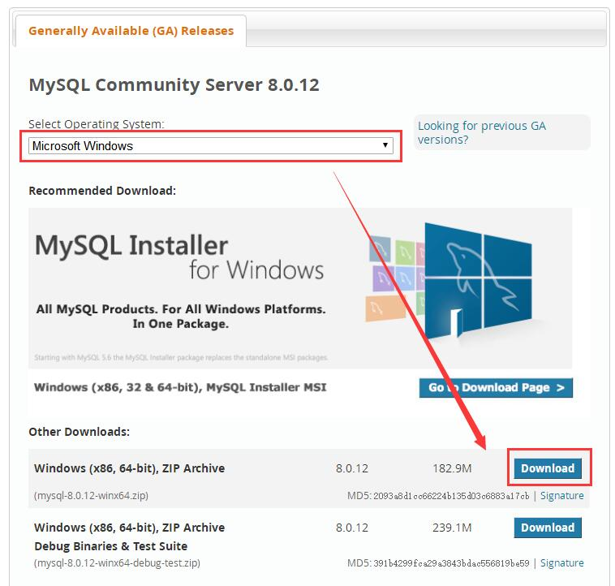

# Day88  部署项目——Django如何把SQLite数据库转换为Mysql数据库

# Django如何把SQLite数据库转换为Mysql数据库

2018年09月12日 

点击次数：24310

大部分新手刚学Django开发的时候默认用的都是SQLite数据库，上线部署的时候，大多用的却是Mysql。那么我们应该如何把数据库从SQLite迁移转换成Mysql呢？

首先我们先安装Mysql，如果已经安装了，请直接查看：[把SQLite数据导入到MySQL中](https://www.django.cn/article/show-17.html#ssl)

**一、下载Mysql8.0**

点击[ Download MySQL Community Server](https://dev.mysql.com/downloads/mysql/)页面下载Mysql8.0，大家看我的截图标示。我下载的是最新版本8.0的。



**二、安装Mysql**

在C盘建立一个mysql文件夹，然后把下载下载的压缩包解压到mysql目录里去。里面会多出一个mysql-8.0.12-winx64目录，打开它，如下图片所示：


**三、配置Mysql**

我们在C盘创建一个目录mysqldata，用来放我们的Mysql数据，这个目录建议不要放到Mysql安装目录，以免哪天误删，单独放到另一个目录，方便以后备份(仅是个人习惯)。然后打开目录：C:\mysql\mysql-8.0.12-winx64，在这个目录里新建一个叫my.ini的文件，然后在里面输入如下内容：

```
[mysqld] 
# 设置mysql的安装目录，也就是刚才我们安装的目录
basedir=C:/mysql/mysql-8.0.12-winx64
# 设置mysql数据库的数据的存放目录，刚才创建的mysqldata目录
datadir=C:/mysqldata
# 设置默认使用的端口
port=3306
# 允许最大连接数
max_connections=200
# 允许连接失败的次数。这是为了防止有人试图攻击数据库
max_connect_errors=10
# 服务端使用的字符集
character-set-server=utf8mb4
# 数据库字符集对应一些排序等规则使用的字符集
collation-server=utf8mb4_general_ci
# 创建新表时将使用的默认存储引擎
default-storage-engine=INNODB
# 默认使用“mysql_native_password”插件作为认证加密方式
# MySQL8.0默认认证加密方式为caching_sha2_password
default_authentication_plugin=mysql_native_password
 
[mysql]
# 设置mysql客户端默认字符集
default-character-set=utf8mb4
 
[client]
default-character-set=utf8mb4
port=3306
```

**提示：**

1、复制目录路径的时候，要把里面的"\"修改成“/”.

2、默认加密方式default_authentication_plugin设置为mysql_native_password，新版本和老版本加密方式不一样，这样设置主要是为了兼容老版本。

**四、把Mysql添加到环境变量，方便使用。**

添加环境变量的目的主要是方便使用，我们可以直接在CDM命令行里输入Mysql命令。

**步骤：**

打开Mysql的目录下的bin目录，也就是C:\mysql\mysql-8.0.12-winx64\bin，复制它。然后返回桌面，单击"我的电脑"--右键“属性”--点击“高级系统设置”--找到“环境变量”：


点击“环境变量”，在打开出来的新窗口里的系统变量里找到"Path"，双击它：


**五、初始化Mysql，并设置密码。**

在文件夹的地址栏里输入“CMD”,或者使用快捷键“win+R”，输入cmd再回车，即可打开cmd。在里面输入如下命令进行Mysql初始化：

```
mysqld --initialize-insecure --user=mysql --console
```

执行初始化命令成功之后，再执行下面的命令，安装mysql服务：

```
mysqld --install
```

安装服务成功之后，输入下面命令启动服务：

```
net start mysql
```

这样，mysql服务就启动了。然后我们给Mysql设置一个密码：

```
mysql -u root -p
```

-u root 是指定root用户登录，-p 是要求输入密码。刚刚初始化创建的密码为空，要求输入密码的时候，直接回车即可。成功登录进去，即可看到如下界面：


输入如下SQL语句，修改root用户的密码：

```
alter user 'root'@'localhost' identified by '想要设置的密码';
```

如果想新建立一个用户和数据库，然后给这个用户和数据啼设置单独的管理权限和密码，可依次输入下面的命令：

```
CREATE DATABASE 你的数据库名 DEFAULT CHARSET=utf8 DEFAULT COLLATE utf8_unicode_ci;
#创建新的数据啼 django 为你的数据库名 并设置数据库编码
CREATE USER '你的用户名'@'localhost' IDENTIFIED BY '你的密码';
#创建新的用户
GRANT ALL PRIVILEGES ON 你的数据库名.* TO '你的用户名'@'localhost';
#把刚刚创建的数据库的管理权限给予刚刚创建的MySQL用户
FLUSH PRIVILEGES;
#刷新权限，使用设置生效
```


如何在Django中使用Mysql，和配置settings，我这里就不多说，不明白的可以查看下面的链接。

[Django中如何使用Mysql数据库](https://www.django.cn/forum/forum-6.html)
[Django全局配置settings.py详解](https://www.django.cn/course/show-10.html)


**六、把SQLite数据导入到MySQL中**

之前我们默认使用的是SQLite数据库，我们开发完成之后，里面有许多数据。如果我们想转换成Mysql数据库，那我们先得把旧数据从SQLite导出，然后再导入到新的Mysql数据库里去。

1、SQLite导出数据

导出之前，我们先确保settins.py数据库配置选项那里，还是使用的是SQLite配置，如果已经修改了，请先修改回来：

```
DATABASES = {
    'default': {
        'ENGINE': 'django.db.backends.sqlite3',
        'NAME': os.path.join(BASE_DIR, 'db.sqlite3'),
    }
}
```

然后在CMD命令行里输入：

```
python manage.py dumpdata > data.json
```

这样就将数据导出到Django项目根目录下的data.json文件。

2、MySQL导入数据
同样，先将Django的数据库配置改为MySQL的：

```
DATABASES = {
    'default': {
        'ENGINE': 'django.db.backends.mysql',
        'NAME': '你的数据库名',
        'USER': '你的MySQL用户名',
        'PASSWORD': '你的密码',
        'HOST': 'localhost',
        'PORT': '3306',
    }
}
```

然后在CMD命令行里输入：

```
python manage.py loaddata data.json
```

**注意：**

确保Mysql用户表里为空的，如果之前有迁移过数据到Mysql，有可能会出错。注意出错的时候所报的错误信息。如果提示有重复主键，那需要先删掉数据。这些数据是在给MySQL数据库应用迁移文件的时候产生的，一般是content_type相关的表。

进入到MySQL，执行如下的SQL语句：

```
use 你的数据库名;
delete from auth_permission;
delete from django_content_type;
```

删除数据之后，再执行一次导入命令即可。基本上，导入不了数据都是MySQL存在数据导致的。

**七、加载时区表**

另外，有可能所安装的MySQL没有加载时区表。这个可能会导致filter对日期的查询有问题。[Django官方文档](https://docs.djangoproject.com/en/2.0/ref/databases/#time-zone-definitions)也指出这个问题。MySQL官网也有对应处理方法：[加载时区表](https://dev.mysql.com/doc/refman/8.0/en/mysql-tzinfo-to-sql.html)。

Linux/Mac解决方法都很简单。windows系统要先下载一个sql文件：[timezone_2018e_posix_sql.zip](https://downloads.mysql.com/general/timezone_2018e_posix_sql.zip)。

下载完成之后，解压得到一个sql文件，再执行cmd命令导入该文件即可：

```
mysql -u root -p mysql < timezone_posix.sql
```

**八、MySQL数据到PostgreSQL**

操作很简单：

```
 ./manage.py dumpdata >> backup.json
```

到PostgreSQL对应的配置中：

```
    ./manage.py loaddata backup.json
```