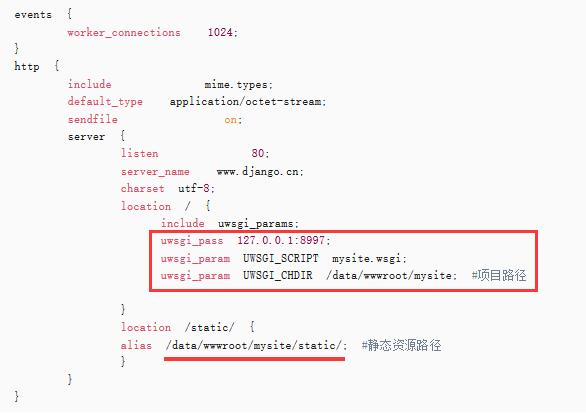

# Day89  部署项目——Ubuntu部署Django项目方法详解

2018年10月25日 

点击次数：38556

教程使用的软件版本：Ubuntu 18.04.1 LTS，django2.0，Python 3.6.5、nginx-1.13.7、uWSGI (2.0.17.1)，Ubuntu是纯净的，全新的。下面我们开始来部署。

如果觉得看文字没意思，想看视频教程的，请点击这里：[Django项目部署视频教程](https://mp.weixin.qq.com/s/vF8yC0WUM9B0PmsQSMutiQ)

**一、更新操作系统和安装依赖包**

```
#更新操作系统软件库
sudo apt-get update
sudo apt-get upgrade

#安装上传rz、下载sz工具
sudo apt-get install lrzsz

#安装gcc g++的依赖库
sudo apt-get install build-essential
sudo apt-get install libtool

#安装 pcre依赖库
sudo apt-get install libpcre3 libpcre3-dev

#安装 pcre依赖库
sudo apt-get install zlib1g-dev

#安装 ssl依赖库
sudo apt-get install openssl
```

**二、安装Python3和PIP3
**

```
sudo apt install python3
sudo apt install python3-pip
```

**三、建立两个文件夹，用于存放virtualenv环境和项目**

```
#放虚拟环境的
sudo mkdir -p /data/env

#放项目的
sudo mkdir -p /data/wwwroot
```

**四、安装virtualenv**

```
sudo pip3 install virtualenv
```

进入env目录

```
cd /data/env
```

指定Python版本，创建名为pyweb的虚拟环境，

```
sudo virtualenv -p /usr/bin/python3 pyweb
```

指定Python版本的时候，如果不知道Python3的路径，可以使用下面的命令查看

```
which python
```

**五、启动虚拟环境**

```
#启动虚拟环境
source /data/env/pyweb/bin/activate
```

**六、上传项目并安装依赖软件库\**(虚拟环境下)\****

把我们开发好的项目上传到 /data/wwwroot/目录，然后进入该目录，先安装项目所需要的依赖包，然后启动项目，测试是否能正常启动。**
**

我这里给大家一个测试项目，大家可以用来测试，帐号和密码分别为：admin qq445813。[**mysite.zip**](https://www.django.cn/media/upfile/mysite_20180730000348_536.zip)

```
sudo pip3 install -r requirements.txt
python3 manage.py runserver
```

如果能正常启动，说明项目没啥问题。

**七、安装uwsgi**

```
sudo pip3 install uwsgi
```

**留意：****uwsgi要安装两次**，先在系统里安装一次，然后进入对应的虚拟环境安装一次。

安装成功之后，我们进入项目根目录/data/wwwroot/mysite/新建一个 mysite.xml文件，在里面输入代码：

```
<uwsgi>    
   <socket>127.0.0.1:8997</socket><!-- 内部端口，自定义 --> 
   <chdir>/data/wwwroot/mysite/</chdir><!-- 项目路径 -->            
   <module>mysite.wsgi</module> 
   <processes>4</processes> <!-- 进程数 -->     
   <daemonize>uwsgi.log</daemonize><!-- 日志文件 -->
</uwsgi>
```

要留意里面的项目路径和.wsgi那里填写方法，你找到wsgi.py这个文件所在的目录，然后填写目录名+.wsgi即可。

**八、安装nginx，并配置
**

/usr/local 目录执行下面命令下载nginx源码：

```
wget http://nginx.org/download/nginx-1.13.7.tar.gz
```

然后解压它：

```
tar -zxvf nginx-1.13.7.tar.gz
```

cd 进入解压后的nginx-1.13.7文件夹，依次执行以下命令：

```
sudo ./configure 
sudo make 
sudo make install
```

nginx一般默认安装好的路径为/usr/local/nginx

进入/usr/local/nginx/conf/目录，然后备份一下nginx.conf文件，以防意外。

```
sudo cp nginx.conf nginx.conf.bak
```

然后打开nginx.conf文件，把里面的内容全部删除，输入下面代码：

```
events {
    worker_connections  1024;
}
http {
    include       mime.types;
    default_type  application/octet-stream;
    sendfile        on;
    server {
        listen       80;
        server_name  www.django.cn;
        charset utf-8;
        location / {
           include uwsgi_params;
           uwsgi_pass 127.0.0.1:8997;
           uwsgi_param UWSGI_SCRIPT mysite.wsgi;
           uwsgi_param UWSGI_CHDIR /data/wwwroot/mysite/; #项目路径
           
        }
        location /static/ {
        alias /data/wwwroot/mysite/static/; #静态资源路径
        }
    }
}
```

需要留意的是，下图长方形里我标记的代码要和UWSGI配置文件mysite.xml一致，否则会出错。



至于静态资源路径，自己settings.py里怎么设置，你就按那个设置就好。

进入/usr/local/nginx/sbin/目录

执行下面命令先检查配置文件是否有错：

```
./nginx -t
```

没有错就执行以下命令：

```
./nginx
```

终端没有任何提示就证明nginx启动成功。

之后进入网站项目目录

```
cd /data/wwwroot/mysite/
```

执行下面命令(虚拟环境下)：

```
uwsgi -x mysite.xml
```

以上步骤都没有出错的话。

进入/usr/local/nginx/sbin/目录

执行：

```
./nginx -s reload
```

平滑重启nginx 。然后在浏览器里访问你的项目地址！这时项目就能成功访问。

关于后台样式丢失问题，解决方法和Centos解决方法一样，我就不在这里重复。

更多关于其它服务器部署Django的，请查看下面的文章：

### 

### [CentOS7下部署Django项目详细操作步骤](https://www.django.cn/article/show-4.html)

### [Windows server iis部署Django详细操作](https://www.django.cn/article/show-21.html)

### [Ubuntu部署Django项目方法详解](https://www.django.cn/article/show-22.html)

### [使用宝塔面板快速部署Django项目（新手建议直接使用这种方法）](https://www.django.cn/article/show-30.html)

在部署的过程中，如果发现其它问题，可以文章后面留言，方便我收集错误和更新处理方法。