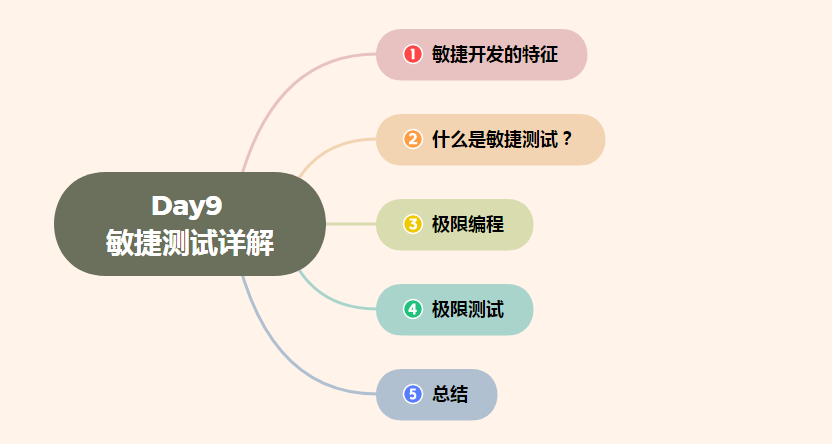

# Day9 敏捷测试——敏捷开发的特征、什么是敏捷测试？、极限编程、极限测试

[TOC]

# 敏捷开发的特征

敏捷开发的特征包括：

> 1、迭代式开发；

> 2、增量交付；

> 3、及时反馈；

> 4、持续集成；

> 5、自我管理。

迭代式开发是指整个开发过程被分为几个迭代周期，每个迭代周期是一个定长或不定长的时间块，持续的时间较短，通常为一到四周。

### 1、迭代式开发

整个开发过程被分为几个迭代周期，每个迭代周期是一个定长或不定长的时间块，持续的时间较短，通常为一到四周。

### 2、增量交付

产品是在每个迭代周期结束时被逐步交付使用，而不是在整个开发过程结束的时候一次性交付使用。每次交付的都是可以被部署到用户应用环境中被用户使用的、能给用户带来即时效益和价值的产品。

### 3、及时反馈

开发团队和用户反馈推动产品开发。敏捷开发方法主张用户能够全程参与到整个开发过程中。这使需求变化和用户反馈能被动态管理并及时集成到产品中。同时，团队对于用户的需求也能及时提供反馈意见。

### 4、持续集成

新的功能或需求变化总是尽可能频繁地被整合到产品中。一些项目是在每个迭代周期结束的时候集成， 有些项目则每天都在这么做。

### 5、自我管理

拥有一个积极的、自我管理的、具备自由交流风格的开发团队，是每个敏捷项目必不可少的条件。人是敏捷开发的核心。敏捷开发总是以人为中心建立开发的过程和机制，而非把过程和机制强加给人。

## 敏捷开发和迭代式开发的根本区别

### 1、性质不同

迭代开发是软件开发的生命周期模型，是一种开发过程；敏捷开发是多种软件开发项目管理方法的集合，是一种开发方法。在迭代开发中，整个开发工作被组织为一系列的短小的、固定长度（如几周）的小项目，被称为一系列的迭代，每一次迭代都包括了定义、需求分析、设计、实现与测试。捷开发以用户的需求进化为核心，采用迭代、循序渐进的方法进行软件开发。这是两者最根本的区别。

### 2、开发方法模型不同

迭代开发对应的是瀑布模型，螺旋模型等，采用这种方法，开发工作可以在需求被完整地确定之前启动，并在一次迭代中完成系统的一部分功能或业务逻辑的开发工作。再通过客户的反馈来细化需求，并开始新一轮的迭代。敏捷开发对应的是Scrum，XP（极限编程），Crystal（水晶编程）等开发方法。在敏捷开发中，软件项目在构建初期被切分成多个子项目，各个子项目的成果都经过测试，具备可视、可集成和可运行使用的特征。

### 3、对需求要求不同

迭代式开发适合那些需求信息不明确的项目；而敏捷开发是紧紧围绕用户需求，以用户为导向，以快速开发，快速验证，快速修正的迭代式开发打造大量精品。

# 什么是敏捷测试？

 敏捷开发的最大特点是高度迭代，有周期性，并且能够及时、持续地响应客户的频繁反馈。敏捷测试即是不断修正质量指标，正确建立测试策略，确认客户的有效需求能得以圆满实现和确保整个生产的过程安全的、及时的发布最终产品。

## 敏捷测试定义

首先敏捷测试(Agile testing)是测试的一种，原有测试定义中通过执行被测系统发现问题，通过测试这种活动能够提供对被测系统提供度量等概念还是适用的。

敏捷测试是遵循敏捷宣言的一种测试实践：

1、强调从客户的角度，即从使用系统的用户角度，来测试系统。

2、重点关注持续迭代地测试新开发的功能，而不再强调传统测试过程中严格的测试阶段。

3、建议尽早开始测试，一旦系统某个层面可测，比如提供了模块功能，就要开始模块层面的单元测试，同时随着测试深入，持续进行回归测试保证之前测试过内容的正确性。

## 敏捷测试实质

测试不仅仅是测试软件本身，还包含了软件测试的过程和模式。产品多数在发布后才发现很多问题，多数可能是软件开发过程出的问题，因此测试除了针对于软件的质量，即软件做了正确的事情，以及软件做了应该做的事情以外，敏捷的测试团队还要保证整个软件开发过程是正确的是符合用户需求的。

敏捷开发的最大特点是高度迭代，有周期性，并且能够及时、持续地响应客户的频繁反馈。

敏捷测试即是不断修正质量指标，正确建立测试策略，确认客户的有效需求得以圆满实现和确保整个生产的过程安全的、及时的发布最终产品。敏捷测试人员因而需要在活动中关注产品需求，产品设计，解读源代码；在独立完成各项测试计划、测试执行工作的同时，敏捷测试人员需要参与几乎所有的团队讨论，团队决策。作为一名优秀的敏捷测试人员，他（她）需要在有限的时间内完成更多的测试的准备和执行，并富有极强的责任心和领导力。更重要的是，优秀的测试人员需要能够扩展开来做更多的与测试或许无关，但与团队共同目标直接相关的工作。他（她）将帮助团队其他成员解决困难、帮助实现其预期目标，发扬高度协作精神以帮助团队的最终获取成功。需要指出的是，团队的高度协作既需要团队成员的勇敢，更需要团队成员的主动配合和帮助。对于测试人员如此，对于开发、设计人员，其他成员也是如此。

## 对比区别

敏捷测试与普通测试的区别

1.项目相当于开发与测试并行，项目整体时间较快。

2.模块提交较快，测试时较有压迫感。

3.工作任务划分清晰，工作效率较高。

4.项目规划要合理，不然测试时会出现复测的现象，加大工作量。

5.发现问题需跟紧，项目中人员都比较忙，问题很容易被遗忘。

6.耗时、或较难解决对项目影响不大的问题一般会遗留到下个阶段解决。

7.发现BUG能够很快的解决，对相关的模块的测试影响比较小。

8.版本更换比较勤，影响到测试的速度。

9.要多与开发沟通。

10.要注意版本的更新情况。

11.测试人员几乎要参加整个项目组的所有会议。

# 极限编程 

极限编程（ExtremeProgramming，简称XP）是由KentBeck在1996年提出的，是一种软件工程方法学，是敏捷软件开发中可能是最富有成效的几种方法学之一。如同其他敏捷方法学，极限编程和传统方法学的本质不同在于它更强调可适应性能性以及面临的困难。1996年三月，Kent终于在为DaimlerChrysler所做的一个项目中引入了新的软件开发观念——XP。适用于小团队开发。中文名极限编程外文名ExtremeProgramming简    称XP提出时间1996年提出人KentBeck应用领域软件开发

## 简介

极限编程是一个轻量级的、灵巧的软件开发方法；同时它也是一个非常严谨和周密的方法。它的基础和价值观是交流、朴素、反馈和勇气；即，任何一个软件项目都可以从四个方面入手进行改善：加强交流；从简单做起；寻求反馈；勇于实事求是。
XP是一种近螺旋式的开发方法，它将复杂的开发过程分解为一个个相对比较简单的小周期；通过积极的交流、反馈以及其它一系列的方法，开发人员和客户可以非常清楚开发进度、变化、待解决的问题和潜在的困难等，并根据实际情况及时地调整开发过程。

## 极限编程的目标

极限编程的主要目标在于降低因需求变更而带来的成本。在传统系统开发方法中，系统需求是在项目开发的开始阶段就确定下来，并在之后的开发过程中保持不变的。这意味着项目开发进入到之后的阶段时出现的需求变更（而这样的需求变更在一些发展极快的领域中是不可避免的）将导致开发成本急速增加。
极限编程透过引入基本价值、原则、方法等概念来达到降低变更成本的目的。一个应用了极限编程方法的系统开发项目在应对需求变更时将显得更为灵活。

## 极限编程的特征

极限编程方法的基本特征是：
**增量和反复式的开发---->一次小的改进跟着一个小的改进。**
反复性，通常是自动重复的单元测试，回归测试。

## 软件开发过程

软件开发的过程是：需求分析、设计、编码和测试。

需求分析：不仅仅是用户需求，应该是开发中遇到的所有的需求。比如，你首先要知道做这个项目是为了解决什么问题；测试案例中应该输入什么数据……为了清楚地知道这些需求，你经常要和客户、项目经理等交流。

设计：编码前，肯定有个计划告诉你要做什么，结构是怎样等等。你一定要按照这个来做，否则可能会一团糟。

编码：如果在项目截止日，你的程序不能跑起来或达不到客户的要求，你就拿不到钱。
测试：目的是让你知道，什么时候算是完成了。如果你聪明，你就应该先写测试，这样可以及时知道你是否真地完成了。否则，你经常会不知道，到底有哪些功能是真正完成了，离预期目标还差多远。

## 核心价值

极限编程中有四个核心价值是我们在开发中必须注意的：
沟通（Communication）、简单（Simplicity）、反馈（Feedback）、勇气（Courage）、此外还扩展了第五个价值观：尊重（Respect）。

XP用“沟通、简单、反馈、勇气和尊重”来减轻开发压力和包袱；无论是术语命名、专著叙述内容和方式、过程要求，都可以从中感受到轻松愉快和主动奋发的态度和气氛。这是一种帮助理解和更容易激发人的潜力的手段。XP用自己的实践，在一定范围内成功地打破了软件工程“必须重量”才能成功的传统观念。

XP精神可以启发我们如何学习和对待快速变化、多样的开发技术。成功学习XP的关键，是用“沟通、简单、反馈、勇气和尊重”的态度来对待XP；轻松愉快地来感受XP的实践思想；自己认真实践后，通过对真实反馈的分析，来决定XP对自己的价值；有勇气接受它，或改进它。

### 实践

1、完整团队
XP项目的所有参与者（开发人员、客户、测试人员等）一起工作在一个开放的场所中，他们是同一个团队的成员。这个场所的墙壁上随意悬挂着大幅的、显著的图表以及其他一些显示他们进度的东西。
2、计划游戏
计划是持续的、循序渐进的。每2周，开发人员就为下2周估算候选特性的成本，而客户则根据成本和商务价值来选择要实现的特性。
3、客户测试
作为选择每个所期望的特性的一部分，客户可以根据脚本语言来定义出自动验收测试来表明该特性可以工作。
4、简单设计
团队保持设计恰好和当前的系统功能相匹配。它通过了所有的测试，不包含任何重复，表达出了编写者想表达的所有东西，并且包含尽可能少的代码。
5、结对编程
所有的产品软件都是由两个程序员、并排坐在一起在同一台机器上构建的。
6、测试驱动开发
编写单元测试是一个验证行为，更是一个设计行为。同样，它更是一种编写文档的行为。编写单元测试避免了相当数量的反馈循环，尤其是功能验证方面的反馈循环。程序员以非常短的循环周期工作，他们先增加一个失败的测试，然后使之通过。
7、改进设计
随时利用重构方法改进已经腐化的代码，保持代码尽可能的干净、具有表达力。
8、持续集成
团队总是使系统完整地被集成。一个人拆入（Check in）后，其它所有人责任代码集成。
9、集体代码所有权
任何结对的程序员都可以在任何时候改进任何代码。没有程序员对任何一个特定的模块或技术单独负责，每个人都可以参与任何其它方面的开发。
10、编码标准
系统中所有的代码看起来就好像是被单独一人编写的。
11、隐喻
将整个系统联系在一起的全局视图；它是系统的未来影像，是它使得所有单独模块的位置和外观变得明显直观。如果模块的外观与整个隐喻不符，那么你就知道该模块是错误的。
12、可持续的速度
团队只有持久才有获胜的希望。他们以能够长期维持的速度努力工作，他们保存精力，他们把项目看作是马拉松长跑，而不是全速短跑。

## 小结

XP的一个成功因素是重视客户的反馈——开发的目的就是为了满足客户的需要。XP方法使开发人员始终都能自信地面对客户需求的变化。XP强调团队合作，经理、客户和开发人员都是开发团队中的一员。团队通过相互之间的充分交流和合作，使用XP这种简单但有效的方式，努力开发出高质量的软件。XP的设计简单而高效；程序员们通过测试获得客户反馈，并根据变化修改代码和设计，他们总是争取尽可能早地将软件交付给客户。XP程序员能够勇于面对需求和技术上的变化。
XP很象一个由很多小块拼起来的智力拼图，单独看每一小块都没有什么意义，但拼装好后，一幅美丽的图画就会呈现在你面前。

# 极限测试

极限测试主要由两部分测试组成：单元测试和验收测试。

### 一、单元测试

单元测试是极限测试中主要采用的测试方法，它具有两条简单规则：

所有代码模块在编码开始之前必须设计好单元测试用例。
在产品发布之前需要通过单元测试。
极限测试中的单元测试和普通的单元测试之间最大的区别是：极限测试中的单元测试必须在模块编码之前就完成设计和生成。

“单元测试必须在模块编码之前就完成设计和生成”的好处是：

获得了代码将满足其规格说明的信心。（设计完单元测试意味着之后编码的程序通过了该单元测试，就满足规格说明）
在开始编码之前，就展现了代码的最终结果。
更好地理解了应用程序的规格说明和需求。（因为设计单元测试必须要理解规格说明）
可以先实现简单的设计，稍后再放心地重构代码以改善程序的性能，而无需担心破坏应用程序的规格说明。

### 二、验收测试

验收测试的目的是：判断应用程序是否满足功能性和易用性等需求。

验收测试可以结合自动化测试和非自动化测试来完成。

验收测试由开发人员和客户在设计/计划阶段设计的。验收测试是由客户来执行的，客户会验证应用程序是否符合预期，如果发现了一个缺陷，就会报告给开发小组，如果发现了多个缺陷，那么客户需要对缺陷进行优先级排序，然后再报告给开发小组，缺陷被修正后，客户需要重新进行验收测试。

#### 扩展：词汇表

**black**-**box testing**（黑盒测试）将程序视为一个整体、且忽略其内部结构的测试方法。

单纯从软件的规格说明中获取测试数据。

**bottom-up testing**（自底向上的测试）增量模块测试的一种形式，首先测试底层模

块，再测试调用模块等等。

**boundary-value analysis**（边界值分析），一种黑盒测试方法，重点在于程序输 t 入

区间的边界区域。

**branch coverage**（分支覆盖）参见“判定覆盖”。

**cause-effect graphing**（因果图分析）使用简化的数字逻辑电路图（组合逻辑网络）

辅助生成一组高效测试用例的技术。

**code inspection**（代码检查）一套供小组代码阅读的规程和错误检查枝术，作为检

查错误的测试周期的一部分，通常使用一份常见错误的列表来对照代码。

**condition coverage**（条件覆盖）白盒测试的一项准则，要求编写足够数量的测试用

例，确保将一个判断中的每个条件的所有可能的结果至少执行一次。

**data-driven testing** （数据驱动测试）参见“黑盒测试”。

**decision/condition coverage** （判定／条件覆盖）自盒测试的一项准则，要求编写足

够数量的测试用例，确保将每个判断中的每个条件的所有可能的结果至少执行

一次，将每个判断的所有可能的结果至少执行一次，将每个入口点都至少调用

一次。

**decision coverage**（判定覆盖）白盒测试的一项准则。要求编写足够数量的测试用

例，确保每一个判断都至少有一个为真和为假的输出结果。

**desk checking**（桌面检查）一种将代码审查和走查技术结合起来，在用户桌面上执

行程序的技术。

**equivalence partitioning**（等价类划分）一种黑盒测试技术，其中每个测试用例都必

须体现尽可能多的不同的输入情况，以最大限度地减少全部用例的数量。应该

尽量将程序输入范围划分为等价类，这样类中某个输入数据的测试结果等同于

同类中所有输入数据的测试结果。

**exhaustive input testing**（穷举输入测试）黑盒测试的一项准则，通过将每个可能的

输入条件都作为测试用例，尽量发现程序中的所有错误。

**external specification**（外部规格说明）从某个相关系统部件用户的角度对程序功能

的精确描述。

**facility testing**（能力测试）系统测试的一种类型，判断目标文档提及的每一项能力软件测试的功能是否都实现了。不要混淆能力测试与功能测试。

**function testing**（功能测试）发现程序与其外部规格说明之间存在不一致的过程。

**incremental testing**（增量测试）模块测试的一种形式，将待测模块与已测模块组装

在一起进行测试。

**input/output testing**（输入／输出测试）参见“，象盒泪 11 试”。

**logical-driven testing**（逻辑驱动测试）参见“白盒测试”。

**multi-condition coverage**（多重条件覆盖）白盒测试的一项准则，要求编写足够数

量的测试用例，确保每个判定中的所有可能的条件结果的组合，以及所有的入

口点都至少执行一次。

**nonincremental testing**（非增量测试）模块测试的一种形式，每个模块单独进行测

试。

**performance testing**（性能测试）系统测试的一种形式，尽量证明程序不能满足特

定的指标，如在特定负载和配置环境下的响应时间和吞吐率。

**random-input testing**（随机输入测试）在所有可能的输入值中随机选取一个子集来

对程序进行测试的过程。

**security testing**（安全性测试）系统测试的一种形式，用以考验程序或系统的安全

保密机制。

**stress testing**（强度测试）系统测试的一种形式，使程序经受高负载或强度。高强

度是指在很短的时间间隔内达到的数据或操作的数量峰值。因特网应用系统通

常需要进行强度测试，因为会有大量用户并发访问系统。

**system testing**（系统测试）高级测试的一种形式，将系统或程序与其初始目标进行

比较。为了完成系统测试，需要一套书面的可度量的目标。

**testing**（测试）为了发现错误而执行程序（或具体的程序单元）的过程。

top-down testing（自顶向下的测试）增量模块测试的一种形式，首先测试初始模块，

再测试下一个子模块等等。

**usability testing**（易用性测试）系统测试的一种形式，测试程序的人机界面。通常

要检查的部件包括界面布局、界面色彩、输出格式、输入字段、程序流程、拼

写等等。

**volume testing**（容量测试）系统测试的一种形式，使用大容量的数据检验程序能否

处理目标文档中规定数据容量。容量测试与强度测试并不相同。

**walkthrough**（走查）一套供小组代码阅读的规程和错误检查技术，作为检查错误

的测试周期的一部分。通常一个小组的人起到“计算机”的作用，执行一个小

的测试用例集。

**white-box testing**（白盒测试）一种检查程序内部结构的测试类型。

# 总结

敏捷开发的特征：依赖客户参与；测试驱动；紧凑的迭代开发周期
敏捷开发特征：
> 1、迭代式开发；

> 2、增量交付；

> 3、及时反馈；

> 4、持续集成；

> 5、自我管理。

极限编程： 另一种迭代式和增量式的开发模式，非常强调并依赖单元测试和验收测试，
也许是最著名的敏捷方法。

功能驱动开发： 使用工业界的最佳实践，以客户提供的功能需求为驱动，频繁发布小版本，
使用领域对象建模，以及组件功能团队。

开放统一过程： 这种敏捷方法实现了标准的统一过程，采纳该方法的软件组能够做到快速开发其产品。

Scrum： 一种迭代式和增量式的项目管理方法，支持多个敏捷开发模式。

进度跟踪： 适用于所有的敏捷方法，用来度量敏捷开发的速度以及进度。

**敏捷测试**
敏捷测试时协调测试的一种形式，它要求每一个人都参与到测试计划的设计，实现以及执行中去快速软件开发需要更及时的反馈，敏捷测试依赖于自动化测试；尽管有些问题需要探索性的手工测试，但是人们更青睐于自动化测试。

敏捷开发测试中，测试者不能仅仅把问题找出来并交给开发人员修复，他们的任务是通过持续的测试反馈推动项目前行，帮助开发者修复bug，改变需求设计以及其他的一般性质量提升。

**极限编程（XP）与测试**
XP开发方法的目的是：短时间内开发高质量的程序。

XP模型除了需要客户参与之外，还高度依赖模块的单元和验收测试；事实上，测试在XP中的地位非常重要，所以需要首先创建单元（模块）测试和验收测试，然后才能创建代码库，这种形式的测试称为极限测试。

XP的关注点：
1）实现简单的设计。
2）开发人员与客户的沟通协作。
3）不断的测试代码库。
4）重构以使用规格说明的变更。
5）寻求用户的反馈。

XP的实践：
1）计划与需求分析：程序员估算开发时间，客户根据估算时间选择更有价值的功能
2）小规模，递增的发布
3）系统隐喻，按标准编码：建立命名规则和程序流程，按标准编码
4）简要设计：实现最简单的设计，使代码通过单元测试
5）连续测试：在编写模块之前就生成单元测试用例。模块只有在通过单元测试之后才算完成。此外，程序只有在通过了所有的单元测试和验收测试完成才算结束
6）重构：清理和调整代码库。单宜安测试有助于确保此过程中不破坏程序的功能。应在任何重构之后重新执行所有的单元测试
7）结对编程：两个程序员协同工作，在同一台机器上开发代码库。这样可以对代码进行实时检查，极大的提高缺陷的发现率和纠正率
8）代码的集体所有权
9）持续集成：经过单元测试的代码集成到代码库
10）客户在现场

极限测试：使用黑盒测试的方法编写测试用例，针对模块去编写单元测试用例验证模块的功能性。

